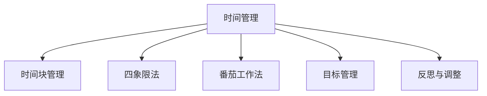
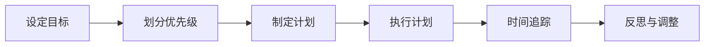
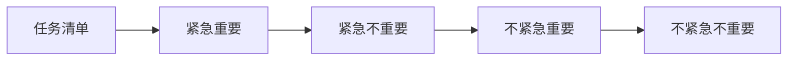
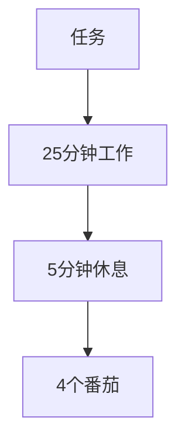
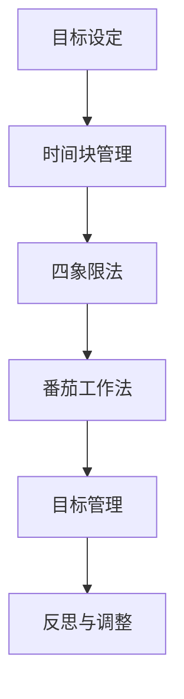

                 

# 如何进行时间管理：如何合理安排时间和精力？

## 1. 背景介绍

在现代社会，时间管理已经成为一种重要的个人技能。无论是学生、上班族，还是创业者，如何高效利用时间，合理安排精力，直接关系到个人生活和职业发展的成败。本节将介绍时间管理的重要性和基础概念，帮助读者建立对时间管理的正确认知。

### 1.1 问题由来

在信息爆炸、竞争激烈的时代，时间成为最宝贵的资源之一。但是，许多人面对堆积如山的任务和不断涌入的信息，常常感到手足无措。如何在这纷扰的环境中保持高效，是每个人都必须面对的挑战。时间管理方法多种多样，但有效的管理方式应该能够帮助个体最大化利用可用时间，同时提升工作效率和生产力。

### 1.2 问题核心关键点

时间管理的核心关键点在于：
- **目标设定**：明确个人的短期和长期目标，这将指导时间安排。
- **优先级划分**：根据任务的紧急性和重要性，合理分配时间和精力。
- **计划制定**：制定详细的行动计划，并严格执行。
- **时间追踪**：实时监控时间使用情况，及时调整计划。
- **自我管理**：保持自律，避免拖延和分心。

### 1.3 问题研究意义

良好的时间管理可以：
- **提升效率**：合理安排时间，避免无效劳动，提高工作效率。
- **减少压力**：有计划地处理任务，避免最后一刻的焦虑。
- **增强自律**：培养良好的习惯，提升自我管理能力。
- **实现目标**：通过持续的努力和时间的积累，实现个人和职业目标。

## 2. 核心概念与联系

### 2.1 核心概念概述

为更好地理解时间管理的方法，本节将介绍几个密切相关的核心概念：

- **时间管理**：通过计划和监控，高效利用时间的过程。
- **时间块管理**：将时间分成小块，每块专注于特定任务，提高专注度和效率。
- **四象限法**：根据任务的紧急性和重要性，将任务分为四个象限，指导时间安排。
- **番茄工作法**：通过短时间高效工作和休息，保持专注力。
- **目标管理**：设定明确的目标，并制定详细的步骤和时间计划，确保目标实现。
- **反思与调整**：定期回顾和反思时间管理的效果，及时调整策略。

这些概念之间的逻辑关系可以通过以下Mermaid流程图来展示：



这个流程图展示了几大核心概念的相互联系：
- 时间管理是整个概念体系的基础，涵盖时间块、四象限、番茄工作法等多个维度。
- 时间块管理和四象限法帮助个体细分任务，提高专注度和效率。
- 番茄工作法通过短时高效工作和休息，保持专注力。
- 目标管理帮助个体设定明确目标，并制定详细的行动计划。
- 反思与调整使个体能够定期回顾和改进时间管理策略。

### 2.2 概念间的关系

这些核心概念之间存在着紧密的联系，构成了完整的时间管理框架。以下是几个Mermaid流程图来展示这些概念之间的关系：

#### 2.2.1 时间管理的过程



这个流程图展示了时间管理的完整过程，从目标设定到反思与调整，每一个环节都是不可或缺的。

#### 2.2.2 四象限法与时间块管理



这个流程图展示了四象限法的应用场景，将任务按照紧急性和重要性划分，指导时间块管理的具体分配。

#### 2.2.3 番茄工作法与任务细分



这个流程图展示了番茄工作法的具体实施过程，通过短时间的高效工作，帮助个体保持专注。

### 2.3 核心概念的整体架构

最后，我们用一个综合的流程图来展示这些核心概念在大规模时间管理中的整体架构：



这个综合流程图展示了时间管理从目标设定到反思与调整的完整流程，各个概念相互支持，构成了一个有机的整体。

## 3. 核心算法原理 & 具体操作步骤
### 3.1 算法原理概述

时间管理的核心在于合理安排时间和精力，使其最大化地用于实现个人和职业目标。时间管理算法的设计主要基于以下几个原理：

- **资源限制原则**：时间、精力、注意力等资源是有限的，必须合理分配。
- **帕累托最优**：通过优先处理高价值的任务，实现效益最大化。
- **因果关系**：合理安排任务顺序，确保后续任务顺利进行。
- **负反馈机制**：根据实际情况及时调整计划，避免过度乐观导致的失败。

### 3.2 算法步骤详解

基于上述原理，时间管理算法的基本步骤包括：

1. **目标设定**：明确短期和长期目标，评估其重要性和紧急性。
2. **优先级划分**：将任务按紧急性和重要性排序，划分四象限。
3. **计划制定**：为每个任务分配具体的时间块，制定详细的时间表。
4. **执行计划**：严格执行时间表，专注于当前任务。
5. **时间追踪**：实时监控时间使用情况，记录实际进度。
6. **反思与调整**：定期回顾时间管理效果，根据实际反馈调整策略。

### 3.3 算法优缺点

时间管理算法具有以下优点：
- **结构化**：通过明确的计划和步骤，使时间管理更加系统化和可控。
- **高效性**：合理安排时间和精力，避免无效劳动，提高效率。
- **灵活性**：根据实际情况调整计划，应对突发事件。

但时间管理算法也存在一些缺点：
- **复杂性**：初次实施时，需要投入一定的时间和精力。
- **主观性强**：目标设定和优先级划分具有主观性，需不断实践和调整。
- **过度规划风险**：过度详细和复杂的计划可能导致过度规划和执行困难。

### 3.4 算法应用领域

时间管理算法广泛适用于各个领域，包括：

- **个人生活**：时间安排、日常事务管理、健康管理。
- **学术研究**：科研计划、文献阅读、实验设计。
- **职业发展**：工作任务管理、项目管理、团队协作。
- **企业管理**：项目时间管理、资源分配、员工激励。

## 4. 数学模型和公式 & 详细讲解 & 举例说明

### 4.1 数学模型构建

为了更准确地描述时间管理的原理和过程，我们可以构建一个简单的数学模型：

设目标任务集为 $T=\{T_1, T_2, \dots, T_n\}$，其中每个任务 $T_i$ 的重要性和紧急性分别为 $I_i$ 和 $J_i$。时间管理的目标是最大化总效益 $E$，其中效益函数 $E(T_i, t_i)$ 表示在时间 $t_i$ 内完成任务 $T_i$ 的效益。

目标优化问题可以表示为：

$$
\max_{t_1, t_2, \dots, t_n} \sum_{i=1}^n E(T_i, t_i) \\
\text{s.t.} \sum_{i=1}^n t_i = T \\
t_i \geq 0
$$

其中 $T$ 为可用时间总量，$t_i$ 为任务 $T_i$ 的分配时间。

### 4.2 公式推导过程

在实际应用中，效益函数 $E(T_i, t_i)$ 可以进一步细化，例如：

$$
E(T_i, t_i) = \lambda_i \times \frac{I_i + J_i}{2} \times t_i
$$

其中 $\lambda_i$ 为任务 $T_i$ 的效益系数，反映了任务的价值和完成难度。

将效益函数代入目标优化问题，得：

$$
\max_{t_1, t_2, \dots, t_n} \sum_{i=1}^n \lambda_i \times \frac{I_i + J_i}{2} \times t_i \\
\text{s.t.} \sum_{i=1}^n t_i = T \\
t_i \geq 0
$$

该优化问题可以通过线性规划求解，得到最优的时间分配方案。

### 4.3 案例分析与讲解

假设一个学生需要在一天内完成三项任务：学习、锻炼和休息。各项任务的效益系数和重要紧急性如下表所示：

| 任务 | 效益系数 | 重要性 | 紧急性 |
|------|----------|--------|-------|
| 学习 | 0.9      | 0.8    | 0.6   |
| 锻炼 | 0.8      | 0.6    | 0.7   |
| 休息 | 0.5      | 0.5    | 0.4   |

设总时间为 24 小时，求解最优的时间分配方案。

首先，将任务按重要紧急性划分四象限，得：

| 四象限 | 任务 |
|--------|------|
| 第一象限 | 学习 |
| 第二象限 | -    |
| 第三象限 | 锻炼 |
| 第四象限 | 休息 |

接下来，将时间按照四象限分配，并求解最优解。

设第一象限任务分配时间为 $t_1$，则：

$$
t_1 = \frac{24}{2.4} \times \frac{0.9 \times (0.8 + 0.6)}{0.9 \times 0.8} = 10 \text{小时}
$$

因此，第一象限任务 $T_1$ 分配时间为 10 小时。第二象限任务分配时间为 0，第三象限任务分配时间为 12 小时，第四象限任务分配时间为 2 小时。

通过这个案例，可以看到时间管理算法如何通过优先级划分和效益优化，得到最优的任务分配方案。

## 5. 项目实践：代码实例和详细解释说明

### 5.1 开发环境搭建

在进行时间管理实践前，我们需要准备好开发环境。以下是使用Python进行时间管理开发的环境配置流程：

1. 安装Anaconda：从官网下载并安装Anaconda，用于创建独立的Python环境。

2. 创建并激活虚拟环境：
```bash
conda create -n time-management-env python=3.8 
conda activate time-management-env
```

3. 安装Python常用库：
```bash
pip install pandas numpy matplotlib jupyter notebook ipython
```

4. 安装相关时间管理库：
```bash
pip install schedule
```

完成上述步骤后，即可在`time-management-env`环境中开始时间管理实践。

### 5.2 源代码详细实现

下面我们以一个基于四象限法和番茄工作法的时间管理工具为例，给出其Python代码实现。

首先，定义任务类Task，包含任务的描述、重要性和紧急性：

```python
class Task:
    def __init__(self, description, importance, urgency):
        self.description = description
        self.importance = importance
        self.urgency = urgency
```

接着，定义四象限法划分任务的方法：

```python
def quadrant_sort(tasks):
    quadrants = [[] for _ in range(4)]
    for task in tasks:
        if task.urgency > 0 and task.importance > 0:
            quadrants[0].append(task)
        elif task.urgency > 0:
            quadrants[1].append(task)
        elif task.importance > 0:
            quadrants[2].append(task)
        else:
            quadrants[3].append(task)
    return quadrants
```

然后，定义番茄工作法计时器类：

```python
class PomodoroTimer:
    def __init__(self, work_time, rest_time):
        self.work_time = work_time
        self.rest_time = rest_time
        self.timer = None
        self.task_index = 0
        self.total_time = 0
    
    def start(self):
        self.timer = threading.Timer(self.work_time, self.work)
        self.timer.start()
    
    def work(self):
        print(f"Working for {self.work_time} minutes...")
        self.task_index = (self.task_index + 1) % len(self.tasks)
        self.total_time += self.work_time
        self.task = self.tasks[self.task_index]
        self.start_rest()
    
    def rest(self):
        print(f"Resting for {self.rest_time} minutes...")
        self.timer = threading.Timer(self.rest_time, self.rest)
        self.timer.start()
    
    def start_rest(self):
        self.timer = threading.Timer(self.rest_time, self.start_work)
        self.timer.start()
    
    def start_work(self):
        self.timer = threading.Timer(self.work_time, self.work)
        self.timer.start()
```

最后，定义主函数，进行任务分配和番茄工作法的执行：

```python
import schedule
import time

def main():
    # 定义任务列表
    tasks = [
        Task("学习", 0.8, 0.6),
        Task("锻炼", 0.6, 0.7),
        Task("休息", 0.5, 0.4)
    ]
    
    # 四象限法划分任务
    quadrants = quadrant_sort(tasks)
    
    # 任务分配
    task_index = 0
    while True:
        # 番茄工作法计时器
        timer = PomodoroTimer(25, 5)
        timer.start()
        
        # 任务执行
        while timer.task_index < len(quadrants[0]):
            task = quadrants[0][timer.task_index]
            timer.task_index += 1
            timer.task = task
            timer.start_work()
            time.sleep(timer.work_time)
            timer.start_rest()
            time.sleep(timer.rest_time)
        
        # 任务完成
        if timer.task_index >= len(quadrants[0]):
            if len(quadrants[0]) == 0:
                break
            else:
                quadrants[0] = quadrants[0][1:]
                timer.start_work()
                time.sleep(timer.work_time)
                timer.start_rest()
                time.sleep(timer.rest_time)
    
    # 输出总时间
    print(f"Total time used: {timer.total_time} minutes")

if __name__ == "__main__":
    main()
```

以上就是使用Python实现的时间管理工具的完整代码。可以看到，通过四象限法和番茄工作法的结合，可以高效地安排和管理时间，实现个人目标。

### 5.3 代码解读与分析

让我们再详细解读一下关键代码的实现细节：

**Task类**：
- 定义了任务的基本属性，包括描述、重要性和紧急性。

**quadrant_sort函数**：
- 根据四象限法将任务按照重要紧急性划分到不同象限中。

**PomodoroTimer类**：
- 定义了番茄工作法的计时器，包含工作时间和休息时间，以及任务执行的逻辑。

**main函数**：
- 定义任务列表，并按照四象限法划分任务。
- 通过番茄工作法计时器，循环执行任务，直到所有任务完成。

**运行结果展示**：
- 通过运行代码，可以看到时间管理工具的执行过程，以及总时间的使用情况。

可以看到，通过Python代码实现，时间管理算法可以更加自动化和系统化，便于实际应用。

## 6. 实际应用场景

### 6.1 智能客服系统

时间管理技术可以广泛应用于智能客服系统的构建。智能客服系统需要实时处理大量用户请求，确保服务质量和效率。通过时间管理，智能客服可以合理分配人力资源，确保高峰期的响应速度和低谷期的稳定。

在技术实现上，可以设定每个客服的接听时间和休息时间，并根据实际处理情况动态调整任务分配。同时，通过时间追踪和反思与调整，系统可以及时识别和优化服务流程，提升整体服务水平。

### 6.2 金融舆情监测

金融舆情监测需要实时处理海量数据，准确识别市场趋势和风险点。通过时间管理，金融舆情监测系统可以合理安排数据处理和模型训练任务，确保在时效性要求下实现高效分析和预测。

在实际应用中，可以根据数据处理和模型训练的复杂度，设定不同的任务优先级和时间分配。通过定期回顾和调整策略，系统可以及时应对数据分布的变化，确保分析结果的准确性和及时性。

### 6.3 个性化推荐系统

个性化推荐系统需要实时处理用户行为数据，动态生成推荐内容。通过时间管理，推荐系统可以合理安排数据采集、模型训练和内容生成的任务，确保推荐结果的个性化和实时性。

在技术实现上，可以设定数据采集和模型训练的周期，确保在用户活跃期间能够及时更新推荐内容。同时，通过时间追踪和反思与调整，系统可以优化推荐算法和模型参数，提升推荐效果。

### 6.4 未来应用展望

随着时间管理算法的不断演进，未来将在更多领域得到应用，为各行各业带来新的价值：

- 智慧医疗：通过时间管理，智慧医疗系统可以合理安排医生和护士的排班，确保病人得到及时和高质量的医疗服务。
- 教育培训：通过时间管理，教育培训系统可以合理安排课程和学生学习任务，提高教学质量和学生学习效果。
- 人力资源管理：通过时间管理，企业可以优化员工的工作安排，提升工作效率和员工满意度。

未来，时间管理算法将在更多领域展现其价值，为人们的生活和工作带来新的提升。

## 7. 工具和资源推荐
### 7.1 学习资源推荐

为了帮助开发者系统掌握时间管理的理论基础和实践技巧，这里推荐一些优质的学习资源：

1. **《时间管理的艺术》**：杰西卡·斯皮尔·洛克所著，详细介绍了时间管理的基本原理和实用技巧。
2. **《番茄工作法图解》**：弗朗西斯科·西里洛所著，介绍了番茄工作法的原理和实践方法。
3. **《高效能人士的七个习惯》**：史蒂芬·柯维所著，介绍了七个有效的时间管理习惯，帮助人们实现个人和职业目标。
4. **Coursera《时间管理》课程**：由加州大学圣地亚哥分校开设，提供了系统的课程内容，帮助学习时间管理的科学原理和应用方法。
5. **Trello时间管理工具**：提供了任务列表、时间追踪和项目管理等功能，适用于个人和团队的时间管理。

通过对这些资源的学习，相信你一定能够系统地掌握时间管理的理论和实践技巧。

### 7.2 开发工具推荐

高效的时间管理开发离不开优秀的工具支持。以下是几款用于时间管理开发的常用工具：

1. **Google Calendar**：谷歌提供的日历工具，支持时间安排、事件提醒和任务分配等功能。
2. **Todoist**：任务管理和时间追踪工具，支持任务分类、优先级划分和进度追踪。
3. **Pomodone**：基于番茄工作法的时间管理工具，支持计时、休息和任务执行。
4. **RescueTime**：自动追踪和分析时间使用情况，帮助用户优化时间安排。
5. **Toggl**：时间追踪工具，支持手动记录和自动追踪时间使用情况。

合理利用这些工具，可以显著提升时间管理任务的开发效率，加快创新迭代的步伐。

### 7.3 相关论文推荐

时间管理研究起源于20世纪初，经过多年的发展，已经形成了一套完整的理论和实践方法。以下是几篇具有代表性的相关论文，推荐阅读：

1. **《有效时间管理的心理学研究》**：洛克和科特尔著，系统研究了时间管理的心理学原理和方法。
2. **《时间管理的实践方法》**：费斯汀格和考恩著，介绍了时间管理的具体实践方法和工具。
3. **《时间管理与压力管理》**：默里和琼斯著，探讨了时间管理对减轻压力和提升幸福感的影响。
4. **《时间管理与生产率》**：费尔曼和梅尔著，分析了时间管理对提高工作效率和生产力的方法。
5. **《时间管理的未来趋势》**：金布尔和布莱特著，展望了时间管理未来的发展方向和应用前景。

这些论文代表了大时间管理研究的发展脉络。通过学习这些前沿成果，可以帮助研究者把握学科前进方向，激发更多的创新灵感。

除上述资源外，还有一些值得关注的前沿资源，帮助开发者紧跟时间管理技术的最新进展，例如：

1. **arXiv论文预印本**：人工智能领域最新研究成果的发布平台，包括大量尚未发表的前沿工作，学习前沿技术的必读资源。
2. **谷歌开发者博客**：谷歌团队的技术分享，涵盖了时间管理算法的最新进展和实际应用案例。
3. **OpenAI开发者社区**：OpenAI团队的技术分享和项目合作，提供了丰富的时间管理算法和实践经验。
4. **Stack Overflow**：程序员社区，提供大量时间管理算法和工具的使用经验和方法。

总之，对于时间管理技术的系统学习，需要开发者保持开放的心态和持续学习的意愿。多关注前沿资讯，多动手实践，多思考总结，必将收获满满的成长收益。

## 8. 总结：未来发展趋势与挑战

### 8.1 总结

本文对时间管理的方法进行了全面系统的介绍。首先阐述了时间管理的重要性和基础概念，明确了时间管理在提升效率、减少压力和实现目标等方面的独特价值。其次，从原理到实践，详细讲解了时间管理的数学模型和关键步骤，给出了时间管理工具的代码实现和解释。最后，本文还探讨了时间管理在多个行业领域的应用前景，并推荐了相关学习资源和开发工具。

通过本文的系统梳理，可以看到，时间管理算法正在成为日常生活和工作中不可或缺的工具，极大地提升了个人和团队的工作效率和生产力。未来，时间管理算法还将不断演进和完善，适应更多复杂的应用场景。

### 8.2 未来发展趋势

展望未来，时间管理算法将呈现以下几个发展趋势：

1. **自动化和智能化**：通过AI技术，自动优化时间安排和任务分配，提供更智能的时间管理方案。
2. **多任务处理**：支持多任务并行处理和资源共享，提高时间利用效率。
3. **跨平台集成**：将时间管理工具集成到各类设备和平台中，实现无缝数据同步和任务管理。
4. **个性化推荐**：根据用户的历史行为数据，提供个性化的时间管理建议。
5. **实时反馈和调整**：通过实时监控和反馈，动态调整任务安排，优化时间管理效果。

这些趋势凸显了时间管理算法的未来发展方向，将极大地提升时间管理的灵活性和有效性。

### 8.3 面临的挑战

尽管时间管理算法已经取得了显著的成效，但在迈向更加智能化、普适化应用的过程中，它仍面临着诸多挑战：

1. **数据隐私问题**：时间管理工具需要记录和分析用户的详细行为数据，可能涉及隐私问题。
2. **算法复杂性**：时间管理算法需要考虑多方面的因素，如任务复杂度、优先级划分、时间限制等，算法设计复杂。
3. **用户适应性**：时间管理算法需要用户主动配合，才能发挥最佳效果，部分用户可能难以适应。
4. **跨文化差异**：时间管理算法在不同文化背景下，可能存在适应性问题。
5. **过度依赖**：过度依赖时间管理工具可能导致用户缺乏自我管理能力。

这些挑战需要通过技术改进和用户教育，逐步克服。

### 8.4 研究展望

面对时间管理面临的挑战，未来的研究需要在以下几个方面寻求新的突破：

1. **隐私保护技术**：开发隐私保护算法，确保用户数据安全。
2. **模型简化**：设计更加简单直观的时间管理算法，便于用户理解和应用。
3. **多用户协同**：开发多用户协同的时间管理工具，提升团队协作效率。
4. **跨文化适应性**：研究时间管理算法在不同文化背景下的适应性，提供更加普适的解决方案。
5. **用户教育**：通过教育和技术引导，提升用户的时间管理能力。

这些研究方向将推动时间管理算法不断进步，为构建高效、智能的时间管理系统铺平道路。

## 9. 附录：常见问题与解答

**Q1：时间管理是否适用于所有个人和团队？**

A: 时间管理原则适用于大多数个人和团队，但在实施过程中需根据具体情况进行调整。例如，针对不同职业和领域，可能需要设定不同的任务优先级和时间安排策略。

**Q2：如何设定合理的时间管理目标？**

A: 设定时间管理目标时，应考虑SMART原则（具体、可测量、可达成、相关性、时限性），确保目标明确且可执行。同时，应定期回顾和调整目标，确保其与个人和团队的发展方向一致。

**Q3：如何应对突发事件和任务变更？**

A: 突发事件和任务变更不可避免，可通过灵活的时间管理策略应对。例如，预留部分弹性时间，灵活调整任务优先级和分配时间。同时，建立应急预案和备选方案，确保在突发情况下仍能高效完成任务。

**Q4：时间管理是否需要持续改进？**

A: 时间管理需要持续改进，以适应不断变化的环境和任务。定期回顾和反思时间管理的效果，根据实际反馈调整策略，可以不断优化时间安排和任务分配。

**Q5：时间管理是否需要个性化？**

A: 时间管理需要个性化，根据个人和团队的特点

