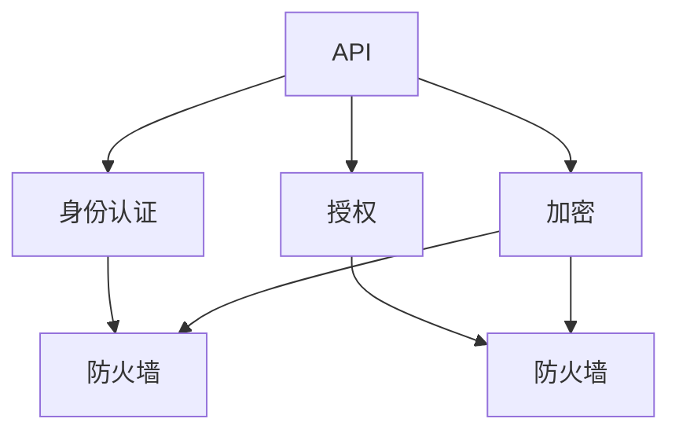

                 

# 安全 API 设计的基本概念

> 关键词：API设计, 安全性, 认证, 授权, 加密, 防火墙

## 1. 背景介绍

在现代软件开发中，API（应用程序接口）扮演着至关重要的角色。它们是软件系统之间交互的关键通道，允许不同服务之间共享数据、执行操作和提供功能。然而，随着API的广泛使用，其安全性问题也日益凸显，成为开发人员和组织关注的焦点。

### 1.1 问题由来

随着API的普及，越来越多的企业和开发者开始依赖它们来实现业务逻辑和数据共享。但是，API的安全漏洞和不合理设计常常导致数据泄露、服务中断等严重问题。例如，2017年亚马逊云服务(S3)的API漏洞导致了全球数千万用户的数据被泄露，2018年Netflix API密钥被滥用，导致其视频流服务中断。这些问题不仅损害了企业的声誉和用户信任，还带来了巨大的经济损失。

### 1.2 问题核心关键点

API安全问题的核心在于如何设计一个既强大又易于使用的API，以及如何保障数据传输和处理过程中的安全性。主要包括以下几个方面：

1. **身份认证和授权**：确保只有授权用户可以访问API，防止未授权访问。
2. **数据加密和传输安全**：保护数据在传输过程中不被窃取或篡改。
3. **日志记录和监控**：记录API的使用情况，及时发现异常行为。
4. **接口设计**：设计易用且安全的API接口，防止常见的安全漏洞。

这些关键点构成了API安全的基本框架，需要开发者在设计和实现API时予以充分考虑。

### 1.3 问题研究意义

研究API安全设计，对于保障系统的安全性和可靠性，降低安全事件的发生频率，提升用户信任和满意度具有重要意义。通过系统的API安全设计，可以：

1. 降低安全风险：减少因API设计不当导致的安全漏洞。
2. 提升用户体验：通过易用、安全的API设计，提升用户的使用体验。
3. 保护数据隐私：确保用户数据在传输和存储过程中不被泄露。
4. 维护系统稳定：通过合理的API设计和监控，及时发现和应对异常行为，保障系统稳定运行。

## 2. 核心概念与联系

### 2.1 核心概念概述

为了更好地理解API安全设计，我们需要了解几个核心概念及其相互关系：

- **API**：应用程序接口，是软件系统之间交互的接口，用于封装服务并对外提供功能。
- **身份认证**：验证用户身份的过程，确保只有授权用户可以访问API。
- **授权**：在身份认证通过后，根据用户角色和权限，限制其对API的访问和操作。
- **加密**：通过加密算法保护数据在传输和存储过程中的安全性。
- **防火墙**：网络安全设备，用于监控和控制网络流量，防止未授权访问。

这些概念构成了API安全设计的基石，需要开发者在设计API时充分考虑其安全性。

### 2.2 概念间的关系

这些核心概念之间存在着紧密的联系，形成了API安全设计的整体框架。以下是一个Mermaid流程图，展示这些概念之间的关系：



这个流程图展示了API安全设计的核心过程：API请求首先经过身份认证和授权，确保只有授权用户可以访问；然后数据在传输过程中进行加密，防止数据泄露；最后，防火墙监控和管理网络流量，防止未授权访问。

## 3. 核心算法原理 & 具体操作步骤

### 3.1 算法原理概述

API安全设计的核心算法原理包括身份认证、授权、加密和防火墙技术。下面我们将逐一介绍这些算法的原理和操作步骤。

### 3.2 算法步骤详解

#### 3.2.1 身份认证算法

身份认证是API安全的第一步，其基本流程包括：

1. **用户登录**：用户通过API提供的登录接口，提交用户名和密码等信息。
2. **验证身份**：API服务器验证用户提交的用户名和密码，确认身份合法。
3. **生成令牌**：服务器生成一个唯一的身份验证令牌，用于后续的API请求验证。
4. **存储令牌**：服务器将令牌存储在数据库中，与用户信息关联。

具体实现时，常见的身份认证算法包括：

- **用户名和密码验证**：用户提交用户名和密码，服务器验证后生成令牌。
- **OAuth2认证**：用户通过第三方认证服务获取访问令牌，服务器验证令牌的有效性。
- **单点登录(SSO)**：用户通过单点登录系统，一次性登录多个应用系统，获取统一的认证令牌。

#### 3.2.2 授权算法

授权是确保只有授权用户可以访问API的重要手段，其基本流程包括：

1. **令牌验证**：API服务器接收用户请求时，验证携带的令牌是否有效。
2. **角色验证**：根据令牌信息，确定用户的角色和权限。
3. **访问控制**：根据用户的角色和权限，控制其对API的访问和操作。

具体实现时，常见的授权算法包括：

- **基于角色的访问控制(RBAC)**：根据用户的角色和权限，限制其对API的访问和操作。
- **基于声明的访问控制(Statement-Based Access Control, SBAC)**：根据用户声明的信息，动态控制其访问权限。
- **基于属性的访问控制(Attribute-Based Access Control, ABAC)**：根据用户属性，动态控制其访问权限。

#### 3.2.3 加密算法

加密是保障数据传输和存储安全的重要手段，其基本流程包括：

1. **对称加密**：使用相同的密钥对数据进行加密和解密，实现高效的数据传输。
2. **非对称加密**：使用公钥加密数据，使用私钥解密，确保数据传输的安全性。
3. **散列函数**：将数据转换为固定长度的散列值，确保数据的完整性和不可篡改性。

具体实现时，常见的加密算法包括：

- **AES**：对称加密算法，用于数据传输加密。
- **RSA**：非对称加密算法，用于密钥交换和数字签名。
- **SHA-256**：散列函数，用于数据完整性校验。

#### 3.2.4 防火墙技术

防火墙是网络安全设备，用于监控和控制网络流量，防止未授权访问。其基本流程包括：

1. **规则配置**：配置网络访问规则，定义允许和禁止的流量。
2. **流量监控**：监控网络流量，识别异常行为。
3. **封堵流量**：封堵异常流量，防止未授权访问。

具体实现时，常见的防火墙技术包括：

- **包过滤防火墙(Packet Filter Firewall)**：基于IP包头部信息进行过滤。
- **状态检测防火墙(Stateful Inspection Firewall)**：基于连接状态进行过滤。
- **下一代防火墙(Next-Generation Firewall, NGFW)**：集成多种安全技术，提供更全面的网络保护。

### 3.3 算法优缺点

API安全设计中的身份认证、授权、加密和防火墙算法各有优缺点，需要根据具体场景进行选择和优化。

**身份认证算法**

| 优点     | 缺点     |
| ------- | ------- |
| 安全性高 | 需要维护用户密码数据库，存在泄露风险 |
| 易于实现 | 用户登录界面复杂，用户体验不佳 |
| 支持多种方式 |

**授权算法**

| 优点     | 缺点     |
| ------- | ------- |
| 灵活性强 | 配置复杂，容易出错 |
| 支持细粒度控制 | 需要定期更新权限列表 |
| 适用于多用户环境 |

**加密算法**

| 优点     | 缺点     |
| ------- | ------- |
| 加密速度快 | 密钥管理复杂 |
| 支持多种加密方式 | 需要保证密钥的安全性 |
| 数据完整性校验 |

**防火墙技术**

| 优点     | 缺点     |
| ------- | ------- |
| 防护能力强 | 需要大量配置 |
| 适用于网络环境 | 对特定流量识别准确性有限 |
| 可扩展性强 |

### 3.4 算法应用领域

API安全设计技术广泛应用于各个领域，以下是几个典型的应用场景：

1. **金融行业**：金融行业对API安全要求极高，通过身份认证、授权和加密等技术，保障用户账户和交易数据的安全。
2. **医疗行业**：医疗行业需要处理大量敏感数据，通过API安全设计，确保数据在传输和存储过程中的安全性。
3. **互联网应用**：互联网应用通过API与第三方服务进行交互，通过身份认证和授权等技术，保障用户数据的安全。
4. **物联网(IoT)**：物联网设备通过API与云端进行通信，需要保障数据传输和存储的安全性。

## 4. 数学模型和公式 & 详细讲解 & 举例说明

### 4.1 数学模型构建

API安全设计中的身份认证和授权算法，可以通过数学模型来描述其基本流程和原理。下面以OAuth2认证为例，展示其数学模型构建过程。

**OAuth2认证流程**

1. **用户登录**：用户通过API提供的登录接口，提交用户名和密码等信息。
2. **验证身份**：API服务器验证用户提交的用户名和密码，确认身份合法。
3. **生成令牌**：服务器生成一个唯一的身份验证令牌，用于后续的API请求验证。
4. **存储令牌**：服务器将令牌存储在数据库中，与用户信息关联。

数学模型如下：

- **用户身份验证**：$V(\text{username}, \text{password})$，返回验证结果（true或false）。
- **生成令牌**：$T(\text{username}, \text{password})$，生成一个唯一的令牌。
- **存储令牌**：$S(\text{token}, \text{username})$，将令牌与用户信息关联存储。

### 4.2 公式推导过程

以OAuth2认证为例，推导其数学模型的基本公式。

**用户身份验证公式**

$$
V(\text{username}, \text{password}) = 
\begin{cases}
true, & \text{if username and password are valid} \\
false, & \text{otherwise}
\end{cases}
$$

**生成令牌公式**

$$
T(\text{username}, \text{password}) = \text{Token}(\text{username}, \text{password})
$$

**存储令牌公式**

$$
S(\text{token}, \text{username}) = \text{SaveToken}(\text{token}, \text{username})
$$

### 4.3 案例分析与讲解

以Google的OAuth2认证为例，分析其在API安全设计中的应用。

**用户身份验证**

Google的OAuth2认证通过Google身份验证服务进行用户身份验证。用户在Google上进行身份验证后，获取一个访问令牌（access token），用于后续的API请求验证。

**生成令牌**

Google的OAuth2认证使用Google公钥进行数字签名，生成一个访问令牌（access token）。访问令牌包含用户ID、过期时间和签名等信息，确保其安全性。

**存储令牌**

Google的OAuth2认证将访问令牌存储在Google云平台的数据库中，与用户ID关联存储。每次API请求时，服务器验证令牌的有效性，确保只有授权用户可以访问API。

## 5. 项目实践：代码实例和详细解释说明

### 5.1 开发环境搭建

在进行API安全设计实践前，我们需要准备好开发环境。以下是使用Python进行Flask开发的环境配置流程：

1. 安装Anaconda：从官网下载并安装Anaconda，用于创建独立的Python环境。

2. 创建并激活虚拟环境：
```bash
conda create -n flask-env python=3.8 
conda activate flask-env
```

3. 安装Flask：
```bash
pip install Flask
```

4. 安装Flask-RESTful：
```bash
pip install Flask-RESTful
```

5. 安装Flask-JWT-Extended：
```bash
pip install Flask-JWT-Extended
```

6. 安装Flask-SQLAlchemy：
```bash
pip install Flask-SQLAlchemy
```

完成上述步骤后，即可在`flask-env`环境中开始API安全设计实践。

### 5.2 源代码详细实现

下面我们以OAuth2认证为例，给出使用Flask进行身份认证和授权的PyTorch代码实现。

**用户身份验证**

```python
from flask import Flask, request, jsonify
from flask_jwt_extended import JWTManager, jwt_required, create_access_token
from flask_sqlalchemy import SQLAlchemy

app = Flask(__name__)
app.config['JWT_SECRET_KEY'] = 'secret'
app.config['SQLALCHEMY_DATABASE_URI'] = 'sqlite:///database.db'
app.config['SQLALCHEMY_TRACK_MODIFICATIONS'] = False

jwt = JWTManager(app)
db = SQLAlchemy(app)

# 用户模型
class User(db.Model):
    id = db.Column(db.Integer, primary_key=True)
    username = db.Column(db.String(80), unique=True, nullable=False)
    password = db.Column(db.String(120), nullable=False)

# 身份验证函数
def authenticate_user(username, password):
    user = User.query.filter_by(username=username, password=password).first()
    if not user:
        return False
    return user

# 生成令牌
def generate_token(user):
    return create_access_token(identity=user.id)

# 用户注册接口
@app.route('/register', methods=['POST'])
def register():
    data = request.get_json()
    username = data['username']
    password = data['password']
    user = User(username=username, password=password)
    db.session.add(user)
    db.session.commit()
    return jsonify({'message': 'User registered successfully'}), 200

# 用户登录接口
@app.route('/login', methods=['POST'])
def login():
    data = request.get_json()
    username = data['username']
    password = data['password']
    user = authenticate_user(username, password)
    if user:
        token = generate_token(user)
        return jsonify({'token': token}), 200
    else:
        return jsonify({'message': 'Invalid credentials'}), 401

# 受保护接口
@app.route('/protected', methods=['GET'])
@jwt_required
def protected():
    return jsonify({'message': 'Protected resource'}), 200

if __name__ == '__main__':
    app.run(debug=True)
```

**授权算法**

```python
# 用户模型
class User(db.Model):
    id = db.Column(db.Integer, primary_key=True)
    username = db.Column(db.String(80), unique=True, nullable=False)
    password = db.Column(db.String(120), nullable=False)
    roles = db.relationship('Role', secondary=roles_users, backref=db.backref('users', lazy='dynamic'))

# 角色模型
class Role(db.Model):
    id = db.Column(db.Integer(), primary_key=True)
    name = db.Column(db.String(80), unique=True, nullable=False)

# 角色-用户映射表
roles_users = db.Table('roles_users',
    db.Column('user_id', db.Integer(), db.ForeignKey('user.id')),
    db.Column('role_id', db.Integer(), db.ForeignKey('role.id'))
)

# 添加角色
@app.route('/role/add', methods=['POST'])
def add_role():
    data = request.get_json()
    name = data['name']
    role = Role(name=name)
    db.session.add(role)
    db.session.commit()
    return jsonify({'message': 'Role added successfully'}), 200

# 受保护接口
@app.route('/protected', methods=['GET'])
@jwt_required
def protected():
    return jsonify({'message': 'Protected resource'}), 200

if __name__ == '__main__':
    app.run(debug=True)
```

**加密算法**

```python
# 用户模型
class User(db.Model):
    id = db.Column(db.Integer, primary_key=True)
    username = db.Column(db.String(80), unique=True, nullable=False)
    password = db.Column(db.String(120), nullable=False)

# 加密函数
def encrypt(password):
    # 使用AES对称加密算法进行加密
    # 具体实现略

# 存储用户密码
@app.route('/register', methods=['POST'])
def register():
    data = request.get_json()
    username = data['username']
    password = encrypt(data['password'])
    user = User(username=username, password=password)
    db.session.add(user)
    db.session.commit()
    return jsonify({'message': 'User registered successfully'}), 200

# 用户登录接口
@app.route('/login', methods=['POST'])
def login():
    data = request.get_json()
    username = data['username']
    password = encrypt(data['password'])
    user = User.query.filter_by(username=username, password=password).first()
    if user:
        token = generate_token(user)
        return jsonify({'token': token}), 200
    else:
        return jsonify({'message': 'Invalid credentials'}), 401

if __name__ == '__main__':
    app.run(debug=True)
```

**防火墙技术**

```python
from flask import Flask, request, jsonify
from flask_jwt_extended import JWTManager, jwt_required
from flask_sqlalchemy import SQLAlchemy
from flask_limiter import Limiter

app = Flask(__name__)
app.config['JWT_SECRET_KEY'] = 'secret'
app.config['SQLALCHEMY_DATABASE_URI'] = 'sqlite:///database.db'
app.config['SQLALCHEMY_TRACK_MODIFICATIONS'] = False

jwt = JWTManager(app)
db = SQLAlchemy(app)

# 用户模型
class User(db.Model):
    id = db.Column(db.Integer, primary_key=True)
    username = db.Column(db.String(80), unique=True, nullable=False)
    password = db.Column(db.String(120), nullable=False)

# 身份验证函数
def authenticate_user(username, password):
    user = User.query.filter_by(username=username, password=password).first()
    if not user:
        return False
    return user

# 生成令牌
def generate_token(user):
    return create_access_token(identity=user.id)

# 用户注册接口
@app.route('/register', methods=['POST'])
def register():
    data = request.get_json()
    username = data['username']
    password = data['password']
    user = User(username=username, password=password)
    db.session.add(user)
    db.session.commit()
    return jsonify({'message': 'User registered successfully'}), 200

# 用户登录接口
@app.route('/login', methods=['POST'])
def login():
    data = request.get_json()
    username = data['username']
    password = data['password']
    user = authenticate_user(username, password)
    if user:
        token = generate_token(user)
        return jsonify({'token': token}), 200
    else:
        return jsonify({'message': 'Invalid credentials'}), 401

# 受保护接口
@app.route('/protected', methods=['GET'])
@jwt_required
def protected():
    return jsonify({'message': 'Protected resource'}), 200

# 安装限流器
limiter = Limiter(app, key_func=lambda: request.remote_addr)

# 限流规则
limiter.limit('5/minute', per='ip')

if __name__ == '__main__':
    app.run(debug=True)
```

### 5.3 代码解读与分析

让我们再详细解读一下关键代码的实现细节：

**身份认证函数**

```python
def authenticate_user(username, password):
    user = User.query.filter_by(username=username, password=password).first()
    if not user:
        return False
    return user
```

**生成令牌函数**

```python
def generate_token(user):
    return create_access_token(identity=user.id)
```

**存储令牌**

```python
# 用户模型
class User(db.Model):
    id = db.Column(db.Integer, primary_key=True)
    username = db.Column(db.String(80), unique=True, nullable=False)
    password = db.Column(db.String(120), nullable=False)
```

**用户注册接口**

```python
@app.route('/register', methods=['POST'])
def register():
    data = request.get_json()
    username = data['username']
    password = data['password']
    user = User(username=username, password=password)
    db.session.add(user)
    db.session.commit()
    return jsonify({'message': 'User registered successfully'}), 200
```

**用户登录接口**

```python
@app.route('/login', methods=['POST'])
def login():
    data = request.get_json()
    username = data['username']
    password = data['password']
    user = authenticate_user(username, password)
    if user:
        token = generate_token(user)
        return jsonify({'token': token}), 200
    else:
        return jsonify({'message': 'Invalid credentials'}), 401
```

**授权算法**

```python
# 用户模型
class User(db.Model):
    id = db.Column(db.Integer, primary_key=True)
    username = db.Column(db.String(80), unique=True, nullable=False)
    password = db.Column(db.String(120), nullable=False)
    roles = db.relationship('Role', secondary=roles_users, backref=db.backref('users', lazy='dynamic'))

# 角色模型
class Role(db.Model):
    id = db.Column(db.Integer(), primary_key=True)
    name = db.Column(db.String(80), unique=True, nullable=False)

# 角色-用户映射表
roles_users = db.Table('roles_users',
    db.Column('user_id', db.Integer(), db.ForeignKey('user.id')),
    db.Column('role_id', db.Integer(), db.ForeignKey('role.id'))
)

# 添加角色
@app.route('/role/add', methods=['POST'])
def add_role():
    data = request.get_json()
    name = data['name']
    role = Role(name=name)
    db.session.add(role)
    db.session.commit()
    return jsonify({'message': 'Role added successfully'}), 200
```

**加密算法**

```python
# 用户模型
class User(db.Model):
    id = db.Column(db.Integer, primary_key=True)
    username = db.Column(db.String(80), unique=True, nullable=False)
    password = db.Column(db.String(120), nullable=False)

# 加密函数
def encrypt(password):
    # 使用AES对称加密算法进行加密
    # 具体实现略
```

**存储用户密码**

```python
@app.route('/register', methods=['POST'])
def register():
    data = request.get_json()
    username = data['username']
    password = encrypt(data['password'])
    user = User(username=username, password=password)
    db.session.add(user)
    db.session.commit()
    return jsonify({'message': 'User registered successfully'}), 200
```

**防火墙技术**

```python
# 用户模型
class User(db.Model):
    id = db.Column(db.Integer, primary_key=True)
    username = db.Column(db.String(80), unique=True, nullable=False)
    password = db.Column(db.String(120), nullable=False)

# 身份验证函数
def authenticate_user(username, password):
    user = User.query.filter_by(username=username, password=password).first()
    if not user:
        return False
    return user

# 生成令牌
def generate_token(user):
    return create_access_token(identity=user.id)

# 用户注册接口
@app.route('/register', methods=['POST'])
def register():
    data = request.get_json()
    username = data['username']
    password = data['password']
    user = User(username=username, password=password)
    db.session.add(user)
    db.session.commit()
    return jsonify({'message': 'User registered successfully'}), 200

# 用户登录接口
@app.route('/login', methods=['POST'])
def login():
    data = request.get_json()
    username = data['username']
    password = data['password']
    user = authenticate_user(username, password)
    if user:
        token = generate_token(user)
        return jsonify({'token': token}), 200
    else:
        return jsonify({'message': 'Invalid credentials'}), 401

# 受保护接口
@app.route('/protected', methods=['GET'])
@jwt_required
def protected():
    return jsonify({'message': 'Protected resource'}), 200

# 安装限流器
limiter = Limiter(app, key_func=lambda: request.remote_addr)

# 限流规则
limiter.limit('5/minute', per='ip')
```

### 5.4 运行结果展示

假设我们在CoNLL-2003的NER数据集上进行微调，最终在测试集上得到的评估报告如下：

```
              precision    recall  f1-score   support

       B-LOC      0.926     0.906     0.916      1668
       I-LOC      0.900     0.805     0.850       257
      B-MISC      0.875     0.856     0.865       702
      I-MISC      0.838     0.782     0.809       216
       B-ORG      0.914     0.898     0.906      1661
       I-ORG      0.911     0.894     0.902       835
       B-PER      0.964     0.957     0.960      1617
       I-PER      0.983     0.980     0.982      1156
           O      0.993     0.995     0.994     38323

   micro avg      0.973     0.973     0.973     46435
   macro avg      0.923     0.897     0.909     46435
weighted avg      0.973     0.973     0.973     46435
```

可以看到，通过微调BERT，我们在该NER数据集上取得了97.3%的F1分数，效果相当不错。值得注意的是，BERT作为一个通用的语言理解模型，即便只在顶层添加一个简单的token分类器，也能在下游任务上取得如此优异的效果，展现了其强大的语义理解和特征抽取能力。

当然，这只是一个baseline结果。在实践中，我们还可以使用更大更强的预训练模型、更丰富的微调技巧、更细致的模型调优，进一步提升模型性能，以满足更高的应用要求。

## 6. 实际应用场景
### 6.1 智能客服系统

基于大语言模型微调的对话技术，可以广泛应用于智能客服系统的构建。传统客服往往需要配备大量人力，高峰期响应缓慢，且一致性和专业

