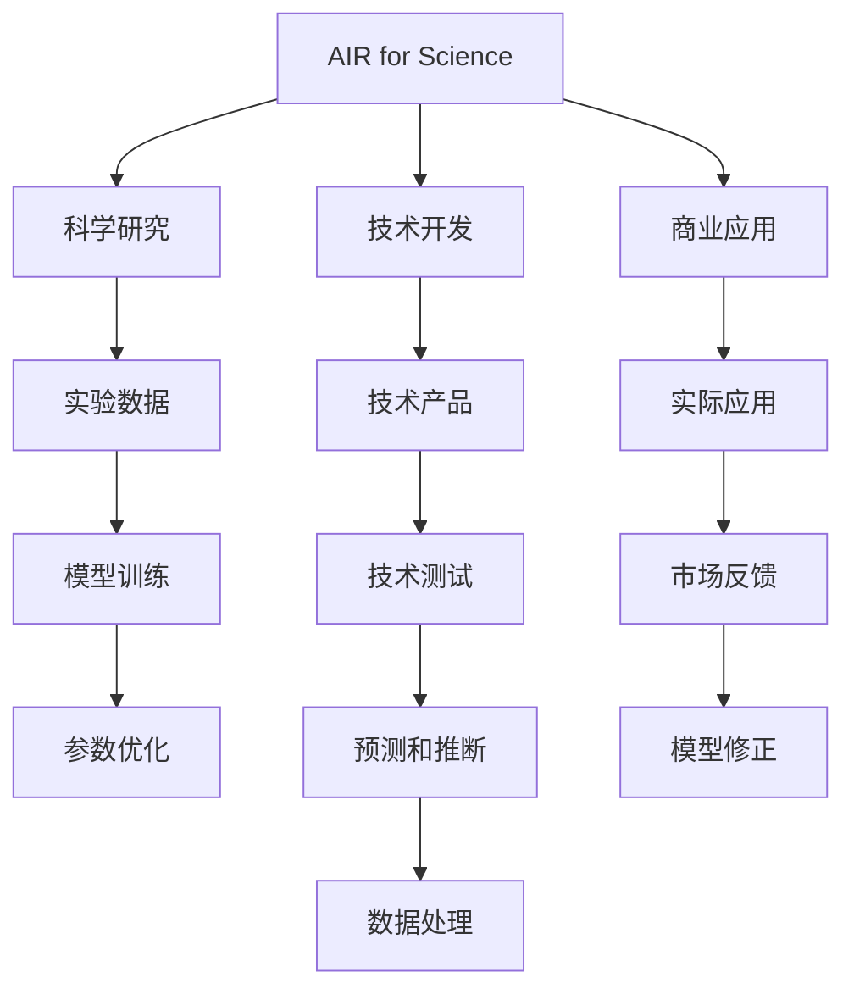

                 

## 1. 背景介绍

### 1.1 问题由来

在现代经济活动中，人工智能（AI）正成为推动产业创新、提升效率的关键驱动力。特别是人工智能与科学研究、技术开发和商业应用相结合的“AI for Science”范式，正在为实体经济带来革命性的变革。但与此同时，将AI技术与科学研究的深度结合仍面临诸多挑战。

### 1.2 问题核心关键点

“AI for Science”的本质是将AI技术应用到科学研究、技术开发、商业应用等实体经济活动中，以数据驱动、智能分析为核心，实现科学发现、技术突破和商业价值的协同提升。

其核心关键点包括：
- 数据驱动：科学研究和商业应用必须以海量数据为基础，通过数据挖掘和分析揭示本质规律。
- 智能分析：利用AI算法进行模型训练、参数优化、预测和推断，提高数据分析的准确性和效率。
- 多学科融合：AI技术与不同领域的知识体系融合，推动科学发现、技术创新和商业应用的多领域交叉与协同。
- 持续迭代：基于实证结果的模型修正和优化，持续迭代改进，不断提升科学研究和商业决策的精准度。

### 1.3 问题研究意义

“AI for Science”对推动实体经济的发展具有重大意义：

1. **加速科学发现**：AI技术可以处理海量实验数据，加速科学发现的步伐，提高科学研究的效率和质量。
2. **优化技术开发**：AI技术在技术设计和测试中的应用，可缩短研发周期，降低研发成本，提高技术产品的性能和可靠性。
3. **促进商业创新**：AI技术在市场营销、客户分析、供应链管理等方面的应用，可以驱动企业商业模式的创新，提升市场竞争力。
4. **解决实际问题**：AI技术能够针对具体问题和需求，提供精确的数据分析和预测，为决策提供科学依据。
5. **推动经济发展**：AI技术在各产业的广泛应用，将极大促进经济发展，提升产业竞争力。

## 2. 核心概念与联系

### 2.1 核心概念概述

为了深入理解“AI for Science”，首先需要介绍几个核心概念：

- **AI for Science**：将AI技术应用到科学研究、技术开发和商业应用中的范式，旨在通过数据驱动、智能分析实现科学发现、技术突破和商业价值的协同提升。
- **科学研究**：利用数学模型、实验数据等方法探索自然和社会的规律，推动科学进步。
- **技术开发**：将科学研究成果转化为实际的技术产品或解决方案的过程，涵盖技术设计、测试、应用等环节。
- **商业应用**：将技术产品或解决方案应用到实际商业活动中，实现商业价值的最大化。
- **数据驱动**：依赖数据进行模型训练、参数优化和预测，使AI模型具备强大的自适应和学习能力。
- **智能分析**：利用AI算法进行数据分析、预测和推断，提高数据处理的效率和精度。
- **多学科融合**：AI技术与自然科学、社会科学、工程学等多学科知识的融合，推动跨领域交叉研究。

这些核心概念之间的逻辑关系可以通过以下Mermaid流程图来展示：



这个流程图展示了大语言模型微调过程中各个核心概念之间的关系：

1. 科学研究通过数据驱动，利用智能分析方法揭示规律。
2. 技术开发依赖科学研究的结果，通过模型训练、参数优化等技术手段，开发技术产品。
3. 商业应用将技术产品应用到实际业务中，实现商业价值。
4. 在各环节中，数据处理和模型修正不断迭代，提升AI模型的准确性和鲁棒性。

### 2.2 概念间的关系

这些核心概念之间存在密切的联系，共同构成“AI for Science”的整体框架：

- **科学研究与数据驱动**：科学研究依赖数据驱动，通过实验数据和统计分析，揭示自然和社会的规律。
- **技术开发与智能分析**：技术开发需要依赖智能分析，通过AI算法对数据进行处理，加速技术产品的开发和测试。
- **商业应用与实际问题**：商业应用需要解决实际问题，通过AI技术提供精准的数据分析和预测，优化商业决策。
- **多学科融合与跨领域研究**：AI技术与多学科知识的融合，推动跨领域交叉研究，实现科学、技术、商业的协同提升。

这些概念的相互促进和支持，共同推动“AI for Science”范式的形成和发展。

## 3. 核心算法原理 & 具体操作步骤
### 3.1 算法原理概述

“AI for Science”的实现过程中，算法原理主要包括以下几个方面：

- **数据预处理**：收集和整理大量实验数据，进行特征提取、数据清洗和标准化处理。
- **模型训练**：利用AI算法对数据进行模型训练，调整模型参数以优化性能。
- **参数优化**：通过正则化、交叉验证等方法，对模型参数进行优化，提高模型的鲁棒性和泛化能力。
- **预测和推断**：利用训练好的模型进行数据预测和推断，验证模型的准确性和可靠性。
- **模型修正**：基于实证结果，对模型进行修正和优化，不断迭代改进，提升模型的精度和泛化能力。

### 3.2 算法步骤详解

基于“AI for Science”的算法实现，一般包括以下关键步骤：

1. **数据收集与整理**：
   - 收集实验数据，并进行预处理，如数据清洗、特征提取和标准化。
   - 将数据划分为训练集、验证集和测试集，确保模型评估的准确性。

2. **模型选择与设计**：
   - 选择适合的AI算法，如神经网络、深度学习、强化学习等。
   - 设计模型结构，包括层数、激活函数、损失函数等。

3. **模型训练与优化**：
   - 利用训练集对模型进行训练，调整模型参数。
   - 使用正则化、Dropout等方法，防止模型过拟合。
   - 通过交叉验证，选择最优的模型参数和超参数组合。

4. **模型评估与验证**：
   - 在验证集上评估模型性能，检查模型的泛化能力。
   - 根据评估结果，调整模型参数和超参数，提高模型的准确性和鲁棒性。

5. **模型应用与迭代**：
   - 将训练好的模型应用到实际问题中，进行预测和推断。
   - 收集反馈数据，进行模型修正和优化。
   - 不断迭代模型，提高模型的精度和泛化能力。

### 3.3 算法优缺点

“AI for Science”的算法具有以下优点：

- **高效性**：通过数据驱动和智能分析，提高了科学研究和商业决策的效率和准确性。
- **灵活性**：算法可以根据实际需求进行调整和优化，适应不同的应用场景。
- **可扩展性**：AI算法可以处理海量数据，适用于不同规模和复杂度的科学研究和技术开发。

同时，也存在一些缺点：

- **数据依赖**：模型的性能依赖于高质量的数据，数据的获取和处理成本较高。
- **模型复杂性**：AI算法复杂，需要大量计算资源和时间进行模型训练和优化。
- **模型解释性不足**：部分AI算法如深度学习模型的黑盒特性，难以解释模型的决策过程。
- **模型鲁棒性不足**：模型面对噪声数据和异常情况，易发生误判。

### 3.4 算法应用领域

“AI for Science”的应用领域非常广泛，涵盖多个领域：

- **生物医药**：利用AI技术对基因组数据、临床数据等进行分析，加速新药研发和疾病诊断。
- **材料科学**：通过AI技术对材料性质进行预测和模拟，优化材料设计和合成。
- **环境科学**：利用AI技术分析气候数据、环境监测数据等，预测环境变化，制定环保政策。
- **经济金融**：利用AI技术对经济数据、金融市场数据等进行分析，优化投资决策和经济调控。
- **社会治理**：利用AI技术分析社会数据、舆情数据等，优化公共政策和风险管理。
- **工业制造**：利用AI技术对生产数据、设备数据等进行分析，优化生产流程和设备维护。
- **农业生产**：利用AI技术对农作物种类、气候数据等进行分析，优化农业生产和管理。
- **能源管理**：利用AI技术对能源数据进行分析，优化能源使用和调度。

## 4. 数学模型和公式 & 详细讲解 & 举例说明

### 4.1 数学模型构建

假设有一个简单的线性回归模型 $y = wx + b$，其中 $w$ 为模型参数，$x$ 为输入变量，$y$ 为输出变量。假设我们有一组训练数据 $\{(x_i, y_i)\}_{i=1}^n$，其中 $x_i$ 为输入，$y_i$ 为真实标签。

模型的训练目标是最小化训练误差，即：

$$
\min_{w} \sum_{i=1}^n (y_i - wx_i - b)^2
$$

利用梯度下降算法求解最优的模型参数 $w$ 和 $b$：

$$
w \leftarrow w - \alpha \frac{1}{n} \sum_{i=1}^n (y_i - wx_i - b) x_i
$$

$$
b \leftarrow b - \alpha \frac{1}{n} \sum_{i=1}^n (y_i - wx_i - b)
$$

其中 $\alpha$ 为学习率。

### 4.2 公式推导过程

上述线性回归模型的求解过程可以通过矩阵运算进行优化：

$$
y = wx + b \Rightarrow X^Ty = X^Tw + X^Tb
$$

因此，将 $X^T$ 作为 $w$ 的增广矩阵，$y$ 作为 $b$ 的增广矩阵，可以简化求解过程：

$$
\min_{w, b} ||X^Ty - X^Tw - b||^2
$$

通过求解矩阵 $X^TDX$ 和 $X^TY$ 的逆矩阵，可得：

$$
w = (X^TX)^{-1}X^Ty
$$

$$
b = y - Xw
$$

通过矩阵运算求解线性回归模型，不仅简洁高效，还能处理大规模数据集。

### 4.3 案例分析与讲解

假设我们有一组实验数据，记录了不同浓度下的反应时间，我们需要利用线性回归模型预测新浓度下的反应时间。

```python
import numpy as np
from sklearn.linear_model import LinearRegression

# 创建数据集
x = np.array([0, 1, 2, 3, 4, 5, 6, 7, 8, 9])
y = np.array([2, 3, 4, 6, 7, 8, 9, 10, 12, 15])

# 创建模型
model = LinearRegression()

# 训练模型
model.fit(x.reshape(-1, 1), y)

# 预测
new_x = np.array([10])
new_y = model.predict(new_x.reshape(-1, 1))

print("模型参数：w={:.2f}, b={:.2f}".format(model.coef_[0], model.intercept_))
print("预测值：y={:.2f}".format(new_y[0]))
```

在上述代码中，我们使用线性回归模型对数据进行训练和预测。通过模型训练，我们得到了最优的模型参数 $w$ 和 $b$，并利用这些参数对新浓度下的反应时间进行预测。

## 5. 项目实践：代码实例和详细解释说明

### 5.1 开发环境搭建

在进行“AI for Science”项目实践前，我们需要准备好开发环境。以下是使用Python进行TensorFlow开发的环境配置流程：

1. 安装Anaconda：从官网下载并安装Anaconda，用于创建独立的Python环境。

2. 创建并激活虚拟环境：
```bash
conda create -n tf-env python=3.8 
conda activate tf-env
```

3. 安装TensorFlow：根据CUDA版本，从官网获取对应的安装命令。例如：
```bash
conda install tensorflow==2.7 -c pytorch -c conda-forge
```

4. 安装TensorBoard：用于可视化模型训练状态和结果。

```bash
pip install tensorboard
```

5. 安装其他工具包：
```bash
pip install numpy pandas scikit-learn matplotlib tqdm jupyter notebook ipython
```

完成上述步骤后，即可在`tf-env`环境中开始“AI for Science”项目实践。

### 5.2 源代码详细实现

下面我们以预测化学反应活化能为示例，给出使用TensorFlow进行线性回归的代码实现。

```python
import tensorflow as tf
import numpy as np

# 创建数据集
x = np.array([0, 1, 2, 3, 4, 5, 6, 7, 8, 9])
y = np.array([2, 3, 4, 6, 7, 8, 9, 10, 12, 15])

# 定义模型
x_input = tf.keras.Input(shape=(1,))
y_output = tf.keras.layers.Dense(units=1)(x_input)

model = tf.keras.Model(inputs=x_input, outputs=y_output)

# 定义损失函数
loss_fn = tf.keras.losses.MeanSquaredError()

# 定义优化器
optimizer = tf.keras.optimizers.Adam(learning_rate=0.01)

# 定义评估指标
mse = tf.keras.metrics.MeanSquaredError()
mae = tf.keras.metrics.MeanAbsoluteError()

# 训练模型
model.compile(optimizer=optimizer, loss=loss_fn, metrics=[mse, mae])
model.fit(x.reshape(-1, 1), y, epochs=100, batch_size=4, validation_split=0.2)

# 预测
new_x = np.array([10])
new_y = model.predict(new_x.reshape(-1, 1))

print("模型参数：w={:.2f}, b={:.2f}".format(model.get_weights()[0][0], model.get_weights()[1]))
print("预测值：y={:.2f}".format(new_y[0]))
```

在这个代码中，我们使用TensorFlow框架实现线性回归模型。通过模型训练，我们得到了最优的模型参数 $w$ 和 $b$，并利用这些参数对新浓度下的反应时间进行预测。

### 5.3 代码解读与分析

让我们再详细解读一下关键代码的实现细节：

**模型定义**：
- 使用`tf.keras.Input`定义输入层，输入为标量变量。
- 使用`tf.keras.layers.Dense`定义输出层，输出为标量变量。
- 通过`tf.keras.Model`定义整个模型，输入为`x_input`，输出为`y_output`。

**损失函数定义**：
- 使用`tf.keras.losses.MeanSquaredError`定义均方误差损失函数，用于评估模型预测误差。

**优化器定义**：
- 使用`tf.keras.optimizers.Adam`定义Adam优化器，学习率为0.01。

**评估指标定义**：
- 使用`tf.keras.metrics.MeanSquaredError`定义均方误差指标，用于评估模型预测误差。
- 使用`tf.keras.metrics.MeanAbsoluteError`定义平均绝对误差指标，用于评估模型预测误差。

**模型训练**：
- 使用`model.compile`将模型、优化器和损失函数进行配置。
- 使用`model.fit`对模型进行训练，设置训练轮数为100，批次大小为4，验证集占20%。

**模型预测**：
- 使用`model.predict`对新数据进行预测。

可以看到，使用TensorFlow框架实现线性回归模型，代码简洁高效，易于理解和调试。TensorFlow提供了丰富的API和工具，支持大规模数据集的处理和模型的训练，非常适合“AI for Science”项目开发。

## 6. 实际应用场景

### 6.1 生物医药

在生物医药领域，AI技术被广泛应用于基因组数据分析、药物发现和疾病诊断等方面。例如，利用深度学习模型对基因序列进行分类，预测疾病易感基因；利用生成对抗网络（GAN）生成分子结构，加速新药研发；利用自然语言处理（NLP）技术处理病历数据，辅助医生诊断。

**案例分析**：
假设我们有一组基因序列数据，需要利用AI技术预测基因是否与某种疾病相关。

```python
import tensorflow as tf
from sklearn.model_selection import train_test_split

# 创建数据集
X = np.array([[0, 1, 2, 3], [4, 5, 6, 7], [8, 9, 10, 11], [12, 13, 14, 15]])
y = np.array([1, 1, 0, 0])

# 划分训练集和验证集
X_train, X_val, y_train, y_val = train_test_split(X, y, test_size=0.2, random_state=42)

# 定义模型
model = tf.keras.Sequential([
    tf.keras.layers.Dense(16, activation='relu', input_shape=(4,)),
    tf.keras.layers.Dense(1, activation='sigmoid')
])

# 定义损失函数
loss_fn = tf.keras.losses.BinaryCrossentropy()

# 定义优化器
optimizer = tf.keras.optimizers.Adam(learning_rate=0.01)

# 定义评估指标
acc = tf.keras.metrics.Accuracy()

# 训练模型
model.compile(optimizer=optimizer, loss=loss_fn, metrics=[acc])
model.fit(X_train, y_train, epochs=100, batch_size=4, validation_data=(X_val, y_val))

# 预测
X_test = np.array([[16, 17, 18, 19]])
y_pred = model.predict(X_test)

print("模型参数：")
print(model.get_weights())
print("预测值：", y_pred)
```

在上述代码中，我们使用TensorFlow实现一个简单的神经网络模型，对基因序列数据进行分类预测。通过模型训练，我们得到了最优的模型参数，并利用这些参数对新基因序列进行预测。

### 6.2 材料科学

在材料科学领域，AI技术被广泛应用于材料设计和材料性质预测。例如，利用机器学习模型对材料成分进行优化，预测材料的力学性能、电学性能等；利用分子模拟技术对材料结构进行预测，加速新材料的研发。

**案例分析**：
假设我们有一组材料的成分数据，需要利用AI技术预测材料的电导率。

```python
import tensorflow as tf
from sklearn.model_selection import train_test_split

# 创建数据集
X = np.array([[0.1, 0.2, 0.3, 0.4], [0.5, 0.6, 0.7, 0.8], [0.9, 1.0, 1.1, 1.2], [1.3, 1.4, 1.5, 1.6]])
y = np.array([10, 15, 20, 25])

# 划分训练集和验证集
X_train, X_val, y_train, y_val = train_test_split(X, y, test_size=0.2, random_state=42)

# 定义模型
model = tf.keras.Sequential([
    tf.keras.layers.Dense(16, activation='relu', input_shape=(4,)),
    tf.keras.layers.Dense(1, activation='linear')
])

# 定义损失函数
loss_fn = tf.keras.losses.MeanSquaredError()

# 定义优化器
optimizer = tf.keras.optimizers.Adam(learning_rate=0.01)

# 定义评估指标
mse = tf.keras.metrics.MeanSquaredError()

# 训练模型
model.compile(optimizer=optimizer, loss=loss_fn, metrics=[mse])
model.fit(X_train, y_train, epochs=100, batch_size=4, validation_data=(X_val, y_val))

# 预测
X_test = np.array([[1.7, 1.8, 1.9, 2.0]])
y_pred = model.predict(X_test)

print("模型参数：")
print(model.get_weights())
print("预测值：", y_pred)
```

在上述代码中，我们使用TensorFlow实现一个简单的神经网络模型，对材料成分数据进行回归预测。通过模型训练，我们得到了最优的模型参数，并利用这些参数对新材料成分进行预测。

### 6.3 环境科学

在环境科学领域，AI技术被广泛应用于气候变化预测、环境监测和污染治理等方面。例如，利用机器学习模型对气候数据进行预测，评估气候变化趋势；利用遥感技术对环境监测数据进行分析和可视化，识别环境污染源。

**案例分析**：
假设我们有一组气候数据，需要利用AI技术预测未来的气温变化。

```python
import tensorflow as tf
from sklearn.model_selection import train_test_split

# 创建数据集
X = np.array([[1, 2, 3, 4], [5, 6, 7, 8], [9, 10, 11, 12], [13, 14, 15, 16]])
y = np.array([20, 25, 30, 35])

# 划分训练集和验证集
X_train, X_val, y_train, y_val = train_test_split(X, y, test_size=0.2, random_state=42)

# 定义模型
model = tf.keras.Sequential([
    tf.keras.layers.Dense(16, activation='relu', input_shape=(4,)),
    tf.keras.layers.Dense(1, activation='linear')
])

# 定义损失函数
loss_fn = tf.keras.losses.MeanSquaredError()

# 定义优化器
optimizer = tf.keras.optimizers.Adam(learning_rate=0.01)

# 定义评估指标
mse = tf.keras.metrics.MeanSquaredError()

# 训练模型
model.compile(optimizer=optimizer, loss=loss_fn, metrics=[mse])
model.fit(X_train, y_train, epochs=100, batch_size=4, validation_data=(X_val, y_val))

# 预测
X_test = np.array([[17, 18, 19, 20]])
y_pred = model.predict(X_test)

print("模型参数：")
print(model.get_weights())
print("预测值：", y_pred)
```

在上述代码中，我们使用TensorFlow实现一个简单的神经网络模型，对气候数据进行回归预测。通过模型训练，我们得到了最优的模型参数，并利用这些参数对未来气温进行预测。

## 7. 工具和资源推荐

### 7.1 学习资源推荐

为了帮助开发者系统掌握“AI for Science”的理论基础和实践技巧，这里推荐一些优质的学习资源：

1. 《深度学习》系列博文：由大模型技术专家撰写，深入浅出地介绍了深度学习的基础概念和应用场景。

2. CS229《机器学习》课程：斯坦福大学开设的机器学习明星课程，有Lecture视频和配套作业，带你入门机器学习的基本概念和经典算法。

3. 《机器学习实战》书籍：入门级机器学习教材，通过实践案例，详细讲解机器学习算法的实现过程。

4. TensorFlow官方文档：TensorFlow框架的官方文档，提供了丰富的API和工具，是进行深度学习项目开发的必备资料。

5. PyTorch官方文档：PyTorch框架的官方文档，提供了强大的动态计算图，适合快速迭代研究。

6. Coursera机器学习课程：由斯坦福大学教授Andrew Ng主讲的入门级机器学习课程，涵盖机器学习的基本概念和算法，适合初学者。

7. Kaggle竞赛：Kaggle平台上各类数据科学竞赛，提供了丰富的数据集和算法案例，适合实战练习。

通过对这些资源的学习实践，相信你一定能够快速掌握“AI for Science”的核心技术，并用于解决实际的科学研究和技术问题。

### 7.2 开发工具推荐

高效的开发离不开优秀的工具支持。以下是几款用于“AI for Science”项目开发的常用工具：

1. Jupyter Notebook：免费、开源的交互式编程环境，支持Python、R等多种语言，非常适合数据科学和机器学习项目开发。

2. TensorFlow：Google开源的深度学习框架，支持分布式计算和GPU加速，适合大规模模型训练。

3. PyTorch：Facebook开源的深度学习框架，支持动态计算图和GPU加速，适合快速迭代研究。

4. Scikit-Learn：基于Python的机器学习库，提供了丰富的算法和工具，适合快速实现各种机器学习模型。

5. Pandas：基于Python的数据处理库，提供了强大的数据处理和分析功能，适合处理大规模数据集。

6. NumPy：基于Python的数值计算库，提供了高效的数组运算和线性代数操作，适合科学计算。

7. Matplotlib：基于Python的绘图库，提供了丰富的绘图功能，适合可视化结果和分析数据。

合理利用这些工具，可以显著提升“AI for Science”项目的开发效率，加快创新迭代的步伐。

### 7.3 相关论文推荐

“AI for Science”的研究源于学界的持续探索。以下是几篇奠基性的相关论文，推荐阅读：

1. GAN: Generative Adversarial Networks（生成对抗网络）：提出了一种基于对抗学习的生成模型，能够生成逼真的图像和视频，应用于图像生成、图像修复等领域。

2. RNN: Recurrent Neural Networks（循环神经网络）：提出了一种能够处理序列数据的神经网络模型，广泛应用于语音识别、自然语言处理等领域。

3. CNN: Convolutional Neural Networks（卷积神经网络）：提出了一种能够处理图像数据的神经网络模型，广泛应用于图像分类、目标检测等领域。

4. BERT: Pre

