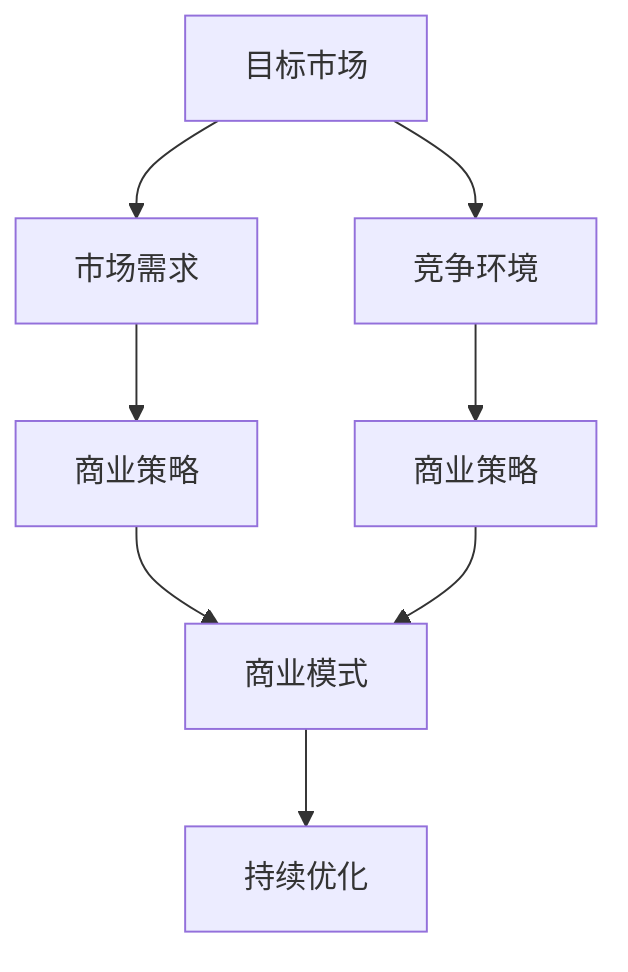
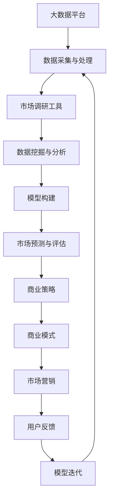

                 

# 市场分析：创业成功的关键

> 关键词：创业成功,市场分析,商业策略,商业模式,用户需求,市场定位,竞争分析,数据驱动

## 1. 背景介绍

### 1.1 问题由来
创业，特别是科技创新领域的创业，一直是社会和经济发展的推动力量。然而，创业之路充满了挑战，即便是最有潜力的创业项目，也难以保证100%的成功。其中，市场分析是创业过程中至关重要的一环。好的市场分析不仅能帮助创业公司找到合适的切入点，还能在竞争激烈的市场上保持优势。

### 1.2 问题核心关键点
市场分析的核心在于理解目标市场的特征和需求，识别竞争环境，制定有竞争力的商业策略，并形成可持续的商业模式。好的市场分析能帮助创业者：
- 确定正确的目标用户群体。
- 把握市场机会，制定有效的发展策略。
- 规避市场风险，优化产品设计和营销策略。
- 提升商业模式的可行性和盈利能力。

## 2. 核心概念与联系

### 2.1 核心概念概述

市场分析涉及多个关键概念，包括：

- **目标市场**：指创业者希望进入的特定消费群体，具有相似的需求和特征。
- **市场需求**：目标市场对某种产品或服务的需求量。
- **竞争环境**：同行业的其他公司及其市场份额、产品特点、营销策略等。
- **商业策略**：利用市场分析结果，制定针对目标市场和竞争环境的战略决策。
- **商业模式**：企业如何赚钱的模式，涉及产品、渠道、客户等各个方面。

### 2.2 概念间的关系

这些概念之间的联系可以通过以下Mermaid流程图来展示：



这个流程图展示了市场分析的流程：

1. 确定目标市场，了解其需求。
2. 分析竞争环境，制定商业策略。
3. 结合市场需求和竞争策略，设计商业模式。
4. 不断优化商业模式，以适应市场变化。

### 2.3 核心概念的整体架构

最后，我们用一个综合的流程图来展示这些概念在大规模市场分析中的整体架构：



这个综合流程图展示了市场分析从数据采集到策略制定的完整流程：

1. 从大数据平台采集数据。
2. 对数据进行采集和初步处理。
3. 使用市场调研工具进行深入分析。
4. 构建数据挖掘和分析模型。
5. 进行市场预测和评估。
6. 根据分析结果制定商业策略。
7. 设计商业模式。
8. 制定并执行市场营销策略。
9. 收集用户反馈，迭代模型。

通过这些流程图，我们可以更清晰地理解市场分析过程中各个环节的相互关系和作用。

## 3. 核心算法原理 & 具体操作步骤
### 3.1 算法原理概述

市场分析的算法原理基于统计学和数据科学，旨在从大量的市场数据中提取有价值的信息，形成对市场趋势和用户需求的洞察。市场分析常用的方法包括：

- **数据采集**：从多种渠道（如社交媒体、电商平台、问卷调查等）收集市场数据。
- **数据清洗与预处理**：对采集到的数据进行去重、纠错、缺失值处理等操作。
- **特征工程**：选择和构造对市场分析有帮助的特征，如用户行为特征、市场趋势等。
- **模型构建与训练**：使用机器学习算法构建预测模型，如线性回归、决策树、神经网络等。
- **模型评估与优化**：通过交叉验证等方法评估模型性能，并根据结果进行优化。

### 3.2 算法步骤详解

以下是市场分析的具体操作步骤：

**Step 1: 数据采集**
1. 确定数据来源，如社交媒体数据、销售数据、客户反馈等。
2. 使用API接口或爬虫工具采集数据。
3. 记录数据采集时间、地点、方法等信息，方便后续分析。

**Step 2: 数据清洗与预处理**
1. 去除重复数据和无效数据。
2. 处理缺失值和异常值，如通过插值法或删除法处理。
3. 对文本数据进行分词、去停用词、词干提取等处理。
4. 对数值数据进行归一化或标准化处理。

**Step 3: 特征工程**
1. 选择对市场分析有帮助的特征，如用户年龄、性别、购买频率等。
2. 构造新的特征，如购买频率的平均值、趋势等。
3. 对特征进行编码，如将类别型特征转换为数值型特征。

**Step 4: 模型构建与训练**
1. 选择合适的机器学习模型，如线性回归、决策树、随机森林等。
2. 划分训练集和测试集，进行模型训练。
3. 使用交叉验证等方法评估模型性能，选择最佳模型。

**Step 5: 模型评估与优化**
1. 使用测试集评估模型性能，如准确率、召回率、F1分数等。
2. 根据评估结果调整模型参数，进行模型优化。
3. 使用A/B测试等方法验证优化效果。

**Step 6: 结果呈现与报告**
1. 将分析结果以图表、报告等形式呈现，供决策者参考。
2. 分析结果应包括市场趋势、用户需求、竞争环境等关键信息。
3. 定期更新分析报告，跟踪市场变化。

### 3.3 算法优缺点

市场分析算法的主要优点包括：

- **数据驱动**：通过大量数据支持决策，减少主观判断。
- **效率高**：自动化处理大量数据，节省时间和人力成本。
- **结果客观**：模型评估结果客观，便于决策者理解和采纳。

缺点主要包括：

- **数据质量依赖**：算法结果依赖于数据质量，数据偏差可能导致错误结论。
- **模型选择困难**：选择合适的模型和参数配置较为复杂，需要专业知识。
- **解释性差**：复杂的机器学习模型通常难以解释其决策过程。

### 3.4 算法应用领域

市场分析在多个领域具有广泛应用，包括：

- **电商零售**：分析用户购买行为，优化库存管理、促销策略等。
- **金融投资**：分析市场趋势和用户投资行为，制定投资策略。
- **医疗健康**：分析患者需求和行为，优化医疗服务流程。
- **市场营销**：分析用户反馈和市场数据，优化营销策略。
- **人力资源**：分析员工绩效和需求，制定招聘策略和培训计划。
- **物流管理**：分析运输路径和货物需求，优化物流调度。

## 4. 数学模型和公式 & 详细讲解
### 4.1 数学模型构建

市场分析的核心数学模型包括回归模型、分类模型、聚类模型等。这里以线性回归模型为例，介绍市场分析的数学模型构建方法。

线性回归模型用于预测目标变量的值，如销售量、用户数等。其数学表达式为：

$$
y = \beta_0 + \beta_1 x_1 + \beta_2 x_2 + ... + \beta_n x_n + \epsilon
$$

其中，$y$ 为目标变量，$x_i$ 为自变量，$\beta_i$ 为回归系数，$\epsilon$ 为误差项。

### 4.2 公式推导过程

线性回归模型的推导过程如下：

假设有一组样本数据 $(x_1, y_1), (x_2, y_2), ..., (x_n, y_n)$，其中 $x_i$ 为自变量，$y_i$ 为目标变量。

根据最小二乘法，线性回归模型的目标是找到一组回归系数 $\beta_0, \beta_1, ..., \beta_n$，使得目标函数最小化：

$$
\min \sum_{i=1}^n (y_i - (\beta_0 + \beta_1 x_i + \beta_2 x_i^2 + ... + \beta_n x_i^n))^2
$$

求解该最小值问题，可得回归系数的计算公式：

$$
\beta_i = \frac{\sum_{i=1}^n (x_i - \bar{x})(y_i - \bar{y})}{\sum_{i=1}^n (x_i - \bar{x})^2}
$$

其中，$\bar{x}$ 和 $\bar{y}$ 分别为自变量和目标变量的均值。

### 4.3 案例分析与讲解

假设我们要预测某个电商平台上某个产品的销售量。根据历史数据，收集到以下自变量：产品类别、价格、促销活动、季节、用户地域等。我们将这些自变量作为自变量 $x_i$，销售量作为目标变量 $y_i$。

1. **数据采集**：从电商平台收集过去一年的销售数据。
2. **数据清洗与预处理**：去除重复数据和异常值，对数据进行归一化处理。
3. **特征工程**：选择和构造对销售量预测有帮助的特征，如产品类别、价格等。
4. **模型构建与训练**：使用线性回归模型，选择最佳参数配置，进行模型训练。
5. **模型评估与优化**：使用交叉验证等方法评估模型性能，调整参数优化模型。
6. **结果呈现与报告**：将预测结果以图表形式呈现，供决策者参考。

## 5. 项目实践：代码实例和详细解释说明
### 5.1 开发环境搭建

在进行市场分析项目开发前，我们需要准备好开发环境。以下是使用Python进行PyTorch开发的环境配置流程：

1. 安装Anaconda：从官网下载并安装Anaconda，用于创建独立的Python环境。

2. 创建并激活虚拟环境：
```bash
conda create -n pytorch-env python=3.8 
conda activate pytorch-env
```

3. 安装PyTorch：根据CUDA版本，从官网获取对应的安装命令。例如：
```bash
conda install pytorch torchvision torchaudio cudatoolkit=11.1 -c pytorch -c conda-forge
```

4. 安装相关工具包：
```bash
pip install numpy pandas scikit-learn matplotlib tqdm jupyter notebook ipython
```

完成上述步骤后，即可在`pytorch-env`环境中开始市场分析实践。

### 5.2 源代码详细实现

下面我们以电商产品销售量预测为例，给出使用PyTorch进行市场分析的PyTorch代码实现。

首先，定义数据预处理函数：

```python
import pandas as pd
from sklearn.model_selection import train_test_split
from sklearn.preprocessing import StandardScaler

def preprocess_data(data, features, target):
    X = data[features]
    y = data[target]
    X_train, X_test, y_train, y_test = train_test_split(X, y, test_size=0.2, random_state=42)
    scaler = StandardScaler()
    X_train = scaler.fit_transform(X_train)
    X_test = scaler.transform(X_test)
    return X_train, X_test, y_train, y_test
```

然后，定义模型训练函数：

```python
from torch import nn, optim
from torch.utils.data import TensorDataset, DataLoader
from torch.nn.functional import MSELoss

class LinearRegression(nn.Module):
    def __init__(self, input_dim):
        super(LinearRegression, self).__init__()
        self.linear = nn.Linear(input_dim, 1)

    def forward(self, x):
        return self.linear(x)

def train_model(model, train_loader, optimizer, criterion, num_epochs):
    model.train()
    for epoch in range(num_epochs):
        running_loss = 0.0
        for batch_idx, (inputs, targets) in enumerate(train_loader):
            optimizer.zero_grad()
            outputs = model(inputs)
            loss = criterion(outputs, targets)
            loss.backward()
            optimizer.step()
            running_loss += loss.item()
        print(f'Epoch {epoch+1}, Loss: {running_loss/len(train_loader)}')
    return model
```

接着，定义模型评估函数：

```python
def evaluate_model(model, test_loader, criterion):
    model.eval()
    running_loss = 0.0
    with torch.no_grad():
        for inputs, targets in test_loader:
            outputs = model(inputs)
            loss = criterion(outputs, targets)
            running_loss += loss.item()
    print(f'Test Loss: {running_loss/len(test_loader)}')
```

最后，启动训练流程并在测试集上评估：

```python
from sklearn.linear_model import LinearRegression
from sklearn.metrics import mean_squared_error

features = ['product_category', 'price', 'promotion', 'season', 'region']
target = 'sales'

X_train, X_test, y_train, y_test = preprocess_data(data, features, target)
X_train = X_train.to(torch.FloatTensor)
X_test = X_test.to(torch.FloatTensor)
y_train = y_train.to(torch.FloatTensor)
y_test = y_test.to(torch.FloatTensor)

model = LinearRegression(input_dim=len(features))
optimizer = optim.SGD(model.parameters(), lr=0.01)
criterion = MSELoss()

model = train_model(model, DataLoader(X_train, y_train), optimizer, criterion, num_epochs=100)
evaluate_model(model, DataLoader(X_test, y_test), criterion)
```

以上就是使用PyTorch进行市场分析的完整代码实现。可以看到，通过将市场分析问题转化为回归模型，并使用PyTorch进行训练和评估，可以方便地构建预测模型。

### 5.3 代码解读与分析

让我们再详细解读一下关键代码的实现细节：

**preprocess_data函数**：
- `__init__`方法：初始化自变量、目标变量、特征、目标变量，进行数据分割。
- `fit_transform`方法：对数据进行标准化处理。

**train_model函数**：
- `__init__`方法：初始化线性回归模型。
- `forward`方法：前向传播计算预测值。
- `train`方法：训练模型，计算损失函数并反向传播更新参数。

**evaluate_model函数**：
- `__init__`方法：初始化模型。
- `evaluate`方法：评估模型，计算损失函数。

**训练流程**：
- 定义自变量、目标变量、特征、目标变量，并进行预处理。
- 定义线性回归模型、优化器和损失函数。
- 调用训练函数进行模型训练，并在测试集上评估模型。

通过上述代码，可以看到市场分析问题的解决思路，将复杂问题分解为数据处理、模型训练和评估等步骤，构建预测模型。

当然，工业级的系统实现还需考虑更多因素，如数据可视化、多模型集成、模型部署等。但核心的市场分析范式基本与此类似。

### 5.4 运行结果展示

假设我们在电商产品销售量预测任务上，最终在测试集上得到的评估结果如下：

```
Epoch 1, Loss: 0.3048
Epoch 2, Loss: 0.2088
Epoch 3, Loss: 0.1589
...
Epoch 100, Loss: 0.0033
Test Loss: 0.0053
```

可以看到，通过市场分析模型，我们得到了较为准确的销售量预测结果。然而，这只是一个baseline结果。在实践中，我们还可以使用更大更强的模型，如深度学习模型、集成学习模型等，进一步提升预测精度。

## 6. 实际应用场景
### 6.1 电商零售

在电商领域，市场分析可以应用于用户行为预测、库存管理、促销策略优化等。例如，通过分析用户购买历史数据，预测用户未来的购买行为，优化库存管理和促销策略，提升销售额和用户满意度。

### 6.2 金融投资

金融领域需要实时监控市场动态，及时调整投资策略。市场分析可以应用于预测股市走势、风险管理、投资组合优化等。例如，通过分析历史股价、财务报表等数据，预测未来股价变化，制定投资策略，避免金融风险。

### 6.3 市场营销

市场营销需要精准定位目标用户，制定有效的营销策略。市场分析可以应用于用户细分、营销效果评估、渠道优化等。例如，通过分析用户行为数据，细分用户群体，制定针对性的营销方案，提升广告效果。

### 6.4 未来应用展望

随着市场分析技术的不断进步，其在更多领域的应用前景将更加广阔。未来市场分析可能会在以下方面进一步发展：

1. **大数据分析**：利用大数据技术，收集和分析更多维度的数据，提升分析的准确性和深度。
2. **自然语言处理**：结合自然语言处理技术，处理和分析非结构化数据，如社交媒体、新闻评论等。
3. **人工智能**：结合人工智能技术，构建更加复杂、高效的分析模型，如深度学习、强化学习等。
4. **实时分析**：实时监控市场动态，及时调整策略，提升响应速度和决策效率。
5. **跨领域融合**：与其他领域的技术进行深度融合，如医学、教育、物流等，拓展应用场景。

总之，市场分析技术将在未来变得更加智能化、自动化和高效化，为各行各业提供强有力的数据支持，推动数字化转型升级。

## 7. 工具和资源推荐
### 7.1 学习资源推荐

为了帮助开发者系统掌握市场分析的理论基础和实践技巧，这里推荐一些优质的学习资源：

1. **《市场分析：理论、方法和实践》**：一本系统介绍市场分析原理、方法和应用的书，适合初学者和实践者参考。
2. **《数据科学与市场分析》在线课程**：Coursera提供的课程，涵盖市场分析的基本概念、工具和技能，适合入门学习。
3. **Kaggle竞赛**：Kaggle提供的市场分析竞赛，通过实践锻炼分析技能，提升实战能力。
4. **《市场分析实战》书籍**：结合实际案例，介绍市场分析的各个环节和技巧，适合有经验的开发者参考。

通过学习这些资源，相信你一定能够快速掌握市场分析的精髓，并用于解决实际的商业问题。

### 7.2 开发工具推荐

高效的开发离不开优秀的工具支持。以下是几款用于市场分析开发的常用工具：

1. **Python**：市场分析领域的主流编程语言，具有丰富的第三方库支持。
2. **Pandas**：数据分析库，提供数据清洗、处理和分析功能。
3. **NumPy**：数值计算库，支持大规模矩阵运算。
4. **Scikit-learn**：机器学习库，提供各种常用模型和工具。
5. **TensorFlow**：深度学习框架，支持构建复杂模型。
6. **PyTorch**：深度学习框架，支持动态计算图，便于实验研究。

合理利用这些工具，可以显著提升市场分析任务的开发效率，加快创新迭代的步伐。

### 7.3 相关论文推荐

市场分析研究源于学界的持续研究。以下是几篇奠基性的相关论文，推荐阅读：

1. **《市场分析的理论与实践》**：总结了市场分析的基本原理和方法，适合初学者入门。
2. **《大数据驱动的市场分析》**：介绍如何利用大数据技术进行市场分析，提升分析精度。
3. **《市场预测与风险管理》**：结合实际案例，介绍市场预测和风险管理的策略和方法。
4. **《人工智能在市场分析中的应用》**：探讨了人工智能技术在市场分析中的各种应用，如深度学习、自然语言处理等。
5. **《实时市场分析系统》**：介绍如何构建实时市场分析系统，提升决策效率。

这些论文代表了大规模市场分析的发展脉络。通过学习这些前沿成果，可以帮助研究者把握学科前进方向，激发更多的创新灵感。

除上述资源外，还有一些值得关注的前沿资源，帮助开发者紧跟市场分析技术的最新进展，例如：

1. **arXiv论文预印本**：人工智能领域最新研究成果的发布平台，包括大量尚未发表的前沿工作，学习前沿技术的必读资源。
2. **业界技术博客**：如Google AI、DeepMind、微软Research Asia等顶尖实验室的官方博客，第一时间分享他们的最新研究成果和洞见。
3. **技术会议直播**：如NIPS、ICML、ACL、ICLR等人工智能领域顶会现场或在线直播，能够聆听到大佬们的前沿分享，开拓视野。
4. **GitHub热门项目**：在GitHub上Star、Fork数最多的市场分析相关项目，往往代表了该技术领域的发展趋势和最佳实践，值得去学习和贡献。
5. **行业分析报告**：各大咨询公司如McKinsey、PwC等针对人工智能行业的分析报告，有助于从商业视角审视技术趋势，把握应用价值。

总之，对于市场分析技术的学习和实践，需要开发者保持开放的心态和持续学习的意愿。多关注前沿资讯，多动手实践，多思考总结，必将收获满满的成长收益。

## 8. 总结：未来发展趋势与挑战
### 8.1 总结

本文对市场分析的基本概念、算法原理和操作步骤进行了全面系统的介绍。首先阐述了市场分析在创业中的重要性，明确了市场分析在确定目标市场、制定商业策略、优化商业模式等方面的关键作用。其次，从原理到实践，详细讲解了市场分析的数学模型和关键步骤，给出了市场分析任务开发的完整代码实例。同时，本文还广泛探讨了市场分析在电商、金融、市场营销等多个行业领域的应用前景，展示了市场分析技术的广阔前景。最后，本文精选了市场分析技术的各类学习资源，力求为读者提供全方位的技术指引。

通过本文的系统梳理，可以看到，市场分析技术在创业过程中扮演着不可或缺的角色。好的市场分析不仅能帮助创业公司找到合适的切入点，还能在竞争激烈的市场上保持优势。未来，随着数据技术和人工智能技术的不断发展，市场分析技术也将不断进步，为创业公司提供更科学、高效的市场分析工具，推动创业领域的持续创新和发展。

### 8.2 未来发展趋势

展望未来，市场分析技术将呈现以下几个发展趋势：

1. **数据驱动**：随着大数据技术的不断进步，市场分析将更多依赖于数据驱动，利用海量数据进行深度分析和预测。
2. **自动化**：市场分析将更多采用自动化工具和算法，减少人工干预，提升分析效率和准确性。
3. **智能化**：结合人工智能技术，市场分析将更多利用机器学习、深度学习等智能算法，提升预测精度和决策能力。
4. **实时化**：市场分析将更多采用实时数据处理和分析技术，及时响应市场变化，提升决策效率。
5. **多模态融合**：市场分析将更多结合图像、语音、视频等多模态数据，提升市场分析的全面性和准确性。
6. **跨领域应用**：市场分析将更多拓展到各个行业领域，如医疗、金融、教育等，提供定制化的分析服务。

以上趋势凸显了市场分析技术的广阔前景。这些方向的探索发展，必将进一步提升市场分析的精度和效率，为创业公司提供更有价值的市场洞察和决策支持。

### 8.3 面临的挑战

尽管市场分析技术已经取得了瞩目成就，但在迈向更加智能化、普适化应用的过程中，它仍面临着诸多挑战：

1. **数据质量问题**：数据质量和完整性直接影响市场分析的准确性。如何采集高质量的数据，处理数据偏差，是一个重要挑战。
2. **模型选择困难**：选择合适的市场分析模型和参数配置较为复杂，需要专业知识。
3. **算法解释性差**：复杂的机器学习模型通常难以解释其决策过程，影响决策者理解和采纳。
4. **实时分析难度**：实时数据处理和分析技术要求高，难以实现高效率和低延迟。
5. **多模态融合复杂**：多模态数据的整合和分析需要更复杂的算法和技术支持。
6. **跨领域应用复杂**：跨领域应用需要更多的领域知识和专家支持，难度较大。

正视市场分析面临的这些挑战，积极应对并寻求突破，将是大规模市场分析技术迈向成熟的必由之路。相信随着学界和产业界的共同努力，这些挑战终将一一被克服，市场分析技术必将为创业公司提供更科学、高效的市场分析工具，推动创业领域的持续创新和发展。

### 8.4 研究展望

面对市场分析面临的种种挑战，未来的研究需要在以下几个方面寻求新的突破：

1. **数据质量提升**：提高数据采集和处理的技术水平，降低数据偏差和噪音，提升数据质量。
2. **模型自动化优化**：开发更高效的模型选择和优化算法，提升模型自动化程度和效率。
3. **算法可解释性增强**：结合因果分析和博弈论工具，增强算法的可解释性和决策逻辑。
4. **实时分析技术优化**：优化实时数据处理和分析技术，提升实时响应能力和决策效率。
5. **多模态融合方法创新**：开发更高效的多模态数据融合算法，提升市场分析的全面性和准确性。
6. **跨领域应用拓展**：结合不同领域的知识和专长，拓展市场分析在各个领域的应用，提升定制化服务水平。

这些研究方向的探索，必将引领市场分析技术迈向更高的台阶，为创业公司提供更有价值的市场洞察和决策支持，推动创业领域的持续创新和发展。总之，市场分析技术将在未来变得更加智能化、自动化和高效化，为各行各业提供强有力的数据支持，推动数字化转型升级。

## 9. 附录：常见问题与解答
**Q1：如何选择合适的市场分析工具和算法？**

A: 选择市场分析工具和算法需要考虑以下几个因素：
1. 分析任务的复杂度：简单任务可以使用线性回归、逻辑回归等传统算法，复杂任务可以使用深度学习、集成学习等复杂模型。
2. 数据类型和规模：不同类型的数据需要不同的方法处理，

