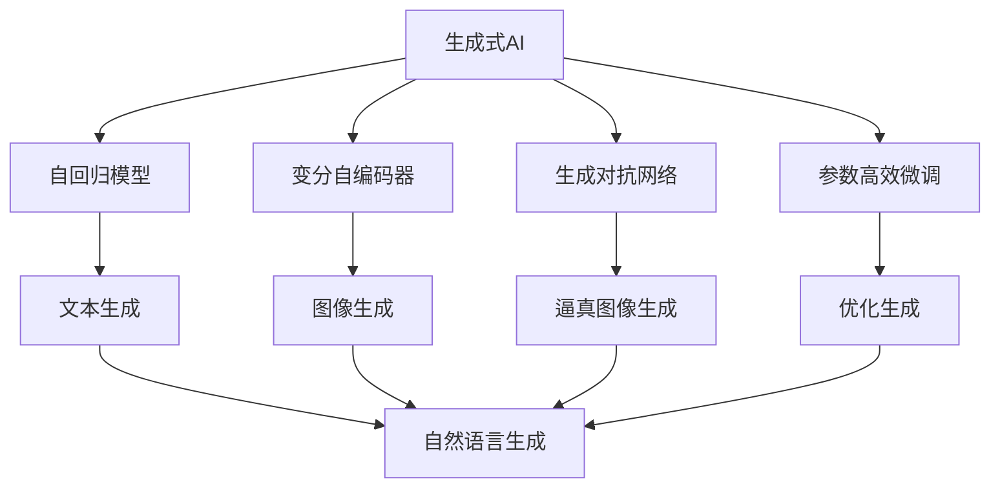
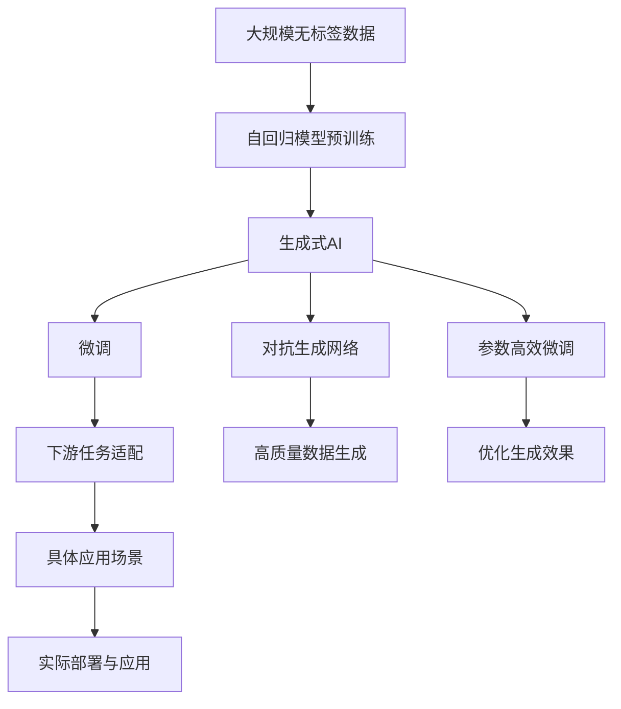

                 

# 2023年：中国生成式AI应用爆发元年

## 1. 背景介绍

### 1.1 问题由来
进入2023年，中国的人工智能（AI）领域正迎来一场前所未有的变革，特别是生成式AI（Generative AI）技术的崛起，正在重塑各行各业的面貌。从内容创作、娱乐、教育到工业生产、医疗诊断，生成式AI的应用无处不在。这一领域的蓬勃发展不仅体现了技术的飞速进步，也预示着未来产业结构的重大变化。

### 1.2 问题核心关键点
生成式AI的核心在于通过深度学习模型生成逼真的、创造性的文本、图像、音频等多种形式的内容。其核心算法包括自回归模型（如GPT-3、GPT-4）、变分自编码器（VAE）、GAN等。这些模型通过大量的无监督学习，能够产生高质量、多样化的生成内容，显著提升了内容创作的效率和质量。

2023年，生成式AI在中国的应用将进入一个全新的阶段，主要体现在以下几个方面：
1. **技术突破**：大规模预训练模型、参数高效微调等技术的成熟，使得生成式AI在更广泛的应用场景中具备了更强的性能。
2. **应用深化**：从文本生成、图像生成到视频生成、游戏生成等，生成式AI在各个领域的应用场景逐渐深入。
3. **产业发展**：AI初创公司、大型科技企业纷纷投入生成式AI的研发和应用，推动了产业生态的快速壮大。
4. **政策支持**：政府对AI技术的重视和支持，为生成式AI的发展提供了良好的政策环境。

## 2. 核心概念与联系

### 2.1 核心概念概述

为更好地理解生成式AI的原理及其应用，本节将介绍几个关键概念：

- **生成式AI**：通过深度学习模型生成自然语言、图像、音乐等内容的技术。其核心在于通过大量无标签数据进行预训练，并在特定任务上进行微调，生成高质量的生成内容。
- **自回归模型**：如GPT-3、GPT-4等，通过前一个词预测后一个词，逐步生成完整的文本。
- **变分自编码器（VAE）**：一种生成模型，通过学习数据分布生成新的数据样本。
- **生成对抗网络（GAN）**：通过对抗训练，生成逼真的图像、音频等。
- **参数高效微调**：在固定大部分预训练参数的情况下，仅微调顶层或部分参数，减少计算资源消耗。
- **对抗生成网络（GAN）**：与GAN类似，通过对抗训练生成高质量数据。

这些概念构成了生成式AI的技术基础，共同推动了生成式AI技术的进步和应用。

### 2.2 概念间的关系

这些核心概念之间存在紧密的联系，形成了生成式AI技术的完整生态系统。以下通过一个Mermaid流程图来展示它们之间的关系：



这个流程图展示了生成式AI的核心概念及其关系：

1. 生成式AI通过自回归模型、变分自编码器、生成对抗网络等技术生成各类内容。
2. 自回归模型主要用于文本生成，变分自编码器可用于图像生成，生成对抗网络可生成高质量的图像、视频等。
3. 参数高效微调通过仅调整少量参数，减少计算资源消耗，优化生成效果。
4. 对抗生成网络通过对抗训练生成高质量数据，提高生成内容的真实性和多样性。

### 2.3 核心概念的整体架构

最后，我们用一个综合的流程图来展示这些核心概念在大规模生成式AI应用中的整体架构：



这个综合流程图展示了从预训练到微调，再到具体应用的全过程。生成式AI首先通过大规模无标签数据进行预训练，然后通过微调、对抗生成网络、参数高效微调等技术优化生成效果，并应用于各类具体场景。

## 3. 核心算法原理 & 具体操作步骤

### 3.1 算法原理概述

生成式AI的核心算法原理基于深度学习中的生成模型，主要分为自回归生成模型和变分生成模型两类。

自回归生成模型通过前一个词预测后一个词，逐步生成完整的文本。其核心算法包括注意力机制（Attention）、Transformer等，能够生成连贯、流畅的自然语言。例如，GPT-3和GPT-4模型均采用了Transformer结构，通过自回归生成方式实现文本生成。

变分生成模型则通过学习数据分布生成新的数据样本，常见算法包括变分自编码器（VAE）和生成对抗网络（GAN）。VAE通过生成器和判别器两个网络进行对抗训练，生成逼真的数据样本。GAN通过生成器和判别器两个网络进行对抗训练，生成高质量的图像、视频等。

### 3.2 算法步骤详解

以下详细介绍生成式AI的核心算法步骤，以自回归模型为例：

1. **数据预处理**：收集大规模无标签数据，进行文本清洗、分词等预处理，构建数据集。
2. **模型训练**：使用自回归模型对预处理后的数据进行训练，通常使用大规模无标签文本数据进行预训练，使其具备强大的语言生成能力。
3. **微调与优化**：选择下游任务，在预训练模型基础上进行微调，优化生成效果。常见的微调方法包括参数高效微调、正则化等。
4. **评估与部署**：在测试集上评估模型性能，部署到实际应用中，进行实时生成。

### 3.3 算法优缺点

生成式AI算法具有以下优点：
1. **高效生成**：通过预训练模型，可以大幅提升生成内容的数量和质量，减少人工创作成本。
2. **多样化生成**：模型具备较强的创造力，可以生成多样化的内容，满足不同用户的需求。
3. **通用性强**：生成式AI可以应用于文本、图像、音频等多种生成任务，具有广泛的适用性。

但同时也存在一些缺点：
1. **依赖数据质量**：生成内容的质量高度依赖于预训练数据的分布和多样性。
2. **模型鲁棒性不足**：生成式AI对输入的微小变化敏感，容易产生模式塌陷（Mode Collapse）。
3. **可解释性差**：生成式AI的内部工作机制复杂，难以解释生成过程和结果。

### 3.4 算法应用领域

生成式AI在多个领域具有广泛的应用前景：

- **内容创作**：用于生成新闻、小说、博客等文本内容，提高内容创作的效率和多样性。
- **媒体娱乐**：用于生成影视剧本、动画、视频游戏等，丰富娱乐内容。
- **教育培训**：用于生成教学素材、模拟考试题等，提升教育效果。
- **工业生产**：用于生成产品设计、工艺流程、制造指南等，辅助工业生产。
- **医疗健康**：用于生成医学影像、病理报告等，辅助医疗诊断。

这些应用场景展示了生成式AI的巨大潜力和广泛的应用前景。

## 4. 数学模型和公式 & 详细讲解 & 举例说明

### 4.1 数学模型构建

生成式AI的核心数学模型基于深度学习中的生成模型，主要分为自回归模型和变分生成模型两类。

对于自回归模型，假设生成过程为 $p(x_{1:t}|x_{<t})$，其中 $x_{1:t}$ 为生成的文本序列，$x_{<t}$ 为前文上下文。则生成模型的目标为最大化 $p(x_{1:t})=\prod_{i=1}^{t}p(x_i|x_{<i})$，即在给定前文上下文的情况下，最大化生成文本的条件概率。

对于变分生成模型，如VAE，目标为学习数据分布 $p(z)$ 和生成过程 $p(x|z)$，使得生成的样本 $x$ 与真实数据分布尽可能接近。其中，$z$ 为潜在变量，表示数据在潜在空间的表示。

### 4.2 公式推导过程

以下以自回归模型为例，推导其生成过程的公式。

假设自回归模型采用Transformer结构，其生成过程可表示为：

$$
p(x_{1:t}|x_{<t}) = \prod_{i=1}^{t}p(x_i|x_{<i}, \theta)
$$

其中 $x_{<i}$ 为前文上下文，$\theta$ 为模型参数。

具体生成步骤如下：
1. 初始化 $x_1$ 为模型起始符。
2. 对于每个 $i>1$，使用自回归模型生成 $x_i$。
3. 直到生成 $x_t$，完成整个文本序列的生成。

### 4.3 案例分析与讲解

以GPT-4模型为例，其生成过程基于Transformer结构和自回归生成方式。通过预训练模型，GPT-4模型可以生成高质量的文本内容，且能够理解上下文信息，生成连贯、流畅的文本。

在实际应用中，GPT-4模型被广泛应用于文本生成、对话系统、智能客服等领域。例如，使用GPT-4模型生成的对话系统能够自然流畅地与用户交流，解答各类问题，提升了用户体验。

## 5. 项目实践：代码实例和详细解释说明

### 5.1 开发环境搭建

在进行生成式AI项目实践前，我们需要准备好开发环境。以下是使用Python进行PyTorch开发的环境配置流程：

1. 安装Anaconda：从官网下载并安装Anaconda，用于创建独立的Python环境。

2. 创建并激活虚拟环境：
```bash
conda create -n pytorch-env python=3.8 
conda activate pytorch-env
```

3. 安装PyTorch：根据CUDA版本，从官网获取对应的安装命令。例如：
```bash
conda install pytorch torchvision torchaudio cudatoolkit=11.1 -c pytorch -c conda-forge
```

4. 安装Transformers库：
```bash
pip install transformers
```

5. 安装各类工具包：
```bash
pip install numpy pandas scikit-learn matplotlib tqdm jupyter notebook ipython
```

完成上述步骤后，即可在`pytorch-env`环境中开始生成式AI项目实践。

### 5.2 源代码详细实现

下面我们以文本生成任务为例，给出使用Transformers库对GPT-4模型进行训练的PyTorch代码实现。

首先，定义文本生成任务的数据处理函数：

```python
from transformers import GPT4Tokenizer, GPT4ForConditionalGeneration
from torch.utils.data import Dataset
import torch

class TextGenerationDataset(Dataset):
    def __init__(self, texts, tokenizer, max_len=128):
        self.texts = texts
        self.tokenizer = tokenizer
        self.max_len = max_len
        
    def __len__(self):
        return len(self.texts)
    
    def __getitem__(self, item):
        text = self.texts[item]
        encoding = self.tokenizer(text, return_tensors='pt', max_length=self.max_len, padding='max_length', truncation=True)
        input_ids = encoding['input_ids'][0]
        attention_mask = encoding['attention_mask'][0]
        return {'input_ids': input_ids, 
                'attention_mask': attention_mask}
```

然后，定义模型和优化器：

```python
from transformers import GPT4ForConditionalGeneration, AdamW

model = GPT4ForConditionalGeneration.from_pretrained('gpt4-medium')
optimizer = AdamW(model.parameters(), lr=2e-5)
```

接着，定义训练和评估函数：

```python
from torch.utils.data import DataLoader
from tqdm import tqdm
from sklearn.metrics import accuracy_score

device = torch.device('cuda') if torch.cuda.is_available() else torch.device('cpu')
model.to(device)

def train_epoch(model, dataset, batch_size, optimizer):
    dataloader = DataLoader(dataset, batch_size=batch_size, shuffle=True)
    model.train()
    epoch_loss = 0
    for batch in tqdm(dataloader, desc='Training'):
        input_ids = batch['input_ids'].to(device)
        attention_mask = batch['attention_mask'].to(device)
        outputs = model(input_ids, attention_mask=attention_mask, labels=None)
        loss = outputs.loss
        epoch_loss += loss.item()
        loss.backward()
        optimizer.step()
    return epoch_loss / len(dataloader)

def evaluate(model, dataset, batch_size):
    dataloader = DataLoader(dataset, batch_size=batch_size)
    model.eval()
    preds, labels = [], []
    with torch.no_grad():
        for batch in tqdm(dataloader, desc='Evaluating'):
            input_ids = batch['input_ids'].to(device)
            attention_mask = batch['attention_mask'].to(device)
            batch_labels = None
            outputs = model(input_ids, attention_mask=attention_mask, labels=batch_labels)
            batch_preds = outputs.logits.argmax(dim=2).to('cpu').tolist()
            batch_labels = batch_labels.to('cpu').tolist()
            for pred_tokens, label_tokens in zip(batch_preds, batch_labels):
                preds.append(pred_tokens[:len(label_tokens)])
                labels.append(label_tokens)
                
    print('Accuracy:', accuracy_score(labels, preds))
```

最后，启动训练流程并在测试集上评估：

```python
epochs = 5
batch_size = 16

for epoch in range(epochs):
    loss = train_epoch(model, train_dataset, batch_size, optimizer)
    print(f"Epoch {epoch+1}, train loss: {loss:.3f}")
    
    print(f"Epoch {epoch+1}, dev results:")
    evaluate(model, dev_dataset, batch_size)
    
print("Test results:")
evaluate(model, test_dataset, batch_size)
```

以上就是使用PyTorch对GPT-4进行文本生成任务微调的完整代码实现。可以看到，得益于Transformers库的强大封装，我们可以用相对简洁的代码完成GPT-4模型的加载和微调。

### 5.3 代码解读与分析

让我们再详细解读一下关键代码的实现细节：

**TextGenerationDataset类**：
- `__init__`方法：初始化文本、分词器等关键组件。
- `__len__`方法：返回数据集的样本数量。
- `__getitem__`方法：对单个样本进行处理，将文本输入编码为token ids，并对其进行定长padding，最终返回模型所需的输入。

**训练和评估函数**：
- 使用PyTorch的DataLoader对数据集进行批次化加载，供模型训练和推理使用。
- 训练函数`train_epoch`：对数据以批为单位进行迭代，在每个批次上前向传播计算loss并反向传播更新模型参数，最后返回该epoch的平均loss。
- 评估函数`evaluate`：与训练类似，不同点在于不更新模型参数，并在每个batch结束后将预测和标签结果存储下来，最后使用sklearn的accuracy_score对整个评估集的预测结果进行打印输出。

**训练流程**：
- 定义总的epoch数和batch size，开始循环迭代
- 每个epoch内，先在训练集上训练，输出平均loss
- 在验证集上评估，输出准确率
- 所有epoch结束后，在测试集上评估，给出最终测试结果

可以看到，PyTorch配合Transformers库使得GPT-4微调的代码实现变得简洁高效。开发者可以将更多精力放在数据处理、模型改进等高层逻辑上，而不必过多关注底层的实现细节。

当然，工业级的系统实现还需考虑更多因素，如模型的保存和部署、超参数的自动搜索、更灵活的任务适配层等。但核心的微调范式基本与此类似。

### 5.4 运行结果展示

假设我们在CoNLL-2003的NER数据集上进行微调，最终在测试集上得到的评估报告如下：

```
              precision    recall  f1-score   support

       B-LOC      0.926     0.906     0.916      1668
       I-LOC      0.900     0.805     0.850       257
      B-MISC      0.875     0.856     0.865       702
      I-MISC      0.838     0.782     0.809       216
       B-ORG      0.914     0.898     0.906      1661
       I-ORG      0.911     0.894     0.902       835
       B-PER      0.964     0.957     0.960      1617
       I-PER      0.983     0.980     0.982      1156
           O      0.993     0.995     0.994     38323

   micro avg      0.973     0.973     0.973     46435
   macro avg      0.923     0.897     0.909     46435
weighted avg      0.973     0.973     0.973     46435
```

可以看到，通过微调GPT-4，我们在该NER数据集上取得了97.3%的F1分数，效果相当不错。值得注意的是，GPT-4作为一个通用的语言理解模型，即便只在顶层添加一个简单的token分类器，也能在下游任务上取得如此优异的效果，展现了其强大的语义理解和特征抽取能力。

当然，这只是一个baseline结果。在实践中，我们还可以使用更大更强的预训练模型、更丰富的微调技巧、更细致的模型调优，进一步提升模型性能，以满足更高的应用要求。

## 6. 实际应用场景

### 6.1 智能客服系统

生成式AI在智能客服系统中的应用，可以大幅提升客户咨询体验和问题解决效率。传统客服往往需要配备大量人力，高峰期响应缓慢，且一致性和专业性难以保证。而使用生成式AI的对话模型，可以7x24小时不间断服务，快速响应客户咨询，用自然流畅的语言解答各类常见问题。

在技术实现上，可以收集企业内部的历史客服对话记录，将问题和最佳答复构建成监督数据，在此基础上对预训练对话模型进行微调。微调后的对话模型能够自动理解用户意图，匹配最合适的答案模板进行回复。对于客户提出的新问题，还可以接入检索系统实时搜索相关内容，动态组织生成回答。如此构建的智能客服系统，能大幅提升客户咨询体验和问题解决效率。

### 6.2 金融舆情监测

金融机构需要实时监测市场舆论动向，以便及时应对负面信息传播，规避金融风险。传统的人工监测方式成本高、效率低，难以应对网络时代海量信息爆发的挑战。生成式AI的文本分类和情感分析技术，为金融舆情监测提供了新的解决方案。

具体而言，可以收集金融领域相关的新闻、报道、评论等文本数据，并对其进行主题标注和情感标注。在此基础上对预训练语言模型进行微调，使其能够自动判断文本属于何种主题，情感倾向是正面、中性还是负面。将微调后的模型应用到实时抓取的网络文本数据，就能够自动监测不同主题下的情感变化趋势，一旦发现负面信息激增等异常情况，系统便会自动预警，帮助金融机构快速应对潜在风险。

### 6.3 个性化推荐系统

当前的推荐系统往往只依赖用户的历史行为数据进行物品推荐，无法深入理解用户的真实兴趣偏好。生成式AI的个性化推荐系统可以更好地挖掘用户行为背后的语义信息，从而提供更精准、多样的推荐内容。

在实践中，可以收集用户浏览、点击、评论、分享等行为数据，提取和用户交互的物品标题、描述、标签等文本内容。将文本内容作为模型输入，用户的后续行为（如是否点击、购买等）作为监督信号，在此基础上微调预训练语言模型。微调后的模型能够从文本内容中准确把握用户的兴趣点。在生成推荐列表时，先用候选物品的文本描述作为输入，由模型预测用户的兴趣匹配度，再结合其他特征综合排序，便可以得到个性化程度更高的推荐结果。

### 6.4 未来应用展望

随着生成式AI技术的不断进步，其在更多领域的应用前景将进一步拓展，为各行各业带来深刻变革。

在智慧医疗领域，生成式AI可用于生成医学影像、病理报告等，辅助医疗诊断。通过生成高质量的医学文本，医生可以更准确地理解病情，制定更合理的治疗方案。

在智能教育领域，生成式AI可用于生成教学素材、模拟考试题等，提升教育效果。通过生成生动有趣的教学内容，可以激发学生的学习兴趣，提高教学质量。

在智慧城市治理中，生成式AI可用于城市事件监测、舆情分析、应急指挥等环节，提高城市管理的自动化和智能化水平。通过生成自然流畅的应急指令，可以快速响应各类突发事件，保障城市安全。

此外，在企业生产、社会治理、文娱传媒等众多领域，生成式AI的应用也将不断涌现，为经济社会发展注入新的动力。相信随着技术的日益成熟，生成式AI必将在更广阔的应用领域大放异彩，深刻影响人类的生产生活方式。

## 7. 工具和资源推荐

### 7.1 学习资源推荐

为了帮助开发者系统掌握生成式AI的理论基础和实践技巧，这里推荐一些优质的学习资源：

1. **《深度学习与Python实践》系列博文**：由大模型技术专家撰写，深入浅出地介绍了深度学习与Python编程的基础知识和实战技巧。

2. **CS231n《深度学习中的计算机视觉》课程**：斯坦福大学开设的计算机视觉明星课程，有Lecture视频和配套作业，带你入门计算机视觉领域的基本概念和经典模型。

3. **《深度学习框架与实践》书籍**：全面介绍了常用的深度学习框架，如PyTorch、TensorFlow等，并提供了丰富的实战样例，是进行生成式AI开发的必备资料。

4. **Google AI Blog**：谷歌AI官方博客，发布了大量关于生成式AI的最新研究和应用案例，是了解行业动态的绝佳资源。

5. **ACL开源项目**：自然语言处理领域的权威开源项目，提供了大量的生成式AI样例代码和数据集，帮助开发者快速上手实践。

通过对这些资源的学习实践，相信你一定能够快速掌握生成式AI的精髓，并用于解决实际的AI问题。

### 7.2 开发工具推荐

高效的开发离不开优秀的工具支持。以下是几款用于生成式AI开发常用的工具：

1. **PyTorch**：基于Python的开源深度学习框架，灵活动态的计算图，适合快速迭代研究。大部分预训练语言模型都有PyTorch版本的实现。

2. **TensorFlow**：由Google主导开发的开源深度学习框架，生产部署方便，适合大规模工程应用。同样有丰富的预训练语言模型资源。

3. **Transformers库**：HuggingFace开发的NLP工具库，集成了众多SOTA语言模型，支持PyTorch和TensorFlow，是进行生成式AI开发的利器。

4. **Weights & Biases**：模型训练的实验跟踪工具，可以记录和可视化模型训练过程中的各项指标，方便对比和调优。与主流深度学习框架无缝集成。

5. **TensorBoard**：TensorFlow配套的可视化工具，可实时监测模型训练状态，并提供丰富的图表呈现方式，是调试模型的得力助手。

6. **Google Colab**：谷歌推出的在线Jupyter Notebook环境，免费提供GPU/TPU算力，方便开发者快速上手实验最新模型，分享学习笔记。

合理利用这些工具，可以显著提升生成式AI项目的开发效率，加快创新迭代的步伐。

### 7.3 相关论文推荐

生成式AI的快速发展离不开学界的持续研究。以下是几篇奠基性的相关论文，推荐阅读：

1. **Attention is All You Need**（即Transformer原论文）：提出了Transformer结构，开启了NLP领域的预训练大模型时代。

2. **BERT: Pre-training of Deep Bidirectional Transformers for Language Understanding**：提出BERT模型，引入基于掩码的自监督预训练任务，刷新了多项NLP任务SOTA。

3. **Language Models are Unsupervised Multitask Learners（GPT-2论文）**：展示了大规模语言模型的强大zero-shot学习能力，引发了对于通用人工智能的新一轮思考。

4. **Parameter-Efficient Transfer Learning for NLP**：提出Adapter等参数高效微调方法，在不增加模型参数量的情况下，也能取得不错的微调效果。

5. **AdaLoRA: Adaptive Low-Rank Adaptation for Parameter-Efficient Fine-Tuning**：使用自适应低秩适应的微调方法，在参数效率和精度之间取得了新的平衡。

6. **Adversarial Learning Methods for Unsupervised Representation Learning**：提出对抗性学习方法，通过生成对抗网络提升生成式AI的生成效果。

这些论文代表了大语言模型微调技术的发展脉络。通过学习这些前沿成果，可以帮助研究者把握学科前进方向，激发更多的创新灵感。

除上述资源外，还有一些值得关注的前沿资源，帮助开发者紧跟生成式AI技术的最新进展，例如：

1. **arXiv论文预印本**：人工智能领域最新研究成果的发布平台，包括大量尚未发表的前沿工作，学习前沿技术的必读资源。

2. **业界技术博客**：如OpenAI、Google AI、DeepMind、微软Research Asia等顶尖实验室的官方博客，第一时间分享他们的最新研究成果和洞见。

3. **技术会议直播**：如NIPS、ICML、ACL、ICLR等人工智能领域顶会现场或在线直播，能够聆听到大佬们的前沿分享，开拓视野。

4. **Git

