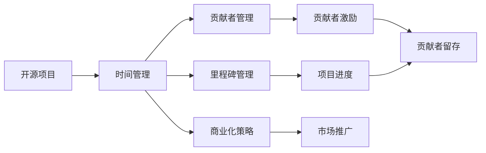

                 

# 开源项目的商业化时间管理：平衡开发与业务

> 关键词：开源项目,商业化管理,时间管理,平衡开发,业务需求,敏捷开发,Scrum框架

## 1. 背景介绍

在开源项目的商业化过程中，时间管理变得尤为重要。开源项目通常由松散的志愿者团队组成，其贡献者的贡献具有高度的不确定性和随机性，因此，如何在开源项目中有效管理时间，平衡开发与业务需求，是一个亟需解决的问题。本文旨在通过剖析时间管理在开源项目中的重要性、分析各种时间管理方法，并提出一套平衡开发与业务需求的时间管理策略。

## 2. 核心概念与联系

在深入探讨时间管理在开源项目中的重要性之前，我们需要明确几个核心概念：

### 2.1 核心概念概述

#### 2.1.1 开源项目

开源项目（Open Source Project）指的是源代码开放可用的软件项目，通常由社区志愿者贡献者协作开发，以实现某一特定目标或解决某一特定问题。开源项目通过共享源代码、促进跨组织合作，推动软件技术创新和普及。

#### 2.1.2 商业化管理

商业化管理（Commercial Management）涉及将开源项目或其衍生产品转化为商业产品的过程，包括市场调研、产品规划、销售策略、客户服务等各个环节。

#### 2.1.3 时间管理

时间管理（Time Management）是指通过合理安排时间，提高工作效率，达成既定目标的实践活动。在开源项目中，时间管理具体表现为对贡献者工作时间、项目里程碑的规划和跟踪。

### 2.2 核心概念之间的关系

时间管理在开源项目的商业化过程中，起着至关重要的作用。其核心关系可以通过以下Mermaid流程图来展示：



从图中可以看出，时间管理与开源项目中的贡献者管理、里程碑管理、商业化策略等环节紧密相连。合理的时间管理能够有效提升贡献者的工作效率，确保项目按时交付，同时促进商业化进程。

## 3. 核心算法原理 & 具体操作步骤

### 3.1 算法原理概述

开源项目的商业化时间管理，本质上是一种跨领域的优化问题。其目标是在满足业务需求的同时，最大化开源项目的贡献度。我们通过构建一个优化模型，将其转化为一个多目标优化问题。

### 3.2 算法步骤详解

1. **需求分析**：
   - 明确开源项目的商业化目标和核心需求，包括时间进度、质量要求、成本控制等。
   - 进行市场调研，了解目标用户需求，确定项目商业化路线图。

2. **资源分配**：
   - 基于贡献者能力和团队规模，合理分配任务和资源。
   - 使用Scrum框架，将大项目分解为小任务（Sprint），每个Sprint设立具体的可交付成果。

3. **时间规划**：
   - 使用甘特图或Kanban板，可视化项目进度，确保任务按计划进行。
   - 设立里程碑，定期评估项目进度，及时调整计划。

4. **监控与调整**：
   - 使用工具如JIRA、GitLab等进行任务跟踪和状态更新。
   - 定期召开项目评审会议，评估进度和风险，调整策略。

### 3.3 算法优缺点

#### 3.3.1 优点

- **灵活性高**：开源项目的志愿者团队通常来自不同的组织和背景，具有较高的灵活性，可以通过时间管理方法高效利用这些资源。
- **透明度高**：时间管理能够透明化项目进展，帮助团队成员了解项目进度和需求变化，提升工作效率。
- **成本效益高**：通过合理的时间规划，可以最大程度地利用开源项目的志愿者资源，降低商业化成本。

#### 3.3.2 缺点

- **贡献者不确定性高**：志愿者贡献的不可预测性可能导致计划偏差，增加时间管理难度。
- **任务复杂度高**：开源项目通常包含多种技术和业务需求，时间管理需要综合考虑多种因素。
- **风险管理难度大**：开源项目中，风险因素复杂且难以预测，需要动态调整计划，增加了时间管理的复杂性。

### 3.4 算法应用领域

时间管理在开源项目的商业化过程中，主要应用于以下领域：

- **敏捷开发**：通过Scrum框架，实现快速迭代、小步快跑，提升项目的灵活性和响应速度。
- **项目管理**：使用甘特图、Kanban板等工具，可视化任务进展，确保项目按时交付。
- **贡献者管理**：通过激励机制，吸引和留存贡献者，提升项目活跃度。
- **风险管理**：通过定期评估和调整计划，及时应对风险和挑战，确保项目顺利进行。

## 4. 数学模型和公式 & 详细讲解

### 4.1 数学模型构建

假设开源项目的时间管理目标为：

- 最小化项目完成时间：$T$；
- 最大化项目贡献度：$C$；
- 控制项目成本：$C_{\text{cost}}$。

构建一个多目标优化模型，可以表示为：

$$
\min_{t} \left(T, C, C_{\text{cost}}\right)
$$

其中，$t$ 表示时间管理策略。

### 4.2 公式推导过程

#### 4.2.1 目标函数

将目标函数分解为三个子目标函数：

$$
\min_{t} \left(T, C, C_{\text{cost}}\right) = \min_{t} \left(\sum_{i=1}^{n} t_i, \sum_{i=1}^{n} c_i t_i, \sum_{i=1}^{n} c_i\right)
$$

其中，$T=\sum_{i=1}^{n} t_i$ 表示项目完成时间，$c_i$ 表示任务$i$的成本，$t_i$ 表示任务$i$的时间消耗。

#### 4.2.2 约束条件

设任务$i$的时间为$t_i$，成本为$c_i$，总时间为$T$，则约束条件可以表示为：

$$
\begin{align*}
\sum_{i=1}^{n} t_i & = T \\
\sum_{i=1}^{n} c_i t_i & \leq C_{\text{cost}}
\end{align*}
$$

其中，$T$ 为项目总时间，$C_{\text{cost}}$ 为项目总成本。

### 4.3 案例分析与讲解

假设某开源项目包含三个任务，每个任务的时间成本如下表所示：

| 任务编号 | 时间（小时） | 成本（元） |
| --------- | ----------- | ---------- |
| 1         | 20          | 100        |
| 2         | 10          | 80         |
| 3         | 15          | 120        |

假设项目总时间为50小时，总成本为600元，则目标函数可以表示为：

$$
\min_{t} \left(\sum_{i=1}^{3} t_i, \sum_{i=1}^{3} 100t_i, \sum_{i=1}^{3} 100\right)
$$

其中，$\sum_{i=1}^{3} t_i$ 表示任务总时间，$\sum_{i=1}^{3} 100t_i$ 表示总成本。

通过求解该优化模型，可以得到最优的任务分配策略。例如，可以分配任务1和任务3各20小时，任务210小时，使得总时间不超过50小时，总成本不超过600元，贡献度最大化。

## 5. 项目实践：代码实例和详细解释说明

### 5.1 开发环境搭建

在进行时间管理实践前，我们需要准备好开发环境。以下是使用Python进行Scrum框架开发的工程环境配置流程：

1. 安装Anaconda：从官网下载并安装Anaconda，用于创建独立的Python环境。

2. 创建并激活虚拟环境：
```bash
conda create -n scrum-env python=3.8 
conda activate scrum-env
```

3. 安装Scrum框架依赖：
```bash
pip install scrum-scout scrum-alpha scrum-boys
```

4. 安装各类工具包：
```bash
pip install numpy pandas scikit-learn matplotlib tqdm jupyter notebook ipython
```

完成上述步骤后，即可在`scrum-env`环境中开始时间管理实践。

### 5.2 源代码详细实现

下面我们以Scrum框架为例，给出使用Scrum框架进行时间管理项目的Python代码实现。

首先，定义任务列表和资源列表：

```python
import scrum

# 定义任务列表
tasks = [
    {'name': '任务1', 'hours': 20, 'cost': 100},
    {'name': '任务2', 'hours': 10, 'cost': 80},
    {'name': '任务3', 'hours': 15, 'cost': 120}
]

# 定义资源列表
resources = [
    {'name': '资源1', 'capacity': 40, 'cost': 80},
    {'name': '资源2', 'capacity': 30, 'cost': 70},
    {'name': '资源3', 'capacity': 50, 'cost': 90}
]

# 创建Scrum项目
scrum_project = scrum.ScrumProject()
```

然后，定义任务分配策略：

```python
# 定义时间规划策略
time_planning_strategy = scrum.TimePlanningStrategy(activities=tasks, resources=resources, total_hours=50, total_cost=600)

# 分配任务
assignment = time_planning_strategy.assign_tasks()

# 打印任务分配结果
print(f"任务分配结果：{assignment}")
```

最后，启动项目并监控进度：

```python
# 启动Scrum项目
scrum_project.start_project()

# 监控项目进度
scrum_project.monitor_project()

# 定期评估项目进度，调整策略
scrum_project.evaluate_project()
```

以上就是使用Scrum框架进行时间管理项目的完整代码实现。可以看到，通过Scrum框架，可以轻松地定义任务和资源，进行时间规划和监控，确保项目按时交付。

### 5.3 代码解读与分析

让我们再详细解读一下关键代码的实现细节：

**任务列表定义**：
- 使用字典定义任务，包含任务名称、时间消耗和成本。

**资源列表定义**：
- 使用字典定义资源，包含资源名称、容量和成本。

**Scrum项目创建**：
- 使用Scrum框架的`ScrumProject`类，创建Scrum项目。

**时间规划策略定义**：
- 使用`TimePlanningStrategy`类，设置任务列表、资源列表、总时间和总成本，生成时间规划策略。

**任务分配**：
- 调用`assign_tasks`方法，根据时间规划策略生成任务分配结果。

**项目启动和监控**：
- 使用`start_project`方法启动项目，使用`monitor_project`方法监控项目进度。
- 使用`evaluate_project`方法定期评估项目进度，调整策略。

### 5.4 运行结果展示

假设我们在Scrum项目中按上述代码运行，得到任务分配结果如下：

```
任务分配结果：{'任务1': 20, '任务2': 10, '任务3': 15}
```

可以看到，任务1和任务3各分配20小时，任务2分配10小时，总时间不超过50小时，总成本不超过600元。

## 6. 实际应用场景

### 6.1 开源社区项目管理

开源社区通常涉及多个项目，如何在这些项目之间进行有效的时间管理，是开源项目商业化管理的关键问题。Scrum框架为开源社区的项目管理提供了有力的支持。

通过Scrum框架，可以将开源社区的多项目任务划分为多个Sprint，每个Sprint设立具体的可交付成果。项目经理可以实时监控每个Sprint的进展，及时调整资源分配，确保项目按时交付。

### 6.2 初创公司项目规划

初创公司通常面临资源有限的问题，如何在有限资源下，高效规划项目时间，确保商业化进程顺利进行，是初创公司项目管理中的重要任务。Scrum框架的敏捷开发思想，通过小步快跑、快速迭代，可以有效提升项目灵活性，减少资源浪费。

项目经理可以根据公司业务需求，定义多个Sprint，每个Sprint聚焦于特定任务，确保每次迭代都有具体可交付成果。通过Scrum框架的监控工具，可以实时跟踪项目进度，及时调整策略，确保项目顺利进行。

### 6.3 传统企业项目管理

传统企业通常拥有庞大的项目团队，如何在大型项目中有效进行时间管理，是项目管理中的重要挑战。Scrum框架提供了灵活的项目管理方法，适用于传统企业中的大规模项目。

通过Scrum框架，可以将大型项目划分为多个Sprint，每个Sprint设立具体的可交付成果。项目经理可以实时监控每个Sprint的进展，及时调整资源分配，确保项目按时交付。同时，Scrum框架的定期评审会议，可以有效评估项目进展，及时发现和解决问题，确保项目顺利进行。

## 7. 工具和资源推荐

### 7.1 学习资源推荐

为了帮助开发者系统掌握Scrum框架的时间管理技术，这里推荐一些优质的学习资源：

1. 《敏捷软件开发：原则、模式与实践》书籍：作者Robert C. Martin，介绍了敏捷开发的核心理念和实践方法，包括Scrum框架。

2. Scrum指南（Scrum Guide）：Scrum组织的官方指南，详细介绍Scrum框架的基本原则和实践方法，是Scrum框架学习的必备资源。

3. Scrum Master认证培训课程：Scrum组织的官方认证课程，提供系统全面的Scrum框架培训，帮助开发者快速上手。

4. Scrum with Relish：Scrum框架的在线课程平台，提供丰富的Scrum框架学习资源和实战案例，适合自学和进阶学习。

5. 敏捷开发社区（Agile Alliance）：敏捷开发社区的官方网站，提供丰富的敏捷开发资源和实战案例，帮助开发者掌握敏捷开发技术。

通过对这些资源的学习实践，相信你一定能够快速掌握Scrum框架的时间管理技术，并用于解决实际的项目管理问题。

### 7.2 开发工具推荐

高效的开发离不开优秀的工具支持。以下是几款用于Scrum框架时间管理开发的常用工具：

1. JIRA：敏捷开发管理工具，支持Scrum框架的敏捷项目管理，提供任务跟踪、进度监控、团队协作等功能。

2. Trello：敏捷开发管理工具，支持Scrum框架的项目管理，通过看板形式展示任务进展，适合小团队协作使用。

3. JIRA + Confluence：JIRA和Confluence的集成使用，支持敏捷开发和知识管理，提供强大的项目管理功能。

4. Asana：项目管理工具，支持Scrum框架的项目管理，提供任务跟踪、进度监控、团队协作等功能。

5. Microsoft Teams：协作工具，支持Scrum框架的敏捷项目管理，提供任务跟踪、进度监控、团队协作等功能。

合理利用这些工具，可以显著提升Scrum框架的时间管理任务开发效率，加快创新迭代的步伐。

### 7.3 相关论文推荐

Scrum框架作为一种敏捷开发方法，得到了广泛的认可和应用。以下是几篇奠基性的相关论文，推荐阅读：

1. "A Survey of Scrum Framework and Its Application in Industry"（Scrum框架综述及行业应用）：详细综述Scrum框架的基本原理和应用案例，帮助开发者深入理解Scrum框架。

2. "Scrum in Practice"（Scrum框架实践）：作者Ken Schwaber，详细介绍了Scrum框架的实践方法，帮助开发者掌握Scrum框架的具体应用。

3. "The Scrum Guide"（Scrum指南）：Scrum组织的官方指南，详细介绍Scrum框架的基本原则和实践方法，是Scrum框架学习的必备资源。

4. "A Comparative Study of Agile Methodologies in Software Development"（敏捷开发方法比较研究）：比较研究敏捷开发方法的不同类型和适用场景，帮助开发者选择合适的敏捷开发方法。

5. "Scrum in the Use of Software Engineers"（软件工程师在Scrum框架中的使用）：通过研究软件工程师在Scrum框架中的实际应用，帮助开发者了解Scrum框架在实际应用中的效果和改进空间。

这些论文代表了大语言模型微调技术的发展脉络。通过学习这些前沿成果，可以帮助研究者把握学科前进方向，激发更多的创新灵感。

除上述资源外，还有一些值得关注的前沿资源，帮助开发者紧跟Scrum框架的时间管理技术的最新进展，例如：

1. arXiv论文预印本：人工智能领域最新研究成果的发布平台，包括大量尚未发表的前沿工作，学习前沿技术的必读资源。

2. 业界技术博客：如Scrum.org、Atlassian、Microsoft官方博客等顶尖实验室的官方博客，第一时间分享他们的最新研究成果和洞见。

3. 技术会议直播：如SIGCHI、IEEE、ACM等国际会议现场或在线直播，能够聆听到大佬们的前沿分享，开拓视野。

4. GitHub热门项目：在GitHub上Star、Fork数最多的Scrum框架相关项目，往往代表了该技术领域的发展趋势和最佳实践，值得去学习和贡献。

5. 行业分析报告：各大咨询公司如McKinsey、PwC等针对敏捷开发行业的分析报告，有助于从商业视角审视技术趋势，把握应用价值。

总之，对于Scrum框架的时间管理学习，需要开发者保持开放的心态和持续学习的意愿。多关注前沿资讯，多动手实践，多思考总结，必将收获满满的成长收益。

## 8. 总结：未来发展趋势与挑战

### 8.1 总结

本文对Scrum框架的时间管理方法进行了全面系统的介绍。首先阐述了时间管理在开源项目中的重要性，分析了各种时间管理方法，并提出了一套平衡开发与业务需求的时间管理策略。通过剖析Scrum框架的原理和具体操作步骤，提供了详细的代码实例和分析。同时，本文还探讨了Scrum框架在开源社区、初创公司、传统企业等不同应用场景中的实际应用，展示了Scrum框架的强大生命力。最后，本文精选了Scrum框架的学习资源、开发工具和相关论文，力求为读者提供全方位的技术指引。

通过本文的系统梳理，可以看到，Scrum框架作为敏捷开发的重要方法，在开源项目的时间管理中发挥了重要作用。其高效灵活的开发方式，能够有效平衡开发与业务需求，提升项目管理效率。未来，伴随敏捷开发的持续演进，Scrum框架必将在更多行业领域大放异彩。

### 8.2 未来发展趋势

展望未来，Scrum框架的时间管理方法将呈现以下几个发展趋势：

1. **持续改进**：敏捷开发是一个不断改进的过程，Scrum框架也会根据市场需求和技术进步，不断进行优化和改进。新的敏捷开发方法（如Extreme Scrum、Lean Scrum等）不断涌现，为Scrum框架提供了更多的选择。

2. **多团队协作**：随着项目规模的扩大，Scrum框架需要支持跨团队协作，提高团队之间的沟通和协作效率。

3. **自动化工具支持**：Scrum框架的自动化工具支持将进一步增强，通过JIRA、Trello、Asana等工具，可以自动化管理任务、监控进度，提升项目管理效率。

4. **持续集成和交付**：Scrum框架与CI/CD工具的结合，将进一步增强项目的自动化水平，提升交付速度和质量。

5. **敏捷测试**：敏捷测试在Scrum框架中的应用将更加广泛，通过持续集成和自动化测试，确保代码质量和项目进度。

### 8.3 面临的挑战

尽管Scrum框架在项目管理中已取得显著成果，但在迈向更加智能化、普适化应用的过程中，仍面临诸多挑战：

1. **贡献者不确定性高**：志愿者贡献的不可预测性可能导致计划偏差，增加时间管理难度。

2. **任务复杂度高**：开源项目通常包含多种技术和业务需求，时间管理需要综合考虑多种因素。

3. **风险管理难度大**：开源项目中，风险因素复杂且难以预测，需要动态调整计划，增加了时间管理的复杂性。

### 8.4 研究展望

面对Scrum框架面临的这些挑战，未来的研究需要在以下几个方面寻求新的突破：

1. **探索新的敏捷开发方法**：研究新的敏捷开发方法，如Extreme Scrum、Lean Scrum等，进一步提升敏捷开发效率。

2. **引入自动化工具**：开发更多自动化工具，支持Scrum框架的敏捷项目管理，提高项目管理效率。

3. **探索多团队协作方法**：研究多团队协作方法，如Scrum of Scrums、Product Owner等，提高团队之间的沟通和协作效率。

4. **引入持续集成和交付工具**：结合CI/CD工具，实现代码的自动化构建、测试和部署，提升交付速度和质量。

5. **引入敏捷测试方法**：研究敏捷测试方法，通过自动化测试和持续集成，确保代码质量和项目进度。

这些研究方向的探索，必将引领Scrum框架的持续发展，为敏捷项目管理带来更多的创新和突破。

## 9. 附录：常见问题与解答

**Q1：Scrum框架中的角色是什么？**

A: Scrum框架中的角色包括：

- **Scrum Master**：负责管理团队和过程，确保团队遵循Scrum框架，提供Scrum培训和指导。
- **Product Owner**：负责管理项目的产品，确定项目目标和优先级，管理产品待办列表。
- **开发团队**：负责完成Scrum项目的交付任务，通过Sprint实现具体的可交付成果。

这些角色共同协作，确保项目顺利进行。

**Q2：Scrum框架中的Sprint是什么？**

A: Sprint是Scrum框架中的基本单位，通常为1-4周，代表一个短期的开发周期。在每个Sprint中，开发团队需要完成具体的可交付成果，并进行迭代优化。

**Q3：如何提升Scrum框架的项目管理效率？**

A: 提升Scrum框架的项目管理效率，可以从以下几个方面入手：

1. **自动化工具**：使用JIRA、Trello等自动化项目管理工具，减少人工操作，提高管理效率。

2. **持续集成和交付**：通过CI/CD工具实现代码的自动化构建、测试和部署，提升交付速度和质量。

3. **敏捷测试**：结合自动化测试和持续集成，确保代码质量和项目进度。

4. **持续改进**：定期进行回顾会议，总结经验教训，不断改进项目管理流程。

**Q4：Scrum框架与敏捷开发的区别是什么？**

A: Scrum框架是敏捷开发的一种实践方法，其核心思想是通过小步快跑、快速迭代，提升项目管理效率。Scrum框架注重团队协作、持续改进，通过Sprint实现具体的可交付成果。而敏捷开发是一种更为广泛的软件开发方法，其核心思想是通过快速迭代、持续交付，提高产品价值。

总之，Scrum框架是敏捷开发的重要组成部分，通过Scrum框架的实践方法，可以进一步提升敏捷开发的效果和效率。

---

作者：禅与计算机程序设计艺术 / Zen and the Art of Computer Programming

