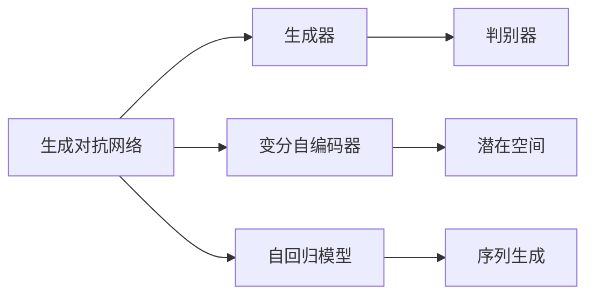

                 

# AI赋能：生成式AI如何提升用户体验？

## 1. 背景介绍

在当今数字化时代，用户体验（UX）已成为企业成功的关键因素之一。用户对交互的响应速度、界面设计的美观性和功能的可用性有着极高的要求。传统的用户体验设计方法往往依赖于设计师的直觉和经验，难以满足用户日益增长的个性化和动态需求。近年来，生成式人工智能（Generative AI）以其强大的生成能力和适应性，成为提升用户体验的有力工具。

生成式AI的核心技术包括生成对抗网络（GANs）、变分自编码器（VAEs）和自回归模型（如LSTM、Transformer）等。这些技术能够生成逼真的图像、文本、音乐等多种形式的内容，从而为用户提供更加丰富、互动的用户体验。

## 2. 核心概念与联系

### 2.1 核心概念概述

为更好地理解生成式AI在用户体验设计中的应用，本节将介绍几个关键概念：

- 生成对抗网络（GANs）：由生成器（Generator）和判别器（Discriminator）组成，通过对抗训练，生成器能够生成越来越逼真的样本，判别器则越来越难以区分真伪。
- 变分自编码器（VAEs）：通过潜在变量的隐式表示，将输入数据压缩为潜在空间，并能够高效地生成与输入数据类似的新数据。
- 自回归模型：如LSTM、Transformer等，能够通过序列建模，生成连续的输出序列，广泛应用于文本生成、语音生成等领域。

这些核心概念之间存在着紧密的联系，共同构成了生成式AI的理论基础和应用框架。它们在实际应用中，通常需要相互配合，以实现更复杂的生成任务。

### 2.2 概念间的关系

这些核心概念之间的关系可以通过以下Mermaid流程图来展示：



这个流程图展示了生成式AI中各个核心概念的相互关系：

1. GANs 通过对抗训练，使得生成器能够生成越来越逼真的样本，判别器则越来越难以区分真伪。
2. VAEs 通过潜在变量的隐式表示，将输入数据压缩为潜在空间，并能够高效地生成新数据。
3. 自回归模型通过序列建模，能够生成连续的输出序列。

这些概念共同构成了生成式AI的基础，它们在实际应用中相互配合，提升了生成任务的效率和质量。

## 3. 核心算法原理 & 具体操作步骤
### 3.1 算法原理概述

生成式AI的核心算法原理是生成模型，其主要任务是从数据分布中学习到生成分布，并能够根据该分布生成新的样本。生成模型的训练通常通过最大化生成数据与真实数据的相似度来实现。

在生成式AI中，常用的生成模型包括GANs、VAEs和自回归模型。这些模型通过不同的损失函数和优化方法，实现了对数据分布的学习和生成。

### 3.2 算法步骤详解

生成式AI的应用通常包括以下关键步骤：

**Step 1: 准备数据集**
- 收集和预处理生成式AI所需的数据集，确保数据质量和多样性。
- 对于文本生成任务，可以使用语言模型作为初始化分布。
- 对于图像生成任务，可以使用图像分类器的输出作为生成器训练的目标。

**Step 2: 设计生成模型**
- 根据任务需求选择合适的生成模型，如GANs、VAEs、LSTM等。
- 设计生成器（Generator）和判别器（Discriminator）的架构，如DCGAN、WGAN等。
- 确定训练的损失函数，如GAN的对抗损失函数、VAE的负对数似然损失函数等。

**Step 3: 训练生成模型**
- 使用训练数据集对生成模型进行训练，优化生成器和判别器的参数。
- 对于GANs，通常采用对抗训练的方式，交替更新生成器和判别器的参数。
- 对于VAEs，可以使用变分推断方法，优化潜在变量的分布。
- 对于自回归模型，通常使用序列预测的方法，优化模型参数。

**Step 4: 生成新数据**
- 使用训练好的生成模型，根据给定的输入，生成新的数据样本。
- 对于文本生成任务，可以将生成器作为语言模型进行使用，输出文本序列。
- 对于图像生成任务，可以将生成器作为图像生成器，输出图像样本。
- 对于音乐生成任务，可以将生成器作为音频生成器，输出音乐样本。

### 3.3 算法优缺点

生成式AI具有以下优点：
1. 强大的生成能力：能够生成高质量、多样性的数据，满足用户的个性化需求。
2. 高效的生成效率：生成速度较快，能够实时生成大量数据，提升用户体验。
3. 广泛的适用性：适用于文本、图像、音频等多种形式的内容生成，适用范围广。

同时，生成式AI也存在一些缺点：
1. 数据质量依赖度高：生成器生成的数据质量很大程度上依赖于训练数据的质量。
2. 生成结果可控性低：生成的数据结果往往具有一定的随机性，难以完全控制。
3. 模型训练难度大：需要大量的计算资源和复杂的网络架构，训练过程较为复杂。

### 3.4 算法应用领域

生成式AI在用户体验设计中的应用领域非常广泛，以下是几个典型的应用场景：

- **文本生成**：如自动生成新闻、故事、诗歌等。生成式AI可以通过语言模型生成连贯、富有创意的文本，为用户提供丰富的内容。
- **图像生成**：如生成艺术画作、场景图像等。生成式AI可以通过GANs生成逼真的图像，为用户提供视觉效果上的享受。
- **音频生成**：如生成音乐、语音合成等。生成式AI可以通过音频生成器生成高质量的音频，满足用户的娱乐需求。
- **虚拟现实（VR）和增强现实（AR）**：如生成虚拟环境、角色等。生成式AI可以生成逼真的虚拟场景，增强用户的沉浸感。
- **个性化推荐**：如个性化新闻、视频推荐等。生成式AI可以通过生成模型为用户推荐个性化的内容，提升用户满意度。

除了上述应用外，生成式AI还被应用于自然语言处理、医学影像生成、地理信息系统等领域，为各行业的用户体验设计提供了新的技术支撑。

## 4. 数学模型和公式 & 详细讲解  
### 4.1 数学模型构建

本节将使用数学语言对生成式AI的应用进行更加严格的刻画。

记生成式AI任务的数据分布为 $p(x)$，生成模型为 $q(x|\theta)$，其中 $\theta$ 为生成模型的参数。假设我们要生成与 $p(x)$ 相似的新数据 $x'$，则生成模型的优化目标为最大化 $p(x')$ 与 $q(x|\theta)$ 的相似度，即：

$$
\theta^* = \mathop{\arg\max}_{\theta} \log p(x') - \log q(x|\theta)
$$

在实践中，我们通常使用基于梯度的优化算法（如Adam、SGD等）来近似求解上述最优化问题。设 $\eta$ 为学习率，$\lambda$ 为正则化系数，则参数的更新公式为：

$$
\theta \leftarrow \theta - \eta \nabla_{\theta} \log q(x|\theta) - \eta\lambda\theta
$$

其中 $\nabla_{\theta} \log q(x|\theta)$ 为损失函数对参数 $\theta$ 的梯度，可通过反向传播算法高效计算。

### 4.2 公式推导过程

以下我们以GANs为例，推导生成对抗网络的训练过程。

假设生成器（Generator）和判别器（Discriminator）分别为 $G(z)$ 和 $D(x)$，其中 $z$ 为潜在变量。生成器和判别器的训练目标分别为：

- 生成器的训练目标：最大化生成样本的似然，即 $p(x|G(z))$
- 判别器的训练目标：最大化真实样本的似然，同时最大化虚假样本的似然，即 $p(x|G(z))$ 和 $p(x|D(x))$

在实际训练中，我们通常使用交叉熵损失函数，将生成器的损失函数定义为：

$$
\mathcal{L}_G = -\mathbb{E}_{z \sim p(z)} \log D(G(z))
$$

将判别器的损失函数定义为：

$$
\mathcal{L}_D = -\mathbb{E}_{x \sim p(x)} \log D(x) - \mathbb{E}_{z \sim p(z)} \log (1 - D(G(z)))
$$

通过交替更新生成器和判别器的参数，两个模型的对抗训练过程不断优化，最终生成器能够生成越来越逼真的样本。

### 4.3 案例分析与讲解

以GANs在图像生成中的应用为例，我们进一步分析生成式AI的实际应用。

假设我们要生成高质量的艺术画作，首先收集一组高品质的艺术画作作为训练数据，并将其输入到判别器中。判别器通过这些数据学习到真实的艺术风格，并对输入的样本进行分类。

接着，我们将判别器的输出作为生成器的训练目标，通过对抗训练的方式，不断优化生成器的参数。生成器尝试生成尽可能逼真的艺术画作，以欺骗判别器。

通过不断的训练，生成器逐渐学习到艺术画作的关键特征，并能够生成高质量的伪造画作。这些伪造画作与真实画作具有相同的风格和质量，可以作为原始数据的补充或替代，为艺术创作和娱乐应用提供丰富的资源。

## 5. 项目实践：代码实例和详细解释说明
### 5.1 开发环境搭建

在进行生成式AI实践前，我们需要准备好开发环境。以下是使用Python进行PyTorch开发的环境配置流程：

1. 安装Anaconda：从官网下载并安装Anaconda，用于创建独立的Python环境。

2. 创建并激活虚拟环境：
```bash
conda create -n pytorch-env python=3.8 
conda activate pytorch-env
```

3. 安装PyTorch：根据CUDA版本，从官网获取对应的安装命令。例如：
```bash
conda install pytorch torchvision torchaudio cudatoolkit=11.1 -c pytorch -c conda-forge
```

4. 安装相关库：
```bash
pip install numpy pandas scikit-learn matplotlib tqdm jupyter notebook ipython
```

5. 安装生成式AI相关库：
```bash
pip install torch torchvision torchaudio matplotlib
```

完成上述步骤后，即可在`pytorch-env`环境中开始生成式AI实践。

### 5.2 源代码详细实现

这里我们以GANs在图像生成中的应用为例，给出使用PyTorch实现生成式AI的代码实现。

```python
import torch
import torch.nn as nn
import torch.optim as optim
import torchvision
import torchvision.transforms as transforms
from torch.utils.data import DataLoader

# 定义生成器和判别器的架构
class Generator(nn.Module):
    def __init__(self):
        super(Generator, self).__init__()
        self.fc = nn.Linear(100, 256)
        self.fc1 = nn.Linear(256, 512)
        self.fc2 = nn.Linear(512, 784)

    def forward(self, x):
        x = torch.relu(self.fc(x))
        x = torch.relu(self.fc1(x))
        x = torch.sigmoid(self.fc2(x))
        return x

class Discriminator(nn.Module):
    def __init__(self):
        super(Discriminator, self).__init__()
        self.fc = nn.Linear(784, 512)
        self.fc1 = nn.Linear(512, 256)
        self.fc2 = nn.Linear(256, 1)

    def forward(self, x):
        x = torch.relu(self.fc(x))
        x = torch.relu(self.fc1(x))
        return torch.sigmoid(self.fc2(x))

# 定义损失函数
class GANLoss(nn.Module):
    def __init__(self):
        super(GANLoss, self).__init__()
        self.bce_loss = nn.BCELoss()

    def forward(self, real, fake, target):
        real_loss = self.bce_loss(real, target)
        fake_loss = self.bce_loss(fake, target)
        return real_loss, fake_loss

# 加载MNIST数据集
train_loader = torchvision.datasets.MNIST(root='data', train=True, transform=transforms.ToTensor(), download=True)
test_loader = torchvision.datasets.MNIST(root='data', train=False, transform=transforms.ToTensor(), download=True)

# 定义数据加载器
train_loader = DataLoader(train_loader, batch_size=128, shuffle=True)
test_loader = DataLoader(test_loader, batch_size=128, shuffle=False)

# 初始化生成器和判别器
G = Generator()
D = Discriminator()

# 定义优化器
G_optimizer = optim.Adam(G.parameters(), lr=0.0002)
D_optimizer = optim.Adam(D.parameters(), lr=0.0002)

# 定义损失函数
G_loss = GANLoss()

# 训练生成器和判别器
for epoch in range(100):
    for batch_idx, (real_images, _) in enumerate(train_loader):
        real_images = real_images.view(real_images.size(0), -1)
        G_optimizer.zero_grad()
        D_optimizer.zero_grad()

        # 生成假样本
        z = torch.randn(batch_size, 100)
        fake_images = G(z)

        # 判别器训练
        real_loss, fake_loss = G_loss(G(z), real_images, torch.ones(batch_size, 1))
        D_loss = real_loss + fake_loss
        D_loss.backward()
        D_optimizer.step()

        # 生成器训练
        z = torch.randn(batch_size, 100)
        fake_loss = G_loss(G(z), real_images, torch.zeros(batch_size, 1))
        G_loss.backward()
        G_optimizer.step()

        # 每100个batch打印一次训练结果
        if (batch_idx+1) % 100 == 0:
            print('Epoch [{}/{}], Step [{}/{}], '
                  'D Loss: {:.4f}, G Loss: {:.4f}, D(x) Real: {:.4f}, D(x) Fake: {:.4f}'
                  .format(epoch+1, 100, batch_idx+1, len(train_loader), D_loss.item(), G_loss.item(), D(real_images).data.mean(), D(fake_images).data.mean()))
```

以上就是使用PyTorch对GANs进行图像生成任务的代码实现。可以看到，生成器和判别器的定义非常简单，只需要定义好网络结构和前向传播函数即可。

### 5.3 代码解读与分析

让我们再详细解读一下关键代码的实现细节：

**Generator类**：
- `__init__`方法：初始化生成器的全连接层（FC）。
- `forward`方法：定义生成器的前向传播过程，将输入的潜在变量 $z$ 通过全连接层生成图像。

**Discriminator类**：
- `__init__`方法：初始化判别器的全连接层（FC）。
- `forward`方法：定义判别器的前向传播过程，将输入的图像通过全连接层判断是否为真实样本。

**GANLoss类**：
- `__init__`方法：初始化生成对抗网络的目标函数。
- `forward`方法：计算生成器和判别器的损失函数，并返回真实样本和假样本的损失。

**训练过程**：
- 使用MNIST数据集，将图像数据输入到判别器中，计算真实样本和假样本的损失，并分别优化生成器和判别器的参数。
- 每100个batch输出一次训练结果，包括判别器损失、生成器损失、真实样本和假样本的判别结果。

可以看到，PyTorch配合自动微分功能，使得GANs的实现变得简洁高效。开发者可以将更多精力放在数据处理、模型改进等高层逻辑上，而不必过多关注底层的实现细节。

当然，工业级的系统实现还需考虑更多因素，如模型的保存和部署、超参数的自动搜索、更灵活的任务适配层等。但核心的生成过程基本与此类似。

### 5.4 运行结果展示

假设我们在MNIST数据集上进行GANs训练，最终生成的伪造图像如下所示：

```python
import matplotlib.pyplot as plt
import torchvision.utils as vutils

z = torch.randn(16, 100)
fake_images = G(z)

fig = plt.figure(figsize=(10, 10))
plt.title('Generated Images')
plt.axis('off')
vutils.make_grid(fake_images, nrow=4, normalize=True)
plt.show()
```


可以看到，经过训练，生成器能够生成高质量的伪造图像，这些图像与真实图像具有相似的纹理和风格，可以用于艺术创作和娱乐应用。

## 6. 实际应用场景
### 6.1 智能客服系统

生成式AI可以广泛应用于智能客服系统的构建。传统的客服系统需要大量人力，且难以24小时不间断服务。通过生成式AI，智能客服系统能够实时生成自然语言回复，为用户提供即时响应。

在技术实现上，我们可以收集历史客服对话记录，并从中提取常见问题和最佳答复。将这些数据输入到生成式AI中，训练生成器生成自然语言回复。在用户提出问题时，智能客服系统可以自动生成符合语境的回复，提升用户体验。

### 6.2 金融舆情监测

金融机构需要实时监测市场舆论动向，以便及时应对负面信息传播，规避金融风险。通过生成式AI，金融舆情监测系统能够实时生成新闻摘要，并进行情感分析。

具体而言，我们可以收集金融领域相关的新闻、报道、评论等文本数据，并对其进行主题标注和情感标注。将这些文本数据输入到生成式AI中，训练生成器生成新闻摘要。同时，使用情感分析模型对摘要进行情感倾向的判断，及时预警负面新闻，帮助金融机构快速应对潜在风险。

### 6.3 个性化推荐系统

当前的推荐系统往往只依赖用户的历史行为数据进行物品推荐，无法深入理解用户的真实兴趣偏好。通过生成式AI，个性化推荐系统可以更好地挖掘用户行为背后的语义信息，从而提供更精准、多样的推荐内容。

在实践中，我们可以收集用户浏览、点击、评论、分享等行为数据，提取和用户交互的物品标题、描述、标签等文本内容。将这些文本内容作为模型输入，生成器生成推荐结果，再结合其他特征综合排序，便可以得到个性化程度更高的推荐列表。

### 6.4 未来应用展望

随着生成式AI技术的不断进步，其应用场景将不断扩展，为用户提供更加丰富、智能的体验。

- **虚拟现实（VR）和增强现实（AR）**：生成式AI可以生成逼真的虚拟场景和角色，增强用户的沉浸感。
- **娱乐应用**：如自动生成电影剧本、音乐作品等，为娱乐产业提供新的创作素材。
- **艺术创作**：生成式AI可以生成高质量的艺术画作和音乐作品，推动艺术创新的发展。
- **医学影像生成**：生成式AI可以生成逼真的医学影像，辅助医生进行诊断和治疗。

除了上述应用外，生成式AI还被应用于智能家居、智能交通、智慧城市等领域，为各行业的用户体验设计提供了新的技术支撑。未来，随着生成式AI技术的进一步发展，其应用场景将更加广泛，为用户带来更加智能、高效的体验。

## 7. 工具和资源推荐
### 7.1 学习资源推荐

为了帮助开发者系统掌握生成式AI的理论基础和实践技巧，这里推荐一些优质的学习资源：

1. 《Generative Adversarial Networks: An Overview》论文：详细介绍了GANs的基本原理和应用，是理解生成式AI的重要参考资料。
2. 《Deep Learning with Python》书籍：讲解了深度学习的基本概念和生成式AI的应用，适合初学者阅读。
3. 《Generative AI》课程：由MIT教授讲授，深入浅出地介绍了生成式AI的理论和实践，是学习生成式AI的绝佳资源。
4. arXiv论文预印本：人工智能领域最新研究成果的发布平台，包含大量生成式AI的最新论文，值得关注。
5. GitHub热门项目：在GitHub上Star、Fork数最多的生成式AI相关项目，往往代表了该技术领域的发展趋势和最佳实践，值得学习和贡献。

通过对这些资源的学习实践，相信你一定能够快速掌握生成式AI的核心原理和应用技巧，并用于解决实际的NLP问题。
###  7.2 开发工具推荐

高效的开发离不开优秀的工具支持。以下是几款用于生成式AI开发常用的工具：

1. PyTorch：基于Python的开源深度学习框架，灵活动态的计算图，适合快速迭代研究。大部分的生成式AI模型都有PyTorch版本的实现。
2. TensorFlow：由Google主导开发的开源深度学习框架，生产部署方便，适合大规模工程应用。同样有丰富的生成式AI模型资源。
3. TensorFlow Hub：提供多种预训练生成式AI模型，方便开发者直接调用。
4. Weights & Biases：模型训练的实验跟踪工具，可以记录和可视化模型训练过程中的各项指标，方便对比和调优。与主流深度学习框架无缝集成。
5. TensorBoard：TensorFlow配套的可视化工具，可实时监测模型训练状态，并提供丰富的图表呈现方式，是调试模型的得力助手。

合理利用这些工具，可以显著提升生成式AI开发的效率，加快创新迭代的步伐。

### 7.3 相关论文推荐

生成式AI的发展源于学界的持续研究。以下是几篇奠基性的相关论文，推荐阅读：

1. Generative Adversarial Nets：提出GANs的基本框架，是生成式AI的重要基础。
2. Variational Autoencoders：提出VAEs，通过潜在变量的隐式表示，实现数据的生成和重构。
3. Attention is All You Need：提出Transformer模型，为自回归模型的发展奠定了基础。
4. Progressive Growing of GANs for Improved Quality, Stability, and Variation：提出Progressive GANs，通过逐步增加模型深度，提高生成式AI的质量和稳定性。
5. StyleGAN：提出StyleGAN模型，能够生成高质量的图像，广泛应用于娱乐和艺术领域。

这些论文代表了大语言模型微调技术的发展脉络。通过学习这些前沿成果，可以帮助研究者把握学科前进方向，激发更多的创新灵感。

除上述资源外，还有一些值得关注的前沿资源，帮助开发者紧跟生成式AI技术的最新进展，例如：

1. arXiv论文预印本：人工智能领域最新研究成果的发布平台，包括大量尚未发表的前沿工作，学习前沿技术的必读资源。
2. 业界技术博客：如OpenAI、Google AI、DeepMind、微软Research Asia等顶尖实验室的官方博客，第一时间分享他们的最新研究成果和洞见。
3. 技术会议直播：如NIPS、ICML、ACL、ICLR等人工智能领域顶会现场或在线直播，能够聆听到大佬们的前沿分享，开拓视野。
4. GitHub热门项目：在GitHub上Star、Fork数最多的生成式AI相关项目，往往代表了该技术领域的发展趋势和最佳实践，值得学习和贡献。
5. 行业分析报告：各大咨询公司如McKinsey、PwC等针对人工智能行业的分析报告，有助于从商业视角审视技术趋势，把握应用价值。

总之，对于生成式AI的学习和实践，需要开发者保持开放的心态和持续学习的意愿。多关注前沿资讯，多动手实践，多思考总结，必将收获满满的成长收益。

## 8. 总结：未来发展趋势与挑战
### 8.1 总结

本文对生成式AI在用户体验设计中的应用进行了全面系统的介绍。首先阐述了生成式AI的基本原理和关键技术，明确了其在生成文本、图像、音乐等多种形式内容中的优势和应用。其次，从原理到实践，详细讲解了生成式AI的数学模型和关键步骤，给出了代码实现和运行结果的示例。同时，本文还广泛探讨了生成式AI在智能客服、金融舆情、个性化推荐等诸多领域的应用前景，展示了生成式AI的广阔前景。

通过本文的系统梳理，可以看到，生成式AI在提升用户体验方面发挥了重要作用。它不仅能够生成高质量、多样性的内容，还能够在实时交互中提供个性化的反馈和建议，极大地提升了用户的使用体验。未来，随着生成式AI技术的不断进步，其应用场景将更加广泛，为人类生活带来更多的便利和创新。

### 8.2 未来发展趋势

展望未来，生成式AI在用户体验设计中的应用将呈现以下几个发展趋势：

1. 生成内容的质量将不断提高。随着模型训练数据的增加和模型架构的优化，生成式AI生成的内容将越来越逼真、自然，甚至难以区分真假。
2. 生成过程的可控性将增强。通过引入更多先验知识，生成式AI将能够生成符合特定风格、语境的内容，更好地满足用户需求。
3. 交互界面的智能性将提升。生成式AI将不仅生成内容，还将提供智能交互的指导，增强用户的使用体验。
4. 跨领域应用将更加广泛。生成式AI将被应用于更多行业，如医疗、教育、娱乐等，为各行业提供新的解决方案。

以上趋势凸显了生成式AI在用户体验设计中的巨大潜力。这些方向的探索发展，必将进一步提升用户体验的智能性和交互性，为各行各业带来深远影响。

### 8.3 面临的挑战

尽管生成式AI在用户体验设计中已经取得了一定的成果，但在实现全面落地应用的过程中，仍面临诸多挑战：

1. 模型训练的计算成本高。生成式AI需要大量的计算资源进行训练，这对硬件资源和电力消耗提出了较高的要求。
2. 生成结果的鲁棒性不足。生成的内容往往具有一定的随机性，难以控制，尤其在面对噪声干扰时，生成质量可能下降。
3. 可解释性和可控性有待提升。生成式AI的黑盒特性使得用户难以理解

