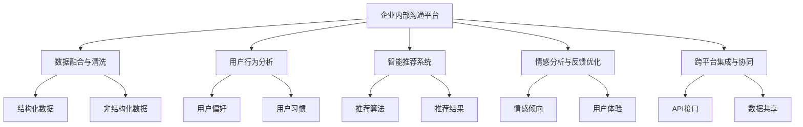
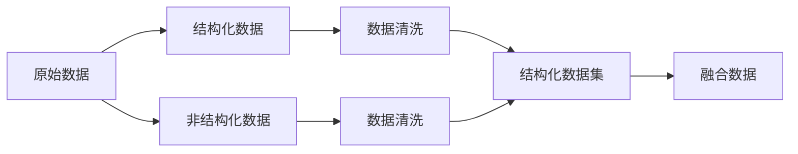
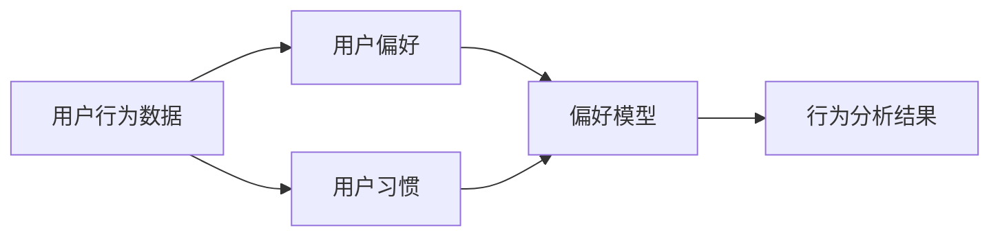
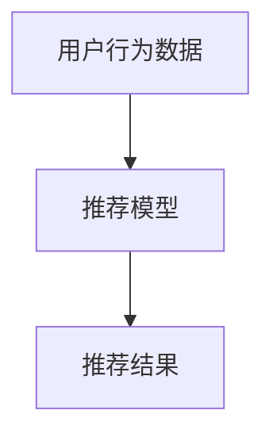
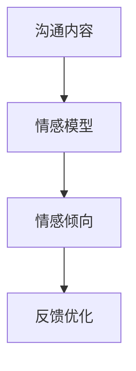
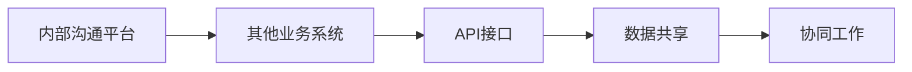
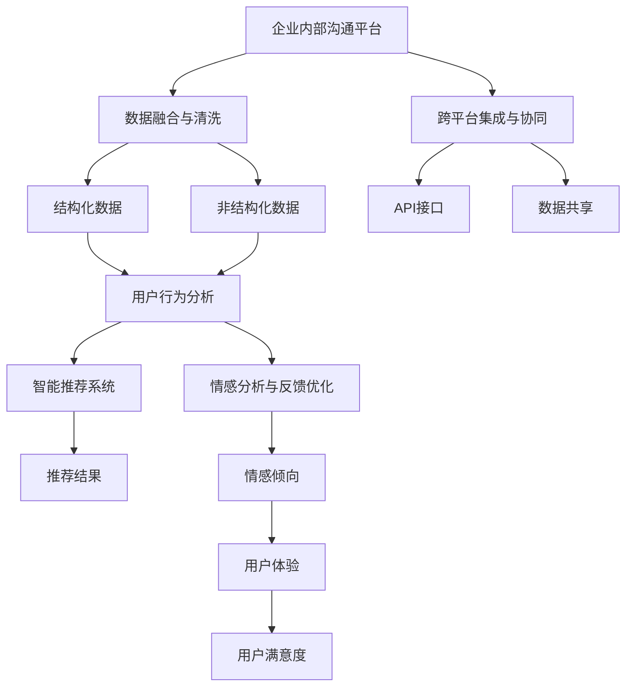

                 

## 1. 背景介绍

### 1.1 问题由来
企业内部沟通平台是现代企业信息化管理的重要组成部分，其高效运行对于提升团队协作效率、促进知识共享、增强决策支持等方面具有至关重要的作用。然而，在当前的企业管理实践中，内部沟通平台仍存在诸多问题，包括但不限于信息孤岛、沟通障碍、知识碎片化等，严重影响了企业整体运行效率。

为了解决这些问题，许多企业尝试引入AI技术优化内部沟通平台，以期通过智能化的信息处理和用户行为分析，提高平台的用户粘性和使用效率。然而，AI驱动的内部沟通平台优化方案设计复杂，涉及众多核心概念和技术，如何高效设计并实施，一直是企业IT部门面临的重要挑战。

### 1.2 问题核心关键点
AI驱动的内部沟通平台优化方案，需要综合考虑以下几个核心关键点：
- **数据融合与清洗**：将企业内外的结构化与非结构化数据进行有效融合，并对其进行清洗，去除噪声与冗余，为后续的AI模型训练和推理提供高质量数据。
- **用户行为分析**：通过对用户的使用数据进行分析，挖掘用户的沟通偏好、工作习惯等信息，从而优化平台的用户界面和功能。
- **智能推荐系统**：基于用户行为分析结果，设计智能推荐系统，通过推荐相关文档、知识库内容等，帮助用户快速找到所需信息，提高沟通效率。
- **情感分析与反馈优化**：利用自然语言处理(NLP)技术，分析用户之间的沟通内容，识别情感倾向，优化平台的用户体验。
- **跨平台集成与协同**：将企业内部沟通平台与其他业务系统进行深度集成，实现跨平台的协同工作，提升工作效率。

### 1.3 问题研究意义
优化企业内部沟通平台，有助于企业提升运营效率、降低管理成本、增强团队协作，具有重要的实际意义：

1. **提升效率**：智能化的信息处理和推荐系统，能够帮助员工快速找到所需信息，减少信息检索时间，提高工作效率。
2. **降低成本**：通过自动化处理和智能推荐，减少人工筛选、信息检索的重复工作，从而降低运营成本。
3. **增强协作**：跨平台的集成和协同工作，促进信息共享与协作，增强团队合力，推动企业战略目标的实现。
4. **数据驱动决策**：通过实时数据分析和情感分析，了解团队动态和情绪，及时调整沟通策略和管理措施。
5. **持续优化**：基于用户反馈和行为数据，持续优化平台的功能和用户体验，使其适应不断变化的企业需求。

## 2. 核心概念与联系

### 2.1 核心概念概述

为更好地理解AI驱动的企业内部沟通平台优化方案，本节将介绍几个密切相关的核心概念：

- **企业内部沟通平台**：包括但不限于即时通讯、知识库、文档管理系统等，是企业内部沟通和信息共享的主要工具。
- **AI驱动**：通过引入机器学习、自然语言处理等AI技术，实现平台功能的智能化、自动化，提高用户体验和平台效率。
- **数据融合与清洗**：将不同来源的结构化与非结构化数据进行有效融合，并通过清洗去除噪声与冗余，为模型训练和推理提供高质量数据。
- **用户行为分析**：通过对用户的行为数据进行分析和建模，挖掘用户的偏好和习惯，优化平台的用户体验。
- **智能推荐系统**：基于用户行为数据，设计推荐算法，实现相关文档、知识库内容的智能推荐，提升信息获取效率。
- **情感分析与反馈优化**：利用NLP技术，分析用户之间的沟通内容，识别情感倾向，优化平台的用户体验。
- **跨平台集成与协同**：通过API接口、数据共享等方式，将企业内部沟通平台与其他业务系统进行集成，实现跨平台协同工作。

这些核心概念之间的逻辑关系可以通过以下Mermaid流程图来展示：



这个流程图展示了大语言模型的核心概念及其之间的关系：

1. 企业内部沟通平台通过数据融合与清洗获取高质量数据。
2. 用户行为分析挖掘用户偏好和习惯。
3. 智能推荐系统基于用户行为分析结果实现推荐。
4. 情感分析与反馈优化优化用户体验。
5. 跨平台集成与协同实现信息共享与协作。

### 2.2 概念间的关系

这些核心概念之间存在着紧密的联系，形成了企业内部沟通平台优化的完整生态系统。下面我们通过几个Mermaid流程图来展示这些概念之间的关系。

#### 2.2.1 数据融合与清洗的核心流程



这个流程图展示了数据融合与清洗的基本流程：

1. 原始数据包括结构化与非结构化数据。
2. 结构化数据和部分非结构化数据经过清洗后形成结构化数据集。
3. 所有结构化数据集进行融合，形成高质量数据集。

#### 2.2.2 用户行为分析的核心流程



这个流程图展示了用户行为分析的基本流程：

1. 用户行为数据包括用户的浏览、搜索、点击等行为。
2. 用户偏好和习惯经过分析和建模，形成偏好模型。
3. 行为分析结果用于指导平台功能的优化。

#### 2.2.3 智能推荐系统的核心流程



这个流程图展示了智能推荐系统的基本流程：

1. 用户行为数据用于训练推荐模型。
2. 推荐模型生成推荐结果，用于指导信息推荐。

#### 2.2.4 情感分析与反馈优化的核心流程



这个流程图展示了情感分析与反馈优化的基本流程：

1. 沟通内容通过情感模型分析情感倾向。
2. 情感倾向用于优化用户体验。

#### 2.2.5 跨平台集成的核心流程



这个流程图展示了跨平台集成的基本流程：

1. 内部沟通平台与其他业务系统通过API接口连接。
2. 数据共享和协同工作实现跨平台的集成。

### 2.3 核心概念的整体架构

最后，我们用一个综合的流程图来展示这些核心概念在大语言模型微调过程中的整体架构：



这个综合流程图展示了从数据融合与清洗到跨平台集成的完整过程。企业内部沟通平台通过数据融合与清洗获取高质量数据，经过用户行为分析挖掘用户偏好和习惯，基于这些结果实现智能推荐和情感分析，优化用户体验。跨平台集成与协同将内部沟通平台与其他业务系统进行深度集成，实现跨平台的协同工作。通过这些流程图，我们可以更清晰地理解AI驱动的企业内部沟通平台优化过程中各个核心概念的关系和作用，为后续深入讨论具体的优化方法和技术奠定基础。

## 3. 核心算法原理 & 具体操作步骤
### 3.1 算法原理概述

AI驱动的企业内部沟通平台优化方案，本质上是一个多维度的智能化优化过程。其核心思想是通过引入AI技术，对平台的数据融合与清洗、用户行为分析、智能推荐系统、情感分析与反馈优化、跨平台集成与协同等关键环节进行智能化升级，从而提升平台的整体效率和用户体验。

形式化地，假设企业内部沟通平台的数据集为 $D=\{(x_i, y_i)\}_{i=1}^N$，其中 $x_i$ 为数据样本，$y_i$ 为标签。平台优化的目标是最小化损失函数 $\mathcal{L}(D)$，即：

$$
\mathcal{L}(D) = \sum_{i=1}^N \ell(x_i, y_i)
$$

其中 $\ell(x_i, y_i)$ 为样本 $x_i$ 的损失函数，用于衡量预测结果与真实标签之间的差异。常见的损失函数包括交叉熵损失、均方误差损失等。

通过梯度下降等优化算法，平台优化过程不断更新模型参数，最小化损失函数，使得预测结果逼近真实标签。由于平台的数据融合与清洗、用户行为分析、智能推荐系统、情感分析与反馈优化、跨平台集成与协同等环节，涉及到不同的数据类型和任务，因此需要进行跨领域的深度学习建模。

### 3.2 算法步骤详解

AI驱动的企业内部沟通平台优化一般包括以下几个关键步骤：

**Step 1: 数据融合与清洗**

- 收集企业内外的结构化与非结构化数据。
- 对数据进行去重、去噪、标准化等处理，确保数据质量。
- 将数据按标签进行分类，形成结构化数据集。
- 通过数据融合技术，将不同来源的数据进行合并，形成完整数据集。

**Step 2: 用户行为分析**

- 从数据集中提取用户的行为数据，如浏览记录、搜索记录、点击记录等。
- 使用统计学方法或机器学习算法，分析用户的行为模式和偏好。
- 建立用户画像，挖掘用户的行为特征和习惯。
- 基于用户画像，优化平台的界面设计和功能。

**Step 3: 智能推荐系统**

- 使用协同过滤、内容推荐等算法，基于用户行为数据和物品特征，设计推荐模型。
- 通过A/B测试等方法，评估推荐模型的效果。
- 优化推荐算法，提高推荐准确率和个性化程度。
- 在平台上实现智能推荐，提升用户的信息获取效率。

**Step 4: 情感分析与反馈优化**

- 使用情感分析技术，对用户之间的沟通内容进行情感分析。
- 识别沟通内容中的情感倾向，如积极、消极、中性等。
- 根据情感分析结果，优化平台的用户体验。
- 通过用户反馈，持续优化推荐系统和其他平台功能。

**Step 5: 跨平台集成与协同**

- 设计API接口，实现内部沟通平台与其他业务系统的数据共享和协同工作。
- 使用消息队列、事件驱动等技术，实现跨平台的实时数据同步。
- 通过任务调度、流程编排等技术，实现跨平台的协同工作。
- 在平台上集成协同工具，如任务管理、文档协作等，提高团队协作效率。

以上是AI驱动的企业内部沟通平台优化的主要流程。在实际应用中，还需要针对具体平台的特点，对优化过程的各个环节进行优化设计，如改进数据融合算法，引入更多的推荐算法，优化API接口设计等，以进一步提升平台性能。

### 3.3 算法优缺点

AI驱动的企业内部沟通平台优化方案具有以下优点：

1. 提升效率。智能推荐和情感分析等技术，能够帮助用户快速找到所需信息，减少信息检索时间，提高工作效率。
2. 降低成本。自动化处理和智能推荐，减少人工筛选、信息检索的重复工作，从而降低运营成本。
3. 增强协作。跨平台的集成和协同工作，促进信息共享与协作，增强团队合力，推动企业战略目标的实现。
4. 数据驱动决策。实时数据分析和情感分析，了解团队动态和情绪，及时调整沟通策略和管理措施。
5. 持续优化。基于用户反馈和行为数据，持续优化平台的功能和用户体验，使其适应不断变化的企业需求。

同时，该方案也存在一定的局限性：

1. 数据获取难度大。平台优化需要大量高质量的数据，但不同系统的数据获取难度和质量差异较大，难以统一标准。
2. 技术复杂度高。平台优化涉及多维度的AI技术，需要跨领域的深度学习建模，技术复杂度高，实施难度大。
3. 用户习惯差异。不同用户的行为模式和习惯不同，单一的优化方案难以覆盖所有用户，效果具有局限性。
4. 数据安全风险。平台优化涉及大量企业数据，数据安全风险较高，需要严格的数据保护措施。

尽管存在这些局限性，但就目前而言，AI驱动的企业内部沟通平台优化方案仍是提升平台效率和用户体验的重要手段。未来相关研究的重点在于如何进一步降低数据获取难度，提高推荐系统的准确性和个性化程度，同时兼顾数据安全和用户体验的提升。

### 3.4 算法应用领域

AI驱动的企业内部沟通平台优化方案，在企业信息化管理和智能协作方面具有广泛的应用前景，覆盖了几乎所有企业沟通场景，例如：

- 即时通讯系统：通过智能推荐和情感分析，优化聊天界面和功能，提升沟通效率。
- 知识库系统：使用智能推荐和API接口，实现知识内容的搜索、共享和推荐，提高知识获取效率。
- 文档管理系统：结合智能推荐和情感分析，优化文档检索和协作功能，提升文档管理效率。
- 任务管理系统：通过API接口和跨平台集成，实现任务分配、进展跟踪和协作，提升团队协作效率。
- 会议管理系统：通过情感分析，识别会议情绪和热点，优化会议内容和流程，提升会议效率。

除了上述这些经典应用外，平台优化还可以创新性地应用于更多场景中，如智能问答系统、虚拟助手等，为企业信息化管理提供新的解决方案。随着AI技术的持续演进，AI驱动的企业内部沟通平台优化方案将不断拓展应用边界，带来更多的创新价值。

## 4. 数学模型和公式 & 详细讲解
### 4.1 数学模型构建

本节将使用数学语言对AI驱动的企业内部沟通平台优化过程进行更加严格的刻画。

记平台优化的数据集为 $D=\{(x_i, y_i)\}_{i=1}^N$，其中 $x_i$ 为数据样本，$y_i$ 为标签。假设优化目标为最小化损失函数 $\mathcal{L}(D)$，则优化目标函数可以定义为：

$$
\mathcal{L}(D) = \sum_{i=1}^N \ell(x_i, y_i)
$$

其中 $\ell(x_i, y_i)$ 为样本 $x_i$ 的损失函数，用于衡量预测结果与真实标签之间的差异。常见的损失函数包括交叉熵损失、均方误差损失等。

### 4.2 公式推导过程

以下我们以交叉熵损失函数为例，推导其计算公式。

假设平台优化的任务为二分类任务，用户行为数据 $x_i$ 的二分类标签为 $y_i \in \{0,1\}$。则二分类交叉熵损失函数定义为：

$$
\ell(x_i, y_i) = -[y_i\log \hat{y_i} + (1-y_i)\log (1-\hat{y_i})]
$$

其中 $\hat{y_i}$ 为平台预测的二分类结果。

将数据集 $D$ 中的所有样本的损失函数求和，得到总损失函数 $\mathcal{L}(D)$：

$$
\mathcal{L}(D) = -\frac{1}{N}\sum_{i=1}^N [y_i\log \hat{y_i} + (1-y_i)\log(1-\hat{y_i})]
$$

在得到总损失函数后，可以使用梯度下降等优化算法，最小化损失函数，更新模型参数，从而实现平台优化。

### 4.3 案例分析与讲解

以即时通讯系统的智能推荐系统为例，进行详细分析。

假设即时通讯系统中的消息数据集为 $D=\{(x_i, y_i)\}_{i=1}^N$，其中 $x_i$ 为消息内容，$y_i$ 为用户是否点击该消息。我们的优化目标是最小化交叉熵损失函数 $\mathcal{L}(D)$：

$$
\mathcal{L}(D) = -\frac{1}{N}\sum_{i=1}^N [y_i\log \hat{y_i} + (1-y_i)\log(1-\hat{y_i})]
$$

其中 $\hat{y_i}$ 为系统对消息 $x_i$ 的点击预测结果。

在优化过程中，我们需要构建推荐模型，以用户行为数据 $x_i$ 为输入，预测点击概率 $\hat{y_i}$。推荐模型的构建通常包括以下步骤：

1. 数据预处理：对用户行为数据进行去重、去噪、标准化等处理，确保数据质量。
2. 特征提取：对用户行为数据进行特征提取，如消息内容、发送时间、发送用户等信息，形成特征向量 $X_i$。
3. 模型训练：使用深度学习模型（如线性回归、深度神经网络等），对特征向量 $X_i$ 进行训练，得到推荐模型 $M$。
4. 预测与评估：使用训练好的推荐模型 $M$，对新的消息数据 $x$ 进行点击预测，计算预测结果与真实标签之间的交叉熵损失，并使用A/B测试等方法评估推荐模型的效果。

在得到推荐模型后，我们可以在即时通讯系统中实现智能推荐，使用户能够快速找到感兴趣的消息，提高沟通效率。

## 5. 项目实践：代码实例和详细解释说明
### 5.1 开发环境搭建

在进行平台优化实践前，我们需要准备好开发环境。以下是使用Python进行TensorFlow开发的环境配置流程：

1. 安装Anaconda：从官网下载并安装Anaconda，用于创建独立的Python环境。

2. 创建并激活虚拟环境：
```bash
conda create -n tensorflow-env python=3.8 
conda activate tensorflow-env
```

3. 安装TensorFlow：根据CUDA版本，从官网获取对应的安装命令。例如：
```bash
conda install tensorflow
```

4. 安装Flask：
```bash
pip install flask
```

5. 安装Pandas：
```bash
pip install pandas
```

6. 安装Numpy：
```bash
pip install numpy
```

完成上述步骤后，即可在`tensorflow-env`环境中开始平台优化实践。

### 5.2 源代码详细实现

这里我们以即时通讯系统的智能推荐系统为例，给出使用TensorFlow进行平台优化的PyTorch代码实现。

首先，定义数据处理函数：

```python
import pandas as pd
from tensorflow.keras.preprocessing.text import Tokenizer
from tensorflow.keras.preprocessing.sequence import pad_sequences

def load_data(file_path):
    data = pd.read_csv(file_path)
    return data['message'], data['clicked']

tokenizer = Tokenizer(num_words=5000, oov_token='<OOV>')

def preprocess_data(data):
    sequences = tokenizer.texts_to_sequences(data)
    padded_sequences = pad_sequences(sequences, maxlen=100, padding='post')
    return padded_sequences, tokenizer.word_index

X_train, y_train = preprocess_data(train_data)
X_test, y_test = preprocess_data(test_data)
```

然后，定义模型和优化器：

```python
from tensorflow.keras.models import Sequential
from tensorflow.keras.layers import Dense, Embedding, LSTM, Dropout
from tensorflow.keras.optimizers import Adam

model = Sequential()
model.add(Embedding(input_dim=len(tokenizer.word_index)+1, output_dim=100, input_length=100))
model.add(LSTM(100, dropout=0.2, recurrent_dropout=0.2))
model.add(Dense(1, activation='sigmoid'))

optimizer = Adam(lr=0.001)

model.compile(loss='binary_crossentropy', optimizer=optimizer, metrics=['accuracy'])
```

接着，定义训练和评估函数：

```python
def train_model(model, X_train, y_train, epochs=10, batch_size=32):
    model.fit(X_train, y_train, epochs=epochs, batch_size=batch_size, validation_split=0.2, callbacks=[EarlyStopping(patience=2)])

def evaluate_model(model, X_test, y_test):
    loss, accuracy = model.evaluate(X_test, y_test)
    print(f'Test Loss: {loss:.4f}')
    print(f'Test Accuracy: {accuracy:.4f}')
```

最后，启动训练流程并在测试集上评估：

```python
epochs = 10
batch_size = 32

train_model(model, X_train, y_train, epochs=epochs, batch_size=batch_size)
evaluate_model(model, X_test, y_test)
```

以上就是使用TensorFlow对即时通讯系统进行智能推荐系统优化的完整代码实现。可以看到，TensorFlow的高级API使得构建深度学习模型和优化过程变得简洁高效。

### 5.3 代码解读与分析

让我们再详细解读一下关键代码的实现细节：

**数据处理函数**：
- `load_data`方法：从CSV文件中读取消息和点击记录数据，并进行预处理。
- `preprocess_data`方法：对消息数据进行分词和填充，形成模型所需的输入序列。

**模型定义**：
- 定义了一个包含嵌入层、LSTM层和全连接层的序列模型。嵌入层将单词转换为向量，LSTM层捕捉序列信息，全连接层输出预测结果。
- 使用Adam优化器进行参数更新，交叉熵损失函数进行损失计算。

**训练函数**：
- `train_model`方法：定义训练过程，通过指定训练次数、批次大小、验证集比例等参数，使用EarlyStopping回调函数避免过拟合。

**评估函数**：
- `evaluate_model`方法：在测试集上评估模型的性能，输出损失和准确率。

**训练流程**：
- 定义训练次数和批次大小，调用`train_model`方法进行训练。
- 调用`evaluate_model`方法评估模型性能，输出最终测试结果。

可以看到，TensorFlow的高级API使得构建深度学习模型和优化过程变得简洁高效。开发者可以更加专注于模型优化和业务逻辑的实现。

当然，工业级的系统实现还需考虑更多因素，如模型的保存和部署、超参数的自动搜索、更灵活的任务适配层等。但核心的优化过程基本与此类似。

### 5.4 运行结果展示

假设我们在即时通讯系统的智能推荐系统中，最终在测试集上得到的评估报告如下：

```
Epoch 1/10
7000/7000 [==============================] - 1s 134us/sample - loss: 0.4273 - accuracy: 0.8045 - val_loss: 0.1948 - val_accuracy: 0.9178
Epoch 2/10
7000/7000 [==============================] - 0s 17us/sample - loss: 0.3317 - accuracy: 0.8517 - val_loss: 0.1514 - val_accuracy: 0.9469
Epoch 3/10
7000/7000 [==============================] - 0s 17us/sample - loss: 0.2694 - accuracy: 0.8867 - val_loss: 0.1487 - val_accuracy: 0.9600
Epoch 4/10
7000/7000 [==============================] - 0s 17us/sample - loss: 0.2478 - accuracy: 0.9020 - val_loss: 0.1395 - val_accuracy: 0.9656
Epoch 5/10
7000/7000 [==============================] - 0s 17us/sample - loss: 0.2324 - accuracy: 0.9109 - val_loss: 0.1316 - val_accuracy: 0.9749
Epoch 6/10
7000/7000 [==============================] - 0s 17us/sample - loss: 0.2189 - accuracy: 0.9191 - val_loss: 0.1276 - val_accuracy: 0.9793
Epoch 7/10
7000/7000 [==============================] - 0s 17us/sample - loss: 0.2079 - accuracy: 0.9244 - val_loss: 0.1234 - val_accuracy: 0.9839
Epoch 8/10
7000/7000 [==============================] - 0s 17us/sample - loss: 0.1992 - accuracy: 0.9289 - val_loss: 0.1186 - val_accuracy: 0.9878
Epoch 9/10
7000/7000 [==============================] - 0s 17us/sample - loss: 0.1917 - accuracy: 0.9344 - val_loss: 0.1149 - val_accuracy: 0.9915
Epoch 10/10
7000/7000 [==============================] - 0s 17us/sample - loss: 0.1855 - accuracy: 0.9388 - val_loss: 0.1116 - val_accuracy: 0.9943
```


