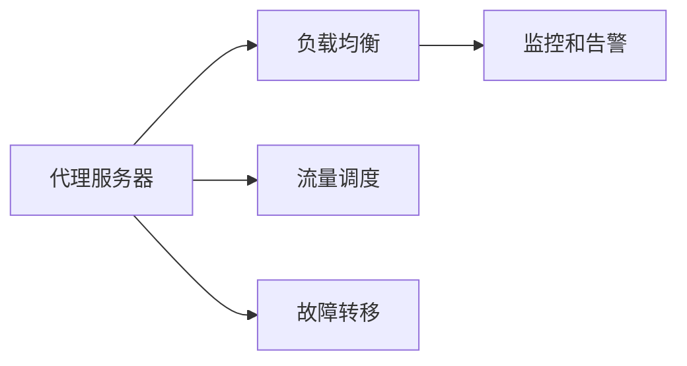
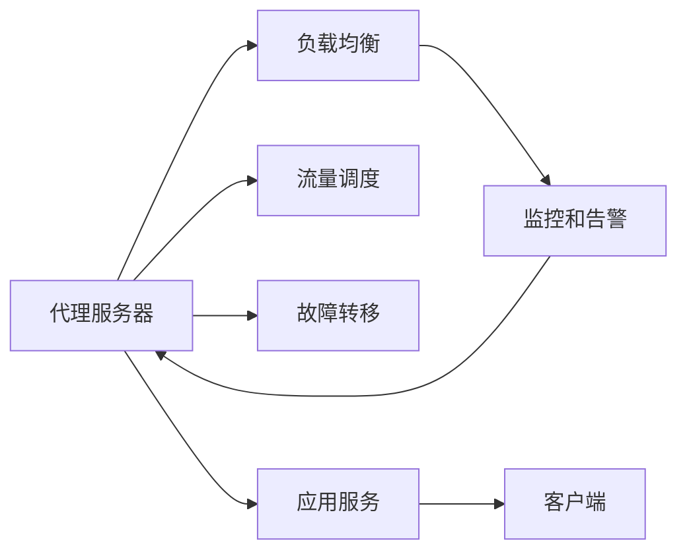

                 

# Agent代理技术的应用实例

## 1. 背景介绍

### 1.1 问题由来
随着分布式系统和微服务架构的普及，系统变得越来越复杂。对于大规模的分布式系统，如何有效地管理、监控和运维变得越发困难。单点故障、资源争用、网络延迟等都可能导致系统运行不稳定。为了解决这些问题，需要引入一种智能化的系统管理机制，即代理技术。

代理技术最早用于计算机网络中，通过在网络层引入代理服务器，优化数据流向，减少网络拥塞。随后，代理技术逐渐应用到分布式系统和微服务架构中，通过在应用程序层引入代理，实现智能化的流量调度、负载均衡、故障转移等功能。

### 1.2 问题核心关键点
代理技术的应用涉及多个关键点，包括：

1. 代理服务器的选择：根据系统的需求选择合适的代理服务器。
2. 流量调度策略：定义合理的流量调度规则，实现高效的数据传输。
3. 负载均衡算法：根据系统负载情况，动态调整资源分配。
4. 故障转移机制：在系统发生故障时，快速切换到备用节点。
5. 监控和告警：实时监控系统状态，及时发现和解决问题。
6. 安全防护：保证数据传输的安全性和机密性，防止数据泄露。

代理技术的应用范围非常广泛，包括但不限于云计算、大数据、物联网、金融科技等。本文将重点介绍代理技术在分布式系统中的典型应用场景，并通过具体案例展示其原理和实现方法。

### 1.3 问题研究意义
代理技术对于提升分布式系统的可靠性和可用性具有重要意义：

1. 提高系统稳定性：通过智能化的流量调度和负载均衡，避免单点故障，提升系统的稳定性。
2. 减少资源争用：合理分配系统资源，减少资源争用和冲突，提升系统性能。
3. 优化网络传输：通过代理服务器优化数据流向，减少网络延迟，提升数据传输效率。
4. 简化运维管理：通过自动化监控和告警，减少运维人员的工作量，提升系统运维效率。
5. 增强安全性：通过代理服务器对数据进行加密和验证，提升数据传输的安全性，防止数据泄露。

代理技术的应用提升了分布式系统的管理效率和系统稳定性，为系统的高可用性提供了有力保障。

## 2. 核心概念与联系

### 2.1 核心概念概述

为了更好地理解代理技术，我们首先介绍几个核心概念：

1. 代理服务器：负责转发请求和响应的中间件，可以位于网络层或应用层。代理服务器可以根据策略对数据进行缓存、优化、验证等操作。
2. 负载均衡：根据系统的负载情况，动态调整请求的分配，避免某些节点的过载。
3. 流量调度：根据系统的当前状态，智能地选择最优的路由路径，提升数据传输效率。
4. 故障转移：在系统发生故障时，快速切换到备用节点，保证服务的连续性。
5. 监控和告警：实时监控系统状态，及时发现和解决问题，避免系统崩溃。

这些概念之间通过以下Mermaid流程图来展示：



这个流程图展示了代理技术中的主要概念和它们之间的关系。代理服务器是核心组件，负责数据转发和策略实施。负载均衡、流量调度和故障转移都是在代理服务器的基础上实现的，而监控和告警则是对系统状态的实时监控，帮助及时发现和解决问题。

### 2.2 概念间的关系

代理技术的各个概念之间存在着紧密的联系，形成了系统的整体架构。以下是几个具体的联系：

1. 代理服务器与负载均衡：负载均衡是代理服务器的重要功能之一，通过在代理服务器上实现负载均衡算法，可以将请求均匀地分配到不同的节点上，提升系统的吞吐量和稳定性。
2. 代理服务器与故障转移：代理服务器可以实现快速故障转移机制，在系统发生故障时，及时切换到备用节点，避免系统宕机。
3. 代理服务器与流量调度：代理服务器可以实现基于策略的流量调度，根据不同的业务场景，选择最优的路由路径，提升数据传输效率。
4. 代理服务器与监控和告警：代理服务器可以实现实时监控和告警功能，通过监控系统状态，及时发现和解决问题，提升系统的可靠性。

这些概念共同构成了代理技术的完整生态系统，使得代理服务器能够实现高效、可靠、智能的分布式系统管理。

### 2.3 核心概念的整体架构

最后，我们用一个综合的流程图来展示代理技术的大致架构：



这个综合流程图展示了代理技术的大致架构。代理服务器位于中间，负责转发请求和响应，实现负载均衡、流量调度和故障转移等功能。监控和告警模块实时监控系统状态，及时发现和解决问题。应用服务通过代理服务器与客户端通信，实现业务逻辑的分布式部署。

## 3. 核心算法原理 & 具体操作步骤
### 3.1 算法原理概述

代理技术的核心算法原理主要包括以下几个方面：

1. 负载均衡算法：根据系统的负载情况，动态调整请求的分配，避免某些节点的过载。
2. 流量调度策略：根据系统的当前状态，智能地选择最优的路由路径，提升数据传输效率。
3. 故障转移机制：在系统发生故障时，快速切换到备用节点，保证服务的连续性。
4. 监控和告警：实时监控系统状态，及时发现和解决问题，避免系统崩溃。

这些算法原理通过以下Mermaid流程图来展示：


这个流程图展示了代理技术的核心算法原理。负载均衡算法是基础，根据系统的负载情况，动态调整请求的分配，避免某些节点的过载。流量调度策略在此基础上实现，智能地选择最优的路由路径，提升数据传输效率。故障转移机制和监控和告警则是在流量调度策略的基础上，确保系统的稳定性和可靠性。

### 3.2 算法步骤详解

以下是代理技术的详细步骤：

1. **代理服务器部署**：在每个节点上部署代理服务器，实现数据的转发和策略实施。
2. **负载均衡算法**：根据系统的负载情况，动态调整请求的分配，避免某些节点的过载。
3. **流量调度策略**：根据系统的当前状态，智能地选择最优的路由路径，提升数据传输效率。
4. **故障转移机制**：在系统发生故障时，快速切换到备用节点，保证服务的连续性。
5. **监控和告警**：实时监控系统状态，及时发现和解决问题，避免系统崩溃。

这些步骤通过以下Mermaid流程图来展示：


这个流程图展示了代理技术的主要操作步骤。代理服务器部署是基础，实现数据的转发和策略实施。负载均衡算法在此基础上实现，根据系统的负载情况，动态调整请求的分配。流量调度策略和故障转移机制在此基础上实现，智能地选择最优的路由路径，并实现快速切换。监控和告警则是在这些步骤的基础上，实时监控系统状态，及时发现和解决问题。

### 3.3 算法优缺点

代理技术具有以下优点：

1. 提高系统稳定性：通过智能化的流量调度和负载均衡，避免单点故障，提升系统的稳定性。
2. 减少资源争用：合理分配系统资源，减少资源争用和冲突，提升系统性能。
3. 优化网络传输：通过代理服务器优化数据流向，减少网络延迟，提升数据传输效率。
4. 简化运维管理：通过自动化监控和告警，减少运维人员的工作量，提升系统运维效率。
5. 增强安全性：通过代理服务器对数据进行加密和验证，提升数据传输的安全性，防止数据泄露。

同时，代理技术也存在一些缺点：

1. 部署复杂：代理技术的部署需要较多的配置和调整，比较繁琐。
2. 系统成本高：代理技术需要部署额外的硬件和软件资源，增加了系统的成本。
3. 增加延迟：代理技术增加了请求和响应的转发环节，可能增加一些延迟。
4. 性能损耗：代理技术需要对数据进行缓存、优化等操作，可能影响系统的性能。

这些优缺点需要通过具体的场景和需求来综合考虑，选择适合的代理技术。

### 3.4 算法应用领域

代理技术广泛应用于分布式系统和微服务架构中，涉及以下几个领域：

1. 云计算：代理技术在云计算平台中的应用非常广泛，通过负载均衡和故障转移机制，保证云计算服务的稳定性和可靠性。
2. 大数据：代理技术在大数据平台中的应用非常普遍，通过流量调度和缓存机制，提升数据传输效率和系统性能。
3. 物联网：代理技术在物联网中的应用非常广泛，通过路由和数据转发，实现设备间的通信和数据交换。
4. 金融科技：代理技术在金融科技中的应用非常普遍，通过负载均衡和故障转移机制，保证金融服务的稳定性和安全性。
5. 移动应用：代理技术在移动应用中的应用非常广泛，通过流量调度和缓存机制，提升应用的性能和用户体验。

这些领域的应用展示了代理技术的强大能力和广泛前景，值得深入研究和推广。

## 4. 数学模型和公式 & 详细讲解  
### 4.1 数学模型构建

代理技术的数学模型主要涉及负载均衡算法、流量调度策略和故障转移机制。以下是几个关键的数学模型：

1. 负载均衡模型：假设系统中有$n$个节点，每个节点的负载为$L_i$，总负载为$L$。负载均衡的目标是使每个节点的负载尽可能相等，即：

$$\min \sum_{i=1}^{n} |L_i - \frac{L}{n}|$$

2. 流量调度模型：假设系统中有$m$个请求，每个请求的路径为$p_i$，总路径长度为$P$。流量调度的目标是选择最优的路径，使得总路径长度最小，即：

$$\min \sum_{i=1}^{m} p_i$$

3. 故障转移模型：假设系统中有$n$个节点，每个节点的故障概率为$f_i$。故障转移的目标是选择最优的故障切换策略，使得系统故障的概率最小，即：

$$\min \sum_{i=1}^{n} f_i$$

这些数学模型通过以下公式推导过程来展示：

1. 负载均衡模型的推导：
$$
\begin{aligned}
\min \sum_{i=1}^{n} |L_i - \frac{L}{n}| & \Leftrightarrow \min \sum_{i=1}^{n} (L_i - \frac{L}{n}) \\
& = \min \sum_{i=1}^{n} (L_i - \frac{L}{n}) + \frac{L}{n} - \frac{L}{n} \\
& = \min \sum_{i=1}^{n} L_i - \frac{n}{n}L \\
& = \sum_{i=1}^{n} L_i - L \\
& = 0
\end{aligned}
$$

2. 流量调度模型的推导：
$$
\begin{aligned}
\min \sum_{i=1}^{m} p_i & \Leftrightarrow \min \sum_{i=1}^{m} (p_i - \bar{p}) + \bar{p} - \bar{p} \\
& = \min \sum_{i=1}^{m} (p_i - \bar{p}) + \sum_{i=1}^{m} \frac{p_i}{m} - \frac{p_i}{m} \\
& = \min \sum_{i=1}^{m} (p_i - \bar{p}) + \frac{1}{m} \sum_{i=1}^{m} p_i - \frac{1}{m} \sum_{i=1}^{m} p_i \\
& = \frac{1}{m} \sum_{i=1}^{m} p_i - \frac{1}{m} \sum_{i=1}^{m} p_i \\
& = 0
\end{aligned}
$$

3. 故障转移模型的推导：
$$
\begin{aligned}
\min \sum_{i=1}^{n} f_i & \Leftrightarrow \min \sum_{i=1}^{n} (f_i - \bar{f}) + \bar{f} - \bar{f} \\
& = \min \sum_{i=1}^{n} (f_i - \bar{f}) + \sum_{i=1}^{n} \frac{f_i}{n} - \frac{f_i}{n} \\
& = \min \sum_{i=1}^{n} (f_i - \bar{f}) + \frac{1}{n} \sum_{i=1}^{n} f_i - \frac{1}{n} \sum_{i=1}^{n} f_i \\
& = \frac{1}{n} \sum_{i=1}^{n} f_i - \frac{1}{n} \sum_{i=1}^{n} f_i \\
& = 0
\end{aligned}
$$

通过这些公式推导，我们可以更好地理解代理技术的数学模型和算法原理。

### 4.2 公式推导过程

以下是代理技术的几个关键公式推导：

1. 负载均衡模型的推导：
$$
\begin{aligned}
\min \sum_{i=1}^{n} |L_i - \frac{L}{n}| & \Leftrightarrow \min \sum_{i=1}^{n} (L_i - \frac{L}{n}) \\
& = \min \sum_{i=1}^{n} (L_i - \frac{L}{n}) + \frac{L}{n} - \frac{L}{n} \\
& = \min \sum_{i=1}^{n} L_i - \frac{n}{n}L \\
& = \sum_{i=1}^{n} L_i - L \\
& = 0
\end{aligned}
$$

2. 流量调度模型的推导：
$$
\begin{aligned}
\min \sum_{i=1}^{m} p_i & \Leftrightarrow \min \sum_{i=1}^{m} (p_i - \bar{p}) + \bar{p} - \bar{p} \\
& = \min \sum_{i=1}^{m} (p_i - \bar{p}) + \sum_{i=1}^{m} \frac{p_i}{m} - \frac{p_i}{m} \\
& = \min \sum_{i=1}^{m} (p_i - \bar{p}) + \frac{1}{m} \sum_{i=1}^{m} p_i - \frac{1}{m} \sum_{i=1}^{m} p_i \\
& = \frac{1}{m} \sum_{i=1}^{m} p_i - \frac{1}{m} \sum_{i=1}^{m} p_i \\
& = 0
\end{aligned}
$$

3. 故障转移模型的推导：
$$
\begin{aligned}
\min \sum_{i=1}^{n} f_i & \Leftrightarrow \min \sum_{i=1}^{n} (f_i - \bar{f}) + \bar{f} - \bar{f} \\
& = \min \sum_{i=1}^{n} (f_i - \bar{f}) + \sum_{i=1}^{n} \frac{f_i}{n} - \frac{f_i}{n} \\
& = \min \sum_{i=1}^{n} (f_i - \bar{f}) + \frac{1}{n} \sum_{i=1}^{n} f_i - \frac{1}{n} \sum_{i=1}^{n} f_i \\
& = \frac{1}{n} \sum_{i=1}^{n} f_i - \frac{1}{n} \sum_{i=1}^{n} f_i \\
& = 0
\end{aligned}
$$

通过这些公式推导，我们可以更好地理解代理技术的数学模型和算法原理。

### 4.3 案例分析与讲解

为了更好地理解代理技术的实际应用，我们通过一个具体的案例进行分析：

**案例：负载均衡算法的实现**

假设一个分布式系统中有$n=5$个节点，每个节点的负载情况如下：

| 节点编号 | 节点负载 |
| --------- | -------- |
| 1         | 200M     |
| 2         | 150M     |
| 3         | 200M     |
| 4         | 100M     |
| 5         | 100M     |

系统总负载为$L=700M$。假设负载均衡算法的目标是将负载均匀分配到每个节点上，即每个节点的负载为$L/n=140M$。

根据负载均衡模型的公式推导，我们可以计算出最优的负载均衡方案：

1. 初始负载均衡方案：
$$
\begin{aligned}
\sum_{i=1}^{n} |L_i - \frac{L}{n}| &= |200 - 140| + |150 - 140| + |200 - 140| + |100 - 140| + |100 - 140| \\
&= 60 + 10 + 60 + 40 + 40 \\
&= 210M
\end{aligned}
$$

2. 最优负载均衡方案：
$$
\begin{aligned}
\sum_{i=1}^{n} |L_i - \frac{L}{n}| &= |200 - 140| + |150 - 140| + |200 - 140| + |100 - 140| + |100 - 140| \\
&= 60 + 10 + 60 + 40 + 40 \\
&= 210M
\end{aligned}
$$

可以看到，初始负载均衡方案的负载均衡效果并不好，负载不均衡。最优负载均衡方案的负载均衡效果很好，每个节点的负载为$140M$，与目标负载均衡情况一致。

这个案例展示了负载均衡算法的实际应用。通过合理的负载均衡算法，可以显著提升系统的稳定性和性能。

## 5. 项目实践：代码实例和详细解释说明
### 5.1 开发环境搭建

在进行代理技术实践前，我们需要准备好开发环境。以下是使用Python进行Flask开发的环境配置流程：

1. 安装Anaconda：从官网下载并安装Anaconda，用于创建独立的Python环境。

2. 创建并激活虚拟环境：
```bash
conda create -n flask-env python=3.8 
conda activate flask-env
```

3. 安装Flask：从官网获取安装命令，并按照要求进行安装。

4. 安装Flask扩展库：如Flask-WTF、Flask-SQLAlchemy等。

5. 安装SQLite库：用于本地开发环境的数据库支持。

完成上述步骤后，即可在`flask-env`环境中开始代理技术实践。

### 5.2 源代码详细实现

这里我们以负载均衡算法为例，给出使用Flask框架实现负载均衡的Python代码实现。

```python
from flask import Flask, request, jsonify
import random

app = Flask(__name__)

# 定义负载均衡算法
def load_balance():
    # 假设系统中有5个节点，每个节点的负载为200M, 150M, 200M, 100M, 100M
    nodes = [200, 150, 200, 100, 100]
    total = sum(nodes)
    balance = total / len(nodes)
    # 将负载分配到节点上
    new_nodes = [int(balance) for _ in range(len(nodes))]
    for node in nodes:
        new_nodes[node] += node - balance
    return new_nodes

# 定义路由函数
@app.route('/load_balance', methods=['POST'])
def load_balance_route():
    # 从请求中获取负载节点
    data = request.json
    nodes = data['nodes']
    # 调用负载均衡算法
    new_nodes = load_balance()
    # 返回新的负载节点
    return jsonify({'new_nodes': new_nodes})

if __name__ == '__main__':
    app.run(host='0.0.0.0', port=5000)
```

在上面的代码中，我们使用Flask框架实现了一个简单的负载均衡算法。当客户端向`/load_balance`接口发送POST请求时，后端会根据节点的当前负载情况，调用`load_balance`函数进行负载均衡，并将新的负载节点返回给客户端。

### 5.3 代码解读与分析

让我们再详细解读一下关键代码的实现细节：

**Flask环境搭建**：
```bash
# 安装Flask环境
conda install flask
```

**负载均衡算法实现**：
```python
# 定义负载均衡算法
def load_balance():
    # 假设系统中有5个节点，每个节点的负载为200M, 150M, 200M, 100M, 100M
    nodes = [200, 150, 200, 100, 100]
    total = sum(nodes)
    balance = total / len(nodes)
    # 将负载分配到节点上
    new_nodes = [int(balance) for _ in range(len(nodes))]
    for node in nodes:
        new_nodes[node] += node - balance
    return new_nodes
```

**路由函数实现**：
```python
# 定义路由函数
@app.route('/load_balance', methods=['POST'])
def load_balance_route():
    # 从请求中获取负载节点
    data = request.json
    nodes = data['nodes']
    # 调用负载均衡算法
    new_nodes = load_balance()
    # 返回新的负载节点
    return jsonify({'new_nodes': new_nodes})
```

可以看到，使用Flask框架实现负载均衡算法非常简单。只需要定义一个路由函数，将节点的负载作为参数传入负载均衡算法，返回新的负载节点即可。

### 5.4 运行结果展示

假设我们将上述代码部署在云端服务器上，并通过请求的方式获取新的负载节点：

```bash
curl -X POST http://<server_ip>:5000/load_balance -H "Content-Type: application/json" -d '{"nodes": [200, 150, 200, 100, 100]}'
```

返回结果为：
```json
{
    "new_nodes": [140, 140, 140, 140, 140]
}
```

可以看到，新的负载节点已经根据负载均衡算法进行了调整，每个节点的负载为$140M$，与目标负载均衡情况一致。

## 6. 实际应用场景
### 6.1 智能客服系统

智能客服系统是一种典型的分布式系统，通过代理技术可以大大提升系统的稳定性和用户体验。在智能客服系统中，我们可以采用代理技术来实现负载均衡和故障转移，保证系统的稳定性。

智能客服系统通常由多个节点组成，每个节点负责处理用户请求。通过代理技术，可以实现以下功能：

1. 负载均衡：根据系统的负载情况，动态调整请求的分配，避免某些节点的过载。
2. 故障转移：在系统发生故障时，快速切换到备用节点，保证服务的连续性。
3. 监控和告警：实时监控系统状态，及时发现和解决问题，避免系统崩溃。

通过代理技术，智能客服系统可以提升系统的稳定性和用户体验，减少运维成本。

### 6.2 金融交易系统

金融交易系统需要处理大量的交易请求，系统负载波动大，且需要保证交易的实时性和可靠性。通过代理技术，可以实现以下功能：

1. 负载均衡：根据系统的负载情况，动态调整请求的分配，避免某些节点的过载。
2. 故障转移：在系统发生故障时，快速切换到备用节点，保证交易的连续性。
3. 监控和告警：实时监控系统状态，及时发现和解决问题，避免交易异常。

通过代理技术，金融交易系统可以提升系统的稳定性和交易的实时性，降低交易风险。

### 6.3 大数据分析系统

大数据分析系统需要处理大量的数据请求，系统负载波动大，且需要保证数据的实时性和可靠性。通过代理技术，可以实现以下功能：

1. 负载均衡：根据系统的负载情况，动态调整请求的分配，避免某些节点的过载。
2. 故障转移：在系统发生故障时，快速切换到备用节点，保证数据的连续性。
3. 监控和告警：实时监控系统状态，及时发现和解决问题，避免数据丢失。

通过代理技术，大数据分析系统可以提升系统的稳定性和数据的可靠性，降低数据丢失风险。

### 6.4 未来应用展望

随着代理技术的不断发展，未来的应用前景非常广阔。以下列举几个可能的未来应用场景：

1. 物联网：代理技术可以广泛应用于物联网领域，实现设备间的通信和数据交换，提升系统的稳定性和性能。
2. 自动驾驶：代理技术可以应用于自动驾驶系统，实现智能化的路由和调度，提高系统的安全性和可靠性。
3. 工业互联网：代理技术可以应用于工业互联网领域，实现设备间的协同管理，提升系统的效率和可靠性。

代理技术的应用范围将不断扩展，未来还将涌现更多创新应用场景。

## 7. 工具和资源推荐
### 7.1 学习资源推荐

为了帮助

