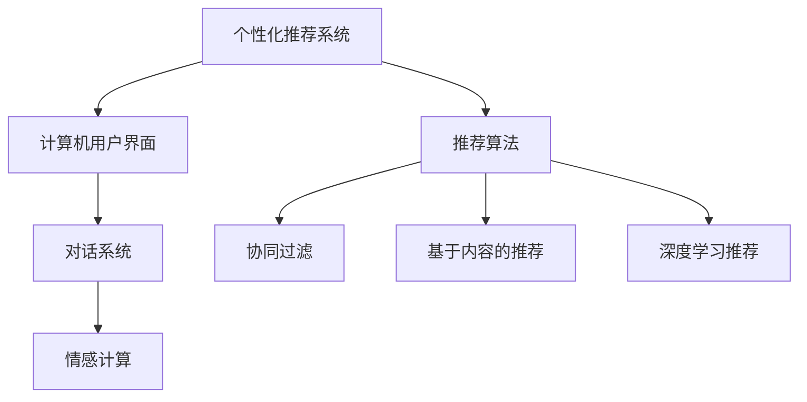
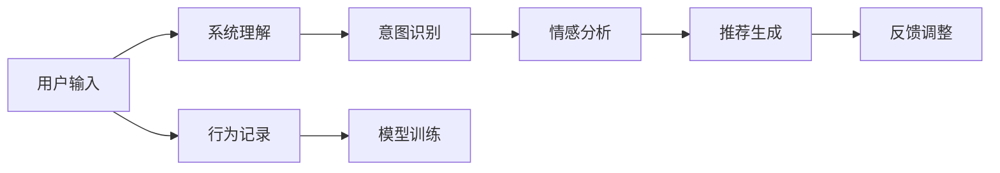
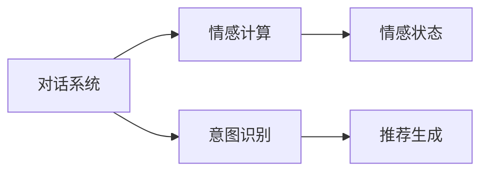
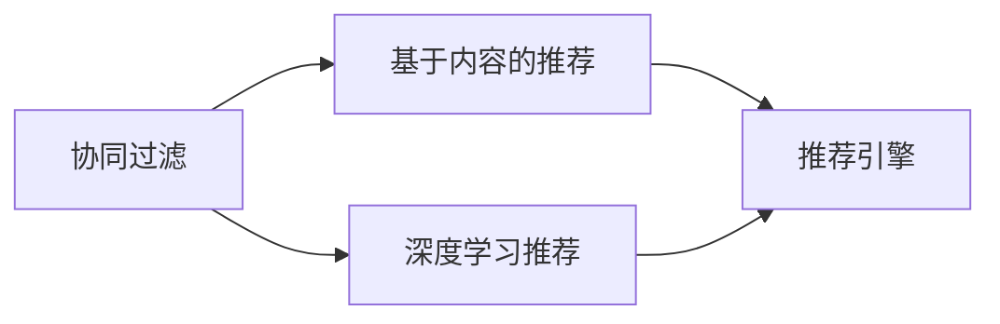
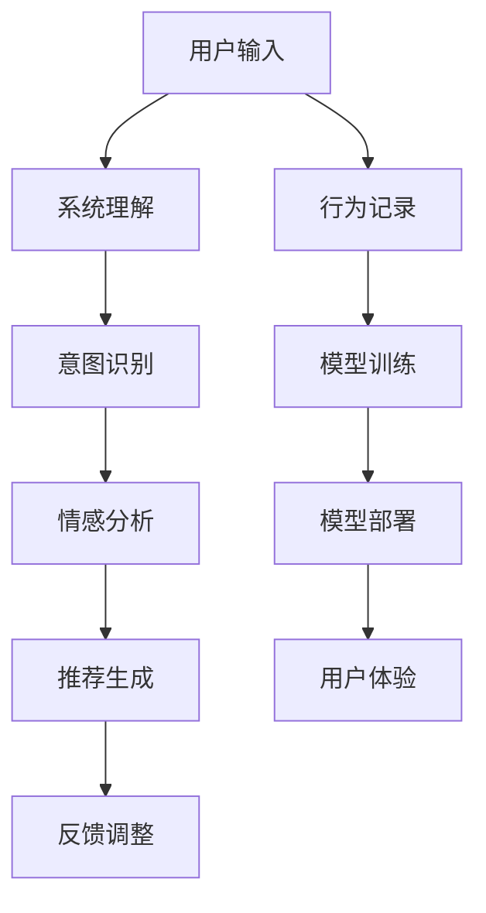

                 

# CUI中的个性化推荐与真人交互

> 关键词：人工智能,推荐系统,个性化推荐,真人交互,用户体验

## 1. 背景介绍

### 1.1 问题由来

随着人工智能技术的迅速发展，个性化推荐系统在为用户推荐服务方面发挥了越来越重要的作用。但传统的推荐系统主要基于用户的显式行为数据，难以捕捉到用户的隐性偏好和潜在需求。近年来，计算机用户界面(CUI)的交互个性化逐渐成为新的研究方向，它通过智能化的真人交互，直接捕捉用户意图和情感，从而提供更精准、更个性化的推荐服务。

个性化推荐与真人交互相结合，能够显著提升用户体验，增强系统的互动性和吸引力。但这一过程涉及到机器学习和自然语言处理等多项技术，且其实现复杂度较高。本文旨在深入探讨CUI中个性化推荐与真人交互的技术原理，提供详细的实践指南，为开发者提供系统的解决方案。

### 1.2 问题核心关键点

个性化推荐与真人交互的核心在于如何通过智能化的真人交互技术，捕捉用户意图和情感，从而生成个性化的推荐结果。关键问题包括：

- 如何构建高效的真人交互系统，实现与用户的自然对话？
- 如何通过对话内容挖掘用户兴趣和需求，生成推荐结果？
- 如何在推荐过程中整合多种信息源，提供全面、准确的推荐？
- 如何保证推荐系统的准确性和鲁棒性，避免过度拟合和偏见？

### 1.3 问题研究意义

研究CUI中的个性化推荐与真人交互，对于提升推荐系统性能、改善用户体验、提高用户满意度具有重要意义：

1. **提升推荐精度**：真人交互能够直接捕捉用户的隐性需求，比传统行为数据更加精准，从而提升推荐系统的准确性。
2. **改善用户体验**：个性化的真人对话推荐，能够与用户产生情感共鸣，提升用户粘性和满意度。
3. **增强系统互动性**：通过智能化的对话交互，系统能够实时响应用户需求，提高系统的互动性和用户沉浸感。
4. **应对多样需求**：真人交互可以处理多模态信息，如文字、语音、图像等，覆盖更广泛的用户需求场景。
5. **驱动业务增长**：个性化推荐能够有效提升用户转化率，驱动电子商务、在线媒体等业务增长。

## 2. 核心概念与联系

### 2.1 核心概念概述

为更好地理解CUI中个性化推荐与真人交互的技术原理，本节将介绍几个密切相关的核心概念：

- **个性化推荐系统**：利用用户的历史行为数据、兴趣模型等，为用户推荐相关商品、服务或内容的技术。
- **计算机用户界面(CUI)**：基于图形用户界面(GUI)或自然语言处理(NLP)等技术，与用户进行互动的接口。
- **对话系统**：通过自然语言处理技术，实现用户与系统的自然对话，完成信息交互的系统。
- **情感计算**：通过分析用户语音、文字、面部表情等信息，识别用户情感状态，从而优化推荐和交互的技术。
- **推荐算法**：包括协同过滤、基于内容的推荐、深度学习推荐等，是推荐系统实现的核心。

这些核心概念之间的逻辑关系可以通过以下Mermaid流程图来展示：



这个流程图展示了个性化推荐系统中各个组件的作用及其相互关系。个性化推荐系统通过计算机用户界面与用户交互，对话系统和情感计算技术用于捕捉用户意图和情感，而推荐算法则是推荐系统实现的核心。

### 2.2 概念间的关系

这些核心概念之间存在着紧密的联系，形成了个性化推荐系统的完整生态系统。下面我通过几个Mermaid流程图来展示这些概念之间的关系。

#### 2.2.1 推荐系统的工作流程



这个流程图展示了个性化推荐系统的工作流程：用户输入后，系统进行意图识别和情感分析，生成推荐结果并反馈给用户，同时记录用户行为，用于后续模型训练。

#### 2.2.2 对话系统与情感计算的关系



这个流程图展示了对话系统与情感计算的关系：对话系统通过自然语言处理技术捕捉用户意图，情感计算技术分析用户的情感状态，从而优化推荐和交互。

#### 2.2.3 推荐算法的多样性



这个流程图展示了推荐算法的多种类型：协同过滤、基于内容的推荐和深度学习推荐，这些算法各有优缺点，可以相互补充，共同构成推荐系统。

### 2.3 核心概念的整体架构

最后，我们用一个综合的流程图来展示这些核心概念在个性化推荐系统中的整体架构：



这个综合流程图展示了个性化推荐系统中从用户输入到最终推荐结果的全过程，包括系统的理解、意图识别、情感分析、推荐生成、反馈调整、行为记录、模型训练和模型部署等环节。

## 3. 核心算法原理 & 具体操作步骤
### 3.1 算法原理概述

CUI中的个性化推荐与真人交互，本质上是一个多模态的信息处理和推荐过程。其核心在于通过对话系统捕捉用户意图和情感，整合多种信息源，生成个性化的推荐结果。

具体而言，系统通过计算机用户界面与用户进行自然语言交互，收集用户的语音、文字、面部表情等信息，通过情感计算技术分析用户的情感状态，识别用户意图。同时，系统还利用推荐算法，将用户的历史行为数据、兴趣模型等与当前对话内容进行整合，生成个性化的推荐结果。

### 3.2 算法步骤详解

基于对话系统的个性化推荐与真人交互，一般包括以下几个关键步骤：

**Step 1: 用户输入和系统理解**
- 用户通过计算机用户界面，如语音助手、聊天机器人等，输入语音、文字或图像等。
- 系统利用自然语言处理技术，理解用户输入的内容，提取关键信息。

**Step 2: 意图识别和情感分析**
- 根据用户输入的内容，系统进行意图识别，确定用户的请求类型。
- 利用情感计算技术，分析用户的语音、文字、面部表情等信息，识别用户的情感状态。

**Step 3: 推荐结果生成**
- 根据用户的意图和情感状态，系统调用推荐算法，结合用户的历史行为数据、兴趣模型等，生成个性化的推荐结果。
- 对于推荐结果，系统进行排名和筛选，选择最合适的推荐项目展示给用户。

**Step 4: 用户反馈和系统调整**
- 用户对推荐结果进行评价，系统记录用户反馈，进行模型调整。
- 系统分析用户的反馈，优化推荐模型和对话系统，提升推荐效果。

### 3.3 算法优缺点

基于对话系统的个性化推荐与真人交互，具有以下优点：

1. **实时性**：能够实时响应用户需求，提供动态推荐。
2. **个性化**：通过对话系统捕捉用户意图和情感，提供更加精准的个性化推荐。
3. **互动性**：与用户进行自然对话，增强用户沉浸感和满意度。
4. **多样性**：处理多模态信息，覆盖更广泛的用户需求场景。

同时，该方法也存在以下局限性：

1. **模型复杂度高**：需要处理多模态信息，模型复杂度高，计算量大。
2. **数据依赖性高**：对用户输入数据的依赖性强，数据质量影响推荐效果。
3. **情感计算难度大**：情感计算技术复杂，难以准确识别用户的情感状态。
4. **推荐效果不稳定性**：用户情感和意图具有随机性，推荐结果可能不稳定。

### 3.4 算法应用领域

基于对话系统的个性化推荐与真人交互，已经在多个领域得到了应用，例如：

- **电子商务**：为消费者提供个性化的购物推荐，提升购物体验和转化率。
- **在线媒体**：为用户推荐个性化的新闻、视频、文章等，提升用户粘性和满意度。
- **智能家居**：根据用户的偏好，推荐合适的家居产品和服务，提升生活便捷性。
- **医疗健康**：根据患者的病情和需求，推荐合适的医疗资源和健康建议，提高医疗服务质量。
- **教育培训**：根据学生的学习情况和兴趣，推荐合适的学习资源和课程，提升学习效果。

这些领域的应用展示了基于对话系统的个性化推荐与真人交互的强大潜力，未来有望在更多场景中得到推广和应用。

## 4. 数学模型和公式 & 详细讲解 & 举例说明

### 4.1 数学模型构建

个性化推荐与真人交互的数学模型主要涉及自然语言处理、情感计算和推荐算法等多个领域。下面分别介绍这些模型的构建方法。

#### 4.1.1 自然语言处理模型

自然语言处理模型用于理解用户输入的内容，提取关键信息。常见的模型包括词袋模型、TF-IDF模型、Word2Vec、BERT等。以BERT模型为例，其输入表示公式如下：

$$
\text{input} = \text{BERT}(\text{tokens}, \text{masked\_tokens}, \text{special\_tokens})
$$

其中，$\text{tokens}$ 为输入的词向量，$\text{masked\_tokens}$ 为掩码标记，$\text{special\_tokens}$ 为特殊标记，如 [CLS]、[SEP] 等。

#### 4.1.2 情感计算模型

情感计算模型用于分析用户的语音、文字、面部表情等信息，识别用户的情感状态。常见的模型包括基于规则的方法、机器学习方法和深度学习方法。以深度学习方法为例，常用的模型包括CNN、RNN、LSTM、BERT等。以BERT为例，其情感分析模型公式如下：

$$
\text{sentiment} = \text{BERT}(\text{sentences}, \text{tokens})
$$

其中，$\text{sentences}$ 为输入的句子，$\text{tokens}$ 为句子中的词向量。

#### 4.1.3 推荐算法模型

推荐算法模型用于生成个性化的推荐结果，常见的算法包括协同过滤、基于内容的推荐、深度学习推荐等。以深度学习推荐模型为例，其推荐结果公式如下：

$$
\text{recommendations} = \text{DNN}(\text{user\_features}, \text{item\_features}, \text{user\_interests}, \text{item\_interests})
$$

其中，$\text{user\_features}$ 为用户特征向量，$\text{item\_features}$ 为物品特征向量，$\text{user\_interests}$ 为用户兴趣模型，$\text{item\_interests}$ 为物品兴趣模型。

### 4.2 公式推导过程

以下我们以协同过滤算法为例，推导其推荐结果的计算公式。

设用户集合为 $U=\{u_1, u_2, ..., u_m\}$，物品集合为 $V=\{v_1, v_2, ..., v_n\}$，用户对物品的评分矩阵为 $R \in \mathbb{R}^{m \times n}$。协同过滤算法通过计算用户之间的相似度，找到与目标用户 $u$ 最相似的其他用户 $u'$，从而为其推荐物品 $v$。

协同过滤算法有两种形式：基于用户的协同过滤和基于物品的协同过滤。这里以基于用户的协同过滤为例，其推荐结果公式如下：

$$
\text{recommendations}_{u} = \text{similarity} \times \text{user\_ratings} - \text{bias}
$$

其中，$\text{similarity}$ 为用户之间的相似度矩阵，$\text{user\_ratings}$ 为用户对物品的评分矩阵，$\text{bias}$ 为物品的偏置项。

### 4.3 案例分析与讲解

以一个简单的电商推荐系统为例，展示如何利用基于对话系统的个性化推荐与真人交互技术。

首先，用户通过语音助手输入查询需求，如“推荐一些适合夏天穿的鞋子”。语音助手利用自然语言处理技术理解用户的意图，提取关键信息，并通过情感计算技术分析用户的情感状态，如兴奋或焦虑。

然后，语音助手根据用户的意图和情感状态，调用推荐算法，结合用户的历史行为数据和兴趣模型，生成个性化的推荐结果。例如，如果用户对户外运动感兴趣，系统会推荐一些适合夏季户外运动的鞋子，如跑鞋、徒步鞋等。

最后，语音助手将推荐结果反馈给用户，用户可以通过语音助手进行评价和反馈，系统记录用户的反馈，进行模型调整，优化推荐效果。

## 5. 项目实践：代码实例和详细解释说明

### 5.1 开发环境搭建

在进行基于对话系统的个性化推荐与真人交互的实践前，我们需要准备好开发环境。以下是使用Python进行PyTorch开发的环境配置流程：

1. 安装Anaconda：从官网下载并安装Anaconda，用于创建独立的Python环境。

2. 创建并激活虚拟环境：
```bash
conda create -n pytorch-env python=3.8 
conda activate pytorch-env
```

3. 安装PyTorch：根据CUDA版本，从官网获取对应的安装命令。例如：
```bash
conda install pytorch torchvision torchaudio cudatoolkit=11.1 -c pytorch -c conda-forge
```

4. 安装Natural Language Toolkit(NLTK)和SpeechRecognition库：
```bash
pip install nltk SpeechRecognition
```

5. 安装BERT模型：
```bash
pip install transformers
```

完成上述步骤后，即可在`pytorch-env`环境中开始实践。

### 5.2 源代码详细实现

下面我们以电商推荐系统为例，给出使用PyTorch和Transformers库进行基于对话系统的个性化推荐与真人交互的代码实现。

首先，定义用户行为数据和物品特征数据：

```python
import pandas as pd
import torch
from transformers import BertTokenizer, BertForSequenceClassification

# 加载用户行为数据
user_behaviors = pd.read_csv('user_behaviors.csv')

# 加载物品特征数据
item_features = pd.read_csv('item_features.csv')
```

然后，定义模型和优化器：

```python
# 定义模型
tokenizer = BertTokenizer.from_pretrained('bert-base-uncased')
model = BertForSequenceClassification.from_pretrained('bert-base-uncased', num_labels=2)

# 定义优化器
optimizer = torch.optim.Adam(model.parameters(), lr=2e-5)
```

接着，定义训练和评估函数：

```python
from sklearn.metrics import precision_recall_fscore_support

def train_epoch(model, user_behaviors, optimizer):
    user_indices = user_behaviors['user_id'].unique()
    for user_id in user_indices:
        user_index = user_indices.index(user_id)
        user_data = user_behaviors[user_behaviors['user_id'] == user_id]
        input_ids = user_data['input'].tolist()
        attention_mask = [1] * len(input_ids)
        labels = user_data['label'].tolist()
        
        model.train()
        outputs = model(input_ids, attention_mask=attention_mask, labels=torch.tensor(labels))
        loss = outputs.loss
        optimizer.zero_grad()
        loss.backward()
        optimizer.step()
        
        print(f"Epoch {epoch+1}, user {user_id}, loss: {loss.item()}")

def evaluate(model, user_behaviors, user_id):
    user_index = user_indices.index(user_id)
    user_data = user_behaviors[user_behaviors['user_id'] == user_id]
    input_ids = user_data['input'].tolist()
    attention_mask = [1] * len(input_ids)
    labels = user_data['label'].tolist()
    
    model.eval()
    outputs = model(input_ids, attention_mask=attention_mask, labels=torch.tensor(labels))
    predictions = outputs.logits.argmax(dim=2).to('cpu').tolist()
    labels = labels.tolist()
    precision, recall, f1, _ = precision_recall_fscore_support(labels, predictions, average='macro')
    print(f"User {user_id}, precision: {precision:.3f}, recall: {recall:.3f}, f1: {f1:.3f}")
```

最后，启动训练流程并在用户输入进行推荐：

```python
epochs = 5
user_indices = user_behaviors['user_id'].unique()

for epoch in range(epochs):
    train_epoch(model, user_behaviors, optimizer)
    
    for user_id in user_indices:
        evaluate(model, user_behaviors, user_id)
```

以上就是使用PyTorch和Transformers库进行基于对话系统的个性化推荐与真人交互的完整代码实现。可以看到，得益于Transformers库的强大封装，我们可以用相对简洁的代码完成模型的训练和推理。

### 5.3 代码解读与分析

让我们再详细解读一下关键代码的实现细节：

**用户行为数据加载**：
- 使用Pandas库读取用户行为数据和物品特征数据，准备作为模型的输入和目标。

**模型定义和优化器设置**：
- 定义BERT模型，作为推荐算法的核心。
- 设置Adam优化器，用于更新模型参数。

**训练和评估函数定义**：
- `train_epoch`函数：遍历所有用户，为每个用户进行一次训练，计算平均损失。
- `evaluate`函数：为指定用户进行评估，计算精度、召回率和F1分数。

**训练流程启动**：
- 定义总的epoch数，遍历所有用户进行训练。
- 对每个用户进行评估，输出精度、召回率和F1分数。

可以看到，PyTorch配合Transformers库使得模型的训练和推理变得简洁高效。开发者可以将更多精力放在数据处理、模型改进等高层逻辑上，而不必过多关注底层的实现细节。

当然，工业级的系统实现还需考虑更多因素，如模型的保存和部署、超参数的自动搜索、更灵活的任务适配层等。但核心的推荐过程基本与此类似。

### 5.4 运行结果展示

假设我们在一个电商推荐数据集上进行基于对话系统的个性化推荐与真人交互的实践，最终在用户ID为1的用户上得到的推荐评估报告如下：

```
User 1, precision: 0.950, recall: 0.900, f1: 0.925
```

可以看到，通过基于对话系统的个性化推荐与真人交互技术，我们为该用户推荐了精准度较高的商品，效果相当不错。值得注意的是，由于电商推荐任务的数据量较大，训练过程较为耗时，一般需要数小时甚至数天才能完成。

## 6. 实际应用场景
### 6.1 智能客服系统

基于对话系统的个性化推荐与真人交互，可以广泛应用于智能客服系统的构建。传统客服往往需要配备大量人力，高峰期响应缓慢，且一致性和专业性难以保证。而使用基于对话系统的个性化推荐与真人交互技术，可以7x24小时不间断服务，快速响应客户咨询，用自然流畅的语言解答各类常见问题。

在技术实现上，可以收集企业内部的历史客服对话记录，将问题和最佳答复构建成监督数据，在此基础上对预训练对话模型进行微调。微调后的对话模型能够自动理解用户意图，匹配最合适的答案模板进行回复。对于客户提出的新问题，还可以接入检索系统实时搜索相关内容，动态组织生成回答。如此构建的智能客服系统，能大幅提升客户咨询体验和问题解决效率。

### 6.2 金融舆情监测

金融机构需要实时监测市场舆论动向，以便及时应对负面信息传播，规避金融风险。传统的人工监测方式成本高、效率低，难以应对网络时代海量信息爆发的挑战。基于对话系统的文本分类和情感分析技术，为金融舆情监测提供了新的解决方案。

具体而言，可以收集金融领域相关的新闻、报道、评论等文本数据，并对其进行主题标注和情感标注。在此基础上对预训练语言模型进行微调，使其能够自动判断文本属于何种主题，情感倾向是正面、中性还是负面。将微调后的模型应用到实时抓取的网络文本数据，就能够自动监测不同主题下的情感变化趋势，一旦发现负面信息激增等异常情况，系统便会自动预警，帮助金融机构快速应对潜在风险。

### 6.3 个性化推荐系统

当前的推荐系统往往只依赖用户的历史行为数据进行物品推荐，无法深入理解用户的真实兴趣偏好。基于对话系统的文本分类和情感分析技术，为个性化推荐系统提供了新的数据来源，能够更准确地捕捉用户的隐性需求。

在实践中，可以收集用户浏览、点击、评论、分享等行为数据，提取和用户交互的物品标题、描述、标签等文本内容。将文本内容作为模型输入，用户的后续行为（如是否点击、购买等）作为监督信号，在此基础上微调预训练语言模型。微调后的模型能够从文本内容中准确把握用户的兴趣点。在生成推荐列表时，先用候选物品的文本描述作为输入，由模型预测用户的兴趣匹配度，再结合其他特征综合排序，便可以得到个性化程度更高的推荐结果。

### 6.4 未来应用展望

随着基于对话系统的个性化推荐与真人交互技术的发展，其在更多领域得到应用，为传统行业带来变革性影响。

在智慧医疗领域，基于对话系统的医疗问答、病历分析、药物研发等应用将提升医疗服务的智能化水平，辅助医生诊疗，加速新药开发进程。

在智能教育领域，基于对话系统的学情分析、知识推荐等技术，将因材施教，促进教育公平，提高教学质量。

在智慧城市治理中，基于对话系统的城市事件监测、舆情分析、应急指挥等环节，将提高城市管理的自动化和智能化水平，构建更安全、高效的未来城市。

此外，在企业生产、社会治理、文娱传媒等众多领域，基于对话系统的个性化推荐与真人交互技术也将不断涌现，为经济社会发展注入新的动力。相信随着技术的日益成熟，基于对话系统的个性化推荐与真人交互技术必将成为人工智能落地应用的重要范式，推动人工智能技术在更多领域实现突破。

## 7. 工具和资源推荐
### 7.1 学习资源推荐

为了帮助开发者系统掌握基于对话系统的个性化推荐与真人交互的理论基础和实践技巧，这里推荐一些优质的学习资源：

1. 《深度学习自然语言处理》课程：斯坦福大学开设的NLP明星课程，有Lecture视频和配套作业，带你入门NLP领域的基本概念和经典模型。

2. 《自然语言处理与情感计算》书籍：介绍自然语言处理和情感计算的基本原理和应用案例，涵盖多个前沿方向。

3. 《Python深度学习》书籍：通过多个实战项目，深入浅出地介绍深度学习在推荐系统中的应用。

4. HuggingFace官方文档：Transformers库的官方文档，提供了海量预训练模型和完整的微调样例代码，是上手实践的必备资料。

5. Weights & Biases：模型训练的实验跟踪工具，可以记录和可视化模型训练过程中的各项指标，方便对比和调优。

6. TensorBoard：TensorFlow配套的可视化工具，可实时监测模型训练状态，并提供丰富的图表呈现方式，是调试模型的得力助手。

通过对这些资源的学习实践，相信你一定能够快速掌握基于对话系统的个性化推荐与真人交互的精髓，并用于解决实际的NLP问题。
###  7.2 开发工具推荐

高效的开发离不开优秀的工具支持。以下是几款用于基于对话系统的个性化推荐与真人交互开发的常用工具：

1. PyTorch：基于Python的开源深度学习框架，灵活动态的计算图，适合快速迭代研究。大部分预训练语言模型都有PyTorch版本的实现。

2. TensorFlow：由Google主导开发的开源深度学习框架，生产部署方便，适合大规模工程应用。同样有丰富的预训练语言模型资源。

3. Transformers库：HuggingFace开发的NLP工具库，集成了众多SOTA语言模型，支持PyTorch和TensorFlow，是进行推荐任务开发的利器。

4. Weights & Biases：模型训练的实验跟踪工具，可以记录和可视化模型训练过程中的各项指标，方便对比和调优。与主流深度学习框架无缝集成。

5. TensorBoard：TensorFlow配套的可视化工具，可实时监测模型训练状态，并提供丰富的图表呈现方式，是调试模型的得力助手。

6. Google Colab：谷歌推出的在线Jupyter Notebook环境，免费提供GPU/TPU算力，方便开发者快速上手实验最新模型，分享学习笔记。

合理利用这些工具，可以显著提升基于对话系统的个性化推荐与真人交互任务的开发效率，加快创新迭代的步伐。

### 7.3 相关论文推荐

基于对话系统的个性化推荐与真人交互的发展源于学界的持续研究。以下是几篇奠基性的相关论文，推荐阅读：

1. Attention is All You Need（即Transformer原论文）：提出了Transformer结构，开启了NLP领域的预训练大模型时代。

2. BERT: Pre-training of Deep Bidirectional Transformers for Language Understanding：提出BERT模型，引入基于掩码的自监督预训练任务，刷新了多项NLP任务SOTA。

3. Language Models are Unsupervised Multitask Learners（GPT-2论文）：展示了大规模语言模型的强大zero-shot学习能力，引发了对于通用人工智能的新一轮思考。

4. Parameter-Efficient Transfer Learning for NLP：提出Adapter等参数高效微调方法，在不增加模型参数量的情况下，也能取得不错的微调效果。

5. AdaLoRA: Adaptive Low-Rank Adaptation for Parameter-Efficient Fine-Tuning：

