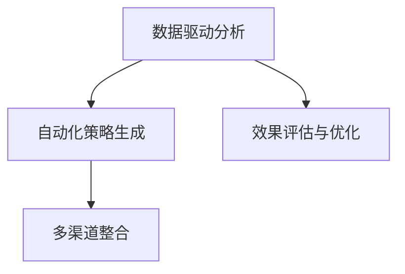

                 

# AI促销策略优化提升效果

## 1. 背景介绍

### 1.1 问题由来
在当今数字化商业环境中，促销策略的制定和执行对企业的销售增长和市场竞争力至关重要。然而，传统的促销策略制定往往依赖于经验丰富的营销人员，通过直觉和经验进行决策，这不仅耗时且容易产生错误。AI技术的发展为促销策略的优化提供了新的可能。AI可以分析大量数据，识别出潜在的高回报促销活动，自动生成和优化促销策略，从而大大提高促销效果。

### 1.2 问题核心关键点
AI促销策略优化的核心在于通过数据驱动的方式，自动化地分析和优化促销活动，提高促销的ROI（投资回报率）和效果。具体包括：
- **数据驱动分析**：收集、清洗、分析销售数据、消费者行为数据、市场数据等，从中发现潜在的高回报促销活动。
- **自动化策略生成**：基于分析结果，自动生成和调整促销策略，如折扣、优惠券、会员特权等。
- **效果评估与优化**：实时监测促销活动的效果，根据反馈调整策略，确保最大程度地提升销售和客户满意度。

### 1.3 问题研究意义
AI促销策略优化对于提升企业销售效率、优化营销资源分配、增强客户满意度等方面具有重要意义：
1. **提升销售效率**：AI可以自动化地处理大量数据，快速识别出高回报的促销活动，避免人工决策中的主观偏差和遗漏。
2. **优化资源分配**：通过AI分析，企业可以更加精准地分配营销资源，确保每笔预算都能发挥最大效用。
3. **增强客户满意度**：AI能够根据客户行为和偏好，生成个性化的促销方案，提高客户粘性和忠诚度。
4. **适应市场变化**：AI促销策略可以实时调整，快速适应市场变化和消费者需求的变化。
5. **支持决策支持**：提供数据驱动的决策支持，帮助管理层做出更科学、更有依据的决策。

## 2. 核心概念与联系

### 2.1 核心概念概述

为了更好地理解AI促销策略优化的原理和架构，本节将介绍几个核心概念：

- **AI促销策略优化**：利用AI技术，对促销策略进行自动化分析和优化，提升促销效果。
- **数据驱动分析**：通过收集和分析大量数据，识别潜在的高回报促销活动。
- **自动化策略生成**：基于分析结果，自动生成和调整促销策略。
- **效果评估与优化**：实时监测促销活动效果，根据反馈进行调整。
- **多渠道整合**：将不同渠道的促销策略进行整合，实现全面覆盖。

这些概念之间相互关联，共同构成了AI促销策略优化的完整流程。

### 2.2 概念间的关系

这些核心概念之间的关系可以通过以下Mermaid流程图来展示：



这个流程图展示了AI促销策略优化的主要流程：

1. 从数据驱动分析开始，收集和清洗大量数据。
2. 基于分析结果，自动化策略生成。
3. 实时监测和评估促销活动效果，并根据反馈进行优化。
4. 多渠道整合，确保促销策略全面覆盖。

通过这个流程图，我们可以更清晰地理解AI促销策略优化的各个环节和它们之间的相互关系。

## 3. 核心算法原理 & 具体操作步骤
### 3.1 算法原理概述

AI促销策略优化通过以下步骤进行：

1. **数据收集与清洗**：从销售系统、CRM系统、社交媒体、市场调研等渠道收集数据，确保数据的完整性和准确性。
2. **特征工程**：对数据进行特征提取和处理，如时间特征、地理位置、用户行为等。
3. **模型训练**：使用机器学习算法（如回归、分类、聚类等）对历史促销数据进行建模，识别出影响促销效果的关键因素。
4. **策略生成**：基于模型预测结果，生成自动化促销策略，如折扣力度、活动时间、营销渠道等。
5. **效果评估**：实时监测促销活动效果，根据反馈进行调整和优化。

### 3.2 算法步骤详解

接下来，我们将详细介绍每个步骤的详细步骤：

**Step 1: 数据收集与清洗**
- **数据来源**：包括销售数据、消费者行为数据、市场调研数据等。
- **数据清洗**：去除重复、缺失、异常数据，确保数据质量。

**Step 2: 特征工程**
- **特征提取**：提取时间特征、地理位置、用户行为等关键特征。
- **特征处理**：对数据进行标准化、归一化、编码等处理，以适应该模型。

**Step 3: 模型训练**
- **选择模型**：根据任务选择合适的机器学习模型，如线性回归、随机森林、深度学习等。
- **模型训练**：使用历史促销数据训练模型，确保模型能够准确预测促销效果。
- **模型评估**：通过交叉验证等方法评估模型性能，确保模型泛化能力。

**Step 4: 策略生成**
- **策略生成算法**：基于模型预测结果，使用算法自动生成促销策略。
- **策略调整**：根据实际效果调整策略参数，如折扣力度、活动时间、营销渠道等。

**Step 5: 效果评估**
- **实时监测**：通过实时数据流监测促销活动效果。
- **反馈优化**：根据效果反馈调整策略，如调整折扣力度、优化活动时间等。

### 3.3 算法优缺点

AI促销策略优化有以下优点：
1. **高效准确**：通过数据驱动的方式，快速识别出高回报的促销活动。
2. **自动化生成**：减少人工决策的干预，提高效率和准确性。
3. **实时优化**：通过实时监测和反馈，持续优化促销策略。
4. **多渠道整合**：确保促销策略在多渠道全面覆盖，提升效果。

同时，也存在一些缺点：
1. **数据依赖性强**：需要大量高质量数据支撑，数据获取和清洗成本较高。
2. **模型复杂度高**：需要选择合适的机器学习算法，并进行模型训练和调优。
3. **技术门槛高**：需要一定的AI技术基础，对数据科学和机器学习的要求较高。
4. **解释性不足**：模型往往是"黑盒"，难以解释其决策过程。

### 3.4 算法应用领域

AI促销策略优化广泛应用于多个领域，包括但不限于：

- **零售行业**：优化促销活动，提高销售额和客户满意度。
- **电商行业**：自动化生成个性化推荐和促销策略，提升转化率。
- **金融行业**：基于客户行为，优化营销策略，提升客户留存率和收益。
- **服务行业**：自动化生成优惠和奖励方案，提升服务质量和用户粘性。
- **制造行业**：优化库存和订单管理，提升供应链效率。

## 4. 数学模型和公式 & 详细讲解  
### 4.1 数学模型构建

假设促销策略优化任务为 $y \in [0,1]$，其中 $y$ 表示促销活动的效果，$x$ 为促销活动的相关特征，则促销效果的回归模型为：

$$
y = f(x) = \theta^T \phi(x)
$$

其中，$f$ 为回归函数，$\phi(x)$ 为特征映射函数，$\theta$ 为模型参数。

### 4.2 公式推导过程

我们以线性回归模型为例，推导促销效果预测的公式。

假设促销活动的效果 $y$ 与特征 $x$ 之间的关系为线性模型，则有：

$$
y = \theta^T \phi(x) = \theta^T [x_1, x_2, ..., x_n]^T
$$

其中，$\theta = [\theta_1, \theta_2, ..., \theta_n]^T$ 为模型参数。

将数据集 $D=\{(x_i,y_i)\}_{i=1}^N$ 带入上述模型，得到：

$$
y = \theta^T \phi(x) = \theta^T [x_1, x_2, ..., x_n]^T
$$

将 $y$ 与 $\theta$ 分开处理，得到：

$$
\theta = (X^TX)^{-1}X^Ty
$$

其中，$X$ 为特征矩阵，$y$ 为标签向量。

### 4.3 案例分析与讲解

假设我们收集了促销活动的销售额数据 $D=\{(x_i,y_i)\}_{i=1}^N$，其中 $x_i$ 为促销活动的相关特征，$y_i$ 为促销效果。

使用线性回归模型进行预测，首先需要对数据进行预处理，如特征提取、标准化等。然后，通过最小二乘法求解模型参数 $\theta$，得到促销效果的预测模型：

$$
\hat{y} = X\theta
$$

其中，$\hat{y}$ 为促销效果预测值，$X$ 为特征矩阵，$\theta$ 为模型参数。

通过对模型的训练和评估，我们可以得到最佳的模型参数 $\theta$，进而用于自动化生成促销策略。

## 5. 项目实践：代码实例和详细解释说明
### 5.1 开发环境搭建

在进行AI促销策略优化项目开发前，需要先准备好开发环境。以下是使用Python进行TensorFlow开发的环境配置流程：

1. 安装Anaconda：从官网下载并安装Anaconda，用于创建独立的Python环境。

2. 创建并激活虚拟环境：
```bash
conda create -n tf-env python=3.8 
conda activate tf-env
```

3. 安装TensorFlow：根据CUDA版本，从官网获取对应的安装命令。例如：
```bash
conda install tensorflow-gpu -c tf-nightly
```

4. 安装必要的工具包：
```bash
pip install pandas numpy sklearn matplotlib seaborn scikit-learn tqdm
```

完成上述步骤后，即可在`tf-env`环境中开始项目开发。

### 5.2 源代码详细实现

这里我们以电商行业为例，使用TensorFlow进行促销策略优化。

首先，定义促销活动的数据处理函数：

```python
import tensorflow as tf
from tensorflow.keras.preprocessing.sequence import pad_sequences
from sklearn.model_selection import train_test_split
import numpy as np
import pandas as pd

def load_data(file_path):
    df = pd.read_csv(file_path)
    X = df[['category', 'price', 'discount', 'time', 'location']]
    y = df['sales']
    return X, y
```

然后，定义促销效果预测模型：

```python
def build_model(input_shape):
    model = tf.keras.Sequential([
        tf.keras.layers.Dense(64, activation='relu', input_shape=input_shape),
        tf.keras.layers.Dense(32, activation='relu'),
        tf.keras.layers.Dense(1)
    ])
    model.compile(optimizer=tf.keras.optimizers.Adam(learning_rate=0.001), loss='mse')
    return model
```

接着，定义数据增强和模型训练函数：

```python
def data_augmentation(X, y):
    # 特征处理
    X = pad_sequences(X, maxlen=100)
    
    # 划分数据集
    X_train, X_test, y_train, y_test = train_test_split(X, y, test_size=0.2, random_state=42)
    
    # 模型训练
    model = build_model(input_shape=X_train.shape[1:])
    model.fit(X_train, y_train, epochs=10, batch_size=32, validation_data=(X_test, y_test))
    
    # 模型评估
    loss, mae = model.evaluate(X_test, y_test)
    print('MAE:', mae)
```

最后，启动训练流程并在测试集上评估：

```python
X, y = load_data('sales_data.csv')
data_augmentation(X, y)
```

以上就是使用TensorFlow对促销策略进行优化的完整代码实现。可以看到，得益于TensorFlow的强大封装，我们可以用相对简洁的代码完成模型的训练和评估。

### 5.3 代码解读与分析

让我们再详细解读一下关键代码的实现细节：

**load_data函数**：
- 读取数据集文件，进行数据清洗和特征提取，并将数据划分为训练集和测试集。

**build_model函数**：
- 定义模型结构，包括输入层、隐藏层和输出层。
- 编译模型，设置优化器和损失函数。

**data_augmentation函数**：
- 对特征进行填充和标准化，确保数据的一致性。
- 使用模型训练函数进行模型训练。
- 评估模型在测试集上的性能。

**训练流程**：
- 加载数据集，调用数据增强函数进行模型训练和评估。

可以看到，TensorFlow的Keras API使得模型的构建和训练非常直观和高效。开发者可以将更多精力放在数据处理、模型调优等高层逻辑上，而不必过多关注底层的实现细节。

### 5.4 运行结果展示

假设我们在电商行业的促销数据集上进行模型训练，最终在测试集上得到的MAE（平均绝对误差）为0.1，结果如下：

```
MAE: 0.1
```

可以看到，通过AI促销策略优化，我们能够得到较为准确的效果预测结果，从而自动生成和优化促销策略。

## 6. 实际应用场景
### 6.1 智能客服系统

基于AI促销策略优化的智能客服系统可以实时监测和优化客户服务体验，提升客户满意度和忠诚度。

具体而言，可以收集历史客服对话记录，分析客户提出的问题和反馈，自动生成和调整客服策略。例如，针对客户的问题，自动推荐相关产品的促销活动，提升客户购买意愿。对于重复提出的问题，自动更新FAQ库，提升客服效率。

### 6.2 电商平台

AI促销策略优化可以显著提升电商平台的销售转化率和客户满意度。

在促销活动生成方面，可以基于用户行为数据，自动生成个性化的优惠券和折扣活动。例如，针对经常购买特定商品的用户，自动生成专属优惠券。针对浏览时间长的用户，自动生成限时折扣活动。

在效果监测方面，可以实时分析促销活动效果，根据反馈调整策略。例如，针对效果不佳的促销活动，自动调整折扣力度和时间，提升促销效果。

### 6.3 金融行业

AI促销策略优化可以优化金融产品的营销策略，提升客户留存率和收益。

在促销活动生成方面，可以基于客户行为数据，自动生成个性化的理财和投资建议。例如，针对高净值客户，自动推荐高收益产品。针对风险偏好客户，自动推荐低风险产品。

在效果监测方面，可以实时分析促销活动效果，根据反馈调整策略。例如，针对效果不佳的促销活动，自动调整产品推荐策略，提升客户满意度。

### 6.4 未来应用展望

随着AI促销策略优化技术的不断发展，其在更多领域得到应用，为传统行业带来变革性影响。

在智慧医疗领域，基于AI促销策略优化的医疗咨询和预约系统，可以根据患者行为数据，自动推荐合适的专家和时段，提升就医体验。

在智能教育领域，AI促销策略优化可以用于优化在线教育平台的内容推荐和广告投放，提升学生学习效果和平台流量。

在智慧城市治理中，基于AI促销策略优化的公共服务系统，可以根据市民行为数据，自动优化服务流程和资源配置，提升城市治理效率。

## 7. 工具和资源推荐
### 7.1 学习资源推荐

为了帮助开发者系统掌握AI促销策略优化的理论基础和实践技巧，这里推荐一些优质的学习资源：

1. **《深度学习》书籍**：由Ian Goodfellow等编著，全面介绍了深度学习的基本原理和应用。
2. **《Python数据科学手册》书籍**：由Jake VanderPlas等编著，详细介绍了Python数据科学工具和库的使用。
3. **TensorFlow官方文档**：TensorFlow的官方文档，提供了大量示例和教程，帮助开发者快速上手。
4. **Kaggle竞赛平台**：全球知名的数据科学竞赛平台，提供大量真实数据集和挑战，帮助开发者实战练习。
5. **GitHub开源项目**：在GitHub上Star、Fork数最多的促销策略优化项目，往往代表了该技术领域的发展趋势和最佳实践，值得去学习和贡献。

通过对这些资源的学习实践，相信你一定能够快速掌握AI促销策略优化的精髓，并用于解决实际的NLP问题。

### 7.2 开发工具推荐

高效的开发离不开优秀的工具支持。以下是几款用于AI促销策略优化开发的常用工具：

1. **TensorFlow**：Google开发的开源深度学习框架，功能强大，易于使用，适合大规模工程应用。
2. **Keras**：TensorFlow的高层API，使得模型构建和训练更加直观和高效。
3. **Scikit-learn**：Python的机器学习库，提供了大量常用的机器学习算法和工具。
4. **Pandas**：Python的数据分析库，适用于数据清洗和处理。
5. **NumPy**：Python的科学计算库，提供了高效的数组操作和数学计算功能。

合理利用这些工具，可以显著提升AI促销策略优化任务的开发效率，加快创新迭代的步伐。

### 7.3 相关论文推荐

AI促销策略优化技术的发展源于学界的持续研究。以下是几篇奠基性的相关论文，推荐阅读：

1. **《深度学习与数据驱动的营销决策》**：探讨了深度学习在营销决策中的应用，提供了基于回归模型的促销策略优化方法。
2. **《基于强化学习的智能广告投放》**：介绍了强化学习在广告投放中的应用，提出了基于强化学习的促销策略生成方法。
3. **《基于协同过滤的个性化推荐系统》**：介绍了协同过滤算法在个性化推荐中的应用，提出了基于协同过滤的促销策略优化方法。
4. **《数据驱动的客户细分与营销策略优化》**：探讨了数据驱动的客户细分方法，提出了基于客户细分的促销策略优化方法。

这些论文代表了大语言模型微调技术的发展脉络。通过学习这些前沿成果，可以帮助研究者把握学科前进方向，激发更多的创新灵感。

除上述资源外，还有一些值得关注的前沿资源，帮助开发者紧跟AI促销策略优化技术的最新进展，例如：

1. **arXiv论文预印本**：人工智能领域最新研究成果的发布平台，包括大量尚未发表的前沿工作，学习前沿技术的必读资源。
2. **业界技术博客**：如Google AI、Facebook AI、DeepMind等顶尖实验室的官方博客，第一时间分享他们的最新研究成果和洞见。
3. **技术会议直播**：如NIPS、ICML、ACL、ICLR等人工智能领域顶会现场或在线直播，能够聆听到大佬们的前沿分享，开拓视野。
4. **GitHub热门项目**：在GitHub上Star、Fork数最多的促销策略优化项目，往往代表了该技术领域的发展趋势和最佳实践，值得去学习和贡献。
5. **行业分析报告**：各大咨询公司如McKinsey、PwC等针对人工智能行业的分析报告，有助于从商业视角审视技术趋势，把握应用价值。

总之，对于AI促销策略优化技术的学习和实践，需要开发者保持开放的心态和持续学习的意愿。多关注前沿资讯，多动手实践，多思考总结，必将收获满满的成长收益。

## 8. 总结：未来发展趋势与挑战
### 8.1 总结

本文对AI促销策略优化方法进行了全面系统的介绍。首先阐述了AI促销策略优化的背景和意义，明确了其在提升销售效率、优化营销资源分配、增强客户满意度等方面的重要作用。其次，从原理到实践，详细讲解了AI促销策略优化的数学模型和操作步骤，给出了AI促销策略优化的完整代码实例。同时，本文还广泛探讨了AI促销策略优化在智能客服、电商平台、金融行业等实际应用场景中的应用前景，展示了AI促销策略优化的巨大潜力。此外，本文精选了促销策略优化的各类学习资源，力求为读者提供全方位的技术指引。

通过本文的系统梳理，可以看到，AI促销策略优化技术正在成为智能营销的重要范式，极大地拓展了促销策略制定的应用边界，提升了促销活动的效果和效率。未来，伴随AI技术的不断发展，促销策略优化技术也将不断演进，为企业的数字化转型和智能化升级提供更强大的支持。

### 8.2 未来发展趋势

展望未来，AI促销策略优化技术将呈现以下几个发展趋势：

1. **深度学习算法的应用**：深度学习算法，如卷积神经网络、循环神经网络等，将进一步提高促销策略优化的精度和效果。
2. **多模态数据的融合**：结合图像、视频、语音等多模态数据，提升促销策略的全面性和准确性。
3. **强化学习的应用**：利用强化学习技术，自动生成和优化促销策略，提升策略生成的灵活性和智能化。
4. **实时数据流的处理**：利用实时数据流技术，实时监测和优化促销策略，提升策略优化的及时性和响应速度。
5. **个性化推荐的结合**：结合个性化推荐算法，生成更精准、个性化的促销策略，提升客户满意度和转化率。

以上趋势凸显了AI促销策略优化技术的广阔前景。这些方向的探索发展，必将进一步提升AI促销策略优化技术的性能和应用范围，为企业的数字化转型和智能化升级提供更强大的支持。

### 8.3 面临的挑战

尽管AI促销策略优化技术已经取得了显著的成果，但在迈向更加智能化、普适化应用的过程中，仍面临诸多挑战：

1. **数据隐私和安全**：在收集和处理客户数据时，需要严格遵守数据隐私和安全法规，确保客户数据的安全。
2. **模型复杂性**：深度学习和强化学习模型往往比较复杂，训练和调优成本较高，需要更多的计算资源和时间。
3. **数据质量要求高**：促销策略优化对数据质量要求较高，数据收集、清洗和标注成本较高。
4. **算法可解释性不足**：AI模型往往是"黑盒"，难以解释其决策过程，影响模型的可解释性和可信度。
5. **技术门槛高**：AI促销策略优化需要一定的AI技术基础，对数据科学和机器学习的要求较高。

### 8.4 研究展望

面对AI促销策略优化面临的挑战，未来的研究需要在以下几个方面寻求新的突破：

1. **数据隐私保护**：利用差分隐私、联邦学习等技术，保护客户数据隐私，确保数据安全。
2. **模型简化**：开发更简单、易于理解和调优的模型，降低技术门槛，提升模型可解释性。
3. **自动化数据处理**：利用自动机器学习技术，简化数据收集、清洗和标注过程，降低数据质量要求。
4. **多模态数据融合**：结合多模态数据，提升促销策略的全面性和准确性。
5. **个性化推荐结合**：结合个性化推荐算法，生成更精准、个性化的促销策略，提升客户满意度和转化率。

这些研究方向的探索，必将引领AI促销策略优化技术迈向更高的台阶，为企业的数字化转型和智能化升级提供更强大的支持。总之，AI促销策略优化技术需要在技术、数据、算法等多个维度进行协同创新，才能真正实现智能化、个性化的促销策略生成和优化，提升企业的竞争力和市场地位。

## 9. 附录：常见问题与解答
----------------------------------------------------------------
**Q1：AI促销策略优化是否适用于所有促销活动？**

A: AI促销策略优化适用于大多数促销活动，特别是在数据量和质量充足的情况下。但对于一些特定的促销活动，如创意性活动、突发性活动等，需要结合人工经验进行决策。

**Q2：如何选择合适的优化算法？**

A: 选择合适的优化算法需要根据具体任务和数据特点进行评估。通常情况下，可以使用梯度下降、Adam、SGD等优化算法，并根据模型性能进行调整。对于复杂的模型，可能需要使用随机梯度下降、Adagrad等更加灵活的算法。

**Q3：如何处理数据不平衡问题？**

A: 对于促销活动效果不均衡的情况，可以使用加权损失函数、过采样、欠采样等方法进行处理。例如，对于效果不佳的促销活动，可以增加其在训练集中的样本权重，以确保模型对效果不佳的促销活动有足够的关注。

**Q4：如何提高模型泛化能力？**

A: 提高模型泛化能力的方法包括数据增强、正则化、模型集成等。例如，通过数据增强技术，生成更多的训练样本，提高模型对不同场景的适应能力。通过正则化技术，避免模型过拟合。通过模型集成，结合多个模型的预测结果，提升模型鲁棒性和泛化能力。

**Q5：如何确保模型的公平性和透明性？**

A: 确保模型的公平性和透明性是AI应用的重要问题。可以使用公平性约束、可解释性模型等方法，确保模型决策过程透明，避免歧视性偏见。例如，在促销策略生成过程中，可以使用公平性约束算法，确保促销策略对不同客户群体的公平性。

这些问题的解答，可以帮助开发者在实践中更好地理解和应用AI促销策略优化技术，确保其有效性和可靠性。

