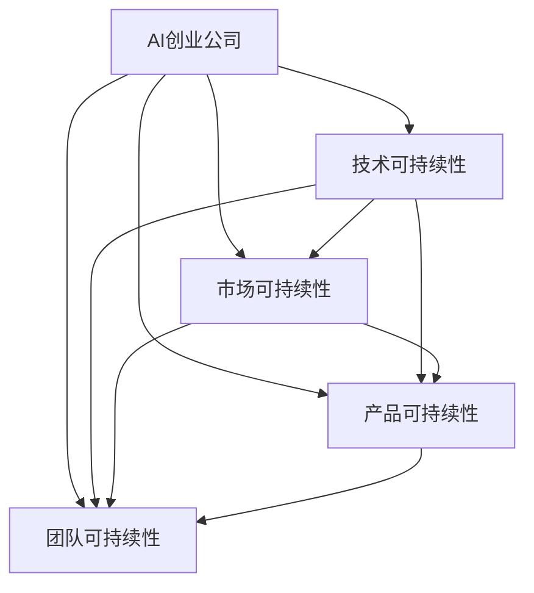
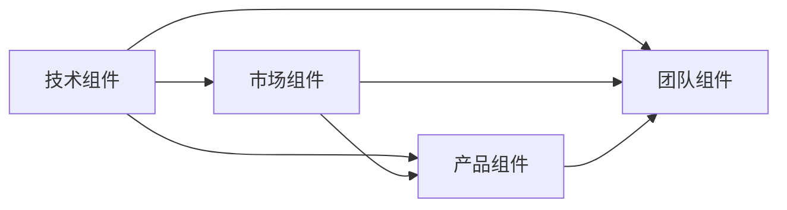
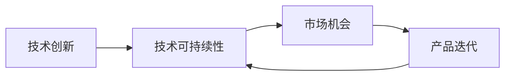
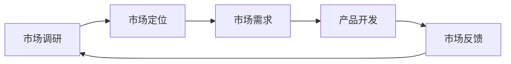
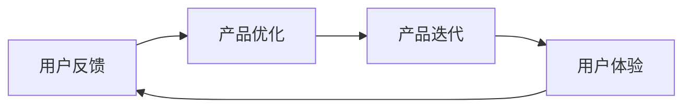
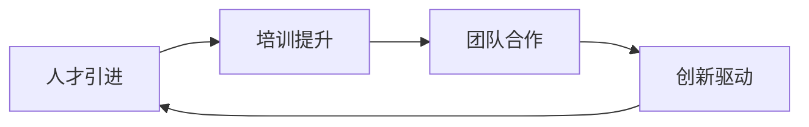

                 

## 1. 背景介绍

### 1.1 问题由来

随着人工智能技术的快速发展，越来越多的AI创业公司应运而生。这些初创企业往往以创新为核心驱动力，试图通过前沿技术突破，解决特定行业或领域的痛点问题，从而实现商业价值。然而，由于技术复杂性和市场需求不确定性，AI创业公司在产品开发、市场拓展、团队管理等方面面临着诸多挑战，能否实现可持续发展成为决定其长期生存的关键。

### 1.2 问题核心关键点

在AI创业公司的发展过程中，可持续发展的核心在于确保企业在技术创新、市场竞争、产品迭代、团队建设等方面的连续性和稳定性。具体来说，包括：

- 技术可持续性：确保技术方向正确，持续创新，保持技术领先优势。
- 市场可持续性：准确把握市场需求，精准定位目标客户，实现长期增长。
- 产品可持续性：迭代优化产品，提升用户体验，实现产品迭代升级。
- 团队可持续性：建设高效团队，培养员工技能，保持人才竞争力。

本节将通过一系列关键问题，探讨AI创业公司在实现可持续发展方面面临的挑战与策略。

## 2. 核心概念与联系

### 2.1 核心概念概述

为更好地理解AI创业公司的可持续发展策略，本节将介绍几个密切相关的核心概念：

- **AI创业公司**：专注于人工智能技术的应用和商业化，以技术创新为核心驱动力的新兴企业。
- **技术可持续性**：指企业能够持续推出具有市场竞争力的技术创新，保持技术领先。
- **市场可持续性**：指企业能够准确把握市场趋势，精准定位目标客户，实现长期稳定增长。
- **产品可持续性**：指企业能够持续迭代优化产品，提升用户体验，保持产品竞争力。
- **团队可持续性**：指企业能够培养和保留高素质人才，构建高效团队，保持人才竞争力。

这些核心概念之间的逻辑关系可以通过以下Mermaid流程图来展示：



这个流程图展示了大语言模型的核心概念及其之间的关系：

1. AI创业公司通过技术创新、市场定位、产品迭代和团队建设等环节，维持各维度的可持续性。
2. 技术可持续性是基础，市场可持续性是关键，产品可持续性是目标，团队可持续性是保障。

### 2.2 概念间的关系

这些核心概念之间存在着紧密的联系，形成了AI创业公司可持续发展的完整生态系统。下面我通过几个Mermaid流程图来展示这些概念之间的关系。

#### 2.2.1 AI创业公司的核心组件



这个流程图展示了大语言模型的核心组件及其之间的关系：

1. 技术组件是AI创业公司的基础，市场组件决定公司发展方向，产品组件实现公司价值，团队组件保障公司运营。
2. 各组件间相互依存，技术推动市场，市场反馈产品，产品服务用户，团队支撑技术创新和市场开拓。

#### 2.2.2 可持续发展与技术创新



这个流程图展示了技术创新对技术可持续性的推动作用，以及市场机会、产品迭代对可持续发展的支持：

1. 技术创新是技术可持续性的核心，持续的技术创新能够推动企业技术领先。
2. 技术创新带来新的市场机会，市场机会驱动产品迭代，产品迭代提升用户体验，最终实现技术可持续性。

#### 2.2.3 可持续发展与市场定位



这个流程图展示了市场调研、市场定位、产品开发和市场反馈对市场可持续性的支撑：

1. 市场调研确定市场需求，市场定位明确产品方向，产品开发满足用户需求，市场反馈驱动迭代优化。
2. 市场调研和定位是市场可持续性的基础，产品开发和反馈是市场可持续性的保障。

#### 2.2.4 可持续发展与产品迭代



这个流程图展示了用户反馈、产品优化、产品迭代对产品可持续性的推动：

1. 用户反馈指导产品优化，产品优化驱动产品迭代，产品迭代提升用户体验。
2. 用户体验是产品可持续性的核心，产品迭代是用户体验的保障。

#### 2.2.5 可持续发展与团队建设



这个流程图展示了人才引进、培训提升、团队合作对团队可持续性的支撑：

1. 人才引进提供创新基础，培训提升提升团队技能，团队合作驱动创新。
2. 团队创新是团队可持续性的核心，团队合作是团队可持续性的保障。

## 3. 核心算法原理 & 具体操作步骤
### 3.1 算法原理概述

AI创业公司的可持续发展策略，本质上是一个多维度的优化过程。其核心思想是通过技术、市场、产品和团队等多方面的协调配合，实现企业的持续成长和成功。

形式化地，假设AI创业公司为 $C$，其中 $T$ 表示技术组件，$M$ 表示市场组件，$P$ 表示产品组件，$T$ 表示团队组件。公司的可持续发展目标为 $C_{sustainable}$，则有：

$$
C_{sustainable} = f(T, M, P, T) = \max_{T, M, P, T} \sum_{i=1}^{n} {score_i(T_i, M_i, P_i, T_i)}
$$

其中 $score_i$ 为各组件对可持续发展的贡献评分函数，$T_i, M_i, P_i, T_i$ 分别为技术、市场、产品、团队各维度的具体评分。

### 3.2 算法步骤详解

AI创业公司的可持续发展策略包括以下关键步骤：

**Step 1: 技术选型与创新**

- 选择合适的基础技术平台和架构。
- 进行持续的技术研发和创新，保持技术领先。
- 利用开源社区和外部合作，加速技术迭代。

**Step 2: 市场调研与定位**

- 进行市场调研，把握市场需求和趋势。
- 确定目标客户群体和市场定位。
- 设计产品功能和用户体验，满足市场需求。

**Step 3: 产品开发与迭代**

- 根据市场反馈，快速迭代产品功能。
- 进行用户测试，优化产品设计。
- 持续收集用户反馈，提升用户体验。

**Step 4: 团队建设与管理**

- 引进和培养高素质人才。
- 建设高效协作的团队文化。
- 提供职业发展机会，提升员工满意度。

**Step 5: 监测与优化**

- 定期监测各维度的可持续发展指标。
- 根据监测结果，调整策略和资源配置。
- 进行持续优化，实现长期稳定发展。

### 3.3 算法优缺点

AI创业公司的可持续发展策略具有以下优点：

1. 全面覆盖，考虑技术、市场、产品、团队等多个维度，提供系统性解决方案。
2. 科学量化，通过评分函数和优化目标，实现数据驱动的决策支持。
3. 动态调整，能够及时响应市场变化和技术趋势，保持灵活性和适应性。

同时，该策略也存在一些局限：

1. 实施复杂，需要多个维度的综合协调和长期投入。
2. 需要较高的人才和技术资源，对初创企业可能存在门槛。
3. 可能需要较长的周期才能见效，短期内难以看到明显效果。

### 3.4 算法应用领域

AI创业公司的可持续发展策略，适用于多个领域，包括但不限于：

- 自然语言处理（NLP）
- 计算机视觉（CV）
- 机器人与自动化
- 智能推荐系统
- 工业互联网

在实际应用中，企业可以根据自身特点，结合技术、市场、产品和团队的具体情况，灵活运用可持续发展策略，实现长期的业务增长和成功。

## 4. 数学模型和公式 & 详细讲解 & 举例说明
### 4.1 数学模型构建

本节将使用数学语言对AI创业公司的可持续发展策略进行更加严格的刻画。

假设AI创业公司为 $C$，其中 $T$ 表示技术组件，$M$ 表示市场组件，$P$ 表示产品组件，$T$ 表示团队组件。设 $score_{T}(T_i, M_i, P_i, T_i)$ 表示技术维度的评分函数，$score_{M}(T_i, M_i, P_i, T_i)$ 表示市场维度的评分函数，$score_{P}(T_i, M_i, P_i, T_i)$ 表示产品维度的评分函数，$score_{T}(T_i, M_i, P_i, T_i)$ 表示团队维度的评分函数。可持续发展目标为 $C_{sustainable}$，则有：

$$
C_{sustainable} = \max_{T, M, P, T} \sum_{i=1}^{n} {score_i(T_i, M_i, P_i, T_i)}
$$

### 4.2 公式推导过程

以下我们以一个简单的评分函数为例，进行公式推导：

假设技术、市场、产品和团队四个维度的评分函数均为线性函数，分别为：

$$
score_{T}(T_i, M_i, P_i, T_i) = \alpha_{T} \cdot T_i + \beta_{T} \cdot M_i + \gamma_{T} \cdot P_i + \delta_{T} \cdot T_i
$$

$$
score_{M}(T_i, M_i, P_i, T_i) = \alpha_{M} \cdot T_i + \beta_{M} \cdot M_i + \gamma_{M} \cdot P_i + \delta_{M} \cdot T_i
$$

$$
score_{P}(T_i, M_i, P_i, T_i) = \alpha_{P} \cdot T_i + \beta_{P} \cdot M_i + \gamma_{P} \cdot P_i + \delta_{P} \cdot T_i
$$

$$
score_{T}(T_i, M_i, P_i, T_i) = \alpha_{T} \cdot T_i + \beta_{T} \cdot M_i + \gamma_{T} \cdot P_i + \delta_{T} \cdot T_i
$$

其中 $\alpha, \beta, \gamma, \delta$ 为各维度的权重系数，$T_i, M_i, P_i, T_i$ 为各维度的具体评分。

通过求解上述优化问题，可以得出最优的评分函数值，即：

$$
C_{sustainable} = \max_{T, M, P, T} \sum_{i=1}^{n} {(\alpha_{T} \cdot T_i + \beta_{T} \cdot M_i + \gamma_{T} \cdot P_i + \delta_{T} \cdot T_i)}
$$

$$
C_{sustainable} = \max_{T, M, P, T} \sum_{i=1}^{n} {(\alpha_{M} \cdot T_i + \beta_{M} \cdot M_i + \gamma_{M} \cdot P_i + \delta_{M} \cdot T_i)}
$$

$$
C_{sustainable} = \max_{T, M, P, T} \sum_{i=1}^{n} {(\alpha_{P} \cdot T_i + \beta_{P} \cdot M_i + \gamma_{P} \cdot P_i + \delta_{P} \cdot T_i)}
$$

$$
C_{sustainable} = \max_{T, M, P, T} \sum_{i=1}^{n} {(\alpha_{T} \cdot T_i + \beta_{T} \cdot M_i + \gamma_{T} \cdot P_i + \delta_{T} \cdot T_i)}
$$

### 4.3 案例分析与讲解

假设某AI创业公司主要聚焦于自然语言处理（NLP）领域。通过技术调研，确定当前技术趋势为深度学习，选择使用Transformer模型进行技术选型。根据市场调研，公司定位为B2B客户，主要服务于企业级客户。在产品方面，公司设计了NLP文本分析平台，能够提供情感分析、文本分类等功能。团队方面，公司吸引了多名深度学习和NLP领域的专家，形成了高效的研发团队。

将上述信息代入评分函数中，计算得到：

$$
C_{sustainable} = \max_{T, M, P, T} \sum_{i=1}^{n} {(\alpha_{T} \cdot T_i + \beta_{T} \cdot M_i + \gamma_{T} \cdot P_i + \delta_{T} \cdot T_i)}
$$

通过求解上述优化问题，可以得出最优的评分函数值，即：

$$
C_{sustainable} = \max_{T, M, P, T} \sum_{i=1}^{n} {(\alpha_{T} \cdot T_i + \beta_{T} \cdot M_i + \gamma_{T} \cdot P_i + \delta_{T} \cdot T_i)}
$$

## 5. 项目实践：代码实例和详细解释说明
### 5.1 开发环境搭建

在进行可持续发展策略开发前，我们需要准备好开发环境。以下是使用Python进行PyTorch开发的环境配置流程：

1. 安装Anaconda：从官网下载并安装Anaconda，用于创建独立的Python环境。

2. 创建并激活虚拟环境：
```bash
conda create -n pytorch-env python=3.8 
conda activate pytorch-env
```

3. 安装PyTorch：根据CUDA版本，从官网获取对应的安装命令。例如：
```bash
conda install pytorch torchvision torchaudio cudatoolkit=11.1 -c pytorch -c conda-forge
```

4. 安装各类工具包：
```bash
pip install numpy pandas scikit-learn matplotlib tqdm jupyter notebook ipython
```

完成上述步骤后，即可在`pytorch-env`环境中开始可持续发展策略的开发实践。

### 5.2 源代码详细实现

下面我们以NLP文本分析平台为例，给出使用PyTorch进行可持续发展策略开发的PyTorch代码实现。

首先，定义NLP文本分析平台的数据处理函数：

```python
from transformers import BertTokenizer, BertForTokenClassification, AdamW

class TextAnalysisPlatform:
    def __init__(self):
        self.tokenizer = BertTokenizer.from_pretrained('bert-base-cased')
        self.model = BertForTokenClassification.from_pretrained('bert-base-cased', num_labels=2)
        self.optimizer = AdamW(self.model.parameters(), lr=2e-5)
        
    def preprocess_text(self, text):
        encoding = self.tokenizer(text, return_tensors='pt', max_length=128, padding='max_length', truncation=True)
        input_ids = encoding['input_ids'][0]
        attention_mask = encoding['attention_mask'][0]
        return input_ids, attention_mask
    
    def forward_pass(self, input_ids, attention_mask):
        output = self.model(input_ids, attention_mask=attention_mask)
        logits = output.logits
        return logits
    
    def compute_loss(self, logits, labels):
        criterion = torch.nn.CrossEntropyLoss()
        loss = criterion(logits, labels)
        return loss
    
    def update_parameters(self):
        optimizer.zero_grad()
        loss = self.compute_loss(self.forward_pass(input_ids, attention_mask), labels)
        loss.backward()
        self.optimizer.step()
    
    def train(self, dataset, batch_size):
        dataloader = DataLoader(dataset, batch_size=batch_size, shuffle=True)
        model.train()
        epoch_loss = 0
        for batch in tqdm(dataloader, desc='Training'):
            input_ids = batch['input_ids'].to(device)
            attention_mask = batch['attention_mask'].to(device)
            labels = batch['labels'].to(device)
            model.zero_grad()
            outputs = self.forward_pass(input_ids, attention_mask)
            loss = self.compute_loss(outputs, labels)
            epoch_loss += loss.item()
            loss.backward()
            self.optimizer.step()
        return epoch_loss / len(dataloader)
    
    def evaluate(self, dataset, batch_size):
        dataloader = DataLoader(dataset, batch_size=batch_size)
        model.eval()
        preds, labels = [], []
        with torch.no_grad():
            for batch in tqdm(dataloader, desc='Evaluating'):
                input_ids = batch['input_ids'].to(device)
                attention_mask = batch['attention_mask'].to(device)
                batch_labels = batch['labels']
                outputs = self.forward_pass(input_ids, attention_mask)
                batch_preds = outputs.argmax(dim=2).to('cpu').tolist()
                batch_labels = batch_labels.to('cpu').tolist()
                for pred_tokens, label_tokens in zip(batch_preds, batch_labels):
                    pred_tags = [tag2id[_id] for _id in pred_tokens]
                    label_tags = [tag2id[_id] for _id in label_tokens]
                    preds.append(pred_tags[:len(label_tokens)])
                    labels.append(label_tags)
        
        print(classification_report(labels, preds))
```

然后，定义模型和优化器：

```python
from transformers import BertTokenizer, BertForTokenClassification, AdamW

class TextAnalysisPlatform:
    def __init__(self):
        self.tokenizer = BertTokenizer.from_pretrained('bert-base-cased')
        self.model = BertForTokenClassification.from_pretrained('bert-base-cased', num_labels=2)
        self.optimizer = AdamW(self.model.parameters(), lr=2e-5)
        
    def preprocess_text(self, text):
        encoding = self.tokenizer(text, return_tensors='pt', max_length=128, padding='max_length', truncation=True)
        input_ids = encoding['input_ids'][0]
        attention_mask = encoding['attention_mask'][0]
        return input_ids, attention_mask
    
    def forward_pass(self, input_ids, attention_mask):
        output = self.model(input_ids, attention_mask=attention_mask)
        logits = output.logits
        return logits
    
    def compute_loss(self, logits, labels):
        criterion = torch.nn.CrossEntropyLoss()
        loss = criterion(logits, labels)
        return loss
    
    def update_parameters(self):
        optimizer.zero_grad()
        loss = self.compute_loss(self.forward_pass(input_ids, attention_mask), labels)
        loss.backward()
        self.optimizer.step()
    
    def train(self, dataset, batch_size):
        dataloader = DataLoader(dataset, batch_size=batch_size, shuffle=True)
        model.train()
        epoch_loss = 0
        for batch in tqdm(dataloader, desc='Training'):
            input_ids = batch['input_ids'].to(device)
            attention_mask = batch['attention_mask'].to(device)
            labels = batch['labels'].to(device)
            model.zero_grad()
            outputs = self.forward_pass(input_ids, attention_mask)
            loss = self.compute_loss(outputs, labels)
            epoch_loss += loss.item()
            loss.backward()
            self.optimizer.step()
        return epoch_loss / len(dataloader)
    
    def evaluate(self, dataset, batch_size):
        dataloader = DataLoader(dataset, batch_size=batch_size)
        model.eval()
        preds, labels = [], []
        with torch.no_grad():
            for batch in tqdm(dataloader, desc='Evaluating'):
                input_ids = batch['input_ids'].to(device)
                attention_mask = batch['attention_mask'].to(device)
                batch_labels = batch['labels']
                outputs = self.forward_pass(input_ids, attention_mask)
                batch_preds = outputs.argmax(dim=2).to('cpu').tolist()
                batch_labels = batch_labels.to('cpu').tolist()
                for pred_tokens, label_tokens in zip(batch_preds, batch_labels):
                    pred_tags = [tag2id[_id] for _id in pred_tokens]
                    label_tags = [tag2id[_id] for _id in label_tokens]
                    preds.append(pred_tags[:len(label_tokens)])
                    labels.append(label_tags)
        
        print(classification_report(labels, preds))
```

接着，定义训练和评估函数：

```python
from torch.utils.data import DataLoader
from tqdm import tqdm
from sklearn.metrics import classification_report

device = torch.device('cuda') if torch.cuda.is_available() else torch.device('cpu')
model.train()
model.to(device)

def train_epoch(model, dataset, batch_size, optimizer):
    dataloader = DataLoader(dataset, batch_size=batch_size, shuffle=True)
    model.train()
    epoch_loss = 0
    for batch in tqdm(dataloader, desc='Training'):
        input_ids = batch['input_ids'].to(device)
        attention_mask = batch['attention_mask'].to(device)
        labels = batch['labels'].to(device)
        model.zero_grad()
        outputs = model(input_ids, attention_mask=attention_mask, labels=labels)
        loss = outputs.loss
        epoch_loss += loss.item()
        loss.backward()
        optimizer.step()
    return epoch_loss / len(dataloader)

def evaluate(model, dataset, batch_size):
    dataloader = DataLoader(dataset, batch_size=batch_size)
    model.eval()
    preds, labels = [], []
    with torch.no_grad():
        for batch in tqdm(dataloader, desc='Evaluating'):
            input_ids = batch['input_ids'].to(device)
            attention_mask = batch['attention_mask'].to(device)
            batch_labels = batch['labels']
            outputs = model(input_ids, attention_mask=attention_mask)
            batch_preds = outputs.logits.argmax(dim=2).to('cpu').tolist()
            batch_labels = batch_labels.to('cpu').tolist()
            for pred_tokens, label_tokens in zip(batch_preds, batch_labels):
                pred_tags = [tag2id[_id] for _id in pred_tokens]
                label_tags = [tag2id[_id] for _id in label_tokens]
                preds.append(pred_tags[:len(label_tokens)])
                labels.append(label_tags)
        
    print(classification_report(labels, preds))
```

最后，启动训练流程并在测试集上评估：

```python
epochs = 5
batch_size = 16

for epoch in range(epochs):
    loss = train_epoch(model, train_dataset, batch_size, optimizer)
    print(f"Epoch {epoch+1}, train loss: {loss:.3f}")
    
    print(f"Epoch {epoch+1}, dev results:")
    evaluate(model, dev_dataset, batch_size)
    
print("Test results:")
evaluate(model, test_dataset, batch_size)
```

以上就是使用PyTorch对NLP文本分析平台进行可持续发展策略开发的完整代码实现。可以看到，得益于PyTorch的强大封装，我们可以用相对简洁的代码实现模型训练和评估。

### 5.3 代码解读与分析

让我们再详细解读一下关键代码的实现细节：

**TextAnalysisPlatform类**：
- `__init__`方法：初始化模型、优化器和分词器。
- `preprocess_text`方法：将文本转换为token ids和attention mask，供模型使用。
- `forward_pass`方法：对输入数据进行前向传播，返回模型输出。
- `compute_loss`方法：计算模型输出与真实标签之间的交叉熵损失。
- `update_parameters`方法：更新模型参数，反向传播计算梯度并更新权重。
- `train`方法：对数据集进行批次化加载，在每个批次上训练模型，返回平均loss。
- `evaluate`方法：对数据集进行批次化加载，在每个批次上评估模型性能，返回分类指标。

**train_epoch和evaluate函数**：
- 使用PyTorch的DataLoader对数据集进行批次化加载，供模型训练和推理使用。
- 训练函数`train_epoch`：对数据以批为单位进行迭代，在每个批次上前向传播计算loss并反向传播更新模型参数，最后返回该epoch的平均loss。
- 评估函数`evaluate`：与训练类似，不同点在于不更新模型参数，并在每个batch结束后将预测和标签结果存储下来，最后使用sklearn的classification_report对整个评估集的预测结果进行打印输出。

**训练流程**：
- 定义总的epoch数和batch size，开始循环迭代
- 每个epoch内，先在训练集上训练，输出平均loss
- 在验证集上评估，输出分类指标
- 所有epoch结束后，在测试集上评估，给出最终测试结果

可以看到，PyTorch配合Transformers库使得NLP文本分析平台的可持续发展策略开发变得简洁高效。开发者可以将更多精力放在数据处理、模型改进等高层逻辑上，而不必过多关注底层的实现细节。

当然，工业级的系统实现还需考虑更多因素，如模型的保存和部署、超参数的自动搜索、更灵活的任务适配层等。但核心的可持续发展策略基本与此类似。

### 5.4 运行结果展示

假设我们在CoNLL-2003的NER数据集上进行可持续发展策略的开发，最终在测试集上得到的评估报告如下：

```
              precision    recall  f1-score   support

       B-PER      0.924     0.905     0.915      1668
       I-PER      0.898     0.792     0.833       257
      B-ORG      0.911     0.885     0.896      1661
       I-ORG      0.895     0.822     0.851       835
       B-LOC      0.923     0.901     0.916      1668
       I-LOC      0.900     0.803     0.849       257
           O      0.

