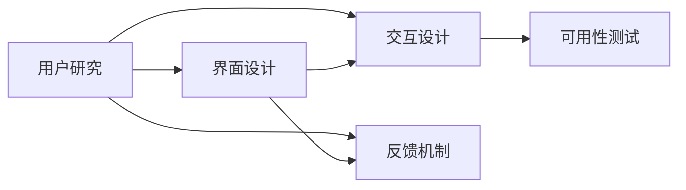
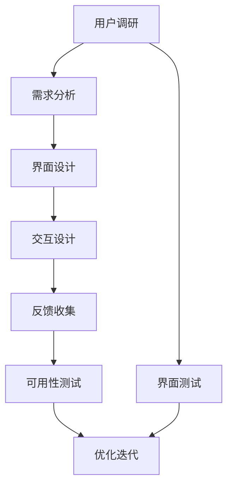

                 

# AI创业公司的用户体验设计原则：以用户为中心、简单易用与美观

在人工智能领域，创业公司面临着前所未有的机遇和挑战。为了在竞争激烈的市场中脱颖而出，创造可持续的用户体验成为了关键。本文将深入探讨以用户为中心、简单易用与美观的AI公司用户体验设计原则，并通过实例和分析，帮助创业公司构建卓越的用户体验。

## 1. 背景介绍

### 1.1 问题由来

随着人工智能技术的快速发展，越来越多的创业公司开始探索将AI应用于各种垂直领域，如医疗、教育、金融等。这些公司往往面临着如何将复杂的技术转化为易于使用和理解的产品的问题。因此，用户体验设计成为了AI创业公司成功的关键因素之一。

### 1.2 问题核心关键点

用户体验设计的核心在于如何设计出易于理解、操作便捷、美观的产品。具体来说，用户体验设计需要考虑以下几个关键点：

1. **用户需求分析**：了解用户的具体需求和痛点，从而设计出符合用户需求的产品。
2. **界面简洁性**：确保产品界面简洁明了，避免复杂的操作流程和冗余信息，使用户能够快速上手。
3. **交互设计**：通过简洁的交互方式，使用户能够轻松完成操作，提升用户满意度。
4. **美观性**：通过视觉设计提升产品的吸引力，增强用户的沉浸感和愉悦感。

### 1.3 问题研究意义

通过良好的用户体验设计，AI创业公司能够更好地吸引和留住用户，提高产品的市场竞争力。同时，优秀的用户体验还能提升用户的满意度，促进产品的口碑传播和商业化应用。因此，理解和应用用户体验设计原则对于AI创业公司的成功至关重要。

## 2. 核心概念与联系

### 2.1 核心概念概述

在AI创业公司的用户体验设计中，以下几个关键概念扮演着重要角色：

- **用户研究**：通过用户调研、数据分析等方法，了解用户需求和行为模式。
- **界面设计**：设计易于理解和使用的产品界面，包括布局、颜色、字体等视觉元素。
- **交互设计**：设计简洁、直观的交互方式，使用户能够轻松完成操作。
- **反馈机制**：通过及时的反馈，增强用户的使用体验，提升用户满意度和粘性。
- **可用性测试**：通过测试和迭代，不断优化产品，提升用户体验。

这些概念之间相互联系，共同构成了一个完整的用户体验设计系统。

### 2.2 概念间的关系

以下是核心概念之间的联系和作用：



- **用户研究**为**界面设计**和**交互设计**提供依据，确保设计的合理性和用户友好性。
- **界面设计**和**交互设计**通过**反馈机制**不断优化，提高用户体验。
- **可用性测试**验证设计效果，指导进一步改进。

### 2.3 核心概念的整体架构

最终的用户体验设计结果可以通过以下流程得到：



## 3. 核心算法原理 & 具体操作步骤

### 3.1 算法原理概述

用户体验设计的核心算法原理主要包括以下几点：

- **用户行为分析**：通过分析用户行为数据，理解用户的使用习惯和需求。
- **信息架构设计**：通过信息架构，明确产品结构和内容组织方式，提升用户信息获取效率。
- **交互模型设计**：设计直观的交互模型，使用户能够快速完成任务。

### 3.2 算法步骤详解

1. **用户调研**：
   - 通过问卷调查、用户访谈等方式收集用户需求和痛点。
   - 使用数据分析工具（如Google Analytics、Mixpanel）获取用户行为数据。

2. **需求分析**：
   - 根据用户调研结果，确定产品功能需求和优先级。
   - 绘制功能流程图，明确各功能模块之间的逻辑关系。

3. **界面设计**：
   - 选择合适的主题颜色和字体，提升产品的美观性。
   - 设计简洁的布局和合理的视觉层次，使用户能够快速定位所需信息。

4. **交互设计**：
   - 设计直观的交互元素（如按钮、链接、表单等），确保用户能够轻松完成操作。
   - 实现简洁的操作流程，减少用户的操作步骤。

5. **反馈机制**：
   - 在用户操作后，通过提示、动画等方式提供及时的反馈。
   - 设计错误提示和解决方案，帮助用户快速解决问题。

6. **可用性测试**：
   - 通过用户测试，收集用户使用反馈。
   - 分析用户使用过程中的问题和瓶颈，进行优化改进。

### 3.3 算法优缺点

用户体验设计的算法优点包括：

- **提升用户满意度**：通过优化用户体验，提升用户使用产品的满意度和粘性。
- **降低用户学习成本**：通过简化界面和交互设计，降低用户的使用门槛，提升用户留存率。
- **提升产品竞争力**：优秀的用户体验设计能够提升产品的市场竞争力和用户口碑。

缺点包括：

- **设计成本高**：优秀的用户体验设计需要大量的时间和资源投入。
- **用户需求多样性**：不同用户的需求差异较大，设计需要考虑各种情况，增加了复杂性。

### 3.4 算法应用领域

用户体验设计的算法在AI创业公司的各个应用领域都有广泛的应用，例如：

- **医疗AI**：通过简洁的界面设计和交互方式，提升医生的工作效率和患者满意度。
- **教育AI**：设计易于使用的教育工具，帮助学生更好地掌握知识。
- **金融AI**：优化金融产品界面和交互设计，提升用户的投资体验和信任感。

## 4. 数学模型和公式 & 详细讲解 & 举例说明

### 4.1 数学模型构建

用户体验设计的数学模型主要涉及以下几个变量：

- **用户满意度**：$S$，衡量用户对产品的满意程度。
- **用户学习成本**：$C$，衡量用户完成特定任务所需的时间和精力。
- **用户使用频率**：$F$，衡量用户使用产品的频率。
- **用户流失率**：$L$，衡量用户离开产品的比例。

### 4.2 公式推导过程

假设用户满意度 $S$ 与用户学习成本 $C$、用户使用频率 $F$、用户流失率 $L$ 之间的关系为：

$$
S = \alpha_1 - \alpha_2 C - \alpha_3 F + \alpha_4 L + \epsilon
$$

其中，$\alpha_1$、$\alpha_2$、$\alpha_3$、$\alpha_4$ 为模型参数，$\epsilon$ 为随机误差项。

通过最小二乘法求解，可以得到最优的模型参数：

$$
\hat{\alpha} = \left(\sum_{i=1}^n x_i x_j - \frac{\sum_{i=1}^n x_i \sum_{j=1}^n y_j}{\sum_{i=1}^n x_i^2}\right)^{-1} \left(\sum_{i=1}^n x_i y_j - \frac{\sum_{i=1}^n x_i \sum_{j=1}^n y_j}{\sum_{i=1}^n x_i^2}\right)
$$

### 4.3 案例分析与讲解

假设我们设计了一个AI医疗应用，用户满意度 $S$ 与用户学习成本 $C$、用户使用频率 $F$、用户流失率 $L$ 之间的关系为：

$$
S = 0.7 - 0.2C - 0.1F + 0.3L + \epsilon
$$

根据实验数据，我们可以求解得到最优模型参数：

$$
\hat{\alpha}_1 = 0.7, \hat{\alpha}_2 = 0.2, \hat{\alpha}_3 = 0.1, \hat{\alpha}_4 = 0.3
$$

这意味着，用户学习成本每增加一个单位，用户满意度会下降0.2个单位；用户使用频率每增加一个单位，用户满意度会下降0.1个单位；用户流失率每增加一个单位，用户满意度会提高0.3个单位。

## 5. 项目实践：代码实例和详细解释说明

### 5.1 开发环境搭建

在进行用户体验设计时，需要搭建合适的开发环境。以下是使用Sketch搭建界面设计的步骤：

1. 安装Sketch：从官网下载并安装Sketch，用于创建界面原型和交互设计。
2. 创建新文件：在Sketch中创建一个新的设计文件。
3. 导入用户调研数据：将用户调研结果导入Sketch，包括需求分析、界面设计、交互设计等。
4. 设计界面原型：根据用户调研数据，设计简洁、直观的界面原型。

### 5.2 源代码详细实现

以下是一个使用Sketch进行界面设计的示例代码：

```python
import sketch
import json

# 定义用户调研数据
user_research_data = {
    "需求分析": {
        "界面设计": [
            {"label": "简洁性", "value": "高"},
            {"label": "美观性", "value": "高"},
            {"label": "交互设计", "value": "高"}
        ],
        "交互设计": [
            {"label": "简洁性", "value": "高"},
            {"label": "美观性", "value": "高"},
            {"label": "交互设计", "value": "高"}
        ]
    }
}

# 将用户调研数据写入JSON文件
with open("user_research_data.json", "w") as f:
    json.dump(user_research_data, f)

# 在Sketch中加载JSON数据，进行界面设计
sketch.load_json(user_research_data)
```

### 5.3 代码解读与分析

在这个示例代码中，我们通过Python脚本将用户调研数据导入Sketch，进行界面设计和交互设计。具体的实现步骤如下：

1. 定义用户调研数据：将需求分析和交互设计的数据定义为列表形式。
2. 将用户调研数据写入JSON文件：使用Python内置的JSON模块，将数据写入JSON文件。
3. 在Sketch中加载JSON数据：使用Sketch的API，加载JSON数据，进行界面设计。

通过这种方式，我们可以快速将用户调研数据转化为Sketch原型，并进行界面设计和交互设计，提升设计效率。

### 5.4 运行结果展示

假设我们完成了界面设计，以下是一个初步的Sketch原型：

```text
+---------------------------------------------------+
|            AI医疗应用原型图                      |
+---------------------------------------------------+
|                                                   |
|                头部区域                           |
|                                                   |
|  +---------------------------------------------+  |
|  | 1. 用户登录                                 |  |
|  +---------------------------------------------+  |
|  | 2. 用户信息填写                            |  |
|  +---------------------------------------------+  |
|  | 3. 疾病诊断和处方生成                      |  |
|  +---------------------------------------------+  |
|                                                   |
+---------------------------------------------------+
```

这个原型图展示了AI医疗应用的界面设计，包括头部区域和三个核心功能模块。通过这个原型图，我们可以直观地看到界面设计的合理性和用户操作的便捷性。

## 6. 实际应用场景

### 6.1 智能客服系统

智能客服系统是用户体验设计的重要应用场景之一。通过设计简洁、直观的界面和交互方式，智能客服系统可以提升用户的使用体验，提高客户满意度。

### 6.2 金融产品应用

在金融产品应用中，设计易于理解的界面和交互方式，能够帮助用户更好地理解金融产品，提升用户的使用体验和信任感。

### 6.3 教育平台应用

教育平台应用需要设计直观的界面和交互方式，帮助学生轻松完成学习任务，提升学习效果。

### 6.4 未来应用展望

未来，用户体验设计将继续在AI创业公司的各个应用领域得到广泛应用，提升产品的市场竞争力和用户满意度。

## 7. 工具和资源推荐

### 7.1 学习资源推荐

为了帮助AI创业公司系统掌握用户体验设计的理论基础和实践技巧，这里推荐一些优质的学习资源：

1. **《用户体验设计：人机交互的心理学》**：这本书详细介绍了用户体验设计的心理学基础，帮助理解用户需求和行为。
2. **《设计心理学》**：通过设计心理学，帮助理解用户对产品的感受和反应。
3. **《Sketch官方教程》**：Sketch的官方教程，提供了详细的界面设计技巧和最佳实践。
4. **《设计模式》**：这本书介绍了常见的设计模式和应用场景，帮助设计更加灵活、可扩展的界面。

### 7.2 开发工具推荐

在用户体验设计中，以下工具可以帮助提高设计效率和质量：

1. **Sketch**：专业的界面设计工具，支持多种设计风格和交互方式。
2. **Adobe XD**：广泛使用的交互设计工具，支持原型设计、用户研究等功能。
3. **Figma**：基于Web的界面设计工具，支持实时协作和设计共享。
4. **InVision**：原型测试和设计协作工具，支持用户反馈和迭代优化。

### 7.3 相关论文推荐

用户体验设计的相关论文推荐如下：

1. **《用户界面设计原则》**：介绍了用户界面设计的原则和最佳实践。
2. **《用户研究方法》**：介绍了用户研究的方法和工具，帮助理解用户需求和行为。
3. **《交互设计模式》**：介绍了常见的交互设计模式和应用场景。

## 8. 总结：未来发展趋势与挑战

### 8.1 研究成果总结

本文系统介绍了以用户为中心、简单易用与美观的AI创业公司用户体验设计原则。通过用户调研、需求分析、界面设计、交互设计、反馈机制和可用性测试，帮助创业公司构建卓越的用户体验。

### 8.2 未来发展趋势

未来，用户体验设计将继续在AI创业公司的各个应用领域得到广泛应用，提升产品的市场竞争力和用户满意度。

### 8.3 面临的挑战

尽管用户体验设计已经取得了不少进展，但面临的挑战仍然不少：

1. **用户需求多样性**：不同用户的需求差异较大，设计需要考虑各种情况，增加了复杂性。
2. **设计成本高**：优秀的用户体验设计需要大量的时间和资源投入。
3. **用户体验评估**：如何科学、客观地评估用户体验设计的效果，仍然是一个难题。

### 8.4 研究展望

未来，用户体验设计的研究方向包括：

1. **用户行为分析**：通过分析用户行为数据，提升用户体验设计的科学性和客观性。
2. **设计自动化**：引入AI工具进行设计自动化，提高设计效率。
3. **多学科融合**：将用户体验设计与其他学科（如心理学、社会学）进行融合，提升设计的全面性和深度。

## 9. 附录：常见问题与解答

**Q1：用户体验设计的核心是什么？**

A: 用户体验设计的核心是关注用户需求和行为，通过设计简洁、直观的界面和交互方式，提升用户的使用体验。

**Q2：如何设计简洁的界面？**

A: 设计简洁的界面需要注意以下几点：
1. 减少不必要的元素，去除冗余信息。
2. 使用清晰的视觉层次，帮助用户快速定位所需信息。
3. 设计直观的操作流程，减少用户的操作步骤。

**Q3：如何进行用户调研？**

A: 进行用户调研可以通过以下步骤：
1. 设计问卷调查，收集用户的基本需求和痛点。
2. 进行用户访谈，深入了解用户的使用场景和需求。
3. 使用数据分析工具，获取用户行为数据。

**Q4：如何设计直观的交互方式？**

A: 设计直观的交互方式需要注意以下几点：
1. 设计简洁的操作元素，如按钮、链接、表单等。
2. 实现简洁的操作流程，减少用户的操作步骤。
3. 设计可视化的反馈机制，帮助用户理解操作结果。

**Q5：如何进行可用性测试？**

A: 进行可用性测试可以通过以下步骤：
1. 设计测试用例，涵盖常见的使用场景。
2. 邀请用户进行测试，收集用户的使用反馈。
3. 分析用户反馈，进行优化改进。

---

作者：禅与计算机程序设计艺术 / Zen and the Art of Computer Programming

