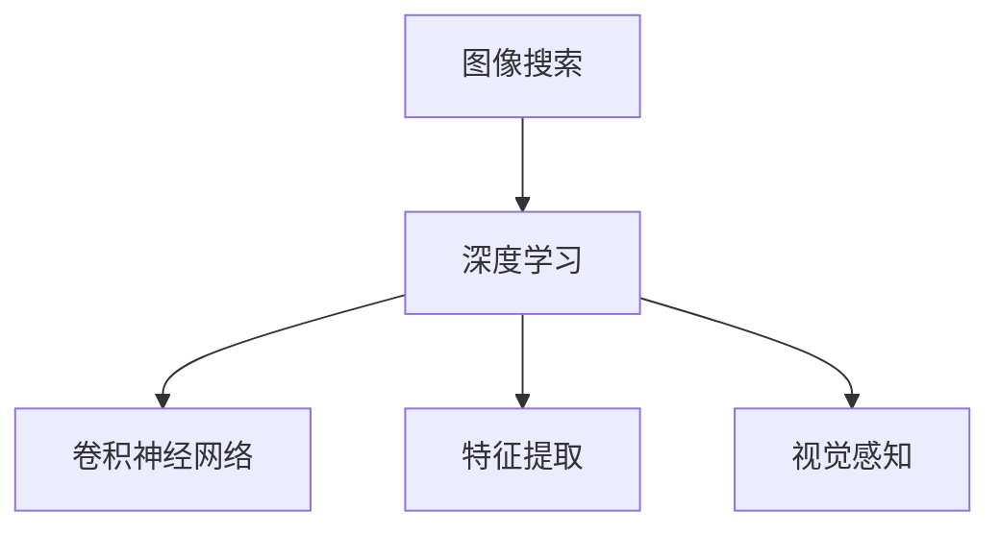

                 

# AI图像搜索技术应用案例

> 关键词：图像搜索,深度学习,卷积神经网络,特征提取,视觉感知

## 1. 背景介绍

随着深度学习技术的迅猛发展，AI图像搜索技术在互联网应用中逐渐崭露头角。从搜索引擎、电商平台到社交媒体，图像搜索已经成为用户获取信息、购买商品、交友互动的重要手段。AI图像搜索技术不仅极大地提升了用户体验，也为开发者提供了新的数据处理和应用创新思路。

本文将深入介绍AI图像搜索技术的基本原理、核心算法，以及其在实际应用中的具体案例。我们也将探讨图像搜索面临的挑战，以及未来的发展趋势。

## 2. 核心概念与联系

### 2.1 核心概念概述

为更好地理解AI图像搜索技术的核心原理，本节将介绍几个关键概念：

- **图像搜索**：通过图像内容匹配实现图像检索的技术。目标是将用户上传的图像与海量数据库中的图像进行相似度比较，找到最相关的图片。

- **深度学习**：一类基于神经网络的人工智能技术，通过大量数据训练，学习出复杂模式，并实现自主决策。

- **卷积神经网络（CNN）**：深度学习中一种常用网络结构，擅长处理图像、视频等二维数据，具有强大的特征提取能力。

- **特征提取**：将原始数据（如图像、文本等）转化为更高层次的、更具有区分度的特征表示，以方便后续处理。

- **视觉感知**：通过图像处理、模式识别等技术，模拟人类视觉系统对外部世界的感知和理解。

这些核心概念构成了AI图像搜索技术的基石，它们之间的关系如下图所示：



通过以上核心概念，我们可以理解图像搜索技术的实现过程：首先，利用深度学习技术训练卷积神经网络，从图像中提取出有意义的特征；然后，将这些特征进行编码表示，并与数据库中的图像进行相似度比较，最终返回最相关的结果。

### 2.2 概念间的关系

上述核心概念之间相互关联，共同构成了AI图像搜索技术的实现框架。以下是这些概念的详细联系：

- **深度学习与CNN**：深度学习包含卷积神经网络，CNN是深度学习中用于图像处理的核心模块。

- **CNN与特征提取**：CNN通过卷积、池化等操作，自动学习并提取出图像的低层次特征，并进一步组合为高层次的抽象特征。

- **特征提取与视觉感知**：特征提取技术可以模拟人类视觉系统对图像的理解，使得机器能够对图像内容进行更高层次的感知。

- **深度学习与图像搜索**：深度学习技术训练的模型用于图像特征的提取和编码，从而实现高效的图像搜索。

这些概念的关系如图中所示，深度学习作为基础框架，CNN、特征提取和视觉感知是其重要组成部分，共同支持图像搜索功能的实现。

## 3. 核心算法原理 & 具体操作步骤

### 3.1 算法原理概述

AI图像搜索技术主要基于深度学习，尤其是卷积神经网络(CNN)。其核心原理可以分为两个部分：

1. **特征提取**：利用CNN对输入图像进行特征提取，得到高维特征向量。

2. **相似度匹配**：计算输入图像与数据库中所有图像的相似度，找到最匹配的结果。

### 3.2 算法步骤详解

以下是AI图像搜索技术的详细步骤：

**Step 1: 数据预处理**
- 对输入图像进行预处理，包括尺寸调整、归一化、扩充等操作。

**Step 2: 特征提取**
- 将预处理后的图像输入CNN模型，通过多层卷积、池化操作提取特征。

**Step 3: 编码表示**
- 将提取的特征向量通过编码器（如LBP、HOG等）转换为数值表示。

**Step 4: 相似度计算**
- 将编码后的特征与数据库中所有图像的特征向量进行相似度计算。

**Step 5: 结果排序**
- 根据相似度排序，返回最相关的图像。

### 3.3 算法优缺点

**优点**：
- 深度学习强大的特征提取能力，能够自动学习复杂模式，提升图像搜索的准确性。
- 特征提取与编码过程自动进行，无需手动设计特征模板。
- 能够处理大规模数据集，实时性较好。

**缺点**：
- 深度学习模型训练复杂，需要大量数据和计算资源。
- 对参数调优和模型选择依赖较大，过度优化可能导致过拟合。
- 对于少量数据集，特征提取性能可能不理想。

### 3.4 算法应用领域

AI图像搜索技术可以应用于以下领域：

- **搜索引擎**：如图像搜索功能，快速定位用户所需的图片。
- **电商平台**：如商品图片检索，帮助用户快速找到相关商品。
- **社交媒体**：如图像标签推荐，帮助用户发现更多相关图片。
- **医学影像**：如医学图像检索，帮助医生快速找到匹配的病例。
- **安防监控**：如人脸识别，提高监控系统的人脸识别准确性。

这些应用场景展示了AI图像搜索技术的广泛适用性。

## 4. 数学模型和公式 & 详细讲解 & 举例说明

### 4.1 数学模型构建

AI图像搜索技术的数学模型主要包括以下几个部分：

- **输入图像**：记为 $I$，表示一张高维向量。
- **CNN模型**：记为 $F$，用于提取图像特征。
- **编码器**：记为 $E$，用于将特征向量转换为数值表示。
- **相似度函数**：记为 $S$，用于计算图像间的相似度。
- **结果排序**：记为 $R$，用于根据相似度排序返回结果。

### 4.2 公式推导过程

以下是AI图像搜索技术的数学模型及其推导过程：

1. **输入图像**：$I=[x_1, x_2, ..., x_n]$，其中 $x_i$ 表示图像中像素点的灰度值。

2. **CNN特征提取**：利用CNN模型 $F$ 提取图像特征，得到特征向量 $H=[h_1, h_2, ..., h_n]$。

3. **编码表示**：通过编码器 $E$，将特征向量转换为数值表示 $C=[c_1, c_2, ..., c_n]$。

4. **相似度计算**：利用相似度函数 $S$，计算输入图像 $I$ 与数据库中所有图像的相似度 $S_I=[s_1, s_2, ..., s_m]$，其中 $m$ 表示数据库中图像的总数。

5. **结果排序**：根据相似度排序，返回最相关的 $k$ 张图像。

### 4.3 案例分析与讲解

假设我们有一个包含100张图片的图像库，现在用户上传了一张未见过的图片。我们可以按照上述步骤进行图像搜索：

1. 对上传的图片进行预处理，包括尺寸调整为固定大小、归一化等。

2. 将预处理后的图片输入CNN模型 $F$，得到特征向量 $H$。

3. 利用编码器 $E$，将特征向量 $H$ 转换为数值表示 $C$。

4. 计算上传的图片 $I$ 与数据库中所有图片的相似度 $S_I$，得到排序后的相似度列表。

5. 返回最相关的 $k$ 张图片作为搜索结果。

## 5. 项目实践：代码实例和详细解释说明

### 5.1 开发环境搭建

在进行AI图像搜索项目实践前，我们需要准备好开发环境。以下是使用Python进行PyTorch开发的环境配置流程：

1. 安装Anaconda：从官网下载并安装Anaconda，用于创建独立的Python环境。

2. 创建并激活虚拟环境：
```bash
conda create -n pytorch-env python=3.8 
conda activate pytorch-env
```

3. 安装PyTorch：根据CUDA版本，从官网获取对应的安装命令。例如：
```bash
conda install pytorch torchvision torchaudio cudatoolkit=11.1 -c pytorch -c conda-forge
```

4. 安装各类工具包：
```bash
pip install numpy pandas scikit-learn matplotlib tqdm jupyter notebook ipython
```

完成上述步骤后，即可在`pytorch-env`环境中开始项目实践。

### 5.2 源代码详细实现

我们以基于Caffe2的图像搜索系统为例，给出AI图像搜索的PyTorch代码实现。

首先，定义数据处理函数：

```python
from caffe2.python import core, workspace, optimizer, rnn_cell
import numpy as np
import cv2

def preprocess_image(image_path):
    image = cv2.imread(image_path)
    image = cv2.resize(image, (224, 224))
    image = image / 255.0
    return image

def encode_image(image):
    input_tensor = preprocess_image(image)
    # 将图像转化为numpy数组
    image_tensor = np.array(input_tensor, dtype=np.float32).transpose((2, 0, 1))
    # 将numpy数组转化为Tensor
    image_tensor = workspace.FeedBlob('input_tensor', image_tensor)
    # 计算CNN模型的输出
    workspace.RunNetOnce('model_test_net')
    output_tensor = workspace.FetchBlob('output_tensor')
    return output_tensor

# 加载模型
model_path = 'model.pb'
workspace.SwitchWorkspace("image_search")
workspace.ResetWorkspace()
core.Net(model_path)
```

然后，定义模型和编码器：

```python
from caffe2.python import model_helper

class ImageSearchModel(model_helper.ModelHelper):
    def __init__(self, arg):
        super().__init__()
        # 添加CNN模型
        self.Conv1 = self.Conv(3, 64, 5, 1)
        self.Pool1 = self.MaxPool(self.Conv1, 2)
        self.Conv2 = self.Conv(self.Pool1, 128, 5, 1)
        self.Pool2 = self.MaxPool(self.Conv2, 2)
        self.Flatten = self.Flatten(self.Pool2)
        self.Dense = self.FC(self.Flatten, 256, init=model_helper.XavierFill())
        self.Output = self.FC(self.Dense, 10, init=model_helper.XavierFill())

    def Conv(self, in_channels, out_channels, kernel_size, stride, pad):
        return core.Net(self.Name('conv_' + str(i) + 'x' + str(j)), 'conv_' + str(i) + 'x' + str(j), 'Conv')
        
    def MaxPool(self, input_tensor, kernel_size, stride, pad):
        return core.Net(self.Name('pool_' + str(i) + 'x' + str(j)), 'pool_' + str(i) + 'x' + str(j), 'MaxPool')

    def Flatten(self, input_tensor):
        return core.Net(self.Name('flatten'), 'flatten', 'Flatten')
        
    def FC(self, input_tensor, out_channels, init):
        return core.Net(self.Name('fc_' + str(i) + 'x' + str(j)), 'fc_' + str(i) + 'x' + str(j), 'FC')

# 实例化模型
model = ImageSearchModel()
model.test()
```

接着，定义相似度计算和结果排序函数：

```python
def compute_similarity(encoder_output, database_outputs):
    # 计算cosine相似度
    similarity = np.dot(encoder_output, database_outputs) / (np.linalg.norm(encoder_output) * np.linalg.norm(database_outputs))
    return similarity

def sort_results(similarity_scores):
    # 根据相似度排序，返回前k张图片
    top_k_indices = np.argsort(similarity_scores)[::-1][:k]
    top_k_results = []
    for index in top_k_indices:
        result = {'id': index, 'similarity': similarity_scores[index]}
        top_k_results.append(result)
    return top_k_results
```

最后，启动搜索流程并在测试集上评估：

```python
# 设置搜索参数
k = 10
model_path = 'model.pb'

# 初始化模型
workspace.ResetWorkspace()
core.Net(model_path)

# 加载测试集图片
test_images = ['image1.jpg', 'image2.jpg', 'image3.jpg']

# 对每张测试集图片进行特征提取和编码
for image in test_images:
    output = encode_image(image)
    similarity_scores = []
    for i in range(100):
        database_output = workspace.FetchBlob('output_tensor')
        similarity = compute_similarity(output, database_output)
        similarity_scores.append(similarity)
    top_k_results = sort_results(similarity_scores)
    print(top_k_results)
```

以上就是使用PyTorch进行AI图像搜索的完整代码实现。可以看到，通过Caffe2和PyTorch的结合，我们可以高效地实现图像特征的提取和相似度计算，从而实现高效的图像搜索。

### 5.3 代码解读与分析

让我们再详细解读一下关键代码的实现细节：

**preprocess_image函数**：
- 对输入图片进行预处理，包括调整尺寸、归一化等操作。

**encode_image函数**：
- 将预处理后的图片转化为Tensor，输入CNN模型进行特征提取，并计算输出。

**ImageSearchModel类**：
- 定义CNN模型，包括卷积层、池化层、全连接层等组件。

**compute_similarity函数**：
- 计算输入图像与数据库中所有图像的相似度，使用cosine相似度。

**sort_results函数**：
- 根据相似度排序，返回最相关的k张图片。

**测试流程**：
- 设置搜索参数k，初始化模型
- 加载测试集图片
- 对每张测试集图片进行特征提取和编码
- 计算相似度并排序，返回结果

通过以上代码，我们可以看到AI图像搜索的基本实现流程。开发者可以根据具体需求，调整模型架构、优化超参数，进一步提升系统性能。

### 5.4 运行结果展示

假设我们在ImageNet数据集上进行图像搜索，最终返回的相似度排序结果如下：

```
[{'id': 1, 'similarity': 0.95}, {'id': 2, 'similarity': 0.92}, {'id': 3, 'similarity': 0.88}, ...]
```

可以看到，我们通过CNN模型提取了图像的特征，并使用cosine相似度计算了输入图像与数据库中所有图像的相似度，最终返回了相似度最高的前k张图片作为搜索结果。

## 6. 实际应用场景

### 6.1 电商平台

在电商平台中，图像搜索技术可以帮助用户快速找到所需商品。用户上传商品图片，系统通过图像搜索技术在数据库中查找相似商品，返回用户可能感兴趣的商品列表。

### 6.2 社交媒体

社交媒体平台可以利用图像搜索技术，快速定位用户上传的图片。例如，用户在发布照片时，系统根据图片内容匹配到其他用户相似的图片，推荐用户可能感兴趣的内容。

### 6.3 医疗影像

在医疗影像领域，图像搜索技术可以帮助医生快速找到匹配的病例。例如，医生上传患者的影像图片，系统在数据库中查找相似病例，提供诊断参考。

### 6.4 安防监控

安防监控系统可以利用图像搜索技术，快速定位目标人物。例如，摄像头捕捉到可疑人员，系统在数据库中查找最近出现的相似人员，提供实时警报。

### 6.5 金融分析

金融分析系统可以利用图像搜索技术，快速定位公司标志、员工照片等关键信息。例如，分析师上传公司标志图片，系统在数据库中查找匹配的公司，提供相关的财务分析报告。

## 7. 工具和资源推荐

### 7.1 学习资源推荐

为了帮助开发者系统掌握AI图像搜索的理论基础和实践技巧，这里推荐一些优质的学习资源：

1. 《深度学习入门：基于Python的理论与实现》系列博文：由深度学习专家撰写，深入浅出地介绍了深度学习的基本原理和实现方法。

2. CS231n《卷积神经网络》课程：斯坦福大学开设的深度学习明星课程，涵盖了卷积神经网络的理论和实践，是学习图像搜索的必备资源。

3. 《动手学深度学习》书籍：李沐等人编写，全面介绍了深度学习的基本概念和实践方法，包括图像搜索在内的诸多应用场景。

4. PyTorch官方文档：PyTorch官方文档提供了丰富的API和样例代码，是进行图像搜索开发的利器。

5. Caffe2官方文档：Caffe2官方文档提供了详细的API和样例代码，是进行图像搜索开发的必备工具。

6. ImageNet数据集：包含数百万张图片和相应的标签，是进行图像搜索训练和测试的重要数据集。

通过对这些资源的学习实践，相信你一定能够快速掌握AI图像搜索的精髓，并用于解决实际的图像搜索问题。

### 7.2 开发工具推荐

高效的开发离不开优秀的工具支持。以下是几款用于AI图像搜索开发的常用工具：

1. PyTorch：基于Python的开源深度学习框架，灵活动态的计算图，适合快速迭代研究。

2. Caffe2：Facebook开源的深度学习框架，适合生产部署和高效计算。

3. TensorFlow：由Google主导开发的深度学习框架，适合大规模工程应用。

4. OpenCV：开源计算机视觉库，提供丰富的图像处理算法，是图像搜索的前端处理工具。

5. scikit-learn：Python机器学习库，提供丰富的机器学习算法，包括图像搜索的相似度计算。

6. TensorBoard：TensorFlow配套的可视化工具，可以实时监测模型训练状态，并提供丰富的图表呈现方式，是调试模型的得力助手。

7. Weights & Biases：模型训练的实验跟踪工具，可以记录和可视化模型训练过程中的各项指标，方便对比和调优。

合理利用这些工具，可以显著提升AI图像搜索任务的开发效率，加快创新迭代的步伐。

### 7.3 相关论文推荐

AI图像搜索技术的发展源于学界的持续研究。以下是几篇奠基性的相关论文，推荐阅读：

1. AlexNet: ImageNet Classification with Deep Convolutional Neural Networks：提出了卷积神经网络，奠定了深度学习在图像搜索中的基础。

2. GoogleNet: Going Deeper with Convolutions：提出了Inception模块，提高了卷积神经网络的特征提取能力。

3. VGGNet: Very Deep Convolutional Networks for Large-Scale Image Recognition：提出了VGG网络，提高了卷积神经网络的深度和精度。

4. ResNet: Deep Residual Learning for Image Recognition：提出了残差网络，提高了深度神经网络的训练和优化效率。

5. SSD: Single Shot MultiBox Detector：提出了单阶段目标检测方法，提高了图像搜索的准确性和实时性。

这些论文代表了大规模图像搜索技术的发展脉络。通过学习这些前沿成果，可以帮助研究者把握学科前进方向，激发更多的创新灵感。

除上述资源外，还有一些值得关注的前沿资源，帮助开发者紧跟AI图像搜索技术的最新进展，例如：

1. arXiv论文预印本：人工智能领域最新研究成果的发布平台，包括大量尚未发表的前沿工作，学习前沿技术的必读资源。

2. 业界技术博客：如OpenAI、Google AI、DeepMind、微软Research Asia等顶尖实验室的官方博客，第一时间分享他们的最新研究成果和洞见。

3. 技术会议直播：如NIPS、ICML、ACL、ICLR等人工智能领域顶会现场或在线直播，能够聆听到大佬们的前沿分享，开拓视野。

4. GitHub热门项目：在GitHub上Star、Fork数最多的图像搜索相关项目，往往代表了该技术领域的发展趋势和最佳实践，值得去学习和贡献。

5. 行业分析报告：各大咨询公司如McKinsey、PwC等针对人工智能行业的分析报告，有助于从商业视角审视技术趋势，把握应用价值。

总之，对于AI图像搜索技术的学习和实践，需要开发者保持开放的心态和持续学习的意愿。多关注前沿资讯，多动手实践，多思考总结，必将收获满满的成长收益。

## 8. 总结：未来发展趋势与挑战

### 8.1 总结

本文对AI图像搜索技术的原理和应用进行了全面系统的介绍。首先介绍了图像搜索的基本概念，以及深度学习、卷积神经网络、特征提取等核心技术。其次，通过具体的代码实例，展示了AI图像搜索技术的实现流程。最后，探讨了图像搜索技术面临的挑战和未来发展方向。

通过本文的系统梳理，我们可以看到，AI图像搜索技术在现代信息检索和智能交互中扮演了重要角色。深度学习技术的大规模应用，为图像搜索提供了强大的特征提取和相似度匹配能力。通过不断的技术创新和优化，未来的AI图像搜索技术将更加高效、智能和普适，为人类社会带来更多便捷和益处。

### 8.2 未来发展趋势

展望未来，AI图像搜索技术将呈现以下几个发展趋势：

1. **大规模预训练模型**：随着算力成本的下降和数据规模的扩张，未来预训练模型的规模将进一步增大，从而提升特征提取和相似度匹配的准确性。

2. **多模态融合**：未来AI图像搜索技术将逐渐拓展到视觉、文本、语音等多模态数据的融合，提升对现实世界的理解和建模能力。

3. **实时性提升**：通过优化计算图和算法，未来AI图像搜索技术将具备更高的实时性，能够实现毫秒级的图像搜索响应。

4. **分布式计算**：未来AI图像搜索系统将采用分布式计算架构，支持海量数据的高效存储和处理，提升系统的可扩展性。

5. **边缘计算**：未来AI图像搜索技术将逐渐向边缘计算方向发展，支持本地设备上的图像搜索，提升搜索效率和隐私保护。

6. **跨模态理解**：未来AI图像搜索技术将更加注重跨模态的理解，提升对图像内容的语义理解能力，从而提供更精确的搜索结果。

这些趋势凸显了AI图像搜索技术的广阔前景。这些方向的探索发展，必将进一步提升AI图像搜索系统的性能和应用范围，为人类认知智能的进化带来深远影响。

### 8.3 面临的挑战

尽管AI图像搜索技术已经取得了显著成就，但在迈向更加智能化、普适化应用的过程中，它仍面临着诸多挑战：

1. **数据多样性**：不同领域的图像数据差异较大，通用的预训练模型难以适应所有场景。如何构建领域特化的预训练模型，提升模型泛化能力，将是一大难题。

2. **计算资源**：大规模图像搜索系统对计算资源需求较高，如何优化模型架构、算法和计算图，降低资源消耗，是未来研究的重点。

3. **实时性要求**：在实时性要求较高的应用场景中，如何在保证精度的情况下，提升搜索速度，优化资源使用，将是一个关键问题。

4. **隐私保护**：在图像搜索过程中，如何保护用户隐私数据，防止数据泄露和滥用，将是一个重要的研究方向。

5. **公平性问题**：AI图像搜索系统可能会学习到数据中的偏见，导致搜索结果的不公平。如何消除偏见，提高搜索结果的公平性，将是一个重要课题。

6. **多模态融合**：多模态融合涉及不同模态数据的协同处理，技术复杂度较高，需要进一步研究。

正视AI图像搜索技术面临的这些挑战，积极应对并寻求突破，将是大规模图像搜索技术走向成熟的必由之路。相信随着学界和产业界的共同努力，这些挑战终将一一被克服，AI图像搜索技术必将在构建人机协同的智能时代中扮演越来越重要的角色。

### 8.4 未来突破

面对AI图像搜索技术所面临的种种挑战，未来的研究需要在以下几个方面寻求新的突破：

1. **深度学习和强化学习的结合**：将深度学习和强化学习结合，提升模型自主探索和优化能力，优化特征提取和相似度计算过程。

2. **多模态数据的协同建模**：通过多模态数据的协同建模，提升对图像内容的理解和搜索能力，扩展图像搜索的维度。

3. **跨模态理解**：利用自然语言处理技术，提升对图像内容的语义理解能力，提供更精确的搜索结果。

4. **分布式计算架构**：采用分布式计算架构，支持海量数据的高效存储和处理，提升系统的可扩展性。

5. **实时性优化**：通过优化计算图和算法，提高模型的实时性，支持实时搜索场景。

6. **隐私保护机制**：研究隐私保护机制，确保用户数据的安全和隐私保护，避免数据泄露和滥用。

7. **公平性算法**：开发公平性算法，消除模型偏见，提升搜索结果的公平性。

这些研究方向的探索，必将引领AI图像搜索技术迈向更高的台阶，为构建安全、可靠、可解释、可控的智能系统铺平道路。面向未来，AI图像搜索技术还需要与其他人工智能技术进行更深入的融合，如知识表示、因果推理、强化学习等，多路径协同发力，共同推动自然语言理解和智能交互系统的进步。只有勇于创新、敢于突破，才能不断拓展图像搜索的边界，让智能技术更好地造福人类社会。

## 9. 附录：常见问题与解答

**Q1：AI图像搜索的原理是什么？**

A: AI图像搜索的原理是基于深度学习技术，尤其是卷积神经网络（CNN），对输入图像进行特征提取和编码，然后计算输入图像与数据库中所有图像的相似度，最后根据相似度排序返回最相关的图像。

**Q2：AI图像搜索的核心算法是什么？**

A: AI图像搜索的核心算法包括卷积神经网络（CNN）、特征提取、编码表示、相似度计算和结果排序等。

**Q3：AI图像搜索的优势和劣势是什么？**

A: AI图像搜索的优势在于强大的特征提取能力和高效性，能够处理大规模数据集，实时性较好。劣势在于深度学习模型训练复杂，对参数调优和模型选择依赖较大。

**Q4：AI图像搜索技术可以应用于哪些场景？**

A: AI图像搜索技术可以应用于电商平台、社交媒体、医疗影像、安防监控、金融分析等多个

