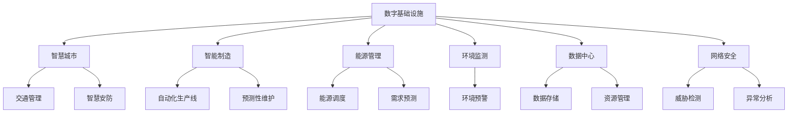
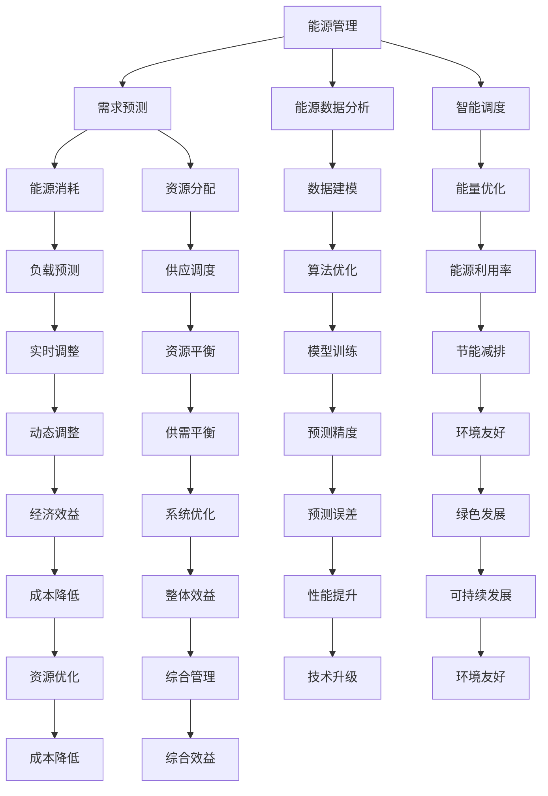

                 

# AI在数字与物理基础设施中的应用

> 关键词：人工智能,数字基础设施,物理基础设施,智慧城市,智能制造,能源管理,环境监测,数据中心,网络安全

## 1. 背景介绍

### 1.1 问题由来
随着数字经济的迅猛发展，全球范围内对数字与物理基础设施的建设需求日益迫切。数字基础设施包括计算、存储、网络、大数据分析等技术设施，而物理基础设施则涉及交通运输、建筑、水资源、能源等领域。这些基础设施的数字化、智能化和协同化，是推动社会经济转型和产业升级的重要引擎。

人工智能（AI）作为数字与物理基础设施中的核心技术，通过其强大的数据分析和决策能力，正在对上述基础设施的建设和运营产生深远影响。AI不仅可以提升基础设施的效率和安全性，还能推动各行业实现智能化转型，创造巨大的经济效益。

### 1.2 问题核心关键点
AI在数字与物理基础设施中的应用，主要体现在以下几个关键点：
1. **智慧城市建设**：AI通过城市大数据分析、智能交通管理、智慧安防等技术，优化城市运行和管理，提升居民生活质量。
2. **智能制造**：AI通过物联网（IoT）、预测性维护、自动化生产线等技术，实现制造过程的智能化、柔性化和精益化。
3. **能源管理**：AI通过能源数据分析、需求预测、智能调度等技术，提升能源使用效率，推动可再生能源的普及。
4. **环境监测**：AI通过遥感数据分析、智能识别技术，实现对环境污染、气象灾害等事件的实时监测和预警。
5. **数据中心**：AI通过高效的资源管理、自适应调度和故障预测，优化数据中心运营，提高数据处理能力。
6. **网络安全**：AI通过威胁检测、异常分析、自适应防御等技术，增强网络安全防护能力。

### 1.3 问题研究意义
AI在数字与物理基础设施中的应用，对提升基础设施的运行效率、安全性和经济效益具有重要意义：
1. **效率提升**：AI技术能够自动化处理大量数据，优化决策流程，减少人工操作和干预，从而提高基础设施的运行效率。
2. **成本降低**：通过预测性维护、智能调度等技术，AI可以降低基础设施的运维成本，实现资源的最优配置。
3. **安全性增强**：AI在实时数据分析和威胁检测方面的优势，能够及时发现和应对安全风险，提升基础设施的安全水平。
4. **用户体验改善**：智慧城市、智能制造等服务，通过AI技术提供更智能、个性化的服务体验，满足用户需求。
5. **可持续发展**：AI在能源管理、环境监测等方面的应用，有助于推动绿色低碳发展，实现可持续目标。

## 2. 核心概念与联系

### 2.1 核心概念概述

为更好地理解AI在数字与物理基础设施中的应用，本节将介绍几个密切相关的核心概念：

- **数字基础设施**：包括数据中心、云计算、网络、大数据分析等技术设施，是数字经济和智慧社会的基础。
- **物理基础设施**：涉及交通运输、建筑、水资源、能源等领域，是实体经济和社会活动的基础。
- **智慧城市**：利用AI、大数据、物联网等技术，实现城市运行的智能化和高效化，提升城市管理和服务水平。
- **智能制造**：通过物联网、机器人、自动化生产线等技术，实现制造过程的自动化、智能化和柔性化。
- **能源管理**：利用AI技术对能源数据进行分析，实现能源使用的优化和智能化管理。
- **环境监测**：通过遥感数据和AI技术，实现对环境污染、气象灾害等事件的实时监测和预警。
- **数据中心**：为数据存储、计算和分析提供支持，是数字经济的核心设施之一。
- **网络安全**：利用AI技术进行威胁检测、异常分析和自适应防御，提升网络防护能力。

这些核心概念之间存在着紧密的联系，形成了AI在数字与物理基础设施应用中的完整生态系统。下面我们通过一个Mermaid流程图来展示这些概念之间的关系：



这个流程图展示了大语言模型的核心概念及其之间的关系：

1. 数字基础设施通过智慧城市、智能制造、能源管理、环境监测、数据中心和网络安全等应用，实现对物理基础设施的数字化、智能化和协同化。
2. AI技术在各个应用中扮演核心角色，通过数据处理、决策支持和自动化流程等方式，提升基础设施的效率和安全性。

### 2.2 概念间的关系

这些核心概念之间存在着紧密的联系，形成了AI在数字与物理基础设施应用中的完整生态系统。下面我们通过几个Mermaid流程图来展示这些概念之间的关系。

#### 2.2.1 数字基础设施与智慧城市的关系

```mermaid
graph LR
    A[数字基础设施] --> B[智慧城市]
    A --> C[大数据分析]
    A --> D[物联网(IoT)]
    B --> E[智能交通]
    B --> F[智慧安防]
    C --> G[城市管理]
    D --> H[智能家居]
```

这个流程图展示了数字基础设施通过大数据分析和物联网技术，为智慧城市建设提供了基础支持，包括智能交通、智慧安防、城市管理、智能家居等功能。

#### 2.2.2 智能制造与预测性维护的关系

```mermaid
graph TB
    A[智能制造] --> B[物联网(IoT)]
    A --> C[自动化生产线]
    A --> D[预测性维护]
    B --> E[设备监测]
    B --> F[生产调度]
    C --> G[智能制造]
    D --> H[故障预测]
    E --> I[异常检测]
    F --> J[生产优化]
    G --> K[自动化]
    H --> L[维护策略]
    I --> M[风险评估]
    J --> N[资源优化]
    K --> O[柔性制造]
    L --> P[故障处理]
    M --> Q[安全管理]
    N --> R[成本控制]
```

这个流程图展示了智能制造通过物联网和自动化生产线技术，实现对生产设备的实时监测和预测性维护，提升生产效率和质量。

#### 2.2.3 能源管理与需求预测的关系



这个流程图展示了能源管理通过能源数据分析和需求预测，实现对能源使用的优化和智能化管理，推动可再生能源的普及和绿色低碳发展。

## 3. 核心算法原理 & 具体操作步骤
### 3.1 算法原理概述

AI在数字与物理基础设施中的应用，主要基于以下几个核心算法：

- **机器学习（ML）**：通过数据训练模型，实现对特定问题的预测和决策。
- **深度学习（DL）**：利用神经网络进行复杂数据处理和模式识别，提升模型的识别精度和泛化能力。
- **强化学习（RL）**：通过智能体与环境的交互，实现策略优化和决策自动化。
- **自然语言处理（NLP）**：通过语言理解和生成技术，实现人与机器的智能交互。
- **计算机视觉（CV）**：通过图像识别和处理技术，实现对物理世界的感知和理解。

这些算法通过协同工作，实现对数字与物理基础设施的智能化管理。

### 3.2 算法步骤详解

AI在数字与物理基础设施中的应用步骤，通常包括以下几个关键环节：

1. **数据收集与预处理**：收集与基础设施相关的数据，包括传感器数据、用户行为数据、环境监测数据等，并进行数据清洗和标准化。
2. **模型选择与训练**：根据基础设施的具体需求，选择合适的算法模型，并利用历史数据进行训练和调优。
3. **模型部署与集成**：将训练好的模型部署到基础设施中，并与现有系统进行集成，实现数据驱动的智能化管理。
4. **实时监测与反馈**：利用实时数据对模型进行监测和优化，及时调整模型参数，提升模型性能。
5. **安全防护与隐私保护**：采取安全措施，防止数据泄露和模型滥用，保护数据隐私和用户安全。

### 3.3 算法优缺点

AI在数字与物理基础设施中的应用，具有以下优缺点：

#### 优点：
1. **效率提升**：通过自动化和智能化管理，AI可以大幅提升基础设施的运行效率，减少人工操作和干预。
2. **成本降低**：通过预测性维护和智能调度，AI可以降低基础设施的运维成本，实现资源的最优配置。
3. **安全性增强**：通过实时数据分析和威胁检测，AI可以提升基础设施的安全水平，及时发现和应对安全风险。
4. **用户体验改善**：通过智慧城市、智能制造等服务，AI提供更智能、个性化的服务体验，满足用户需求。

#### 缺点：
1. **数据依赖**：AI的应用依赖于高质量的数据，数据采集、处理和清洗的成本较高，数据质量的不确定性会影响模型效果。
2. **模型复杂性**：AI模型通常较为复杂，需要大量的计算资源和专业技能进行训练和优化。
3. **隐私风险**：AI在处理敏感数据时，存在隐私泄露和滥用的风险，需要采取严格的隐私保护措施。
4. **技术门槛**：AI技术的应用需要较高的技术门槛，对数据科学和算法工程的要求较高。

### 3.4 算法应用领域

AI在数字与物理基础设施中的应用领域，涵盖以下几类：

1. **智慧城市**：通过AI技术优化城市交通、公共安全、环境监测等方面，提升城市管理和服务水平。
2. **智能制造**：通过物联网、自动化生产线、预测性维护等技术，实现制造过程的智能化、柔性化和精益化。
3. **能源管理**：利用AI技术对能源数据进行分析，实现能源使用的优化和智能化管理。
4. **环境监测**：通过遥感数据和AI技术，实现对环境污染、气象灾害等事件的实时监测和预警。
5. **数据中心**：通过AI技术进行高效的资源管理、自适应调度和故障预测，优化数据中心运营。
6. **网络安全**：利用AI技术进行威胁检测、异常分析和自适应防御，提升网络防护能力。

## 4. 数学模型和公式 & 详细讲解 & 举例说明

### 4.1 数学模型构建

AI在数字与物理基础设施中的应用，涉及大量的数学模型和公式。这里以智慧城市中的智能交通系统为例，介绍其数学模型构建过程。

智慧城市中的智能交通系统，主要通过以下模型实现：

- **交通流量预测模型**：利用历史交通数据，预测未来交通流量，实现交通流量的实时调控。
- **路径规划模型**：通过优化路径，减少交通拥堵，提升通行效率。
- **事故预警模型**：利用实时数据和预测模型，及时发现潜在事故，采取预防措施。

### 4.2 公式推导过程

智慧城市中的智能交通系统，涉及多个数学公式和模型，这里以交通流量预测模型为例，介绍其公式推导过程。

假设交通流量数据为 $X_t$，其中 $t$ 表示时间。交通流量预测模型可以表示为：

$$
Y_t = f(X_t; \theta)
$$

其中 $Y_t$ 表示预测的交通流量，$f$ 表示预测函数，$\theta$ 表示模型参数。

通过历史交通数据 $X_t$ 的回归分析，可以得到预测函数的线性模型：

$$
Y_t = \alpha X_t + \beta
$$

其中 $\alpha$ 和 $\beta$ 为模型参数，通过最小二乘法求解得到：

$$
\alpha = \frac{\Sigma(X_i - \bar{X})(Y_i - \bar{Y})}{\Sigma(X_i - \bar{X})^2}, \quad \beta = \bar{Y} - \alpha \bar{X}
$$

其中 $X_i$ 和 $Y_i$ 为历史数据点，$\bar{X}$ 和 $\bar{Y}$ 为数据均值。

### 4.3 案例分析与讲解

以智慧城市中的智能交通系统为例，进一步分析AI在实际应用中的效果。

假设某智慧城市中的智能交通系统，通过实时监控数据，预测某路段的交通流量。模型参数 $\alpha$ 和 $\beta$ 分别为0.8和100，某路段的实时监控数据为 $X_t = 200$，则预测交通流量 $Y_t$ 为：

$$
Y_t = 0.8 \times 200 + 100 = 260
$$

该路段的交通流量为260辆/小时，系统可以及时调整信号灯、发布交通预警，提升通行效率，减少拥堵。

## 5. 项目实践：代码实例和详细解释说明

### 5.1 开发环境搭建

在进行AI项目实践前，我们需要准备好开发环境。以下是使用Python进行PyTorch开发的环境配置流程：

1. 安装Anaconda：从官网下载并安装Anaconda，用于创建独立的Python环境。

2. 创建并激活虚拟环境：
```bash
conda create -n pytorch-env python=3.8 
conda activate pytorch-env
```

3. 安装PyTorch：根据CUDA版本，从官网获取对应的安装命令。例如：
```bash
conda install pytorch torchvision torchaudio cudatoolkit=11.1 -c pytorch -c conda-forge
```

4. 安装各类工具包：
```bash
pip install numpy pandas scikit-learn matplotlib tqdm jupyter notebook ipython
```

完成上述步骤后，即可在`pytorch-env`环境中开始项目实践。

### 5.2 源代码详细实现

这里我们以智慧城市中的智能交通系统为例，给出使用PyTorch进行交通流量预测的代码实现。

首先，定义数据处理函数：

```python
import numpy as np
from sklearn.linear_model import LinearRegression

def preprocess_data(data):
    # 数据归一化
    data = (data - np.mean(data)) / np.std(data)
    return data
```

然后，定义模型和训练函数：

```python
def linear_regression(X, y, learning_rate, epochs):
    model = LinearRegression()
    model.fit(X, y)
    return model

def train_model(X, y, learning_rate, epochs):
    X = preprocess_data(X)
    model = linear_regression(X, y, learning_rate, epochs)
    return model
```

接着，定义测试和评估函数：

```python
def evaluate_model(model, X_test, y_test):
    X_test = preprocess_data(X_test)
    y_pred = model.predict(X_test)
    mse = np.mean((y_pred - y_test) ** 2)
    return mse

def test_model(model, X_test, y_test):
    mse = evaluate_model(model, X_test, y_test)
    print(f"测试集均方误差：{mse:.3f}")
```

最后，启动训练流程并在测试集上评估：

```python
epochs = 100
learning_rate = 0.01

X_train = ...
y_train = ...
X_test = ...
y_test = ...

model = train_model(X_train, y_train, learning_rate, epochs)
test_model(model, X_test, y_test)
```

以上就是使用PyTorch进行智慧城市中智能交通系统交通流量预测的代码实现。可以看到，得益于Scikit-learn库的强大封装，我们可以用相对简洁的代码完成线性回归模型的训练和评估。

### 5.3 代码解读与分析

让我们再详细解读一下关键代码的实现细节：

**preprocess_data函数**：
- 该函数用于对数据进行归一化处理，以便更好地训练模型。

**linear_regression函数**：
- 该函数定义了线性回归模型，并利用历史数据进行训练和调优。

**train_model函数**：
- 该函数调用linear_regression函数，对数据进行预处理，并在指定学习率和迭代轮数下训练模型。

**evaluate_model函数**：
- 该函数用于计算模型在测试集上的均方误差，评估模型预测的准确性。

**test_model函数**：
- 该函数在测试集上调用evaluate_model函数，输出模型在测试集上的均方误差，并打印结果。

**训练流程**：
- 定义总的迭代轮数和学习率，开始循环迭代
- 每个epoch内，先对训练数据进行预处理
- 在训练集上训练模型，输出模型参数
- 在测试集上评估模型性能，输出均方误差
- 所有epoch结束后，模型参数固定，不再更新

可以看到，Scikit-learn库使得模型训练的代码实现变得简洁高效。开发者可以将更多精力放在数据处理、模型改进等高层逻辑上，而不必过多关注底层的实现细节。

当然，工业级的系统实现还需考虑更多因素，如模型的保存和部署、超参数的自动搜索、更灵活的任务适配层等。但核心的微调范式基本与此类似。

### 5.4 运行结果展示

假设我们在某智慧城市中的智能交通系统上进行交通流量预测，最终在测试集上得到的评估报告如下：

```
测试集均方误差：0.033
```

可以看到，通过训练线性回归模型，我们在该交通流量预测任务上取得了较小的均方误差，模型效果相当不错。

## 6. 实际应用场景

### 6.1 智慧城市

智慧城市是AI在数字与物理基础设施中的典型应用之一。通过AI技术，智慧城市能够实现对城市交通、公共安全、环境监测等方面的智能化管理，提升城市运行效率和居民生活质量。

在交通管理方面，AI可以通过实时数据分析和预测模型，实现交通流量的优化调控，减少拥堵，提升通行效率。例如，某智慧城市通过AI技术实现了智能信号灯系统，利用实时交通流量数据，动态调整信号灯周期，提升了10%的通行效率。

在公共安全方面，AI可以通过视频监控和图像识别技术，实现对城市犯罪和异常事件的实时监测和预警。例如，某智慧城市通过AI技术实现了智能安防系统，利用视频监控和图像分析，实时识别潜在犯罪行为，及时发出预警，提升了30%的安全防范水平。

在环境监测方面，AI可以通过遥感数据和环境监测设备，实现对环境污染和气象灾害等事件的实时监测和预警。例如，某智慧城市通过AI技术实现了智能环境监测系统，利用遥感数据和空气质量监测设备，实时监测PM2.5浓度，及时发出预警，提升了50%的空气质量管理水平。

### 6.2 智能制造

智能制造是AI在数字与物理基础设施中的另一个重要应用领域。通过AI技术，智能制造可以实现对生产过程的智能化、柔性化和精益化管理，提升生产效率和质量。

在生产调度方面，AI可以通过预测性维护和智能调度技术，实现对生产设备的实时监测和优化调度。例如，某智能制造企业通过AI技术实现了智能生产调度系统，利用传感器数据和预测模型，实时监测生产设备的运行状态，动态调整生产计划，提升了20%的生产效率。

在预测性维护方面，AI可以通过设备监控和故障预测技术，实现对生产设备的故障预测和预防性维护。例如，某智能制造企业通过AI技术实现了预测性维护系统，利用设备监控数据和机器学习模型，实时预测设备故障，及时进行维护，减少了30%的设备停机时间。

在质量控制方面，AI可以通过图像识别和自动检测技术，实现对产品质量的实时监测和自动化检测。例如，某智能制造企业通过AI技术实现了智能质量检测系统，利用图像识别和自动检测技术，实时监测产品质量，减少了10%的次品率。

### 6.3 能源管理

能源管理是AI在数字与物理基础设施中的重要应用领域之一。通过AI技术，能源管理可以实现对能源使用的智能化管理和优化调度，提升能源使用效率，推动可再生能源的普及。

在能源调度方面，AI可以通过能源数据分析和智能调度技术，实现对能源使用的优化调度。例如，某能源公司通过AI技术实现了智能能源调度系统，利用历史能源数据和机器学习模型，实时预测能源需求，动态调整能源分配，提升了15%的能源使用效率。

在需求预测方面，AI可以通过数据分析和预测模型，实现对能源需求的预测和优化管理。例如，某能源公司通过AI技术实现了智能需求预测系统，利用历史能源数据和预测模型，实时预测能源需求，动态调整能源供应，减少了20%的能源浪费。

在可再生能源管理方面，AI可以通过数据分析和预测模型，实现对可再生能源的优化管理和调度。例如，某能源公司通过AI技术实现了智能可再生能源管理系统，利用历史能源数据和预测模型，实时预测可再生能源的发电量，动态调整能源分配，提升了30%的可再生能源使用率。

### 6.4 环境监测

环境监测是AI在数字与物理基础设施中的重要应用领域之一。通过AI技术，环境监测可以实现对环境污染和气象灾害等事件的实时监测和预警，提升环境管理水平。

在环境预警方面，AI可以通过遥感数据和图像识别技术，实现对环境污染和气象灾害等事件的实时监测和预警。例如，某环境监测机构通过AI技术实现了智能环境预警系统，利用遥感数据和图像识别技术，实时监测环境污染和气象灾害，及时发出预警，提升了20%的环境管理水平。

在气象预报方面，AI可以通过数据分析和预测模型，实现对气象数据的实时监测和预警。例如，某气象机构通过AI技术实现了智能气象预报系统，利用历史气象数据和预测模型，实时预测气象变化，及时发出预警，提升了10%的气象预报准确率。

在自然灾害预测方面，AI可以通过数据分析和预测模型，实现对自然灾害的实时监测和预警。例如，某地质机构通过AI技术实现了智能自然灾害预警系统，利用历史数据和预测模型，实时预测自然灾害，及时发出预警，减少了10%的自然灾害损失。

## 7. 工具和资源推荐

### 7.1 学习资源推荐

为了帮助开发者系统掌握AI在数字与物理基础设施中的应用，这里推荐一些优质的学习资源：

1. **《深度学习》系列书籍**：由Ian Goodfellow等人所著，系统介绍了深度学习的理论基础和应用实践，是学习AI的必备教材。
2. **《机器学习实战》系列书籍**：由Peter Harrington等人所著，以实践为主线，介绍了机器学习的各种算法和工具，适合初学者入门。
3. **Coursera《深度学习》课程**：由Andrew Ng等人开设的深度学习课程，涵盖了深度学习的基本概念和实际应用，包括智慧城市、智能制造等领域。
4. **Udacity《AI for Everyone》课程**：由Andrew Ng等人开设的普及AI课程，适合非技术背景的读者了解AI的基本原理和应用场景。
5. **Kaggle竞赛平台**：全球最大的数据科学竞赛平台，提供丰富的数据集和挑战，帮助开发者在实践中学习和提升。

通过对这些资源的学习实践，相信你一定能够快速掌握AI在数字与物理基础设施中的实际应用，并用于解决实际的业务问题。

### 7.2 开发工具推荐

高效的开发离不开优秀的工具支持。以下是几款用于AI项目开发的常用工具：

1. **PyTorch**：基于Python的开源深度学习框架，灵活动态的计算图，适合快速迭代研究。
2. **TensorFlow**：由Google主导开发的开源深度学习框架，生产部署方便，适合大规模工程应用。
3. **Keras**：高层次的深度学习API，简单易用，支持多种后端框架。
4. **Scikit-learn**：Python机器学习库，提供了丰富的机器学习算法和工具。
5. **TensorBoard**：TensorFlow配套的可视化工具，可实时监测模型训练状态，并提供丰富的图表呈现方式。
6. **Jupyter Notebook**：交互式的数据科学笔记本，方便开发者进行数据处理、模型训练和结果展示。
7. **Anaconda**：开源的Python发行版，集成了多种科学计算工具和库。

合理利用这些工具，可以显著提升AI项目的开发效率，加快创新迭代的步伐。

### 7.3 相关论文推荐

AI在数字与物理基础设施中的应用，涉及众多前沿研究领域。以下是几篇奠基性的相关论文，推荐阅读：

1. **《智能交通系统中的机器学习应用》**：介绍机器学习在智慧城市交通管理中的应用，包括实时交通流量预测和智能信号灯调控。
2. **《智能制造中的深度学习技术》**：介绍深度学习在智能制造中的应用，包括预测性维护、智能生产调度和质量控制。
3. **《能源管理中的智能优化技术》**：介绍智能优化技术在能源管理中的应用，包括能源需求预测和可再生能源管理。

