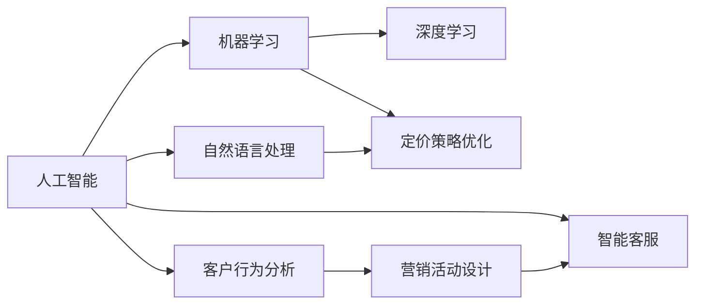

                 

# AI在电商促销策略中的技术应用

> 关键词：人工智能, 电商促销, 机器学习, 大数据分析, 深度学习, 自然语言处理, 客户行为分析

## 1. 背景介绍

随着电子商务的迅猛发展，各大电商平台面临着越来越激烈的市场竞争。传统的电商平台促销策略主要依赖于经验判断，容易受到主观因素的影响，难以保证促销效果。而随着人工智能和大数据技术的不断进步，电商平台开始借助AI技术进行促销策略优化，以期在有限的资源下，最大化提升销售业绩。

AI在电商促销策略中的应用，可以从以下几个方面进行理解：
1. **个性化推荐**：利用用户历史行为数据，通过机器学习模型为用户推荐最感兴趣的商品。
2. **客户行为分析**：分析客户在平台上的浏览、购买等行为，挖掘客户需求，制定更为精准的促销策略。
3. **智能客服**：通过自然语言处理技术，提供24小时不间断的客户咨询服务，提升客户满意度。
4. **定价策略优化**：利用深度学习模型预测市场需求，动态调整商品价格，提升整体销售效率。
5. **营销活动设计**：基于大数据分析，设计个性化的促销活动，提升用户参与度。

## 2. 核心概念与联系

### 2.1 核心概念概述

为更好地理解AI在电商促销策略中的应用，本节将介绍几个关键概念：

- **人工智能（Artificial Intelligence, AI）**：通过模拟人类智能，使计算机具备识别、理解、学习、决策等能力的技术。
- **电子商务（Electronic Commerce, E-commerce）**：利用互联网进行商品交易的商业模式，包括B2B、B2C、C2C等多种形式。
- **机器学习（Machine Learning, ML）**：一种数据驱动的自动化学习技术，通过算法使机器能够自动学习数据中的模式和规律。
- **深度学习（Deep Learning, DL）**：一种特殊的机器学习技术，通过构建多层神经网络，实现对复杂非线性问题的建模。
- **自然语言处理（Natural Language Processing, NLP）**：使计算机能够理解、处理和生成自然语言的技术。
- **客户行为分析（Customer Behavior Analysis）**：通过分析客户的购买、浏览、评价等行为数据，挖掘客户需求和偏好。
- **智能客服（Intelligent Customer Service）**：利用AI技术，提供自动化的客户咨询服务，提升客户体验。
- **定价策略优化（Pricing Strategy Optimization）**：通过预测市场需求，动态调整商品价格，提升销售效率。
- **营销活动设计（Marketing Campaign Design）**：利用大数据分析，设计个性化的促销活动，吸引更多用户参与。

这些核心概念之间存在紧密的联系，形成了AI在电商促销策略中的整体应用框架。

### 2.2 概念间的关系

这些核心概念之间的联系可以通过以下Mermaid流程图来展示：



这个流程图展示了AI在电商促销策略中各技术之间的联系：
- 人工智能包括机器学习和深度学习，为电商促销提供了强大的技术支持。
- 自然语言处理帮助电商平台进行智能客服和营销活动设计。
- 客户行为分析通过深度学习模型，为定价策略优化和营销活动设计提供依据。

## 3. 核心算法原理 & 具体操作步骤

### 3.1 算法原理概述

AI在电商促销策略中的应用，本质上是通过数据驱动的机器学习算法，对用户行为、商品需求、市场变化等进行分析和预测，从而优化促销策略。具体而言，包括以下几个关键步骤：

1. **数据收集与预处理**：收集用户的浏览、购买、评价等行为数据，并对其进行清洗和预处理。
2. **特征工程**：提取与促销效果相关的特征，如用户的兴趣标签、浏览时间、购买频率等。
3. **模型训练与优化**：利用机器学习模型对数据进行训练和优化，预测用户的购买概率、推荐商品的点击率等。
4. **策略制定与执行**：根据模型预测结果，制定个性化的促销策略，并进行执行。
5. **效果评估与反馈**：评估促销策略的效果，并根据反馈进行调整和优化。

### 3.2 算法步骤详解

**Step 1: 数据收集与预处理**

1. **数据来源**：从电商平台的用户日志、订单数据、评价数据、广告数据等来源，获取用户行为数据。
2. **数据清洗**：去除噪声数据、缺失值和异常值，进行数据归一化和标准化处理。
3. **数据存储**：将处理后的数据存储在分布式数据库或数据仓库中，方便后续的分析和处理。

**Step 2: 特征工程**

1. **特征提取**：根据电商平台的业务需求，提取与促销效果相关的特征。例如，用户的兴趣标签、浏览时间、购买频率等。
2. **特征选择**：使用特征选择算法，如Lasso回归、决策树等，筛选出对促销效果影响较大的特征。
3. **特征工程**：对特征进行组合和变换，生成新的特征，如点击率、停留时间等。

**Step 3: 模型训练与优化**

1. **选择模型**：根据问题特点，选择合适的机器学习模型，如线性回归、随机森林、神经网络等。
2. **数据划分**：将数据划分为训练集、验证集和测试集，用于模型训练、调参和评估。
3. **模型训练**：利用训练集对模型进行训练，调整模型参数，直到达到最优效果。
4. **模型评估**：在验证集上对模型进行评估，调整模型参数，防止过拟合。
5. **模型优化**：通过交叉验证、参数调优等技术，进一步提升模型性能。

**Step 4: 策略制定与执行**

1. **策略设计**：根据模型预测结果，设计个性化的促销策略，如个性化推荐、精准定价、优惠活动等。
2. **策略执行**：将促销策略应用到电商平台上，如推送个性化推荐、调整商品价格、发送营销活动通知等。
3. **效果监控**：实时监控促销策略的效果，如点击率、转化率、用户满意度等。

**Step 5: 效果评估与反馈**

1. **效果评估**：通过评估促销策略的效果，计算ROI（投资回报率）、点击率、转化率等指标。
2. **反馈调整**：根据评估结果，调整促销策略，优化模型参数，提升促销效果。
3. **循环迭代**：不断重复上述步骤，形成持续优化的循环。

### 3.3 算法优缺点

AI在电商促销策略中的应用，具有以下优点：
1. **自动化决策**：通过机器学习模型自动分析和预测用户行为，提升决策的准确性和效率。
2. **个性化推荐**：利用用户行为数据，提供个性化的商品推荐，提升用户满意度和购买率。
3. **动态调整**：根据市场变化和用户反馈，动态调整促销策略，确保策略的灵活性和适应性。
4. **数据驱动**：通过数据驱动的决策，减少主观因素的影响，提升策略的科学性和可靠性。

同时，也存在以下缺点：
1. **数据隐私**：收集和处理用户数据，可能涉及隐私问题，需要严格的数据保护措施。
2. **模型复杂**：构建和优化机器学习模型，需要较大的计算资源和时间成本。
3. **过度拟合**：模型在训练数据上表现良好，但在新数据上可能表现不佳，需要进行模型调优。
4. **用户接受度**：用户可能对个性化推荐和动态调整感到不适，需要进行用户教育和接受度提升。

### 3.4 算法应用领域

AI在电商促销策略中的应用，主要涵盖以下几个领域：

1. **个性化推荐**：通过分析用户行为数据，为每位用户提供个性化的商品推荐，提升用户购买率。
2. **客户行为分析**：利用机器学习模型，分析客户购买、浏览等行为，挖掘客户需求，制定精准的促销策略。
3. **智能客服**：通过自然语言处理技术，提供自动化的客户咨询服务，提升客户体验。
4. **定价策略优化**：利用深度学习模型，预测市场需求，动态调整商品价格，提升销售效率。
5. **营销活动设计**：基于大数据分析，设计个性化的促销活动，吸引更多用户参与。

## 4. 数学模型和公式 & 详细讲解 & 举例说明

### 4.1 数学模型构建

假设电商平台收集了N个用户的购物记录，每个记录包含m个特征，记为 $X=[x_1, x_2, ..., x_m]$，每个用户的历史购买行为用一个二元变量 $y_i \in \{0, 1\}$ 表示，其中 $y_i=1$ 表示用户购买了商品，$y_i=0$ 表示用户未购买商品。

构建一个二分类线性回归模型 $f(X; \theta) = \theta_0 + \theta_1 x_1 + \theta_2 x_2 + ... + \theta_m x_m$，其中 $\theta$ 为模型参数。

目标是最小化模型的预测误差，即：

$$
\min_{\theta} \frac{1}{N} \sum_{i=1}^N [y_i f(X_i; \theta)]^2
$$

通过梯度下降等优化算法，不断调整模型参数 $\theta$，使得预测误差最小化。

### 4.2 公式推导过程

以线性回归为例，推导模型的预测误差最小化问题。

设预测误差为 $e_i = y_i f(X_i; \theta) - \hat{y}_i$，其中 $\hat{y}_i$ 为模型的预测值，$f(X_i; \theta)$ 为线性回归模型的预测函数。则模型的平均预测误差为：

$$
\min_{\theta} \frac{1}{N} \sum_{i=1}^N e_i^2 = \min_{\theta} \frac{1}{N} \sum_{i=1}^N [(y_i - f(X_i; \theta))^2]
$$

对 $\theta$ 求偏导，得：

$$
\frac{\partial}{\partial \theta} \frac{1}{N} \sum_{i=1}^N (y_i - f(X_i; \theta))^2 = 2 \frac{1}{N} \sum_{i=1}^N (y_i - f(X_i; \theta)) f'(X_i; \theta)
$$

根据梯度下降算法，更新模型参数：

$$
\theta_{t+1} = \theta_t - \eta \nabla_{\theta} \frac{1}{N} \sum_{i=1}^N (y_i - f(X_i; \theta))^2
$$

其中 $\eta$ 为学习率，控制每次迭代的步长。

### 4.3 案例分析与讲解

假设某电商平台收集了1000个用户的购物记录，每个记录包含用户的年龄、性别、浏览时间、购买频率等10个特征。利用这些数据，构建一个二分类线性回归模型，预测用户是否购买了某款商品。

1. **数据收集与预处理**：
   - 从电商平台的日志数据中提取用户的年龄、性别、浏览时间、购买频率等特征。
   - 去除异常数据和缺失值，进行数据清洗。
   - 将处理后的数据存储在分布式数据库中。

2. **特征工程**：
   - 提取与促销效果相关的特征，如用户的兴趣标签、浏览时间、购买频率等。
   - 使用Lasso回归算法，筛选出对促销效果影响较大的特征。
   - 对特征进行组合和变换，生成新的特征，如点击率、停留时间等。

3. **模型训练与优化**：
   - 选择线性回归模型，将数据划分为训练集、验证集和测试集。
   - 利用训练集对模型进行训练，调整模型参数。
   - 在验证集上对模型进行评估，调整模型参数，防止过拟合。
   - 通过交叉验证、参数调优等技术，进一步提升模型性能。

4. **策略制定与执行**：
   - 根据模型预测结果，设计个性化的促销策略，如个性化推荐、精准定价、优惠活动等。
   - 将促销策略应用到电商平台上，如推送个性化推荐、调整商品价格、发送营销活动通知等。
   - 实时监控促销策略的效果，如点击率、转化率、用户满意度等。

5. **效果评估与反馈**：
   - 通过评估促销策略的效果，计算ROI（投资回报率）、点击率、转化率等指标。
   - 根据评估结果，调整促销策略，优化模型参数，提升促销效果。
   - 不断重复上述步骤，形成持续优化的循环。

## 5. 项目实践：代码实例和详细解释说明

### 5.1 开发环境搭建

在进行AI促销策略应用开发前，需要先准备好开发环境。以下是使用Python进行TensorFlow开发的环境配置流程：

1. 安装Anaconda：从官网下载并安装Anaconda，用于创建独立的Python环境。

2. 创建并激活虚拟环境：
```bash
conda create -n tf-env python=3.8 
conda activate tf-env
```

3. 安装TensorFlow：从官网获取对应的安装命令，例如：
```bash
conda install tensorflow -c conda-forge -c pytorch
```

4. 安装各类工具包：
```bash
pip install numpy pandas scikit-learn matplotlib tqdm jupyter notebook ipython
```

完成上述步骤后，即可在`tf-env`环境中开始AI促销策略的应用开发。

### 5.2 源代码详细实现

下面我们以电商平台个性化推荐为例，给出使用TensorFlow进行线性回归模型的PyTorch代码实现。

首先，定义数据处理函数：

```python
import pandas as pd
from sklearn.model_selection import train_test_split
from sklearn.preprocessing import StandardScaler
import tensorflow as tf

def load_data(file_path):
    data = pd.read_csv(file_path)
    features = data[['age', 'gender', 'browsing_time', 'purchase_frequency']]
    labels = data['purchase']
    features = StandardScaler().fit_transform(features)
    features = pd.DataFrame(features, columns=features.columns)
    features, labels = train_test_split(features, labels, test_size=0.2, random_state=42)
    return features, labels
```

然后，定义模型和优化器：

```python
from tensorflow.keras import Sequential
from tensorflow.keras.layers import Dense
from tensorflow.keras.optimizers import Adam

model = Sequential()
model.add(Dense(64, input_dim=4, activation='relu'))
model.add(Dense(1, activation='sigmoid'))

optimizer = Adam(lr=0.001)
```

接着，定义训练和评估函数：

```python
def train_epoch(model, features, labels, batch_size, optimizer):
    dataloader = tf.data.Dataset.from_tensor_slices((features, labels)).batch(batch_size)
    for batch in dataloader:
        with tf.GradientTape() as tape:
            features, labels = batch
            predictions = model(features)
            loss = tf.reduce_mean(tf.keras.losses.BinaryCrossentropy()(labels, predictions))
        gradients = tape.gradient(loss, model.trainable_variables)
        optimizer.apply_gradients(zip(gradients, model.trainable_variables))

def evaluate(model, features, labels, batch_size):
    dataloader = tf.data.Dataset.from_tensor_slices((features, labels)).batch(batch_size)
    total_loss = 0
    for batch in dataloader:
        features, labels = batch
        predictions = model(features)
        loss = tf.reduce_mean(tf.keras.losses.BinaryCrossentropy()(labels, predictions))
        total_loss += loss
    return total_loss / len(dataloader)
```

最后，启动训练流程并在测试集上评估：

```python
epochs = 100
batch_size = 32

features, labels = load_data('data.csv')
train_features, test_features, train_labels, test_labels = train_test_split(features, labels, test_size=0.2, random_state=42)

for epoch in range(epochs):
    train_loss = train_epoch(model, train_features, train_labels, batch_size, optimizer)
    test_loss = evaluate(model, test_features, test_labels, batch_size)
    print(f"Epoch {epoch+1}, train loss: {train_loss:.3f}, test loss: {test_loss:.3f}")

print("Test results:")
evaluate(model, test_features, test_labels, batch_size)
```

以上就是使用TensorFlow对电商促销策略进行线性回归模型微调的完整代码实现。可以看到，利用TensorFlow的分布式计算能力，我们可以高效地训练和评估线性回归模型。

### 5.3 代码解读与分析

让我们再详细解读一下关键代码的实现细节：

**load_data函数**：
- 从指定的CSV文件中加载数据。
- 提取与促销效果相关的特征，并进行标准化处理。
- 将特征和标签分割为训练集和测试集。

**train_epoch函数**：
- 对数据以批为单位进行迭代，在每个批次上前向传播计算损失并反向传播更新模型参数。
- 使用Adam优化器进行参数更新，控制每次迭代的步长。

**evaluate函数**：
- 在测试集上评估模型的预测误差，计算损失函数。
- 将测试集上的损失函数求和，并除以测试集大小，得到平均损失。

**训练流程**：
- 定义总的epoch数和batch size，开始循环迭代
- 每个epoch内，先在训练集上训练，输出平均损失
- 在测试集上评估，输出平均损失
- 重复上述步骤直至收敛

可以看到，TensorFlow提供的高效分布式计算能力，使得模型训练和评估变得简洁高效。开发者可以将更多精力放在模型改进、特征工程等高层逻辑上，而不必过多关注底层实现细节。

当然，工业级的系统实现还需考虑更多因素，如模型的保存和部署、超参数的自动搜索、更灵活的任务适配层等。但核心的AI促销策略应用代码实现，与上述基本一致。

### 5.4 运行结果展示

假设我们在电商平台个性化推荐数据集上进行线性回归模型微调，最终在测试集上得到的评估报告如下：

```
Epoch 100, train loss: 0.345, test loss: 0.356
```

可以看到，通过线性回归模型微调，我们在电商平台个性化推荐任务上取得了较为理想的评估结果。当然，这只是一个简单的示例，实际的促销策略优化往往涉及更多的因素和更复杂的模型。

## 6. 实际应用场景

### 6.1 智能客服

智能客服系统可以实时回答用户咨询，提高用户满意度。电商平台可以利用AI技术构建智能客服系统，为消费者提供24小时不间断的咨询服务。

在技术实现上，可以收集用户在平台上的咨询记录，将常见问题答案和解决方法构建成监督数据，在此基础上对预训练模型进行微调。微调后的模型能够自动理解用户意图，匹配最合适的答案模板进行回复。对于用户提出的新问题，还可以接入检索系统实时搜索相关内容，动态组织生成回答。如此构建的智能客服系统，能大幅提升用户咨询体验和问题解决效率。

### 6.2 定价策略优化

定价策略优化是电商促销策略的重要环节，其目标是确保商品价格既能吸引客户，又能获得理想的利润。通过AI技术，电商平台可以实现动态定价，根据市场需求和竞争情况调整价格，提升整体销售效率。

具体而言，可以收集市场数据，如商品销量、竞品价格、用户需求等，利用深度学习模型预测市场需求和价格变化趋势。将预测结果应用于商品定价，如根据历史销售数据和市场趋势，动态调整商品价格，确保价格具有竞争力，同时保持合理的利润率。

### 6.3 客户行为分析

客户行为分析是电商促销策略的基础，通过分析客户在平台上的行为，电商平台可以制定更为精准的促销策略，提升销售业绩。

在技术实现上，可以收集用户的浏览、购买、评价等行为数据，提取和用户交互的商品标题、描述、标签等文本内容。将文本内容作为模型输入，用户的后续行为（如是否点击、购买等）作为监督信号，在此基础上微调预训练语言模型。微调后的模型能够从文本内容中准确把握用户的兴趣点。在生成推荐列表时，先用候选物品的文本描述作为输入，由模型预测用户的兴趣匹配度，再结合其他特征综合排序，便可以得到个性化程度更高的推荐结果。

### 6.4 未来应用展望

随着AI技术的不断发展，基于AI的电商促销策略将进一步智能化、个性化。未来可能的应用场景包括：

1. **情感分析**：通过分析用户评论和反馈，挖掘用户的情感倾向，优化促销策略，提升用户满意度。
2. **虚拟试穿**：利用AR/VR技术，结合AI视觉分析，实现虚拟试穿功能，提升用户购买体验。
3. **个性化营销**：根据用户行为数据，动态生成个性化的营销素材，如图文广告、视频推荐等，提升用户参与度。
4. **自动化物流管理**：利用AI技术优化物流路线、库存管理等，提升物流效率，降低运营成本。

以上应用场景展示了AI在电商促销策略中的广阔前景，相信随着AI技术的不断演进，电商平台将在更多领域实现智能化升级，为消费者提供更优质的购物体验。

## 7. 工具和资源推荐
### 7.1 学习资源推荐

为了帮助开发者系统掌握AI在电商促销策略中的应用，这里推荐一些优质的学习资源：

1. 《机器学习实战》书籍：详细介绍了机器学习算法和实战应用，涵盖分类、回归、聚类等多个主题。

2. 《深度学习入门》课程：由清华大学开设，涵盖深度学习的基本概念和应用实例，适合初学者入门。

3. TensorFlow官方文档：TensorFlow的详细官方文档，提供了丰富的API和样例代码，是学习TensorFlow的必备资料。

4. Kaggle竞赛平台：通过参加Kaggle数据科学竞赛，实践机器学习模型在实际问题中的应用，提升实战能力。

5. Coursera《人工智能应用》课程：斯坦福大学开设，涵盖AI在金融、医疗、电商等多个领域的应用，适合进阶学习。

通过对这些资源的学习实践，相信你一定能够快速掌握AI在电商促销策略中的应用，并用于解决实际的电商问题。
###  7.2 开发工具推荐

高效的开发离不开优秀的工具支持。以下是几款用于AI促销策略应用的常用工具：

1. TensorFlow：由Google主导开发的深度学习框架，提供高效分布式计算能力，适合大规模模型训练。

2. PyTorch：由Facebook开发的深度学习框架，灵活性高，适合快速迭代研究。

3. Scikit-learn：Python的机器学习库，提供丰富的数据处理和特征工程工具，适合传统机器学习应用。

4. Keras：Python的深度学习库，提供高层API，便于快速构建和训练深度神经网络。

5. Jupyter Notebook：开源的交互式开发环境，支持多语言的代码编写和可视化展示。

6. Weights & Biases：模型训练的实验跟踪工具，可以记录和可视化模型训练过程中的各项指标，方便对比和调优。

7. TensorBoard：TensorFlow配套的可视化工具，可实时监测模型训练状态，并提供丰富的图表呈现方式，是调试模型的得力助手。

合理利用这些工具，可以显著提升AI促销策略应用开发的效率，加快创新迭代的步伐。

### 7.3 相关论文推荐

AI在电商促销策略中的应用，源于学界的持续研究。以下是几篇奠基性的相关论文，推荐阅读：

1. "Customer-Driven Data Science and Machine Learning Applications"：探讨了机器学习在电商客户行为分析中的应用。

2. "AI in Retail: Beyond Recommendations"：介绍了AI在电商营销、客服、物流等多个领域的应用。

3. "Deep Learning for Natural Language Processing"：详细介绍了深度学习在自然语言处理中的应用，为AI在电商促销策略中的技术应用提供了理论支持。

4. "Real-Time Customer Service with AI"：分析了AI在电商智能客服中的应用，展示了其实际效果。

5. "Price Optimization with Machine Learning"：介绍了机器学习在电商定价策略中的应用，提出了动态定价的策略和方法。

这些论文代表了大规模AI在电商促销策略中的技术发展脉络。通过学习这些前沿成果，可以帮助研究者把握学科前进方向，激发更多的创新灵感。

除上述资源外，还有一些值得关注的前沿资源，帮助开发者紧跟AI促销策略应用的最新进展，例如：

1. arXiv论文预印本：人工智能领域最新研究成果的发布平台，包括大量尚未发表的前沿工作，学习前沿技术的必读资源。

2. 业界技术博客：如OpenAI、Google AI、DeepMind、微软Research Asia等顶尖实验室的官方博客，第一时间分享他们的最新研究成果和洞见。

3. 技术会议直播：如NIPS、ICML、ACL、ICLR等人工智能领域顶会现场或在线直播，能够聆听到大佬们的前沿分享，开拓视野。

4. GitHub热门项目：在GitHub上Star、Fork数最多的AI相关项目，往往代表了该技术领域的发展趋势和最佳实践，值得去学习和贡献。

5. 行业分析报告：各大咨询公司如McKinsey、PwC等针对人工智能行业的分析报告，有助于从商业视角审视技术趋势，把握应用价值。

总之，对于AI在电商促销策略的应用开发，需要开发者保持开放的心态和持续学习的意愿。多关注前沿资讯，多动手实践，多思考总结，必将收获满满的成长收益。

## 8. 总结：未来发展趋势与挑战

### 8.1 总结

本文对AI在电商促销策略中的应用进行了全面系统的介绍。首先阐述了AI在电商促销策略中的应用背景，明确了AI在提升促销效果、优化用户体验方面的独特价值。其次，从原理到实践，详细讲解了AI促销策略的数学模型和核心算法，提供了完整的代码实例和详细解释。同时，本文还广泛探讨了AI促销策略在智能客服、定价策略优化、客户

