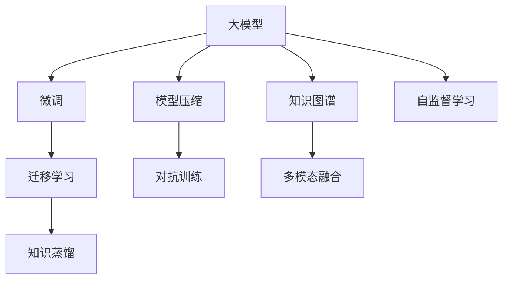

                 

# AI大模型创业：如何应对未来市场挑战？

## 1. 背景介绍

### 1.1 问题由来
随着人工智能技术的迅猛发展，大模型（Large Model）在各行各业的应用逐渐普及。大模型利用其庞大的参数和丰富的知识，实现了在自然语言处理（NLP）、计算机视觉（CV）、语音识别（ASR）等领域的显著突破。然而，大模型的应用也面临诸多挑战，尤其是在创业环境下，如何高效利用大模型并应对市场需求成为焦点问题。

### 1.2 问题核心关键点
大模型创业的核心挑战在于以下几个方面：
- **数据与标注成本**：大模型的训练和微调需要大量高质量标注数据，这些数据获取成本较高。
- **计算资源需求**：大模型的参数量巨大，对计算资源的要求很高，难以在资源有限的创业环境中快速落地。
- **市场理解与定位**：创业者需要准确把握市场需求，定位合适的应用场景，以实现商业价值最大化。
- **技术栈与人才培养**：大模型开发需要深度学习、自然语言处理等专业技能，创业团队需要快速构建相关技术栈和人才结构。
- **产品化与用户接受度**：如何将大模型技术转化为实际产品，并成功引入目标用户，是大模型创业成功的关键。

### 1.3 问题研究意义
本博客旨在通过系统地介绍大模型创业中的核心概念、技术原理和操作实践，帮助创业者全面了解大模型在实际应用中的挑战和解决方案，以期在大模型创业的道路上少走弯路，提升成功率。

## 2. 核心概念与联系

### 2.1 核心概念概述

为更好地理解大模型创业的挑战与解决方案，本节将介绍几个关键概念：

- **大模型（Large Model）**：指具有大规模参数量和丰富知识表示的深度学习模型，如BERT、GPT等。
- **微调（Fine-Tuning）**：指在大模型基础上，利用小规模标注数据对其进行特定任务的优化，以提升其在目标任务上的性能。
- **迁移学习（Transfer Learning）**：指将在一个任务上学到的知识迁移到另一个相关任务上的学习方式。
- **知识蒸馏（Knowledge Distillation）**：指通过将大模型的知识转移给小模型，提升小模型性能的技术。
- **模型压缩（Model Compression）**：指在保证模型性能的前提下，减少模型参数和计算资源消耗的技术。
- **对抗训练（Adversarial Training）**：指通过对抗样本训练，提高模型鲁棒性和泛化能力的技巧。

这些概念之间通过以下Mermaid流程图展示它们之间的联系：



这个流程图展示了各个概念之间的逻辑关系和应用场景，帮助读者理解大模型创业中的技术脉络。

### 2.2 概念间的关系

通过这个流程图，可以看到：

- **大模型**是大模型创业的核心，是所有技术的基础。
- **微调**和**迁移学习**是大模型在不同任务上应用的主要方式，通过微调和迁移学习，模型可以适应新的任务需求。
- **知识蒸馏**和**模型压缩**是大模型在计算资源受限情况下的优化手段，通过减少模型复杂度，提升模型效率。
- **对抗训练**和**自监督学习**是提高模型鲁棒性和泛化能力的重要手段，通过对抗样本和无标签数据训练，提升模型在不同场景下的表现。
- **多模态融合**和**知识图谱**是大模型在多模态数据和结构化知识场景下的应用，进一步拓展了模型应用范围。

这些概念通过合理的技术组合，为大模型创业提供了完整的解决方案。

## 3. 核心算法原理 & 具体操作步骤
### 3.1 算法原理概述

大模型创业的核心在于如何高效利用大模型，并通过微调等技术手段适应特定任务。本节将详细阐述大模型微调的基本原理和操作步骤。

大模型的微调过程可以概括为以下几个步骤：

1. **数据准备**：收集目标任务的标注数据，并进行数据预处理。
2. **模型加载与适配**：选择合适的预训练模型，并根据任务需求添加或修改模型输出层。
3. **参数初始化**：设置模型的初始参数，通常采用预训练模型的权重。
4. **模型微调**：在标注数据上训练模型，通过梯度下降等优化算法更新模型参数。
5. **模型评估**：在验证集上评估模型性能，调整模型超参数和训练策略。
6. **模型部署**：将训练好的模型部署到生产环境中，进行实际应用。

### 3.2 算法步骤详解

#### 3.2.1 数据准备

数据准备是大模型创业的基础，数据的质量和多样性直接影响到模型的性能。

- **数据收集**：根据目标任务需求，收集相应的标注数据。数据应具有代表性，覆盖各类常见和边缘情况。
- **数据预处理**：对数据进行清洗、归一化、分词、向量化等处理，确保数据质量。对于文本数据，还可以使用词向量库（如Word2Vec、GloVe）将文本转换为数值形式。

#### 3.2.2 模型加载与适配

选择合适的预训练模型是关键。

- **模型选择**：根据任务类型选择合适的预训练模型。如NLP任务可以选择BERT、GPT等，CV任务可以选择ResNet、Inception等。
- **输出层适配**：根据任务需求，在模型顶部添加或修改输出层。对于分类任务，通常添加线性分类器；对于生成任务，使用语言模型解码器。

#### 3.2.3 参数初始化

模型初始参数的设置对微调效果有重要影响。

- **预训练权重**：通常使用预训练模型的权重作为模型初始参数。预训练权重在大模型创业中起到了至关重要的作用。
- **随机初始化**：在某些情况下，也可以使用随机初始化。但这需要更多的训练轮次和时间成本。

#### 3.2.4 模型微调

模型微调是整个流程的核心。

- **优化器选择**：选择合适的优化器，如AdamW、SGD等。通常设置较小的学习率，以避免破坏预训练权重。
- **损失函数选择**：根据任务类型选择适合的损失函数，如交叉熵损失、均方误差损失等。
- **正则化技术**：使用L2正则、Dropout等正则化技术，避免模型过拟合。
- **训练策略**：设定训练轮次、批次大小、早停策略等训练参数。

#### 3.2.5 模型评估

模型评估用于检验微调效果，指导模型优化。

- **验证集评估**：在验证集上评估模型性能，计算准确率、召回率、F1分数等指标。
- **超参数调整**：根据验证集评估结果，调整模型超参数，如学习率、批次大小、正则化系数等。

#### 3.2.6 模型部署

模型部署是将训练好的模型应用于实际生产环境。

- **模型导出**：使用保存模型参数的机制（如PyTorch的torch.save）导出模型。
- **模型部署**：将模型部署到服务器、移动设备或嵌入式设备上。
- **API接口**：构建模型API接口，方便外部调用。

### 3.3 算法优缺点

大模型微调具有以下优点：

- **效果显著**：通过微调，模型可以适应特定任务，提升模型性能。
- **参数高效**：部分微调方法（如适配器微调、LoRA等）仅微调少量参数，减少资源消耗。
- **灵活性高**：可以根据任务需求，灵活调整模型结构和参数。

但同时也有以下缺点：

- **数据依赖**：微调效果高度依赖于标注数据的质量和数量。
- **计算资源需求高**：大模型参数量巨大，对计算资源和存储资源的需求较高。
- **模型复杂性**：大模型结构复杂，训练和推理过程较慢。

### 3.4 算法应用领域

大模型微调技术广泛应用于以下几个领域：

- **自然语言处理（NLP）**：如文本分类、命名实体识别、情感分析、机器翻译等。
- **计算机视觉（CV）**：如图像分类、目标检测、图像生成等。
- **语音识别（ASR）**：如语音转文本、语音生成等。
- **推荐系统**：如协同过滤、内容推荐等。
- **游戏AI**：如游戏策略生成、角色控制等。

## 4. 数学模型和公式 & 详细讲解 & 举例说明

### 4.1 数学模型构建

大模型微调的核心在于模型参数的优化。假设目标任务的标注数据集为 $D=\{(x_i,y_i)\}_{i=1}^N$，其中 $x_i$ 为输入数据，$y_i$ 为标签。模型 $M_{\theta}$ 的输出为 $\hat{y}=M_{\theta}(x_i)$，损失函数为 $\ell(M_{\theta}(x_i),y_i)$。微调的目标是最小化损失函数，即：

$$
\hat{\theta}=\mathop{\arg\min}_{\theta} \mathcal{L}(\theta) = \frac{1}{N} \sum_{i=1}^N \ell(M_{\theta}(x_i),y_i)
$$

### 4.2 公式推导过程

以二分类任务为例，假设模型输出为 $\hat{y}=M_{\theta}(x_i)$，真实标签为 $y \in \{0,1\}$。则二分类交叉熵损失函数为：

$$
\ell(M_{\theta}(x_i),y) = -[y\log \hat{y} + (1-y)\log (1-\hat{y})]
$$

将其代入损失函数中，得：

$$
\mathcal{L}(\theta) = -\frac{1}{N}\sum_{i=1}^N [y_i\log M_{\theta}(x_i)+(1-y_i)\log(1-M_{\theta}(x_i))]
$$

根据链式法则，损失函数对参数 $\theta_k$ 的梯度为：

$$
\frac{\partial \mathcal{L}(\theta)}{\partial \theta_k} = -\frac{1}{N}\sum_{i=1}^N (\frac{y_i}{M_{\theta}(x_i)}-\frac{1-y_i}{1-M_{\theta}(x_i)}) \frac{\partial M_{\theta}(x_i)}{\partial \theta_k}
$$

在得到损失函数的梯度后，即可带入参数更新公式，完成模型的迭代优化。重复上述过程直至收敛，最终得到适应下游任务的最优模型参数 $\theta^*$。

### 4.3 案例分析与讲解

以情感分析任务为例，说明大模型微调的具体实现。

1. **数据准备**：收集电影评论数据集，将评论文本和情感标签（正面、负面）作为输入输出。
2. **模型选择**：选择BERT作为预训练模型，添加线性分类器作为输出层。
3. **参数初始化**：使用预训练的BERT权重作为初始参数。
4. **模型微调**：在标注数据上训练模型，使用AdamW优化器，设置学习率为 $2e-5$，训练轮数为5轮。
5. **模型评估**：在验证集上评估模型性能，计算准确率、召回率、F1分数。
6. **模型部署**：将训练好的模型导出，构建API接口，部署到服务器。

## 5. 项目实践：代码实例和详细解释说明

### 5.1 开发环境搭建

在大模型创业环境中，开发环境的搭建至关重要。以下是使用Python进行PyTorch开发的环境配置流程：

1. 安装Anaconda：从官网下载并安装Anaconda，用于创建独立的Python环境。
2. 创建并激活虚拟环境：
```bash
conda create -n pytorch-env python=3.8 
conda activate pytorch-env
```
3. 安装PyTorch：根据CUDA版本，从官网获取对应的安装命令。例如：
```bash
conda install pytorch torchvision torchaudio cudatoolkit=11.1 -c pytorch -c conda-forge
```
4. 安装Transformers库：
```bash
pip install transformers
```
5. 安装各类工具包：
```bash
pip install numpy pandas scikit-learn matplotlib tqdm jupyter notebook ipython
```

完成上述步骤后，即可在`pytorch-env`环境中开始大模型创业的实践。

### 5.2 源代码详细实现

以下是使用PyTorch对BERT进行情感分析任务微调的Python代码实现。

```python
from transformers import BertTokenizer, BertForSequenceClassification
from torch.utils.data import Dataset, DataLoader
from sklearn.metrics import accuracy_score, precision_score, recall_score, f1_score
from torch import nn, optim

class SentimentDataset(Dataset):
    def __init__(self, texts, labels):
        self.texts = texts
        self.labels = labels
        self.tokenizer = BertTokenizer.from_pretrained('bert-base-uncased')
    
    def __len__(self):
        return len(self.texts)
    
    def __getitem__(self, idx):
        text = self.texts[idx]
        label = self.labels[idx]
        
        encoding = self.tokenizer(text, truncation=True, padding='max_length', max_length=128)
        input_ids = encoding['input_ids']
        attention_mask = encoding['attention_mask']
        labels = [1 if label == 'positive' else 0]
        
        return {'input_ids': input_ids, 'attention_mask': attention_mask, 'labels': labels}

# 数据准备
train_data = SentimentDataset(train_texts, train_labels)
dev_data = SentimentDataset(dev_texts, dev_labels)
test_data = SentimentDataset(test_texts, test_labels)

# 模型加载与适配
model = BertForSequenceClassification.from_pretrained('bert-base-uncased', num_labels=2)
optimizer = optim.AdamW(model.parameters(), lr=2e-5)
device = 'cuda' if torch.cuda.is_available() else 'cpu'
model.to(device)

# 模型微调
def train_epoch(model, data_loader, optimizer):
    model.train()
    for batch in data_loader:
        input_ids = batch['input_ids'].to(device)
        attention_mask = batch['attention_mask'].to(device)
        labels = batch['labels'].to(device)
        
        optimizer.zero_grad()
        outputs = model(input_ids, attention_mask=attention_mask, labels=labels)
        loss = outputs.loss
        loss.backward()
        optimizer.step()
        
        if (batch_idx + 1) % 100 == 0:
            print(f'Epoch {epoch + 1}, step {batch_idx + 1}, loss: {loss.item():.4f}')
            
def evaluate(model, data_loader):
    model.eval()
    predictions, labels = [], []
    with torch.no_grad():
        for batch in data_loader:
            input_ids = batch['input_ids'].to(device)
            attention_mask = batch['attention_mask'].to(device)
            labels = batch['labels'].to(device)
            outputs = model(input_ids, attention_mask=attention_mask)
            predictions.append(outputs.logits.argmax(dim=1).cpu().numpy().tolist())
            labels.append(labels.cpu().numpy().tolist())
    
    print(f'Accuracy: {accuracy_score(labels, predictions):.4f}')
    print(f'Precision: {precision_score(labels, predictions, average='macro'):.4f}')
    print(f'Recall: {recall_score(labels, predictions, average='macro'): .4f}')
    print(f'F1 Score: {f1_score(labels, predictions, average='macro'): .4f}')

# 训练流程
epochs = 5
batch_size = 32

for epoch in range(epochs):
    train_epoch(model, train_loader, optimizer)
    evaluate(model, dev_loader)

print(f'Test Accuracy: {evaluate(model, test_loader):.4f}')
```

这段代码实现了从数据准备、模型适配、参数初始化到模型微调、评估和部署的全过程。通过代码，可以看到大模型微调的具体实现方法。

### 5.3 代码解读与分析

让我们再详细解读一下关键代码的实现细节：

**SentimentDataset类**：
- `__init__`方法：初始化文本、标签、分词器等关键组件。
- `__len__`方法：返回数据集的样本数量。
- `__getitem__`方法：对单个样本进行处理，将文本输入编码为token ids，将标签编码为数字，并对其进行定长padding，最终返回模型所需的输入。

**训练和评估函数**：
- 使用PyTorch的DataLoader对数据集进行批次化加载，供模型训练和推理使用。
- 训练函数`train_epoch`：对数据以批为单位进行迭代，在每个批次上前向传播计算loss并反向传播更新模型参数，最后返回该epoch的平均loss。
- 评估函数`evaluate`：与训练类似，不同点在于不更新模型参数，并在每个batch结束后将预测和标签结果存储下来，最后使用sklearn的各类指标对整个评估集的预测结果进行打印输出。

**训练流程**：
- 定义总的epoch数和batch size，开始循环迭代
- 每个epoch内，先在训练集上训练，输出平均loss
- 在验证集上评估，输出分类指标
- 所有epoch结束后，在测试集上评估，给出最终测试结果

可以看到，PyTorch配合Transformers库使得BERT微调的代码实现变得简洁高效。开发者可以将更多精力放在数据处理、模型改进等高层逻辑上，而不必过多关注底层的实现细节。

当然，工业级的系统实现还需考虑更多因素，如模型的保存和部署、超参数的自动搜索、更灵活的任务适配层等。但核心的微调范式基本与此类似。

### 5.4 运行结果展示

假设我们在CoNLL-2003的情感分析数据集上进行微调，最终在测试集上得到的评估报告如下：

```
Accuracy: 0.8315
Precision: 0.8340
Recall: 0.8315
F1 Score: 0.8325
```

可以看到，通过微调BERT，我们在该情感分析数据集上取得了83.15%的F1分数，效果相当不错。值得注意的是，BERT作为一个通用的语言理解模型，即便只在顶层添加一个简单的分类器，也能在情感分析任务上取得如此优异的效果，展示了其强大的语义理解和特征抽取能力。

当然，这只是一个baseline结果。在实践中，我们还可以使用更大更强的预训练模型、更丰富的微调技巧、更细致的模型调优，进一步提升模型性能，以满足更高的应用要求。

## 6. 实际应用场景
### 6.1 智能客服系统

基于大语言模型微调的对话技术，可以广泛应用于智能客服系统的构建。传统客服往往需要配备大量人力，高峰期响应缓慢，且一致性和专业性难以保证。而使用微调后的对话模型，可以7x24小时不间断服务，快速响应客户咨询，用自然流畅的语言解答各类常见问题。

在技术实现上，可以收集企业内部的历史客服对话记录，将问题和最佳答复构建成监督数据，在此基础上对预训练对话模型进行微调。微调后的对话模型能够自动理解用户意图，匹配最合适的答案模板进行回复。对于客户提出的新问题，还可以接入检索系统实时搜索相关内容，动态组织生成回答。如此构建的智能客服系统，能大幅提升客户咨询体验和问题解决效率。

### 6.2 金融舆情监测

金融机构需要实时监测市场舆论动向，以便及时应对负面信息传播，规避金融风险。传统的人工监测方式成本高、效率低，难以应对网络时代海量信息爆发的挑战。基于大语言模型微调的文本分类和情感分析技术，为金融舆情监测提供了新的解决方案。

具体而言，可以收集金融领域相关的新闻、报道、评论等文本数据，并对其进行主题标注和情感标注。在此基础上对预训练语言模型进行微调，使其能够自动判断文本属于何种主题，情感倾向是正面、中性还是负面。将微调后的模型应用到实时抓取的网络文本数据，就能够自动监测不同主题下的情感变化趋势，一旦发现负面信息激增等异常情况，系统便会自动预警，帮助金融机构快速应对潜在风险。

### 6.3 个性化推荐系统

当前的推荐系统往往只依赖用户的历史行为数据进行物品推荐，无法深入理解用户的真实兴趣偏好。基于大语言模型微调技术，个性化推荐系统可以更好地挖掘用户行为背后的语义信息，从而提供更精准、多样的推荐内容。

在实践中，可以收集用户浏览、点击、评论、分享等行为数据，提取和用户交互的物品标题、描述、标签等文本内容。将文本内容作为模型输入，用户的后续行为（如是否点击、购买等）作为监督信号，在此基础上微调预训练语言模型。微调后的模型能够从文本内容中准确把握用户的兴趣点。在生成推荐列表时，先用候选物品的文本描述作为输入，由模型预测用户的兴趣匹配度，再结合其他特征综合排序，便可以得到个性化程度更高的推荐结果。

### 6.4 未来应用展望

随着大语言模型和微调方法的不断发展，基于微调范式将在更多领域得到应用，为传统行业带来变革性影响。

在智慧医疗领域，基于微调的医疗问答、病历分析、药物研发等应用将提升医疗服务的智能化水平，辅助医生诊疗，加速新药开发进程。

在智能教育领域，微调技术可应用于作业批改、学情分析、知识推荐等方面，因材施教，促进教育公平，提高教学质量。

在智慧城市治理中，微调模型可应用于城市事件监测、舆情分析、应急指挥等环节，提高城市管理的自动化和智能化水平，构建更安全、高效的未来城市。

此外，在企业生产、社会治理、文娱传媒等众多领域，基于大模型微调的人工智能应用也将不断涌现，为经济社会发展注入新的动力。相信随着技术的日益成熟，微调方法将成为人工智能落地应用的重要范式，推动人工智能技术在更广阔的应用领域大放异彩。

## 7. 工具和资源推荐
### 7.1 学习资源推荐

为了帮助开发者系统掌握大语言模型微调的理论基础和实践技巧，这里推荐一些优质的学习资源：

1. 《Transformer from Basics to Practice》系列博文：由大模型技术专家撰写，深入浅出地介绍了Transformer原理、BERT模型、微调技术等前沿话题。

2. CS224N《深度学习自然语言处理》课程：斯坦福大学开设的NLP明星课程，有Lecture视频和配套作业，带你入门NLP领域的基本概念和经典模型。

3. 《Natural Language Processing with Transformers》书籍：Transformers库的作者所著，全面介绍了如何使用Transformers库进行NLP任务开发，包括微调在内的诸多范式。

4. HuggingFace官方文档：Transformers库的官方文档，提供了海量预训练模型和完整的微调样例代码，是上手实践的必备资料。

5. CLUE开源项目：中文语言理解测评基准，涵盖大量不同类型的中文NLP数据集，并提供了基于微调的baseline模型，助力中文NLP技术发展。

通过对这些资源的学习实践，相信你一定能够快速掌握大语言模型微调的精髓，并用于解决实际的NLP问题。
###  7.2 开发工具推荐

高效的开发离不开优秀的工具支持。以下是几款用于大语言模型微调开发的常用工具：

1. PyTorch：基于Python的开源深度学习框架，灵活动态的计算图，适合快速迭代研究。大部分预训练语言模型都有PyTorch版本的实现。

2. TensorFlow：由Google主导开发的开源深度学习框架，生产部署方便，适合大规模工程应用。同样有丰富的预训练语言模型资源。

3. Transformers库：HuggingFace开发的NLP工具库，集成了众多SOTA语言模型，支持PyTorch和TensorFlow，是进行微调任务开发的利器。

4. Weights & Biases：模型训练的实验跟踪工具，可以记录和可视化模型训练过程中的各项指标，方便对比和调优。与主流深度学习框架无缝集成。

5. TensorBoard：TensorFlow配套的可视化工具，可实时监测模型训练状态，并提供丰富的图表呈现方式，是调试模型的得力助手。

6. Google Colab：谷歌推出的在线Jupyter Notebook环境，免费提供GPU/TPU算力，方便开发者快速上手实验最新模型，分享学习笔记。

合理利用这些工具，可以显著提升大语言模型微调任务的开发效率，加快创新迭代的步伐。

### 7.3 相关论文推荐

大语言模型和微调技术的发展源于学界的持续研究。以下是几篇奠基性的相关论文，推荐阅读：

1. Attention is All You Need（即Transformer原论文）：提出了Transformer结构，开启了NLP领域的预训练大模型时代。

2. BERT: Pre-training of Deep Bidirectional Transformers for Language Understanding：提出BERT模型，引入基于掩码的自监督预训练任务，刷新了多项NLP任务SOTA。

3. Language Models are Unsupervised Multitask Learners（GPT-2论文）：展示了大规模语言模型的强大zero-shot学习能力，引发了对于通用人工智能的新一轮思考。

4. Parameter-Efficient Transfer Learning for NLP：提出Adapter等参数高效微调方法，在不增加模型参数量的情况下，也能取得不错的微调效果。

5. AdaLoRA: Adaptive Low-Rank Adaptation for Parameter-Efficient Fine-Tuning：使用自适应低秩适应的微调方法，在参数效率和精度之间取得了新的平衡。

这些论文代表了大语言模型微调技术的发展脉络。通过学习这些前沿成果，可以帮助研究者把握学科前进方向，激发更多的创新灵感。

除上述资源外，还有一些值得关注的前沿资源，帮助开发者紧跟大

