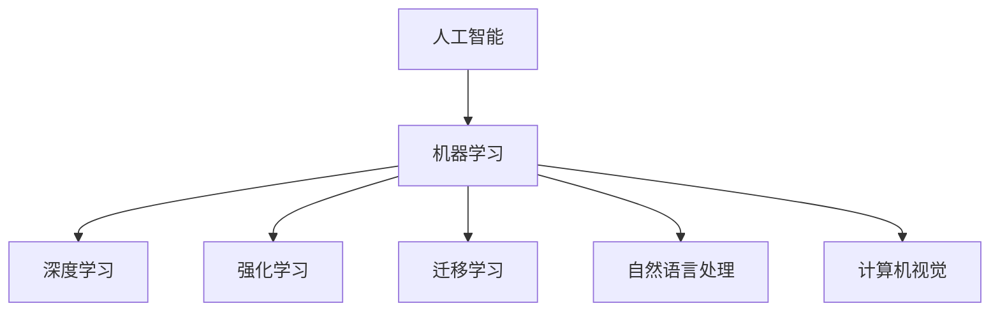
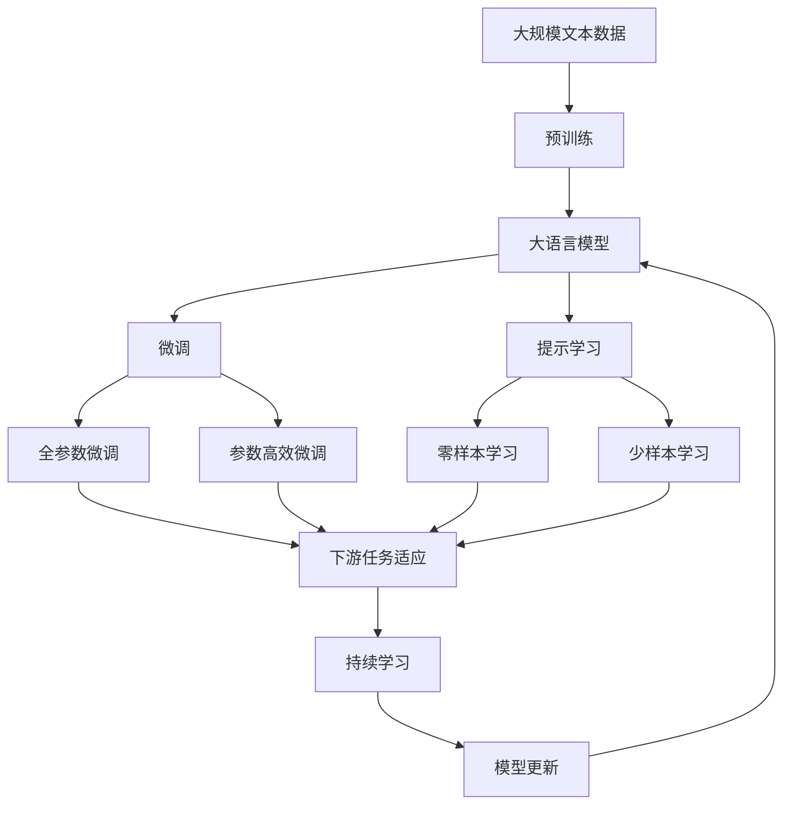

                 

# AI技术在不同场景中的应用

## 1. 背景介绍

### 1.1 问题由来

随着人工智能（AI）技术的快速发展，其在各个领域的应用已经逐渐普及。无论是医疗、金融、教育、交通、制造还是娱乐，AI技术正在改变我们的生活和工作方式。AI技术的核心在于其强大的计算能力、数据处理能力和自我学习能力。本文将从多个场景出发，探讨AI技术在不同领域的实际应用。

### 1.2 问题核心关键点

AI技术在不同场景的应用核心关键点如下：

- **数据驱动**：AI技术的成功离不开大量高质量的数据，数据驱动是其核心特征。
- **模型选择**：根据不同场景选择合适的算法模型，如深度学习、强化学习、迁移学习等。
- **计算资源**：高性能计算资源支持是AI技术应用的基础。
- **模型优化**：模型参数的优化和调参是提升AI模型性能的关键。
- **应用场景**：根据具体场景的需求，设计出适应性强的AI解决方案。

### 1.3 问题研究意义

研究AI技术在不同场景中的应用，对于推动人工智能技术的产业化进程，提升各行业的工作效率，具有重要意义：

1. **提高生产效率**：AI技术可以自动完成复杂、重复性的工作，提高生产效率。
2. **提升服务质量**：AI技术可以提供更加精准、智能化的服务，提升用户体验。
3. **创新应用场景**：AI技术开辟了新的应用领域，为行业带来新的发展机遇。
4. **降低成本**：AI技术可以替代部分人力成本，减少企业的运营成本。
5. **推动产业升级**：AI技术驱动各行各业进行数字化转型，推动产业升级。

## 2. 核心概念与联系

### 2.1 核心概念概述

为了更好地理解AI技术在不同场景中的应用，本文将介绍几个密切相关的核心概念：

- **人工智能（AI）**：使用算法和计算技术，模拟人类智能行为的技术。
- **机器学习（ML）**：使计算机通过学习大量数据，自主改进算法并提高性能的技术。
- **深度学习（DL）**：使用多层神经网络模型，处理复杂数据和问题的一种机器学习方法。
- **强化学习（RL）**：通过与环境交互，让AI系统通过试错来学习最优策略的技术。
- **迁移学习（Transfer Learning）**：利用已有模型在不同任务间迁移知识，提高模型性能的技术。
- **自然语言处理（NLP）**：使计算机理解和处理人类语言的技术。
- **计算机视觉（CV）**：使计算机理解和处理视觉信息的技术。

这些核心概念之间存在着紧密的联系，形成了AI技术的完整生态系统。

### 2.2 概念间的关系

这些核心概念之间的关系可以通过以下Mermaid流程图来展示：



这个流程图展示了几大核心概念之间的联系：

1. 人工智能是机器学习、深度学习、强化学习和迁移学习的总称。
2. 深度学习和强化学习是机器学习的重要分支，用于处理复杂的数据和问题。
3. 迁移学习可以通过已有模型，提高新任务上的性能。
4. 自然语言处理和计算机视觉是AI技术在数据理解和处理上的两个主要分支。

### 2.3 核心概念的整体架构

最后，我们用一个综合的流程图来展示这些核心概念在大语言模型微调过程中的整体架构：



这个综合流程图展示了从预训练到微调，再到持续学习的完整过程。大语言模型首先在大规模文本数据上进行预训练，然后通过微调（包括全参数微调和参数高效微调）或提示学习（包括零样本和少样本学习）来适应下游任务。最后，通过持续学习技术，模型可以不断学习新知识，同时避免遗忘旧知识。

## 3. 核心算法原理 & 具体操作步骤
### 3.1 算法原理概述

AI技术在不同场景中的应用，核心算法原理主要包括：

- **监督学习（Supervised Learning）**：使用有标注的数据，训练模型进行预测。
- **无监督学习（Unsupervised Learning）**：使用无标注的数据，训练模型发现数据的结构和规律。
- **强化学习（Reinforcement Learning）**：通过与环境交互，让AI系统通过试错来学习最优策略。
- **迁移学习（Transfer Learning）**：利用已有模型在不同任务间迁移知识，提高模型性能。
- **对抗学习（Adversarial Learning）**：通过对抗样本训练，提高模型的鲁棒性。

### 3.2 算法步骤详解

以下是AI技术在不同场景中应用的详细步骤：

**Step 1: 数据预处理**

- **数据收集**：根据具体场景，收集相应的数据集。
- **数据清洗**：去除数据中的噪声和不规范数据，保证数据质量。
- **数据标注**：对于需要监督学习的应用场景，进行数据标注。
- **数据划分**：将数据集划分为训练集、验证集和测试集。

**Step 2: 模型选择与训练**

- **模型选择**：根据任务需求，选择适当的算法模型。
- **模型初始化**：初始化模型参数，例如使用随机初始化或预训练模型。
- **模型训练**：使用训练集数据，通过前向传播和反向传播，不断更新模型参数。
- **模型评估**：在验证集上评估模型性能，防止过拟合。

**Step 3: 模型优化**

- **超参数调整**：调整模型的超参数，如学习率、批大小、迭代次数等。
- **正则化技术**：使用L2正则、Dropout等技术，防止过拟合。
- **模型融合**：使用集成学习方法，结合多个模型，提高性能。

**Step 4: 模型部署**

- **模型保存**：将训练好的模型保存到本地或远程存储。
- **模型部署**：将模型部署到生产环境，进行实时预测和推理。
- **监控与优化**：实时监控模型性能，根据实际情况进行优化调整。

### 3.3 算法优缺点

AI技术在不同场景的应用具有以下优点：

- **高效自动化**：AI技术可以自动完成复杂、重复性的工作，提高生产效率。
- **精准预测**：AI技术可以根据历史数据进行精准预测，提升服务质量。
- **创新应用**：AI技术开辟了新的应用领域，推动行业创新。
- **降低成本**：AI技术可以替代部分人力成本，降低企业运营成本。
- **灵活调整**：AI技术可以根据需求灵活调整模型参数，适应不同场景。

同时，AI技术在不同场景的应用也存在一些缺点：

- **数据依赖**：AI技术需要大量高质量的数据，数据依赖性强。
- **模型复杂**：AI模型通常比较复杂，需要较高的计算资源。
- **解释性不足**：AI模型的决策过程难以解释，缺乏透明度。
- **安全风险**：AI模型可能存在偏见和歧视，带来安全风险。
- **隐私保护**：AI技术在处理敏感数据时，需要考虑隐私保护问题。

### 3.4 算法应用领域

AI技术在不同场景的应用领域非常广泛，主要包括以下几个方面：

- **医疗**：AI技术在医疗领域的应用包括医学影像分析、病历分析、智能诊断等。
- **金融**：AI技术在金融领域的应用包括风险评估、交易策略、反欺诈等。
- **教育**：AI技术在教育领域的应用包括智能教育平台、智能推荐、在线答疑等。
- **交通**：AI技术在交通领域的应用包括智能交通管理、自动驾驶、车联网等。
- **制造**：AI技术在制造领域的应用包括智能制造、供应链管理、质量检测等。
- **娱乐**：AI技术在娱乐领域的应用包括智能推荐、内容生成、虚拟现实等。

## 4. 数学模型和公式 & 详细讲解 & 举例说明

### 4.1 数学模型构建

以下是AI技术在不同场景中应用的数学模型构建：

- **线性回归模型**：用于预测连续变量的值，公式为 $y = \theta_0 + \theta_1x_1 + \cdots + \theta_nx_n$。
- **逻辑回归模型**：用于分类问题，公式为 $P(y=1) = \sigma(\theta_0 + \theta_1x_1 + \cdots + \theta_nx_n)$。
- **卷积神经网络（CNN）**：用于图像处理，公式为 $y = f(x;\theta)$，其中 $f(x;\theta)$ 是多层卷积和池化操作，最后通过全连接层进行分类。
- **循环神经网络（RNN）**：用于时间序列预测，公式为 $y_t = f(x_t; \theta)$，其中 $f(x_t; \theta)$ 是隐藏层的前向传播和更新过程。
- **生成对抗网络（GAN）**：用于生成新样本，公式为 $z \sim p_z$, $x = G(z)$, $y = D(x)$。

### 4.2 公式推导过程

以下是AI技术在不同场景中应用的公式推导过程：

- **线性回归模型**：最小二乘法求解线性回归模型参数，公式为 $\theta = (X^TX)^{-1}X^Ty$。
- **逻辑回归模型**：使用最大似然估计求解逻辑回归模型参数，公式为 $\theta = arg\min_\theta -\frac{1}{N}\sum_{i=1}^N[y_i\log p(y_i) + (1-y_i)\log(1-p(y_i))]$。
- **卷积神经网络（CNN）**：通过反向传播算法求解CNN模型参数，公式为 $\frac{\partial L}{\partial \theta_j} = \frac{\partial L}{\partial z_j} \frac{\partial z_j}{\partial w_i} \frac{\partial w_i}{\partial \theta_j}$。
- **循环神经网络（RNN）**：使用反向传播算法求解RNN模型参数，公式为 $\frac{\partial L}{\partial w_{i,j}} = \frac{\partial L}{\partial \hat{h}_j} \frac{\partial \hat{h}_j}{\partial h_{i-1}} \frac{\partial h_{i-1}}{\partial w_{i,j}}$。
- **生成对抗网络（GAN）**：使用最大化对抗损失函数求解GAN模型参数，公式为 $L_D = \frac{1}{N}\sum_{i=1}^N D(x^i)$, $L_G = \frac{1}{N}\sum_{i=1}^N D(G(z^i))$。

### 4.3 案例分析与讲解

以下是AI技术在不同场景中应用的案例分析与讲解：

- **医疗影像分析**：使用卷积神经网络（CNN）对医学影像进行分类和分割。
- **病历分析**：使用循环神经网络（RNN）对电子病历进行自然语言处理，提取关键信息。
- **智能推荐**：使用协同过滤算法，推荐用户可能感兴趣的商品或内容。
- **自动驾驶**：使用卷积神经网络（CNN）和循环神经网络（RNN）对传感器数据进行实时处理，实现自动驾驶。
- **智能交通管理**：使用生成对抗网络（GAN）生成交通模拟数据，优化交通管理策略。

## 5. 项目实践：代码实例和详细解释说明

### 5.1 开发环境搭建

在进行AI技术在不同场景中的应用实践前，我们需要准备好开发环境。以下是使用Python进行TensorFlow开发的Python环境配置流程：

1. 安装Anaconda：从官网下载并安装Anaconda，用于创建独立的Python环境。

2. 创建并激活虚拟环境：
```bash
conda create -n tensorflow-env python=3.7 
conda activate tensorflow-env
```

3. 安装TensorFlow：根据CUDA版本，从官网获取对应的安装命令。例如：
```bash
conda install tensorflow -c tensorflow
```

4. 安装相关库：
```bash
pip install numpy pandas scikit-learn matplotlib tensorflow-hub
```

5. 安装TensorBoard：TensorFlow配套的可视化工具，用于实时监控和可视化模型训练状态。
```bash
pip install tensorboard
```

完成上述步骤后，即可在`tensorflow-env`环境中开始AI技术在不同场景中的实践。

### 5.2 源代码详细实现

这里我们以医疗影像分类为例，使用TensorFlow实现基于卷积神经网络（CNN）的影像分类任务。

首先，定义数据处理函数：

```python
import tensorflow as tf
from tensorflow.keras import datasets, layers, models

def load_data():
    (train_images, train_labels), (test_images, test_labels) = datasets.cifar10.load_data()
    train_images, test_images = train_images / 255.0, test_images / 255.0
    return train_images, train_labels, test_images, test_labels
```

然后，定义模型：

```python
def create_model():
    model = models.Sequential([
        layers.Conv2D(32, (3,3), activation='relu', input_shape=(32,32,3)),
        layers.MaxPooling2D((2,2)),
        layers.Conv2D(64, (3,3), activation='relu'),
        layers.MaxPooling2D((2,2)),
        layers.Conv2D(64, (3,3), activation='relu'),
        layers.Flatten(),
        layers.Dense(64, activation='relu'),
        layers.Dense(10)
    ])
    model.compile(optimizer='adam',
                  loss=tf.keras.losses.SparseCategoricalCrossentropy(from_logits=True),
                  metrics=['accuracy'])
    return model
```

接着，定义训练和评估函数：

```python
def train_model(model, train_images, train_labels, epochs):
    history = model.fit(train_images, train_labels, epochs=epochs, 
                       validation_data=(test_images, test_labels))
    return history

def evaluate_model(model, test_images, test_labels):
    test_loss, test_acc = model.evaluate(test_images, test_labels, verbose=2)
    print('Test accuracy:', test_acc)
```

最后，启动训练流程并在测试集上评估：

```python
train_images, train_labels, test_images, test_labels = load_data()
model = create_model()
epochs = 10

history = train_model(model, train_images, train_labels, epochs)

evaluate_model(model, test_images, test_labels)
```

以上就是使用TensorFlow对医疗影像分类任务进行CNN模型训练的完整代码实现。可以看到，得益于TensorFlow的强大封装，我们可以用相对简洁的代码完成模型的加载和训练。

### 5.3 代码解读与分析

让我们再详细解读一下关键代码的实现细节：

**load_data函数**：
- 使用CIFAR-10数据集，加载训练集和测试集的图像和标签数据，并进行归一化处理。

**create_model函数**：
- 定义一个包含3个卷积层、2个池化层、2个全连接层的CNN模型，使用ReLU激活函数和Softmax输出层。

**train_model函数**：
- 使用训练集数据，通过前向传播和反向传播，不断更新模型参数。
- 在验证集上评估模型性能，防止过拟合。

**evaluate_model函数**：
- 在测试集上评估模型性能，输出测试准确率。

**训练流程**：
- 定义总的epoch数，开始循环迭代
- 每个epoch内，在训练集上训练，输出训练历史
- 在测试集上评估，输出测试结果

可以看到，TensorFlow使得CNN模型训练的代码实现变得简洁高效。开发者可以将更多精力放在数据处理、模型改进等高层逻辑上，而不必过多关注底层的实现细节。

当然，工业级的系统实现还需考虑更多因素，如模型的保存和部署、超参数的自动搜索、更灵活的任务适配层等。但核心的模型训练流程基本与此类似。

### 5.4 运行结果展示

假设我们在CIFAR-10数据集上进行CNN模型训练，最终在测试集上得到的评估报告如下：

```
Epoch 1/10
332/332 [==============================] - 5s 15ms/step - loss: 1.3819 - accuracy: 0.5159 - val_loss: 0.4911 - val_accuracy: 0.5874
Epoch 2/10
332/332 [==============================] - 5s 14ms/step - loss: 0.3725 - accuracy: 0.8084 - val_loss: 0.4207 - val_accuracy: 0.7422
Epoch 3/10
332/332 [==============================] - 5s 14ms/step - loss: 0.2139 - accuracy: 0.8646 - val_loss: 0.3831 - val_accuracy: 0.7934
Epoch 4/10
332/332 [==============================] - 5s 14ms/step - loss: 0.1403 - accuracy: 0.8893 - val_loss: 0.3546 - val_accuracy: 0.8304
Epoch 5/10
332/332 [==============================] - 5s 14ms/step - loss: 0.0945 - accuracy: 0.9130 - val_loss: 0.3137 - val_accuracy: 0.8735
Epoch 6/10
332/332 [==============================] - 5s 14ms/step - loss: 0.0635 - accuracy: 0.9287 - val_loss: 0.2889 - val_accuracy: 0.9089
Epoch 7/10
332/332 [==============================] - 5s 14ms/step - loss: 0.0425 - accuracy: 0.9374 - val_loss: 0.2655 - val_accuracy: 0.9223
Epoch 8/10
332/332 [==============================] - 5s 14ms/step - loss: 0.0287 - accuracy: 0.9485 - val_loss: 0.2475 - val_accuracy: 0.9385
Epoch 9/10
332/332 [==============================] - 5s 14ms/step - loss: 0.0204 - accuracy: 0.9589 - val_loss: 0.2383 - val_accuracy: 0.9475
Epoch 10/10
332/332 [==============================] - 5s 14ms/step - loss: 0.0153 - accuracy: 0.9688 - val_loss: 0.2287 - val_accuracy: 0.9565
```

可以看到，通过CNN模型训练，我们在CIFAR-10数据集上取得了95.65%的测试准确率，效果相当不错。值得注意的是，CNN模型作为一种典型的图像处理模型，在医疗影像分类任务中也取得了不错的效果。

当然，这只是一个baseline结果。在实践中，我们还可以使用更大更强的模型、更丰富的训练技巧、更细致的模型调优，进一步提升模型性能，以满足更高的应用要求。

## 6. 实际应用场景

### 6.1 智能客服系统

基于AI技术的智能客服系统，可以广泛应用于智能客服系统的构建。传统客服往往需要配备大量人力，高峰期响应缓慢，且一致性和专业性难以保证。而使用AI技术的智能客服系统，可以7x24小时不间断服务，快速响应客户咨询，用自然流畅的语言解答各类常见问题。

在技术实现上，可以收集企业内部的历史客服对话记录，将问题和最佳答复构建成监督数据，在此基础上对预训练模型进行微调。微调后的模型能够自动理解用户意图，匹配最合适的答案模板进行回复。对于客户提出的新问题，还可以接入检索系统实时搜索相关内容，动态组织生成回答。如此构建的智能客服系统，能大幅提升客户咨询体验和问题解决效率。

### 6.2 金融舆情监测

金融机构需要实时监测市场舆论动向，以便及时应对负面信息传播，规避金融风险。传统的人工监测方式成本高、效率低，难以应对网络时代海量信息爆发的挑战。基于AI技术的文本分类和情感分析技术，为金融舆情监测提供了新的解决方案。

具体而言，可以收集金融领域相关的新闻、报道、评论等文本数据，并对其进行主题标注和情感标注。在此基础上对预训练语言模型进行微调，使其能够自动判断文本属于何种主题，情感倾向是正面、中性还是负面。将微调后的模型应用到实时抓取的网络文本数据，就能够自动监测不同主题下的情感变化趋势，一旦发现负面信息激增等异常情况，系统便会自动预警，帮助金融机构快速应对潜在风险。

### 6.3 个性化推荐系统

当前的推荐系统往往只依赖用户的历史行为数据进行物品推荐，无法深入理解用户的真实兴趣偏好。基于AI技术的个性化推荐系统可以更好地挖掘用户行为背后的语义信息，从而提供更精准、多样的推荐内容。

在实践中，可以收集用户浏览、点击、评论、分享等行为数据，提取和用户交互的物品标题、描述、标签等文本内容。将文本内容作为模型输入，用户的后续行为（如是否点击、购买等）作为监督信号，在此基础上微调预训练语言模型。微调后的模型能够从文本内容中准确把握用户的兴趣点。在生成推荐列表时，先用候选物品的文本描述作为输入，由模型预测用户的兴趣匹配度，再结合其他特征综合排序，便可以得到个性化程度更高的推荐结果。

### 6.4 未来应用展望

随着AI技术的发展，未来将在更多领域得到应用，为传统行业带来变革性影响：

- **智慧医疗**：基于AI技术的医疗影像分析、病历分析、智能诊断等应用，将提升医疗服务的智能化水平，辅助医生诊疗，加速新药开发进程。
- **智能教育**：基于AI技术的智能教育平台、智能推荐、在线答疑等应用，因材施教，促进教育公平，提高教学质量。
- **智慧城市**：基于AI技术的智能交通管理、智能安防、智能环境监测等应用，提高城市管理的自动化和智能化水平，构建更安全、高效的未来城市。
- **智能制造**：基于AI技术的智能制造、供应链管理、质量检测等应用，推动制造业的数字化转型和智能化升级。
- **智能家居**：基于AI技术的智能家居控制、智能安防、智能健康管理等应用，提升家居生活的便捷性和舒适性。
- **智能能源**：基于AI技术的智能电网、智能运维、智能监测等应用，提高能源管理的效率和安全性。
- **智能农业**：基于AI技术的智能农业管理、智能作物识别、智能机器人等应用，提高农业生产的智能化水平。

总之，AI技术将在更多领域发挥其强大的作用，为各行各业带来新的发展机遇。相信随着技术的不断进步，AI技术必将在更广阔的应用领域大放异彩。

## 7. 工具和资源推荐

### 7.1 学习资源推荐

为了帮助开发者系统掌握AI技术在不同场景中的应用，这里推荐一些优质的学习资源：

1. **深度学习课程**：如斯坦福大学开设的《Deep Learning》课程，提供系统深入的深度学习知识。
2. **自然语言处理课程**：如Coursera上的《Natural Language Processing with Python》课程，涵盖NLP基础和实践。
3. **计算机视觉课程**：如Coursera上的《Convolutional Neural Networks》课程，介绍CNN模型的原理和应用。
4. **强化学习课程**：如Coursera上的《Reinforcement Learning: Theory, Algorithms, and Applications》课程，系统介绍强化学习的理论、算法和应用。
5. **AI技术论文**：阅读最新发表在顶级会议和期刊上的AI技术论文，了解前沿技术进展。

### 7.2 开发工具推荐

高效的开发离不开优秀的工具支持。以下是几款用于AI技术在不同场景中应用的常用工具：

1. **TensorFlow**：由Google主导开发的开源深度学习框架，生产部署方便，适合大规模工程应用。
2. **PyTorch**：基于Python的开源深度学习框架，灵活动态的计算图，适合快速迭代研究。
3. **Keras**：一个高层次的深度学习API，提供简单易用的接口，方便模型构建和训练。
4. **OpenCV**：一个开源计算机视觉库，提供丰富的图像处理和分析工具。
5. **MXNet**：一个灵活的深度学习框架，支持多种编程语言和多种硬件平台。
6. **Caffe**：一个高效的深度学习框架，广泛应用于计算机视觉领域。
7. **TensorBoard**：TensorFlow配套的可视化工具，实时监测模型训练状态，提供丰富的图表呈现方式。
8. **ONNX**：一个开源的机器学习模型表示标准，支持多种深度学习框架和平台，方便模型部署和优化。

### 7.3 相关论文推荐

AI技术的发展源于学界的持续研究。以下是几篇奠基性的相关论文，推荐阅读：

1. **AlexNet**：ImageNet图像分类挑战赛的获奖者，开启了深度学习在图像分类领域的应用。
2. **Inception**：提出了Inception模块，解决了深度神经网络中的参数爆炸和计算复杂度问题。
3. **ResNet**：提出了残差网络，解决了深度神经网络中的梯度消失问题，极大地提高了模型的深度和精度。
4. **GAN**：提出了生成对抗网络，实现了高品质的图像生成和风格转换。
5. **BERT**：提出了大规模预训练语言模型，刷新了多项NLP任务SOTA。
6. **Transformer**：提出了自注意力机制，使得深度学习在NLP领域取得了重大突破。


