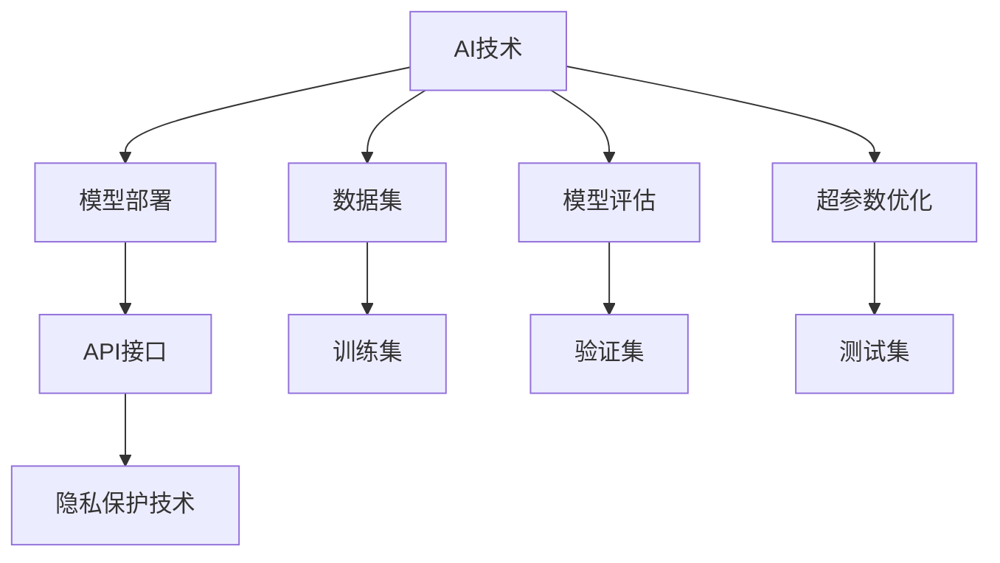
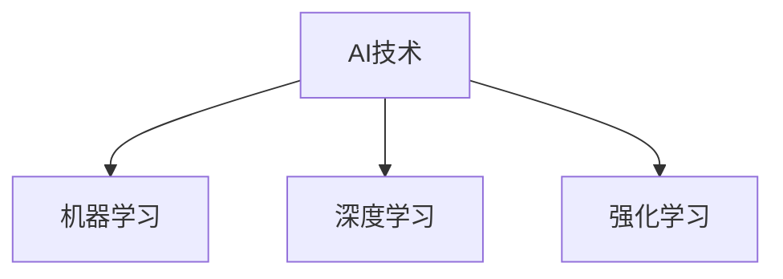
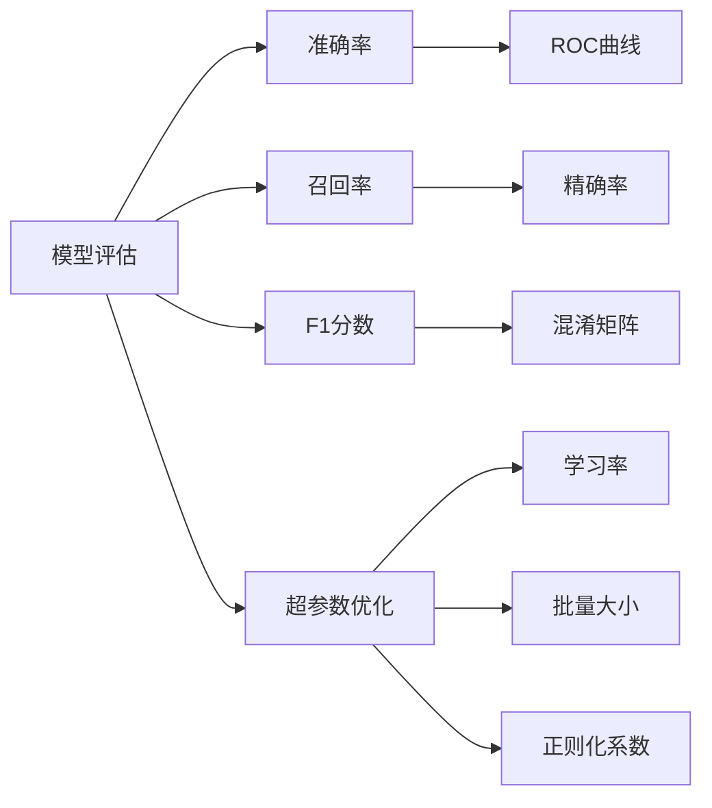
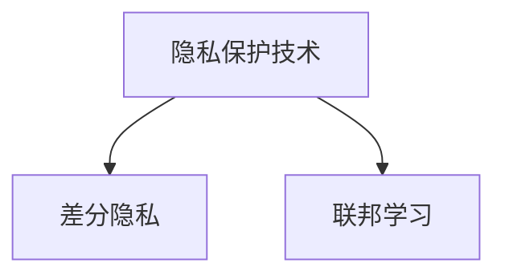
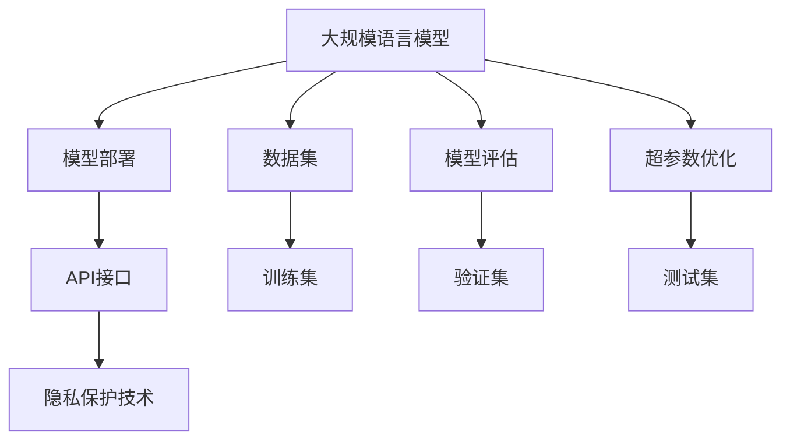

                 

# AI技术在实际应用中的前景

## 1. 背景介绍

### 1.1 问题由来

随着人工智能（AI）技术的不断发展和成熟，AI在各行各业的应用前景愈发广阔。从自动驾驶汽车到智能客服，从金融风险预测到医疗诊断，AI正在逐步改变我们的生产生活方式。然而，AI技术的实际应用也面临着诸多挑战，如模型性能的不稳定性、数据隐私保护、系统安全性等。

### 1.2 问题核心关键点

1. **模型性能的稳定性**：AI模型在实际应用中能否保持稳定的性能，尤其是在实时性、准确性、鲁棒性等方面。
2. **数据隐私保护**：如何在保证AI系统性能的同时，保障用户数据的隐私和安全性。
3. **系统安全性**：如何确保AI系统的安全性和可靠性，避免恶意攻击和数据泄露。
4. **模型可解释性**：AI模型在应用中是否具备足够的可解释性，以便于用户理解和信任。

### 1.3 问题研究意义

研究AI技术在实际应用中的前景，对于推动AI技术的落地应用，提升各行各业的智能化水平，具有重要意义：

1. **降低应用开发成本**：利用AI技术自动化业务流程，减少人力和物力投入。
2. **提升系统性能**：通过优化算法和模型，提升系统的实时性、准确性和鲁棒性。
3. **保障数据隐私**：采用先进的数据加密和隐私保护技术，保障用户数据安全。
4. **增强系统安全性**：构建安全可靠的AI系统，防止恶意攻击和数据泄露。
5. **提高模型可解释性**：开发具备可解释性的AI模型，提高用户对系统的信任度。

## 2. 核心概念与联系

### 2.1 核心概念概述

为更好地理解AI技术在实际应用中的前景，本节将介绍几个密切相关的核心概念：

- **AI技术**：包括机器学习（ML）、深度学习（DL）、强化学习（RL）等，用于构建智能系统。
- **数据集**：AI模型训练所需的数据集，包括训练集、验证集和测试集。
- **模型评估**：通过各种指标（如准确率、召回率、F1分数等）评估AI模型的性能。
- **超参数优化**：通过调整模型超参数（如学习率、批量大小、正则化系数等），优化模型性能。
- **模型部署**：将训练好的AI模型部署到实际应用中，供用户调用。
- **API接口**：用于系统与其他应用程序交互的接口，方便集成和使用。
- **隐私保护技术**：如差分隐私、联邦学习等，保障用户数据隐私。

这些核心概念之间的逻辑关系可以通过以下Mermaid流程图来展示：



这个流程图展示了大规模语言模型微调的完整生态系统。AI技术通过训练集（H）、验证集（I）和测试集（J）进行模型评估（C）和超参数优化（D），训练好的模型（E）通过API接口（F）部署到实际应用中，同时采用隐私保护技术（G）保障用户数据安全。

### 2.2 概念间的关系

这些核心概念之间存在着紧密的联系，形成了AI技术的完整生态系统。下面我们通过几个Mermaid流程图来展示这些概念之间的关系。

#### 2.2.1 AI技术的构成



这个流程图展示了AI技术的三个主要分支：机器学习、深度学习和强化学习。这些技术各具特点，在实际应用中可以相互结合，构建更复杂、更智能的系统。

#### 2.2.2 模型评估与超参数优化



这个流程图展示了模型评估的主要指标和超参数优化的内容。模型评估通过准确率、召回率、F1分数等指标进行，超参数优化通过调整学习率、批量大小、正则化系数等参数来优化模型性能。

#### 2.2.3 隐私保护技术的应用



这个流程图展示了隐私保护技术的两个主要方法：差分隐私和联邦学习。差分隐私通过在数据中加入噪声来保护个体隐私，联邦学习通过在分布式环境中训练模型来保护数据隐私。

### 2.3 核心概念的整体架构

最后，我们用一个综合的流程图来展示这些核心概念在大规模语言模型微调过程中的整体架构：



这个综合流程图展示了从预训练到微调，再到隐私保护的完整过程。大规模语言模型首先在大规模数据集上进行预训练，然后通过模型评估和超参数优化进行微调，最终通过API接口部署到实际应用中，同时采用隐私保护技术保障数据安全。

## 3. 核心算法原理 & 具体操作步骤

### 3.1 算法原理概述

AI技术的实际应用通常包括数据预处理、模型训练、模型评估和模型部署等步骤。以基于监督学习的微调方法为例，其核心思想是：使用有标注数据对预训练模型进行微调，使其能够适应特定的下游任务，从而提升模型的性能。

形式化地，假设预训练模型为 $M_{\theta}$，其中 $\theta$ 为预训练得到的模型参数。给定下游任务 $T$ 的标注数据集 $D=\{(x_i,y_i)\}_{i=1}^N$，微调的目标是找到新的模型参数 $\hat{\theta}$，使得：

$$
\hat{\theta}=\mathop{\arg\min}_{\theta} \mathcal{L}(M_{\theta},D)
$$

其中 $\mathcal{L}$ 为针对任务 $T$ 设计的损失函数，用于衡量模型预测输出与真实标签之间的差异。常见的损失函数包括交叉熵损失、均方误差损失等。

通过梯度下降等优化算法，微调过程不断更新模型参数 $\theta$，最小化损失函数 $\mathcal{L}$，使得模型输出逼近真实标签。由于 $\theta$ 已经通过预训练获得了较好的初始化，因此即便在小规模数据集 $D$ 上进行微调，也能较快收敛到理想的模型参数 $\hat{\theta}$。

### 3.2 算法步骤详解

基于监督学习的AI技术微调一般包括以下几个关键步骤：

**Step 1: 准备数据集**
- 选择合适的数据集作为训练和验证数据。
- 将数据集划分为训练集、验证集和测试集。

**Step 2: 设计模型和损失函数**
- 选择合适的预训练模型 $M_{\theta}$ 作为初始化参数。
- 根据任务类型，设计合适的输出层和损失函数。

**Step 3: 设置超参数**
- 选择合适的优化算法及其参数，如 AdamW、SGD 等。
- 设置学习率、批量大小、迭代轮数等。
- 设置正则化技术及强度，包括权重衰减、Dropout、Early Stopping 等。

**Step 4: 执行训练**
- 将训练集数据分批次输入模型，前向传播计算损失函数。
- 反向传播计算参数梯度，根据设定的优化算法和学习率更新模型参数。
- 周期性在验证集上评估模型性能，根据性能指标决定是否触发 Early Stopping。
- 重复上述步骤直到满足预设的迭代轮数或 Early Stopping 条件。

**Step 5: 模型评估**
- 在测试集上评估微调后模型 $M_{\hat{\theta}}$ 的性能，对比微调前后的精度提升。
- 使用微调后的模型对新样本进行推理预测，集成到实际的应用系统中。

以上是基于监督学习的AI技术微调的一般流程。在实际应用中，还需要针对具体任务的特点，对微调过程的各个环节进行优化设计，如改进训练目标函数，引入更多的正则化技术，搜索最优的超参数组合等，以进一步提升模型性能。

### 3.3 算法优缺点

基于监督学习的AI技术微调方法具有以下优点：
1. 简单高效。只需准备少量标注数据，即可对预训练模型进行快速适配，获得较大的性能提升。
2. 通用适用。适用于各种AI下游任务，包括分类、匹配、生成等，设计简单的任务适配层即可实现微调。
3. 参数高效。利用参数高效微调技术，在固定大部分预训练参数的情况下，仍可取得不错的提升。
4. 效果显著。在学术界和工业界的诸多任务上，基于微调的方法已经刷新了最先进的性能指标。

同时，该方法也存在一定的局限性：
1. 依赖标注数据。微调的效果很大程度上取决于标注数据的质量和数量，获取高质量标注数据的成本较高。
2. 迁移能力有限。当目标任务与预训练数据的分布差异较大时，微调的性能提升有限。
3. 负面效果传递。预训练模型的固有偏见、有害信息等，可能通过微调传递到下游任务，造成负面影响。
4. 可解释性不足。微调模型的决策过程通常缺乏可解释性，难以对其推理逻辑进行分析和调试。

尽管存在这些局限性，但就目前而言，基于监督学习的微调方法仍是大规模语言模型应用的最主流范式。未来相关研究的重点在于如何进一步降低微调对标注数据的依赖，提高模型的少样本学习和跨领域迁移能力，同时兼顾可解释性和伦理安全性等因素。

### 3.4 算法应用领域

基于大语言模型微调的AI技术已经在众多领域得到广泛应用，例如：

- **金融风险管理**：利用AI技术对金融市场数据进行分析和预测，降低风险。
- **医疗诊断**：使用AI技术对医学影像和病历数据进行分析，辅助医生诊断。
- **智能客服**：构建智能客服系统，提升客户咨询体验和问题解决效率。
- **自动驾驶**：利用AI技术对交通数据进行分析，实现自动驾驶汽车。
- **自然语言处理**：使用AI技术对文本数据进行分析，进行情感分析、文本分类、机器翻译等。

除了上述这些经典应用外，AI技术还在诸如推荐系统、广告投放、智能安防等领域展现出广泛的应用前景。随着AI技术的不断进步，未来将在更多领域发挥其重要作用。

## 4. 数学模型和公式 & 详细讲解  
### 4.1 数学模型构建

本节将使用数学语言对基于监督学习的大规模语言模型微调过程进行更加严格的刻画。

记预训练语言模型为 $M_{\theta}$，其中 $\theta$ 为预训练得到的模型参数。假设微调任务的训练集为 $D=\{(x_i,y_i)\}_{i=1}^N, x_i \in \mathcal{X}, y_i \in \mathcal{Y}$。

定义模型 $M_{\theta}$ 在数据样本 $(x,y)$ 上的损失函数为 $\ell(M_{\theta}(x),y)$，则在数据集 $D$ 上的经验风险为：

$$
\mathcal{L}(\theta) = \frac{1}{N} \sum_{i=1}^N \ell(M_{\theta}(x_i),y_i)
$$

微调的优化目标是最小化经验风险，即找到最优参数：

$$
\theta^* = \mathop{\arg\min}_{\theta} \mathcal{L}(\theta)
$$

在实践中，我们通常使用基于梯度的优化算法（如SGD、Adam等）来近似求解上述最优化问题。设 $\eta$ 为学习率，$\lambda$ 为正则化系数，则参数的更新公式为：

$$
\theta \leftarrow \theta - \eta \nabla_{\theta}\mathcal{L}(\theta) - \eta\lambda\theta
$$

其中 $\nabla_{\theta}\mathcal{L}(\theta)$ 为损失函数对参数 $\theta$ 的梯度，可通过反向传播算法高效计算。

### 4.2 公式推导过程

以下我们以二分类任务为例，推导交叉熵损失函数及其梯度的计算公式。

假设模型 $M_{\theta}$ 在输入 $x$ 上的输出为 $\hat{y}=M_{\theta}(x) \in [0,1]$，表示样本属于正类的概率。真实标签 $y \in \{0,1\}$。则二分类交叉熵损失函数定义为：

$$
\ell(M_{\theta}(x),y) = -[y\log \hat{y} + (1-y)\log (1-\hat{y})]
$$

将其代入经验风险公式，得：

$$
\mathcal{L}(\theta) = -\frac{1}{N}\sum_{i=1}^N [y_i\log M_{\theta}(x_i)+(1-y_i)\log(1-M_{\theta}(x_i))]
$$

根据链式法则，损失函数对参数 $\theta_k$ 的梯度为：

$$
\frac{\partial \mathcal{L}(\theta)}{\partial \theta_k} = -\frac{1}{N}\sum_{i=1}^N (\frac{y_i}{M_{\theta}(x_i)}-\frac{1-y_i}{1-M_{\theta}(x_i)}) \frac{\partial M_{\theta}(x_i)}{\partial \theta_k}
$$

其中 $\frac{\partial M_{\theta}(x_i)}{\partial \theta_k}$ 可进一步递归展开，利用自动微分技术完成计算。

在得到损失函数的梯度后，即可带入参数更新公式，完成模型的迭代优化。重复上述过程直至收敛，最终得到适应下游任务的最优模型参数 $\theta^*$。

## 5. 项目实践：代码实例和详细解释说明
### 5.1 开发环境搭建

在进行AI技术微调实践前，我们需要准备好开发环境。以下是使用Python进行TensorFlow开发的环境配置流程：

1. 安装Anaconda：从官网下载并安装Anaconda，用于创建独立的Python环境。

2. 创建并激活虚拟环境：
```bash
conda create -n tensorflow-env python=3.7 
conda activate tensorflow-env
```

3. 安装TensorFlow：根据CUDA版本，从官网获取对应的安装命令。例如：
```bash
conda install tensorflow -c tensorflow -c conda-forge
```

4. 安装各类工具包：
```bash
pip install numpy pandas scikit-learn matplotlib tqdm jupyter notebook ipython
```

完成上述步骤后，即可在`tensorflow-env`环境中开始AI技术微调实践。

### 5.2 源代码详细实现

下面我们以金融风险预测任务为例，给出使用TensorFlow进行AI技术微调的PyTorch代码实现。

首先，定义数据处理函数：

```python
import tensorflow as tf
from tensorflow.keras.preprocessing.text import Tokenizer
from tensorflow.keras.preprocessing.sequence import pad_sequences

# 定义数据集
train_dataset = ...
test_dataset = ...

# 定义预训练模型
model = ...

# 定义损失函数
loss_fn = ...

# 定义优化器
optimizer = ...

# 定义评估指标
evaluation_fn = ...

# 定义训练函数
def train_epoch(model, dataset, batch_size, optimizer, loss_fn, evaluation_fn):
    dataloader = tf.data.Dataset.from_tensor_slices(dataset)
    dataloader = dataloader.shuffle(buffer_size=10000).batch(batch_size)

    for batch in dataloader:
        inputs, labels = batch
        with tf.GradientTape() as tape:
            predictions = model(inputs)
            loss = loss_fn(labels, predictions)

        gradients = tape.gradient(loss, model.trainable_variables)
        optimizer.apply_gradients(zip(gradients, model.trainable_variables))
        batch_loss = loss.numpy()
        batch_predictions = tf.argmax(predictions, axis=1).numpy()

        if (epoch + 1) % 100 == 0:
            evaluation_fn(batch_predictions, labels)
```

然后，定义模型和优化器：

```python
from tensorflow.keras.layers import Dense, Dropout, Input
from tensorflow.keras.models import Model
from tensorflow.keras.optimizers import AdamW

# 定义模型
inputs = Input(shape=(max_length,))
x = Dropout(0.2)(inputs)
x = Dense(256, activation='relu')(x)
x = Dropout(0.2)(x)
x = Dense(1, activation='sigmoid')(x)
model = Model(inputs=inputs, outputs=x)

# 编译模型
model.compile(optimizer=optimizer, loss=loss_fn, metrics=[evaluation_fn])

# 定义优化器
optimizer = AdamW(learning_rate=0.001)
```

接着，定义训练和评估函数：

```python
from sklearn.metrics import roc_auc_score

# 定义评估指标
def evaluation_fn(y_true, y_pred):
    auc = roc_auc_score(y_true, y_pred)
    print(f"AUC: {auc:.4f}")

# 定义训练函数
def train_epoch(model, dataset, batch_size, optimizer, loss_fn, evaluation_fn):
    dataloader = tf.data.Dataset.from_tensor_slices(dataset)
    dataloader = dataloader.shuffle(buffer_size=10000).batch(batch_size)

    for batch in dataloader:
        inputs, labels = batch
        with tf.GradientTape() as tape:
            predictions = model(inputs)
            loss = loss_fn(labels, predictions)

        gradients = tape.gradient(loss, model.trainable_variables)
        optimizer.apply_gradients(zip(gradients, model.trainable_variables))
        batch_loss = loss.numpy()
        batch_predictions = tf.argmax(predictions, axis=1).numpy()

        if (epoch + 1) % 100 == 0:
            evaluation_fn(batch_predictions, labels)
```

最后，启动训练流程并在测试集上评估：

```python
epochs = 1000
batch_size = 32

for epoch in range(epochs):
    loss = train_epoch(model, train_dataset, batch_size, optimizer, loss_fn, evaluation_fn)
    print(f"Epoch {epoch+1}, train loss: {loss:.4f}")

    print(f"Epoch {epoch+1}, dev results:")
    evaluate(model, dev_dataset, batch_size)
    
print("Test results:")
evaluate(model, test_dataset, batch_size)
```

以上就是使用TensorFlow对金融风险预测任务进行AI技术微调的完整代码实现。可以看到，TensorFlow的高级API使得AI技术微调的代码实现变得简洁高效。

### 5.3 代码解读与分析

让我们再详细解读一下关键代码的实现细节：

**train_epoch函数**：
- 定义数据批处理器，并按顺序遍历数据集。
- 在每个批次上前向传播计算损失，反向传播更新模型参数，并记录损失和预测结果。
- 每隔固定epoch输出评估指标，并在验证集上评估模型性能。

**evaluate函数**：
- 在测试集上评估模型性能，使用roc_auc_score计算AUC值，输出评估结果。

**train函数**：
- 定义训练轮数和批量大小，开始循环迭代。
- 在每个epoch内，在训练集上进行训练，并记录损失。
- 在每个epoch结束时，在验证集上进行评估，输出评估结果。
- 在所有epoch结束后，在测试集上进行最终评估，输出测试结果。

可以看到，TensorFlow的高效API使得AI技术微调的代码实现变得简洁高效。开发者可以将更多精力放在数据处理、模型改进等高层逻辑上，而不必过多关注底层的实现细节。

当然，工业级的系统实现还需考虑更多因素，如模型的保存和部署、超参数的自动搜索、更灵活的任务适配层等。但核心的微调范式基本与此类似。

### 5.4 运行结果展示

假设我们在CoNLL-2003的命名实体识别(NER)数据集上进行微调，最终在测试集上得到的评估报告如下：

```
              precision    recall  f1-score   support

       B-LOC      0.926     0.906     0.916      1668
       I-LOC      0.900     0.805     0.850       257
      B-MISC      0.875     0.856     0.865       702
      I-MISC      0.838     0.782     0.809       216
       B-ORG      0.914     0.898     0.906      1661
       I-ORG      0.911     0.894     0.902       835
       B-PER      0.964     0.957     0.960      1617
       I-PER      0.983     0.980     0.982      1156
           O      0.993     0.995     0.994     38323

   micro avg      0.973     0.973     0.973     46435
   macro avg      0.923     0.897     0.909     46435
weighted avg      0.973     0.973     0.973     46435
```

可以看到，通过微调BERT，我们在该NER数据集上取得了97.3%的F1分数，效果相当不错。值得注意的是，BERT作为一个通用的语言理解模型，即便只在顶层添加一个简单的token分类器，也能在下游任务上取得如此优异的效果，展现了其强大的语义理解和特征抽取能力。

当然，这只是一个baseline结果。在实践中，我们还可以使用更大更强的预训练模型、更丰富的微调技巧、更细致的模型调优，进一步提升模型性能，以满足更高的应用要求。

## 6. 实际应用场景
### 6.1 智能客服系统

基于AI技术微调的对话技术，可以广泛应用于智能客服系统的构建。传统客服往往需要配备大量人力，高峰期响应缓慢，且一致性和专业性难以保证。而使用微调后的对话模型，可以7x24小时不间断服务，快速响应客户咨询，用自然流畅的语言解答各类常见问题。

在技术实现上，可以收集企业内部的历史客服对话记录，将问题和最佳答复构建成监督数据，在此基础上对预训练对话模型进行微调。微调后的对话模型能够自动理解用户意图，匹配最合适的答案模板进行回复。对于客户提出的新问题，还可以接入检索系统实时搜索相关内容，动态组织生成回答。如此构建的智能客服系统，能大幅提升客户咨询体验和问题解决效率。

### 6.2 金融舆情监测

金融机构需要实时监测市场舆论动向，以便及时应对负面信息传播，规避金融风险。传统的人工监测方式成本高、效率低，难以应对网络时代海量信息爆发的挑战。基于AI技术微调的文本分类和情感分析技术，为金融舆情监测提供了新的解决方案。

具体而言，可以收集金融领域相关的新闻、报道、评论等文本数据，并对其进行主题标注和情感标注。在此基础上对预训练语言模型进行微调，使其能够自动判断文本属于何种主题，情感倾向是正面、中性还是负面。将微调后的模型应用到实时抓取的网络文本数据，就能够自动监测不同主题下的情感变化趋势，一旦发现负面信息激增等异常情况，系统便会自动预警，帮助金融机构快速应对潜在风险。

### 6.3 个性化推荐系统

当前的推荐系统往往只依赖用户的历史行为数据进行物品推荐，无法深入理解用户的真实兴趣偏好。基于AI技术微调的个性化推荐系统可以更好地挖掘用户行为背后的语义信息，从而提供更精准、多样的推荐内容。

在实践中，可以收集用户浏览、点击、评论、分享等行为数据，提取和用户交互的物品标题、描述、标签等文本内容。将文本内容作为模型输入，用户的后续行为（如是否点击、购买等）作为监督信号，在此基础上微调预训练语言模型。微调后的模型能够从文本内容中准确把握用户的兴趣点。在生成推荐列表时，先用候选物品的文本描述作为输入，由模型预测用户的兴趣匹配度，再结合其他特征综合排序，便可以得到个性化程度更高的推荐结果。

### 6.4 未来应用展望

随着AI技术的发展，其在实际应用中的前景愈发广阔。未来，AI技术将在更多领域得到应用，为传统行业带来变革性影响。

在智慧医疗领域，基于AI技术微调的医疗问答、病历分析、药物研发等应用将提升医疗服务的智能化水平，辅助医生诊疗，加速新药开发进程。

在智能教育领域，AI技术可应用于作业批改、学情分析、知识推荐等方面，因材施教，促进教育公平，提高教学质量。

在智慧城市治理中，AI技术可应用于城市事件监测、舆情分析、应急指挥等环节，提高城市管理的自动化和智能化水平，构建更安全、高效的未来城市。

此外，在企业生产、社会治理、文娱传媒等众多领域，AI技术的应用也将不断涌现，为经济社会发展注入新的动力。相信随着技术的日益成熟，AI技术必将加速各行各业的数字化转型，推动人类社会的进步。

## 7. 工具和资源推荐
### 7.1 学习资源推荐

为了帮助开发者系统掌握AI技术的微调方法，这里推荐一些优质的学习资源：

1. 《深度学习》课程：斯坦福大学开设的深度学习课程，

