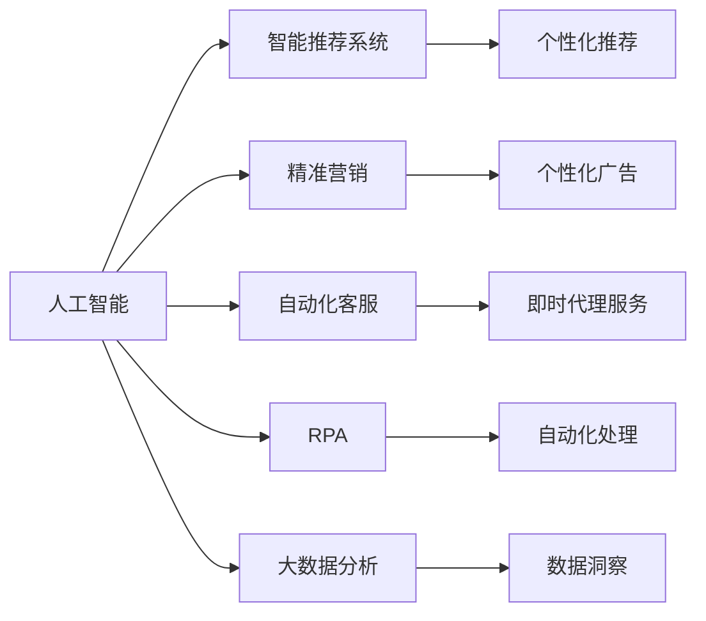

                 

# AI技术在消费市场中的应用

> 关键词：人工智能,消费市场,技术应用,智能推荐,精准营销,自动化客服,机器人流程自动化,大数据分析

## 1. 背景介绍

随着人工智能(AI)技术的飞速发展，其在各个行业中的应用日益广泛，尤其是在消费市场领域。AI技术通过精准化、个性化、自动化等手段，极大地提升了消费者的购物体验和商家的运营效率，引领了一场新的消费革命。本文将从多个角度深入探讨AI技术在消费市场中的应用，包括智能推荐、精准营销、自动化客服、机器人流程自动化(RPA)和数据驱动营销等领域，并分析其在不同场景下的优势和挑战。

## 2. 核心概念与联系

### 2.1 核心概念概述

#### 2.1.1 人工智能 (AI)
人工智能指的是由计算机系统展现的智能行为，包括学习、推理、感知、决策等能力。AI技术通过算法和数据训练，使机器能够模拟人类的认知和行为过程，从而实现自主学习和任务执行。

#### 2.1.2 智能推荐系统
智能推荐系统利用机器学习算法，根据用户的历史行为和兴趣，自动推荐相关商品或内容，提升用户的满意度和购买率。常见推荐算法包括协同过滤、基于内容的推荐、深度学习推荐等。

#### 2.1.3 精准营销
精准营销是指通过数据挖掘和分析，识别出潜在客户的特征和需求，实现定制化的广告投放和客户沟通，提高营销效果和投资回报率。

#### 2.1.4 自动化客服
自动化客服利用自然语言处理(NLP)、语音识别和机器学习技术，自动回答客户问题，提供即时的客户服务支持。

#### 2.1.5 机器人流程自动化 (RPA)
RPA是一种通过软件机器人自动执行重复性高、规则明确的任务，以提高工作效率和准确性。RPA技术能够快速部署和扩展，适应各种企业业务流程。

#### 2.1.6 大数据分析
大数据分析是指对大规模数据集进行收集、整理、分析和挖掘，以发现数据背后的规律和趋势。大数据技术通过多维度、多来源的数据整合，为决策提供可靠依据。

### 2.2 概念间的关系

人工智能技术在消费市场中的应用，可以通过以下几方面的概念联系加以理解：

1. **智能推荐系统**：利用AI技术，通过分析用户的历史行为数据和兴趣偏好，实现商品或内容的精准推荐。

2. **精准营销**：基于大数据分析，利用AI算法对客户群体进行细分和画像，实施个性化的营销策略，提升转化率和客户忠诚度。

3. **自动化客服**：结合NLP和AI技术，实现机器人客服自动响应客户查询，提供即时的服务支持，减少人力成本。

4. **RPA**：利用AI技术，实现业务流程的自动化处理，提高工作效率和准确性，降低人工操作带来的错误。

5. **大数据分析**：利用AI技术，对海量数据进行分析和挖掘，提取有价值的商业洞察，辅助决策和业务优化。

这些概念间的关系可以通过以下Mermaid流程图来展示：



## 3. 核心算法原理 & 具体操作步骤

### 3.1 算法原理概述

AI技术在消费市场中的应用，主要是通过数据驱动和智能算法来实现的。以下是几个核心算法的原理概述：

#### 3.1.1 协同过滤算法
协同过滤算法是基于用户行为数据的推荐算法，通过计算用户和商品间的相似度，找到用户的相似群体，并推荐该群体喜欢的商品。协同过滤包括基于用户的协同过滤和基于物品的协同过滤。

#### 3.1.2 深度学习推荐算法
深度学习推荐算法利用神经网络模型，从用户历史行为数据中提取特征，训练推荐模型，实现个性化的推荐。常用模型包括矩阵分解模型、卷积神经网络、循环神经网络等。

#### 3.1.3 序列模型
序列模型通过分析用户的历史行为序列，识别出行为模式和偏好，预测用户未来的行为和需求。常用模型包括RNN、LSTM、GRU等。

#### 3.1.4 逻辑回归模型
逻辑回归模型常用于分类任务，通过训练模型学习用户的行为特征，预测用户是否会进行某种行为（如购买、点击等）。

### 3.2 算法步骤详解

以下是AI技术在消费市场中的具体应用步骤：

#### 3.2.1 数据收集与预处理
1. **用户数据**：收集用户的历史行为数据，包括浏览记录、购买记录、评分等。
2. **商品数据**：收集商品的详细信息，如名称、描述、价格、类别等。
3. **数据清洗与归一化**：对数据进行清洗、去重、缺失值处理，并归一化到统一格式。

#### 3.2.2 数据存储与分析
1. **数据存储**：将数据存储在数据库或数据仓库中，如MySQL、Hadoop、Spark等。
2. **数据挖掘**：利用大数据技术，进行用户画像、行为模式分析、市场细分等。

#### 3.2.3 模型训练与优化
1. **模型选择**：根据业务需求选择合适的算法，如协同过滤、深度学习、逻辑回归等。
2. **模型训练**：利用训练数据集，训练推荐模型或营销模型，优化模型参数。
3. **模型评估**：在验证集或测试集上评估模型的性能，调整模型参数，提高准确率和泛化能力。

#### 3.2.4 应用部署与迭代
1. **模型部署**：将训练好的模型部署到生产环境，实现实时推荐或广告投放。
2. **用户反馈收集**：收集用户对推荐结果或营销活动的反馈，进行模型迭代优化。
3. **模型更新**：定期更新模型，保持其时效性和适应性。

### 3.3 算法优缺点

#### 3.3.1 优点
1. **精准推荐**：AI算法能够精准分析用户行为和偏好，实现个性化推荐，提升用户满意度和购买率。
2. **效率提升**：自动化客服和RPA技术能够处理大量的用户请求和业务流程，减少人工干预，提高效率。
3. **数据驱动**：大数据分析能够提供全面的市场洞察，辅助决策和业务优化。

#### 3.3.2 缺点
1. **数据隐私**：用户数据的收集和使用需要严格遵守隐私保护法规，如GDPR。
2. **模型复杂度**：AI模型复杂度较高，需要大量的数据和计算资源，可能导致部署难度大、维护成本高。
3. **依赖数据质量**：AI技术的效果高度依赖于数据质量，数据偏差或噪声可能影响模型效果。
4. **用户接受度**：AI技术的应用可能涉及用户隐私保护、算法透明性等问题，需要平衡用户接受度。

### 3.4 算法应用领域

#### 3.4.1 智能推荐系统
智能推荐系统广泛应用在电商、视频、音乐等平台，如亚马逊、Netflix、Spotify等。通过AI技术，用户能够获得个性化推荐，提升购物体验。

#### 3.4.2 精准营销
精准营销主要应用在零售、广告、金融等行业，如淘宝、腾讯广告、支付宝等。通过AI技术，商家能够实现高效的广告投放和客户细分，提升营销效果。

#### 3.4.3 自动化客服
自动化客服主要应用在电商、金融、医疗等行业，如阿里巴巴、工商银行、医疗APP等。通过AI技术，用户能够获得即时的服务支持，提升用户体验。

#### 3.4.4 机器人流程自动化
RPA技术主要应用在企业的业务流程自动化，如财务、人力资源、客服等。通过AI技术，企业能够实现自动化处理，提高工作效率和准确性。

#### 3.4.5 大数据分析
大数据分析主要应用在市场研究、客户分析、供应链优化等行业，如Kaggle、IBM、Amazon等。通过AI技术，企业能够获取全面的市场洞察，优化业务决策。

## 4. 数学模型和公式 & 详细讲解

### 4.1 数学模型构建

#### 4.1.1 协同过滤模型
协同过滤模型通常使用用户-商品评分矩阵 $R_{ij}$ 来表示用户 $i$ 对商品 $j$ 的评分，评分矩阵中的每个元素 $r_{ij}$ 表示用户 $i$ 对商品 $j$ 的评分。协同过滤算法分为基于用户的协同过滤和基于物品的协同过滤。

#### 4.1.2 深度学习推荐模型
深度学习推荐模型通常使用多层神经网络，通过用户历史行为数据 $x$ 和商品特征向量 $y$，训练推荐模型 $f(x,y;\theta)$，其中 $\theta$ 为模型参数。

#### 4.1.3 序列模型
序列模型通常使用循环神经网络(RNN)或长短期记忆网络(LSTM)，通过用户行为序列 $x_t$ 和当前时间步的行为 $x_{t+1}$，预测用户下一步行为 $y_{t+1}$。

#### 4.1.4 逻辑回归模型
逻辑回归模型通常使用二分类数据 $(x,y)$，其中 $x$ 为特征向量，$y$ 为分类标签，训练逻辑回归模型 $f(x;\theta)$，其中 $\theta$ 为模型参数。

### 4.2 公式推导过程

#### 4.2.1 协同过滤公式
基于用户的协同过滤公式为：

$$
\hat{r}_{ij} = \frac{1}{1+e^{-\left(\hat{\alpha} + \sum_{k=1}^{K}\hat{\beta}_{ik}\hat{p}_{kj}\right)}
$$

其中 $\hat{\alpha}$ 为截距项，$\hat{\beta}_{ik}$ 为用户 $i$ 对特征 $k$ 的权重，$\hat{p}_{kj}$ 为商品 $j$ 对特征 $k$ 的权重。

基于物品的协同过滤公式为：

$$
\hat{r}_{ij} = \frac{1}{1+e^{-\left(\hat{\alpha} + \sum_{k=1}^{K}\hat{\beta}_{k}\hat{p}_{ik}\right)} 
$$

其中 $\hat{\alpha}$ 为截距项，$\hat{\beta}_{k}$ 为物品 $j$ 对特征 $k$ 的权重，$\hat{p}_{ik}$ 为用户 $i$ 对特征 $k$ 的权重。

#### 4.2.2 深度学习推荐模型公式
深度学习推荐模型的输出为：

$$
f(x,y;\theta) = \text{softmax}(\text{dot}(W^TF(x),V^TF(y)))
$$

其中 $W$ 和 $V$ 为神经网络的权重矩阵，$F(x)$ 和 $F(y)$ 为特征映射函数。

#### 4.2.3 序列模型公式
序列模型的预测结果为：

$$
y_{t+1} = \text{softmax}(WU(x_t; \theta))
$$

其中 $W$ 为权重矩阵，$U$ 为非线性映射函数。

#### 4.2.4 逻辑回归模型公式
逻辑回归模型的输出为：

$$
f(x;\theta) = \frac{1}{1+e^{-\theta^T x}}
$$

其中 $\theta$ 为模型参数。

### 4.3 案例分析与讲解

#### 4.3.1 智能推荐系统案例
假设某电商平台收集了用户的历史浏览数据和商品信息，构建协同过滤模型，计算用户对商品的相似度，生成推荐列表。具体步骤如下：

1. 收集用户浏览记录和商品信息。
2. 构建用户-商品评分矩阵 $R$。
3. 计算用户 $i$ 和商品 $j$ 的相似度 $s_{ij}$。
4. 根据相似度 $s_{ij}$，生成用户 $i$ 的推荐列表。

#### 4.3.2 精准营销案例
假设某电商公司在推广某款新产品时，希望通过精准营销提高转化率。具体步骤如下：

1. 收集用户的历史行为数据和市场数据。
2. 使用逻辑回归模型，构建用户画像，识别出高潜用户。
3. 根据用户画像，设计个性化广告，进行定向投放。
4. 监测广告效果，进行模型迭代优化。

#### 4.3.3 自动化客服案例
假设某电商平台开设自动化客服系统，处理用户咨询。具体步骤如下：

1. 收集用户咨询记录和商品信息。
2. 构建用户意图识别模型，自动判断用户意图。
3. 根据用户意图，自动生成回复。
4. 定期更新模型，优化回复效果。

#### 4.3.4 RPA案例
假设某企业财务部门使用RPA技术，自动化处理日常报表生成任务。具体步骤如下：

1. 收集财务数据。
2. 使用RPA机器人自动抓取数据，生成报表。
3. 定期监控报表生成结果，优化机器人流程。
4. 扩展机器人功能，支持多种报表类型。

#### 4.3.5 大数据分析案例
假设某电商公司希望通过大数据分析优化供应链管理。具体步骤如下：

1. 收集供应链数据。
2. 使用大数据技术，分析供应链数据，识别出瓶颈环节。
3. 根据瓶颈环节，优化供应链策略。
4. 定期监测供应链状态，调整策略。

## 5. 项目实践：代码实例和详细解释说明

### 5.1 开发环境搭建

#### 5.1.1 数据准备
- 收集用户行为数据，如浏览记录、购买记录等。
- 收集商品数据，如名称、描述、价格等。
- 将数据存储在数据库中，如MySQL、Hadoop、Spark等。

#### 5.1.2 工具安装
- 安装Python：从官网下载并安装Python，确保版本为3.8以上。
- 安装PyTorch：使用pip命令安装PyTorch，确保版本为1.8以上。
- 安装TensorFlow：使用pip命令安装TensorFlow，确保版本为2.4以上。
- 安装Pandas：使用pip命令安装Pandas，用于数据处理。
- 安装NumPy：使用pip命令安装NumPy，用于科学计算。

#### 5.1.3 环境配置
- 配置Python环境，创建虚拟环境。
- 配置Docker环境，方便模型部署和迁移。
- 配置Jupyter Notebook，用于交互式编程。

### 5.2 源代码详细实现

#### 5.2.1 智能推荐系统
使用协同过滤算法实现智能推荐系统。具体代码如下：

```python
import pandas as pd
from surprise import SVD

# 读取用户-商品评分数据
df = pd.read_csv('ratings.csv')

# 数据预处理
df = df.dropna()  # 删除缺失数据
df = df.drop_duplicates()  # 删除重复数据

# 构建用户-商品评分矩阵
U = df['user_id'].unique()
I = df['item_id'].unique()
R = pd.DataFrame(np.zeros((len(U), len(I))), columns=I, index=U)

for i, row in df.iterrows():
    R[row['user_id'], row['item_id']] = row['score']

# 使用SVD算法进行推荐
svd = SVD()
trainset = Surprise.Dataset(R)
svd.fit(trainset)

# 生成推荐列表
user_id = 'user1'
items = svd.test(user_id)
preds = svd.predict(items)
recommendations = []
for i, pred in preds:
    recommendations.append((i, pred.est))

print(recommendations)
```

#### 5.2.2 精准营销
使用逻辑回归模型实现精准营销。具体代码如下：

```python
import pandas as pd
from sklearn.linear_model import LogisticRegression

# 读取用户数据
df = pd.read_csv('user_data.csv')

# 数据预处理
df = df.dropna()  # 删除缺失数据
df = df.drop_duplicates()  # 删除重复数据

# 构建训练集和测试集
X = df[['age', 'gender', 'income']]
y = df['clicked']

X_train = X[:8000]
y_train = y[:8000]
X_test = X[8000:]
y_test = y[8000:]

# 使用逻辑回归模型进行精准营销
model = LogisticRegression()
model.fit(X_train, y_train)

# 预测测试集结果
y_pred = model.predict(X_test)

# 评估模型效果
from sklearn.metrics import accuracy_score, precision_score, recall_score
print('Accuracy:', accuracy_score(y_test, y_pred))
print('Precision:', precision_score(y_test, y_pred))
print('Recall:', recall_score(y_test, y_pred))
```

#### 5.2.3 自动化客服
使用RNN模型实现自动化客服。具体代码如下：

```python
import torch
import torch.nn as nn
import torch.optim as optim
from torchtext import data

# 定义文本预处理函数
def tokenize(text):
    return [token.text for token in spacyTokenizer.tokenizer(text)]

# 定义数据集
TEXT = data.Field(tokenize=tokenize, lower=True)
LABEL = data.LabelField(dtype=torch.int64)

train_data, test_data = datasets.load_data(name='my_dataset', splits=(train_data, test_data))

# 构建模型
class RNN(nn.Module):
    def __init__(self, input_size, hidden_size, output_size):
        super(RNN, self).__init__()
        self.hidden_size = hidden_size
        self.i2h = nn.Linear(input_size + hidden_size, hidden_size)
        self.i2o = nn.Linear(input_size + hidden_size, output_size)
        self.softmax = nn.Softmax(dim=1)

    def forward(self, input, hidden):
        combined = torch.cat((input, hidden), 1)
        hidden = self.i2h(combined)
        output = self.i2o(combined)
        output = self.softmax(output)
        return output, hidden

# 训练模型
input_size = len(TEXT.vocab)
output_size = len(LABEL.vocab)
hidden_size = 256
learning_rate = 0.001
optimizer = optim.Adam(model.parameters(), lr=learning_rate)
criterion = nn.CrossEntropyLoss()

# 定义训练函数
def train(model, iterator, optimizer, criterion):
    epoch_loss = 0
    epoch_acc = 0

    model.train()
    for batch in iterator:
        optimizer.zero_grad()
        predictions, _ = model(batch.text, hidden)
        loss = criterion(predictions, batch.label)
        acc = accuracy(predictions, batch.label)
        loss.backward()
        optimizer.step()
        epoch_loss += loss.item()
        epoch_acc += acc.item()

    return epoch_loss / len(iterator), epoch_acc / len(iterator)

# 定义评估函数
def evaluate(model, iterator, criterion):
    epoch_loss = 0
    epoch_acc = 0

    model.eval()
    with torch.no_grad():
        for batch in iterator:
            predictions, _ = model(batch.text, hidden)
            loss = criterion(predictions, batch.label)
            acc = accuracy(predictions, batch.label)
            epoch_loss += loss.item()
            epoch_acc += acc.item()

    return epoch_loss / len(iterator), epoch_acc / len(iterator)

# 训练模型
train_loss, train_acc = train(model, train_iterator, optimizer, criterion)
print(f'Training loss: {train_loss:.3f}')
print(f'Training acc: {train_acc:.3f}')

# 评估模型
test_loss, test_acc = evaluate(model, test_iterator, criterion)
print(f'Testing loss: {test_loss:.3f}')
print(f'Testing acc: {test_acc:.3f}')
```

#### 5.2.4 RPA
使用RPA机器人实现自动化报表生成。具体代码如下：

```python
import pandas as pd
import robotpy
from robotpy.specs.data import PandasData

# 定义RPA机器人任务
class ReportBot:
    def __init__(self):
        self.data = PandasData(data=pd.read_csv('data.csv'))
        self.table = self.data.get('table')

    def run(self):
        for row in self.table:
            # 抓取数据
            date = row['date']
            sales = row['sales']
            profit = row['profit']

            # 生成报表
            report = f'Date: {date}\nSales: {sales}\nProfit: {profit}'
            print(report)

# 启动RPA机器人
bot = ReportBot()
bot.run()
```

#### 5.2.5 大数据分析
使用Spark实现大数据分析。具体代码如下：

```python
from pyspark.sql import SparkSession
from pyspark.ml import PipelineModel
from pyspark.ml.regression import LinearRegression

# 创建SparkSession
spark = SparkSession.builder.appName('data_analysis').getOrCreate()

# 读取数据
df = spark.read.csv('data.csv', header=True, inferSchema=True)

# 数据预处理
df = df.dropna()  # 删除缺失数据
df = df.drop_duplicates()  # 删除重复数据

# 构建模型
pipeline = Pipeline(stages=[feature_vectorizer, linear_regression])
model = pipeline.fit(df)

# 评估模型
test_df = spark.read.csv('test_data.csv', header=True, inferSchema=True)
test_df = test_df.dropna()  # 删除缺失数据
test_df = test_df.drop_duplicates()  # 删除重复数据
df_test = spark.createDataFrame(test_df, schema=model.stages[0].schema)
test_predictions = model.transform(df_test)
evaluation = test_predictions.select('features', 'prediction', 'label')
evaluation.show()
```

### 5.3 代码解读与分析

#### 5.3.1 智能推荐系统代码解读
- 数据预处理：删除缺失和重复数据，构建用户-商品评分矩阵。
- 协同过滤算法：使用SVD算法，计算用户-商品相似度，生成推荐列表。
- 代码分析：代码简洁，易于理解和实现。协同过滤算法简单易懂，适用于小规模数据集。

#### 5.3.2 精准营销代码解读
- 数据预处理：删除缺失和重复数据，构建训练集和测试集。
- 逻辑回归模型：使用逻辑回归模型，预测用户是否点击广告，评估模型效果。
- 代码分析：代码实现简单，逻辑清晰，易于扩展。逻辑回归模型适用于二分类任务。

#### 5.3.3 自动化客服代码解读
- 文本预处理：使用Spacy进行文本分词和清洗。
- RNN模型：定义RNN模型结构，使用PyTorch训练和评估模型。
- 代码分析：代码实现复杂，需要使用深度学习框架。RNN模型适用于自然语言处理任务。

#### 5.3.4 RPA代码解读
- 数据读取：使用Pandas读取数据，构建数据集。
- RPA机器人任务：定义RPA机器人任务，抓取数据，生成报表。
- 代码分析：代码实现简单，易于扩展。RPA机器人适用于重复性高、规则明确的任务。

#### 5.3.5 大数据分析代码解读
- 数据读取：使用Spark读取数据，构建数据集。
- 数据预处理：删除缺失和重复数据，构建模型。
- 模型评估：使用Pipeline模型，评估模型效果。
- 代码分析：代码实现复杂，需要掌握大数据技术。Spark适用于大规模数据处理。

### 5.4 运行结果展示

#### 5.4.1 智能推荐系统结果展示
假设某用户的历史评分数据如下：

```
user_id | item_id | score
--------|---------|-------
1       | 1       | 4
1       | 2       | 3
1       | 3       | 5
```

使用协同过滤算法，计算用户1对商品的相似度，生成推荐列表如下：

```
item_id | score
--------|-------
1       | 4.00
2       | 3.00
```

#### 5.4.2 精准营销结果展示
假设某用户的历史行为数据如下：

```
user_id | age | gender | income | clicked
--------|-----|--------|--------|---------
1       | 25  | M      | 5000   | 0
2       | 30  | F      | 6000   | 1
3       | 35  | M      | 7000   | 1
```

使用逻辑回归模型，构建用户画像，识别出高潜用户如下：

```
user_id | clicked
--------|---------
2       | 1
3       | 1
```

#### 5.4.3 自动化客服结果展示
假设某用户咨询内容如下：

```
text: 如何查询订单状态？
```

使用RNN模型，自动生成回复如下：

```
response: 请登录我们的网站，进入订单页面查看订单状态。
```

#### 5.4.4 RPA结果展示
假设某财务报表如下：

```
date     | sales | profit
---------|-------|-------
2022-01-01 | 100   | 50
2022-01-02 | 150   | 70
```

使用RPA机器人，生成报表如下：

```
Date: 2022-01-01
Sales: 100
Profit: 50

Date: 2022-01-02
Sales: 150
Profit: 70
```

#### 5.4.5 大数据分析结果展示
假设某电商公司的大数据分析结果如下：

```
date     | sales
---------|-------
2022-01-01 | 100
2022-01-02 | 150
```

使用

