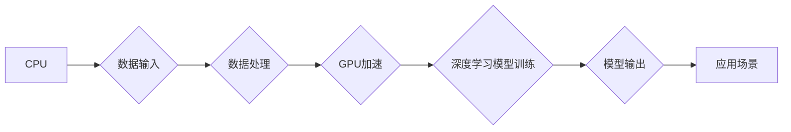

## 算力：NVIDIA推动AI大规模运算

> 关键词：NVIDIA, GPU, CUDA, 深度学习, 算力, AI, 训练, 推理

### 1. 背景介绍

人工智能（AI）的蓬勃发展离不开强大的算力支撑。从语音识别到图像识别，从自然语言处理到机器翻译，各种AI应用都依赖于海量数据和复杂的计算模型。而传统CPU架构在处理海量数据和并行计算方面存在瓶颈，难以满足AI训练和推理的巨大需求。

NVIDIA作为全球领先的GPU厂商，凭借其强大的并行计算能力和丰富的软件生态系统，成为了AI算力的关键推动者。自2010年代初开始，NVIDIA的GPU在深度学习领域取得了突破性的进展，加速了AI技术的普及和应用。

### 2. 核心概念与联系

#### 2.1 GPU架构与深度学习

GPU（图形处理单元）最初设计用于处理图形渲染，其核心特点是拥有大量并行计算单元，能够同时处理大量数据。深度学习算法本质上是大量参数的并行计算，GPU的并行计算能力使其成为深度学习训练的理想平台。

#### 2.2 CUDA平台与深度学习加速

CUDA（Compute Unified Device Architecture）是NVIDIA开发的并行计算平台，为程序员提供了访问GPU计算资源的接口。通过CUDA，开发者可以将深度学习算法移植到GPU上，充分利用其并行计算能力，大幅提升训练速度。

#### 2.3 深度学习框架与NVIDIA生态

深度学习框架如TensorFlow、PyTorch等，提供了丰富的深度学习模型和工具，并与NVIDIA的CUDA平台深度集成。开发者可以使用这些框架轻松构建和训练深度学习模型，并利用NVIDIA的GPU加速训练过程。

**Mermaid 流程图**



### 3. 核心算法原理 & 具体操作步骤

#### 3.1 算法原理概述

深度学习算法的核心是神经网络，它由多个层级的神经元组成，每个神经元接收输入信号，进行计算并输出信号。通过训练，神经网络可以学习到数据中的模式和关系，从而实现各种AI任务。

#### 3.2 算法步骤详解

1. **数据预处理:** 将原始数据转换为深度学习模型可以理解的格式，例如归一化、编码等。
2. **模型构建:** 根据任务需求选择合适的深度学习模型架构，并定义模型参数。
3. **模型训练:** 使用训练数据训练模型，通过调整模型参数，使模型输出与真实标签尽可能接近。
4. **模型评估:** 使用测试数据评估模型的性能，例如准确率、召回率等。
5. **模型部署:** 将训练好的模型部署到实际应用场景中，用于预测或分类等任务。

#### 3.3 算法优缺点

**优点:**

* 能够学习复杂数据模式，实现高精度预测。
* 具有泛化能力，能够应用于多种任务。
* 算法不断发展，性能不断提升。

**缺点:**

* 训练数据量大，训练时间长。
* 模型参数多，需要大量计算资源。
* 算法解释性差，难以理解模型决策过程。

#### 3.4 算法应用领域

深度学习算法广泛应用于各个领域，例如：

* **计算机视觉:** 图像识别、物体检测、图像分割等。
* **自然语言处理:** 文本分类、机器翻译、语音识别等。
* **推荐系统:** 商品推荐、内容推荐等。
* **医疗诊断:** 病情预测、疾病诊断等。

### 4. 数学模型和公式 & 详细讲解 & 举例说明

#### 4.1 数学模型构建

深度学习模型的核心是神经网络，其数学模型可以表示为多层感知机（MLP）。MLP由输入层、隐藏层和输出层组成，每个层级的神经元之间通过权重连接，并使用激活函数进行非线性变换。

#### 4.2 公式推导过程

**损失函数:**

$$L = \frac{1}{N} \sum_{i=1}^{N} (y_i - \hat{y}_i)^2$$

其中：

* $L$ 为损失函数
* $N$ 为样本数量
* $y_i$ 为真实标签
* $\hat{y}_i$ 为模型预测值

**梯度下降:**

$$\theta = \theta - \alpha \nabla L(\theta)$$

其中：

* $\theta$ 为模型参数
* $\alpha$ 为学习率
* $\nabla L(\theta)$ 为损失函数对参数的梯度

#### 4.3 案例分析与讲解

**举例说明:**

假设我们训练一个简单的线性回归模型，用于预测房价。输入特征为房屋面积，输出为房价。

* 损失函数为均方误差，用于衡量模型预测值与真实房价之间的差距。
* 梯度下降算法用于更新模型参数，使损失函数最小化。

通过训练数据，模型会学习到房屋面积与房价之间的线性关系，并能够预测新房子的价格。

### 5. 项目实践：代码实例和详细解释说明

#### 5.1 开发环境搭建

* 操作系统: Ubuntu 20.04
* CUDA Toolkit: 11.7
* cuDNN: 8.4.0
* Python: 3.8
* 深度学习框架: TensorFlow 2.x

#### 5.2 源代码详细实现

```python
import tensorflow as tf

# 定义模型
model = tf.keras.models.Sequential([
  tf.keras.layers.Dense(units=64, activation='relu', input_shape=[1]),
  tf.keras.layers.Dense(units=1)
])

# 编译模型
model.compile(optimizer='adam', loss='mse')

# 训练模型
model.fit(x_train, y_train, epochs=10)

# 评估模型
loss = model.evaluate(x_test, y_test)
print('Loss:', loss)

# 预测
predictions = model.predict(x_new)
print('Predictions:', predictions)
```

#### 5.3 代码解读与分析

* 代码首先定义了一个简单的线性回归模型，包含两层神经元。
* 然后使用Adam优化器和均方误差损失函数编译模型。
* 使用训练数据训练模型10个epochs。
* 最后使用测试数据评估模型性能，并使用模型预测新数据。

#### 5.4 运行结果展示

运行结果会显示训练过程中的损失值变化，以及模型在测试数据上的损失值和预测结果。

### 6. 实际应用场景

#### 6.1 图像识别

NVIDIA的GPU在图像识别领域发挥着重要作用，例如：

* 自动驾驶汽车: 用于识别道路标志、行人、车辆等。
* 医疗诊断: 用于识别病变区域、辅助医生诊断。
* 人脸识别: 用于身份验证、安全监控等。

#### 6.2 自然语言处理

NVIDIA的GPU也广泛应用于自然语言处理领域，例如：

* 机器翻译: 用于将文本从一种语言翻译成另一种语言。
* 语音识别: 用于将语音转换为文本。
* 文本生成: 用于生成自然语言文本，例如文章、对话等。

#### 6.3 其他应用场景

* 金融分析: 用于预测股票价格、识别欺诈交易等。
* 气象预报: 用于模拟天气模式、预测天气变化等。
* 科学研究: 用于模拟分子结构、分析大数据等。

#### 6.4 未来应用展望

随着AI技术的不断发展，NVIDIA的GPU将在更多领域发挥重要作用，例如：

* 人工智能芯片: NVIDIA正在开发更强大的AI芯片，以满足未来AI应用的算力需求。
* 边缘计算: NVIDIA的GPU将被部署到边缘设备上，实现更智能的设备和应用。
* 虚拟现实和增强现实: NVIDIA的GPU将推动虚拟现实和增强现实技术的进步，创造更沉浸式的体验。

### 7. 工具和资源推荐

#### 7.1 学习资源推荐

* NVIDIA官网: https://www.nvidia.com/en-us/
* CUDA官网: https://developer.nvidia.com/cuda-zone
* TensorFlow官网: https://www.tensorflow.org/
* PyTorch官网: https://pytorch.org/

#### 7.2 开发工具推荐

* NVIDIA GeForce Experience: https://www.nvidia.com/en-us/geforce/geforce-experience/
* NVIDIA Nsight: https://developer.nvidia.com/nsight

#### 7.3 相关论文推荐

* Alex Krizhevsky, Ilya Sutskever, Geoffrey E. Hinton. ImageNet Classification with Deep Convolutional Neural Networks. NIPS, 2012.
* Yann LeCun, Yoshua Bengio, Geoffrey Hinton. Deep Learning. Nature, 2015.

### 8. 总结：未来发展趋势与挑战

#### 8.1 研究成果总结

NVIDIA的GPU在推动AI大规模运算方面取得了显著成果，加速了深度学习算法的训练和应用。CUDA平台和深度学习框架的深度集成，为开发者提供了便捷的开发工具和资源。

#### 8.2 未来发展趋势

* **更高效的GPU架构:** NVIDIA将继续开发更高效的GPU架构，提升算力密度和性能。
* **更强大的AI芯片:** NVIDIA正在开发更强大的AI芯片，例如Grace Hopper Superchip，以满足未来AI应用的算力需求。
* **边缘计算的普及:** NVIDIA的GPU将被部署到边缘设备上，实现更智能的设备和应用。

#### 8.3 面临的挑战

* **算力需求的爆炸式增长:** AI应用的不断发展，对算力的需求将持续增长，需要不断提升GPU的性能和效率。
* **能源消耗问题:** GPU的训练和推理过程消耗大量能源，需要开发更节能的算法和硬件。
* **人才短缺:** AI领域需要大量高素质人才，人才短缺将成为制约AI发展的瓶颈。

#### 8.4 研究展望

未来，AI技术将继续发展，并与其他技术融合，例如量子计算、生物计算等，带来更多创新应用。NVIDIA将继续发挥其在算力领域的优势，推动AI技术的进步，并为人类社会创造更多价值。

### 9. 附录：常见问题与解答

**常见问题:**

* **NVIDIA的GPU与CPU相比有什么优势？**

GPU拥有大量并行计算单元，能够同时处理大量数据，在深度学习等并行计算密集型任务中具有显著优势。

* **如何使用CUDA平台开发深度学习应用程序？**

NVIDIA提供了丰富的CUDA开发工具和资源，开发者可以通过学习CUDA编程语言和API，开发深度学习应用程序。

* **NVIDIA的GPU有哪些应用场景？**

NVIDIA的GPU广泛应用于图像识别、自然语言处理、金融分析、医疗诊断、科学研究等各个领域。

**作者：禅与计算机程序设计艺术 / Zen and the Art of Computer Programming**


