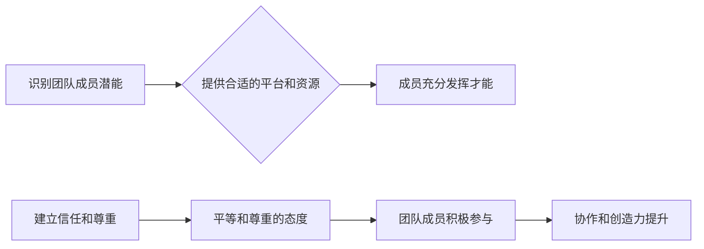

## 管理的本质：激发潜能与善意

> 关键词：软件开发，团队管理，领导力，沟通，协作，效率，创新

### 1. 背景介绍

在当今科技飞速发展的时代，软件开发已成为推动社会进步的引擎。然而，优秀的软件产品并非仅仅依靠技术力量，更需要高效的团队管理和领导力。 

传统的管理模式往往强调控制和指令，忽视了团队成员的个体差异和潜能。这种模式在某些情况下可能有效，但对于需要快速迭代、不断创新的软件开发团队来说，却显得过于僵化和阻碍创新。

因此，我们需要探索一种新的管理模式，一种能够激发团队成员潜能、促进协作和创造力的管理模式。

### 2. 核心概念与联系

**2.1  激发潜能**

每个团队成员都拥有独特的技能、经验和想法。有效的管理者需要识别和挖掘这些潜能，并为成员提供合适的平台和资源，让他们能够充分发挥自己的才能。

**2.2  善意**

善意管理的核心在于建立信任和尊重。管理者需要真诚地关心团队成员的成长和发展，并以平等和尊重的态度对待他们。

**2.3  流程图**



**2.4  联系**

激发潜能和善意管理是相互关联的。只有建立了信任和尊重，团队成员才能真正感受到被重视和认可，从而愿意敞开心扉，积极参与工作，并尽情发挥自己的潜能。

### 3. 核心算法原理 & 具体操作步骤

**3.1  算法原理概述**

激发潜能和善意管理并非一种固定的算法，而是一种需要不断学习和实践的管理理念。其核心原理在于：

* **了解团队成员：** 通过沟通和观察，了解每个成员的技能、兴趣、价值观和目标。
* **赋予自主权：** 鼓励成员自主决策和行动，并提供必要的支持和指导。
* **营造开放氛围：** 建立一个包容、信任和尊重的团队氛围，鼓励成员积极沟通和分享。
* **持续反馈和改进：** 定期进行反馈和评估，并根据实际情况不断调整管理策略。

**3.2  算法步骤详解**

1. **团队成员分析:** 

    *  **技能评估:** 通过测试、项目经验和同事评价等方式，评估每个成员的技能水平。
    *  **兴趣调查:** 通过问卷调查、访谈等方式，了解每个成员的兴趣爱好和职业发展目标。
    *  **价值观识别:** 通过观察和沟通，了解每个成员的价值观和工作理念。

2. **资源分配:**

    *  **匹配技能:** 将任务分配给具备相应技能的成员，并提供必要的培训和支持。
    *  **激发兴趣:** 尽可能安排成员参与自己感兴趣的项目，并给予他们一定的自主权。
    *  **尊重价值观:** 尊重每个成员的价值观和工作理念，并创造一个包容和多元的团队氛围。

3. **沟通协作:**

    *  **定期会议:** 定期召开团队会议，分享项目进展、讨论问题和收集反馈。
    *  **开放沟通:** 建立一个开放的沟通机制，鼓励成员随时提出问题和建议。
    *  **协作工具:** 使用协作工具，例如项目管理软件、即时通讯软件等，提高团队协作效率。

4. **反馈和改进:**

    *  **定期评估:** 定期进行团队绩效评估，并根据评估结果进行调整。
    *  **个人反馈:** 定期对每个成员进行个人反馈，帮助他们了解自己的优势和不足。
    *  **持续学习:** 鼓励团队成员不断学习和成长，并分享学习成果。

**3.3  算法优缺点**

**优点:**

*  能够激发团队成员的潜能和创造力。
*  能够提高团队协作效率和工作满意度。
*  能够促进团队成员的个人成长和发展。

**缺点:**

*  需要管理者具备较强的沟通、领导力和团队建设能力。
*  需要团队成员具备较高的责任感和自我管理能力。
*  需要投入更多的时间和精力进行沟通和管理。

**3.4  算法应用领域**

激发潜能和善意管理适用于所有需要团队协作的领域，例如：

*  软件开发
*  产品设计
*  市场营销
*  教育培训
*  医疗保健

### 4. 数学模型和公式 & 详细讲解 & 举例说明

**4.1  数学模型构建**

我们可以使用一个简单的数学模型来描述团队成员的潜能和表现：

$$
P = f(S, R, A)
$$

其中：

*  $P$ 代表团队成员的表现
*  $S$ 代表团队成员的技能水平
*  $R$ 代表团队成员获得的资源支持
*  $A$ 代表团队成员的积极性

**4.2  公式推导过程**

这个模型表明，团队成员的表现不仅取决于其技能水平，还取决于获得的资源支持和积极性。

*  技能水平越高，表现越好。
*  资源支持越多，表现越好。
*  积极性越高，表现越好。

**4.3  案例分析与讲解**

假设有两个软件开发团队，团队 A 和团队 B。

*  团队 A 的成员技能水平较高，但资源支持不足，积极性也较低。
*  团队 B 的成员技能水平中等，但资源支持充足，积极性较高。

根据上述模型，我们可以推断：

*  团队 A 的表现可能不如团队 B。
*  即使团队 A 的成员技能水平更高，但缺乏资源支持和积极性，也难以发挥出最佳表现。

### 5. 项目实践：代码实例和详细解释说明

**5.1  开发环境搭建**

为了更好地实践激发潜能和善意管理理念，我们可以创建一个简单的项目管理工具。

开发环境搭建需要根据实际情况选择合适的工具和平台。例如，可以使用 Python 和 Django 框架开发一个基于 Web 的项目管理工具。

**5.2  源代码详细实现**

由于篇幅限制，这里只提供部分代码示例：

```python
# models.py
class Task(models.Model):
    title = models.CharField(max_length=200)
    description = models.TextField()
    status = models.CharField(max_length=10, choices=[('todo', '待办'), ('in_progress', '进行中'), ('done', '完成')])
    assigned_to = models.ForeignKey(User, on_delete=models.CASCADE)

# views.py
def task_list(request):
    tasks = Task.objects.filter(assigned_to=request.user)
    return render(request, 'task_list.html', {'tasks': tasks})
```

**5.3  代码解读与分析**

这段代码定义了一个名为 `Task` 的模型，用于存储任务信息，包括标题、描述、状态和负责人。

`task_list` 函数用于展示用户分配的任务列表。

**5.4  运行结果展示**

运行上述代码后，用户可以访问一个 Web 页面，查看自己分配的任务列表。

### 6. 实际应用场景

激发潜能和善意管理理念可以应用于各种实际场景，例如：

*  **软件开发团队:** 通过了解成员技能和兴趣，合理分配任务，营造开放的沟通氛围，激发团队成员的创造力和协作能力。
*  **产品设计团队:** 通过鼓励成员自由表达想法，进行头脑风暴，并尊重每个成员的意见，促进创新和产品迭代。
*  **教育培训机构:** 通过了解学生的学习目标和兴趣，提供个性化的学习方案，并鼓励学生积极参与课堂互动，提高学生的学习效率和兴趣。

**6.4  未来应用展望**

随着人工智能技术的不断发展，激发潜能和善意管理理念将得到更广泛的应用。例如，我们可以利用人工智能技术分析团队成员的数据，提供更精准的资源分配和个性化学习方案。

### 7. 工具和资源推荐

**7.1  学习资源推荐**

*  《管理的本质》
*  《高效能团队》
*  《领袖力》

**7.2  开发工具推荐**

*  Jira
*  Trello
*  Asana

**7.3  相关论文推荐**

*  《激发团队潜能的管理策略》
*  《善意管理与组织绩效》

### 8. 总结：未来发展趋势与挑战

**8.1  研究成果总结**

激发潜能和善意管理理念为团队管理提供了新的思路和方法，能够有效提高团队成员的积极性和创造力，促进团队协作和创新。

**8.2  未来发展趋势**

未来，激发潜能和善意管理理念将更加注重个性化和智能化。

*  个性化管理：根据每个成员的个体差异，提供更加个性化的资源支持和发展路径。
*  智能化管理：利用人工智能技术，分析团队成员的数据，提供更精准的管理建议和决策支持。

**8.3  面临的挑战**

*  管理者需要具备更强的沟通、领导力和团队建设能力。
*  团队成员需要具备更高的责任感和自我管理能力。
*  需要不断探索和实践新的管理方法，以适应不断变化的社会环境和工作模式。

**8.4  研究展望**

未来，我们将继续研究激发潜能和善意管理理念的应用，探索更有效的管理方法，帮助团队成员更好地发挥潜能，实现个人和团队的共同成长。

### 9. 附录：常见问题与解答

**9.1  如何激发团队成员的潜能？**

*  了解每个成员的技能、兴趣和目标。
*  提供合适的平台和资源，让他们能够充分发挥自己的才能。
*  鼓励成员自主决策和行动，并给予必要的支持和指导。
*  营造一个开放、信任和尊重的团队氛围。

**9.2  如何建立善意管理环境？**

*  真诚地关心团队成员的成长和发展。
*  以平等和尊重的态度对待团队成员。
*  建立开放的沟通机制，鼓励成员随时提出问题和建议。
*  定期进行反馈和评估，并根据评估结果进行调整。


作者：禅与计算机程序设计艺术 / Zen and the Art of Computer Programming 
