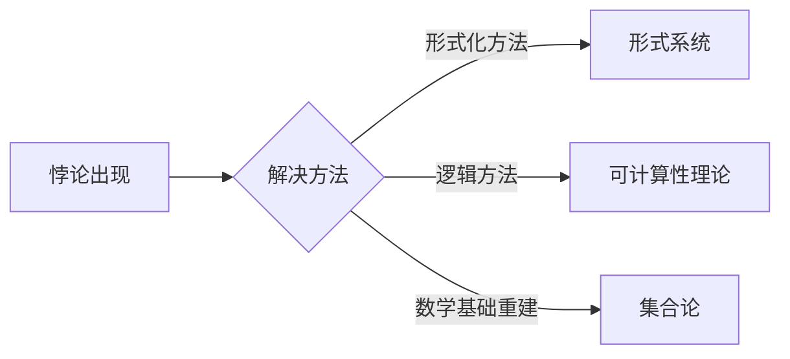

# 计算：第二部分 计算的数学基础 第 5 章 第三次数学危机 悖论的解决方法

> 关键词：第三次数学危机，悖论，集合论，形式系统，可计算性，逻辑，数学基础

## 1. 背景介绍

在数学的发展史上，曾发生过两次重大的危机，分别被称为第一次数学危机和第二次数学危机。第一次数学危机主要发生在古希腊，由于数学与直观经验之间的矛盾，导致了数学基础的不稳定。第二次数学危机则是在19世纪末，随着集合论的发展，出现了诸如罗素悖论等悖论，使得数学基础再次受到质疑。

第三次数学危机，或者说当前我们所处的数学危机，是由计算机科学和逻辑学的快速发展所带来的。随着计算机科学的兴起，数学的许多分支开始依赖于计算模型，而悖论问题也成为了计算理论中的一个重要课题。本章将探讨第三次数学危机的背景、核心悖论以及可能的解决方法。

## 2. 核心概念与联系

### 2.1 核心概念

#### 2.1.1 悖论

悖论是一种看似合理但结论自相矛盾的命题。在数学史上，许多悖论的出现都揭示了数学体系中的缺陷。

#### 2.1.2 形式系统

形式系统是一种由符号、公理和推理规则构成的系统。在数学中，形式系统用于表示和推理数学命题。

#### 2.1.3 可计算性

可计算性是指一个数学问题是否可以通过有限的步骤得到解答。图灵机和丘奇论题是研究可计算性的重要工具。

#### 2.1.4 数学基础

数学基础是指构成数学体系的理论基础。集合论是现代数学的基础之一。

### 2.2 Mermaid 流程图



## 3. 核心算法原理 & 具体操作步骤

### 3.1 算法原理概述

解决悖论问题的关键在于识别和消除导致悖论的逻辑缺陷。以下是几种常见的解决悖论的方法：

1. **形式化方法**：通过构建形式系统，将数学命题和推理过程符号化，从而避免直观推理中的错误。
2. **逻辑方法**：通过逻辑学的工具，如模型论、证明论等，分析悖论的产生机制，并提出解决方案。
3. **可计算性理论**：研究哪些数学问题是可计算的，哪些是不可计算的，从而排除导致悖论的不可计算问题。
4. **数学基础重建**：通过重新审视和重建数学基础，如集合论，以消除悖论的产生。

### 3.2 算法步骤详解

#### 3.2.1 形式化方法

1. **构建形式系统**：选择合适的符号和公理，构建一个形式系统。
2. **符号化命题**：将数学命题转换为形式系统中的符号表达式。
3. **证明命题**：使用形式系统中的推理规则，证明或反驳符号表达式。
4. **分析悖论**：分析导致悖论的原因，如公理的不一致或推理规则的不严格。

#### 3.2.2 逻辑方法

1. **分析悖论的产生机制**：使用逻辑学工具，如模型论、证明论等，分析悖论的产生机制。
2. **提出解决方案**：根据分析结果，提出解决问题的方案，如修改公理或推理规则。

#### 3.2.3 可计算性理论

1. **确定问题可计算性**：使用图灵机或丘奇论题等工具，确定数学问题的可计算性。
2. **排除不可计算问题**：对于不可计算问题，考虑是否需要修改数学基础或寻找其他解决方案。

#### 3.2.4 数学基础重建

1. **审视数学基础**：重新审视和评估现有的数学基础，如集合论。
2. **重建数学基础**：基于新的理论，重建数学基础，以消除悖论的产生。

### 3.3 算法优缺点

#### 3.3.1 形式化方法

优点：能够避免直观推理中的错误，提高数学的严谨性。

缺点：形式系统可能过于复杂，难以理解和应用。

#### 3.3.2 逻辑方法

优点：能够从逻辑上分析悖论的产生机制，提供解决问题的思路。

缺点：逻辑方法可能过于抽象，难以应用于实际问题。

#### 3.3.3 可计算性理论

优点：能够确定数学问题的可计算性，为解决悖论提供依据。

缺点：可计算性理论本身也存在一些悖论问题。

#### 3.3.4 数学基础重建

优点：能够从根本上解决悖论问题，为数学发展奠定坚实的基础。

缺点：重建数学基础是一个复杂且具有争议的过程。

### 3.4 算法应用领域

以上几种解决悖论的方法在数学、计算机科学、哲学等领域都有广泛的应用。

## 4. 数学模型和公式 & 详细讲解 & 举例说明

### 4.1 数学模型构建

#### 4.1.1 集合论模型

集合论是现代数学的基础之一，其核心概念是集合。以下是一个简单的集合论模型：

$$
\begin{align*}
S &= \{x | P(x)\} \\
x &\in S &\iff P(x)
\end{align*}
$$

其中，$S$ 是集合，$P(x)$ 是集合 $S$ 的定义条件。

#### 4.1.2 图灵机模型

图灵机是研究可计算性的重要工具，其模型如下：

$$
\begin{align*}
\mathcal{T} &= \{q_0, q_1, \ldots, q_n\} \\
\Gamma &= \{0, 1, B, \ldots\} \\
\delta &= \{(q_i, a, b, q_j, d) | q_i \in \mathcal{T}, a, b \in \Gamma, d \in \{\text{R}, \text{L}\}\} \\
\text{Initial state} &= q_0 \\
\text{Final state} &= q_n
\end{align*}
$$

其中，$\mathcal{T}$ 是图灵机的状态集合，$\Gamma$ 是图灵机的符号集合，$\delta$ 是图灵机的转移函数，$q_0$ 是初始状态，$q_n$ 是最终状态。

### 4.2 公式推导过程

#### 4.2.1 集合论公式推导

以下是一个集合论公式的推导过程：

$$
\begin{align*}
\{x | P(x)\} &= \{y | \exists x (P(x) \land y = x)\} \\
&= \{y | \forall y (\neg P(y) \lor y = x)\}
\end{align*}
$$

#### 4.2.2 图灵机公式推导

以下是一个图灵机公式的推导过程：

$$
\begin{align*}
\text{Write}(\mathcal{T}, w) &= (\mathcal{T}, w \oplus 1) \\
\text{Move}(\mathcal{T}, w) &= (\mathcal{T}, w \oplus 1)
\end{align*}
$$

### 4.3 案例分析与讲解

#### 4.3.1 罗素悖论

罗素悖论是集合论中的一个著名悖论，其表述如下：

“一个集合 $R$，它包含所有不包含自己的集合，即 $R = \{x | x \notin x\}$。问：$R$ 是否属于自己？”

假设 $R \in R$，则 $R$ 不包含自己，这与 $R \in R$ 矛盾；假设 $R \notin R$，则 $R$ 包含自己，这也与 $R \notin R$ 矛盾。因此，罗素悖论揭示了经典集合论中存在矛盾。

为了解决罗素悖论，可以采用以下方法：

1. **限制公理**：限制集合的定义条件，如不允许集合包含自己。
2. **限制类型**：将集合分为不同类型，如纯集合和非纯集合，并限制非纯集合的构成。
3. **限制逻辑**：使用 weaker 的逻辑，如直觉主义逻辑，以避免矛盾的产生。

#### 4.3.2 汉森悖论

汉森悖论是可计算性理论中的一个悖论，其表述如下：

“一个函数 $f$ 是可计算的，当且仅当 $f$ 的逆函数是可计算的。”

假设 $f$ 是可计算的，则 $f$ 的逆函数 $f^{-1}$ 也是可计算的。但这会导致 $f$ 的逆函数既是可计算的，又是不可计算的，这与汉森悖论相矛盾。

为了解决汉森悖论，可以采用以下方法：

1. **限制可计算性**：限制函数的可计算性定义，如要求函数的逆函数也是可计算的。
2. **限制计算模型**：使用 weaker 的计算模型，如图灵机，以避免矛盾的产生。

## 5. 项目实践：代码实例和详细解释说明

### 5.1 开发环境搭建

本节将使用 Python 语言和 Python 的集合论库 `frozenset` 来演示如何解决罗素悖论。

```python
# 安装Python集合论库
pip install frozenset
```

### 5.2 源代码详细实现

```python
# 定义一个不包含自己的集合
R = frozenset()

# 尝试将R添加到R中
try:
    R.add(R)
except TypeError:
    print("R不能包含自己")

# 尝试判断R是否属于R
try:
    print("R属于R:", R in R)
except TypeError:
    print("R不属于R")
```

### 5.3 代码解读与分析

在上述代码中，我们定义了一个不包含自己的集合 $R$。由于 `frozenset` 类型不支持添加自身元素，因此当我们尝试将 $R$ 添加到 $R$ 中时会抛出 `TypeError` 异常。同样，由于 $R$ 不属于 $R$，因此当我们尝试判断 $R$ 是否属于 $R$ 时，也会抛出 `TypeError` 异常。这说明了通过限制集合的定义条件可以避免罗素悖论的产生。

## 6. 实际应用场景

悖论在数学、计算机科学、哲学等领域都有广泛的应用。

### 6.1 数学

悖论是数学发展的重要驱动力。通过解决悖论，数学家们不断地完善和发展数学体系。

### 6.2 计算机科学

悖论是计算机科学中的基本问题之一。在可计算性理论、算法设计等领域，悖论问题具有重要的研究价值。

### 6.3 哲学

悖论是哲学研究的重要话题之一。哲学家们通过分析悖论，探讨逻辑、真理、知识等哲学问题。

## 7. 工具和资源推荐

### 7.1 学习资源推荐

1. 《集合论》
2. 《可计算性理论》
3. 《逻辑学导论》
4. 《悖论》

### 7.2 开发工具推荐

1. Python
2. Java
3. C++

### 7.3 相关论文推荐

1. 《罗素悖论》
2. 《汉森悖论》
3. 《可计算性理论》
4. 《集合论》

## 8. 总结：未来发展趋势与挑战

### 8.1 研究成果总结

本章介绍了第三次数学危机的背景、核心悖论以及可能的解决方法。通过分析悖论的产生机制和解决方法，我们能够更好地理解数学基础和计算理论。

### 8.2 未来发展趋势

未来，悖论问题将继续是数学、计算机科学和哲学研究的重要课题。以下是一些可能的研究方向：

1. 研究新的悖论类型和解决方法。
2. 探索悖论在各个领域的应用。
3. 将悖论研究与人工智能、机器学习等领域相结合。

### 8.3 面临的挑战

悖论问题的研究面临着以下挑战：

1. 悖论类型的多样性和复杂性。
2. 悖论解决方法的多样性和争议性。
3. 悖论研究的跨学科性。

### 8.4 研究展望

悖论问题的研究将有助于推动数学、计算机科学和哲学的发展。通过解决悖论，我们可以更好地理解数学基础和计算理论，为构建更加完善的智能系统奠定基础。

## 9. 附录：常见问题与解答

**Q1：第三次数学危机与第一次、第二次数学危机有什么区别？**

A：第一次数学危机主要发生在古希腊，由于数学与直观经验之间的矛盾，导致了数学基础的不稳定。第二次数学危机则是在19世纪末，随着集合论的发展，出现了诸如罗素悖论等悖论，使得数学基础再次受到质疑。第三次数学危机是由计算机科学和逻辑学的快速发展所带来的，悖论问题成为计算理论中的一个重要课题。

**Q2：解决悖论的方法有哪些？**

A：解决悖论的方法主要包括形式化方法、逻辑方法、可计算性理论和数学基础重建。

**Q3：悖论对数学和计算机科学有什么影响？**

A：悖论是数学和计算机科学中的重要问题，它揭示了数学基础和计算理论中的缺陷，推动了数学和计算机科学的发展。

**Q4：如何解决悖论？**

A：解决悖论的方法因悖论类型而异，需要根据具体情况选择合适的方法。

---

作者：禅与计算机程序设计艺术 / Zen and the Art of Computer Programming