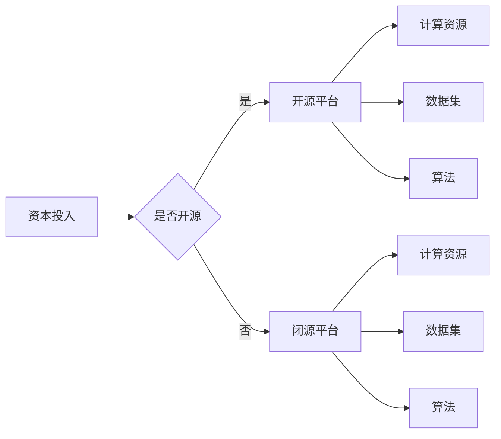

> 人工智能, 开源, 研究资源, 资本密集型, 深度学习, 云计算, 算法优化, 产学研合作

# 资本密集型AI研究:开源的机遇与挑战

人工智能（AI）的快速发展离不开大量的研究投入和资本支持。资本密集型AI研究，尤其体现在深度学习和大数据分析等领域，需要海量的计算资源、数据集和人才。开源在AI研究中扮演着越来越重要的角色，它既带来了巨大的机遇，也带来了不少挑战。本文将深入探讨资本密集型AI研究的开源现状，分析其机遇与挑战，并展望未来的发展趋势。

## 1. 背景介绍

随着计算能力的提升和大数据的积累，深度学习等AI技术在各个领域取得了显著进展。然而，这些技术的研发和应用往往需要大量的资本投入，包括高性能计算资源、高质量数据集、以及专业的研究人才。在这种情况下，开源成为了推动AI研究的重要力量。

### 1.1 问题的由来

传统的AI研究往往依赖于闭源的数据集和算法，这限制了研究的广度和深度。同时，高昂的研究成本也使得许多有潜力的研究项目难以启动。开源的出现，打破了这些壁垒，为AI研究提供了新的机遇。

### 1.2 研究现状

目前，开源在AI研究领域已经取得了显著的进展，主要体现在以下几个方面：

- **开源平台和框架**：如TensorFlow、PyTorch等，为研究人员提供了强大的工具和平台。
- **开源数据集**：如ImageNet、COCO等，为研究人员提供了大规模的数据资源。
- **开源算法**：如GANs、Transformer等，为研究人员提供了创新的算法思路。

### 1.3 研究意义

开源在AI研究中的意义在于：

- **降低研究门槛**：开源平台和框架降低了AI研究的门槛，使得更多的研究人员能够参与到AI研究中。
- **加速研究进程**：开源的数据集和算法可以促进研究成果的共享和复现，加速AI技术的进步。
- **促进创新**：开源环境鼓励创新和竞争，有助于产生更多突破性的研究成果。

## 2. 核心概念与联系

### 2.1 核心概念原理和架构的 Mermaid 流程图



### 2.2 核心概念解释

- **资本投入**：指用于AI研究的资金、设备、人力等资源。
- **开源平台**：指提供开源软件和工具的平台，如TensorFlow、PyTorch等。
- **闭源平台**：指提供闭源软件和工具的平台，通常由商业公司运营。
- **计算资源**：指用于AI研究的计算能力，如GPU、TPU等。
- **数据集**：指用于训练和测试AI模型的原始数据集合。
- **算法**：指用于解决特定问题的计算方法。

## 3. 核心算法原理 & 具体操作步骤

### 3.1 算法原理概述

资本密集型AI研究中的核心算法主要包括：

- **深度学习**：一种模拟人脑神经网络结构的学习方法，通过多层神经网络进行特征提取和模式识别。
- **强化学习**：一种通过与环境交互学习最优策略的方法，常用于游戏、机器人控制等领域。
- **迁移学习**：一种将预训练模型应用于新任务的方法，可以减少对新数据的标注需求。

### 3.2 算法步骤详解

以深度学习为例，其基本步骤包括：

1. **数据预处理**：对原始数据进行清洗、标注和格式化。
2. **模型选择**：选择合适的深度学习模型结构。
3. **模型训练**：使用预处理后的数据对模型进行训练。
4. **模型评估**：使用测试数据对模型进行评估和调整。
5. **模型部署**：将训练好的模型应用于实际场景。

### 3.3 算法优缺点

**深度学习**：

- **优点**：能够处理复杂的非线性问题，泛化能力强。
- **缺点**：需要大量的数据和计算资源，模型可解释性较差。

**强化学习**：

- **优点**：能够学习到复杂的决策策略，适应性强。
- **缺点**：训练过程复杂，收敛速度慢。

**迁移学习**：

- **优点**：可以减少对新数据的标注需求，提高训练效率。
- **缺点**：迁移效果受源域和目标域的相似度影响。

### 3.4 算法应用领域

深度学习、强化学习和迁移学习在各个领域都有广泛的应用，如：

- **计算机视觉**：图像识别、目标检测、图像分割等。
- **自然语言处理**：文本分类、机器翻译、情感分析等。
- **语音识别**：语音识别、语音合成、说话人识别等。
- **机器人学**：机器人控制、路径规划、环境感知等。

## 4. 数学模型和公式 & 详细讲解 & 举例说明

### 4.1 数学模型构建

以深度学习中的卷积神经网络（CNN）为例，其基本数学模型如下：

$$
f(x) = f^{[L]}(x) = f^{[L-1]}(f^{[L-2]}(...f^{[2]}(f^{[1]}(x))) 
$$

其中，$f^{[l]}$ 表示第 $l$ 层的激活函数，$f^{[1]}(x)$ 表示输入向量。

### 4.2 公式推导过程

以CNN中的卷积操作为例，其公式推导过程如下：

$$
h^{[l]}_i = \sigma(\mathbf{W}^{[l]} \mathbf{h}^{[l-1]} + b^{[l]}) 
$$

其中，$\mathbf{W}^{[l]}$ 是权重矩阵，$\mathbf{h}^{[l-1]}$ 是前一层神经元的输出，$b^{[l]}$ 是偏置项，$\sigma$ 是激活函数。

### 4.3 案例分析与讲解

以图像识别任务为例，分析CNN在图像识别中的工作原理：

1. **卷积层**：卷积层通过卷积操作提取图像的局部特征，如边缘、角点、纹理等。
2. **池化层**：池化层降低特征图的空间分辨率，减少计算量，同时保留重要特征。
3. **全连接层**：全连接层将特征图中的特征进行融合，并输出最终的分类结果。

## 5. 项目实践：代码实例和详细解释说明

### 5.1 开发环境搭建

以TensorFlow为例，搭建深度学习开发环境的基本步骤如下：

1. 安装TensorFlow：使用pip安装TensorFlow库。
2. 配置GPU支持：确保系统支持CUDA和cuDNN。
3. 配置Python环境：确保Python环境中安装了必要的依赖库。

### 5.2 源代码详细实现

以下是一个使用TensorFlow实现CNN图像识别任务的简单示例：

```python
import tensorflow as tf
from tensorflow.keras.models import Sequential
from tensorflow.keras.layers import Conv2D, MaxPooling2D, Flatten, Dense, Dropout

model = Sequential([
    Conv2D(32, (3, 3), activation='relu', input_shape=(64, 64, 3)),
    MaxPooling2D((2, 2)),
    Conv2D(64, (3, 3), activation='relu'),
    MaxPooling2D((2, 2)),
    Flatten(),
    Dense(128, activation='relu'),
    Dropout(0.5),
    Dense(10, activation='softmax')
])

model.compile(optimizer='adam', loss='sparse_categorical_crossentropy', metrics=['accuracy'])
model.fit(x_train, y_train, epochs=10, validation_data=(x_test, y_test))
```

### 5.3 代码解读与分析

- `Sequential`：创建一个线性堆叠的神经网络模型。
- `Conv2D`：卷积层，用于提取图像特征。
- `MaxPooling2D`：池化层，用于降低特征图的空间分辨率。
- `Flatten`：将特征图展平为一维向量。
- `Dense`：全连接层，用于输出最终的分类结果。
- `Dropout`：丢弃层，用于防止过拟合。

### 5.4 运行结果展示

通过训练和测试，可以得到模型的准确率、召回率等指标，从而评估模型在图像识别任务中的性能。

## 6. 实际应用场景

### 6.1 机器视觉

机器视觉是AI技术在工业、农业、医疗等领域的重要应用场景。开源的深度学习框架和算法为机器视觉系统的研发提供了强大的支持。

### 6.2 自然语言处理

自然语言处理在智能客服、智能翻译、情感分析等领域有着广泛的应用。开源的数据集和算法为NLP系统的开发提供了丰富的资源。

### 6.3 语音识别

语音识别技术在智能助手、语音控制等领域有着重要的应用价值。开源的语音识别框架和算法为语音识别系统的研发提供了便利。

## 7. 工具和资源推荐

### 7.1 学习资源推荐

- **在线课程**：Coursera、Udacity、edX等平台提供了丰富的深度学习课程。
- **技术书籍**：《深度学习》（Ian Goodfellow等）、《Python机器学习》（Sebastian Raschka等）等。

### 7.2 开发工具推荐

- **深度学习框架**：TensorFlow、PyTorch、Keras等。
- **开源数据集**：ImageNet、COCO、TIMIT等。

### 7.3 相关论文推荐

- **深度学习**：《Deep Learning》（Goodfellow等）、《Convolutional Neural Networks for Visual Recognition》（Krizhevsky等）等。
- **自然语言处理**：《Speech Recognition》（Dau et al.）、《Transformers: State-of-the-Art Natural Language Processing》（Vaswani等）等。

## 8. 总结：未来发展趋势与挑战

### 8.1 研究成果总结

本文从开源的视角，探讨了资本密集型AI研究的发展现状、核心概念、算法原理、应用场景等，并推荐了相关的学习资源和开发工具。

### 8.2 未来发展趋势

未来，开源在AI研究中的作用将更加重要，主要体现在以下几个方面：

- **开源社区将进一步壮大**：更多的研究人员和企业将参与到开源社区中，共同推动AI技术的发展。
- **开源平台将更加完善**：开源平台将提供更加丰富的工具和资源，降低AI研究的门槛。
- **开源与闭源的结合**：开源与闭源将更加紧密地结合，共同推动AI技术的进步。

### 8.3 面临的挑战

尽管开源为AI研究带来了巨大的机遇，但也面临着一些挑战：

- **数据安全与隐私**：开源数据集可能存在数据安全和隐私问题，需要制定相应的安全措施。
- **知识产权保护**：开源项目需要妥善保护知识产权，避免侵权行为。
- **技术标准和规范**：需要制定统一的技术标准和规范，促进开源社区的健康发展。

### 8.4 研究展望

展望未来，开源将继续在AI研究中发挥重要作用，推动AI技术的创新和发展。同时，我们也需要关注开源面临的挑战，并积极寻求解决方案，为AI技术的可持续发展贡献力量。

## 9. 附录：常见问题与解答

### 9.1 问题1：什么是开源？

答：开源是指软件的源代码可以被用户自由地查看、修改和分发。开源软件通常具有以下特点：

- **自由访问**：用户可以自由地访问软件的源代码。
- **自由修改**：用户可以自由地修改软件的源代码，以满足自己的需求。
- **自由分发**：用户可以自由地分发软件，包括修改后的版本。

### 9.2 问题2：开源有什么好处？

答：开源有以下好处：

- **降低成本**：开源软件通常免费使用，可以降低研发成本。
- **提高效率**：开源软件可以缩短开发周期，提高开发效率。
- **促进创新**：开源环境鼓励创新和竞争，有助于产生更多突破性的研究成果。

### 9.3 问题3：开源有什么挑战？

答：开源也面临着一些挑战，如：

- **知识产权保护**：开源项目需要妥善保护知识产权，避免侵权行为。
- **技术标准和规范**：需要制定统一的技术标准和规范，促进开源社区的健康发展。
- **数据安全和隐私**：开源数据集可能存在数据安全和隐私问题，需要制定相应的安全措施。

---

作者：禅与计算机程序设计艺术 / Zen and the Art of Computer Programming