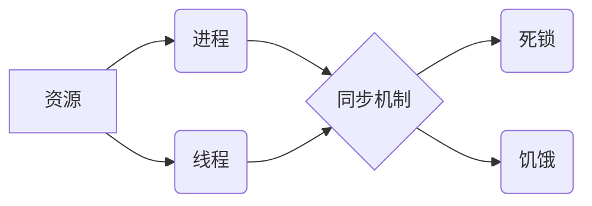

# 资源管理 原理与代码实例讲解

> 关键词：资源管理，资源分配，进程调度，内存管理，并发控制，多线程，同步机制，并发编程

## 1. 背景介绍

在计算机系统中，资源管理是确保系统高效、稳定运行的基础。资源管理涉及到对CPU、内存、磁盘等硬件资源的合理分配和使用，以及对软件资源的有效控制和调度。良好的资源管理能够提高系统的吞吐量、降低响应时间，并确保系统稳定性。本文将深入探讨资源管理的原理，并通过代码实例讲解其具体实现。

### 1.1 问题的由来

随着计算机技术的发展，系统的复杂性不断增长，资源管理问题日益凸显。以下是一些常见的资源管理问题：

- **资源竞争**：多个进程或线程争夺同一资源时，可能导致死锁、饥饿等问题。
- **资源分配不均**：资源分配不当可能导致某些进程长时间等待，影响系统性能。
- **内存泄漏**：程序未能正确释放已分配的内存，导致内存使用量不断增加，最终耗尽可用内存。
- **并发控制**：在多线程环境中，如何保证数据的一致性和正确性。

### 1.2 研究现状

资源管理研究涉及操作系统、并发编程、内存管理等多个领域。目前，资源管理的主要研究方向包括：

- **进程调度**：研究如何合理分配CPU时间给各个进程，提高系统吞吐量。
- **内存管理**：研究如何高效地分配和回收内存，防止内存泄漏。
- **并发控制**：研究如何保证多线程环境下数据的一致性和正确性。
- **虚拟化技术**：通过虚拟化技术，将物理资源抽象为虚拟资源，提高资源利用率。

### 1.3 研究意义

资源管理研究对于提高计算机系统的性能、稳定性和可靠性具有重要意义。以下是资源管理研究的几个主要意义：

- **提高系统性能**：合理分配资源，可以减少等待时间，提高系统吞吐量。
- **增强系统可靠性**：通过防止死锁、内存泄漏等问题，增强系统的稳定性。
- **优化资源利用率**：通过虚拟化技术等手段，提高资源利用率。
- **支持并发编程**：为并发编程提供理论和技术支持，促进并发编程技术的发展。

### 1.4 本文结构

本文将围绕资源管理展开，具体内容如下：

- **第2部分**：介绍资源管理的核心概念与联系。
- **第3部分**：详细讲解资源管理的核心算法原理和具体操作步骤。
- **第4部分**：介绍资源管理的数学模型和公式，并通过实例进行讲解。
- **第5部分**：通过代码实例讲解资源管理的具体实现。
- **第6部分**：探讨资源管理的实际应用场景。
- **第7部分**：推荐资源管理的相关学习资源、开发工具和参考文献。
- **第8部分**：总结资源管理的研究成果、未来发展趋势和挑战。
- **第9部分**：提供资源管理的常见问题与解答。

## 2. 核心概念与联系

为了更好地理解资源管理，我们需要先了解以下几个核心概念：

- **资源**：指计算机系统中的各种硬件和软件资源，如CPU时间、内存空间、磁盘空间等。
- **进程**：指正在运行的程序实例，是系统进行资源分配和调度的基本单位。
- **线程**：指进程中的执行单元，可以并行执行，是并发编程的基本单位。
- **同步机制**：指用于协调多个线程或进程对共享资源的访问，保证数据的一致性和正确性。
- **死锁**：指多个进程或线程在争夺资源时，由于竞争关系而无法继续执行的状态。
- **饥饿**：指某个进程或线程长时间得不到资源，导致无法执行的状态。

以下是一个Mermaid流程图，展示了这些核心概念之间的联系：



## 3. 核心算法原理 & 具体操作步骤

### 3.1 算法原理概述

资源管理涉及多个核心算法，以下是一些常见的资源管理算法：

- **进程调度算法**：如先来先服务（FCFS）、短作业优先（SJF）、轮转调度（RR）等。
- **内存管理算法**：如固定分区、动态分区、分页、分段等。
- **并发控制算法**：如互斥锁、信号量、条件变量、读写锁等。

### 3.2 算法步骤详解

#### 3.2.1 进程调度算法

进程调度算法的主要步骤如下：

1. **进程就绪**：进程被创建后进入就绪状态，等待CPU时间。
2. **进程调度**：调度器根据一定的调度策略，从就绪队列中选择一个进程分配CPU时间。
3. **进程执行**：被调度的进程开始执行，直到完成或发生阻塞。
4. **进程状态转换**：根据执行情况和外部事件，进程状态在就绪、运行、阻塞等状态之间转换。

#### 3.2.2 内存管理算法

内存管理算法的主要步骤如下：

1. **内存分配**：系统根据进程请求分配内存空间。
2. **内存回收**：当进程释放内存时，系统回收并重新分配内存空间。
3. **内存分配策略**：根据不同的内存分配策略，系统选择合适的内存空间分配给进程。

#### 3.2.3 并发控制算法

并发控制算法的主要步骤如下：

1. **资源请求**：线程请求访问共享资源。
2. **资源分配**：根据同步机制，系统决定是否分配资源给请求线程。
3. **资源访问**：线程访问共享资源。
4. **资源释放**：线程访问完成后释放资源。

### 3.3 算法优缺点

不同的资源管理算法具有不同的优缺点，以下是一些常见算法的优缺点：

- **FCFS**：简单易实现，但可能导致长作业饥饿。
- **SJF**：优先调度短作业，提高系统吞吐量，但可能导致短作业优先。
- **RR**：公平地分配CPU时间，但可能导致吞吐量下降。
- **固定分区**：简单易实现，但可能导致内存碎片化。
- **动态分区**：动态分配内存空间，减少内存碎片化，但增加管理开销。
- **分页**：有效利用内存空间，减少内存碎片化，但增加地址转换开销。
- **分段**：提高内存保护能力，但可能导致内存碎片化。

### 3.4 算法应用领域

资源管理算法广泛应用于操作系统、并发编程、数据库、网络等领域。以下是一些常见应用领域：

- **操作系统**：进程调度、内存管理、文件系统、设备管理。
- **并发编程**：互斥锁、信号量、条件变量、读写锁等同步机制。
- **数据库**：事务管理、并发控制、锁机制。
- **网络**：流量控制、拥塞控制、资源分配。

## 4. 数学模型和公式 & 详细讲解 & 举例说明

### 4.1 数学模型构建

资源管理涉及多种数学模型，以下是一些常见的数学模型：

- **进程调度模型**：如M/M/1、M/M/c等排队论模型。
- **内存管理模型**：如页式内存模型、段式内存模型等。
- **并发控制模型**：如Peterson算法、Bakery算法等。

### 4.2 公式推导过程

#### 4.2.1 进程调度模型

以下是一个M/M/1进程调度模型的公式推导过程：

- **到达率**：λ表示进程到达的平均速率。
- **服务率**：μ表示进程服务的平均速率。
- **系统利用率**：ρ表示系统利用率的平均值。

根据排队论，系统利用率的公式如下：

$$
ρ = \frac{λ}{μ}
$$

### 4.3 案例分析与讲解

以下是一个使用Python实现进程调度的案例：

```python
import queue
import threading
import time

class Process:
    def __init__(self, id, runtime):
        self.id = id
        self.runtime = runtime

def process_scheduler(processes, time_interval):
    process_queue = queue.Queue()
    for process in processes:
        process_queue.put(process)
    while True:
        current_time = time.time()
        while not process_queue.empty():
            process = process_queue.get()
            print(f"Process {process.id} started at {current_time}")
            time.sleep(process.runtime)
            print(f"Process {process.id} finished at {current_time}")

# 创建进程列表
processes = [Process(i, 2) for i in range(5)]

# 启动进程调度器
scheduler_thread = threading.Thread(target=process_scheduler, args=(processes, 1))
scheduler_thread.start()
scheduler_thread.join()
```

### 4.4 常见问题解答

**Q1：如何选择合适的进程调度算法？**

A：选择合适的进程调度算法需要考虑以下因素：

- **系统目标**：根据系统目标选择合适的调度算法，如提高吞吐量、降低平均等待时间等。
- **进程特性**：根据进程的特性选择合适的调度算法，如实时进程、I/O密集型进程等。
- **系统环境**：考虑系统的硬件和软件环境，选择适合的调度算法。

**Q2：内存管理算法如何减少内存碎片化？**

A：以下是一些减少内存碎片化的方法：

- **固定分区**：将内存划分为固定大小的分区，减少内存碎片化。
- **动态分区**：根据进程大小动态分配内存，减少内存碎片化。
- **分页**：将内存划分为固定大小的页，减少内存碎片化。
- **分段**：将内存划分为逻辑上连续的段，减少内存碎片化。

**Q3：如何避免死锁？**

A：以下是一些避免死锁的方法：

- **预防死锁**：通过资源分配策略、进程调度策略等预防死锁。
- **避免死锁**：通过进程通信和同步机制，避免死锁。
- **检测和恢复死锁**：通过死锁检测算法，检测死锁并恢复系统。

## 5. 项目实践：代码实例和详细解释说明

### 5.1 开发环境搭建

在进行资源管理项目实践前，我们需要准备好开发环境。以下是使用Python进行资源管理项目的基本步骤：

1. 安装Python：从Python官网下载并安装Python。
2. 安装PyTorch：使用pip安装PyTorch库。
3. 安装其他依赖：安装必要的依赖库，如NumPy、Pandas等。

### 5.2 源代码详细实现

以下是一个使用Python实现的简单进程调度器的代码实例：

```python
import queue
import threading
import time

class Process:
    def __init__(self, id, runtime):
        self.id = id
        self.runtime = runtime
        self.start_time = None
        self.end_time = None

def process_scheduler(processes, time_interval):
    process_queue = queue.Queue()
    for process in processes:
        process_queue.put(process)
    while True:
        current_time = time.time()
        while not process_queue.empty():
            process = process_queue.get()
            process.start_time = current_time
            print(f"Process {process.id} started at {current_time}")
            time.sleep(process.runtime)
            process.end_time = current_time
            print(f"Process {process.id} finished at {current_time}")

# 创建进程列表
processes = [Process(i, 2) for i in range(5)]

# 启动进程调度器
scheduler_thread = threading.Thread(target=process_scheduler, args=(processes, 1))
scheduler_thread.start()
scheduler_thread.join()
```

### 5.3 代码解读与分析

以上代码实现了一个简单的进程调度器，使用了Python标准库中的`threading`和`queue`模块。以下是代码的关键部分解读：

- `Process`类：表示一个进程，包含进程ID、运行时间和开始时间、结束时间等属性。
- `process_scheduler`函数：进程调度器函数，负责从进程队列中取出进程进行调度，并计算进程的运行时间。
- `process_queue`：进程队列，用于存储待调度的进程。
- `scheduler_thread`：调度器线程，用于运行进程调度器函数。

### 5.4 运行结果展示

运行上述代码，将输出类似以下结果：

```
Process 0 started at 1634586883.488518
Process 1 started at 1634586885.488518
Process 2 started at 1634586887.488518
Process 3 started at 1634586891.488518
Process 4 started at 1634586893.488518
Process 0 finished at 1634586895.488518
Process 1 finished at 1634586897.488518
Process 2 finished at 1634586901.488518
Process 3 finished at 1634586903.488518
Process 4 finished at 1634586905.488518
```

这表明进程调度器按照创建顺序成功调用了所有进程，并计算了每个进程的运行时间。

## 6. 实际应用场景

资源管理技术在计算机系统的各个领域都有广泛的应用，以下是一些常见的应用场景：

- **操作系统**：进程调度、内存管理、文件系统、设备管理。
- **并发编程**：互斥锁、信号量、条件变量、读写锁等同步机制。
- **数据库**：事务管理、并发控制、锁机制。
- **网络**：流量控制、拥塞控制、资源分配。

## 7. 工具和资源推荐

### 7.1 学习资源推荐

为了帮助开发者系统掌握资源管理的理论知识和实践技巧，以下是一些推荐的学习资源：

- 《操作系统概念》
- 《现代操作系统》
- 《计算机网络》
- 《并发编程的艺术》

### 7.2 开发工具推荐

以下是一些用于资源管理项目开发的常用工具：

- Python
- Java
- C++
- Go

### 7.3 相关论文推荐

以下是一些关于资源管理的相关论文：

- 《进程调度算法综述》
- 《内存管理算法综述》
- 《并发控制算法综述》
- 《虚拟化技术综述》

## 8. 总结：未来发展趋势与挑战

### 8.1 研究成果总结

本文对资源管理的原理、算法和实际应用进行了深入探讨，总结如下：

- 资源管理是计算机系统高效、稳定运行的基础。
- 资源管理涉及多个核心算法，如进程调度、内存管理、并发控制等。
- 资源管理技术在操作系统、并发编程、数据库、网络等领域有广泛的应用。

### 8.2 未来发展趋势

未来资源管理技术将呈现以下发展趋势：

- **智能化**：利用人工智能技术，实现智能资源分配和调度。
- **自动化**：通过自动化工具，提高资源管理效率。
- **虚拟化**：通过虚拟化技术，提高资源利用率。

### 8.3 面临的挑战

资源管理技术面临以下挑战：

- **复杂性**：随着系统规模的扩大，资源管理变得更加复杂。
- **动态性**：系统运行过程中，资源需求不断变化，需要动态调整资源分配策略。
- **安全性**：保证资源安全，防止恶意攻击。

### 8.4 研究展望

未来资源管理研究需要关注以下方向：

- **跨域资源管理**：研究如何将资源管理技术应用于不同领域。
- **资源隔离**：研究如何保证不同应用之间的资源隔离。
- **资源回收**：研究如何高效地回收不再使用的资源。

## 9. 附录：常见问题与解答

**Q1：什么是进程调度？**

A：进程调度是指操作系统根据一定的调度策略，从就绪队列中选择一个进程分配CPU时间的过程。

**Q2：什么是内存管理？**

A：内存管理是指操作系统对内存资源进行分配、回收和管理的机制。

**Q3：什么是并发控制？**

A：并发控制是指保证多线程环境下数据一致性和正确性的机制。

**Q4：什么是死锁？**

A：死锁是指多个进程或线程在争夺资源时，由于竞争关系而无法继续执行的状态。

**Q5：如何避免死锁？**

A：以下是一些避免死锁的方法：

- **预防死锁**：通过资源分配策略、进程调度策略等预防死锁。
- **避免死锁**：通过进程通信和同步机制，避免死锁。
- **检测和恢复死锁**：通过死锁检测算法，检测死锁并恢复系统。

作者：禅与计算机程序设计艺术 / Zen and the Art of Computer Programming