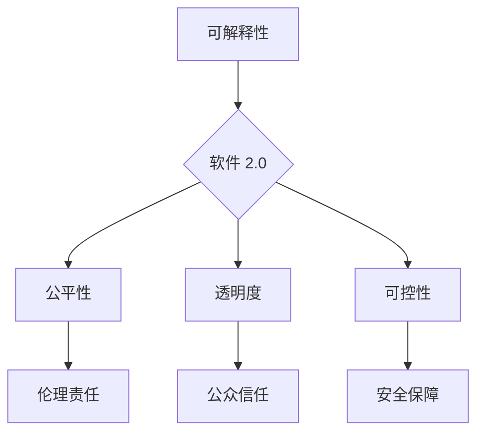

## 软件 2.0 的社会责任：科技向善

> 关键词：人工智能、软件伦理、社会责任、可解释性、公平性、透明度、可控性

### 1. 背景介绍

软件已经深刻地融入到我们生活的方方面面，从智能手机到自动驾驶汽车，再到医疗诊断和金融交易，软件无处不在。随着人工智能（AI）技术的飞速发展，软件正在经历一场深刻的变革，我们正迈入软件 2.0 时代。

软件 2.0 具有以下显著特征：

* **智能化:**  软件能够学习、适应和自主决策，具备更强的智能能力。
* **数据驱动:**  软件依赖海量数据进行训练和优化，数据成为软件的核心驱动力。
* **网络化:**  软件更加注重连接和协作，形成庞大的网络生态系统。
* **平台化:**  软件以平台为基础，提供开放的接口和服务，促进软件的复用和创新。

然而，软件 2.0 的发展也带来了新的挑战和风险。例如，AI 算法的决策过程往往难以理解，这可能导致算法的偏见和歧视，引发伦理和社会问题。此外，软件的网络化和平台化也可能带来新的安全和隐私风险。

因此，在软件 2.0 时代，我们需要更加重视软件的社会责任，确保科技向善，造福人类。

### 2. 核心概念与联系

软件 2.0 的社会责任主要体现在以下几个核心概念上：

* **可解释性:**  指 AI 算法的决策过程能够被人类理解和解释。
* **公平性:**  指 AI 算法对所有用户都公平公正，不产生歧视和偏见。
* **透明度:**  指 AI 算法的运作机制和数据来源能够被公开透明。
* **可控性:**  指人类能够对 AI 算法的决策过程进行监督和控制。

这些核心概念相互关联，共同构成了软件 2.0 的社会责任框架。



### 3. 核心算法原理 & 具体操作步骤

#### 3.1  算法原理概述

可解释性是软件 2.0 社会责任的核心概念之一。可解释 AI 算法是指能够解释其决策过程的 AI 算法。

目前，常用的可解释 AI 算法包括：

* **局部解释方法:**  例如 LIME 和 SHAP，通过分析单个预测实例的特征贡献，解释模型对该实例的预测结果。
* **全局解释方法:**  例如决策树和规则列表，通过构建模型的全局结构，解释模型的整体决策逻辑。

#### 3.2  算法步骤详解

以 LIME 方法为例，其具体操作步骤如下：

1. **选择一个预测实例:**  从待解释的数据集中选择一个实例。
2. **生成局部扰动样本集:**  对该实例进行局部扰动，生成一个包含多个扰动样本的集合。
3. **对扰动样本集进行预测:**  使用目标 AI 算法对扰动样本集进行预测。
4. **构建局部模型:**  使用线性回归等方法，构建一个局部模型，将扰动样本的特征和预测结果进行拟合。
5. **解释预测结果:**  通过局部模型的系数，解释模型对该实例预测结果的贡献。

#### 3.3  算法优缺点

**优点:**

* 可以解释单个预测实例的决策过程。
* 适用于各种类型的 AI 算法。

**缺点:**

* 局部解释方法可能无法解释模型的整体决策逻辑。
* 需要大量的计算资源进行扰动样本的生成和模型训练。

#### 3.4  算法应用领域

可解释 AI 算法在医疗诊断、金融风险评估、法律判决等领域具有广泛的应用前景。

### 4. 数学模型和公式 & 详细讲解 & 举例说明

#### 4.1  数学模型构建

LIME 方法的核心是构建一个局部线性模型，用于近似目标 AI 算法的决策过程。假设目标 AI 算法为 f(x)，其中 x 是输入特征向量，y 是预测结果。LIME 方法的目标是找到一个局部线性模型 g(x)，使得 g(x) 在 x 附近与 f(x) 的预测结果尽可能接近。

#### 4.2  公式推导过程

LIME 方法使用最小二乘法来训练局部线性模型 g(x)。目标函数为：

$$
L(g) = \sum_{x_i \in S} (f(x_i) - g(x_i))^2
$$

其中，S 是扰动样本集，g(x) 是局部线性模型。

通过求解该目标函数的最小值，可以得到最优的局部线性模型 g(x)。

#### 4.3  案例分析与讲解

假设我们有一个目标 AI 算法用于预测房价，输入特征包括房屋面积、房间数量、地理位置等。

使用 LIME 方法解释该算法对某一特定房屋的预测结果，可以生成一个局部线性模型，例如：

$$
\text{房价} = 10000 \times \text{面积} + 5000 \times \text{房间数量} - 2000 \times \text{距离市中心}
$$

该模型表明，该算法认为房屋面积、房间数量和距离市中心的距离是影响房价的主要因素。

### 5. 项目实践：代码实例和详细解释说明

#### 5.1  开发环境搭建

* Python 3.6+
* scikit-learn
* lime

#### 5.2  源代码详细实现

```python
from sklearn.ensemble import RandomForestClassifier
from lime import lime_tabular

# 加载数据
#...

# 训练模型
model = RandomForestClassifier()
model.fit(X_train, y_train)

# 选择一个实例进行解释
instance = X_test[0]

# 使用 LIME 方法解释模型的预测结果
explainer = lime_tabular.LimeTabularExplainer(X_train, feature_names=feature_names, class_names=class_names)
explanation = explainer.explain_instance(instance, model.predict_proba, top_labels=1)

# 可视化解释结果
explanation.as_pyplot_figure()
```

#### 5.3  代码解读与分析

* 首先，我们加载数据并训练一个随机森林分类模型。
* 然后，我们使用 LIME 方法解释模型对一个特定实例的预测结果。
* LIME 方法会生成一个局部线性模型，解释模型对该实例预测结果的贡献。
* 最后，我们使用 matplotlib 库可视化解释结果。

#### 5.4  运行结果展示

LIME 方法会生成一个可视化图，显示模型对该实例预测结果的贡献。

### 6. 实际应用场景

#### 6.1  医疗诊断

可解释 AI 算法可以帮助医生理解 AI 诊断结果背后的原因，提高诊断的准确性和可靠性。

#### 6.2  金融风险评估

可解释 AI 算法可以帮助金融机构理解 AI 风险评估结果背后的原因，提高风险管理的效率和准确性。

#### 6.3  法律判决

可解释 AI 算法可以帮助法官理解 AI 法律判决结果背后的原因，提高判决的公正性和透明度。

#### 6.4  未来应用展望

随着 AI 技术的不断发展，可解释 AI 算法将在更多领域得到应用，例如自动驾驶、教育、个性化推荐等。

### 7. 工具和资源推荐

#### 7.1  学习资源推荐

* **论文:**  "Towards Transparent and Interpretable Machine Learning"
* **书籍:**  "Interpretable Machine Learning"

#### 7.2  开发工具推荐

* **LIME:**  https://github.com/marcotcr/lime
* **SHAP:**  https://github.com/slundberg/shap

#### 7.3  相关论文推荐

* "Local Interpretable Model-Agnostic Explanations"
* "SHAP: A Unified Approach to Interpreting Model Predictions"

### 8. 总结：未来发展趋势与挑战

#### 8.1  研究成果总结

可解释 AI 算法的发展取得了显著进展，为解决软件 2.0 的社会责任问题提供了新的思路和方法。

#### 8.2  未来发展趋势

* **更强大的解释能力:**  未来可解释 AI 算法将能够解释更复杂的 AI 模型，并提供更深入的解释。
* **更广泛的应用场景:**  可解释 AI 算法将在更多领域得到应用，例如自动驾驶、医疗诊断、金融风险评估等。
* **更易于使用的工具:**  未来将出现更多易于使用的可解释 AI 工具，方便普通用户使用。

#### 8.3  面临的挑战

* **算法复杂性:**  一些 AI 算法过于复杂，难以解释其决策过程。
* **数据隐私:**  解释 AI 算法可能需要访问敏感数据，需要考虑数据隐私问题。
* **解释结果的可信度:**  解释 AI 算法的结果可能存在误差，需要评估其可信度。

#### 8.4  研究展望

未来研究将重点关注以下几个方面：

* 开发更强大的可解释 AI 算法。
* 构建可解释 AI 的标准和规范。
* 研究可解释 AI 的伦理和社会影响。

### 9. 附录：常见问题与解答

**Q1:  为什么需要可解释 AI？**

**A1:**  可解释 AI 可以帮助我们理解 AI 算法的决策过程，提高 AI 的透明度和可信度。

**Q2:  所有 AI 算法都可以解释吗？**

**A2:**  目前，并非所有 AI 算法都可以解释。一些 AI 算法过于复杂，难以解释其决策过程。

**Q3:  如何评估可解释 AI 的结果？**

**A3:**  可解释 AI 的结果需要根据具体应用场景进行评估，例如，在医疗诊断领域，需要评估解释结果的准确性和可靠性。


作者：禅与计算机程序设计艺术 / Zen and the Art of Computer Programming 
