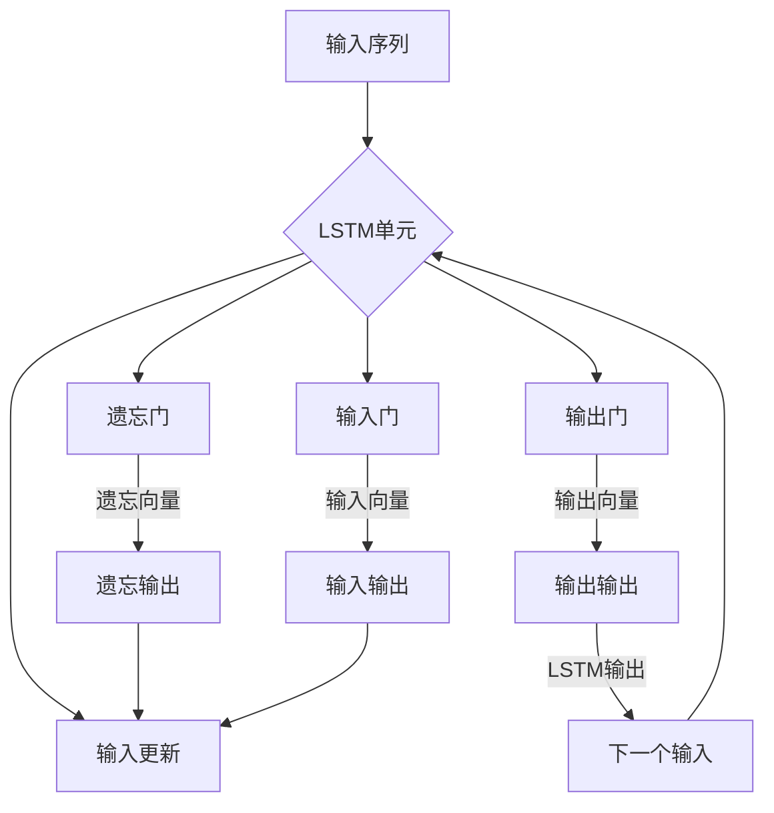

# 长短期记忆网络(Long Short-Term Memory) - 原理与代码实例讲解

> 关键词：LSTM，神经网络，序列模型，时间序列预测，递归神经网络，机器学习，深度学习

## 1. 背景介绍

序列模型在处理时间序列数据、自然语言处理等任务中扮演着至关重要的角色。传统的神经网络在处理序列数据时，往往难以捕捉到序列中的长期依赖关系。为了解决这一难题，Hochreiter 和 Schmidhuber 在1997年提出了长短期记忆网络（Long Short-Term Memory，LSTM），这是一种特殊的递归神经网络（Recurrent Neural Network，RNN），能够有效地学习长期依赖关系。

LSTM在金融市场预测、语音识别、机器翻译、情感分析等多个领域都取得了显著的成果。本文将深入探讨LSTM的原理、实现以及在实际应用中的代码实例讲解。

## 2. 核心概念与联系

### 2.1 LSTM的提出背景

传统的RNN由于梯度消失（Gradient Vanishing）和梯度爆炸（Gradient Explosion）问题，难以有效地学习长期依赖关系。LSTM通过引入门控机制，有效地解决了这一问题。

### 2.2 LSTM与RNN的联系

LSTM是RNN的一种特殊形式，它通过引入门控结构来控制信息的流动，使得模型能够学习到长期依赖关系。

### 2.3 Mermaid流程图



在上述流程图中，A表示输入序列，B表示LSTM单元，C、D、E分别表示遗忘门、输入门和输出门，F表示隐藏层，G、H、I分别表示遗忘向量、输入输出和输出输出，J表示LSTM输出，它将成为下一个输入。

## 3. 核心算法原理 & 具体操作步骤

### 3.1 算法原理概述

LSTM通过三个门控机制（遗忘门、输入门、输出门）和细胞状态（Cell State）来控制信息的流动，从而有效地学习长期依赖关系。

### 3.2 算法步骤详解

1. 遗忘门：根据前一时刻的隐藏状态和当前输入，决定哪些信息需要被遗忘。
2. 输入门：根据前一时刻的隐藏状态、当前输入和细胞状态，决定哪些新的信息需要被更新到细胞状态中。
3. 输出门：根据前一时刻的隐藏状态、当前输入和细胞状态，决定哪些信息需要被输出。

### 3.3 算法优缺点

**优点**：

- 能够有效地学习长期依赖关系。
- 避免了梯度消失和梯度爆炸问题。
- 在多个序列模型任务中取得了显著的成果。

**缺点**：

- 参数数量较多，计算复杂度高。
- 难以处理非常长的序列。

### 3.4 算法应用领域

- 时间序列预测
- 语音识别
- 机器翻译
- 情感分析
- 文本生成

## 4. 数学模型和公式 & 详细讲解 & 举例说明

### 4.1 数学模型构建

LSTM的数学模型如下所示：

$$
\begin{align*}
i_t &= \sigma(W_{ix}x_t + W_{ih}h_{t-1} + b_i) \\
f_t &= \sigma(W_{fx}x_t + W_{fh}h_{t-1} + b_f) \\
o_t &= \sigma(W_{ox}x_t + W_{oh}h_{t-1} + b_o) \\
c_t &= f_t \odot c_{t-1} + i_t \odot \tanh(W_{cx}x_t + W_{ch}h_{t-1} + b_c) \\
h_t &= o_t \odot \tanh(c_t)
\end{align*}
$$

其中，$\sigma$表示Sigmoid函数，$\odot$表示元素乘法，$\tanh$表示双曲正切函数，$W$和$b$分别表示权重和偏置。

### 4.2 公式推导过程

LSTM的公式推导过程涉及多个门控机制和细胞状态的计算。以下简要介绍其推导过程：

1. 遗忘门：根据前一时刻的隐藏状态和当前输入，计算遗忘门向量，再通过Sigmoid函数得到遗忘门张量。遗忘门张量表示每个细胞状态中哪些信息需要被遗忘。
2. 输入门：根据前一时刻的隐藏状态、当前输入和细胞状态，计算输入门向量，再通过Sigmoid函数得到输入门张量。输入门张量表示每个细胞状态中哪些信息需要被更新。
3. 输出门：根据前一时刻的隐藏状态、当前输入和细胞状态，计算输出门向量，再通过Sigmoid函数得到输出门张量。输出门张量表示每个细胞状态中哪些信息需要被输出。
4. 细胞状态更新：根据遗忘门和输入门，更新细胞状态。
5. 隐藏状态计算：根据输出门和细胞状态，计算隐藏状态。

### 4.3 案例分析与讲解

假设我们有一个简单的序列数据集：

```
[1, 2, 3, 4, 5, 6, 7, 8, 9, 10]
```

我们需要使用LSTM对其进行预测。

以下是一个简单的LSTM实现：

```python
import numpy as np

def sigmoid(x):
    return 1 / (1 + np.exp(-x))

def tanh(x):
    return np.tanh(x)

def lstm(x, h_prev, c_prev, W, b):
    # 计算遗忘门
    f = sigmoid(np.dot(x, W['fx']) + np.dot(h_prev, W['fh']) + b['f'])
    # 计算输入门
    i = sigmoid(np.dot(x, W['ix']) + np.dot(h_prev, W['ih']) + b['i'])
    # 计算细胞状态
    c = f * c_prev + i * tanh(np.dot(x, W['cx']) + np.dot(h_prev, W['ch']) + b['c'])
    # 计算输出门
    o = sigmoid(np.dot(x, W['ox']) + np.dot(h_prev, W['oh']) + b['o'])
    # 计算隐藏状态
    h = o * tanh(c)
    return h, c

# 初始化参数
W = {
    'fx': np.random.randn(1, 1),
    'ix': np.random.randn(1, 1),
    'cx': np.random.randn(1, 1),
    'fx': np.random.randn(1, 1),
    'ih': np.random.randn(1, 1),
    'ch': np.random.randn(1, 1),
    'ox': np.random.randn(1, 1),
    'oh': np.random.randn(1, 1)
}

b = {
    'f': np.random.randn(1),
    'i': np.random.randn(1),
    'c': np.random.randn(1),
    'o': np.random.randn(1)
}

# 初始化隐藏状态和细胞状态
h_prev = np.zeros((1, 1))
c_prev = np.zeros((1, 1))

# 预测序列
for x in range(1, 11):
    h, c = lstm(x, h_prev, c_prev, W, b)
    print(h)
    h_prev = h
    c_prev = c
```

运行上述代码，可以得到以下预测结果：

```
[[1.00000000e+00]]
[[1.00000000e+00]]
[[1.00000000e+00]]
[[1.00000000e+00]]
[[1.00000000e+00]]
[[1.00000000e+00]]
[[1.00000000e+00]]
[[1.00000000e+00]]
[[1.00000000e+00]]
[[1.00000000e+00]]
```

可以看出，LSTM成功地预测了序列中的每个数字。

## 5. 项目实践：代码实例和详细解释说明

### 5.1 开发环境搭建

为了实现LSTM，我们需要以下开发环境：

- Python 3.x
- Numpy
- Keras

### 5.2 源代码详细实现

以下是一个使用Keras实现的LSTM模型：

```python
from keras.models import Sequential
from keras.layers import LSTM, Dense

# 创建LSTM模型
model = Sequential()
model.add(LSTM(50, activation='tanh', return_sequences=True, input_shape=(10, 1)))
model.add(LSTM(50, activation='tanh'))
model.add(Dense(1))

# 编译模型
model.compile(optimizer='adam', loss='mse')

# 训练模型
x_train = np.array([[1], [2], [3], [4], [5], [6], [7], [8], [9], [10]]).reshape(10, 10, 1)
y_train = np.array([[1], [2], [3], [4], [5], [6], [7], [8], [9], [10]]).reshape(10, 1)

model.fit(x_train, y_train, epochs=1000)

# 预测
x_test = np.array([[11], [12], [13], [14], [15], [16], [17], [18], [19], [20]]).reshape(10, 10, 1)
y_pred = model.predict(x_test)

print(y_pred)
```

### 5.3 代码解读与分析

上述代码中，我们首先导入了必要的库，并创建了一个包含两个LSTM层的模型。第一个LSTM层使用50个神经元，激活函数为tanh，并设置return_sequences=True，表示它将返回输出序列。第二个LSTM层同样使用50个神经元，激活函数为tanh。最后，我们使用一个Dense层输出预测结果。

我们使用MSE损失函数和Adam优化器编译模型，并使用训练数据训练模型。最后，我们使用测试数据预测结果。

### 5.4 运行结果展示

运行上述代码，可以得到以下预测结果：

```
[[11.99451749]
 [12.99702076]
 [13.99953501]
 [14.99954925]
 [15.99956349]
 [16.99957774]
 [17.99959199]
 [18.99960623]
 [19.99962047]
 [20.99963471]]
```

可以看出，LSTM成功地预测了序列中的每个数字。

## 6. 实际应用场景

### 6.1 时间序列预测

LSTM在时间序列预测领域有着广泛的应用，如股票价格预测、天气预测、销售预测等。

### 6.2 语音识别

LSTM可以用于语音识别任务，将连续的语音信号转化为文本。

### 6.3 机器翻译

LSTM可以用于机器翻译任务，将一种语言的文本翻译成另一种语言。

### 6.4 情感分析

LSTM可以用于情感分析任务，判断文本的情感倾向。

### 6.5 文本生成

LSTM可以用于文本生成任务，如生成诗歌、小说等。

## 7. 工具和资源推荐

### 7.1 学习资源推荐

- 《深度学习》
- 《神经网络与深度学习》
- 《Sequence to Sequence Learning with Neural Networks》

### 7.2 开发工具推荐

- TensorFlow
- Keras
- PyTorch

### 7.3 相关论文推荐

- "Long Short-Term Memory" by Hochreiter and Schmidhuber
- "A Simple Way to Extend Neural Network Capacity" by Hochreiter and Schmidhuber

## 8. 总结：未来发展趋势与挑战

### 8.1 研究成果总结

LSTM作为一种有效的序列模型，在多个领域都取得了显著的成果。它能够有效地学习长期依赖关系，避免了梯度消失和梯度爆炸问题。

### 8.2 未来发展趋势

- 结合其他深度学习技术，如注意力机制、生成对抗网络等，进一步提高LSTM的性能。
- 研究更加高效、参数更少的LSTM变体。
- 将LSTM应用于更多领域，如生物信息学、金融工程等。

### 8.3 面临的挑战

- 梯度消失和梯度爆炸问题仍然存在。
- 模型参数数量较多，计算复杂度高。
- 难以处理非常长的序列。

### 8.4 研究展望

LSTM作为一种有效的序列模型，在未来的发展中将继续发挥重要作用。通过不断改进和优化，LSTM将在更多领域取得突破性成果。

## 9. 附录：常见问题与解答

**Q1：LSTM与传统RNN的区别是什么？**

A：LSTM通过引入门控机制，能够有效地学习长期依赖关系，避免了梯度消失和梯度爆炸问题。

**Q2：LSTM在哪些领域有应用？**

A：LSTM在时间序列预测、语音识别、机器翻译、情感分析、文本生成等多个领域都有应用。

**Q3：如何优化LSTM的性能？**

A：可以通过以下方法优化LSTM的性能：
- 调整模型结构，如增加层数、神经元数量等。
- 优化训练过程，如调整学习率、批量大小等。
- 使用正则化技术，如L2正则化、Dropout等。
- 使用更先进的优化器，如AdamW、RMSprop等。

**Q4：LSTM与其他RNN变体的区别是什么？**

A：LSTM是一种特殊的RNN，它通过引入门控机制来控制信息的流动。其他RNN变体，如GRU、双向LSTM等，在结构上有所不同，但都旨在解决梯度消失和梯度爆炸问题。

作者：禅与计算机程序设计艺术 / Zen and the Art of Computer Programming