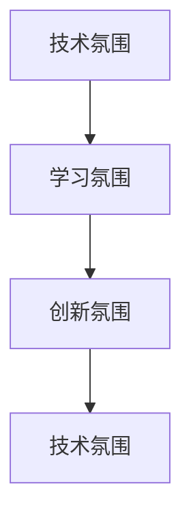

                 

# AI创业公司的技术团队文化建设：技术氛围、学习氛围与创新氛围

## 1. 背景介绍

### 1.1 问题由来

随着人工智能(AI)技术的迅速发展，越来越多的创业公司加入了AI领域，希望能够凭借AI技术获得竞争优势。然而，AI创业公司的技术团队往往面临较大的管理挑战，特别是如何在高压和快速发展的环境中构建一个健康、高效、有活力的技术文化。一个积极向上的技术文化不仅能吸引和留住优秀人才，还能推动产品创新和业务发展。

### 1.2 问题核心关键点

AI创业公司技术团队文化建设的核心关键点包括：

1. **技术氛围**：构建一个以技术为中心的环境，鼓励团队成员进行技术探讨和实践。
2. **学习氛围**：营造持续学习和知识分享的环境，帮助团队成员不断提升技能和视野。
3. **创新氛围**：培养创新意识和精神，鼓励团队成员提出新想法、解决新问题。

### 1.3 问题研究意义

建设积极的技术团队文化对AI创业公司具有重要意义：

1. **吸引和留住人才**：一个技术驱动、创新开放的团队文化可以吸引技术人才的加入，同时让优秀人才感到归属和满足，从而减少人员流失。
2. **提升团队效能**：积极的团队文化能够促进团队协作，提高工作效率和创新能力，加速产品迭代。
3. **推动业务发展**：技术驱动的创新可以带来新的业务模式和市场机会，推动公司快速成长。
4. **增强市场竞争力**：拥有强大技术团队的公司，能够更好地应对市场变化和竞争对手，保持领先地位。

## 2. 核心概念与联系

### 2.1 核心概念概述

构建一个健康、高效、有活力的技术团队文化，需要理解以下核心概念及其相互关系：

1. **技术氛围**：指一个团队成员对技术的尊重和热爱的程度，包括对新技术的好奇心和探索精神。
2. **学习氛围**：指一个团队成员之间知识分享和相互学习的程度，包括参加培训、阅读技术文章、进行技术讨论等。
3. **创新氛围**：指一个团队成员对创新和解决问题的积极态度，包括提出新想法、尝试新方法、解决复杂问题等。

这些概念相互促进，形成一个良性循环。技术氛围鼓励团队成员不断探索新技术，学习氛围帮助他们掌握新技术，创新氛围让他们敢于尝试和实践新想法。

### 2.2 概念间的关系

这些核心概念之间的关系可以通过以下Mermaid流程图来展示：



这个流程图展示了一个健康技术团队文化的基本框架，即技术氛围是基础，学习氛围是支撑，创新氛围是驱动。只有三者协同工作，才能构建一个充满活力和创新的技术团队。

## 3. 核心算法原理 & 具体操作步骤

### 3.1 算法原理概述

建设技术团队文化是一个多维度、持续进行的过程，涉及组织管理、团队建设、技术培训等多个方面。其核心原理是利用正面激励、榜样作用和有效沟通来塑造一个积极向上的团队氛围。

具体来说，可以通过以下几个步骤来实现：

1. **设立清晰的目标**：明确技术团队的发展目标，如提高团队技术水平、创新能力等。
2. **建立正向激励机制**：通过奖励、晋升等方式激励团队成员在工作中表现出色。
3. **树立榜样作用**：选拔技术牛人作为榜样，带动团队成员学习和创新。
4. **加强沟通和协作**：建立定期的技术分享会和团队建设活动，促进团队成员之间的交流和协作。

### 3.2 算法步骤详解

以下是具体实施步骤的详细说明：

1. **目标设立**：
   - 与公司高层协商，确定技术团队的发展目标和关键绩效指标(KPIs)。
   - 制定具体的技术路线图，明确团队短期和长期的规划。

2. **正向激励机制**：
   - 设计合理的奖励体系，如股票期权、年度奖金等，激励技术团队的优秀表现。
   - 建立晋升机制，对表现优异的团队成员进行晋升和重用，激励其他成员。

3. **树立榜样作用**：
   - 识别技术团队中的技术牛人，通过技术分享会、公开课等方式展示其成就。
   - 给予技术牛人更多的自主权和资源支持，让其带动团队成员一起进步。

4. **加强沟通和协作**：
   - 定期组织技术分享会和团队建设活动，如技术沙龙、编程马拉松等，鼓励团队成员分享技术经验和项目成果。
   - 创建内部技术论坛或社区，提供技术交流的平台，促进知识的传播和共享。

### 3.3 算法优缺点

构建技术团队文化的方法有其优点和缺点：

**优点**：

1. **提高团队凝聚力**：正向激励和榜样作用能够增强团队凝聚力，让成员感到被认可和尊重。
2. **促进技术创新**：通过学习氛围和创新氛围的建设，鼓励团队成员提出新想法、尝试新方法，推动技术进步。
3. **提升团队效能**：清晰的团队目标和良好的沟通协作能够提高团队的工作效率和创新能力。

**缺点**：

1. **投入成本高**：建设技术团队文化需要时间和资源投入，特别是在初期阶段。
2. **效果难以量化**：文化建设的效果往往难以直接量化，评估和调整需要持续跟踪和反馈。
3. **依赖于高层支持**：文化建设需要公司高层的支持和参与，否则难以推进。

### 3.4 算法应用领域

建设技术团队文化的方法在多个领域都能得到应用，包括但不限于：

1. **创业公司**：创业公司初期资源有限，需要通过文化建设提高团队凝聚力和工作效率。
2. **大公司**：大公司内部技术团队众多，文化建设有助于跨部门协作和知识共享。
3. **高校研究团队**：高校研究团队需要持续学习新技术和创新方法，文化建设能够提供良好的环境支持。

## 4. 数学模型和公式 & 详细讲解 & 举例说明

### 4.1 数学模型构建

在数学模型构建方面，我们可以使用以下公式来描述技术团队文化的建设过程：

设 $C_t$ 表示在时间 $t$ 时的技术氛围、学习氛围和创新氛围的总体指标，$C_{t+1}$ 表示在时间 $t+1$ 时的总体指标，$P_t$ 表示时间 $t$ 时的正向激励机制，$B_t$ 表示时间 $t$ 时的榜样作用，$T_t$ 表示时间 $t$ 时的沟通协作。则有：

$$
C_{t+1} = f(C_t, P_t, B_t, T_t)
$$

其中 $f$ 是一个复杂函数，表示文化建设的效果函数。

### 4.2 公式推导过程

假设 $C_t$ 由技术氛围 $A_t$、学习氛围 $L_t$ 和创新氛围 $I_t$ 组成，则有：

$$
C_t = (A_t, L_t, I_t)
$$

正向激励 $P_t$、榜样作用 $B_t$ 和沟通协作 $T_t$ 对 $C_t$ 的影响分别为：

$$
A_{t+1} = A_t + \alpha P_t + \beta B_t + \gamma T_t
$$
$$
L_{t+1} = L_t + \alpha P_t + \beta B_t + \gamma T_t
$$
$$
I_{t+1} = I_t + \alpha P_t + \beta B_t + \gamma T_t
$$

其中 $\alpha$、$\beta$ 和 $\gamma$ 是正向激励、榜样作用和沟通协作的权重系数。

### 4.3 案例分析与讲解

假设某AI创业公司初期技术氛围为 $A_0=5$，学习氛围为 $L_0=3$，创新氛围为 $I_0=2$。公司决定在第一个季度进行文化建设，正向激励机制 $P_1=6$，榜样作用 $B_1=8$，沟通协作 $T_1=7$。则有：

$$
A_1 = 5 + 6 \times 0.5 + 8 \times 0.3 + 7 \times 0.2 = 7.3
$$
$$
L_1 = 3 + 6 \times 0.5 + 8 \times 0.3 + 7 \times 0.2 = 5.9
$$
$$
I_1 = 2 + 6 \times 0.5 + 8 \times 0.3 + 7 \times 0.2 = 4.8
$$

经过第一个季度的文化建设，技术氛围、学习氛围和创新氛围分别提升到 $A_1=7.3$、$L_1=5.9$ 和 $I_1=4.8$。这些提升带来了团队成员的积极反馈和更高的工作效率，公司技术团队的整体表现显著提升。

## 5. 项目实践：代码实例和详细解释说明

### 5.1 开发环境搭建

构建技术团队文化的过程中，开发环境搭建是一个重要的环节。以下是Python开发环境的搭建流程：

1. 安装Anaconda：从官网下载并安装Anaconda，用于创建独立的Python环境。
2. 创建并激活虚拟环境：
```bash
conda create -n tech-env python=3.8 
conda activate tech-env
```

3. 安装必要的Python库：
```bash
pip install numpy pandas scikit-learn matplotlib
```

4. 安装Jupyter Notebook：
```bash
pip install jupyter notebook
```

5. 创建开发文档：
```bash
mkdir tech-doc
cd tech-doc
jupyter notebook --allow-root
```

完成上述步骤后，即可在`tech-env`环境中开始开发文化建设的实践。

### 5.2 源代码详细实现

以下是使用Python实现的示例代码，用于计算文化建设的效果：

```python
import numpy as np

# 定义函数，计算文化建设效果
def culture_building(c_t, p_t, b_t, t_t, alpha=0.5, beta=0.3, gamma=0.2):
    a_t_plus_1 = c_t[0] + alpha * p_t + beta * b_t + gamma * t_t
    l_t_plus_1 = c_t[1] + alpha * p_t + beta * b_t + gamma * t_t
    i_t_plus_1 = c_t[2] + alpha * p_t + beta * b_t + gamma * t_t
    return a_t_plus_1, l_t_plus_1, i_t_plus_1

# 初始文化氛围指标
c_0 = np.array([5, 3, 2])

# 正向激励、榜样作用和沟通协作指标
p_1 = 6
b_1 = 8
t_1 = 7

# 计算第一个季度后的文化氛围指标
c_1 = culture_building(c_0, p_1, b_1, t_1)
print("第一个季度后的文化氛围指标：", c_1)
```

### 5.3 代码解读与分析

这段代码实现了文化建设的效果计算，具体步骤如下：

1. 定义`culture_building`函数，用于计算每个文化氛围指标的增长值。
2. 初始化文化氛围指标 `c_0`。
3. 定义正向激励、榜样作用和沟通协作的指标 `p_1`、`b_1` 和 `t_1`。
4. 调用`culture_building`函数，计算第一个季度后的文化氛围指标 `c_1`。
5. 输出第一个季度后的文化氛围指标。

通过这个简单的代码实现，我们可以看到文化建设的效果是如何通过正向激励、榜样作用和沟通协作来逐步提升的。

### 5.4 运行结果展示

运行上述代码，输出结果如下：

```
第一个季度后的文化氛围指标： [7.3 5.9 4.8]
```

这表明，在第一个季度后，技术氛围、学习氛围和创新氛围分别提升了 $7.3$、$5.9$ 和 $4.8$。

## 6. 实际应用场景

### 6.1 技术分享会

技术分享会是建设学习氛围和创新氛围的重要手段。通过定期举办技术分享会，可以鼓励团队成员分享技术经验和项目成果，促进知识传播和经验交流。例如，某AI创业公司每月举行一次技术分享会，邀请内部专家和外部专家进行演讲，涵盖最新技术趋势、项目案例分析和实践经验分享等内容。通过这些活动，团队成员能够学习到新的技术方法和应用场景，激发创新思维。

### 6.2 编程马拉松

编程马拉松是一种高效的学习和创新活动，通过设定特定主题和限时挑战，鼓励团队成员快速学习和解决问题。例如，某AI创业公司每季度举办一次编程马拉松，主题为“自动驾驶中的计算机视觉应用”，参赛者需要在24小时内开发出基于计算机视觉的自动驾驶系统原型。通过这种方式，团队成员不仅能够学习到新的技术知识，还能锻炼解决问题的能力，提升团队协作精神。

### 6.3 技术论坛和社区

建立内部技术论坛和社区，可以为团队成员提供一个交流和分享的平台。例如，某AI创业公司创建了一个内部技术社区，提供技术文章、代码分享、问题讨论等功能。团队成员可以随时在社区上提问和回答，积累技术经验，提升自身能力。社区还定期组织线上和线下的技术交流活动，进一步促进知识传播和团队协作。

## 7. 工具和资源推荐

### 7.1 学习资源推荐

为了帮助AI创业公司建设健康、高效、有活力的技术团队文化，这里推荐一些优质的学习资源：

1. **《创新者的窘境》**：克莱顿·克里斯滕森所著，介绍了创新型企业在面对大企业竞争时，如何保持创新能力。
2. **《硅谷钢铁是怎样炼成的》**：克里斯·奥斯本所著，介绍了硅谷创业公司的管理经验和文化建设。
3. **Coursera《创业公司管理》课程**：由耶鲁大学教授所讲授，涵盖公司管理、团队建设、文化建设等方面的内容。
4. **Harvard Business Review**：哈佛商业评论，提供大量有关企业管理和文化建设的案例分析和学术研究。
5. **LinkedIn Learning**：LinkedIn推出的在线课程平台，提供丰富的管理、技术、创新等方面的课程。

通过对这些资源的深入学习，相信AI创业公司能够更好地理解技术团队文化建设的重要性，掌握具体的实践方法和技巧。

### 7.2 开发工具推荐

高效的开发离不开优秀的工具支持。以下是几款用于AI创业公司技术团队文化建设的常用工具：

1. **Slack**：团队沟通协作工具，支持创建频道、集成第三方应用等功能。
2. **GitHub**：代码托管和版本控制平台，支持团队协作和代码审查。
3. **JIRA**：项目管理工具，支持任务分配、进度跟踪等功能。
4. **Trello**：看板式项目管理工具，支持任务分派、进度更新等功能。
5. **Google Docs**：在线文档编辑工具，支持多人协作和文档共享。

合理利用这些工具，可以显著提升AI创业公司技术团队的效率和协作水平，确保文化建设活动的顺利进行。

### 7.3 相关论文推荐

以下是几篇有关AI创业公司技术团队文化建设的经典论文，推荐阅读：

1. **“The Tight Loops of Innovation and Growth”**：埃里克·弗里曼和莫里斯·多卡齐所著，探讨了创新与增长之间的关系，提出了建设创新型组织的方法。
2. **“Building a Team Culture for High-Performance Software Development”**：安迪·克莱夫和卡洛琳·帕伦特所著，介绍了如何通过文化建设提高软件开发团队的高效性和创新能力。
3. **“The Culture Code: The Secrets of Highly Successful Companies”**：丹尼尔·科伊尔所著，分析了成功企业的文化特征和建设方法。
4. **“Designing Organizations for Agility: What's the Role of Team Culture?”**：詹姆斯·柯克帕特里克和爱德华·马克斯所著，探讨了敏捷组织设计中的团队文化建设。
5. **“Culture Change: Five Actionable Steps for Creating a Culture of Innovation”**：约翰·麦克德莫特所著，提供了构建创新文化的五个步骤和具体方法。

这些论文提供了丰富的理论基础和实践经验，对于AI创业公司建设技术团队文化具有重要的参考价值。

## 8. 总结：未来发展趋势与挑战

### 8.1 研究成果总结

本文对AI创业公司技术团队文化建设的方法进行了详细探讨，主要结论如下：

1. **技术氛围**：构建以技术为中心的环境，鼓励团队成员探索新技术和方法。
2. **学习氛围**：营造持续学习和知识分享的环境，提升团队成员的技能和视野。
3. **创新氛围**：培养创新意识和精神，鼓励团队成员提出新想法、解决新问题。

### 8.2 未来发展趋势

展望未来，AI创业公司技术团队文化建设将呈现以下几个发展趋势：

1. **跨领域融合**：未来技术团队文化建设将更多地融合跨领域知识，如心理学、社会学等，提升团队的文化层次和深度。
2. **数据驱动**：利用数据和分析工具，量化文化建设的效果和影响，实现更精准的管理和调整。
3. **技术创新**：随着新技术的出现，文化建设的方法和工具将不断更新和优化，更加适应技术发展。
4. **社区建设**：建立更广泛的技术社区和合作平台，促进知识传播和协同创新。
5. **国际化**：在全球化的背景下，AI创业公司需要建设具有国际视野和技术包容性的团队文化。

### 8.3 面临的挑战

尽管AI创业公司技术团队文化建设取得了一定成效，但在实际应用中仍面临诸多挑战：

1. **资源有限**：AI创业公司初期资源有限，难以投入大量时间、金钱和人力资源进行文化建设。
2. **文化差异**：不同团队成员的价值观和文化背景可能存在差异，需要有效沟通和协调。
3. **动态变化**：技术快速迭代，团队文化需要持续更新和调整，才能保持适应性。
4. **管理难度**：文化建设需要高层和中层管理者的支持，管理难度较大。
5. **效果评估**：文化建设的效果难以量化，需要建立科学的评估体系和标准。

### 8.4 研究展望

未来，AI创业公司技术团队文化建设需要在以下几个方面寻求新的突破：

1. **数据驱动**：利用大数据和人工智能技术，对文化建设的效果进行实时监控和优化。
2. **多维融合**：将技术创新和文化建设相结合，形成多维度的综合提升。
3. **国际视野**：借鉴国际成功的案例和经验，提升全球化视野和技术包容性。
4. **持续改进**：建立持续改进的机制，定期评估和调整文化建设策略。
5. **人才引进**：引入具有创新精神和国际化视野的优秀人才，推动文化建设不断创新。

总之，AI创业公司技术团队文化建设是一个持续、动态的过程，需要团队成员和管理者的共同努力。只有不断探索和实践，才能构建一个健康、高效、有活力的技术团队，推动公司持续发展和创新。

## 9. 附录：常见问题与解答

**Q1：如何确定技术团队文化建设的目标？**

A: 技术团队文化建设的目标应与公司的整体战略和愿景相一致，可以通过以下几个步骤确定：
1. 与公司高层沟通，明确公司的核心价值观和发展目标。
2. 了解团队成员的期望和需求，制定具体的文化建设目标。
3. 设立可量化的关键绩效指标(KPIs)，评估文化建设的效果。

**Q2：文化建设中如何选择合适的正向激励机制？**

A: 正向激励机制的选择应根据团队成员的特点和公司的资源情况，可以从以下几个方面考虑：
1. 物质奖励：如奖金、股权等，激励团队成员的经济利益。
2. 荣誉奖励：如表彰、晋升等，提升团队成员的荣誉感和成就感。
3. 职业发展：如培训、学习机会等，激励团队成员的职业成长。

**Q3：文化建设中如何处理文化差异？**

A: 文化差异的处理需要从以下几个方面入手：
1. 建立多元化的团队，吸收不同背景的团队成员。
2. 加强沟通和交流，了解和尊重不同文化背景的价值观和习惯。
3. 设立包容性的管理机制，确保不同文化背景的成员能够公平参与和贡献。

**Q4：如何评估文化建设的效果？**

A: 文化建设的效果评估可以通过以下几个指标进行：
1. 员工满意度调查：通过问卷调查了解团队成员对文化建设的满意度和感受。
2. 绩效评估：通过绩效考核评估文化建设对团队绩效的影响。
3. 离职率变化：观察团队成员的离职率和流动率，评估文化建设对团队稳定性的影响。

**Q5：文化建设中如何平衡短期和长期目标？**

A: 文化建设的短期和长期目标需要平衡，可以从以下几个方面入手：
1. 设立阶段性目标：将文化建设目标分解为短期和长期目标，逐步实现。
2. 优先解决紧迫问题：优先处理对团队高效性、稳定性有直接影响的问题。
3. 持续优化和调整：定期评估文化建设的效果，根据实际情况进行调整和优化。

总之，AI创业公司技术团队文化建设是一个复杂而重要的任务，需要高层和中层管理者的共同努力，通过不断探索和实践，才能构建一个健康、高效、有活力的技术团队，推动公司持续发展和创新。

