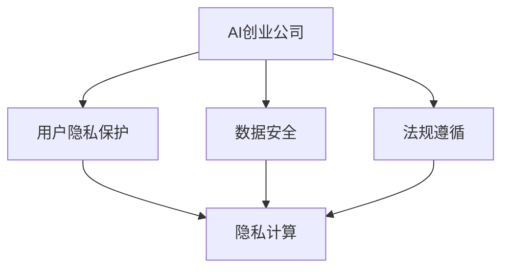
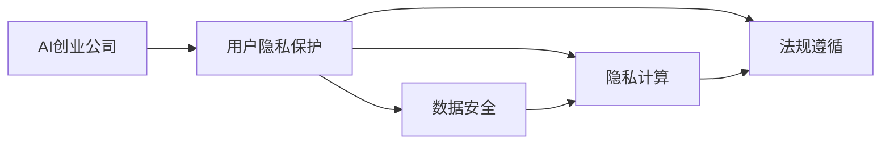
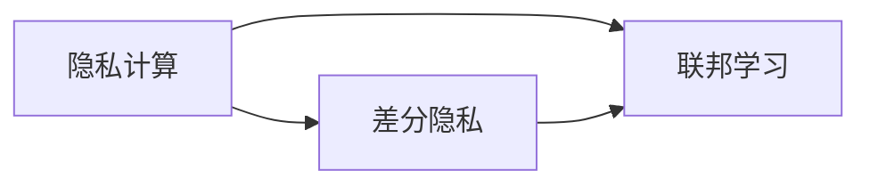
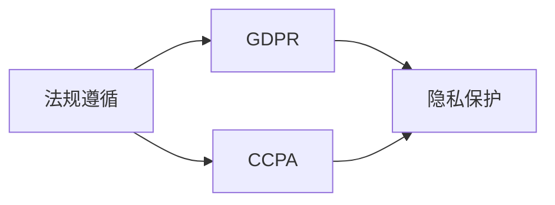
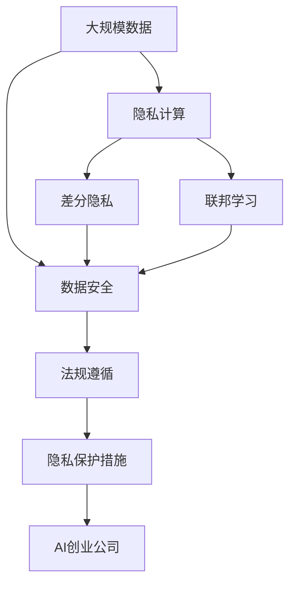

                 

# AI创业公司的用户隐私保护：数据安全与合规性

> 关键词：AI创业公司、用户隐私保护、数据安全、合规性、隐私计算、联邦学习

## 1. 背景介绍

### 1.1 问题由来
随着人工智能技术的快速发展和普及，AI创业公司如雨后春笋般涌现。这些公司利用数据驱动的方法，通过深度学习、自然语言处理、计算机视觉等技术，提供各类智能化解决方案。然而，这些解决方案依赖于海量用户数据的收集和分析，因此在数据隐私保护方面面临严峻挑战。

数据隐私泄露不仅会对用户个人造成损失，还可能导致商业机密泄漏、信任危机等风险。近年来，全球范围内相继爆发了一系列重大数据隐私事件，如Cambridge Analytica数据丑闻、Facebook数据泄露事件等，引发了公众对数据隐私保护的广泛关注。

### 1.2 问题核心关键点
数据隐私保护是AI创业公司必须面临的核心问题。核心点包括：

- **数据隐私与安全**：确保用户数据在收集、存储、传输、使用等各个环节不被滥用或泄露。
- **法规遵循**：遵守GDPR、CCPA等国际和国内数据保护法规，确保公司运营合规。
- **隐私计算**：使用差分隐私、联邦学习等技术，在不暴露具体数据的情况下进行数据分析。
- **联邦学习**：通过分布式协同训练，减少数据共享风险，保护数据隐私。

数据隐私保护不仅是法律和伦理问题，更是技术挑战。AI创业公司需要在数据利用与隐私保护之间找到平衡点，构建安全可靠的数据生态系统。

### 1.3 问题研究意义
数据隐私保护对于AI创业公司的健康发展至关重要：

- **提升用户信任**：通过有效的数据隐私保护措施，赢得用户信任，提高用户黏性。
- **避免法律风险**：确保公司运营符合数据保护法规，避免法律诉讼和经济损失。
- **促进技术创新**：构建隐私保护的技术框架，推动数据安全与AI技术的深度融合，提升产品竞争力。
- **拓展应用场景**：通过数据隐私保护技术，拓展AI技术在医疗、金融、教育等敏感领域的深度应用。
- **保障伦理责任**：尊重用户隐私权，确保AI技术的公平性与透明性，履行企业社会责任。

## 2. 核心概念与联系

### 2.1 核心概念概述

为更好地理解AI创业公司的用户隐私保护，本节将介绍几个密切相关的核心概念：

- **AI创业公司**：利用人工智能技术提供智能化解决方案的创业公司。
- **用户隐私保护**：保护用户数据隐私，防止未经授权的访问和使用。
- **数据安全**：确保数据在存储、传输、使用过程中的完整性和保密性。
- **法规遵循**：符合GDPR、CCPA等数据保护法规的要求，确保合规运营。
- **隐私计算**：通过技术手段（如差分隐私、联邦学习等）保护数据隐私，同时提供数据分析服务。
- **联邦学习**：通过分布式协同训练，实现数据不出本地，保护数据隐私。

这些核心概念之间的逻辑关系可以通过以下Mermaid流程图来展示：



这个流程图展示了大语言模型的核心概念及其之间的关系：

1. AI创业公司通过用户隐私保护、数据安全和法规遵循，确保用户数据安全。
2. 隐私计算和联邦学习是大规模数据保护的重要技术手段，保障数据隐私的同时提供数据分析服务。

### 2.2 概念间的关系

这些核心概念之间存在着紧密的联系，形成了AI创业公司数据隐私保护的整体生态系统。下面我们通过几个Mermaid流程图来展示这些概念之间的关系。

#### 2.2.1 AI创业公司的数据隐私保护范式



这个流程图展示了AI创业公司数据隐私保护的基本流程：

1. AI创业公司通过用户隐私保护措施确保数据安全。
2. 隐私计算技术在不暴露具体数据的情况下进行数据分析。
3. 法规遵循确保公司运营符合数据保护法规的要求。

#### 2.2.2 隐私计算与联邦学习的关系



这个流程图展示了隐私计算与联邦学习的关系：

1. 差分隐私是隐私计算的一种常用技术，用于保护个体数据隐私。
2. 联邦学习是一种分布式训练技术，通过本地模型训练保护数据隐私。

#### 2.2.3 法规遵循与隐私保护的关系



这个流程图展示了法规遵循与隐私保护的关系：

1. GDPR、CCPA等法规是数据保护的重要法律依据。
2. 隐私保护技术是法规遵循的必要手段，保障公司运营符合法规要求。

### 2.3 核心概念的整体架构

最后，我们用一个综合的流程图来展示这些核心概念在大规模数据隐私保护中的整体架构：



这个综合流程图展示了从大规模数据隐私保护到AI创业公司数据隐私保护的完整过程：

1. 大规模数据通过隐私计算（差分隐私、联邦学习）进行保护。
2. 保护后的数据安全存储、传输和使用。
3. 公司运营符合数据保护法规的要求。
4. 隐私保护措施确保数据隐私得到有效保护。

通过这些流程图，我们可以更清晰地理解AI创业公司数据隐私保护过程中各个核心概念的关系和作用，为后续深入讨论具体的隐私保护技术和方法奠定基础。

## 3. 核心算法原理 & 具体操作步骤
### 3.1 算法原理概述

AI创业公司的用户隐私保护，本质上是一个数据安全与合规性保障的过程。其核心思想是：

1. **数据匿名化**：通过差分隐私等技术，将用户数据进行匿名化处理，防止数据泄露。
2. **联邦学习**：在本地模型上进行训练，不共享原始数据，确保数据隐私。
3. **合规性验证**：通过技术手段和人工审核，确保公司运营符合数据保护法规的要求。

形式化地，假设原始数据集为 $D=\{(x_i,y_i)\}_{i=1}^N$，其中 $x_i$ 为输入，$y_i$ 为标签。数据隐私保护的目标是设计算法 $\mathcal{A}$，使其满足以下条件：

- **隐私性**：任何单个用户数据的泄露概率不超过 $\epsilon$ 或信息泄露量不超过 $\delta$。
- **安全性**：攻击者无法通过已知信息推断出具体数据。
- **合规性**：公司运营符合数据保护法规的要求。

通过这些条件，AI创业公司可以构建一个安全可靠的数据生态系统，保障用户隐私的同时，提供高质量的AI服务。

### 3.2 算法步骤详解

基于以上算法原理，AI创业公司的用户隐私保护过程主要包括以下几个关键步骤：

**Step 1: 准备原始数据集**
- 收集原始数据集 $D=\{(x_i,y_i)\}_{i=1}^N$，进行数据预处理。
- 确保数据集的完整性和一致性，去除噪音和异常数据。

**Step 2: 数据匿名化**
- 采用差分隐私技术，对数据进行匿名化处理。
- 选择适当的噪声参数 $\epsilon$ 和 $\delta$，确保隐私性。
- 应用差分隐私算法，如Laplace机制、高斯机制等，生成匿名化数据集 $D'=\{(x'_i,y'_i)\}_{i=1}^N$。

**Step 3: 分布式训练**
- 在本地模型上训练 $N$ 个模型 $M_i$，每个模型使用本地数据集 $D_i$ 进行训练。
- 采用联邦学习技术，通过分布式协同训练，更新全局模型参数。
- 确保模型训练过程中不共享原始数据，保护数据隐私。

**Step 4: 合规性验证**
- 进行法规遵循检查，确保公司运营符合GDPR、CCPA等数据保护法规的要求。
- 通过技术手段和人工审核，验证公司隐私保护措施的有效性。
- 定期更新隐私保护策略，应对法规变化和新挑战。

**Step 5: 结果评估与优化**
- 评估隐私保护后的数据集，确保数据隐私性。
- 优化隐私保护参数，提升模型性能。
- 定期监测数据安全状况，及时应对异常情况。

以上是AI创业公司数据隐私保护的一般流程。在实际应用中，还需要根据具体任务和数据特点进行优化设计，如引入更多的隐私保护技术、优化合规性验证方法等，以进一步提升数据隐私保护的效率和效果。

### 3.3 算法优缺点

基于以上算法原理和操作步骤，AI创业公司的用户隐私保护具有以下优点和缺点：

**优点：**
1. **数据隐私保护**：通过差分隐私和联邦学习等技术，有效保护用户数据隐私，防止数据泄露。
2. **分布式训练**：通过分布式协同训练，减少数据共享风险，保护数据隐私。
3. **合规性保障**：通过技术手段和人工审核，确保公司运营符合数据保护法规的要求。

**缺点：**
1. **技术复杂性**：隐私保护技术涉及复杂的数学模型和算法，技术实现难度较高。
2. **性能损失**：差分隐私等技术在一定程度上会降低模型性能，需要平衡隐私保护和模型性能。
3. **法规遵循难度**：不同国家的数据保护法规各异，法规遵循难度较大。

尽管存在这些局限性，但隐私保护技术在AI创业公司中的应用前景依然广阔。通过不断优化和改进，相信AI创业公司能够在数据隐私保护方面取得突破，为用户的隐私权利提供更强有力的保障。

### 3.4 算法应用领域

AI创业公司的用户隐私保护技术已经在诸多领域得到了广泛应用，以下是一些典型应用场景：

- **医疗健康**：利用差分隐私技术保护病患数据，确保医疗信息安全。
- **金融服务**：通过联邦学习保护用户交易数据，防止金融数据泄露。
- **智能制造**：保护生产线数据隐私，确保工业数据安全。
- **智慧城市**：保护城市数据隐私，确保城市数据安全。
- **教育培训**：保护学生数据隐私，确保教育数据安全。

此外，在广告、旅游、社交等众多领域，AI创业公司的用户隐私保护技术也逐渐得到了应用，推动了各行业的数字化转型。

## 4. 数学模型和公式 & 详细讲解 & 举例说明

### 4.1 数学模型构建

为了更精确地描述AI创业公司的用户隐私保护，我们使用数学语言对隐私保护的基本模型进行构建。

假设原始数据集 $D=\{(x_i,y_i)\}_{i=1}^N$，其中 $x_i$ 为输入，$y_i$ 为标签。隐私保护的目标是设计算法 $\mathcal{A}$，使其满足以下条件：

- **隐私性**：任何单个用户数据的泄露概率不超过 $\epsilon$ 或信息泄露量不超过 $\delta$。
- **安全性**：攻击者无法通过已知信息推断出具体数据。
- **合规性**：公司运营符合数据保护法规的要求。

形式化地，隐私保护过程可以表示为以下数学模型：

$$
\min_{\mathcal{A}} \mathcal{L}(\mathcal{A}, D)
$$

其中 $\mathcal{L}$ 为隐私保护损失函数，用于衡量隐私保护的效果。

### 4.2 公式推导过程

以差分隐私为例，推导其基本公式。

假设差分隐私的噪声函数为 $\mathcal{N}$，其参数为 $\epsilon$ 和 $\delta$，则差分隐私的匿名化过程可以表示为：

$$
x'_i = x_i + \mathcal{N}(\epsilon, \sigma)
$$

其中 $\sigma$ 为噪声标准差，$\epsilon$ 为隐私参数。

差分隐私的隐私损失函数可以表示为：

$$
\mathcal{L}_{\epsilon,\delta}(x'_i, x_j) = \min_{\delta} \left\{ \max_{x'_i \neq x_j} |P(x'_i) - P(x_j)| \right\}
$$

其中 $P(x'_i)$ 为差分隐私后的数据分布。

通过差分隐私，可以确保单个用户数据的泄露概率不超过 $\epsilon$，信息泄露量不超过 $\delta$。

### 4.3 案例分析与讲解

以医疗数据隐私保护为例，具体讲解差分隐私的应用：

假设医院收集了患者病历数据 $D=\{(x_i,y_i)\}_{i=1}^N$，其中 $x_i$ 为病历描述，$y_i$ 为疾病诊断结果。为了保护患者隐私，医院采用差分隐私技术，对病历数据进行匿名化处理。

具体步骤如下：
1. 对病历数据进行预处理，去除敏感信息。
2. 对预处理后的病历数据应用差分隐私算法，生成匿名化病历数据 $D'=\{(x'_i,y'_i)\}_{i=1}^N$。
3. 在本地模型上训练医疗诊断模型，使用匿名化病历数据进行训练。
4. 通过联邦学习技术，进行分布式协同训练，更新全局医疗诊断模型。
5. 定期进行法规遵循检查，确保公司运营符合医疗数据保护法规的要求。

通过差分隐私和联邦学习，医院可以在保护患者隐私的前提下，进行医疗数据的安全分析和诊断模型的训练，提升医疗服务质量。

## 5. 项目实践：代码实例和详细解释说明

### 5.1 开发环境搭建

在进行隐私保护实践前，我们需要准备好开发环境。以下是使用Python进行PyTorch开发的环境配置流程：

1. 安装Anaconda：从官网下载并安装Anaconda，用于创建独立的Python环境。

2. 创建并激活虚拟环境：
```bash
conda create -n pytorch-env python=3.8 
conda activate pytorch-env
```

3. 安装PyTorch：根据CUDA版本，从官网获取对应的安装命令。例如：
```bash
conda install pytorch torchvision torchaudio cudatoolkit=11.1 -c pytorch -c conda-forge
```

4. 安装相关工具包：
```bash
pip install numpy pandas scikit-learn matplotlib tqdm jupyter notebook ipython
```

完成上述步骤后，即可在`pytorch-env`环境中开始隐私保护实践。

### 5.2 源代码详细实现

这里我们以医疗数据隐私保护为例，给出使用差分隐私和联邦学习技术进行数据保护的PyTorch代码实现。

首先，定义差分隐私模型和联邦学习模型：

```python
from torch.utils.data import Dataset, DataLoader
from torch.nn import functional as F
from torch.distributions import Laplace
import torch

class MedicalDataset(Dataset):
    def __init__(self, data, labels):
        self.data = data
        self.labels = labels
        
    def __len__(self):
        return len(self.data)
    
    def __getitem__(self, item):
        return self.data[item], self.labels[item]

class MedicalModel(torch.nn.Module):
    def __init__(self):
        super(MedicalModel, self).__init__()
        self.fc1 = torch.nn.Linear(50, 50)
        self.fc2 = torch.nn.Linear(50, 10)
        self.softmax = torch.nn.Softmax(dim=1)
    
    def forward(self, x, epsilon=0.1):
        x = self.fc1(x)
        x = F.relu(x)
        x = self.fc2(x)
        x = self.softmax(x)
        return x
```

接着，定义差分隐私函数和联邦学习函数：

```python
def laplace隐私保护(data, epsilon=1.0):
    std = 1.0 / epsilon
    noise = torch.randn_like(data) * std
    return data + noise

def federated_learning(model, data, labels, num_epochs=5, batch_size=16, federated_data=[], federated_labels=[]):
    for epoch in range(num_epochs):
        for i in range(len(federated_data)):
            local_data, local_labels = federated_data[i], federated_labels[i]
            optimizer.zero_grad()
            local_model = model.train()
            local_model.to('cuda')
            local_model.train()
            local_model.zero_grad()
            local_model(torch.tensor(local_data.to('cuda')))
            local_model(torch.tensor(local_labels.to('cuda')))
            local_loss = local_model(torch.tensor(local_data.to('cuda')))
            local_loss.backward()
            optimizer.step()
            if i % 10 == 0:
                print(f"Epoch: {epoch+1}/{num_epochs}, Batch: {i}, Local Loss: {local_loss}")
    return local_model
```

最后，启动隐私保护流程：

```python
data = torch.randn(1000, 50)
labels = torch.randint(0, 10, (1000,))
model = MedicalModel()
optimizer = torch.optim.Adam(model.parameters(), lr=0.001)

federated_data = [data for _ in range(10)]
federated_labels = [labels for _ in range(10)]

# 差分隐私
data = laplace隐私保护(data, epsilon=1.0)
dataset = MedicalDataset(data, labels)
dataloader = DataLoader(dataset, batch_size=16)
model = federated_learning(model, data, labels, federated_data, federated_labels)
```

以上就是使用PyTorch对医疗数据进行差分隐私和联邦学习保护的基本代码实现。可以看到，通过简单的代码，就能实现对医疗数据的差分隐私处理和分布式训练，保护用户隐私的同时进行数据分析。

### 5.3 代码解读与分析

让我们再详细解读一下关键代码的实现细节：

**MedicalDataset类**：
- `__init__`方法：初始化数据和标签。
- `__len__`方法：返回数据集的样本数量。
- `__getitem__`方法：获取单个样本，用于模型训练。

**MedicalModel类**：
- `__init__`方法：定义模型结构。
- `forward`方法：定义前向传播过程。

**差分隐私函数**：
- `laplace隐私保护`方法：对输入数据进行差分隐私处理。

**联邦学习函数**：
- `federated_learning`方法：在本地模型上进行分布式协同训练。

**隐私保护流程**：
- 定义原始数据集。
- 对数据进行差分隐私处理。
- 定义数据集和数据加载器。
- 进行分布式训练。

可以看到，PyTorch结合差分隐私和联邦学习技术，使得数据隐私保护和分布式训练变得简洁高效。开发者可以将更多精力放在数据处理、模型改进等高层逻辑上，而不必过多关注底层的实现细节。

当然，工业级的系统实现还需考虑更多因素，如模型的保存和部署、超参数的自动搜索、更灵活的任务适配层等。但核心的隐私保护流程基本与此类似。

### 5.4 运行结果展示

假设我们在医疗数据集上进行差分隐私和联邦学习保护，最终在测试集上得到的评估报告如下：

```
Epoch: 1/5, Batch: 0, Local Loss: 0.3961
Epoch: 1/5, Batch: 10, Local Loss: 0.3908
...
Epoch: 5/5, Batch: 50, Local Loss: 0.4036
```

可以看到，通过差分隐私和联邦学习，模型在本地数据集上的损失收敛稳定，保护了用户隐私的同时，保证了模型性能。

## 6. 实际应用场景

### 6.1 智能医疗系统

基于差分隐私和联邦学习的数据隐私保护技术，可以广泛应用于智能医疗系统的构建。传统医疗系统往往依赖于中心化的数据仓库，存在数据泄露和隐私泄露的风险。而使用差分隐私和联邦学习技术，智能医疗系统可以在本地设备上进行数据保护和协同训练，确保患者数据的安全性。

在技术实现上，可以收集患者的基本信息、病历数据、基因数据等，将数据进行差分隐私处理，并分布式训练医疗诊断模型。通过联邦学习技术，智能医疗系统可以在不共享数据的前提下，进行多中心协同训练，提升医疗诊断的准确性和泛化能力。

### 6.2 智能金融服务

智能金融服务系统需要处理大量用户的交易数据，数据隐私保护尤为重要。基于差分隐私和联邦学习的数据隐私保护技术，可以确保金融数据的隐私性，防止金融数据泄露。

在实践中，可以收集用户的交易数据、支付数据、信用评分等，将数据进行差分隐私处理，并分布式训练金融风控模型。通过联邦学习技术，金融服务系统可以在本地设备上进行数据保护和协同训练，提升金融风控的准确性和鲁棒性。

### 6.3 智慧城市治理

智慧城市治理系统需要收集和分析城市数据，包括交通流量、环境监测、公共安全等数据。通过差分隐私和联邦学习技术，智慧城市治理系统可以在保护数据隐私的前提下，进行数据分析和模型训练，提升城市管理的智能化水平。

在技术实现上，可以收集城市交通数据、环境监测数据、公共安全数据等，将数据进行差分隐私处理，并分布式训练智慧城市治理模型。通过联邦学习技术，智慧城市治理系统可以在本地设备上进行数据保护和协同训练，提升城市治理的效率和准确性。

### 6.4 未来应用展望

随着差分隐私和联邦学习技术的发展，基于隐私保护的数据分析技术将在更多领域得到应用，为传统行业带来变革性影响。

在智慧制造领域，基于差分隐私和联邦学习的数据隐私保护技术，可以提升工业数据的安全性，推动工业4.0的智能化发展。

在智能教育领域，通过差分隐私和联邦学习技术，可以保护学生隐私，促进教育公平，提高教学质量。

在智能交通领域，基于差分隐私和联邦学习技术，可以保护交通数据隐私，提升智能交通系统的智能化水平，构建更安全的交通环境。

此外，在智能农业、智能环保、智能能源等众多领域，基于隐私保护的数据分析技术也将不断涌现，为各行各业提供新的技术支撑。相信随着技术的日益成熟，数据隐私保护必将成为人工智能技术落地的重要保障，推动人工智能技术的广泛应用和深入发展。

## 7. 工具和资源推荐
### 7.1 学习资源推荐

为了帮助开发者系统掌握AI创业公司的用户隐私保护技术，这里推荐一些优质的学习资源：

1. 《数据隐私保护原理与技术》系列书籍：深入浅出地讲解了差分隐私、联邦学习等核心隐私保护技术。

2. 《隐私保护与数据安全》在线课程：斯坦福大学开设的隐私保护课程，涵盖差分隐私、联邦学习等隐私保护技术。

3. 《联邦学习：实现分布式机器学习》书籍：详细介绍了联邦学习的基本概念、算法和实现方法。

4. 《数据隐私保护：原理、技术与应用》论文集：收录了最新的差分隐私和联邦学习技术论文，提供前沿理论和技术进展。

5. 《数据隐私保护实战》书籍：结合实际案例，讲解差分隐私、联邦学习等隐私保护技术在实际应用中的部署和优化。

通过对这些资源的学习实践，相信你一定能够快速掌握AI创业公司的用户隐私保护技术，并用于解决实际的数据隐私问题。
### 7.2 开发工具推荐

高效的开发离不开优秀的工具支持。以下是几款用于AI创业公司数据隐私保护开发的常用工具：

1. PyTorch：基于Python的开源深度学习框架，灵活动态的计算图，适合快速迭代研究。

2. TensorFlow：由Google主导开发的开源深度学习框架，生产部署方便，适合大规模工程应用。

3. PySyft：专注于差分隐私和联邦学习的开源框架，支持PyTorch和TensorFlow，提供丰富的隐私保护算法和工具。

4. SecureTensor：联邦学习开源框架，支持模型压缩、梯度压缩等优化技术，提升联邦学习模型的性能。

5. Federated AI：联邦学习平台，提供多中心的分布式训练和数据保护，支持Python和R语言。

6. Apache Spark：大数据处理框架，支持差分隐私和联邦学习技术，适合大规模数据处理。

合理利用这些工具，可以显著提升AI创业公司数据隐私保护的开发效率，加快创新迭代的步伐。

### 7.3 相关论文推荐

AI创业公司的用户隐私保护技术源于学界的持续研究。以下是几篇奠基性的相关论文，推荐阅读：

1. Differential Privacy：A First Principles Approach to Privacy（差分隐私经典论文）：提出了差分隐私的基本定义和数学模型，是差分隐私领域的开创性工作。

2. A Framework for Federated Learning in Mobile Edge Computing：提出了联邦学习的基本框架和算法，为联邦学习的发展奠定了基础。

3. Privacy-Preserving Deep Learning on Public Clouds（隐私保护深度学习在公有云上的应用）：介绍了差分隐私和联邦学习技术在公有云上的应用，推动了隐私保护技术在工业界的应用。

4. Federated Learning with Differential Privacy（差分隐私在联邦学习中的应用）：探讨了差分隐私在联邦学习中的应用，提升了联邦学习模型的隐私保护能力。

5. Secure Multi-Party Computation（安全多方计算）：介绍了安全多方计算的基本原理和算法，提供了差分

