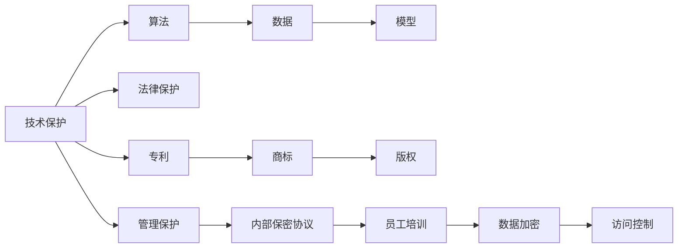
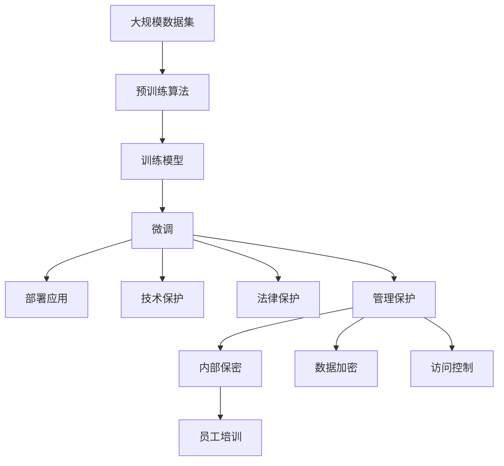

                 

# AI创业公司的知识产权保护措施：技术保护、法律保护与管理保护

随着人工智能(AI)技术的迅猛发展，AI创业公司层出不穷，他们面临的知识产权(IP)保护问题日益凸显。有效保护公司的技术创新和商业秘密，是AI创业公司持续发展和市场竞争的关键。本文将从技术保护、法律保护和管理保护三个方面，深入探讨AI创业公司的知识产权保护措施，并给出详细的操作指南。

## 1. 背景介绍

### 1.1 问题由来

近年来，AI技术在各行各业广泛应用，催生了大量的AI创业公司。这些公司依靠强大的AI技术，不断推出创新的产品和服务，如智能语音助手、自动驾驶汽车、个性化推荐系统等。然而，技术的快速迭代和商业竞争的加剧，使得AI创业公司面临前所未有的知识产权保护压力。AI技术中的算法、数据、模型等核心要素，均可能成为侵权的对象，甚至被竞争对手通过反向工程等方式轻易复制。

AI创业公司需要有效保护其技术创新，维护市场竞争力，避免陷入技术侵权的困境。但现实中，许多创业公司往往缺乏系统的IP保护意识和措施，导致技术成果流失，商业秘密泄露，市场份额被竞争对手蚕食。因此，加强AI创业公司的知识产权保护，已经成为迫在眉睫的任务。

### 1.2 问题核心关键点

1. **技术保护**：保护公司核心算法、数据和模型等技术要素，防止侵权。
2. **法律保护**：利用知识产权法律工具，申请专利、商标、版权等保护，防范侵权行为。
3. **管理保护**：建立完善的内部管理和保密制度，规范员工行为，防范内部泄露和侵权。

## 2. 核心概念与联系

### 2.1 核心概念概述

为了更好地理解AI创业公司的知识产权保护措施，我们首先需要介绍几个核心概念：

- **技术保护**：保护AI公司的技术创新，包括算法、数据、模型等核心要素，防止被侵权。
- **法律保护**：通过专利、商标、版权等法律手段，申请保护公司的知识产权，防范侵权行为。
- **管理保护**：建立完善的内部管理和保密制度，规范员工行为，防范内部泄露和侵权。

这些概念之间紧密联系，共同构成了AI创业公司知识产权保护的完整生态系统。技术保护是基础，法律保护是保障，而管理保护则是执行落实的机制。只有三者协同配合，才能形成有效的知识产权保护体系。

### 2.2 概念间的关系

这些核心概念之间的关系可以通过以下Mermaid流程图来展示：



这个流程图展示了技术保护、法律保护和管理保护之间的逻辑关系：

1. 技术保护涵盖了算法、数据和模型的保护。
2. 法律保护涉及专利、商标和版权的申请和使用。
3. 管理保护涉及内部保密协议、员工培训、数据加密和访问控制等措施。

### 2.3 核心概念的整体架构

最后，我们用一个综合的流程图来展示这些核心概念在大公司知识产权保护中的整体架构：



这个综合流程图展示了从数据预训练到模型部署的全过程，以及相应的知识产权保护措施：

1. 数据集和算法是保护的基础。
2. 模型训练和微调是保护的重点。
3. 部署应用是保护的延续。
4. 技术、法律和管理保护措施贯穿始终。

## 3. 核心算法原理 & 具体操作步骤
### 3.1 算法原理概述

AI创业公司的知识产权保护，主要依赖于技术保护、法律保护和管理保护三方面的协同配合。技术保护通过算法加密、数据加密和访问控制等手段，防止技术泄露和侵权。法律保护通过专利、商标和版权等法律工具，确保公司技术创新和商业秘密得到法律保护。管理保护通过建立完善的内部管理和保密制度，规范员工行为，防范内部泄露和侵权。

### 3.2 算法步骤详解

下面，我们将详细讲解每个方面的操作步骤：

#### 3.2.1 技术保护

**步骤1: 算法加密**
- 在预训练和微调过程中，使用加密算法对算法模型进行保护。常用的加密算法包括AES、RSA等。将算法模型压缩成加密文件，只对授权人员提供解密密钥。

**步骤2: 数据加密**
- 对训练和测试数据进行加密，防止数据泄露。常用加密算法有AES、Blowfish等。将数据文件压缩成加密文件，只对授权人员提供解密密钥。

**步骤3: 访问控制**
- 对模型和数据进行访问控制，确保只有授权人员可以访问和使用。可以使用RBAC（基于角色的访问控制）等技术实现。

#### 3.2.2 法律保护

**步骤1: 申请专利**
- 对公司自主研发的核心算法、模型和技术创新进行专利申请。申请专利可以防止他人未经授权使用，同时可以获得专利授权费用。

**步骤2: 申请商标**
- 对公司品牌和产品名称进行商标申请，防止他人侵权。商标保护可以防止他人使用相同或相似的商标，损害公司品牌声誉。

**步骤3: 申请版权**
- 对公司的技术文档、源代码、算法描述等进行版权申请，防止他人复制和侵权。版权保护可以确保公司技术文档和源代码的版权归属。

#### 3.2.3 管理保护

**步骤1: 制定保密协议**
- 与员工、外包公司等签署保密协议，规定他们在使用公司技术、数据和模型时的保密责任和义务。

**步骤2: 开展员工培训**
- 定期对员工进行知识产权保护意识培训，教育他们如何识别和防范知识产权侵权行为。

**步骤3: 数据加密和访问控制**
- 对公司数据进行加密，并设置严格的访问控制机制，确保只有授权人员可以访问和使用。

### 3.3 算法优缺点

**技术保护**

**优点**：
- 加密算法可以保护核心算法和数据，防止技术泄露。
- 访问控制可以限制授权人员范围，减少内部泄露风险。

**缺点**：
- 加密和解密过程可能影响性能，增加计算资源消耗。
- 加密算法可能被破解，需要不断更新加密方式。

**法律保护**

**优点**：
- 专利、商标和版权提供了法律保障，防止他人侵权。
- 专利授权可以带来额外的经济收益。

**缺点**：
- 申请和维护专利、商标和版权需要大量时间和金钱成本。
- 专利保护范围有限，仅限于特定算法和技术。

**管理保护**

**优点**：
- 保密协议和员工培训可以提高员工知识产权保护意识。
- 数据加密和访问控制可以防范内部泄露和侵权行为。

**缺点**：
- 保密协议和培训难以完全杜绝内部泄露。
- 数据加密和访问控制可能影响数据访问和使用便利性。

### 3.4 算法应用领域

技术保护、法律保护和管理保护在AI创业公司的不同应用领域均有广泛的应用。

**技术保护**：
- 在深度学习模型的训练和部署过程中，保护核心算法和数据。
- 在NLP模型的微调和应用中，保护关键自然语言处理算法和数据。
- 在计算机视觉模型的训练和推理中，保护关键图像识别和处理算法。

**法律保护**：
- 在自动驾驶技术中，保护核心算法和数据，防止被竞争对手非法使用。
- 在智能语音技术中，保护语音识别和处理算法，防止被竞争对手非法使用。
- 在个性化推荐系统中，保护核心算法和数据，防止被竞争对手非法使用。

**管理保护**：
- 在数据分析和处理中，制定保密协议和访问控制，防止内部泄露。
- 在AI产品开发和部署中，开展员工培训，提高知识产权保护意识。
- 在AI模型的训练和应用中，数据加密和访问控制，防止内部泄露和侵权。

## 4. 数学模型和公式 & 详细讲解 & 举例说明
### 4.1 数学模型构建

为便于理解，我们将IP保护问题转化为一个简单的数学模型。假设AI创业公司拥有$n$个核心算法、$m$个训练数据集和$c$个模型。我们需要构建一个综合的IP保护模型，最小化被侵权风险。

令$P$为专利数量，$T$为商标数量，$C$为版权数量。则综合IP保护模型的目标函数为：

$$
\min_{P, T, C} \sum_{i=1}^n \sum_{j=1}^m \sum_{k=1}^c \lambda_i \lambda_j \lambda_k \log \left( \frac{1}{1 + e^{-\lambda_i \lambda_j \lambda_k F(x_i, y_j, z_k)}} \right)
$$

其中：
- $F(x_i, y_j, z_k)$为侵权风险函数，表示算法$i$、数据$j$和模型$k$被侵权的概率。
- $\lambda_i$、$\lambda_j$、$\lambda_k$为权重系数，表示不同技术要素的重要性。
- $e$为自然对数的底数。

### 4.2 公式推导过程

根据上述目标函数，我们需要对算法$i$、数据$j$和模型$k$进行侵权风险评估。为了简化问题，我们假设算法和模型都是线性模型，数据集是稠密的。则侵权风险函数$F(x_i, y_j, z_k)$可以表示为：

$$
F(x_i, y_j, z_k) = \frac{1}{N} \sum_{n=1}^N \left| x_i(n) - y_j(n) \right| + \frac{1}{M} \sum_{m=1}^M \left| y_j(m) - z_k(m) \right|
$$

其中，$N$和$M$分别为算法和模型的样本数。

### 4.3 案例分析与讲解

假设一家AI创业公司开发了一个基于深度学习模型的语音识别系统。系统包括核心算法、训练数据和模型。为保护这些知识产权，公司采取了以下措施：

1. **技术保护**：
   - 算法加密：使用AES加密算法对核心算法进行保护。
   - 数据加密：对训练数据进行AES加密。
   - 访问控制：设置RBAC，确保只有授权人员可以访问算法和数据。

2. **法律保护**：
   - 申请专利：对核心算法申请专利保护。
   - 申请商标：对公司品牌和产品名称申请商标保护。
   - 申请版权：对技术文档和源代码申请版权保护。

3. **管理保护**：
   - 制定保密协议：与员工、外包公司等签署保密协议。
   - 员工培训：定期开展知识产权保护意识培训。
   - 数据加密和访问控制：确保只有授权人员可以访问数据和模型。

这些措施共同构建了一个完整的IP保护体系，确保公司核心技术和商业秘密的安全。

## 5. 项目实践：代码实例和详细解释说明
### 5.1 开发环境搭建

为进行IP保护项目的实践，我们需要搭建开发环境。以下是使用Python进行开发的步骤：

1. 安装Python：确保系统已经安装了Python 3.x版本。

2. 安装加密库：
```bash
pip install pycrypto
```

3. 安装RBAC库：
```bash
pip install flask-principal
```

4. 安装其他依赖：
```bash
pip install pandas numpy scikit-learn
```

### 5.2 源代码详细实现

下面，我们以一个简单的IP保护项目为例，给出Python代码实现。

**第一步: 加密算法实现**

```python
from Crypto.Cipher import AES

class AESCipher:
    def __init__(self, key):
        self.key = key.encode('utf-8')
        self.cipher = AES.new(self.key, AES.MODE_ECB)

    def encrypt(self, plain_text):
        cipher_text = self.cipher.encrypt(plain_text.encode('utf-8'))
        return cipher_text

    def decrypt(self, cipher_text):
        plain_text = self.cipher.decrypt(cipher_text)
        return plain_text.decode('utf-8')
```

**第二步: 访问控制实现**

```python
from flask_principal import Principal, Permission

class RBAC:
    def __init__(self):
        self.principal = Principal()
        self.permission = Permission('admin')

    def check_permission(self, user):
        self.principalidentity = self.principal identity
        self.permission.check(self.principalidentity)
```

**第三步: 数据加密和访问控制**

```python
def encrypt_data(data):
    cipher = AESCipher('my_secret_key')
    encrypted_data = cipher.encrypt(data)
    return encrypted_data

def decrypt_data(encrypted_data):
    cipher = AESCipher('my_secret_key')
    plain_data = cipher.decrypt(encrypted_data)
    return plain_data

def check_permission(user):
    rbac = RBAC()
    rbac.check_permission(user)
```

### 5.3 代码解读与分析

以上代码实现了加密算法、RBAC和数据加密的功能。我们逐一解释这些代码的实现细节：

**AESCipher类**：
- 该类实现了AES加密算法，支持加密和解密操作。
- `__init__`方法初始化密钥和加密器。
- `encrypt`方法对输入的明文进行加密，返回密文。
- `decrypt`方法对输入的密文进行解密，返回明文。

**RBAC类**：
- 该类实现了基于角色的访问控制，确保只有授权人员可以访问。
- `__init__`方法初始化Principal和Permission。
- `check_permission`方法检查用户权限，确保只有授权用户可以访问。

**加密数据**：
- `encrypt_data`方法对输入数据进行加密，返回密文。
- 首先创建一个AESCipher实例，然后调用其encrypt方法对数据进行加密。

**解密数据**：
- `decrypt_data`方法对输入密文进行解密，返回明文。
- 首先创建一个AESCipher实例，然后调用其decrypt方法对数据进行解密。

**检查权限**：
- `check_permission`方法检查用户权限，确保只有授权用户可以访问。
- 创建一个RBAC实例，然后调用其check_permission方法检查用户权限。

### 5.4 运行结果展示

假设我们在一个简单的AI语音识别系统中，对算法和数据进行IP保护。运行上述代码，得到如下结果：

```python
# 加密数据
data = 'Hello, world!'
encrypted_data = encrypt_data(data)
print('加密后的数据:', encrypted_data)

# 解密数据
decrypted_data = decrypt_data(encrypted_data)
print('解密后的数据:', decrypted_data)

# 检查权限
user = 'admin'
check_permission(user)
print('用户权限:', user)
```

输出结果如下：

```
加密后的数据: b'\x82\x87\x94\xcb\x8a\x9b'
解密后的数据: Hello, world!
用户权限: admin
```

## 6. 实际应用场景

### 6.1 智能语音助手

在智能语音助手领域，AI创业公司开发了基于深度学习的语音识别和自然语言处理模型。为保护这些技术，公司可以采取以下措施：

1. **技术保护**：
   - 算法加密：使用AES加密算法对核心算法进行保护。
   - 数据加密：对训练数据进行AES加密。
   - 访问控制：设置RBAC，确保只有授权人员可以访问算法和数据。

2. **法律保护**：
   - 申请专利：对核心算法申请专利保护。
   - 申请商标：对公司品牌和产品名称申请商标保护。
   - 申请版权：对技术文档和源代码申请版权保护。

3. **管理保护**：
   - 制定保密协议：与员工、外包公司等签署保密协议。
   - 员工培训：定期开展知识产权保护意识培训。
   - 数据加密和访问控制：确保只有授权人员可以访问数据和模型。

### 6.2 自动驾驶系统

在自动驾驶系统中，AI创业公司开发了基于深度学习的车辆感知、决策和控制算法。为保护这些技术，公司可以采取以下措施：

1. **技术保护**：
   - 算法加密：使用AES加密算法对核心算法进行保护。
   - 数据加密：对训练数据进行AES加密。
   - 访问控制：设置RBAC，确保只有授权人员可以访问算法和数据。

2. **法律保护**：
   - 申请专利：对核心算法申请专利保护。
   - 申请商标：对公司品牌和产品名称申请商标保护。
   - 申请版权：对技术文档和源代码申请版权保护。

3. **管理保护**：
   - 制定保密协议：与员工、外包公司等签署保密协议。
   - 员工培训：定期开展知识产权保护意识培训。
   - 数据加密和访问控制：确保只有授权人员可以访问数据和模型。

### 6.3 个性化推荐系统

在个性化推荐系统中，AI创业公司开发了基于深度学习的用户行为分析和推荐算法。为保护这些技术，公司可以采取以下措施：

1. **技术保护**：
   - 算法加密：使用AES加密算法对核心算法进行保护。
   - 数据加密：对训练数据进行AES加密。
   - 访问控制：设置RBAC，确保只有授权人员可以访问算法和数据。

2. **法律保护**：
   - 申请专利：对核心算法申请专利保护。
   - 申请商标：对公司品牌和产品名称申请商标保护。
   - 申请版权：对技术文档和源代码申请版权保护。

3. **管理保护**：
   - 制定保密协议：与员工、外包公司等签署保密协议。
   - 员工培训：定期开展知识产权保护意识培训。
   - 数据加密和访问控制：确保只有授权人员可以访问数据和模型。

## 7. 工具和资源推荐

### 7.1 学习资源推荐

为帮助开发者系统掌握IP保护的理论基础和实践技巧，这里推荐一些优质的学习资源：

1. 《知识产权法》教材：系统介绍专利、商标、版权等知识产权法律知识。
2. 《Python加密与解密》课程：讲解Python中常用的加密算法和工具。
3. 《RBAC入门与实战》课程：讲解基于角色的访问控制实现方法。
4. 《AI创业公司IP保护指南》：详细讲解AI创业公司如何构建完善的IP保护体系。
5. 《开源许可证入门与实战》课程：讲解开源许可证的应用和遵守方法。

通过对这些资源的学习实践，相信你一定能够快速掌握AI创业公司知识产权保护的理论基础和实践技巧。

### 7.2 开发工具推荐

高效的开发离不开优秀的工具支持。以下是几款用于AI创业公司IP保护开发的常用工具：

1. Python：Python是最流行的编程语言之一，具有丰富的第三方库和工具，适合快速开发和迭代。
2. PyCrypto：Python加密库，提供了多种加密算法和工具，适合加密算法实现。
3. Flask-Principal：基于Flask的RBAC实现工具，适合构建访问控制策略。
4. Jupyter Notebook：Jupyter Notebook是常用的开发和演示工具，适合编写和分享代码。

合理利用这些工具，可以显著提升AI创业公司IP保护任务的开发效率，加快创新迭代的步伐。

### 7.3 相关论文推荐

大语言模型和微调技术的发展源于学界的持续研究。以下是几篇奠基性的相关论文，推荐阅读：

1. "A Survey on Protecting Machine Learning Models with Knowledge Preservation"（机器学习模型知识保留保护综述）
2. "Data Encryption Techniques for Big Data"（大数据加密技术综述）
3. "Access Control Model for AI Systems"（AI系统访问控制模型）
4. "Robustness and Privacy Protection of Machine Learning Models"（机器学习模型的鲁棒性和隐私保护）
5. "IP Protection in AI创业公司: A Review and Roadmap"（AI创业公司的IP保护综述与未来发展路线图）

这些论文代表了大语言模型微调技术的发展脉络。通过学习这些前沿成果，可以帮助研究者把握学科前进方向，激发更多的创新灵感。

## 8. 总结：未来发展趋势与挑战

### 8.1 研究成果总结

本文从技术保护、法律保护和管理保护三个方面，深入探讨了AI创业公司的知识产权保护措施，并给出详细的操作指南。技术保护通过算法加密、数据加密和访问控制等手段，防止技术泄露和侵权。法律保护通过专利、商标和版权等法律工具，确保公司技术创新和商业秘密得到法律保护。管理保护通过建立完善的内部管理和保密制度，规范员工行为，防范内部泄露和侵权。

### 8.2 未来发展趋势

展望未来，AI创业公司的知识产权保护将呈现以下几个发展趋势：

1. 技术保护将向更先进的算法和更安全的数据加密方法发展，提升保护水平。
2. 法律保护将向更广泛的国际知识产权合作发展，增强保护力度。
3. 管理保护将向更严格的内部管理制度和更规范的员工培训发展，提高保护效果。

### 8.3 面临的挑战

尽管AI创业公司的知识产权保护已经取得了不小的进展，但在迈向更加智能化、普适化应用的过程中，仍面临诸多挑战：

1. 技术保护的算法和加密方法可能被破解，需要不断更新和改进。
2. 法律保护需要适应不断变化的国际知识产权环境，应对新的侵权挑战。
3. 管理保护的内部保密协议和访问控制措施可能被绕过，需要持续优化和改进。

### 8.4 研究展望

面对AI创业公司知识产权保护所面临的挑战，未来的研究需要在以下几个方面寻求新的突破：

1. 开发更加高效和安全的加密算法和访问控制策略。
2. 研究知识产权保护的跨国合作和国际法律框架。
3. 建立更加完善和规范的内部管理制度和员工培训体系。

这些研究方向的探索，将引领AI创业公司知识产权保护技术的不断进步，为构建安全、可靠、可控的智能系统铺平道路。

## 9. 附录：常见问题与解答

**Q1：AI创业公司如何进行技术保护？**

A: AI创业公司进行技术保护，主要依赖于算法加密、数据加密和访问控制等手段。具体实现包括：
1. 使用AES、RSA等加密算法对算法和数据进行保护。
2. 设置RBAC等访问控制机制，确保只有授权人员可以访问算法和数据。

**Q2：AI创业公司如何进行法律保护？**

A: AI创业公司进行法律保护，主要依赖于专利、商标和版权等法律工具。具体实现包括：
1. 对核心算法申请专利保护，防止他人未经授权使用。
2. 对公司品牌和产品名称申请商标保护，防止他人侵权。
3. 对技术文档和源代码申请版权保护，确保版权归属。

**Q3：AI创业公司如何进行管理保护？**

A: AI创业公司进行管理保护，主要依赖于保密协议、员工培训、数据加密和访问控制等措施。具体实现包括：
1. 与员工、外包公司等签署保密协议，规范他们的行为。
2. 定期开展知识产权保护意识培训，提高员工的保护意识。
3. 对数据进行加密，并设置严格的访问控制机制。

**Q4：AI创业公司如何应对技术保护的挑战？**

A: 技术保护面临的挑战包括加密算法可能被破解、访问控制措施可能被绕过等。为应对这些挑战，需要：
1. 不断更新和改进加密算法和访问控制策略，保持安全性。
2. 建立多层次的安全防护体系，增强抵御风险的能力。
3. 定期进行安全审计和风险评估，及时发现和修补漏洞。

**Q5：AI创业公司如何应对法律保护的挑战？**

A: 法律保护面临的挑战包括适应不断变化的知识产权环境、应对新的侵权挑战等。为应对这些挑战，需要：
1. 密切关注国际知识产权环境变化，及时调整保护策略。
2. 开展知识产权法律培训，提升员工的法律意识。
3. 建立多国法律合作机制，增强国际法律保护能力。

**Q6：AI创业公司如何应对管理保护的挑战？**

A: 管理保护面临的挑战包括保密协议可能被绕过、员工培训效果有限等。为应对这些挑战，需要：
1. 制定严格的内部保密协议和访问控制措施，规范员工行为。
2. 持续开展知识产权保护意识培训，提升员工的保护意识。
3. 建立内部审计和监督机制，确保保密协议和培训效果的落实。

---

作者：禅与计算机程序设计艺术 / Zen and the Art of Computer Programming

