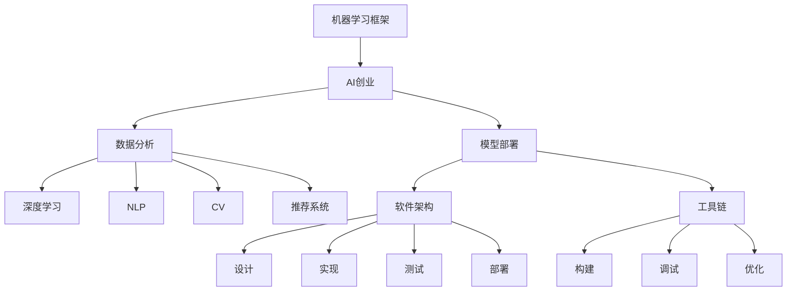

                 

# AI创业：选择合适的机器学习框架

> 关键词：机器学习框架, AI创业, 数据分析, 模型部署, 深度学习, 自然语言处理(NLP), 计算机视觉(CV), 推荐系统, 软件架构, 工具链

## 1. 背景介绍

### 1.1 问题由来
人工智能(AI)创业已经成为全球科技创新领域的一股强劲浪潮。伴随着大数据、云计算和深度学习等技术的成熟和普及，越来越多的创业者投身于AI技术产品的开发。然而，对于刚入行的创业者而言，选择合适的机器学习框架是一项重大挑战。

当前市面上流行的机器学习框架众多，如TensorFlow、PyTorch、Scikit-Learn等，每种框架都有自己的优势和适用场景。如何根据具体需求，选择最合适的框架，高效、稳定地构建AI产品，是每个创业团队必须面对的课题。

### 1.2 问题核心关键点
选择机器学习框架的核心在于：

- 性能：框架的计算效率和模型精度
- 易用性：框架的API设计、文档完备性、社区支持等
- 扩展性：框架的扩展性、可维护性、跨平台能力
- 生态系统：框架周边工具、库和服务的丰富程度

以上四个方面直接影响创业团队的研发效率和产品性能。框架选对了，可以让开发者在短时间内高效产出创新成果；框架选错了，不仅影响项目进展，还可能直接导致技术债务积累。

### 1.3 问题研究意义
选择合适的机器学习框架，对AI创业公司具有重要意义：

- 提升效率：能够有效降低技术门槛，提高研发速度。
- 稳定可靠：成熟框架具备丰富的社区资源和稳定性能，有助于减少技术风险。
- 灵活性：多样化框架选择，支持不同应用场景和需求。
- 降低成本：避免从头实现框架，节省人力物力资源。

## 2. 核心概念与联系

### 2.1 核心概念概述

为了帮助读者理解如何选择机器学习框架，我们首先定义以下几个核心概念：

- **机器学习框架**：提供预先实现和封装好的机器学习算法和数据处理工具，开发者可以通过API进行模型构建和训练的抽象层。

- **AI创业**：利用人工智能技术进行产品开发和商业运营的公司，涉及领域包括自然语言处理(NLP)、计算机视觉(CV)、推荐系统等。

- **数据分析**：通过各种算法从原始数据中提取有价值信息，支撑决策和业务改进。

- **模型部署**：将训练好的模型部署到生产环境中，进行实时推理和预测。

- **深度学习**：通过多层神经网络进行复杂模式识别和预测的机器学习方法。

- **自然语言处理(NLP)**：使用算法处理和理解人类语言的技术。

- **计算机视觉(CV)**：通过算法使计算机能够“看”和理解视觉世界。

- **推荐系统**：根据用户的历史行为和偏好，预测其可能感兴趣的内容。

- **软件架构**：涉及设计、实现、测试和部署软件系统的结构和流程。

- **工具链**：提供构建、调试和优化软件项目的工具集合。

以上概念之间有着紧密的联系，共同构成了AI创业中机器学习应用的生态系统。通过选择合适的机器学习框架，开发者可以在工具链的辅助下，构建稳定高效的AI系统。

### 2.2 概念间的关系

我们将以上核心概念之间的关系用以下Mermaid流程图来展示：



这个流程图展示了机器学习框架在AI创业中的核心作用，以及其与数据分析、模型部署、深度学习、自然语言处理、计算机视觉、推荐系统、软件架构和工具链等概念之间的关系。通过选择合适的框架，AI创业团队可以在多个环节高效协作，构建创新产品。

## 3. 核心算法原理 & 具体操作步骤

### 3.1 算法原理概述

在选择机器学习框架时，了解其核心算法原理至关重要。以深度学习框架为例，核心算法包括反向传播、梯度下降、卷积神经网络(CNN)、循环神经网络(RNN)等。这些算法构成了框架的基础，决定了框架的计算效率和模型精度。

框架的易用性、扩展性和生态系统也与算法有关。易用性取决于API设计和文档的完备性，扩展性取决于算法的模块化和复用性，生态系统则取决于算法在学术界和工业界的认可度和应用程度。

### 3.2 算法步骤详解

选择合适的机器学习框架，通常涉及以下几个关键步骤：

1. **需求分析**：明确项目需求，确定需要的功能、数据类型、计算资源等。
2. **框架评估**：基于需求，评估多个框架的性能、易用性、扩展性和生态系统。
3. **实验验证**：通过小规模实验，验证框架在实际应用中的表现。
4. **框架选择**：综合评估结果，选择最合适的框架进行开发。
5. **迭代优化**：根据项目进展和反馈，不断优化框架选择和使用方式。

### 3.3 算法优缺点

- **优点**：
  - **提高效率**：成熟框架提供丰富的算法和工具，可快速构建模型。
  - **稳定可靠**：开源社区维护，版本迭代稳定，不易出现重大bug。
  - **社区支持**：活跃社区提供丰富的资源，如教程、工具、插件等。
  - **跨平台性**：支持多种操作系统和硬件环境，便于部署和迁移。

- **缺点**：
  - **学习成本**：需要时间掌握框架的API和最佳实践。
  - **框架限制**：某些特定功能或算法可能需要自行实现。
  - **性能差异**：不同框架在特定场景下的性能可能存在差异。
  - **生态复杂性**：需要同时管理多种工具和库，增加维护成本。

### 3.4 算法应用领域

机器学习框架在不同应用领域中的表现各异。以深度学习框架为例：

- **自然语言处理(NLP)**：TensorFlow、PyTorch、Keras等框架表现优异，支持词嵌入、语言模型、序列标注等任务。
- **计算机视觉(CV)**：TensorFlow、PyTorch、Caffe等框架表现优异，支持图像分类、目标检测、图像分割等任务。
- **推荐系统**：TensorFlow、Scikit-Learn等框架表现优异，支持协同过滤、深度学习等推荐算法。

不同框架在特定任务上的表现差异，需要根据具体应用场景进行选择。

## 4. 数学模型和公式 & 详细讲解 & 举例说明

### 4.1 数学模型构建

以深度学习为例，构建神经网络模型的数学模型如下：

$$
y = Wx + b
$$

其中，$y$ 表示输出，$x$ 表示输入，$W$ 和 $b$ 是模型的权重和偏置。

### 4.2 公式推导过程

神经网络的前向传播过程可以表示为：

$$
z = \sigma(Wx + b)
$$

其中，$z$ 表示神经元的激活值，$\sigma$ 表示激活函数，如sigmoid、ReLU等。

反向传播算法用于计算损失函数对参数的梯度，可以表示为：

$$
\frac{\partial L}{\partial W} = \frac{\partial L}{\partial z} \frac{\partial z}{\partial W}
$$

其中，$L$ 表示损失函数，$\frac{\partial L}{\partial z}$ 表示损失函数对输出层激活值的梯度，$\frac{\partial z}{\partial W}$ 表示激活函数对权重的导数。

### 4.3 案例分析与讲解

以卷积神经网络(CNN)为例，CNN在图像分类任务中表现优异。CNN的卷积层和池化层可以有效地捕捉图像的局部特征和全局结构，显著提升模型的性能。

## 5. 项目实践：代码实例和详细解释说明

### 5.1 开发环境搭建

构建AI系统通常需要以下环境：

- **Python**：作为AI开发的主流语言。
- **深度学习框架**：如TensorFlow、PyTorch等。
- **数据处理库**：如Pandas、NumPy等。
- **模型训练与推理**：需要GPU、TPU等高性能硬件支持。
- **版本控制**：如Git，用于管理代码和协作开发。

### 5.2 源代码详细实现

以下是一个使用TensorFlow进行图像分类的代码实现：

```python
import tensorflow as tf
from tensorflow.keras import layers

# 构建模型
model = tf.keras.Sequential([
    layers.Conv2D(32, (3, 3), activation='relu', input_shape=(28, 28, 1)),
    layers.MaxPooling2D((2, 2)),
    layers.Flatten(),
    layers.Dense(10, activation='softmax')
])

# 加载数据集
mnist = tf.keras.datasets.mnist
(x_train, y_train), (x_test, y_test) = mnist.load_data()
x_train, x_test = x_train / 255.0, x_test / 255.0

# 训练模型
model.compile(optimizer='adam',
              loss='sparse_categorical_crossentropy',
              metrics=['accuracy'])

model.fit(x_train, y_train, epochs=5)

# 评估模型
model.evaluate(x_test,  y_test, verbose=2)
```

### 5.3 代码解读与分析

- **数据集加载**：使用TensorFlow内置的MNIST数据集，加载训练集和测试集。
- **模型构建**：定义包含卷积层、池化层和全连接层的卷积神经网络模型。
- **模型编译**：配置优化器、损失函数和评估指标。
- **模型训练**：使用训练集进行模型训练，设置训练轮数。
- **模型评估**：在测试集上评估模型性能，输出准确率和损失函数。

## 6. 实际应用场景

### 6.1 医疗诊断

在医疗诊断领域，AI系统可以帮助医生快速分析X光片、CT图像等医学影像，辅助诊断疾病。深度学习框架如TensorFlow、Keras等可以构建高性能的图像分类和分割模型，提升诊断效率和准确率。

### 6.2 金融风控

金融风控领域需要处理大量的数据，识别潜在的欺诈和风险。机器学习框架如TensorFlow、Scikit-Learn等可以构建特征工程、异常检测等模型，提升风险识别能力。

### 6.3 智能客服

智能客服系统通过自然语言处理(NLP)技术，自动理解用户意图并提供个性化服务。TensorFlow、PyTorch等框架可以构建对话生成、意图识别等模型，提升客户体验。

### 6.4 未来应用展望

未来，AI创业公司将在更多领域探索机器学习框架的应用：

- **工业制造**：通过智能监控、预测维护等技术，提升制造业的效率和质量。
- **智能交通**：通过自动驾驶、交通预测等技术，改善交通流量和安全性。
- **智慧农业**：通过图像识别、传感器数据处理等技术，优化农业生产管理。

## 7. 工具和资源推荐

### 7.1 学习资源推荐

以下是一些推荐的AI学习资源：

- **在线课程**：如Coursera、Udacity等平台的深度学习课程，涵盖TensorFlow、PyTorch等框架的使用。
- **书籍**：如《深度学习》、《动手学深度学习》等书籍，深入讲解机器学习理论及实践。
- **博客和社区**：如Kaggle、GitHub等平台，获取最新研究进展和开源代码。
- **在线竞赛**：如Kaggle竞赛，提升实战能力。

### 7.2 开发工具推荐

以下是一些推荐的AI开发工具：

- **IDE**：如Jupyter Notebook、PyCharm等，提供代码编写和调试环境。
- **版本控制**：如Git，管理代码版本和协作开发。
- **数据处理**：如Pandas、NumPy等，处理和分析数据。
- **性能优化**：如TensorBoard、Weights & Biases等，监控模型训练过程。

### 7.3 相关论文推荐

以下是一些推荐的研究论文：

- **《ImageNet Classification with Deep Convolutional Neural Networks》**：AlexNet论文，提出卷积神经网络，奠定了深度学习在图像分类领域的基础。
- **《TensorFlow: A System for Large-Scale Machine Learning》**：TensorFlow论文，介绍深度学习框架的设计和实现。
- **《Distributed Deep Learning with TensorFlow》**：TensorFlow分布式训练论文，探讨分布式深度学习的高效实现。
- **《Attention is All You Need》**：Transformer论文，提出注意力机制，改变自然语言处理领域的研究范式。

## 8. 总结：未来发展趋势与挑战

### 8.1 研究成果总结

通过本文的讨论，我们得出以下结论：

- 选择合适的机器学习框架对AI创业至关重要，影响研发效率和产品性能。
- 框架的性能、易用性、扩展性和生态系统是选择框架的重要因素。
- 不同框架在不同应用领域中表现各异，需要根据具体需求进行选择。

### 8.2 未来发展趋势

未来，机器学习框架将继续发展：

- **生态系统丰富**：更多开源工具和库将加入框架生态系统，提升框架的易用性和扩展性。
- **分布式计算**：大规模深度学习模型将越来越多地依赖分布式计算技术，提升训练和推理效率。
- **跨领域应用**：机器学习框架将应用于更多领域，如医疗、金融、制造等，提升各行各业的智能化水平。

### 8.3 面临的挑战

尽管机器学习框架在AI创业中发挥着重要作用，但仍面临以下挑战：

- **技术更新快**：框架迭代频繁，开发者需要不断学习新功能和最佳实践。
- **资源消耗高**：大规模深度学习模型对硬件和算力需求大，增加了企业成本。
- **安全性和隐私**：深度学习模型存在数据泄露和偏见问题，需要严格监管和管理。
- **伦理和法律**：机器学习模型的应用需要考虑伦理和法律问题，确保模型行为的公正性和透明性。

### 8.4 研究展望

未来的研究应聚焦于：

- **高性能计算**：探索更高效的计算模型和算法，提升框架的计算效率和资源利用率。
- **模型解释性**：提升模型的可解释性，减少黑盒模型的使用，增强用户信任。
- **跨领域融合**：探索更多跨领域的机器学习应用，提升AI系统的综合性能。

## 9. 附录：常见问题与解答

**Q1：如何选择适合的机器学习框架？**

A: 根据具体需求，综合评估框架的性能、易用性、扩展性和生态系统。

**Q2：机器学习框架的性能指标有哪些？**

A: 性能指标包括计算速度、模型精度、内存占用、模型大小等。

**Q3：机器学习框架的易用性体现在哪些方面？**

A: 易用性体现在API设计、文档完备性、社区支持、开发工具等方面。

**Q4：机器学习框架的扩展性如何衡量？**

A: 扩展性体现在模型的模块化、复用性、跨平台能力等方面。

**Q5：机器学习框架的生态系统如何构建？**

A: 生态系统包括开源社区、第三方库、开发工具、API文档等。

---

作者：禅与计算机程序设计艺术 / Zen and the Art of Computer Programming

