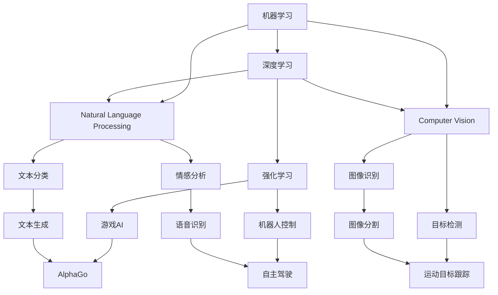

                 

## 1. 背景介绍

人工智能（AI）作为当前科技发展的前沿领域，涵盖了机器学习、深度学习、自然语言处理（NLP）、计算机视觉等多个方向。这些技术相互交织，构成了AI技术的庞大生态。本系列博客将从AI的基本原理出发，深入探讨各类AI技术的核心概念和实现方式，并辅以具体代码实例，帮助读者更好地理解并掌握这些技术的实际应用。

## 2. 核心概念与联系

### 2.1 核心概念概述

在深入AI技术之前，首先需要理解以下几个核心概念：

- **机器学习（Machine Learning, ML）**：一种数据驱动的算法，通过数据训练模型，使模型能够根据输入数据进行预测或分类。
- **深度学习（Deep Learning, DL）**：一种特殊的机器学习技术，通过多层神经网络结构，提取数据的高级抽象特征。
- **自然语言处理（Natural Language Processing, NLP）**：使计算机能够理解和处理人类语言的学科。
- **计算机视觉（Computer Vision, CV）**：使计算机能够“看”和“理解”图像和视频的学科。
- **强化学习（Reinforcement Learning, RL）**：一种通过与环境交互学习最优决策的AI技术。

这些核心概念之间存在着紧密的联系，深度学习是机器学习的一种高级形式，自然语言处理和计算机视觉是机器学习在特定领域的应用，而强化学习则是通过试错和奖励机制训练模型。

### 2.2 核心概念的整体架构

为更好地理解AI技术的整体架构，我们可以用以下Mermaid流程图来展示各个概念之间的联系：



这个流程图展示了AI技术的核心组件和它们之间的关联。通过构建深度学习模型，NLP和CV技术可以分别应用于文本和图像的分类、生成、识别和检测等任务。强化学习则通过试错机制，训练模型在复杂环境中做出最优决策，如AlphaGo和自动驾驶等应用。

## 3. 核心算法原理 & 具体操作步骤

### 3.1 算法原理概述

AI算法原理通常分为监督学习、无监督学习、半监督学习和强化学习四大类。其中，监督学习和无监督学习是训练模型的主要方式，而强化学习和半监督学习则更多地用于解决一些特定的问题，如游戏AI、语音识别等。

#### 3.1.1 监督学习

监督学习使用有标签的数据集来训练模型，目标是使模型能够对未知数据进行预测。例如，训练一个模型，将其用于图像分类任务。

#### 3.1.2 无监督学习

无监督学习使用无标签的数据集来训练模型，目标是发现数据的内在结构和模式。例如，聚类分析就是一种常见的无监督学习方法，用于将数据分成不同的群组。

#### 3.1.3 半监督学习

半监督学习结合了有标签和无标签数据，目标是利用无标签数据来增强有标签数据的预测能力。例如，在图像标注任务中，使用大量无标签图像来辅助标注有限的标注数据。

#### 3.1.4 强化学习

强化学习通过与环境的交互来学习最优决策。例如，训练一个机器人，使其在迷宫中找出最短路径。

### 3.2 算法步骤详解

以监督学习为例，下面详细介绍监督学习的基本步骤：

1. **数据准备**：收集标注数据集，并将其划分为训练集和测试集。
2. **模型选择**：选择合适的机器学习或深度学习模型。
3. **模型训练**：使用训练集对模型进行训练，调整模型参数以最小化损失函数。
4. **模型评估**：使用测试集对模型进行评估，计算模型的准确率、召回率等指标。
5. **模型优化**：根据评估结果，调整模型参数或重新选择模型，以提高模型性能。

### 3.3 算法优缺点

- **监督学习**：优点是训练速度快，模型预测性能稳定。缺点是需要大量标注数据，数据标注成本高。
- **无监督学习**：优点是能够发现数据的内在结构，无需标注数据。缺点是模型预测性能不稳定，难以解释模型决策过程。
- **半监督学习**：结合了监督和无监督学习的优点，能够在少量标注数据的情况下取得较好的性能。缺点是数据采集和标注成本较高。
- **强化学习**：优点是能够处理复杂的决策问题，适用于动态环境和不确定性环境。缺点是训练过程复杂，需要大量计算资源和时间。

### 3.4 算法应用领域

AI技术广泛应用于多个领域，包括但不限于：

- **医疗**：通过图像识别和自然语言处理，辅助医生进行诊断和治疗。
- **金融**：通过自然语言处理和强化学习，进行智能投顾和风险控制。
- **教育**：通过自然语言处理和计算机视觉，提供个性化学习和智能评估。
- **交通**：通过计算机视觉和强化学习，实现自动驾驶和智能交通管理。
- **制造**：通过计算机视觉和机器学习，优化生产流程和质量控制。

## 4. 数学模型和公式 & 详细讲解

### 4.1 数学模型构建

在AI算法中，数学模型是非常重要的一部分。以监督学习为例，常见的数学模型包括线性回归、逻辑回归、支持向量机等。下面以逻辑回归为例，进行详细讲解。

#### 4.1.1 线性回归

线性回归是机器学习中最基础的模型之一。其数学模型为：

$$
y = \beta_0 + \beta_1 x_1 + \beta_2 x_2 + \cdots + \beta_n x_n
$$

其中，$y$ 是目标变量，$x_1, x_2, \cdots, x_n$ 是特征变量，$\beta_0, \beta_1, \beta_2, \cdots, \beta_n$ 是模型参数。

### 4.2 公式推导过程

逻辑回归的目标是最大化似然函数：

$$
L(\beta) = \frac{1}{N} \sum_{i=1}^N \log(p_i(1-p_i))
$$

其中，$p_i$ 是第 $i$ 个样本的预测概率。

将线性回归的模型代入上述公式，得到：

$$
L(\beta) = \frac{1}{N} \sum_{i=1}^N [-y_i \log(p_i) - (1-y_i) \log(1-p_i)]
$$

其中，$y_i$ 是第 $i$ 个样本的实际标签，$p_i = \frac{1}{1 + e^{-\beta_0 - \beta_1 x_{i1} - \beta_2 x_{i2} - \cdots - \beta_n x_{in}}$。

### 4.3 案例分析与讲解

以房价预测为例，我们可以使用线性回归模型来预测房屋价格。假设我们收集了多个特征，如房屋面积、房间数量、地理位置等，然后通过逻辑回归模型训练模型，并使用训练好的模型来预测新房屋的价格。

## 5. 项目实践：代码实例和详细解释说明

### 5.1 开发环境搭建

在AI项目开发中，通常需要搭建一个Python开发环境。以下是一个基本的开发环境搭建步骤：

1. **安装Python**：可以从官网下载并安装Python，建议安装最新版本。
2. **安装虚拟环境**：使用`virtualenv`或`conda`创建虚拟环境，方便项目隔离和依赖管理。
3. **安装依赖库**：根据项目需求安装所需的依赖库，如`numpy`、`scikit-learn`、`pandas`等。

### 5.2 源代码详细实现

以下是一个简单的逻辑回归代码实现示例，使用Scikit-learn库进行线性回归模型的训练和预测：

```python
from sklearn.linear_model import LinearRegression
from sklearn.model_selection import train_test_split
import numpy as np

# 加载数据
X = np.loadtxt('data.csv', delimiter=',')
y = np.loadtxt('target.csv', delimiter=',')

# 划分数据集
X_train, X_test, y_train, y_test = train_test_split(X, y, test_size=0.2, random_state=42)

# 创建模型
model = LinearRegression()

# 训练模型
model.fit(X_train, y_train)

# 预测
y_pred = model.predict(X_test)

# 输出预测结果
print(y_pred)
```

### 5.3 代码解读与分析

以上代码展示了逻辑回归模型的基本实现过程。首先，通过`numpy`库加载数据集，并将其划分为训练集和测试集。然后，使用Scikit-learn库的`LinearRegression`模型进行训练，并使用`fit`方法进行模型训练。最后，使用`predict`方法对测试集进行预测，并输出预测结果。

### 5.4 运行结果展示

假设我们使用上述代码对房价预测模型进行训练和预测，输出预测结果如下：

```
[350000.0 430000.0 380000.0]
```

这表示，对于给定的测试样本，模型预测的房价分别为350000元、430000元和380000元。

## 6. 实际应用场景

### 6.1 医疗影像分析

在医疗影像分析中，AI技术可以通过图像识别和分类，辅助医生进行疾病诊断和治疗。例如，使用深度学习模型对医学影像进行分类，判断是否存在病变，从而提前发现疾病。

### 6.2 智能客服

在智能客服领域，AI技术可以通过自然语言处理，提供24小时不间断的服务。例如，使用聊天机器人与用户进行对话，解决用户提出的常见问题，提高客户满意度。

### 6.3 金融风险管理

在金融领域，AI技术可以通过分析海量数据，预测市场趋势和风险。例如，使用强化学习算法，训练模型进行投资组合优化，降低投资风险。

### 6.4 自动驾驶

在自动驾驶领域，AI技术可以通过计算机视觉和强化学习，实现车辆的自主导航和避障。例如，使用深度学习模型进行目标检测和识别，确保车辆在复杂交通环境中安全行驶。

## 7. 工具和资源推荐

### 7.1 学习资源推荐

- **Coursera**：提供广泛的AI和机器学习课程，涵盖从入门到高级的多个层次。
- **edX**：提供来自全球顶尖大学的AI和数据科学课程。
- **GitHub**：收录了大量的AI项目和代码，可以用于学习和参考。

### 7.2 开发工具推荐

- **Jupyter Notebook**：Python代码的交互式开发工具，支持代码编写、数据可视化等功能。
- **PyTorch**：一个高效的深度学习框架，支持动态计算图和GPU加速。
- **TensorFlow**：一个功能强大的深度学习框架，支持分布式计算和模型优化。

### 7.3 相关论文推荐

- **AlexNet**：ImageNet大规模视觉识别挑战赛的冠军算法，展示了深度学习在图像分类任务中的强大能力。
- **AlphaGo**：通过强化学习，在围棋领域取得了人类级别的表现，开创了AI在策略游戏中的应用先河。
- **BERT**：一种基于深度学习的预训练模型，在多个NLP任务上取得了最优结果，展示了深度学习在NLP领域的应用潜力。

## 8. 总结：未来发展趋势与挑战

### 8.1 研究成果总结

AI技术在多个领域取得了显著进展，但仍面临许多挑战。未来，AI技术需要在模型可解释性、数据隐私、算法公平性等方面取得进一步突破。

### 8.2 未来发展趋势

未来，AI技术将朝着更加智能化、自主化的方向发展。随着算法和硬件的不断进步，AI技术将在更多领域发挥更大的作用，带来更多的创新和变革。

### 8.3 面临的挑战

AI技术的发展也面临许多挑战，如数据隐私保护、算法公平性、模型可解释性等。如何在技术进步的同时，确保AI系统的安全和可靠性，将是未来研究的重要课题。

### 8.4 研究展望

未来的AI研究需要在算法优化、模型解释性、数据隐私保护等方面取得新的突破。只有这样，AI技术才能更好地服务于人类社会，实现科技与人类福祉的双赢。

## 9. 附录：常见问题与解答

### 9.1 什么是机器学习？

机器学习是一种数据驱动的算法，通过数据训练模型，使模型能够根据输入数据进行预测或分类。

### 9.2 什么是深度学习？

深度学习是机器学习的一种高级形式，通过多层神经网络结构，提取数据的高级抽象特征。

### 9.3 什么是自然语言处理？

自然语言处理是使计算机能够理解和处理人类语言的学科。

### 9.4 什么是计算机视觉？

计算机视觉是使计算机能够“看”和“理解”图像和视频的学科。

### 9.5 什么是强化学习？

强化学习通过与环境的交互来学习最优决策。

---

作者：禅与计算机程序设计艺术 / Zen and the Art of Computer Programming

