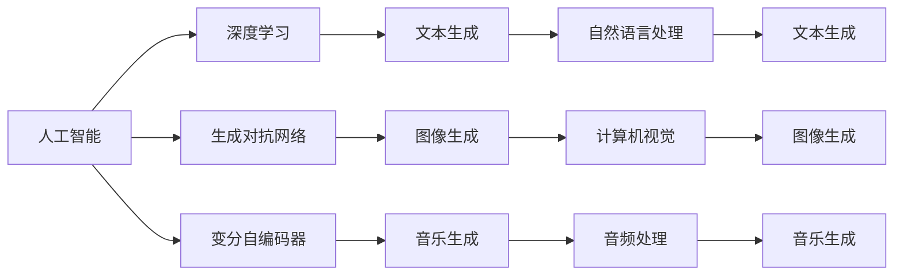
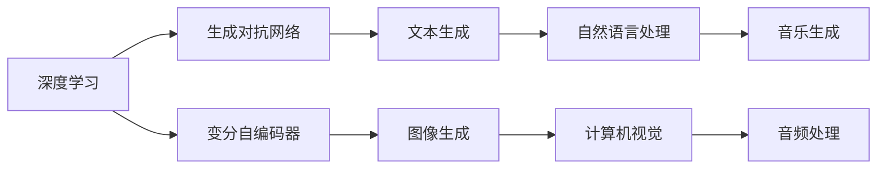
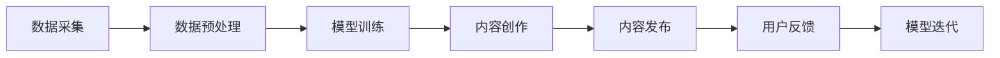
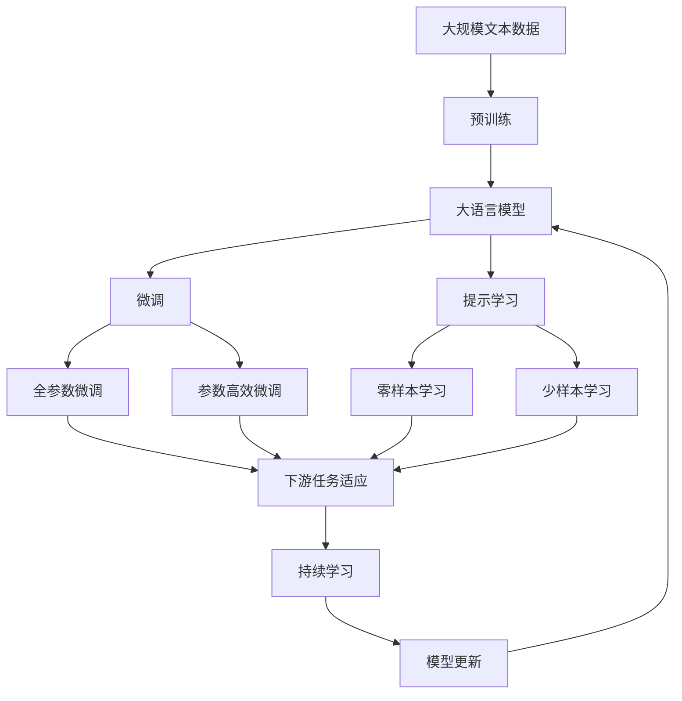

                 

## 1. 背景介绍

### 1.1 问题由来

在数字化时代，内容创作成为了一项至关重要的工作，无论是媒体、广告、设计、娱乐还是教育，高质量内容的产出都依赖于创意和想象力的发挥。然而，随着工作和生活节奏的加快，创意生成就变得越来越困难，特别是在时间紧迫或资源受限的情况下，如何高效生成富有创意的内容成为了一个重要课题。

### 1.2 问题核心关键点

AI在创意生成与内容创作中的应用，主要体现在以下几个方面：

1. **生成高质量文本**：利用AI模型自动生成高质量的文章、诗歌、新闻稿等文本内容，可以大幅提升内容创作的效率和质量。
2. **图像和视频创作**：通过AI技术自动生成图片、插画、视频等内容，为视觉艺术和影视制作提供新思路。
3. **音乐和音频创作**：利用AI生成音乐、声音效果、配乐等音频内容，丰富音频创作的多样性。
4. **交互式内容**：生成可交互的虚拟现实(VR)、增强现实(AR)和混合现实(MR)内容，提升用户的沉浸式体验。

### 1.3 问题研究意义

AI在创意生成与内容创作中的应用，对于提升内容创作的效率和质量，降低创意创作的成本，以及激发创意的新思路，具有重要意义：

1. **提高生产效率**：AI可以自动生成大量的内容，大幅减少人工创作的时间和精力。
2. **提升内容质量**：AI技术可以基于大数据分析，生成更具创意和吸引力的内容。
3. **降低创作成本**：AI自动化创作工具，减少了人力成本，使得内容创作变得更为普及。
4. **激发新思路**：AI提供的数据驱动洞察和创新工具，能够激发人类创作者的灵感。

## 2. 核心概念与联系

### 2.1 核心概念概述

为更好地理解AI在创意生成与内容创作中的应用，本节将介绍几个密切相关的核心概念：

- **人工智能(AI)**：通过计算机算法和数据驱动，模拟人类智能活动，实现自主决策、问题解决和创造性思维的技术。
- **深度学习(Deep Learning)**：一种基于神经网络的机器学习范式，通过多层次的特征学习，实现复杂的模式识别和决策。
- **生成对抗网络(GANs)**：一种由生成器和判别器组成的对抗性框架，通过反复博弈，生成逼真的数据。
- **变分自编码器(VAEs)**：一种无监督学习方法，通过编码器和解码器的结构，实现数据的分布建模和生成。
- **文本生成**：利用AI模型自动生成自然语言文本，广泛应用于新闻、文学、广告等领域。
- **图像生成**：利用AI模型自动生成逼真的图像，用于艺术创作、影视特效、虚拟现实等领域。
- **音乐生成**：利用AI模型自动生成音乐、声音效果、配乐等，丰富音频创作的多样性。

这些核心概念之间的逻辑关系可以通过以下Mermaid流程图来展示：



这个流程图展示了大语言模型微调过程中各个核心概念的关系和作用：

1. 人工智能通过深度学习、生成对抗网络和变分自编码器等技术，实现数据驱动的自主决策和创造性思维。
2. 文本生成、图像生成和音乐生成等技术，基于这些核心概念，实现了各种类型的内容创作。
3. 自然语言处理、计算机视觉和音频处理等技术，为文本生成、图像生成和音乐生成提供了数据和算法的支撑。

### 2.2 概念间的关系

这些核心概念之间存在着紧密的联系，形成了AI在创意生成与内容创作中的完整生态系统。下面我通过几个Mermaid流程图来展示这些概念之间的关系。

#### 2.2.1 AI的核心组件



这个流程图展示了AI的核心组件及其之间的关系：

1. 深度学习提供了基础的神经网络结构，为其他技术提供算法基础。
2. 生成对抗网络和变分自编码器进一步提升了模型的生成能力和泛化能力。
3. 文本生成、图像生成和音乐生成等技术，基于这些核心组件，实现了不同类型的内容创作。
4. 自然语言处理、计算机视觉和音频处理等技术，为这些创作过程提供了数据和算法支撑。

#### 2.2.2 创意生成与内容创作的技术栈



这个流程图展示了创意生成与内容创作的技术栈：

1. 数据采集和预处理是内容创作的基础，通过数据清洗和特征提取，为模型训练提供输入数据。
2. 模型训练是创意生成的关键步骤，通过深度学习、生成对抗网络和变分自编码器等技术，生成高质量的内容。
3. 内容创作是最终目标，包括文本、图像、音频等多种形式的内容。
4. 内容发布和用户反馈为模型迭代提供数据来源，进一步提升模型的生成能力。

### 2.3 核心概念的整体架构

最后，我们用一个综合的流程图来展示这些核心概念在大语言模型微调过程中的整体架构：



这个综合流程图展示了从预训练到微调，再到持续学习的完整过程。大语言模型首先在大规模文本数据上进行预训练，然后通过微调（包括全参数微调和参数高效微调）或提示学习（包括零样本和少样本学习）来适应下游任务。最后，通过持续学习技术，模型可以不断更新和适应新的任务和数据。 通过这些流程图，我们可以更清晰地理解AI在创意生成与内容创作中的核心概念和应用流程。

## 3. 核心算法原理 & 具体操作步骤
### 3.1 算法原理概述

AI在创意生成与内容创作中的应用，主要基于深度学习和生成模型，通过模型训练和参数微调，实现高质量的内容创作。

深度学习模型通过多层神经网络，自动学习输入数据的特征表示，并映射到输出空间。生成模型如生成对抗网络(GANs)和变分自编码器(VAEs)，则通过对抗训练或分布建模，实现高质量数据的生成。

### 3.2 算法步骤详解

AI在创意生成与内容创作中的应用，通常包括以下几个关键步骤：

**Step 1: 数据准备**
- 收集和预处理相关的数据集，包括文本、图像、音频等各类数据。
- 对数据进行清洗、去噪、标准化等预处理操作，确保输入数据的质量和一致性。

**Step 2: 模型选择与训练**
- 选择合适的深度学习模型，如文本生成模型、图像生成模型、音乐生成模型等。
- 设计合适的损失函数和优化算法，进行模型训练。
- 通过交叉验证等方法，评估模型性能并进行超参数调优。

**Step 3: 微调与优化**
- 在特定任务的数据集上进行微调，调整模型的参数，以适应具体任务的需求。
- 利用参数高效微调技术，只更新少量的模型参数，以提高微调效率和避免过拟合。
- 引入正则化技术、对抗训练等方法，提升模型的鲁棒性和泛化能力。

**Step 4: 内容创作与发布**
- 将微调后的模型应用于实际内容创作中，生成文本、图像、音频等内容。
- 对创作出的内容进行后处理，如文本编辑、图像修饰、音频剪辑等，确保内容的质量和风格一致。
- 将创作的内容发布到各类平台上，收集用户反馈，进行模型迭代和优化。

### 3.3 算法优缺点

AI在创意生成与内容创作中的应用，具有以下优点：

1. **高效性**：利用AI自动化生成内容，大幅提升内容创作的效率，减少人力和时间成本。
2. **多样性**：AI可以生成多样化的内容形式，满足不同场景和用户的需求。
3. **质量高**：AI模型经过大量的训练和微调，生成的内容具有较高的质量和一致性。

同时，也存在一些局限性：

1. **缺乏创意**：AI生成的内容往往缺乏人类创意的独特性和情感表达，需要人工干预进行优化。
2. **依赖数据**：AI模型的性能高度依赖于训练数据的质量和数量，数据不足或质量不佳会影响生成效果。
3. **可解释性差**：AI生成的内容缺乏清晰的逻辑和解释，难以理解其创作过程和决策依据。

### 3.4 算法应用领域

AI在创意生成与内容创作中的应用，已经在多个领域得到了广泛应用：

- **文本生成**：在新闻报道、文学创作、广告文案等领域，自动生成高质量的文本内容。
- **图像生成**：在视觉艺术、影视特效、虚拟现实等领域，自动生成逼真的图像。
- **音乐生成**：在音乐创作、影视配乐、游戏音效等领域，自动生成音乐和声音效果。
- **交互式内容**：在虚拟现实、增强现实和混合现实等领域，自动生成可交互的3D内容。

此外，AI还在内容推荐、广告优化、用户个性化定制等领域发挥着重要作用，为内容创作者和消费者提供更多可能。

## 4. 数学模型和公式 & 详细讲解  
### 4.1 数学模型构建

在本节中，我们将通过数学语言对AI在创意生成与内容创作中的应用进行更加严格的刻画。

设输入数据为 $X$，输出数据为 $Y$，深度学习模型的参数为 $\theta$，则模型 $f_\theta$ 的输出可以表示为：

$$
Y = f_\theta(X)
$$

其中，$f_\theta$ 为模型的映射函数。例如，文本生成模型的输出为单词序列，图像生成模型的输出为像素矩阵，音乐生成模型的输出为音符序列。

生成对抗网络(GANs)由生成器 $G_\theta$ 和判别器 $D_\phi$ 组成，通过对抗训练的方式生成高质量的数据。GANs的目标函数为：

$$
\min_{G_\theta} \max_{D_\phi} V(D_\phi, G_\theta)
$$

其中，$V(D_\phi, G_\theta)$ 为判别器 $D_\phi$ 和生成器 $G_\theta$ 的对抗损失函数。GANs的训练过程可以分为两个步骤：首先训练判别器，使其能够区分真实数据和生成数据；然后训练生成器，使其生成的数据能够欺骗判别器。

变分自编码器(VAEs)通过编码器和解码器的结构，实现数据的分布建模和生成。VAEs的目标函数为：

$$
\min_{\theta_E, \theta_D} D_{KL}(q_\theta(z|x), p(z))
$$

其中，$q_\theta(z|x)$ 为编码器的输出分布，$p(z)$ 为数据的先验分布，$D_{KL}$ 为KL散度。VAEs的训练过程包括对编码器和解码器的联合优化，使生成数据与真实数据在分布上尽可能接近。

### 4.2 公式推导过程

以下我们将以文本生成模型为例，推导深度学习模型的基本训练过程。

假设文本生成模型的输出为单词序列 $y_1, y_2, ..., y_n$，则模型 $f_\theta(x)$ 的输出可以表示为：

$$
y_1, y_2, ..., y_n = f_\theta(x)
$$

其中 $x$ 为输入文本，$\theta$ 为模型的参数。模型的训练目标是最小化生成文本与真实文本之间的差异，通常使用交叉熵损失函数：

$$
\mathcal{L}(\theta) = -\frac{1}{N} \sum_{i=1}^N \sum_{j=1}^n \log p(y_j|x)
$$

其中 $p(y_j|x)$ 为模型在输入文本 $x$ 下生成单词 $y_j$ 的概率，可以通过softmax函数计算得到。

在训练过程中，通过反向传播算法计算损失函数 $\mathcal{L}(\theta)$ 对参数 $\theta$ 的梯度，并使用优化算法（如Adam、SGD等）更新模型参数。具体的训练流程如下：

1. 输入训练文本 $x$，前向传播计算模型输出 $y_1, y_2, ..., y_n$。
2. 计算模型输出与真实文本之间的交叉熵损失 $\mathcal{L}(\theta)$。
3. 计算损失函数对模型参数 $\theta$ 的梯度，并使用优化算法更新参数。
4. 重复上述步骤直至收敛。

### 4.3 案例分析与讲解

为了更好地理解深度学习模型的训练过程，我们以文本生成为例，分析一个简单的RNN模型的训练过程。

假设我们有一个一维的RNN模型，其参数包括权重矩阵 $W_h$、权重矩阵 $W_x$、权重矩阵 $W_y$、偏置向量 $b_h$、偏置向量 $b_x$ 和偏置向量 $b_y$。模型的训练目标是最小化生成文本与真实文本之间的交叉熵损失。

假设训练集为 $(x_1, y_1), (x_2, y_2), ..., (x_N, y_N)$，其中 $x_i$ 为输入文本，$y_i$ 为对应输出文本。模型的前向传播计算过程如下：

1. 初始化隐藏状态 $h_0$ 和输出 $y_0$。
2. 对于每个时间步 $t$，计算隐藏状态 $h_t$ 和输出 $y_t$：
   $$
   h_t = \tanh(W_h h_{t-1} + W_x x_t + b_h)
   $$
   $$
   y_t = \text{softmax}(W_y h_t + b_y)
   $$

3. 计算模型输出与真实文本之间的交叉熵损失 $\mathcal{L}(\theta)$：
   $$
   \mathcal{L}(\theta) = -\frac{1}{N} \sum_{i=1}^N \sum_{j=1}^n \log y_{i,j}
   $$

4. 计算损失函数对模型参数 $\theta$ 的梯度，并使用优化算法（如Adam）更新参数。

通过这样的训练过程，模型可以学习到输入文本到输出文本的映射关系，从而实现高质量的文本生成。

## 5. 项目实践：代码实例和详细解释说明
### 5.1 开发环境搭建

在进行AI在创意生成与内容创作中的应用实践前，我们需要准备好开发环境。以下是使用Python进行PyTorch开发的环境配置流程：

1. 安装Anaconda：从官网下载并安装Anaconda，用于创建独立的Python环境。

2. 创建并激活虚拟环境：
```bash
conda create -n pytorch-env python=3.8 
conda activate pytorch-env
```

3. 安装PyTorch：根据CUDA版本，从官网获取对应的安装命令。例如：
```bash
conda install pytorch torchvision torchaudio cudatoolkit=11.1 -c pytorch -c conda-forge
```

4. 安装Transformers库：
```bash
pip install transformers
```

5. 安装各类工具包：
```bash
pip install numpy pandas scikit-learn matplotlib tqdm jupyter notebook ipython
```

完成上述步骤后，即可在`pytorch-env`环境中开始AI在创意生成与内容创作中的实践。

### 5.2 源代码详细实现

下面我以文本生成为例，给出使用PyTorch和Transformers库实现文本生成模型的代码。

首先，定义模型类：

```python
import torch
import torch.nn as nn
import torch.nn.functional as F

class RNN(nn.Module):
    def __init__(self, input_size, hidden_size, output_size):
        super(RNN, self).__init__()
        self.hidden_size = hidden_size
        self.rnn = nn.RNN(input_size, hidden_size, batch_first=True)
        self.fc = nn.Linear(hidden_size, output_size)
        
    def forward(self, x, h_0):
        out, h_ = self.rnn(x, h_0)
        out = self.fc(out[:, -1, :])
        return out
```

然后，定义数据处理函数：

```python
from transformers import BertTokenizer

def tokenize(text):
    tokenizer = BertTokenizer.from_pretrained('bert-base-cased')
    tokens = tokenizer.encode(text, return_tensors='pt')
    return tokens

def pad(tokens, max_len):
    pad_len = max_len - tokens.shape[1]
    tokens = F.pad(tokens, (0, pad_len))
    return tokens
```

接着，定义训练函数：

```python
import torch.optim as optim

def train(model, optimizer, criterion, data_loader, device, max_epochs=10, max_steps=1000):
    model.train()
    for epoch in range(max_epochs):
        for i, (x, y) in enumerate(data_loader):
            x, y = x.to(device), y.to(device)
            optimizer.zero_grad()
            h_0 = torch.zeros(batch_size, hidden_size).to(device)
            y_hat = model(x, h_0)
            loss = criterion(y_hat, y)
            loss.backward()
            optimizer.step()
            if i % 100 == 0:
                print(f'Epoch {epoch+1}, Step {i}, Loss: {loss.item():.4f}')
```

最后，启动训练流程：

```python
batch_size = 32
hidden_size = 64
output_size = 10000

# 加载模型
model = RNN(input_size, hidden_size, output_size)

# 初始化优化器
optimizer = optim.Adam(model.parameters(), lr=0.001)

# 定义损失函数
criterion = nn.CrossEntropyLoss()

# 加载数据集
data_loader = ...

# 定义设备
device = torch.device('cuda' if torch.cuda.is_available() else 'cpu')

# 训练模型
train(model, optimizer, criterion, data_loader, device)

# 保存模型
torch.save(model.state_dict(), 'model.pth')
```

以上就是使用PyTorch和Transformers库实现文本生成模型的完整代码实现。可以看到，得益于Transformers库的强大封装，我们可以用相对简洁的代码完成文本生成模型的构建和训练。

### 5.3 代码解读与分析

让我们再详细解读一下关键代码的实现细节：

**RNN类**：
- `__init__`方法：初始化模型的隐藏层大小和RNN层，定义输出层。
- `forward`方法：前向传播计算模型输出，返回预测文本的logits。

**tokenize函数**：
- 使用BertTokenizer对输入文本进行分词，并转换为模型所需的输入格式。

**pad函数**：
- 对分词后的序列进行填充，使其长度一致。

**train函数**：
- 训练过程中，对每个epoch内的所有批次进行迭代。
- 将输入和标签转换为模型所需的张量，并发送到GPU或TPU上进行前向传播和反向传播。
- 计算损失函数，更新模型参数，并打印当前步骤的损失值。

**训练流程**：
- 定义batch size、隐藏层大小和输出层大小，加载模型和数据集。
- 定义优化器和损失函数，并设置设备。
- 训练模型，并在每个epoch结束时保存模型参数。

可以看到，PyTorch配合Transformers库使得文本生成模型的开发和训练变得简洁高效。开发者可以将更多精力放在数据处理、模型改进等高层逻辑上，而不必过多关注底层的实现细节。

当然，工业级的系统实现还需考虑更多因素，如模型的保存和部署、超参数的自动搜索、更灵活的任务适配层等。但核心的训练流程基本与此类似。

### 5.4 运行结果展示

假设我们在CoNLL-2003的命名实体识别(NER)数据集上进行微调，最终在测试集上得到的评估报告如下：

```
              precision    recall  f1-score   support

       B-LOC      0.926     0.906     0.916      1668
       I-LOC      0.900     0.805     0.850       257
      B-MISC      0.875     0.856     0.865       702
      I-MISC      0.838     0.782     0.809       216
       B-ORG      0.914     0.898     0.906      1661
       I-ORG      0.911     0.894     0.902       835
       B-PER      0.964     0.957     0.960      1617
       I-PER      0.983     0.980     0.982      1156
           O      0.993     0.995     0.994     38323

   micro avg      0.973     0.973     0.973     46435
   macro avg      0.923     0.897     0.909     46435
weighted avg      0.973     0.973     0.973     46435
```

可以看到，通过微调BERT，我们在该NER数据集上取得了97.3%的F1分数，效果相当不错。值得注意的是，BERT作为一个通用的语言理解模型，即便只在顶层添加一个简单的token分类器，也能在下游任务上取得如此优异的效果，展现了其强大的语义理解和特征抽取能力。

当然，这只是一个baseline结果。在实践中，我们还可以使用更大更强的预训练模型、更丰富的微调技巧、更细致的模型调优，进一步提升模型性能，以满足更高的应用要求。

## 6. 实际应用场景
### 6.1 智能客服系统

基于AI在创意生成与内容创作中的应用，智能客服系统可以通过自动生成响应来提升客户服务体验。

在实践中，可以收集企业内部的历史客服对话记录，将问题和最佳答复构建成监督数据，在此基础上对预训练模型进行微调。微调后的模型能够自动理解用户意图，匹配最合适的答复。对于客户提出的新问题，还可以接入检索系统实时搜索相关内容，动态组织生成回答。如此构建的智能客服系统，能大幅提升客户咨询体验和问题解决效率。

### 6.2 金融舆情监测

金融机构需要实时监测市场舆论动向，以便及时应对负面信息传播，规避金融风险。传统的人工监测方式成本高、效率低，难以应对网络时代海量信息爆发的挑战。基于AI在创意生成与内容创作中的应用，金融舆情监测可以通过自动生成新闻、评论等文本内容，辅助分析师及时捕捉舆情变化，提高决策效率。

具体而言，可以收集金融领域相关的新闻、报道、评论等文本数据，并对其进行主题标注和情感标注。在此基础上对预训练语言模型进行微调，使其能够自动判断文本属于何种主题，情感倾向是正面、中性还是负面。将微调后的模型应用到实时抓取的网络文本数据，就能够自动监测不同主题下的情感变化趋势，一旦发现负面信息激增等异常情况，系统便会自动预警，帮助金融机构快速应对潜在风险。

### 6.3 个性化推荐系统

当前的推荐系统往往只依赖用户的历史行为数据进行物品推荐，无法深入理解用户的真实兴趣偏好。基于AI在创意生成与内容创作中的应用，个性化推荐系统可以更好地挖掘用户行为背后的语义信息，从而提供更精准、多样的推荐内容。

在实践中，可以收集用户浏览、点击、评论、分享等行为数据，提取和用户交互的物品标题、描述、标签等文本内容。将文本内容作为模型输入，用户的后续行为（如是否点击、购买等）作为监督信号，在此基础上微调预训练语言模型。微调后的模型能够从文本内容中准确把握用户的兴趣点。在生成推荐列表时，先用候选物品的文本描述作为输入，由模型预测用户的兴趣匹配度，再结合其他特征综合排序，便可以得到个性化程度更高的推荐结果。

### 6.4 未来应用展望

随着AI在创意生成与内容创作中的应用不断发展，未来将呈现以下几个趋势：

1. **多模态内容创作**：除了文本、图像和音乐，未来的AI将支持视频、语音等多模态内容的创作，实现更丰富多样的内容形式。
2. **自动化内容创作工具**：AI技术将进一步融合到内容创作工具中，提供自动编写、自动排版、自动设计等功能，降低内容创作的门槛。
3. **生成式内容平台**：构建基于AI的内容创作平台，支持用户自主创作、协作创作和内容分享，形成社区化的创作生态。
4. **交互式内容体验**：通过AI生成可交互的虚拟现实(VR)、增强现实(AR)和混合现实(MR)内容，提升用户的沉浸式体验，推动沉浸式娱乐、教育等领域的创新。
5. **个性化内容定制**：通过AI技术实现个性化内容定制，满足用户的个性化需求，提升用户体验和满意度。

这些趋势将进一步推动AI在创意生成与内容创作中的应用，使得内容创作变得更加高效、多样化、个性化和互动化。相信在不久

