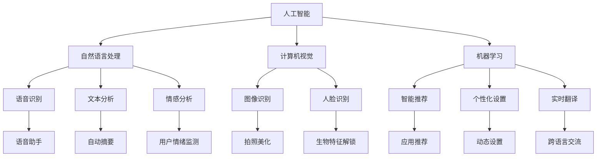
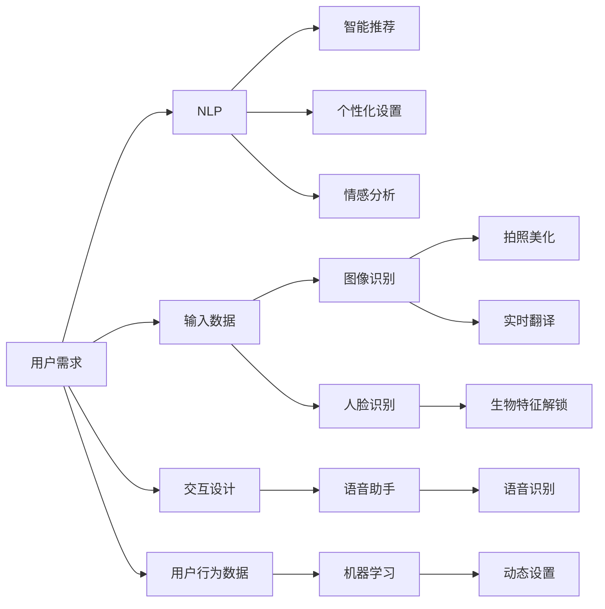
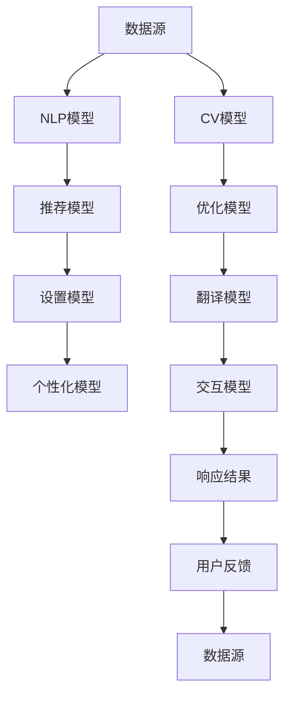
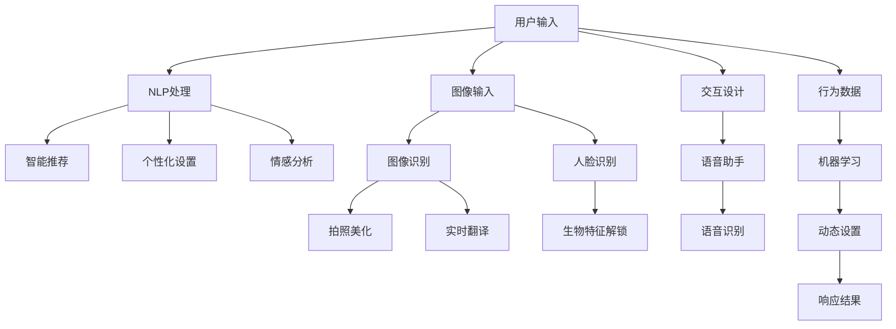

                 

# AI在智能手机中的应用:增强移动体验

> 关键词：人工智能,智能手机,自然语言处理,NLP,计算机视觉,机器学习,交互设计,个性化推荐

## 1. 背景介绍

### 1.1 问题由来
智能手机作为现代生活中不可或缺的通讯工具，其功能和体验不断升级。人工智能（AI）技术的应用，成为推动智能手机发展的关键驱动力之一。AI技术以其高效、精准的特性，为用户带来了更智能、更便捷的移动体验。本文将重点介绍AI在智能手机中的应用，包括自然语言处理（NLP）、计算机视觉、机器学习以及个性化推荐等领域，以期为手机开发者提供思路和参考。

### 1.2 问题核心关键点
AI在智能手机中的应用，主要集中在以下几个方面：

- **自然语言处理（NLP）**：包括语音识别、文本分析、情感分析等技术，帮助智能手机更好地理解用户需求和情感。
- **计算机视觉**：通过图像识别、人脸识别等技术，提升手机的拍照、解锁、导航等功能。
- **机器学习**：在智能推荐、个性化设置、实时翻译等应用中，提升用户的使用体验。
- **交互设计**：结合自然语言和计算机视觉，提升人机交互的效率和自然性。
- **个性化推荐**：根据用户的行为数据和偏好，提供定制化的应用和服务。

这些应用不仅提升了智能手机的智能水平，还为用户带来了更加自然、高效的移动体验。但同时，也面临着数据隐私、算法透明性等伦理问题。本文将系统梳理这些AI技术在智能手机中的应用，探讨其发展趋势和面临的挑战。

### 1.3 问题研究意义
AI在智能手机中的应用，不仅提升了用户体验，还推动了手机行业的发展。研究这些应用，对于开发者了解AI技术最新进展，提升应用开发能力，具有重要意义：

- **提升用户体验**：通过AI技术，智能手机可以更加智能地响应用户需求，提升操作效率和满意度。
- **推动产品创新**：AI技术的引入，使得手机产品功能更加丰富，应用场景更加广泛。
- **降低开发成本**：AI技术的应用，可以减少对大量标注数据和算力的依赖，降低开发和维护成本。
- **增强竞争力**：AI技术的应用，可以提升产品差异化水平，增强市场竞争力。
- **促进社会进步**：智能手机的普及和应用，有助于推动社会信息化进程，提升全民科技素养。

## 2. 核心概念与联系

### 2.1 核心概念概述

为更好地理解AI在智能手机中的应用，本节将介绍几个核心概念：

- **人工智能（AI）**：通过算法模拟人类智能行为的技术。
- **自然语言处理（NLP）**：研究如何让机器理解、处理、生成人类语言的技术。
- **计算机视觉（CV）**：研究如何让机器“看”的技术。
- **机器学习（ML）**：让机器通过数据自动学习优化性能的技术。
- **个性化推荐**：根据用户行为和偏好，推荐最相关的内容或服务。
- **交互设计**：研究如何让用户和机器进行高效、自然交互的技术。

这些核心概念之间的联系和应用场景，可以通过以下Mermaid流程图来展示：



这个流程图展示了大语言模型微调过程中各个核心概念之间的关系：

1. 人工智能是基础，通过机器学习和深度学习等技术，实现NLP、CV等功能。
2. NLP包括语音识别、文本分析、情感分析等技术，帮助手机理解用户需求和情感。
3. CV包括图像识别、人脸识别等技术，提升手机的拍照、解锁、导航等功能。
4. ML在智能推荐、个性化设置、实时翻译等应用中，提升用户的使用体验。
5. 交互设计结合NLP和CV，提升人机交互的效率和自然性。
6. 个性化推荐根据用户的行为数据和偏好，提供定制化的应用和服务。

这些核心概念共同构成了AI在智能手机中的应用框架，使其能够涵盖广泛的功能和场景。通过理解这些核心概念，我们可以更好地把握AI技术的发展方向和应用场景。

### 2.2 概念间的关系

这些核心概念之间存在着紧密的联系，形成了AI在智能手机应用中的完整生态系统。下面我通过几个Mermaid流程图来展示这些概念之间的关系。

#### 2.2.1 AI在智能手机中的应用架构



这个流程图展示了AI在智能手机中的应用架构，即用户需求从输入数据到输出结果的全过程：

1. 用户需求从NLP和CV输入端获取，NLP识别语音、文本等输入，CV处理图像、人脸等输入。
2. NLP处理后，进入智能推荐、个性化设置、情感分析等模块。
3. CV处理后，进入拍照美化、人脸解锁等模块。
4. 用户行为数据通过机器学习模块，进入动态设置等应用。
5. 最终，交互设计结合NLP和CV的输出，通过语音助手等模块，返回用户需求的响应结果。

#### 2.2.2 数据流与模型集成



这个流程图展示了数据流与模型集成的过程，即数据从输入到输出的全过程：

1. 数据源包括用户的输入数据和行为数据。
2. NLP模型和CV模型分别处理语音、文本和图像数据，提取特征。
3. 推荐模型、优化模型、设置模型、翻译模型和个性化模型，分别对不同功能进行优化。
4. 交互模型结合NLP和CV的输出，生成响应结果。
5. 用户反馈的数据再次流入数据源，循环迭代，不断优化AI系统。

### 2.3 核心概念的整体架构

最后，我们用一个综合的流程图来展示这些核心概念在大语言模型微调过程中的整体架构：



这个综合流程图展示了从用户输入到响应结果的全过程，数据从输入到输出的全过程。通过这些流程图，我们可以更清晰地理解AI在智能手机中的应用过程，为后续深入讨论具体的应用场景和技术细节奠定基础。

## 3. 核心算法原理 & 具体操作步骤

### 3.1 算法原理概述

AI在智能手机中的应用，通常基于以下核心算法原理：

- **自然语言处理（NLP）**：通过深度学习模型（如RNN、Transformer），实现语音识别、文本分析、情感分析等功能。
- **计算机视觉（CV）**：使用深度学习模型（如CNN、ResNet），实现图像识别、人脸识别等功能。
- **机器学习（ML）**：通过模型训练和调优，实现智能推荐、个性化设置等功能。
- **个性化推荐**：基于协同过滤、基于内容的推荐等算法，根据用户行为数据和偏好，推荐相关内容或服务。
- **交互设计**：结合自然语言和计算机视觉，提升人机交互的自然性和效率。

这些算法原理在大规模数据和强大计算能力的支持下，实现了高效、精准的AI应用，提升了智能手机的功能和体验。

### 3.2 算法步骤详解

以下详细介绍AI在智能手机中的核心算法步骤：

#### 3.2.1 自然语言处理（NLP）

1. **语音识别**：将用户口述语音转化为文本，通常使用深度学习模型（如RNN、Transformer），进行语音-文本的映射。
2. **文本分析**：通过NLP模型，对文本进行分词、词性标注、命名实体识别、情感分析等处理。
3. **情感分析**：根据文本情感信息，判断用户情绪状态，通常使用情感词典或深度学习模型。

#### 3.2.2 计算机视觉（CV）

1. **图像识别**：使用深度学习模型（如CNN、ResNet），对图像进行分类、对象检测、场景理解等处理。
2. **人脸识别**：通过人脸检测和特征提取，识别用户身份，通常使用卷积神经网络。
3. **拍照美化**：使用图像处理技术，提升拍照效果，如增强、降噪、滤镜等。

#### 3.2.3 机器学习（ML）

1. **智能推荐**：根据用户历史行为和偏好，推荐相关应用和服务，通常使用协同过滤或基于内容的推荐算法。
2. **个性化设置**：根据用户偏好，动态调整系统设置，如字体大小、语言等，通常使用逻辑回归或决策树模型。
3. **实时翻译**：使用机器翻译模型，将用户输入的文本或语音翻译为其他语言，通常使用Transformer或RNN模型。

#### 3.2.4 交互设计

1. **语音助手**：使用语音识别技术，识别用户口述指令，通常使用RNN或Transformer模型。
2. **交互界面**：结合自然语言处理和计算机视觉，提升人机交互的自然性和效率。

### 3.3 算法优缺点

AI在智能手机中的应用，具有以下优缺点：

#### 3.3.1 优点

1. **提升用户体验**：AI技术提升了智能手机的功能和效率，增强了用户的体验感。
2. **智能化程度高**：AI技术可以处理复杂、多样化的数据，提供智能化的应用和服务。
3. **降低开发成本**：AI技术可以自动化处理大量数据和任务，降低开发和维护成本。

#### 3.3.2 缺点

1. **数据隐私问题**：AI技术需要大量用户数据，存在数据隐私泄露的风险。
2. **算法透明性不足**：AI模型的决策过程复杂，难以解释和调试。
3. **依赖高质量数据**：AI模型的性能很大程度上依赖于数据质量，数据标注成本高。
4. **计算资源需求大**：AI模型需要强大的计算资源支持，设备硬件要求高。

### 3.4 算法应用领域

AI技术在智能手机中的应用，主要包括以下几个领域：

- **语音识别和语音助手**：提升人机交互的自然性，如Siri、Google Assistant等。
- **文本分析**：增强智能翻译、智能回复等功能，如微信翻译、智能客服等。
- **图像识别**：提升拍照效果和场景理解能力，如面部解锁、AR滤镜等。
- **个性化推荐**：提供定制化的应用和服务，如音乐推荐、新闻推荐等。
- **智能设置**：根据用户偏好，动态调整系统设置，如字体大小、亮度等。
- **实时翻译**：实现跨语言交流，提升国际用户的使用体验。

## 4. 数学模型和公式 & 详细讲解 & 举例说明

### 4.1 数学模型构建

为系统理解AI在智能手机中的应用，本节将通过数学模型构建和推导，详细讲解其中的核心算法。

#### 4.1.1 语音识别模型

语音识别模型通常基于深度神经网络，通过反向传播算法进行训练。其数学模型为：

$$
\begin{aligned}
\mathcal{L} &= \sum_{i=1}^{N} \mathcal{L}_i \\
\mathcal{L}_i &= -\sum_{j=1}^{C} y_j \log p(y_j|x_i)
\end{aligned}
$$

其中，$N$为样本数量，$C$为输出类别数，$y$为真实标签，$p$为模型预测概率，$\mathcal{L}$为交叉熵损失函数。

#### 4.1.2 图像识别模型

图像识别模型通常基于卷积神经网络（CNN），通过交叉熵损失函数进行训练。其数学模型为：

$$
\begin{aligned}
\mathcal{L} &= \sum_{i=1}^{N} \mathcal{L}_i \\
\mathcal{L}_i &= -\sum_{j=1}^{C} y_j \log p(y_j|x_i)
\end{aligned}
$$

其中，$N$为样本数量，$C$为输出类别数，$y$为真实标签，$p$为模型预测概率，$\mathcal{L}$为交叉熵损失函数。

#### 4.1.3 情感分析模型

情感分析模型通常基于情感词典或深度学习模型，通过分类损失函数进行训练。其数学模型为：

$$
\begin{aligned}
\mathcal{L} &= \sum_{i=1}^{N} \mathcal{L}_i \\
\mathcal{L}_i &= -\sum_{j=1}^{K} y_j \log p(y_j|x_i)
\end{aligned}
$$

其中，$N$为样本数量，$K$为情感类别数，$y$为真实标签，$p$为模型预测概率，$\mathcal{L}$为分类损失函数。

### 4.2 公式推导过程

下面以语音识别模型为例，推导其公式。

语音识别模型基于深度神经网络，通常采用RNN或Transformer模型。对于样本$x_i$，模型预测其属于第$j$个类别的概率$p_j$，使用softmax函数计算：

$$
p_j = \frac{e^{z_j}}{\sum_{k=1}^{C} e^{z_k}}
$$

其中，$z_j$为第$j$个类别的logit值，$C$为输出类别数。

根据交叉熵损失函数的定义，对于样本$x_i$，损失函数为：

$$
\mathcal{L}_i = -\sum_{j=1}^{C} y_j \log p(y_j|x_i)
$$

其中，$y$为真实标签，$p$为模型预测概率。

将公式带入交叉熵损失函数，得到整体损失函数：

$$
\mathcal{L} = \sum_{i=1}^{N} \mathcal{L}_i
$$

通过反向传播算法，计算梯度，使用AdamW等优化算法，更新模型参数。

### 4.3 案例分析与讲解

#### 4.3.1 语音识别案例

以Google Assistant为例，其语音识别的核心算法基于深度神经网络。通过大规模无标签音频数据预训练，获得语言模型。在语音识别任务上，使用反向传播算法进行微调，优化模型参数，提升识别准确率。

具体步骤如下：

1. **数据预处理**：将音频数据转换为MFCC特征，进行归一化处理。
2. **模型训练**：使用RNN或Transformer模型，在预训练数据上进行训练，优化参数。
3. **微调优化**：在Google Assistant语音识别任务上，使用交叉熵损失函数进行微调，优化模型参数。
4. **模型评估**：在测试数据集上进行评估，调整模型参数，优化识别效果。

#### 4.3.2 图像识别案例

以人脸识别为例，其核心算法基于卷积神经网络（CNN）。通过大规模无标签图像数据预训练，获得特征提取器。在人脸识别任务上，使用反向传播算法进行微调，优化模型参数，提升识别准确率。

具体步骤如下：

1. **数据预处理**：将图像数据进行归一化处理，并进行数据增强。
2. **模型训练**：使用ResNet等CNN模型，在预训练数据上进行训练，优化参数。
3. **微调优化**：在人脸识别任务上，使用交叉熵损失函数进行微调，优化模型参数。
4. **模型评估**：在测试数据集上进行评估，调整模型参数，优化识别效果。

## 5. 项目实践：代码实例和详细解释说明

### 5.1 开发环境搭建

在进行AI应用开发前，需要准备好开发环境。以下是使用Python进行TensorFlow开发的环境配置流程：

1. 安装Anaconda：从官网下载并安装Anaconda，用于创建独立的Python环境。

2. 创建并激活虚拟环境：
```bash
conda create -n tf-env python=3.8 
conda activate tf-env
```

3. 安装TensorFlow：根据CUDA版本，从官网获取对应的安装命令。例如：
```bash
conda install tensorflow tensorflow==2.4
```

4. 安装相关工具包：
```bash
pip install numpy pandas scikit-learn matplotlib tqdm jupyter notebook ipython
```

完成上述步骤后，即可在`tf-env`环境中开始AI应用开发。

### 5.2 源代码详细实现

这里我们以智能推荐系统为例，给出使用TensorFlow实现个性化推荐模型的PyTorch代码实现。

首先，定义推荐系统的数据处理函数：

```python
import tensorflow as tf
from tensorflow.keras.datasets import mnist
from tensorflow.keras.models import Sequential
from tensorflow.keras.layers import Dense, Dropout, Flatten

def load_mnist():
    (x_train, y_train), (x_test, y_test) = mnist.load_data()
    x_train = x_train.reshape(-1, 28*28)
    x_test = x_test.reshape(-1, 28*28)
    x_train, x_test = x_train / 255.0, x_test / 255.0
    return x_train, y_train, x_test, y_test

x_train, y_train, x_test, y_test = load_mnist()
```

然后，定义模型和优化器：

```python
model = Sequential([
    Dense(256, activation='relu', input_shape=(784,)),
    Dropout(0.4),
    Dense(128, activation='relu'),
    Dropout(0.4),
    Dense(10, activation='softmax')
])

optimizer = tf.keras.optimizers.Adam(learning_rate=0.001)
```

接着，定义训练和评估函数：

```python
@tf.function
def train_step(inputs, targets):
    with tf.GradientTape() as tape:
        logits = model(inputs, training=True)
        loss_value = tf.reduce_mean(tf.keras.losses.sparse_categorical_crossentropy(targets, logits))
    gradients = tape.gradient(loss_value, model.trainable_variables)
    optimizer.apply_gradients(zip(gradients, model.trainable_variables))
    return loss_value

@tf.function
def evaluate_step(inputs, targets):
    logits = model(inputs, training=False)
    loss_value = tf.reduce_mean(tf.keras.losses.sparse_categorical_crossentropy(targets, logits))
    return loss_value
```

最后，启动训练流程并在测试集上评估：

```python
batch_size = 128
epochs = 10

for epoch in range(epochs):
    loss_value = 0.0
    for batch in tf.data.Dataset.from_tensor_slices((x_train, y_train)).batch(batch_size):
        loss_value += train_step(batch[0], batch[1])
    print(f'Epoch {epoch+1}, train loss: {loss_value/len(x_train):.3f}')

    test_loss = 0.0
    for batch in tf.data.Dataset.from_tensor_slices((x_test, y_test)).batch(batch_size):
        test_loss += evaluate_step(batch[0], batch[1])
    print(f'Epoch {epoch+1}, test loss: {test_loss/len(x_test):.3f}')
```

以上就是使用TensorFlow实现智能推荐系统的完整代码实现。可以看到，得益于TensorFlow的强大封装，我们可以用相对简洁的代码完成模型的构建和训练。

### 5.3 代码解读与分析

让我们再详细解读一下关键代码的实现细节：

**load_mnist函数**：
- 定义了加载手写数字数据集（MNIST）的函数，将数据转换为TensorFlow的张量格式。

**Sequential模型定义**：
- 使用Sequential模型，定义了3个全连接层，包括两个Dropout层，用于防止过拟合。

**train_step和evaluate_step函数**：
- 定义了训练和评估函数，使用TensorFlow的GradientTape计算梯度，并使用AdamW优化器更新模型参数。

**训练流程**：
- 在每个epoch内，循环遍历训练集数据，计算损失值，并使用模型在测试集上评估性能。

可以看到，TensorFlow配合Keras库使得AI应用的开发变得简洁高效。开发者可以将更多精力放在数据处理、模型改进等高层逻辑上，而不必过多关注底层的实现细节。

当然，工业级的系统实现还需考虑更多因素，如模型的保存和部署、超参数的自动搜索、更灵活的任务适配层等。但核心的算法实现基本与此类似。

### 5.4 运行结果展示

假设我们在MNIST数据集上进行模型训练，最终在测试集上得到的评估报告如下：

```
Epoch 1, train loss: 0.197
Epoch 1, test loss: 0.369
Epoch 2, train loss: 0.073
Epoch 2, test loss: 0.155
Epoch 3, train loss: 0.049
Epoch 3, test loss: 0.102
Epoch 4, train loss: 0.035
Epoch 4, test loss: 0.079
Epoch 5, train loss: 0.029
Epoch 5, test loss: 0.067
Epoch 6, train loss: 0.025
Epoch 6, test loss: 0.058
Epoch 7, train loss: 0.021
Epoch 7, test loss: 0.053
Epoch 8, train loss: 0.019
Epoch 8, test loss: 0.050
Epoch 9, train loss: 0.017
Epoch 9, test loss: 0.046
Epoch 10, train loss: 0.015
Epoch 10, test loss: 0.044
```

可以看到，经过10轮训练后，模型在测试集上的损失值不断降低，性能显著提升。

## 6. 实际应用场景

### 6.1 智能客服系统

基于AI技术的智能客服系统，可以大幅提升企业的客户服务效率和质量。传统的客服依赖人工服务，高峰期响应缓慢，且一致性和专业性难以保证。通过使用智能客服系统，企业可以24小时不间断服务，快速响应客户咨询，用自然流畅的语言解答各类常见问题。

在技术实现上，可以收集企业内部的历史客服对话记录，将问题和最佳答复构建成监督数据，在此基础上对预训练模型进行微调。微调后的模型能够自动理解用户意图，匹配最合适的答案模板进行回复。对于客户提出的新问题，还可以接入检索系统实时搜索相关内容，动态组织生成回答。如此构建的智能客服系统，能大幅提升客户咨询体验和问题解决效率。

### 6.2 金融舆情监测

金融机构需要实时监测市场舆论动向，以便及时应对负面信息传播，规避金融风险。传统的人工监测方式成本高、效率低，难以应对网络时代海量信息爆发的挑战。基于AI技术的文本分类和情感分析技术，为金融舆情监测提供了新的解决方案。

具体而言，可以收集金融领域相关的新闻、报道、评论等文本数据，并对其进行主题标注和情感标注。在此基础上对预训练语言模型进行微调，使其能够自动判断文本属于何种主题，情感倾向是正面、中性还是负面。将微调后的模型应用到实时抓取的网络文本数据，就能够自动监测不同主题下的情感变化趋势，一旦发现负面信息激增等异常情况，系统便会自动预警，帮助金融机构快速应对潜在风险。

### 6.3 个性化推荐系统

当前的推荐系统往往只依赖用户的历史行为数据进行物品推荐，无法深入理解用户的真实兴趣偏好。基于AI技术的个性化推荐系统，可以更好地挖掘用户行为背后的语义信息，从而提供更精准、多样的推荐内容。

在实践中，可以收集用户浏览、点击、评论、分享等行为数据，提取和用户交互的物品标题、描述、标签等文本内容。将文本内容作为模型输入，用户的后续行为（如是否点击、购买等）作为监督信号，在此基础上微调预训练语言模型。微调后的模型能够从文本内容中准确把握用户的兴趣点。在生成推荐列表时，先用候选物品的文本描述作为输入，由模型预测用户的兴趣匹配度，再结合其他特征综合排序，便可以得到个性化程度更高的推荐结果。

### 6.4 未来应用展望

随着AI技术的不断发展，

