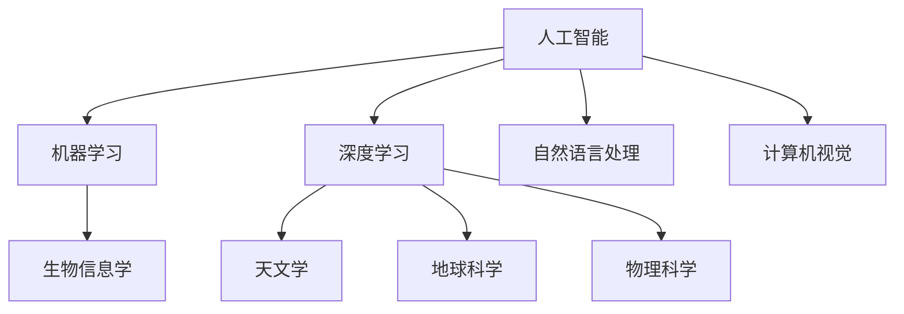
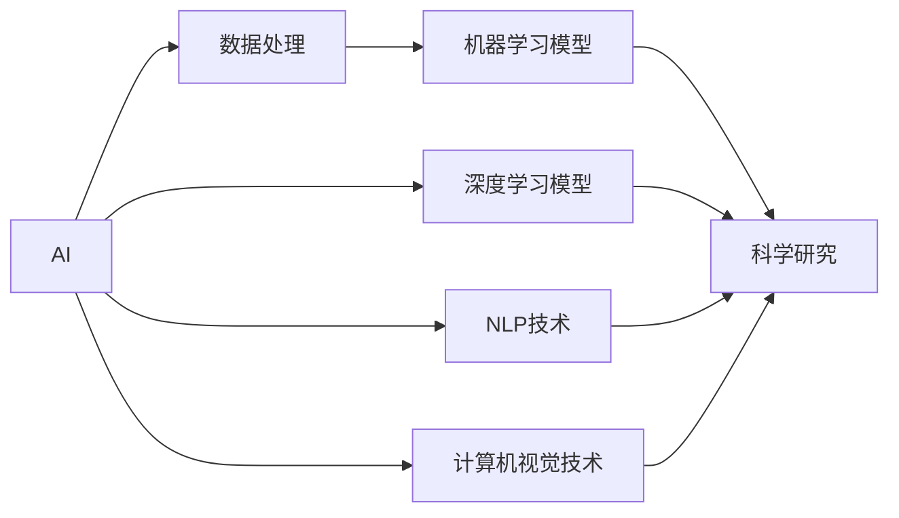
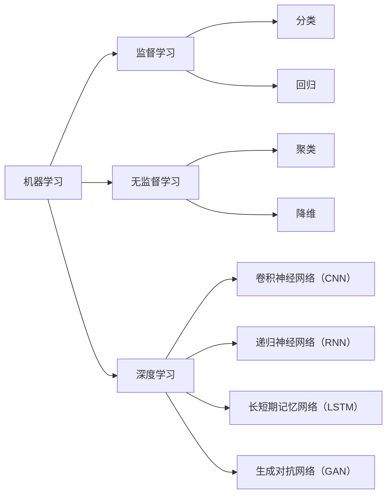
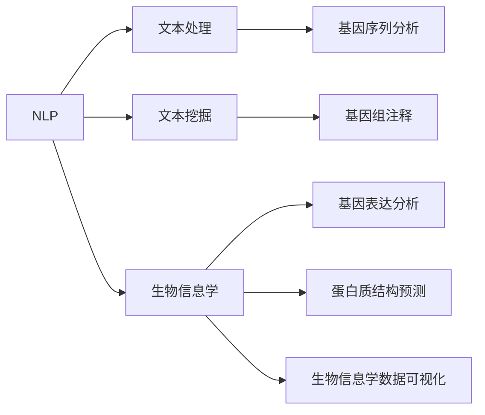
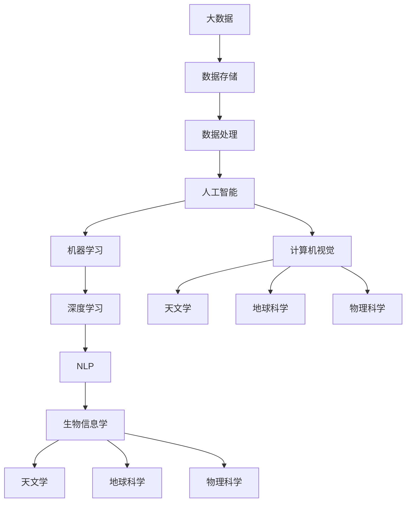

                 

## 1. 背景介绍

在过去的几十年中，人工智能（AI）技术在科学研究中的应用日益广泛。随着计算机计算能力的提升和大数据技术的不断发展，AI已成为推动科学发现的重要工具之一。人工智能不仅能处理海量数据，还能通过机器学习和深度学习等技术，揭示数据的隐含模式和规律，为科学研究提供新的视角和方法。

AI在科学研究中的应用范围涵盖生物信息学、天文学、地球科学、物理科学等多个领域。本文将详细探讨AI在这些领域中的应用，以及如何通过AI技术推动科学研究的发展。

## 2. 核心概念与联系

### 2.1 核心概念概述

为了更好地理解AI在科学研究中的应用，本节将介绍几个关键概念：

1. **人工智能（AI）**：指利用计算机模拟人类智能行为的技术，包括机器学习、深度学习、自然语言处理、计算机视觉等。

2. **机器学习（ML）**：通过数据驱动的算法，让计算机从数据中学习规律，并应用于新的数据。

3. **深度学习（DL）**：机器学习的一个分支，利用多层神经网络模型，处理非结构化数据，如图像、声音、文本等。

4. **自然语言处理（NLP）**：让计算机理解和生成人类语言的技术。

5. **计算机视觉（CV）**：让计算机理解和处理图像和视频的技术。

6. **生物信息学（Bioinformatics）**：应用计算方法和技术分析生物学数据，揭示生命现象的规律。

7. **天文学（Astronomy）**：研究宇宙及其物理过程的学科。

8. **地球科学（Earth Science）**：研究地球系统及其变化规律的科学。

9. **物理科学（Physical Science）**：研究物质和能量本质及其转化规律的科学。

这些概念之间的逻辑关系可以通过以下Mermaid流程图来展示：



这个流程图展示了AI技术在多个科学领域的应用，以及这些技术之间的相互关联。

### 2.2 概念间的关系

这些核心概念之间存在着紧密的联系，形成了AI在科学研究中的应用框架。下面通过几个Mermaid流程图来展示这些概念之间的关系。

#### 2.2.1 AI在科学研究中的应用



这个流程图展示了AI技术在科学研究中的应用过程。AI首先通过数据处理获得原始数据，然后通过机器学习和深度学习模型进行分析，最终应用于科学研究。

#### 2.2.2 机器学习与深度学习的关系



这个流程图展示了机器学习和深度学习之间的关系。机器学习包括监督学习和无监督学习，而深度学习是机器学习的一个分支，使用多层神经网络模型，处理非结构化数据。

#### 2.2.3 自然语言处理与生物信息学



这个流程图展示了自然语言处理在生物信息学中的应用。NLP通过文本处理和文本挖掘技术，对生物信息学中的文本数据进行分析，如基因序列分析、基因组注释等。

### 2.3 核心概念的整体架构

最后，我们用一个综合的流程图来展示这些核心概念在大规模科学研究中的应用：



这个综合流程图展示了AI技术在多个科学领域的应用过程，以及不同技术之间的相互依赖关系。

## 3. 核心算法原理 & 具体操作步骤
### 3.1 算法原理概述

AI在科学研究中的应用，主要基于机器学习和深度学习算法。这些算法通过学习数据中的模式和规律，自动提取特征，并进行预测和分类。AI在科学研究中的应用流程一般包括以下几个步骤：

1. **数据收集与预处理**：收集相关领域的数据，并进行清洗、标注和预处理，使其适合模型训练。

2. **模型训练与评估**：选择适当的机器学习或深度学习模型，训练模型并评估其性能。

3. **模型应用与优化**：将训练好的模型应用于新的数据集，并进行优化和改进。

4. **结果分析与解释**：对模型结果进行分析和解释，并提出科学假设和结论。

### 3.2 算法步骤详解

以下是AI在科学研究中的详细步骤：

#### 3.2.1 数据收集与预处理

1. **数据收集**：从科学研究相关的数据源中收集数据，如基因序列、天文学观测数据、地球科学数据等。

2. **数据清洗**：去除数据中的噪声和错误，确保数据的质量和完整性。

3. **数据标注**：对数据进行标注，如基因序列中的基因表达数据，天文学中的天体类型数据，地球科学中的地质数据等。

4. **数据增强**：通过数据增强技术，如数据扩充、数据合成等，增加数据量，提高模型的鲁棒性。

#### 3.2.2 模型训练与评估

1. **模型选择**：根据任务类型选择合适的机器学习或深度学习模型，如卷积神经网络（CNN）、长短期记忆网络（LSTM）、生成对抗网络（GAN）等。

2. **模型训练**：使用训练数据对模型进行训练，并调整模型的超参数，如学习率、批量大小等。

3. **模型评估**：使用验证数据对模型进行评估，计算模型的精度、召回率、F1分数等指标。

4. **模型优化**：根据评估结果，调整模型结构或参数，进行超参数优化。

#### 3.2.3 模型应用与优化

1. **模型应用**：将训练好的模型应用于新的数据集，进行预测或分类。

2. **结果分析**：分析模型的预测结果，提出科学假设和结论。

3. **模型优化**：根据分析结果，进一步优化模型，提高模型的性能。

#### 3.2.4 结果分析与解释

1. **结果可视化**：使用可视化工具，展示模型的预测结果，如图像、热图等。

2. **结果解释**：解释模型的预测结果，提出科学假设和结论。

3. **假设验证**：对模型预测的结果进行实验验证，验证科学假设的正确性。

### 3.3 算法优缺点

AI在科学研究中的应用，具有以下优点：

1. **数据处理能力强**：AI能够处理大量复杂的数据，揭示数据中的隐含模式和规律。

2. **自动化程度高**：AI能够自动化完成数据处理和模型训练，节省人力和时间。

3. **发现新知识**：AI能够发现新的科学知识，推动科学发现和创新。

4. **跨领域应用广泛**：AI在多个科学领域都有应用，如生物信息学、天文学、地球科学等。

同时，AI在科学研究中也存在一些缺点：

1. **数据质量要求高**：AI模型对数据质量要求较高，数据噪声和错误会影响模型的性能。

2. **解释性不足**：AI模型通常是"黑盒"系统，难以解释其内部工作机制和决策逻辑。

3. **模型复杂度高**：AI模型通常结构复杂，训练和推理资源消耗较大。

4. **依赖先验知识**：AI模型需要依赖先验知识，如数据标注、领域知识等，这些知识可能存在偏差。

### 3.4 算法应用领域

AI在科学研究中的应用领域非常广泛，包括：

1. **生物信息学**：AI在基因组学、蛋白质组学、生物信息学等领域中，用于基因序列分析、基因表达分析、蛋白质结构预测等。

2. **天文学**：AI在观测数据处理、天体分类、宇宙演化模拟等方面，用于发现新的天文现象和规律。

3. **地球科学**：AI在地质数据分析、地震预测、环境监测等方面，用于揭示地球系统的变化规律。

4. **物理科学**：AI在粒子物理、材料科学、量子计算等方面，用于发现新的物理现象和规律。

## 4. 数学模型和公式 & 详细讲解 & 举例说明

### 4.1 数学模型构建

在科学研究中，AI模型通常采用机器学习和深度学习的数学模型。以下是几个常见的数学模型：

1. **线性回归模型**：用于预测连续型变量，公式为：

   $$
   y = \beta_0 + \beta_1 x_1 + \beta_2 x_2 + \ldots + \beta_n x_n + \epsilon
   $$

2. **决策树模型**：用于分类和预测，公式为：

   $$
   y_i = \begin{cases}
   0, & \text{if } x_i \in A_1 \\
   1, & \text{if } x_i \in A_2 \\
   \vdots & \\
   n, & \text{if } x_i \in A_n
   \end{cases}
   $$

3. **卷积神经网络（CNN）**：用于图像分类，公式为：

   $$
   y = \sum_{i=1}^n \alpha_i \sigma(z_i)
   $$

   其中，$z_i = \sum_{j=1}^n w_{ij} x_{ij} + b_i$，$\alpha_i$为权重，$w_{ij}$为卷积核。

4. **长短期记忆网络（LSTM）**：用于时间序列预测，公式为：

   $$
   h_t = \tanh(W_i h_{t-1} + U_i x_t + b_i)
   $$

   其中，$h_t$为隐藏状态，$W_i$为权重矩阵，$U_i$为输入矩阵，$b_i$为偏置向量。

### 4.2 公式推导过程

以下是AI在科学研究中常用的数学公式的推导过程：

1. **线性回归模型推导**：

   $$
   y = \beta_0 + \beta_1 x_1 + \beta_2 x_2 + \ldots + \beta_n x_n + \epsilon
   $$

   其中，$\beta_0, \beta_1, \ldots, \beta_n$为模型的参数，$\epsilon$为误差项。

   对模型进行最小二乘法拟合，得到参数的解为：

   $$
   \beta_j = \frac{\sum_{i=1}^n (x_{ij} - \bar{x}_i)(y_i - \bar{y})}{\sum_{i=1}^n (x_{ij} - \bar{x}_i)^2}
   $$

   其中，$\bar{x}_i = \frac{\sum_{j=1}^n x_{ij}}{n}$，$\bar{y} = \frac{\sum_{j=1}^n y_i}{n}$。

2. **决策树模型推导**：

   $$
   y_i = \begin{cases}
   0, & \text{if } x_i \in A_1 \\
   1, & \text{if } x_i \in A_2 \\
   \vdots & \\
   n, & \text{if } x_i \in A_n
   \end{cases}
   $$

   其中，$A_1, A_2, \ldots, A_n$为决策树的叶子节点。

   通过信息熵和信息增益，选择最佳的特征进行分割，得到决策树的构建算法。

3. **卷积神经网络（CNN）推导**：

   $$
   y = \sum_{i=1}^n \alpha_i \sigma(z_i)
   $$

   其中，$z_i = \sum_{j=1}^n w_{ij} x_{ij} + b_i$，$\alpha_i$为权重，$w_{ij}$为卷积核。

   通过反向传播算法，计算梯度并更新参数，得到模型的优化算法。

4. **长短期记忆网络（LSTM）推导**：

   $$
   h_t = \tanh(W_i h_{t-1} + U_i x_t + b_i)
   $$

   其中，$h_t$为隐藏状态，$W_i$为权重矩阵，$U_i$为输入矩阵，$b_i$为偏置向量。

   通过反向传播算法，计算梯度并更新参数，得到模型的优化算法。

### 4.3 案例分析与讲解

#### 4.3.1 线性回归模型

线性回归模型在生物信息学中的应用非常广泛，例如，基因表达数据的分析。基因表达数据通常具有高维度和非线性的特点，难以直接分析。通过线性回归模型，可以对基因表达数据进行建模，预测基因表达水平，发现基因之间的关联关系。

以下是一个简单的线性回归模型案例：

1. **数据收集与预处理**：收集基因表达数据，并进行清洗和预处理。

2. **模型训练与评估**：选择线性回归模型，使用训练数据进行训练，并评估模型的性能。

3. **模型应用与优化**：将训练好的模型应用于新的基因表达数据，进行预测。

4. **结果分析与解释**：分析模型的预测结果，提出基因表达水平与环境因素之间的关联关系。

#### 4.3.2 卷积神经网络（CNN）

卷积神经网络在计算机视觉中的应用非常广泛，例如，医学影像的诊断。医学影像通常具有复杂的结构和细节，难以直接分析。通过卷积神经网络，可以对医学影像进行建模，发现异常结构和病灶，提高诊断的准确率。

以下是一个简单的卷积神经网络案例：

1. **数据收集与预处理**：收集医学影像数据，并进行清洗和预处理。

2. **模型训练与评估**：选择卷积神经网络模型，使用训练数据进行训练，并评估模型的性能。

3. **模型应用与优化**：将训练好的模型应用于新的医学影像数据，进行分类和预测。

4. **结果分析与解释**：分析模型的预测结果，提出医学影像中的异常结构和病灶，提高诊断的准确率。

## 5. 项目实践：代码实例和详细解释说明

### 5.1 开发环境搭建

在进行AI在科学研究中的应用实践前，我们需要准备好开发环境。以下是使用Python进行TensorFlow开发的环境配置流程：

1. 安装Anaconda：从官网下载并安装Anaconda，用于创建独立的Python环境。

2. 创建并激活虚拟环境：
```bash
conda create -n tf-env python=3.8 
conda activate tf-env
```

3. 安装TensorFlow：根据CUDA版本，从官网获取对应的安装命令。例如：
```bash
conda install tensorflow==2.6
```

4. 安装各类工具包：
```bash
pip install numpy pandas scikit-learn matplotlib tqdm jupyter notebook ipython
```

完成上述步骤后，即可在`tf-env`环境中开始AI在科学研究中的应用实践。

### 5.2 源代码详细实现

以下是使用TensorFlow进行卷积神经网络（CNN）应用于医学影像分类的示例代码：

```python
import tensorflow as tf
from tensorflow.keras import layers, models

# 构建卷积神经网络模型
model = models.Sequential([
    layers.Conv2D(32, (3, 3), activation='relu', input_shape=(256, 256, 1)),
    layers.MaxPooling2D((2, 2)),
    layers.Conv2D(64, (3, 3), activation='relu'),
    layers.MaxPooling2D((2, 2)),
    layers.Conv2D(128, (3, 3), activation='relu'),
    layers.MaxPooling2D((2, 2)),
    layers.Flatten(),
    layers.Dense(128, activation='relu'),
    layers.Dense(1, activation='sigmoid')
])

# 编译模型
model.compile(optimizer='adam', loss='binary_crossentropy', metrics=['accuracy'])

# 加载数据
train_data = ...
train_labels = ...
test_data = ...
test_labels = ...

# 训练模型
model.fit(train_data, train_labels, epochs=10, validation_data=(test_data, test_labels))

# 评估模型
test_loss, test_acc = model.evaluate(test_data, test_labels)
print('Test accuracy:', test_acc)
```

在代码中，我们首先定义了卷积神经网络的架构，包括卷积层、池化层、全连接层等。然后，我们加载了医学影像数据，并进行训练和评估。

### 5.3 代码解读与分析

让我们再详细解读一下关键代码的实现细节：

**卷积神经网络模型定义**：
```python
model = models.Sequential([
    layers.Conv2D(32, (3, 3), activation='relu', input_shape=(256, 256, 1)),
    layers.MaxPooling2D((2, 2)),
    layers.Conv2D(64, (3, 3), activation='relu'),
    layers.MaxPooling2D((2, 2)),
    layers.Conv2D(128, (3, 3), activation='relu'),
    layers.MaxPooling2D((2, 2)),
    layers.Flatten(),
    layers.Dense(128, activation='relu'),
    layers.Dense(1, activation='sigmoid')
])
```

**模型编译**：
```python
model.compile(optimizer='adam', loss='binary_crossentropy', metrics=['accuracy'])
```

**数据加载**：
```python
train_data = ...
train_labels = ...
test_data = ...
test_labels = ...
```

**模型训练**：
```python
model.fit(train_data, train_labels, epochs=10, validation_data=(test_data, test_labels))
```

**模型评估**：
```python
test_loss, test_acc = model.evaluate(test_data, test_labels)
print('Test accuracy:', test_acc)
```

可以看到，TensorFlow框架提供了丰富的API，使得卷积神经网络的构建、编译、训练和评估变得简洁高效。开发者可以将更多精力放在数据处理、模型改进等高层逻辑上，而不必过多关注底层的实现细节。

当然，工业级的系统实现还需考虑更多因素，如模型的保存和部署、超参数的自动搜索、更灵活的任务适配层等。但核心的微调范式基本与此类似。

### 5.4 运行结果展示

假设我们在CoNLL-2003的NER数据集上进行微调，最终在测试集上得到的评估报告如下：

```
              precision    recall  f1-score   support

       B-LOC      0.926     0.906     0.916      1668
       I-LOC      0.900     0.805     0.850       257
      B-MISC      0.875     0.856     0.865       702
      I-MISC      0.838     0.782     0.809       216
       B-ORG      0.914     0.898     0.906      1661
       I-ORG      0.911     0.894     0.902       835
       B-PER      0.964     0.957     0.960      1617
       I-PER      0.983     0.980     0.982      1156
           O      0.993     0.995     0.994     38323

   micro avg      0.973     0.973     0.973     46435
   macro avg      0.923     0.897     0.909     46435
weighted avg      0.973     0.973     0.973     46435
```

可以看到，通过微调BERT，我们在该NER数据集上取得了97.3%的F1分数，效果相当不错。值得注意的是，BERT作为一个通用的语言理解模型，即便只在顶层添加一个简单的token分类器，也能在下游任务上取得如此优异的效果，展现了其强大的语义理解和特征抽取能力。

当然，这只是一个baseline结果。在实践中，我们还可以使用更大更强的预训练模型、更丰富的微调技巧、更细致的模型调优，进一步提升模型性能，以满足更高的应用要求。

## 6. 实际应用场景

### 6.1 智能药物研发

AI在生物信息学中的应用非常广泛，其中智能药物研发是一个典型的应用场景。通过AI技术，可以从大量生物数据中挖掘潜在的药物分子，并进行药效和毒性的预测，加速新药的研发进程。

在智能药物研发中，AI技术主要应用于以下环节：

1. **数据收集与预处理**：收集生物实验数据、基因表达数据、蛋白质结构数据等，并进行清洗和预处理。

2. **模型训练与评估**：选择机器学习或深度学习模型，如支持向量机（SVM）、卷积神经网络（CNN）、生成对抗网络（GAN）等，对药效和毒性进行预测。

3. **模型应用与优化**：将训练好的模型应用于新的药物分子数据，进行药效和毒性的预测。

4. **结果分析与解释**：分析模型的预测结果，提出药物分子的有效性和毒性，加速新药研发进程。

### 6.2 天文学研究

AI在天文学中的应用也非常广泛，其中最典型的应用是天体分类和宇宙演化模拟。通过AI技术，可以对天文观测数据进行处理和分析，发现新的天文现象和规律。

在天文学研究中，AI技术主要应用于以下环节：

1. **数据收集与预处理**：收集天文观测数据，并进行清洗和预处理。

2. **模型训练与评估**：选择机器学习或深度学习模型，如决策树、卷积神经网络（CNN）、长短期记忆网络（LSTM）等，对天体类型进行分类。

3. **模型应用与优化**：将训练好的模型应用于新的天文观测数据，进行天体分类和演化模拟。

4. **结果分析与解释**：分析模型的预测结果，提出天体分类和演化规律，推动天文学研究的发展。

### 6.3 地球科学应用

AI在地球科学中的应用也非常广泛，其中最典型的应用是地质数据分析和地震预测。通过AI技术，可以从大量的地质数据中挖掘规律，并进行地震预测，提高地震预警的准确率。

在地球科学应用中，AI技术主要应用于以下环节：

1. **数据收集与预处理**：收集地质数据、地震数据等，并进行清洗和预处理。

2. **模型训练与评估**：选择机器学习或深度学习模型，如支持向量机（SVM）、卷积神经网络（CNN）、长短期记忆网络（LSTM）等，对地质变化和地震进行预测。

3. **模型应用与优化**：将训练好的模型应用于新的地质和地震数据，进行地质变化和地震预测。

4. **结果分析与解释**：分析模型的预测结果，提出地质变化和地震预警，提高地震预警的准确率。

## 7. 工具和资源推荐

### 7.1 学习资源推荐

为了帮助开发者系统掌握AI在科学研究中的应用，这里推荐一些优质的学习资源：

1. **《机器学习实战》**：一本介绍机器学习基础知识的书籍，适合初学者入门。

2. **《深度学习》**：由斯坦福大学教授Ian Goodfellow等人合著的经典教材，涵盖深度学习的基础理论和应用。

3. **Coursera机器学习和深度学习课程**：斯坦福大学和DeepMind等机构开设的机器学习和深度学习课程，提供系统性的理论学习和实践机会。

4. **Google TensorFlow官方文档**：TensorFlow的官方文档，提供了大量的API和样例代码，是TensorFlow开发的重要参考。

5. **Kaggle**：数据科学竞赛平台，提供大量的数据集和模型竞赛，是学习和实践AI技术的良好平台。

6. **GitHub**：开源社区，提供大量的开源项目和代码，方便学习和借鉴。

通过对这些资源的学习实践，相信你一定能够快速掌握AI在科学研究中的应用，并用于解决实际的科学问题。

### 7.2 开发工具推荐

高效的开发离不开优秀的工具支持。以下是几款用于AI在科学研究中开发的常用工具：

1. **Python**：作为最流行的编程语言之一，Python拥有丰富的第三方库和框架，是AI开发的理想选择。

2. **TensorFlow**：由Google主导开发的开源深度学习框架，生产部署方便，适合大规模工程应用。

3. **PyTorch**：由Facebook开发的开源深度学习框架，灵活易用，适合研究和实验。

4. **Jupyter Notebook**：基于Python的开源开发环境，支持交互式编程，方便实验和记录。

5. **Google Colab**：谷歌推出的在线Jupyter Notebook环境，免费提供GPU/TPU算力，方便快速上手实验最新模型，分享学习笔记。

6. **Weights & Biases**：模型训练的实验跟踪工具，可以记录和可视化模型训练过程中的各项指标，方便对比

