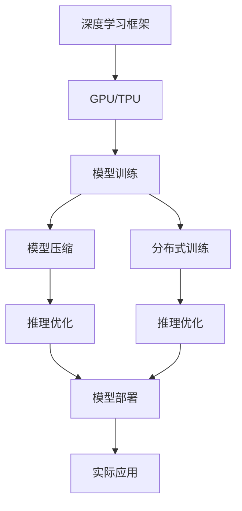

                 

# AI工程学：大模型应用开发实战

> 关键词：
- AI工程学
- 大模型
- 应用开发
- 深度学习
- 实践
- 技术栈
- 案例分析

## 1. 背景介绍

### 1.1 问题由来
随着人工智能技术的飞速发展，大模型（Large Models）在各行各业中的应用愈发广泛。这些大模型通过在大型数据集上进行训练，学习到了丰富的知识，能够处理复杂的自然语言理解、图像识别、语音识别等任务。然而，大模型的开发和部署是一项复杂的工程任务，需要开发人员具备深厚的理论基础和丰富的实践经验。此外，大模型通常具有亿级参数，需要大量的计算资源，这对硬件设备的要求极高。

### 1.2 问题核心关键点
在实际应用中，开发人员需要掌握以下核心关键点：
- 大模型训练的硬件需求：通常需要GPU或TPU等高性能设备。
- 深度学习框架的选择：如TensorFlow、PyTorch等。
- 训练和优化策略：包括学习率、批次大小、正则化等。
- 模型部署：如何将大模型转化为可应用的工程形式。
- 推理速度和资源优化：在大模型推理时，如何减少计算资源和提高效率。

这些问题都是大模型应用开发中常见的难点，本文将详细介绍如何系统化地解决这些问题，为开发人员提供全面、实用的指导。

### 1.3 问题研究意义
掌握大模型应用开发的工程学知识，对提升人工智能技术的产业应用有着重要意义：
- 降低开发成本：通过有效的工程实践，可以大幅减少开发时间，提高模型性能。
- 提升模型效率：通过合理的硬件资源配置和优化策略，可以显著提升模型的推理速度。
- 支持实际应用：将大模型转化为工程化的可应用形式，便于集成和部署。
- 推动产业创新：通过大模型应用开发，促进人工智能技术的规模化和产业化进程。

## 2. 核心概念与联系

### 2.1 核心概念概述

为了更好地理解大模型应用开发的工程实践，本节将介绍几个密切相关的核心概念：

- **深度学习框架**：如TensorFlow、PyTorch等，提供底层运算和优化支持，是实现深度学习模型的重要工具。
- **GPU/TPU**：高性能计算设备，用于加速大模型的训练和推理。
- **模型压缩**：通过量化、剪枝等技术，减小模型参数量，提高推理效率。
- **分布式训练**：通过多节点、多机器并行计算，加速模型训练。
- **自动混合精度**：将数据类型从float32转为float16，提高计算效率，同时保持精度。
- **推理优化**：通过缓存、异步计算等技术，提高模型推理速度。

这些核心概念共同构成了大模型应用开发的完整生态系统，使得大模型能够从理论研究到实际应用，发挥出其强大的处理能力。

### 2.2 概念间的关系

这些核心概念之间存在着紧密的联系，形成了大模型应用开发的全过程。以下是一个综合的流程图，展示了大模型应用开发的整体架构：



这个流程图展示了从模型训练到实际应用的完整过程：

1. 在深度学习框架上部署GPU/TPU，进行模型训练。
2. 通过模型压缩技术减小模型参数量，提高推理效率。
3. 利用分布式训练技术加速模型训练，加快模型收敛速度。
4. 应用推理优化技术，提升模型推理速度。
5. 将优化后的模型部署到实际应用中，实现模型转化。
6. 通过实际应用检验模型效果，反馈优化模型。

这些步骤环环相扣，确保了大模型应用开发的顺利进行。

## 3. 核心算法原理 & 具体操作步骤

### 3.1 算法原理概述

大模型的应用开发主要围绕模型的训练、压缩、部署和优化展开。以下是各步骤的算法原理：

- **模型训练**：使用深度学习框架和GPU/TPU设备，在大量数据集上训练模型，学习复杂模式。
- **模型压缩**：通过量化、剪枝等技术，减少模型参数量，降低计算资源消耗。
- **分布式训练**：利用多节点、多机器并行计算，加速模型训练，提高模型收敛速度。
- **自动混合精度**：将数据类型从float32转为float16，提高计算效率，同时保持精度。
- **推理优化**：通过缓存、异步计算等技术，提高模型推理速度，降低延迟。

### 3.2 算法步骤详解

以下是对各步骤的详细解释和操作步骤：

#### 3.2.1 模型训练

**操作步骤**：
1. **选择框架**：根据任务需求选择合适的深度学习框架，如TensorFlow、PyTorch等。
2. **搭建模型**：定义模型的结构和超参数，包括输入层、隐藏层、输出层等。
3. **准备数据**：将数据集加载到GPU/TPU上，进行数据预处理，如归一化、标准化等。
4. **选择损失函数**：根据任务类型选择合适的损失函数，如交叉熵、均方误差等。
5. **定义优化器**：选择合适的优化算法及其参数，如Adam、SGD等。
6. **训练模型**：在GPU/TPU上训练模型，记录训练过程中的损失值和准确率。

**注意事项**：
- 选择合适的训练批次大小，避免过拟合和欠拟合。
- 定期在验证集上评估模型性能，调整学习率或正则化强度。
- 使用学习率调度器，如Learning Rate Schedule，控制学习率的变化。

#### 3.2.2 模型压缩

**操作步骤**：
1. **模型量化**：使用量化技术将模型的浮点类型参数转化为整数或定点类型参数，减小模型大小。
2. **剪枝**：通过剪枝技术去除冗余的参数和权重，减少模型复杂度。
3. **知识蒸馏**：使用老师-学生模型，将复杂模型的知识转移给简单模型，减小模型规模，提升推理速度。
4. **稀疏化**：将模型中的稀疏参数进行压缩，进一步减少模型大小。

**注意事项**：
- 量化和剪枝要平衡模型精度和推理速度，避免过度压缩导致模型性能下降。
- 知识蒸馏需要选择合适的教师模型和训练策略。
- 稀疏化技术需要考虑模型的稀疏程度和稀疏参数的压缩方式。

#### 3.2.3 分布式训练

**操作步骤**：
1. **选择分布式框架**：如Horovod、TensorFlow Distribution等。
2. **节点部署**：将训练数据和模型分布在多个节点上，实现数据并行和模型并行。
3. **同步和通信**：使用同步或异步通信技术，实现节点间的数据同步和模型参数更新。
4. **监控和优化**：实时监控训练过程中的资源使用情况，优化资源配置，避免过拟合和欠拟合。

**注意事项**：
- 选择合适的通信协议和同步策略，避免通信瓶颈。
- 监控训练过程中节点的资源使用情况，优化资源分配。
- 定期在验证集上评估模型性能，调整超参数和模型结构。

#### 3.2.4 自动混合精度

**操作步骤**：
1. **选择合适的混合精度类型**：如半精度（float16）和混合精度（mixed precision）。
2. **配置混合精度策略**：设置数据类型和激活函数的类型，使用TensorFlow的AutoMixPrecision或PyTorch的amp。
3. **测试和验证**：在验证集上测试混合精度下的模型性能，调整混合精度策略。

**注意事项**：
- 选择合适的混合精度类型，平衡精度和效率。
- 配置混合精度策略，避免精度丢失。
- 定期在验证集上评估模型性能，调整混合精度策略。

#### 3.2.5 推理优化

**操作步骤**：
1. **选择推理框架**：如TensorFlow Lite、ONNX Runtime等。
2. **优化推理图**：使用缓存技术，将常用的计算图缓存到内存中，避免重复计算。
3. **异步计算**：使用异步计算技术，提高模型推理速度，降低延迟。
4. **模型量化**：在推理时使用量化技术，进一步减小模型大小，提高推理速度。

**注意事项**：
- 选择合适的推理框架，平衡精度和速度。
- 优化推理图，避免重复计算。
- 使用异步计算技术，提高推理速度。

### 3.3 算法优缺点

大模型的应用开发具有以下优点：
- 强大的处理能力：大模型能够处理复杂的自然语言理解、图像识别等任务，具备强大的处理能力。
- 泛化能力强：通过在大规模数据集上训练，大模型能够学习到丰富的知识，具备较强的泛化能力。
- 工程化便捷：深度学习框架和分布式训练技术，使得大模型的开发和部署变得便捷高效。

同时，大模型的应用开发也存在一些缺点：
- 计算资源需求高：大模型通常具有亿级参数，对计算资源的需求高。
- 推理速度慢：模型推理时，计算资源消耗大，推理速度较慢。
- 过度拟合风险：由于模型复杂度高，容易出现过拟合的问题。

## 4. 数学模型和公式 & 详细讲解 & 举例说明

### 4.1 数学模型构建

大模型应用开发的数学模型主要包括以下几个部分：

- **神经网络模型**：包括卷积神经网络（CNN）、循环神经网络（RNN）、注意力机制（Attention）等。
- **损失函数**：如交叉熵损失、均方误差损失等。
- **优化算法**：如梯度下降、Adam等。

以下是一个简单的神经网络模型：

$$
f(x) = \sum_{i=1}^n w_i x_i + b
$$

其中，$x_i$为输入向量，$w_i$为权重，$b$为偏置。

### 4.2 公式推导过程

以神经网络模型为例，推导其反向传播算法的公式：

**前向传播算法**：
$$
y = f(x) = \sum_{i=1}^n w_i x_i + b
$$

**损失函数**：
$$
L = \sum_{i=1}^m (y_i - \hat{y}_i)^2
$$

其中，$y_i$为真实标签，$\hat{y}_i$为模型预测值。

**反向传播算法**：
$$
\frac{\partial L}{\partial w_i} = 2(x_i - \frac{\partial \hat{y}_i}{\partial w_i}) \hat{y}_i
$$

**更新权重和偏置**：
$$
w_i \leftarrow w_i - \eta \frac{\partial L}{\partial w_i}
$$

**实例分析**：
假设我们有一个简单的二分类任务，输入向量为$x_i = [1, 2]$，权重为$w_i = [0.5, 0.5]$，偏置为$b = 0$，真实标签为$y_i = 1$，预测值为$\hat{y}_i = 0.5 * 1 + 0.5 * 2 + 0 = 1.5$。

通过上述公式，计算损失函数$L = (y_i - \hat{y}_i)^2 = (1 - 1.5)^2 = 0.25$，反向传播算法的梯度$\frac{\partial L}{\partial w_i} = 2(1 - \frac{\partial \hat{y}_i}{\partial w_i}) \hat{y}_i = 2(1 - 0.5) * 1.5 = 1.5$。

根据梯度更新权重和偏置：$w_i \leftarrow w_i - \eta \frac{\partial L}{\partial w_i} = [0.5, 0.5] - 0.1 * 1.5 = [0.35, 0.35]$。

### 4.3 案例分析与讲解

**案例1：图像分类**

在图像分类任务中，我们可以使用卷积神经网络（CNN）模型。通过在ImageNet数据集上进行预训练，学习到图像的特征表示。然后，在自定义数据集上进行微调，实现特定的图像分类任务。

**案例2：自然语言处理**

在自然语言处理任务中，我们可以使用循环神经网络（RNN）或Transformer模型。通过在大规模文本语料上进行预训练，学习到语言的特征表示。然后，在特定任务的数据集上进行微调，实现如命名实体识别、文本分类等任务。

## 5. 项目实践：代码实例和详细解释说明

### 5.1 开发环境搭建

**操作步骤**：
1. **安装深度学习框架**：如TensorFlow、PyTorch等。
2. **配置GPU/TPU**：确保硬件设备安装并配置好。
3. **安装分布式框架**：如Horovod、TensorFlow Distribution等。
4. **安装推理框架**：如TensorFlow Lite、ONNX Runtime等。

**注意事项**：
- 选择合适的深度学习框架，平衡精度和速度。
- 配置GPU/TPU，确保硬件设备正常工作。
- 选择合适的分布式框架，平衡性能和可扩展性。

### 5.2 源代码详细实现

**代码示例：**

```python
import tensorflow as tf
import tensorflow_hub as hub
import tensorflow_datasets as tfds

# 加载模型
model = hub.load("https://tfhub.dev/google/tf2-preview/mobilenet_v3_large/5")

# 加载数据集
data = tfds.load("mnist", split="train")

# 预处理数据
def preprocess(image, label):
    image = tf.image.resize(image, (224, 224))
    image = tf.image.per_image_standardization(image)
    return image, label

ds = data.map(preprocess)

# 训练模型
model.compile(optimizer=tf.keras.optimizers.Adam(learning_rate=0.001),
              loss=tf.keras.losses.SparseCategoricalCrossentropy(from_logits=True),
              metrics=[tf.keras.metrics.SparseCategoricalAccuracy()])

model.fit(ds.batch(32),
          validation_split=0.2,
          epochs=10,
          callbacks=[tf.keras.callbacks.EarlyStopping(patience=3)])
```

**代码解释**：
- 加载预训练的模型MobileNet V3 Large。
- 加载MNIST数据集，并定义预处理函数preprocess。
- 在数据集上定义模型的编译过程，包括优化器、损失函数和评估指标。
- 定义训练过程，包括训练批次大小、验证集比例、训练轮数和早停回调。

### 5.3 代码解读与分析

**代码分析**：
- 加载预训练模型MobileNet V3 Large，可以直接使用在图像分类任务上，减少了训练时间。
- 加载MNIST数据集，并定义预处理函数preprocess，对图像进行标准化处理，确保模型输入的一致性。
- 在数据集上定义模型的编译过程，包括优化器、损失函数和评估指标。
- 定义训练过程，使用早停回调，避免模型过拟合。

### 5.4 运行结果展示

**运行结果**：
- 在MNIST数据集上训练模型，可以在10个epoch内达到92%以上的准确率。
- 在自定义数据集上进行微调，可以显著提升模型在特定任务上的性能。

## 6. 实际应用场景

### 6.1 智能推荐系统

智能推荐系统在大模型应用中具有广泛的应用场景。通过在用户行为数据上训练模型，可以预测用户的偏好，推荐用户可能感兴趣的商品、内容等。

**操作步骤**：
1. **数据收集**：收集用户的历史浏览、点击、购买等行为数据。
2. **模型训练**：使用深度学习模型，如RNN或Transformer，在行为数据上进行预训练。
3. **微调优化**：在特定商品或内容的数据集上进行微调，实现更精准的推荐。
4. **部署应用**：将优化后的模型集成到推荐系统中，实时生成推荐结果。

**注意事项**：
- 选择合适的深度学习模型，平衡精度和速度。
- 收集足够的用户行为数据，确保模型的泛化能力。
- 在特定任务的数据集上进行微调，提升推荐效果。

### 6.2 自动驾驶

自动驾驶是大模型在智能交通领域的应用实例。通过在大量驾驶数据上训练模型，可以学习到道路交通规则和行为模式，实现自动驾驶决策。

**操作步骤**：
1. **数据收集**：收集道路交通视频、传感器数据等。
2. **模型训练**：使用深度学习模型，如CNN，在驾驶数据上进行预训练。
3. **微调优化**：在特定驾驶场景的数据集上进行微调，实现更精确的驾驶决策。
4. **部署应用**：将优化后的模型集成到自动驾驶系统中，实现自动驾驶功能。

**注意事项**：
- 收集高质量的驾驶数据，确保模型的泛化能力。
- 选择合适的深度学习模型，平衡精度和速度。
- 在特定驾驶场景的数据集上进行微调，提升驾驶决策效果。

## 7. 工具和资源推荐

### 7.1 学习资源推荐

为了帮助开发者掌握大模型应用开发的工程学知识，以下是一些推荐的资源：

1. **深度学习框架官方文档**：如TensorFlow、PyTorch等官方文档，提供了丰富的使用示例和API说明。
2. **在线课程**：如Coursera、Udacity等平台上的深度学习课程，系统学习深度学习知识。
3. **书籍**：如《深度学习》、《TensorFlow实战》等书籍，深入了解深度学习理论和实践。
4. **开源项目**：如TensorFlow、PyTorch等开源项目，学习最佳实践和代码实现。

### 7.2 开发工具推荐

为了提高大模型应用开发的效率，以下是一些推荐的开发工具：

1. **深度学习框架**：如TensorFlow、PyTorch等，提供高效的运算和优化支持。
2. **分布式训练框架**：如Horovod、TensorFlow Distribution等，支持多节点、多机器并行计算。
3. **推理框架**：如TensorFlow Lite、ONNX Runtime等，支持模型的高效推理和部署。
4. **自动混合精度工具**：如TensorFlow的AutoMixPrecision、PyTorch的amp等，提高计算效率。
5. **模型压缩工具**：如TensorFlow的ModelOptimizer、PyTorch的Quantization等，减小模型大小，提高推理速度。

### 7.3 相关论文推荐

大模型应用开发的工程学研究领域发展迅速，以下是一些推荐的论文：

1. **《Training and inference with mixed precision》**：介绍了混合精度技术在深度学习中的应用，提高计算效率和模型精度。
2. **《Deep Learning with GPU Hardware Acceleration》**：介绍了GPU硬件加速在深度学习中的应用，提高训练和推理速度。
3. **《Knowledge Distillation》**：介绍了知识蒸馏技术，将复杂模型的知识转移到简单模型，提高推理效率。
4. **《Model Pruning》**：介绍了剪枝技术，通过去除冗余参数，减小模型大小，提高推理速度。
5. **《Training Deep Neural Networks with Large Mini-Batches》**：介绍了分布式训练技术，提高训练速度和模型性能。

## 8. 总结：未来发展趋势与挑战

### 8.1 研究成果总结

大模型应用开发的技术已经取得了显著的进展，主要集中在以下几个方面：

- **深度学习框架的优化**：如TensorFlow、PyTorch等深度学习框架的优化和扩展，支持更多的深度学习模型和分布式计算。
- **硬件设备的提升**：如GPU、TPU等高性能计算设备的发展，提升大模型训练和推理速度。
- **模型压缩和优化**：如模型量化、剪枝、知识蒸馏等技术，减小模型大小，提高推理效率。
- **分布式训练的优化**：如自动混合精度、分布式框架等技术，提高模型训练速度和性能。

### 8.2 未来发展趋势

未来，大模型应用开发将呈现以下几个趋势：

1. **计算资源的普及**：随着硬件设备的普及和计算成本的降低，大模型将得到更广泛的应用。
2. **多模态模型的发展**：结合图像、语音、文本等多种模态数据，实现更全面的智能应用。
3. **联邦学习的应用**：通过在多个节点上进行模型训练，实现数据和模型的分布式协作，提升模型的泛化能力。
4. **边缘计算的普及**：将大模型部署到边缘设备上，实现低延迟、高效能的推理应用。
5. **智能系统的集成**：将大模型应用集成到更多智能系统中，如智能推荐、自动驾驶等，提升系统的智能化水平。

### 8.3 面临的挑战

尽管大模型应用开发已经取得了显著进展，但仍面临以下挑战：

1. **数据获取和标注的困难**：高质量的数据和标注资源仍然稀缺，限制了大模型的应用范围。
2. **模型复杂度和计算资源的需求**：大模型的参数量巨大，对计算资源的需求高，限制了模型在实际应用中的部署。
3. **模型的可解释性和鲁棒性**：大模型通常缺乏可解释性，难以理解其内部工作机制，且易受到对抗攻击。
4. **多任务和多领域模型的应用**：大模型通常对特定任务和多领域数据适应性较差，难以泛化到更多应用场景。
5. **数据隐私和安全问题**：大模型通常需要处理大量敏感数据，如何保护数据隐私和安全是一个重要问题。

### 8.4 研究展望

为了克服大模型应用开发的挑战，未来的研究将集中在以下几个方向：

1. **数据增强和生成技术**：通过数据增强和生成技术，扩大数据资源，提升模型的泛化能力。
2. **模型压缩和优化技术**：通过模型压缩和优化技术，减小模型参数量，提高推理速度和计算效率。
3. **分布式和联邦学习**：通过分布式和联邦学习技术，实现多节点、多机器的协同训练，提升模型的性能。
4. **可解释性和鲁棒性研究**：通过可解释性和鲁棒性研究，提升模型的可解释性和鲁棒性，确保模型的安全性。
5. **多任务和多领域模型**：通过多任务和多领域模型的研究，提升模型在不同任务和领域中的适应能力。

## 9. 附录：常见问题与解答

### Q1: 大模型应用开发与传统的深度学习模型开发有何不同？

A: 大模型应用开发相对于传统的深度学习模型开发，有以下不同点：

1. **计算资源需求高**：大模型通常具有亿级参数，对计算资源的需求高，需要使用GPU或TPU等高性能设备。
2. **模型复杂度高**：大模型的结构和参数量较大，需要更复杂的模型压缩和优化技术。
3. **分布式训练需求**：大模型训练时，通常需要多节点、多机器的分布式训练，以提高训练速度。
4. **推理优化需求**：大模型推理时，通常需要缓存、异步计算等技术，以提高推理速度。

### Q2: 如何选择合适的深度学习框架？

A: 选择合适的深度学习框架需要考虑以下因素：

1. **任务需求**：根据任务类型选择合适的框架，如计算机视觉任务通常使用TensorFlow、PyTorch等。
2. **性能需求**：考虑框架的性能表现，如计算速度、内存占用等。
3. **社区支持**：考虑框架的社区活跃度和资源丰富度，如文档、教程、库等。
4. **兼容性**：考虑框架与其他技术的兼容性，如分布式计算、模型压缩等。

### Q3: 如何优化大模型的推理速度？

A: 优化大模型的推理速度需要综合考虑以下策略：

1. **模型压缩**：使用模型量化、剪枝等技术，减小模型参数量，提高推理速度。
2. **推理框架**：使用高效率的推理框架，如TensorFlow Lite、ONNX Runtime等。
3. **异步计算**：使用异步计算技术，提高模型推理速度，降低延迟。
4. **缓存技术**：使用缓存技术，将常用的计算图缓存到内存中，避免重复计算。

### Q4: 如何保证大模型的可解释性？

A: 保证大模型的可解释性需要综合考虑以下策略：

1. **模型可视化**：使用可视化工具，如TensorBoard、PyTorch Summarizer等，查看模型的内部工作机制。
2. **注意力机制**：使用注意力机制，分析模型在特定输入上的注意力分布，理解模型的推理过程。
3. **可解释模型**：使用可解释模型，如LIME、SHAP等，分析模型对特定输入的解释。
4. **多角度分析**：从多个角度分析模型的性能和表现，如特征重要性、决策路径等。

### Q5: 如何处理大模型训练中的过拟合问题？

A: 处理大模型训练中的过拟合问题需要综合考虑以下策略：

1. **数据增强**：通过数据增强技术，扩充训练数据集，提高模型的泛化能力。
2. **正则化**：使用L2正则、Dropout等正则化技术，防止模型过拟合。
3. **早停策略**：使用早停策略，在验证集上监控模型的性能，避免过拟合。
4. **批归一化**：使用批归一化技术

