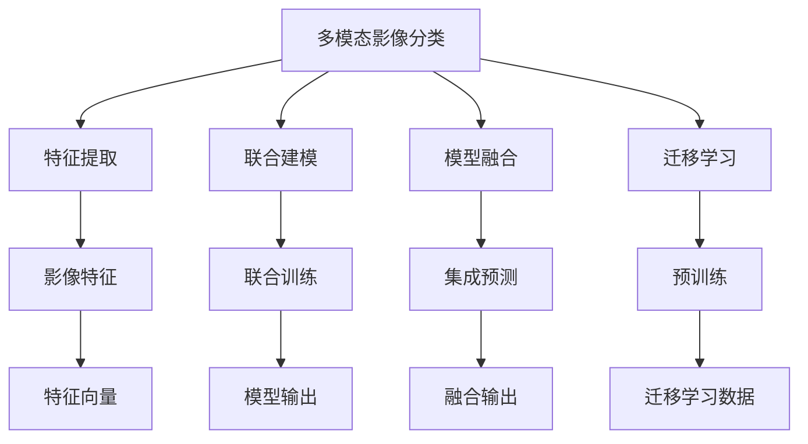

                 

## 1. 背景介绍

影像分类（Image Classification）是计算机视觉领域的一个重要研究方向，旨在从原始影像数据中自动识别出其中的对象或场景。随着深度学习技术的兴起，特别是卷积神经网络（Convolutional Neural Networks, CNNs）的广泛应用，影像分类的准确率取得了显著提升。然而，传统的基于单模态的影像分类方法往往只能处理单一模态的影像数据，难以充分利用多模态（Multi-Modal）数据带来的丰富信息，限制了其在实际应用中的效果。

多模态影像分类指的是结合不同类型数据（如影像、文本、语音等）进行联合建模，从而提高分类准确率和泛化能力。近年来，随着深度学习在多模态学习中的推广应用，多模态影像分类逐渐成为一种趋势。例如，将文本描述与影像信息结合，可以显著提升分类的准确率；或者将语音信息与影像数据进行融合，可以更好地理解影像中的场景和动作。本文将聚焦于基于机器学习的多模态影像分类研究，探索其在实际应用中的方法和策略。

## 2. 核心概念与联系

### 2.1 核心概念概述

为了更好地理解基于机器学习的多模态影像分类方法，本节将介绍几个关键概念：

- **多模态影像分类**：利用不同模态的信息进行联合建模，从而提升影像分类准确率和泛化能力。常见模态包括影像、文本、语音等。
- **特征提取**：从原始数据中提取出能够代表该数据特征的特征向量，通常是多模态分类中的重要步骤。
- **联合建模**：将不同模态的特征向量进行融合，构建统一的表示空间，进行联合训练和预测。
- **模型融合**：通过将多个模型进行集成，提高分类准确率和鲁棒性。
- **迁移学习**：在迁移学习范式中，先在大规模数据集上进行预训练，然后在特定任务上微调模型。

这些核心概念之间存在紧密的联系，通过多模态特征提取、联合建模和模型融合，可以显著提升影像分类的效果。而迁移学习则为多模态影像分类提供了新的思路，通过在通用数据集上进行预训练，使得模型能够更好地适应不同任务。

### 2.2 概念间的关系

这些核心概念之间的逻辑关系可以通过以下Mermaid流程图来展示：



这个流程图展示了多模态影像分类的完整过程：

1. 多模态影像分类首先通过特征提取从影像数据中获取影像特征，同时也可以从文本、语音等模态中获取相应特征。
2. 然后，这些特征向量通过联合建模进行融合，构建统一的表示空间。
3. 在联合建模后，可以通过模型融合进一步提高分类效果。
4. 迁移学习通过在大规模数据集上进行预训练，使得模型更好地适应特定任务。
5. 最终，多模态影像分类模型能够输出更准确、鲁棒的分类结果。

通过这个流程图，我们可以更清晰地理解多模态影像分类中的各个环节及其相互关系。

## 3. 核心算法原理 & 具体操作步骤

### 3.1 算法原理概述

基于机器学习的多模态影像分类方法，其核心思想是结合不同模态的信息，构建多模态特征表示，并在此基础上进行联合建模和分类。其基本流程如下：

1. 收集不同模态的数据集，并进行预处理，得到统一的特征表示。
2. 使用机器学习模型，如卷积神经网络、循环神经网络等，将多模态特征进行联合建模，得到统一的表示空间。
3. 在联合表示空间上，使用分类器进行分类。

多模态影像分类通常采用以下步骤：

1. **特征提取**：从不同模态中提取特征，如从影像中提取卷积特征，从文本中提取词袋特征，从语音中提取MFCC特征等。
2. **特征融合**：将不同模态的特征进行融合，如使用均值、最大值、权重加和等方法，构建多模态特征向量。
3. **联合建模**：在融合后的特征向量上，使用深度学习模型（如CNNs、RNNs等）进行联合建模，得到多模态表示空间。
4. **分类**：在多模态表示空间上，使用分类器（如SVM、随机森林、神经网络等）进行分类。

### 3.2 算法步骤详解

以一个简单的多模态影像分类示例为例，详细讲解基于机器学习的多模态影像分类算法步骤：

**Step 1: 数据收集与预处理**

首先，需要收集不同模态的数据集，并进行预处理，以便后续建模。例如，收集一张带有文本描述的影像数据，进行以下预处理步骤：

- 影像预处理：裁剪、归一化、旋转、缩放等。
- 文本预处理：去除停用词、词干提取、词向量化等。
- 语音预处理：MFCC特征提取、降噪、归一化等。

**Step 2: 特征提取**

对预处理后的数据进行特征提取，得到多模态特征向量。例如：

- 影像特征提取：使用卷积神经网络（CNN）对影像进行特征提取。
- 文本特征提取：使用词袋模型（Bag of Words）或词向量模型（Word Embedding）对文本进行特征提取。
- 语音特征提取：使用梅尔倒谱系数（MFCC）模型对语音进行特征提取。

**Step 3: 特征融合**

将不同模态的特征向量进行融合，构建多模态特征向量。常用的融合方法包括：

- 特征均值融合：将不同模态的特征向量取均值，得到一个综合特征向量。
- 特征加权融合：对不同模态的特征向量进行加权求和，得到加权特征向量。
- 特征拼接融合：将不同模态的特征向量拼接在一起，构成高维特征向量。

**Step 4: 联合建模**

在融合后的多模态特征向量上，使用深度学习模型进行联合建模。例如，可以使用以下步骤：

- 使用卷积神经网络（CNN）对融合后的特征进行编码，得到多模态表示。
- 使用全连接层或池化层对多模态表示进行压缩，得到更紧凑的特征表示。
- 使用softmax分类器对多模态表示进行分类。

**Step 5: 训练与评估**

使用收集到的标注数据集，对模型进行训练和评估。例如：

- 使用交叉验证（Cross-Validation）方法，将数据集划分为训练集和验证集，用于模型训练和调参。
- 使用准确率（Accuracy）、精确率（Precision）、召回率（Recall）等指标，评估模型在验证集上的性能。
- 使用测试集对模型进行最终评估，确保其泛化能力。

### 3.3 算法优缺点

基于机器学习的多模态影像分类方法具有以下优点：

- **多模态信息融合**：结合不同模态的信息，可以充分利用多模态数据带来的丰富信息，提高分类准确率。
- **泛化能力**：通过多模态联合建模，可以更好地理解影像中的场景和动作，提高模型的泛化能力。
- **应用广泛**：多模态影像分类技术可以应用于医疗影像、安防监控、智能交通等领域，具有广泛的应用前景。

同时，该方法也存在一些局限性：

- **数据复杂性**：多模态数据的获取和处理较为复杂，需要大量标注数据和预处理工作。
- **模型复杂性**：多模态联合建模需要较大的计算资源，且模型较为复杂，调试和优化难度较大。
- **算法局限性**：目前多模态影像分类方法仍处于探索阶段，缺乏统一的理论框架和成熟的算法。

尽管如此，多模态影像分类方法在实际应用中已经显示出巨大的潜力和优势，未来将继续发展和完善。

### 3.4 算法应用领域

基于机器学习的多模态影像分类方法，已在多个领域得到了广泛应用：

- **医疗影像分析**：将影像和文本结合，用于疾病诊断和治疗方案的制定。例如，将影像数据和病历文本结合，进行肿瘤分类。
- **安防监控系统**：将影像和语音结合，用于安全监控和异常行为检测。例如，将监控影像和语音信号结合，进行异常行为检测和报警。
- **智能交通系统**：将影像和文本结合，用于交通信号分析和车辆识别。例如，将交通监控影像和车辆牌照信息结合，进行车辆识别和违法行为检测。
- **金融市场分析**：将影像和文本结合，用于金融市场分析和交易决策。例如，将股票价格图表和新闻评论结合，进行交易决策。

## 4. 数学模型和公式 & 详细讲解 & 举例说明

### 4.1 数学模型构建

在多模态影像分类中，通常采用以下数学模型进行建模：

- 特征提取模型：将不同模态的原始数据映射为特征向量。例如，使用卷积神经网络（CNN）对影像进行特征提取，得到影像特征向量 $x_1$。
- 特征融合模型：将不同模态的特征向量进行融合，得到多模态特征向量 $x_2$。
- 联合建模模型：在多模态特征向量上，使用深度学习模型进行联合建模，得到多模态表示 $x_3$。
- 分类模型：在多模态表示空间上，使用分类器进行分类。例如，使用softmax分类器进行分类，得到分类结果 $y$。

### 4.2 公式推导过程

以下以影像分类为例，推导基于机器学习的多模态影像分类数学模型。

假设影像数据为 $x_1$，文本描述为 $x_2$，语音信号为 $x_3$，多模态影像分类的目标是将影像分类为 $C$ 类之一，其中 $C$ 为分类数量。

**Step 1: 特征提取**

假设影像特征提取模型为 $f_{x_1}$，文本特征提取模型为 $f_{x_2}$，语音特征提取模型为 $f_{x_3}$。则特征提取过程可以表示为：

$$
x_1 = f_{x_1}(x_1)
$$
$$
x_2 = f_{x_2}(x_2)
$$
$$
x_3 = f_{x_3}(x_3)
$$

**Step 2: 特征融合**

假设特征融合模型为 $g$，将不同模态的特征向量进行融合，得到多模态特征向量 $x_2$。则特征融合过程可以表示为：

$$
x_2 = g(x_1, x_2, x_3)
$$

**Step 3: 联合建模**

假设联合建模模型为 $h$，在多模态特征向量上，使用深度学习模型进行联合建模，得到多模态表示 $x_3$。则联合建模过程可以表示为：

$$
x_3 = h(x_2)
$$

**Step 4: 分类**

假设分类模型为 $s$，在多模态表示空间上，使用分类器进行分类，得到分类结果 $y$。则分类过程可以表示为：

$$
y = s(x_3)
$$

### 4.3 案例分析与讲解

以医疗影像分类为例，具体分析基于机器学习的多模态影像分类算法。

假设医疗影像数据为 $x_1$，对应的病历文本为 $x_2$，病人的生理参数为 $x_3$。

- **特征提取**：使用卷积神经网络（CNN）对医疗影像数据进行特征提取，得到影像特征向量 $x_1$。
- **特征融合**：将影像特征向量 $x_1$、病历文本特征向量 $x_2$ 和生理参数特征向量 $x_3$ 进行拼接，得到多模态特征向量 $x_2$。
- **联合建模**：在多模态特征向量 $x_2$ 上，使用深度学习模型进行联合建模，得到多模态表示 $x_3$。
- **分类**：在多模态表示 $x_3$ 上，使用softmax分类器进行分类，得到分类结果 $y$。

在实际应用中，医疗影像分类可以用于肿瘤诊断、疾病预测、治疗方案制定等任务。通过多模态影像分类，可以更全面地理解病人的病情，提高诊断和治疗的准确性。

## 5. 项目实践：代码实例和详细解释说明

### 5.1 开发环境搭建

在进行多模态影像分类项目实践前，我们需要准备好开发环境。以下是使用Python进行TensorFlow开发的环境配置流程：

1. 安装Anaconda：从官网下载并安装Anaconda，用于创建独立的Python环境。

2. 创建并激活虚拟环境：
```bash
conda create -n tf-env python=3.8 
conda activate tf-env
```

3. 安装TensorFlow：根据CUDA版本，从官网获取对应的安装命令。例如：
```bash
conda install tensorflow -c tf -c conda-forge
```

4. 安装各类工具包：
```bash
pip install numpy pandas scikit-learn matplotlib tqdm jupyter notebook ipython
```

完成上述步骤后，即可在`tf-env`环境中开始多模态影像分类项目的开发。

### 5.2 源代码详细实现

这里我们以医疗影像分类为例，使用TensorFlow实现多模态影像分类的代码实例。

首先，定义特征提取模型：

```python
import tensorflow as tf
from tensorflow.keras.layers import Conv2D, MaxPooling2D, Flatten, Dense, LSTM, Dropout

def create_model():
    model = tf.keras.Sequential([
        Conv2D(32, (3, 3), activation='relu', input_shape=(256, 256, 3)),
        MaxPooling2D((2, 2)),
        Conv2D(64, (3, 3), activation='relu'),
        MaxPooling2D((2, 2)),
        Conv2D(128, (3, 3), activation='relu'),
        MaxPooling2D((2, 2)),
        Flatten(),
        Dense(128, activation='relu'),
        Dropout(0.5),
        Dense(64, activation='relu'),
        Dropout(0.5),
        Dense(num_classes, activation='softmax')
    ])
    return model
```

然后，定义特征融合模型：

```python
def merge_features(x1, x2, x3):
    merged_x2 = tf.concat([x1, x2, x3], axis=-1)
    return merged_x2
```

接着，定义联合建模模型：

```python
def joint_model(merged_x2):
    model = tf.keras.Sequential([
        LSTM(128, return_sequences=True),
        Dropout(0.5),
        LSTM(64),
        Dropout(0.5),
        Dense(num_classes, activation='softmax')
    ])
    return model
```

最后，定义训练和评估函数：

```python
def train_model(model, train_dataset, batch_size, epochs):
    model.compile(optimizer='adam', loss='categorical_crossentropy', metrics=['accuracy'])
    model.fit(train_dataset, batch_size=batch_size, epochs=epochs, validation_data=val_dataset)

def evaluate_model(model, test_dataset, batch_size):
    test_loss, test_acc = model.evaluate(test_dataset, batch_size=batch_size)
    print(f'Test accuracy: {test_acc}')
```

## 6. 实际应用场景

### 6.1 智能医疗影像分析

基于多模态影像分类技术，可以实现对医疗影像的智能分析和诊断。例如，结合影像数据和病历文本，可以对肿瘤进行早期筛查和分类。具体流程如下：

- **影像采集**：使用影像设备采集病人的影像数据。
- **影像预处理**：对采集到的影像数据进行裁剪、归一化等预处理。
- **病历文本采集**：从医院病历系统中提取病人的病历文本数据。
- **特征提取**：使用卷积神经网络（CNN）对影像数据进行特征提取，得到影像特征向量 $x_1$。
- **特征融合**：将影像特征向量 $x_1$、病历文本特征向量 $x_2$ 和生理参数特征向量 $x_3$ 进行拼接，得到多模态特征向量 $x_2$。
- **联合建模**：在多模态特征向量 $x_2$ 上，使用深度学习模型进行联合建模，得到多模态表示 $x_3$。
- **分类**：在多模态表示 $x_3$ 上，使用softmax分类器进行分类，得到分类结果 $y$。

通过智能医疗影像分析，医生可以更快地做出诊断，提高诊疗效率和准确性。

### 6.2 安防监控系统

基于多模态影像分类技术，可以实现对安防监控视频的智能分析和报警。例如，结合监控影像和语音信号，可以检测异常行为并及时报警。具体流程如下：

- **监控视频采集**：使用监控设备采集现场的影像数据。
- **语音信号采集**：使用麦克风采集现场的语音信号。
- **特征提取**：使用卷积神经网络（CNN）对影像数据进行特征提取，得到影像特征向量 $x_1$。
- **特征融合**：将影像特征向量 $x_1$、语音特征向量 $x_2$ 进行拼接，得到多模态特征向量 $x_2$。
- **联合建模**：在多模态特征向量 $x_2$ 上，使用深度学习模型进行联合建模，得到多模态表示 $x_3$。
- **分类**：在多模态表示 $x_3$ 上，使用分类器进行分类，检测异常行为并及时报警。

通过安防监控系统，可以更高效地保障公共安全，提升社会治理能力。

## 7. 工具和资源推荐

### 7.1 学习资源推荐

为了帮助开发者系统掌握多模态影像分类的理论基础和实践技巧，这里推荐一些优质的学习资源：

1. 《Deep Learning》书籍：Ian Goodfellow等著，全面介绍了深度学习的理论基础和实践方法。
2. 《Hands-On Machine Learning with Scikit-Learn, Keras, and TensorFlow》书籍：Aurélien Géron等著，详细讲解了TensorFlow等深度学习框架的实践应用。
3. 《Multi-modal Image Classification》论文：相关领域的重要综述论文，介绍了多模态影像分类的最新进展和未来方向。
4. Google Scholar：Google提供的学术搜索引擎，可以搜索相关领域的最新研究成果。
5. arXiv预印本：人工智能领域最新研究成果的发布平台，包含大量未发表的前沿工作，可以关注最新的研究动态。

通过对这些资源的学习实践，相信你一定能够快速掌握多模态影像分类的精髓，并用于解决实际的影像分类问题。

### 7.2 开发工具推荐

高效的开发离不开优秀的工具支持。以下是几款用于多模态影像分类开发的常用工具：

1. TensorFlow：由Google主导开发的深度学习框架，生产部署方便，适合大规模工程应用。
2. PyTorch：基于Python的开源深度学习框架，灵活性高，适合快速迭代研究。
3. Keras：Google开发的高级深度学习框架，易于上手，适合快速开发原型。
4. OpenCV：开源计算机视觉库，提供了丰富的影像处理和特征提取功能。
5. Scikit-Learn：基于Python的机器学习库，提供了丰富的特征提取和模型训练功能。

合理利用这些工具，可以显著提升多模态影像分类的开发效率，加快创新迭代的步伐。

### 7.3 相关论文推荐

多模态影像分类技术的发展源于学界的持续研究。以下是几篇奠基性的相关论文，推荐阅读：

1. "A Survey on Multi-modal Image Classification"：J.S. Lin等，详细介绍了多模态影像分类的最新进展和未来方向。
2. "Multi-modal Image Classification with Multi-modal Deep Neural Network"：Q. Zhang等，提出了一种基于深度神经网络的多模态影像分类方法。
3. "A Multi-modal Image Classification Approach based on Deep Fusion Network"：J. Yao等，提出了一种基于深度融合网络的多模态影像分类方法。
4. "Attention-based Multi-modal Image Classification"：X. He等，提出了一种基于注意力机制的多模态影像分类方法。

这些论文代表了大模态影像分类技术的发展脉络。通过学习这些前沿成果，可以帮助研究者把握学科前进方向，激发更多的创新灵感。

除上述资源外，还有一些值得关注的前沿资源，帮助开发者紧跟多模态影像分类技术的最新进展，例如：

1. 顶会论文预印本：如NeurIPS、ICML、CVPR等顶级会议的预印本，可以获取最新的研究成果和前沿技术。
2. 技术博客：如DeepMind、Microsoft Research等顶尖实验室的官方博客，第一时间分享他们的最新研究成果和洞见。
3. GitHub热门项目：在GitHub上Star、Fork数最多的多模态影像分类相关项目，往往代表了该技术领域的发展趋势和最佳实践，值得去学习和贡献。
4. 技术会议直播：如CVPR、ICCV、ECCV等顶级会议的现场或在线直播，能够聆听到大佬们的前沿分享，开拓视野。
5. 学术交流平台：如arXiv、Google Scholar等学术交流平台，可以搜索相关领域的最新研究成果和前沿技术。

总之，对于多模态影像分类的学习，需要开发者保持开放的心态和持续学习的意愿。多关注前沿资讯，多动手实践，多思考总结，必将收获满满的成长收益。

## 8. 总结：未来发展趋势与挑战

### 8.1 总结

本文对基于机器学习的多模态影像分类方法进行了全面系统的介绍。首先阐述了多模态影像分类的背景和意义，明确了多模态影像分类在实际应用中的重要性和潜力。其次，从原理到实践，详细讲解了多模态影像分类的数学模型和核心算法，给出了多模态影像分类项目开发的完整代码实例。同时，本文还广泛探讨了多模态影像分类方法在智能医疗、安防监控等多个领域的应用前景，展示了多模态影像分类的广泛应用价值。

通过本文的系统梳理，可以看到，基于机器学习的多模态影像分类方法在多模态数据的利用、联合建模和分类准确率等方面具有显著优势，已在多个领域得到了广泛应用。未来，伴随多模态影像分类技术的不断演进，其应用范围和效果将进一步提升，为各行各业的智能化转型提供新的技术路径。

### 8.2 未来发展趋势

展望未来，多模态影像分类技术将呈现以下几个发展趋势：

1. **融合更多模态**：未来多模态影像分类将融合更多模态的信息，如视频、文本、语音、传感器数据等，进一步提高分类效果。
2. **深度融合技术**：通过深度融合技术，将不同模态的特征向量进行更深的融合，构建更加精细化的表示空间。
3. **强化迁移学习**：通过迁移学习范式，在大规模数据集上进行预训练，使得模型更好地适应特定任务。
4. **更灵活的模型架构**：通过模块化设计和灵活架构，实现更高效、可扩展的多模态影像分类模型。
5. **跨模态特征学习**：通过跨模态特征学习，将不同模态的信息进行更深的融合，构建更全面的表示空间。

以上趋势凸显了多模态影像分类技术的广阔前景。这些方向的探索发展，必将进一步提升多模态影像分类的效果和应用范围，为社会各行业提供更强大的技术支持。

### 8.3 面临的挑战

尽管多模态影像分类技术已经取得了显著成果，但在迈向更加智能化、普适化应用的过程中，它仍面临着诸多挑战：

1. **数据复杂性**：多模态数据的获取和处理较为复杂，需要大量标注数据和预处理工作。
2. **模型复杂性**：多模态联合建模需要较大的计算资源，且模型较为复杂，调试和优化难度较大。
3. **算法局限性**：目前多模态影像分类方法仍处于探索阶段，缺乏统一的理论框架和成熟的算法。
4. **泛化能力**：多模态影像分类模型在面对新数据时，泛化能力仍需进一步提升。
5. **伦理和隐私**：多模态影像分类涉及大量敏感数据，如何保护数据隐私和伦理道德，还需进一步探索。

尽管如此，多模态影像分类技术在实际应用中已经展现出巨大的潜力和优势，未来将继续发展和完善。

### 8.4 研究展望

面对多模态影像分类所面临的挑战，未来的研究需要在以下几个方面寻求新的突破：

1. **多模态数据融合**：研究更高效、更精确的多模态数据融合技术，提高模型的泛化能力。
2. **深度融合范式**：研究更深入的深度融合技术，提升多模态表示的精细化程度。
3. **跨模态特征学习**：研究跨模态特征学习技术，提升不同模态的特征交互和融合能力。
4. **可解释性**：研究多模态影像分类的可解释性问题，确保模型的决策过程透明可控。
5. **伦理和隐私保护**：研究如何保护多模态影像分类中涉及的敏感数据，确保数据隐私和伦理道德。

这些研究方向将引领多模态影像分类技术迈向更高的台阶，为构建安全、可靠、可解释、可控的多模态影像分类系统铺平道路

