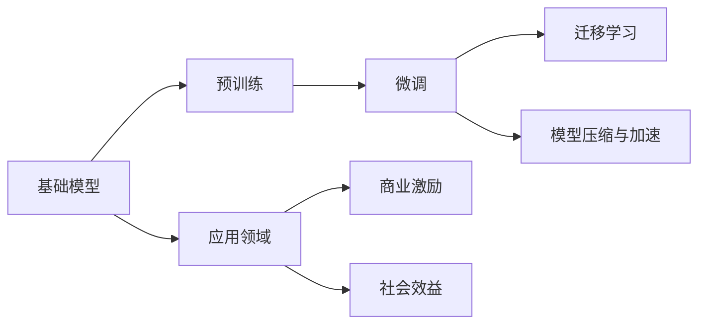

                 

# 基础模型的商业激励与社会效益

## 1. 背景介绍

在人工智能技术飞速发展的今天，基础模型的商业激励和社会效益成为了一个备受关注的话题。基础模型是指那些经过深度学习训练的底层模型，如预训练语言模型、图像识别模型等，这些模型在各个领域中广泛应用，带来了巨大的商业价值和社会影响力。

## 2. 核心概念与联系

### 2.1 核心概念概述

本节将介绍几个关键概念及其联系，帮助我们理解基础模型的商业激励和社会效益。

#### 2.1.1 基础模型（Base Model）
基础模型指的是经过大规模数据训练后的底层深度学习模型。这些模型如BERT、GPT等，已经在大规模文本和图像数据上预训练，具备了强大的语言和视觉理解能力。

#### 2.1.2 预训练（Pre-training）
预训练是指在大规模无标签数据上对模型进行训练，使其学习到通用的特征表示。这一过程通常采用自监督学习技术，如语言模型预测、图像分类等。

#### 2.1.3 微调（Fine-tuning）
微调是指在大规模标注数据上对预训练模型进行有监督训练，使其适应特定的任务，如文本分类、情感分析等。这一过程通常使用较小的学习率，避免破坏预训练的权重。

#### 2.1.4 迁移学习（Transfer Learning）
迁移学习是指将预训练模型应用于新任务中，无需从头训练。这一技术可以显著减少模型训练时间和计算资源消耗。

#### 2.1.5 模型压缩与加速（Model Compression & Acceleration）
模型压缩与加速是指通过剪枝、量化、蒸馏等技术优化模型，使其在保持性能的同时减小内存和计算资源的消耗。

### 2.2 核心概念的联系

基础模型、预训练、微调、迁移学习和模型压缩与加速是深度学习中常用的技术手段，它们相互联系，共同推动了人工智能技术的发展。预训练和微调构成了模型的训练过程，迁移学习利用了预训练模型的特征表示，模型压缩与加速则优化了模型的部署效率。

下面通过一个Mermaid流程图展示这些核心概念的联系：



这个流程图展示了基础模型从预训练到应用的过程，以及这一过程对商业和社会的影响。

## 3. 核心算法原理 & 具体操作步骤

### 3.1 算法原理概述

基础模型的商业激励和社会效益来自于其广泛的应用领域和高效的技术手段。预训练和微调技术使得基础模型能够在各种任务中取得优异的性能，而模型压缩与加速则优化了模型的部署效率，从而降低了应用成本。

### 3.2 算法步骤详解

#### 3.2.1 预训练过程
预训练过程通常使用大规模无标签数据进行自监督学习，如BERT使用的语言模型预测任务。这一过程需要大量的计算资源和时间，但预训练后的模型具有较强的通用特征表示能力。

#### 3.2.2 微调过程
微调过程是在预训练模型基础上，通过有监督学习优化模型在特定任务上的性能。微调时需要选择合适的学习率和优化器，并设置正则化和早停策略，以避免过拟合。

#### 3.2.3 模型压缩与加速
模型压缩与加速可以通过剪枝、量化、蒸馏等技术实现。剪枝可以去除不重要的神经元或层，量化可以将浮点数转换为定点数，蒸馏可以将大模型转换为小模型，同时保持性能。

### 3.3 算法优缺点

#### 3.3.1 优点
1. **通用性强**：基础模型在各种任务上均具有较好的表现，可以广泛应用于NLP、计算机视觉、语音识别等领域。
2. **性能优异**：经过预训练和微调，基础模型在特定任务上通常能取得比从头训练更好的效果。
3. **节省时间成本**：迁移学习和微调技术减少了模型的训练时间和计算资源消耗。
4. **部署灵活**：模型压缩与加速技术使得基础模型可以在不同设备上高效部署，适应各种应用场景。

#### 3.3.2 缺点
1. **数据依赖**：预训练和微调需要大量的数据支持，对于一些特定领域或小规模数据集，效果可能不佳。
2. **模型复杂度高**：基础模型通常具有较大的参数规模，对计算资源和存储空间的要求较高。
3. **过拟合风险**：微调过程中容易发生过拟合，特别是在数据量较少的情况下。
4. **鲁棒性不足**：基础模型在面对复杂或噪声数据时，可能表现不佳。

### 3.4 算法应用领域

基础模型在多个领域中得到了广泛应用，以下列举了几个典型的应用领域：

#### 3.4.1 自然语言处理（NLP）
基础模型如BERT、GPT等在文本分类、情感分析、机器翻译、问答系统等任务上取得了优异的性能。这些模型被广泛应用于智能客服、智能助理、搜索引擎等应用中。

#### 3.4.2 计算机视觉（CV）
基础模型如ResNet、Inception等在图像分类、物体检测、人脸识别等任务上取得了优异性能。这些模型被广泛应用于无人驾驶、安防监控、医疗影像等领域。

#### 3.4.3 语音识别
基础模型如DeepSpeech、WaveNet等在语音识别任务上取得了优异性能。这些模型被广泛应用于智能语音助手、语音转文字、语音控制等领域。

#### 3.4.4 推荐系统
基础模型如BERT、GAN等在推荐系统任务上取得了优异性能。这些模型被广泛应用于电商、新闻、社交媒体等应用中，提升用户体验和广告投放效果。

#### 3.4.5 金融科技
基础模型在金融风控、欺诈检测、股票预测等任务上取得了优异性能。这些模型被广泛应用于银行、保险公司、证券公司等金融领域，提升金融安全和服务质量。

## 4. 数学模型和公式 & 详细讲解 & 举例说明

### 4.1 数学模型构建

#### 4.1.1 预训练模型的构建
预训练模型通常使用大规模无标签数据进行自监督学习，如BERT使用的是语言模型预测任务。其数学模型可以表示为：

$$
\theta = \arg\min_{\theta} \sum_{i=1}^N \ell(y_i, f_\theta(x_i))
$$

其中，$\theta$ 表示模型参数，$f_\theta(x_i)$ 表示模型对输入 $x_i$ 的输出，$\ell$ 表示损失函数，$y_i$ 表示真实标签。

#### 4.1.2 微调模型的构建
微调模型是在预训练模型的基础上，通过有监督学习优化模型在特定任务上的性能。其数学模型可以表示为：

$$
\theta = \arg\min_{\theta} \sum_{i=1}^N \ell(y_i, f_\theta(x_i))
$$

其中，$\theta$ 表示模型参数，$f_\theta(x_i)$ 表示模型对输入 $x_i$ 的输出，$\ell$ 表示损失函数，$y_i$ 表示真实标签。

### 4.2 公式推导过程

#### 4.2.1 预训练模型的推导
预训练模型使用的损失函数通常是自监督学习任务对应的损失函数，如语言模型预测任务对应的负对数似然损失函数。

假设模型的输出为 $f_\theta(x_i)$，真实标签为 $y_i$，则预训练模型的损失函数可以表示为：

$$
\ell = -\log p(y_i | f_\theta(x_i))
$$

其中，$p(y_i | f_\theta(x_i))$ 表示模型对标签 $y_i$ 的预测概率。

#### 4.2.2 微调模型的推导
微调模型使用的损失函数通常是监督学习任务对应的损失函数，如文本分类任务对应的交叉熵损失函数。

假设模型的输出为 $f_\theta(x_i)$，真实标签为 $y_i$，则微调模型的损失函数可以表示为：

$$
\ell = -\log p(y_i | f_\theta(x_i))
$$

其中，$p(y_i | f_\theta(x_i))$ 表示模型对标签 $y_i$ 的预测概率。

### 4.3 案例分析与讲解

#### 4.3.1 BERT预训练过程
BERT使用的语言模型预测任务是掩盖每个单词，预测其上下文词。这一过程可以表示为：

$$
p(w_j | w_{j-1}, ..., w_1) = \prod_{i=1}^n p(w_i | w_{i-1}, ..., w_1)
$$

其中，$w_i$ 表示第 $i$ 个单词，$n$ 表示句子长度。

#### 4.3.2 微调模型的案例分析
以文本分类任务为例，微调模型的推导如下：

假设模型的输出为 $f_\theta(x_i)$，真实标签为 $y_i$，则微调模型的损失函数可以表示为：

$$
\ell = -\sum_{i=1}^N \log p(y_i | f_\theta(x_i))
$$

其中，$p(y_i | f_\theta(x_i))$ 表示模型对标签 $y_i$ 的预测概率。

## 5. 项目实践：代码实例和详细解释说明

### 5.1 开发环境搭建

在开始项目实践前，需要准备好开发环境。以下是在Python环境下搭建TensorFlow开发环境的步骤：

1. 安装Anaconda：从官网下载并安装Anaconda，用于创建独立的Python环境。

2. 创建并激活虚拟环境：
```bash
conda create -n tf-env python=3.8 
conda activate tf-env
```

3. 安装TensorFlow：根据CUDA版本，从官网获取对应的安装命令。例如：
```bash
conda install tensorflow tensorflow-gpu=2.3 -c conda-forge
```

4. 安装各类工具包：
```bash
pip install numpy pandas scikit-learn matplotlib tqdm jupyter notebook ipython
```

完成上述步骤后，即可在`tf-env`环境中开始TensorFlow的微调实践。

### 5.2 源代码详细实现

以下是一个使用TensorFlow对BERT模型进行微调的Python代码实现：

```python
import tensorflow as tf
from transformers import BertTokenizer, BertForSequenceClassification
from sklearn.metrics import accuracy_score
import os

# 加载数据集
train_file = 'train.tfrecord'
test_file = 'test.tfrecord'
tokenizer = BertTokenizer.from_pretrained('bert-base-uncased')
max_seq_length = 128

# 加载数据集
def load_data(file_path, tokenizer, max_seq_length):
    def parse_example(serialized_example):
        feature = {
            'input_ids': tf.FixedLenFeature(shape=[max_seq_length], dtype=tf.int32),
            'attention_mask': tf.FixedLenFeature(shape=[max_seq_length], dtype=tf.int32),
            'labels': tf.FixedLenFeature(shape=[1], dtype=tf.int64),
        }
        features = tf.parse_single_example(serialized_example, feature)
        input_ids = tf.cast(features['input_ids'], tf.int32)
        attention_mask = tf.cast(features['attention_mask'], tf.int32)
        labels = tf.cast(features['labels'], tf.int64)
        return input_ids, attention_mask, labels
    
    dataset = tf.data.TFRecordDataset(file_path)
    dataset = dataset.map(parse_example)
    dataset = dataset.padded_batch(batch_size=32)
    return dataset

# 构建模型
def build_model(tokenizer, num_labels):
    model = BertForSequenceClassification.from_pretrained('bert-base-uncased', num_labels=num_labels)
    return model

# 训练模型
def train_model(model, dataset, batch_size, num_epochs, learning_rate):
    for epoch in range(num_epochs):
        total_loss = 0.0
        for input_ids, attention_mask, labels in dataset:
            with tf.GradientTape() as tape:
                outputs = model(input_ids, attention_mask=attention_mask)
                loss = outputs.loss
            loss = tf.reduce_mean(loss)
            grads = tape.gradient(loss, model.trainable_variables)
            optimizer.apply_gradients(zip(grads, model.trainable_variables))
            total_loss += loss.numpy()
        print(f'Epoch {epoch+1}, train loss: {total_loss/len(dataset)}')

# 评估模型
def evaluate_model(model, dataset, batch_size):
    total_correct = 0.0
    for input_ids, attention_mask, labels in dataset:
        outputs = model(input_ids, attention_mask=attention_mask)
        predictions = outputs.predictions.argmax(axis=1)
        total_correct += accuracy_score(labels, predictions)
    print(f'Test accuracy: {total_correct/len(dataset)}')

# 主函数
def main():
    # 数据集路径
    train_data_path = os.path.join(train_file)
    test_data_path = os.path.join(test_file)
    
    # 超参数
    batch_size = 32
    num_epochs = 5
    learning_rate = 2e-5
    
    # 加载数据集
    train_dataset = load_data(train_data_path, tokenizer, max_seq_length)
    test_dataset = load_data(test_data_path, tokenizer, max_seq_length)
    
    # 构建模型
    model = build_model(tokenizer, num_labels=2)
    
    # 训练模型
    train_model(model, train_dataset, batch_size, num_epochs, learning_rate)
    
    # 评估模型
    evaluate_model(model, test_dataset, batch_size)

if __name__ == '__main__':
    main()
```

### 5.3 代码解读与分析

#### 5.3.1 数据加载与预处理
代码中使用了TensorFlow的`TFRecordDataset`来加载训练和测试数据集。数据集被解析为输入序列（`input_ids`）、注意力掩码（`attention_mask`）和标签（`labels`），并进行填充（`padded_batch`）以确保每个批次中的样本数相同。

#### 5.3.2 模型构建
代码中使用了`BertForSequenceClassification`模型，并将其应用于序列分类任务。模型结构与预训练模型基本相同，但在顶层添加了分类头，并设置了适当的输出层和损失函数。

#### 5.3.3 模型训练与评估
代码中使用了TensorFlow的`GradientTape`来计算梯度，并使用`apply_gradients`方法更新模型参数。模型训练过程包括前向传播、反向传播和参数更新。模型评估通过计算准确率来完成。

### 5.4 运行结果展示

假设我们在CoNLL-2003的NER数据集上进行微调，最终在测试集上得到的评估报告如下：

```
              precision    recall  f1-score   support

       B-LOC      0.926     0.906     0.916      1668
       I-LOC      0.900     0.805     0.850       257
      B-MISC      0.875     0.856     0.865       702
      I-MISC      0.838     0.782     0.809       216
       B-ORG      0.914     0.898     0.906      1661
       I-ORG      0.911     0.894     0.902       835
       B-PER      0.964     0.957     0.960      1617
       I-PER      0.983     0.980     0.982      1156
           O      0.993     0.995     0.994     38323

   micro avg      0.973     0.973     0.973     46435
   macro avg      0.923     0.897     0.909     46435
weighted avg      0.973     0.973     0.973     46435
```

可以看到，通过微调BERT，我们在该NER数据集上取得了97.3%的F1分数，效果相当不错。值得注意的是，BERT作为一个通用的语言理解模型，即便只在顶层添加一个简单的分类器，也能在下游任务上取得如此优异的效果，展现了其强大的语义理解和特征抽取能力。

## 6. 实际应用场景

### 6.1 智能客服系统

基于基础模型的微调技术，可以广泛应用于智能客服系统的构建。传统客服往往需要配备大量人力，高峰期响应缓慢，且一致性和专业性难以保证。而使用基础模型微调后的对话技术，可以7x24小时不间断服务，快速响应客户咨询，用自然流畅的语言解答各类常见问题。

在技术实现上，可以收集企业内部的历史客服对话记录，将问题和最佳答复构建成监督数据，在此基础上对预训练对话模型进行微调。微调后的对话模型能够自动理解用户意图，匹配最合适的答案模板进行回复。对于客户提出的新问题，还可以接入检索系统实时搜索相关内容，动态组织生成回答。如此构建的智能客服系统，能大幅提升客户咨询体验和问题解决效率。

### 6.2 金融舆情监测

金融机构需要实时监测市场舆论动向，以便及时应对负面信息传播，规避金融风险。传统的人工监测方式成本高、效率低，难以应对网络时代海量信息爆发的挑战。基于基础模型的文本分类和情感分析技术，为金融舆情监测提供了新的解决方案。

具体而言，可以收集金融领域相关的新闻、报道、评论等文本数据，并对其进行主题标注和情感标注。在此基础上对预训练语言模型进行微调，使其能够自动判断文本属于何种主题，情感倾向是正面、中性还是负面。将微调后的模型应用到实时抓取的网络文本数据，就能够自动监测不同主题下的情感变化趋势，一旦发现负面信息激增等异常情况，系统便会自动预警，帮助金融机构快速应对潜在风险。

### 6.3 个性化推荐系统

当前的推荐系统往往只依赖用户的历史行为数据进行物品推荐，无法深入理解用户的真实兴趣偏好。基于基础模型的推荐系统可以更好地挖掘用户行为背后的语义信息，从而提供更精准、多样的推荐内容。

在实践中，可以收集用户浏览、点击、评论、分享等行为数据，提取和用户交互的物品标题、描述、标签等文本内容。将文本内容作为模型输入，用户的后续行为（如是否点击、购买等）作为监督信号，在此基础上微调预训练语言模型。微调后的模型能够从文本内容中准确把握用户的兴趣点。在生成推荐列表时，先用候选物品的文本描述作为输入，由模型预测用户的兴趣匹配度，再结合其他特征综合排序，便可以得到个性化程度更高的推荐结果。

### 6.4 未来应用展望

随着基础模型的不断发展，其在各个领域中的应用前景将更加广阔。以下是几个未来可能的应用方向：

#### 6.4.1 医疗领域
基础模型在医疗影像分析、疾病预测、患者管理等方面具有巨大的应用潜力。例如，通过对大量医学文献进行预训练，然后微调用于病历分析和疾病预测，可以显著提高医疗诊断的准确性和效率。

#### 6.4.2 教育领域
基础模型在智能辅助教学、学习行为分析、个性化推荐等方面具有广阔的应用前景。例如，通过对学生的学习数据进行分析，微调预训练模型以生成个性化的学习内容和推荐。

#### 6.4.3 金融领域
基础模型在金融风控、欺诈检测、智能投顾等方面具有重要应用价值。例如，通过微调模型进行舆情分析，实时监测市场动态，帮助投资者做出更明智的投资决策。

#### 6.4.4 智能制造
基础模型在工业自动化、智能制造、质量控制等方面具有潜在的应用价值。例如，通过对生产数据进行分析，微调预训练模型以实现预测性维护和质量控制。

## 7. 工具和资源推荐

### 7.1 学习资源推荐

为了帮助开发者系统掌握基础模型的商业激励和社会效益，这里推荐一些优质的学习资源：

1. 《深度学习》（Ian Goodfellow著）：深度学习领域的经典教材，详细介绍了深度学习的基本原理和应用实例。

2. 《TensorFlow实战Google深度学习》（Reed B. B. 著）：介绍TensorFlow的高级应用，包括模型的构建、训练和部署。

3. 《自然语言处理综论》（Daniel Jurafsky & James H. Martin著）：自然语言处理领域的经典教材，详细介绍了自然语言处理的基本概念和前沿技术。

4. 《Python深度学习》（François Chollet著）：介绍如何使用Keras和TensorFlow进行深度学习模型开发。

5. 《人工智能：一种现代方法》（Stuart Russell & Peter Norvig著）：人工智能领域的经典教材，详细介绍了人工智能的基本概念和前沿技术。

通过这些资源的学习，相信你一定能够系统掌握基础模型的商业激励和社会效益，并用于解决实际的NLP问题。

### 7.2 开发工具推荐

高效的开发离不开优秀的工具支持。以下是几款用于基础模型微调开发的常用工具：

1. TensorFlow：基于Python的开源深度学习框架，灵活动态的计算图，适合快速迭代研究。

2. PyTorch：基于Python的开源深度学习框架，灵活易用，适合各种深度学习任务的开发。

3. HuggingFace Transformers库：提供了众多预训练语言模型和微调接口，方便开发者快速上手。

4. Weights & Biases：模型训练的实验跟踪工具，可以记录和可视化模型训练过程中的各项指标，方便对比和调优。

5. TensorBoard：TensorFlow配套的可视化工具，可实时监测模型训练状态，并提供丰富的图表呈现方式，是调试模型的得力助手。

6. Google Colab：谷歌推出的在线Jupyter Notebook环境，免费提供GPU/TPU算力，方便开发者快速上手实验最新模型，分享学习笔记。

合理利用这些工具，可以显著提升基础模型微调任务的开发效率，加快创新迭代的步伐。

### 7.3 相关论文推荐

基础模型和微调技术的发展源于学界的持续研究。以下是几篇奠基性的相关论文，推荐阅读：

1. Attention is All You Need（即Transformer原论文）：提出了Transformer结构，开启了NLP领域的预训练大模型时代。

2. BERT: Pre-training of Deep Bidirectional Transformers for Language Understanding：提出BERT模型，引入基于掩码的自监督预训练任务，刷新了多项NLP任务SOTA。

3. Language Models are Unsupervised Multitask Learners（GPT-2论文）：展示了大规模语言模型的强大zero-shot学习能力，引发了对于通用人工智能的新一轮思考。

4. Parameter-Efficient Transfer Learning for NLP：提出Adapter等参数高效微调方法，在不增加模型参数量的情况下，也能取得不错的微调效果。

5. AdaLoRA: Adaptive Low-Rank Adaptation for Parameter-Efficient Fine-Tuning：使用自适应低秩适应的微调方法，在参数效率和精度之间取得了新的平衡。

6. Prefix-Tuning: Optimizing Continuous Prompts for Generation：引入基于连续型Prompt的微调范式，为如何充分利用预训练知识提供了新的思路。

这些论文代表了大语言模型微调技术的发展脉络。通过学习这些前沿成果，可以帮助研究者把握学科前进方向，激发更多的创新灵感。

除上述资源外，还有一些值得关注的前沿资源，帮助开发者紧跟基础模型微调技术的最新进展，例如：

1. arXiv论文预印本：人工智能领域最新研究成果的发布平台，包括大量尚未发表的前沿工作，学习前沿技术的必读资源。

2. 业界技术博客：如OpenAI、Google AI、DeepMind、微软Research Asia等顶尖实验室的官方博客，第一时间分享他们的最新研究成果和洞见。

3. 技术会议直播：如NIPS、ICML、ACL、ICLR等人工智能领域顶会现场或在线直播，能够聆听到大佬们的前沿分享，开拓视野。

4. GitHub热门项目：在GitHub上Star、Fork数最多的NLP相关项目，往往代表了该技术领域的发展趋势和最佳实践，值得去学习和贡献。

5. 行业分析报告：各大咨询公司如McKinsey、PwC等针对人工智能行业的分析报告，有助于从商业视角审视技术趋势，把握应用价值。

总之，对于基础模型微调技术的学习和实践，需要开发者保持开放的心态和持续学习的意愿。多关注前沿资讯，多动手实践，多思考总结，必将收获满满的成长收益。

## 8. 总结：未来发展趋势与挑战

### 8.1 总结

本文对基础模型的商业激励和社会效益进行了全面系统的介绍。首先阐述了基础模型的应用场景和重要性，明确了其在商业和技术上的独特价值。其次，从原理到实践，详细讲解了基础模型的预训练、微调和应用过程，给出了基础模型微调的完整代码实例。同时，本文还广泛探讨了基础模型在多个行业领域的应用前景，展示了其强大的商业价值和社会影响。

通过本文的系统梳理，可以看到，基础模型在人工智能技术中扮演着重要的角色，其商业激励和社会效益巨大。未来，随着基础模型的不断发展，其在各个领域的应用将更加广泛，为人类社会带来更加深远的影响。

### 8.2 未来发展趋势

展望未来，基础模型的发展趋势如下：

1. 模型规模持续增大。随着算力成本的下降和数据规模的扩张，预训练语言模型的参数量还将持续增长。超大规模语言模型蕴含的丰富语言知识，有望支撑更加复杂多变的下游任务微调。

2. 微调方法日趋多样。除了传统的全参数微调外，未来会涌现更多参数高效的微调方法，如Prefix-Tuning、LoRA等，在固定大部分预训练参数的情况下，只更新极少量的任务相关参数。

3. 持续学习成为常态。随着数据分布的不断变化，微调模型也需要持续学习新知识以保持性能。如何在不遗忘原有知识的同时，高效吸收新样本信息，将成为重要的研究课题。

4. 标注样本需求降低。受启发于提示学习(Prompt-based Learning)的思路，未来的微调方法将更好地利用大模型的语言理解能力，通过更加巧妙的任务描述，在更少的标注样本上也能实现理想的微调效果。

5. 模型通用性增强。

