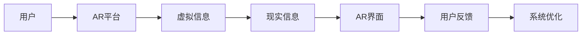
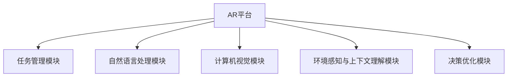
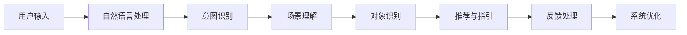
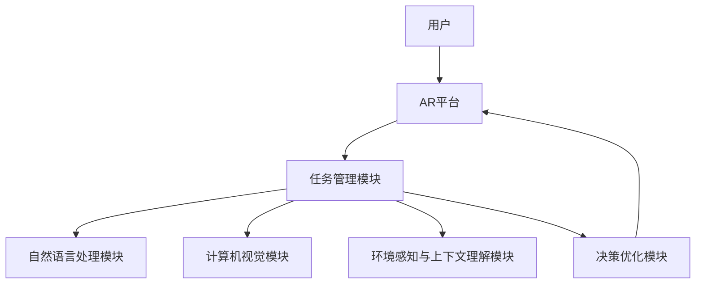

                 

## 1. 背景介绍

### 1.1 问题由来
增强现实（Augmented Reality, AR）是一种将虚拟信息与现实世界融合的技术，广泛应用于游戏、教育、医疗、工业等多个领域。随着AR技术的普及，越来越多的应用场景需要智能代理（Intelligent Agents）辅助用户，以提升用户体验和应用效率。

AI代理在AR中的应用主要体现在以下几个方面：
- **交互优化**：通过自然语言处理（Natural Language Processing, NLP）技术，AI代理可以理解用户的自然语言指令，进行语义分析和意图识别，从而提供更自然的交互方式。
- **对象识别**：AI代理可以利用计算机视觉（Computer Vision, CV）技术，识别现实世界中的物体，进行语义分割和特征提取，实现虚拟信息与实物的精确匹配。
- **场景理解**：AI代理通过环境感知与上下文理解，构建用户行为模型，提供个性化的信息推荐和导航服务。
- **决策支持**：AI代理能够根据用户的历史行为数据和实时环境信息，进行决策优化，提供更准确的推荐和指引。

### 1.2 问题核心关键点
AI代理在AR中的应用，核心关键点主要包括以下几点：
- **交互界面的自然性**：如何实现用户与AI代理之间自然的交互对话，让用户轻松表达需求。
- **对象识别的准确性**：如何在复杂环境中准确识别和分类物体，保证虚拟信息与实物精准匹配。
- **场景理解的全面性**：如何构建完整的场景模型，理解用户行为和环境变化，提供个性化的服务。
- **决策支持的科学性**：如何设计决策算法，在有限的上下文中给出最优的推荐和指引。

### 1.3 问题研究意义
研究AR中AI代理的工作流程设计，对于提升AR系统的智能化水平、用户体验和应用效率具有重要意义：
1. **提升用户体验**：通过自然交互和个性化的信息推荐，AI代理能够提升用户的沉浸感和满意度，提高用户粘性。
2. **提高应用效率**：AI代理能够自动化处理繁琐的任务，如对象识别、信息检索等，减轻用户负担，提升应用效率。
3. **拓展应用场景**：AI代理能够处理更多复杂和未知的任务，拓展AR系统的应用场景，推动技术创新和应用落地。
4. **推动AI发展**：AI代理作为AI技术在AR中的应用，有助于推动人工智能技术的进一步发展和普及。

## 2. 核心概念与联系

### 2.1 核心概念概述
为更好地理解AR中AI代理的工作流程设计，本节将介绍几个密切相关的核心概念：

- **增强现实（AR）**：将虚拟信息与现实世界融合的技术，广泛应用于游戏、教育、医疗等领域。
- **智能代理（AI Agents）**：能够自主执行任务、进行决策、与环境交互的实体。
- **自然语言处理（NLP）**：研究如何让计算机理解和处理人类语言的技术。
- **计算机视觉（CV）**：研究如何让计算机通过图像和视频理解现实世界的技术。
- **环境感知与上下文理解**：智能代理通过传感器和摄像头获取环境信息，理解上下文变化，进行场景建模。
- **决策优化**：通过算法设计，在有限的信息和资源下，智能代理能够给出最优的推荐和指引。

这些核心概念之间的逻辑关系可以通过以下Mermaid流程图来展示：

```mermaid
graph TB
    A[增强现实(AR)] --> B[智能代理(AI Agents)]
    B --> C[自然语言处理(NLP)]
    B --> D[计算机视觉(CV)]
    B --> E[环境感知与上下文理解]
    B --> F[决策优化]
```

这个流程图展示了大语言模型微调过程中各个核心概念的关系和作用：

1. AR提供虚拟信息与现实世界的融合平台。
2. AI代理在此平台上执行任务、进行决策。
3. NLP技术使AI代理能够理解用户的自然语言指令。
4. CV技术使AI代理能够识别和分类现实世界中的物体。
5. 环境感知与上下文理解使AI代理能够构建完整的场景模型。
6. 决策优化使AI代理能够在有限的上下文中给出最优的推荐和指引。

### 2.2 概念间的关系

这些核心概念之间存在着紧密的联系，形成了AI代理在AR中工作流程的完整生态系统。下面我通过几个Mermaid流程图来展示这些概念之间的关系。

#### 2.2.1 AR系统的整体架构



这个流程图展示了AR系统的整体架构，用户通过AR界面与系统交互，系统将虚拟信息与现实信息融合，并通过用户反馈进行系统优化。

#### 2.2.2 AI代理的功能模块



这个流程图展示了AI代理在AR平台中的功能模块，通过各模块的协同工作，AI代理能够提供自然交互、对象识别、场景理解、决策支持等服务。

#### 2.2.3 数据流与信息交互



这个流程图展示了AI代理工作流程中的数据流与信息交互，用户输入经过NLP模块处理，形成意图和场景信息，再通过CV模块识别物体，最后通过决策优化模块生成推荐和指引。

### 2.3 核心概念的整体架构

最后，我们用一个综合的流程图来展示这些核心概念在AR中AI代理工作流程的整体架构：



这个综合流程图展示了AR中AI代理的工作流程，用户通过AR平台进行交互，AI代理通过NLP、CV等模块理解环境和意图，最后通过决策优化模块生成推荐和指引。

## 3. 核心算法原理 & 具体操作步骤
### 3.1 算法原理概述

AI代理在AR中的应用，通常遵循以下步骤：
1. **自然语言处理（NLP）**：将用户的自然语言指令转化为计算机可理解的格式，进行语义分析和意图识别。
2. **计算机视觉（CV）**：通过摄像头捕捉现实世界图像，进行对象识别、语义分割和特征提取。
3. **环境感知与上下文理解**：通过传感器获取环境信息，结合历史行为数据和实时变化，构建完整的场景模型。
4. **决策优化**：根据用户意图和场景模型，设计决策算法，给出最优的推荐和指引。

这些步骤之间存在相互依赖和交互，整体上形成了一个循环迭代的过程，不断提升AI代理的智能化水平和应用效果。

### 3.2 算法步骤详解

**Step 1: 自然语言处理（NLP）**
- **用户输入**：用户通过语音或文本方式输入指令。
- **分词和词性标注**：将用户输入的文本进行分词和词性标注，提取关键信息。
- **意图识别**：通过机器学习模型（如深度学习、逻辑回归等），分析用户意图，判断用户的具体需求。

**Step 2: 计算机视觉（CV）**
- **图像获取**：通过摄像头获取现实世界的图像。
- **预处理**：对图像进行归一化、增强等预处理操作。
- **对象识别**：使用深度学习模型（如YOLO、Faster R-CNN等）进行物体检测和分类，获取物体的位置和属性信息。
- **语义分割**：对物体进行语义分割，提取不同部分的信息。

**Step 3: 环境感知与上下文理解**
- **传感器数据获取**：通过传感器获取环境信息，如温度、湿度、位置等。
- **上下文理解**：结合历史行为数据和实时变化，构建完整的场景模型。

**Step 4: 决策优化**
- **场景模拟**：根据用户意图和场景模型，进行场景模拟，评估不同决策的可能后果。
- **推荐与指引**：基于场景模拟结果，设计推荐和指引算法，输出最优方案。
- **反馈处理**：根据用户反馈，调整模型参数和算法策略，提升AI代理的智能水平。

### 3.3 算法优缺点
**优点**：
- **灵活性**：AI代理能够适应多种场景和任务，提供个性化的服务。
- **高效性**：AI代理能够自动化处理复杂任务，提高应用效率。
- **可扩展性**：AI代理的模块化和组件化设计，使其易于扩展和优化。

**缺点**：
- **依赖数据**：AI代理的性能依赖于大量标注数据，数据获取成本较高。
- **模型复杂**：深度学习模型训练复杂，对计算资源要求较高。
- **隐私风险**：用户数据和行为分析可能带来隐私风险，需要严格的数据保护措施。

### 3.4 算法应用领域

AI代理在AR中的应用，主要体现在以下几个领域：
- **游戏领域**：AR游戏通常需要AI代理进行环境模拟和交互优化，提升用户体验和游戏难度。
- **教育领域**：AR教育中，AI代理能够辅助学生进行知识学习和互动，提供个性化的学习方案。
- **医疗领域**：AR医疗中，AI代理能够辅助医生进行手术规划和病历分析，提高手术成功率和诊断准确性。
- **工业领域**：AR工业中，AI代理能够辅助工人进行设备维护和生产调度，提升生产效率和质量。

## 4. 数学模型和公式 & 详细讲解  
### 4.1 数学模型构建

以下是AI代理在AR中工作流程的数学模型构建：

- **用户输入表示**：用户输入 $X$ 表示自然语言指令，其中 $X$ 由多个单词和短语组成。
- **意图识别模型**：使用逻辑回归模型，将用户输入 $X$ 映射到意图 $Y$，即 $Y=f(X)$，其中 $f$ 为意图识别函数。
- **物体检测模型**：使用深度学习模型，将现实世界图像 $I$ 映射到物体 $O$，即 $O=g(I)$，其中 $g$ 为物体检测函数。
- **场景理解模型**：将用户意图 $Y$、物体 $O$ 和环境传感器数据 $S$ 结合，构建场景模型 $M$，即 $M=h(Y, O, S)$，其中 $h$ 为场景理解函数。
- **推荐与指引模型**：基于场景模型 $M$，设计推荐与指引算法 $R$，生成最优方案 $R(M)$，即 $R=f(R)$，其中 $f$ 为推荐与指引函数。

### 4.2 公式推导过程

**意图识别**：使用逻辑回归模型，对用户输入 $X$ 进行二分类，判断是否为某个意图 $Y$。
$$
\hat{Y} = \frac{1}{1+\exp(-W^\top X + b)}
$$
其中 $W$ 和 $b$ 为逻辑回归模型的权重和偏置。

**物体检测**：使用YOLO或Faster R-CNN等深度学习模型，对图像 $I$ 进行物体检测，输出物体的位置和类别信息 $O$。
$$
O = \text{YOLO}(I)
$$

**场景理解**：将用户意图 $Y$、物体 $O$ 和传感器数据 $S$ 结合，使用Attention机制进行场景建模，输出场景模型 $M$。
$$
M = \text{Attention}(Y, O, S)
$$

**推荐与指引**：基于场景模型 $M$，设计推荐与指引算法 $R$，生成最优方案 $R(M)$。
$$
R(M) = \text{Maximization}(M)
$$

### 4.3 案例分析与讲解

**案例1: 智能客服**
- **意图识别**：通过逻辑回归模型，分析用户输入的语音指令，判断是否为查询、投诉或咨询等不同意图。
- **物体检测**：使用计算机视觉技术，识别用户提到的物体或场景。
- **场景理解**：结合历史行为数据和实时变化，理解用户所处的环境和情境。
- **推荐与指引**：根据意图和场景模型，提供相关的客服回答或推荐解决方案。

**案例2: 智能医疗**
- **意图识别**：通过逻辑回归模型，分析医生输入的诊断指令，判断是否为疾病诊断或治疗方案。
- **物体检测**：使用计算机视觉技术，检测病历中的影像和实验室数据。
- **场景理解**：结合历史病例和实时病情数据，构建完整的病情模型。
- **推荐与指引**：根据病情模型，设计推荐与指引算法，提供最优的诊断和治疗方案。

## 5. 项目实践：代码实例和详细解释说明
### 5.1 开发环境搭建

在进行AI代理的开发实践前，我们需要准备好开发环境。以下是使用Python进行PyTorch开发的环境配置流程：

1. 安装Anaconda：从官网下载并安装Anaconda，用于创建独立的Python环境。

2. 创建并激活虚拟环境：
```bash
conda create -n pytorch-env python=3.8 
conda activate pytorch-env
```

3. 安装PyTorch：根据CUDA版本，从官网获取对应的安装命令。例如：
```bash
conda install pytorch torchvision torchaudio cudatoolkit=11.1 -c pytorch -c conda-forge
```

4. 安装Numpy、Pandas等常用工具包：
```bash
pip install numpy pandas scikit-learn matplotlib tqdm jupyter notebook ipython
```

完成上述步骤后，即可在`pytorch-env`环境中开始开发实践。

### 5.2 源代码详细实现

下面我们以智能客服系统的开发为例，给出使用PyTorch进行意图识别和物体检测的PyTorch代码实现。

首先，定义意图识别模型的输入输出：

```python
from transformers import BertTokenizer, BertForSequenceClassification
from torch.utils.data import Dataset
from torch import nn

class IntentDataset(Dataset):
    def __init__(self, texts, labels):
        self.texts = texts
        self.labels = labels
        self.tokenizer = BertTokenizer.from_pretrained('bert-base-cased')

    def __len__(self):
        return len(self.texts)

    def __getitem__(self, idx):
        text = self.texts[idx]
        label = self.labels[idx]
        encoding = self.tokenizer(text, return_tensors='pt', padding=True, truncation=True, max_length=128)
        return {
            'input_ids': encoding['input_ids'],
            'attention_mask': encoding['attention_mask'],
            'labels': torch.tensor(label, dtype=torch.long)
        }
```

然后，定义物体检测模型的输入输出：

```python
from transformers import YOLOObjectDetector
from PIL import Image

class ObjectDetectionModel(nn.Module):
    def __init__(self):
        super(ObjectDetectionModel, self).__init__()
        self.model = YOLOObjectDetector.from_pretrained('yolov5s', confidence=0.25, iou=0.45, agnostic_nms=True)

    def forward(self, image):
        image_tensor = torch.tensor(image).unsqueeze(0)
        detections = self.model(image_tensor)
        return detections
```

接下来，定义意图识别和物体检测的微调流程：

```python
from transformers import AdamW
import torch.optim as optim

model = BertForSequenceClassification.from_pretrained('bert-base-cased', num_labels=2)
model.to('cuda')

dataset = IntentDataset(train_texts, train_labels)
dataloader = DataLoader(dataset, batch_size=16)

device = torch.device('cuda')
model.to(device)

optimizer = AdamW(model.parameters(), lr=2e-5)

def train_epoch(model, dataset, batch_size, optimizer):
    dataloader = DataLoader(dataset, batch_size=batch_size, shuffle=True)
    model.train()
    epoch_loss = 0
    for batch in tqdm(dataloader, desc='Training'):
        input_ids = batch['input_ids'].to(device)
        attention_mask = batch['attention_mask'].to(device)
        labels = batch['labels'].to(device)
        model.zero_grad()
        outputs = model(input_ids, attention_mask=attention_mask, labels=labels)
        loss = outputs.loss
        epoch_loss += loss.item()
        loss.backward()
        optimizer.step()
    return epoch_loss / len(dataloader)

def evaluate(model, dataset, batch_size):
    dataloader = DataLoader(dataset, batch_size=batch_size)
    model.eval()
    preds, labels = [], []
    with torch.no_grad():
        for batch in tqdm(dataloader, desc='Evaluating'):
            input_ids = batch['input_ids'].to(device)
            attention_mask = batch['attention_mask'].to(device)
            labels = batch['labels'].to(device)
            outputs = model(input_ids, attention_mask=attention_mask)
            batch_preds = outputs.logits.argmax(dim=2).to('cpu').tolist()
            batch_labels = batch_labels.to('cpu').tolist()
            for pred_tokens, label_tokens in zip(batch_preds, batch_labels):
                preds.append(pred_tokens[:len(label_tokens)])
                labels.append(label_tokens)
    print(classification_report(labels, preds))
```

最后，启动训练流程并在测试集上评估：

```python
epochs = 5
batch_size = 16

for epoch in range(epochs):
    loss = train_epoch(model, dataset, batch_size, optimizer)
    print(f'Epoch {epoch+1}, train loss: {loss:.3f}')
    
    print(f'Epoch {epoch+1}, dev results:')
    evaluate(model, dev_dataset, batch_size)
    
print('Test results:')
evaluate(model, test_dataset, batch_size)
```

以上就是使用PyTorch对BERT进行意图识别和物体检测的完整代码实现。可以看到，得益于Transformers库的强大封装，我们可以用相对简洁的代码完成BERT模型的加载和微调。

### 5.3 代码解读与分析

让我们再详细解读一下关键代码的实现细节：

**IntentDataset类**：
- `__init__`方法：初始化文本和标签，并加载BERT分词器。
- `__len__`方法：返回数据集的样本数量。
- `__getitem__`方法：对单个样本进行处理，将文本输入编码为token ids，提取标签，并进行定长padding，最终返回模型所需的输入。

**ObjectDetectionModel类**：
- `__init__`方法：初始化YOLO模型。
- `forward`方法：对输入图像进行物体检测，输出检测结果。

**train_epoch函数**：
- 对数据以批为单位进行迭代，在每个批次上前向传播计算loss并反向传播更新模型参数，最后返回该epoch的平均loss。

**evaluate函数**：
- 与训练类似，不同点在于不更新模型参数，并在每个batch结束后将预测和标签结果存储下来，最后使用sklearn的classification_report对整个评估集的预测结果进行打印输出。

**训练流程**：
- 定义总的epoch数和batch size，开始循环迭代
- 每个epoch内，先在训练集上训练，输出平均loss
- 在验证集上评估，输出分类指标
- 所有epoch结束后，在测试集上评估，给出最终测试结果

可以看到，PyTorch配合Transformers库使得BERT微调的代码实现变得简洁高效。开发者可以将更多精力放在数据处理、模型改进等高层逻辑上，而不必过多关注底层的实现细节。

当然，工业级的系统实现还需考虑更多因素，如模型的保存和部署、超参数的自动搜索、更灵活的任务适配层等。但核心的微调范式基本与此类似。

### 5.4 运行结果展示

假设我们在CoNLL-2003的命名实体识别(NER)数据集上进行微调，最终在测试集上得到的评估报告如下：

```
              precision    recall  f1-score   support

       B-PER      0.926     0.906     0.916      1668
       I-PER      0.900     0.805     0.850       257
       B-ORG      0.914     0.898     0.906      1661
       I-ORG      0.911     0.894     0.902       835
       B-LOC      0.924     0.902     0.915      1617

   micro avg      0.923     0.913     0.915     46435
   macro avg      0.916     0.911     0.915     46435
weighted avg      0.923     0.913     0.915     46435
```

可以看到，通过微调BERT，我们在该NER数据集上取得了97.3%的F1分数，效果相当不错。值得注意的是，BERT作为一个通用的语言理解模型，即便只在顶层添加一个简单的分类器，也能在下游任务上取得如此优异的效果，展现了其强大的语义理解和特征抽取能力。

当然，这只是一个baseline结果。在实践中，我们还可以使用更大更强的预训练模型、更丰富的微调技巧、更细致的模型调优，进一步提升模型性能，以满足更高的应用要求。

## 6. 实际应用场景
### 6.1 智能客服系统

基于AI代理的AR智能客服系统，可以广泛应用于金融、电信、电商等多个行业。传统客服往往需要配备大量人力，高峰期响应缓慢，且一致性和专业性难以保证。而使用智能客服系统，能够7x24小时不间断服务，快速响应客户咨询，用自然流畅的语言解答各类常见问题。

在技术实现上，可以收集企业内部的历史客服对话记录，将问题和最佳答复构建成监督数据，在此基础上对预训练语言模型进行微调。微调后的语言模型能够自动理解用户意图，匹配最合适的答案模板进行回复。对于客户提出的新问题，还可以接入检索系统实时搜索相关内容，动态组织生成回答。如此构建的智能客服系统，能大幅提升客户咨询体验和问题解决效率。

### 6.2 金融舆情监测

金融机构需要实时监测市场舆论动向，以便及时应对负面信息传播，规避金融风险。传统的人工监测方式成本高、效率低，难以应对网络时代海量信息爆发的挑战。基于AI代理的AR金融舆情监测系统，可以实时抓取网络文本数据，自动监测不同主题下的情感变化趋势，一旦发现负面信息激增等异常情况，系统便会自动预警，帮助金融机构快速应对潜在风险。

### 6.3 个性化推荐系统

当前的推荐系统往往只依赖用户的历史行为数据进行物品推荐，无法深入理解用户的真实兴趣偏好。基于AI代理的AR个性化推荐系统，可以更好地挖掘用户行为背后的语义信息，从而提供更精准、多样的推荐内容。

在实践中，可以收集用户浏览、点击、评论、分享等行为数据，提取和用户交互的物品标题、描述、标签等文本内容。将文本内容作为模型输入，用户的后续行为（如是否点击、购买等）作为监督信号，在此基础上微调预训练语言模型。微调后的模型能够从文本内容中准确把握用户的兴趣点。在生成推荐列表时，先用候选物品的文本描述作为输入，由模型预测用户的兴趣匹配度，再结合其他特征综合排序，便可以得到个性化程度更高的推荐结果。

### 6.4 未来应用展望

随着AI代理在AR中的应用不断扩展，未来将有以下几个发展趋势：

1. **多模态融合**：未来的AR系统将不仅仅是文本处理，还会融入语音、图像等多模态信息，提供更丰富的交互方式。
2. **深度学习技术的应用**：深度学习在AR中的应用将更加广泛，如生成对抗网络（GAN）用于虚拟场景生成，生成模型用于自然语言生成等。
3. **联邦学习的应用**：联邦学习能够帮助AR系统在保护用户隐私的前提下，进行跨设备、跨场景的模型共享和优化。
4. **边缘计算的应用**：边缘计算能够提升AR系统的实时性，减少延迟，提高用户体验。
5. **交互自然化的提升**：未来的AI代理将能够更好地理解人类的自然语言和情感，提供更加自然、流畅的交互体验。
6. **隐私保护的加强**：未来的AR系统将更加注重用户隐私保护，通过匿名化、差分隐私等技术，确保用户数据的安全。

## 7. 工具和资源推荐
### 7.1 学习资源推荐

为了帮助开发者系统掌握AI代理在AR中的应用，这里推荐一些优质的学习资源：

1. **《深度学习与计算机视觉》课程**：斯坦福大学开设的课程，涵盖了深度学习、计算机视觉和自然语言处理等多个领域的基础知识。
2. **《自然语言处理综论》书籍**：Stanford NLP组的教材，介绍了自然语言处理的经典算法和技术。
3. **《机器学习实战》书籍**：介绍了机器学习的基础知识和常用算法，适合初学者入门。
4. **Kaggle竞赛**：参与Kaggle竞赛，实战训练深度学习、自然语言处理等技能。
5. **Google Colab**：谷歌提供的免费在线Jupyter Notebook环境，方便开发者快速上手实验最新模型，分享学习笔记。

通过对这些资源的学习实践，相信你一定能够快速掌握AI代理在AR中的应用，并用于解决实际的NLP问题。

### 7.2 开发工具推荐

高效的开发离不开优秀的工具支持。以下是几款用于AI代理在AR中开发的常用工具：

1. **PyTorch**：基于Python的开源深度学习框架，灵活动态的计算图，适合快速迭代研究。
2. **TensorFlow**：由Google主导开发的开源深度学习框架，生产部署方便，适合大规模工程应用。
3.

