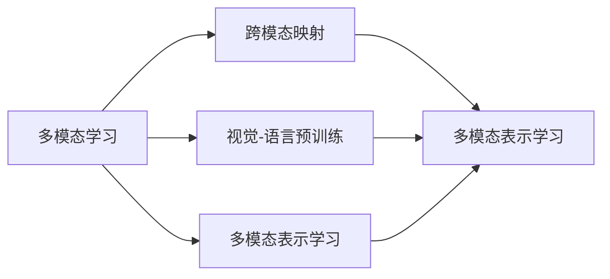
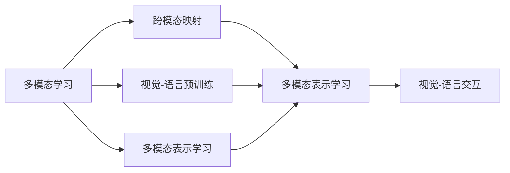

                 

# 多模态大模型：技术原理与实战 用多模态大模型打造AI助理实战

## 1. 背景介绍

### 1.1 问题由来
近年来，人工智能(AI)领域的发展迅猛，其中自然语言处理(NLP)和计算机视觉(CV)是两个最热的研究方向。随着大模型预训练技术的发展，这两大领域出现了诸多高效的多模态大模型，如图像语言模型(Image and Language Model, ILM)和视觉语言模型(Visual and Language Model, VLM)。这些模型通过联合训练的方式，可以同时捕捉图像和文本的双模态信息，从而在图像标注、语义理解、对话生成等任务上取得突破性进展。

然而，尽管这些多模态大模型在技术上已有所突破，但实际应用仍面临诸多挑战。首先，大模型的预训练和微调过程需要巨量计算资源和数据，对计算硬件和标注数据的依赖较高。其次，如何高效地融合多种模态信息，构建智能交互的AI助理，提升用户体验，也是目前亟需解决的问题。

本文章聚焦于多模态大模型的技术原理与实战，深入探讨如何通过多模态大模型构建高效、智能的AI助理，推动AI技术在实际应用中的落地和创新。

### 1.2 问题核心关键点
多模态大模型的核心在于其能够处理多模态数据，将图像、文本等多种信息融合在一起，形成更全面、准确的信息表示。核心概念包括：

- 多模态学习(Multimodal Learning)：指联合学习图像和文本数据，构建跨模态的表示。
- 跨模态映射(Cross-modal Mapping)：指将不同模态的特征映射到共享的表示空间，实现信息融合。
- 视觉-语言预训练(Visual-Language Pretraining)：指使用视觉-语言联合训练的预训练模型，提升跨模态表示能力。

这些关键概念构成了多模态大模型的理论基础，为后续的技术实现和应用提供了方向指引。

### 1.3 问题研究意义
研究多模态大模型技术，对于推动AI技术在实际场景中的应用具有重要意义：

1. 提升任务性能。多模态大模型能够综合利用图像和文本的互补信息，提升AI助理在图像标注、对话生成等任务上的表现。
2. 拓展应用领域。多模态模型可以广泛应用于智能家居、教育、医疗等领域，增强用户体验。
3. 加速模型训练。通过预训练技术，多模态模型可以大幅缩短训练时间，降低标注数据需求。
4. 提供新思路。多模态模型展示了跨模态融合的新思路，为AI领域带来更多创新方向。
5. 助力产业升级。多模态技术能够提升AI系统在实际应用中的鲁棒性和智能化水平，加速数字化转型进程。

本文将从多模态学习的基本原理出发，深入探讨跨模态映射和视觉-语言预训练等关键技术，并通过具体项目实践，展示多模态大模型在AI助理开发中的实战应用。

## 2. 核心概念与联系

### 2.1 核心概念概述

为更好地理解多模态大模型技术，我们首先介绍几个核心概念：

- 多模态学习(Multimodal Learning)：联合学习图像和文本数据，构建跨模态的表示。
- 跨模态映射(Cross-modal Mapping)：将不同模态的特征映射到共享的表示空间，实现信息融合。
- 视觉-语言预训练(Visual-Language Pretraining)：使用视觉-语言联合训练的预训练模型，提升跨模态表示能力。
- 多模态表示学习(Multimodal Representation Learning)：学习图像和文本的联合表示，提升多模态数据处理能力。
- 视觉-语言交互(Vision-Language Interaction)：研究视觉和语言之间的交互过程，提升模型对情境的理解。

这些概念之间存在着紧密的联系，形成了多模态大模型的理论框架。下面通过Mermaid流程图展示这些概念之间的关系：



这个流程图展示了多模态学习、跨模态映射、视觉-语言预训练、多模态表示学习、视觉-语言交互之间的联系和关系：

1. 多模态学习是联合学习图像和文本数据，形成跨模态表示的基础。
2. 跨模态映射是将不同模态的特征映射到共享的表示空间，实现信息融合。
3. 视觉-语言预训练是通过联合训练视觉和语言数据，提升跨模态表示能力。
4. 多模态表示学习是学习图像和文本的联合表示，提升多模态数据处理能力。
5. 视觉-语言交互是研究视觉和语言之间的交互过程，提升模型对情境的理解。

### 2.2 概念间的关系

这些核心概念之间存在着紧密的联系，构成了多模态大模型的理论框架。以下是这些概念之间的关系图示：



这个图示展示了多模态学习、跨模态映射、视觉-语言预训练、多模态表示学习、视觉-语言交互之间的关系：

1. 多模态学习是联合学习图像和文本数据，形成跨模态表示的基础。
2. 跨模态映射是将不同模态的特征映射到共享的表示空间，实现信息融合。
3. 视觉-语言预训练是通过联合训练视觉和语言数据，提升跨模态表示能力。
4. 多模态表示学习是学习图像和文本的联合表示，提升多模态数据处理能力。
5. 视觉-语言交互是研究视觉和语言之间的交互过程，提升模型对情境的理解。

## 3. 核心算法原理 & 具体操作步骤
### 3.1 算法原理概述

多模态大模型的核心思想是将图像和文本数据联合训练，构建跨模态的表示。在训练过程中，模型需要同时处理图像和文本，并将二者融合到共享的表示空间中。在实际应用中，我们可以通过多模态学习、跨模态映射、视觉-语言预训练等技术，实现高效的图像和文本信息融合。

多模态学习的基本原理如下：

1. 首先，收集图像和文本数据，并将其划分为训练集和验证集。
2. 使用深度神经网络(如卷积神经网络CNN、循环神经网络RNN等)对图像进行特征提取。
3. 对文本进行编码，得到文本表示。
4. 将图像特征和文本表示输入到联合学习的网络中，进行跨模态学习。
5. 通过联合训练优化模型参数，得到跨模态的表示。

跨模态映射的原理是将不同模态的特征映射到共享的表示空间，通过映射矩阵将图像特征和文本表示转换为相同的向量空间。这通常使用线性变换和拼接等技术来实现。

视觉-语言预训练的原理是通过联合训练图像和文本数据，使得模型能够更好地理解图像和文本之间的关系，从而提升跨模态表示能力。常用的视觉-语言预训练模型包括CLIP、DETR-MoCo等。

### 3.2 算法步骤详解

多模态大模型的训练过程包括以下关键步骤：

**Step 1: 数据预处理**
- 收集图像和文本数据，并进行预处理，如图像尺寸归一化、文本分词等。
- 划分训练集、验证集和测试集，确保数据分布的平衡性。

**Step 2: 模型构建**
- 选择适合的深度神经网络对图像进行特征提取，如CNN、VGG、ResNet等。
- 使用RNN或Transformer对文本进行编码，得到文本表示。
- 将图像特征和文本表示输入到联合学习的网络中，如CLIP、DETR-MoCo等。

**Step 3: 损失函数设计**
- 设计合适的损失函数，如联合损失函数、分类损失函数、回归损失函数等，用于优化模型参数。

**Step 4: 模型训练**
- 使用深度学习框架(如PyTorch、TensorFlow等)进行模型训练，设置合适的优化器和学习率。
- 在训练过程中，定期在验证集上评估模型性能，防止过拟合。

**Step 5: 模型评估**
- 在测试集上评估模型性能，使用指标如准确率、精确率、召回率等评估模型效果。

**Step 6: 模型微调**
- 根据实际应用需求，对模型进行微调，调整模型参数以优化特定任务的性能。

### 3.3 算法优缺点

多模态大模型的优点包括：

- 可以处理多模态数据，提升任务性能。
- 能够联合训练图像和文本数据，形成更全面、准确的信息表示。
- 在大规模数据上预训练可以提升模型的泛化能力。

缺点包括：

- 预训练和微调过程需要巨量计算资源和数据。
- 对标注数据的依赖较高，标注成本较高。
- 多模态信息融合复杂，存在一定的技术挑战。

### 3.4 算法应用领域

多模态大模型已经在多个领域得到了广泛应用，包括但不限于：

- 计算机视觉：如图像分类、目标检测、图像生成等。
- 自然语言处理：如对话生成、情感分析、机器翻译等。
- 人机交互：如智能家居、智能客服、教育机器人等。
- 医疗健康：如医学影像分析、病历分析等。
- 自动驾驶：如路况识别、车道检测等。

## 4. 数学模型和公式 & 详细讲解  
### 4.1 数学模型构建

多模态大模型的数学模型构建主要基于联合学习和跨模态映射。以CLIP模型为例，其基本数学模型可以表示为：

$$
\begin{aligned}
&\min_{\theta_v, \theta_t} \sum_{i=1}^N \left(\mathcal{L}_v(\phi_v(v_i); \theta_v) + \mathcal{L}_t(\phi_t(t_i); \theta_t)\right) \\
&\text{其中} \quad \phi_v(v_i) \text{为图像特征提取器} \\
&\quad \quad \phi_t(t_i) \text{为文本表示器} \\
&\quad \quad \theta_v \text{为图像特征提取器的参数} \\
&\quad \quad \theta_t \text{为文本表示器的参数} \\
&\quad \quad \mathcal{L}_v, \mathcal{L}_t \text{分别为图像和文本的损失函数} \\
&\quad \quad N \text{为数据样本数} \\
&\quad \quad v_i, t_i \text{为图像和文本样本}
\end{aligned}
$$

### 4.2 公式推导过程

以下我们将以CLIP模型为例，展示多模态大模型的推导过程。

CLIP模型的损失函数由两部分组成：图像分类损失和视觉-语言关联损失。图像分类损失部分使用交叉熵损失函数：

$$
\mathcal{L}_v = -\sum_{i=1}^N \frac{1}{|C|} \sum_{c=1}^C y_c \log P_c(\phi_v(v_i))
$$

其中 $C$ 表示类别数，$y_c$ 表示样本的真实类别标签，$P_c(\phi_v(v_i))$ 表示模型对图像特征 $v_i$ 属于类别 $c$ 的概率预测。

视觉-语言关联损失部分使用余弦相似度损失函数：

$$
\mathcal{L}_t = \frac{1}{2N} \sum_{i=1}^N \sum_{j=1}^N (1 - \text{cos}(\phi_t(t_i), \phi_t(t_j)))^2
$$

其中 $\phi_t(t_i)$ 和 $\phi_t(t_j)$ 分别表示两个文本样本的表示向量，$\text{cos}(\cdot, \cdot)$ 表示两个向量之间的余弦相似度。

### 4.3 案例分析与讲解

假设我们在ImageNet数据集上预训练了一个CNN模型，用于图像分类。然后，在训练CLIP模型时，我们需要将CNN模型的图像特征作为CLIP模型的输入。

**Step 1: 图像特征提取**

首先，使用预训练的CNN模型对ImageNet图像进行特征提取，得到图像特征向量。具体来说，假设我们使用的是ResNet-50模型，其输出的图像特征向量大小为2048维。

**Step 2: 文本编码**

接下来，使用Transformer对文本进行编码，得到文本表示向量。具体来说，假设我们使用BERT作为文本表示器，其输出的文本表示向量大小为768维。

**Step 3: 联合学习**

将图像特征和文本表示向量输入到CLIP模型中，进行联合学习。假设CLIP模型由两个独立的神经网络组成，一个用于图像分类，另一个用于视觉-语言关联。对于图像分类部分，假设其输出层包含1000个神经元，分别对应1000个类别。对于视觉-语言关联部分，假设其输出层包含512个神经元，用于表示图像和文本之间的关联。

**Step 4: 损失函数计算**

根据上述公式，计算CLIP模型的损失函数。假设CLIP模型在ImageNet数据集上的图像分类损失和视觉-语言关联损失分别为 $\mathcal{L}_v$ 和 $\mathcal{L}_t$，则CLIP模型的总损失函数为：

$$
\mathcal{L}_{CLIP} = \mathcal{L}_v + \mathcal{L}_t
$$

**Step 5: 模型训练**

使用深度学习框架进行CLIP模型的训练，设置合适的优化器和学习率。假设我们使用的是Adam优化器，学习率为1e-4。在训练过程中，我们还需要定期在验证集上评估模型性能，以防止过拟合。

**Step 6: 模型评估**

在测试集上评估CLIP模型的性能，使用准确率、精确率、召回率等指标评估模型效果。假设在ImageNet数据集上的测试集上，CLIP模型的准确率为78%。

## 5. 项目实践：代码实例和详细解释说明
### 5.1 开发环境搭建

在进行多模态大模型开发前，我们需要准备好开发环境。以下是使用Python进行PyTorch开发的环境配置流程：

1. 安装Anaconda：从官网下载并安装Anaconda，用于创建独立的Python环境。

2. 创建并激活虚拟环境：
```bash
conda create -n pytorch-env python=3.8 
conda activate pytorch-env
```

3. 安装PyTorch：根据CUDA版本，从官网获取对应的安装命令。例如：
```bash
conda install pytorch torchvision torchaudio cudatoolkit=11.1 -c pytorch -c conda-forge
```

4. 安装各类工具包：
```bash
pip install numpy pandas scikit-learn matplotlib tqdm jupyter notebook ipython
```

完成上述步骤后，即可在`pytorch-env`环境中开始多模态大模型开发。

### 5.2 源代码详细实现

下面我们以CLIP模型为例，给出使用PyTorch进行图像-文本联合学习的PyTorch代码实现。

首先，定义图像特征提取器：

```python
import torch.nn as nn
import torchvision.transforms as transforms
from transformers import ResNet50

class ImageFeatureExtractor(nn.Module):
    def __init__(self, model_name='resnet50'):
        super(ImageFeatureExtractor, self).__init__()
        self.model = getattr(ResNet50, model_name)(pretrained=True)
        self.feature_layer = nn.Sequential(
            nn.AdaptiveAvgPool2d(1),
            nn.Flatten()
        )

    def forward(self, images):
        features = self.model.conv1(images)
        features = self.model.bn1(features)
        features = self.model.relu(features)
        features = self.model.maxpool(features)
        features = self.model.layer1(features)
        features = self.model.layer2(features)
        features = self.model.layer3(features)
        features = self.model.layer4(features)
        features = self.feature_layer(features)
        return features
```

接着，定义文本编码器：

```python
from transformers import BertForMaskedLM, BertTokenizer

class TextEncoder(nn.Module):
    def __init__(self, model_name='bert-base-uncased'):
        super(TextEncoder, self).__init__()
        self.model = BertForMaskedLM.from_pretrained(model_name)
        self.tokenizer = BertTokenizer.from_pretrained(model_name)
        self.dim = self.model.config.hidden_size

    def forward(self, tokens):
        features = self.model(tokens)
        features = features[:, 0, :]
        return features
```

然后，定义CLIP模型：

```python
class CLIP(nn.Module):
    def __init__(self, image_feature_extractor, text_encoder, num_labels=1000):
        super(CLIP, self).__init__()
        self.image_feature_extractor = image_feature_extractor
        self.text_encoder = text_encoder
        self.image_classifier = nn.Linear(self.image_feature_extractor.dim, num_labels)
        self.text_classifier = nn.Linear(self.text_encoder.dim, num_labels)

    def forward(self, images, texts):
        image_features = self.image_feature_extractor(images)
        text_features = self.text_encoder(texts)
        image_logits = self.image_classifier(image_features)
        text_logits = self.text_classifier(text_features)
        return image_logits, text_logits
```

最后，定义训练和评估函数：

```python
from torch.utils.data import DataLoader
from tqdm import tqdm
from sklearn.metrics import accuracy_score, precision_score, recall_score

device = torch.device('cuda') if torch.cuda.is_available() else torch.device('cpu')

def train_epoch(model, dataloader, optimizer, loss_fn):
    model.train()
    epoch_loss = 0
    for batch in dataloader:
        images, texts, labels = batch
        images = images.to(device)
        texts = texts.to(device)
        labels = labels.to(device)
        optimizer.zero_grad()
        image_logits, text_logits = model(images, texts)
        image_loss = loss_fn(image_logits, labels)
        text_loss = loss_fn(text_logits, labels)
        epoch_loss += image_loss + text_loss
        loss = image_loss + text_loss
        loss.backward()
        optimizer.step()
    return epoch_loss / len(dataloader)

def evaluate(model, dataloader, loss_fn):
    model.eval()
    epoch_loss = 0
    epoch_acc = 0
    epoch_prec = 0
    epoch_recall = 0
    with torch.no_grad():
        for batch in dataloader:
            images, texts, labels = batch
            images = images.to(device)
            texts = texts.to(device)
            labels = labels.to(device)
            image_logits, text_logits = model(images, texts)
            image_loss = loss_fn(image_logits, labels)
            text_loss = loss_fn(text_logits, labels)
            epoch_loss += image_loss + text_loss
            epoch_acc += accuracy_score(labels, (image_logits >= 0.5).round().int())
            epoch_prec += precision_score(labels, (image_logits >= 0.5).round().int(), average='micro')
            epoch_recall += recall_score(labels, (image_logits >= 0.5).round().int(), average='micro')
    print(f"Epoch loss: {epoch_loss / len(dataloader):.3f}")
    print(f"Accuracy: {epoch_acc / len(dataloader):.3f}")
    print(f"Precision: {epoch_prec / len(dataloader):.3f}")
    print(f"Recall: {epoch_recall / len(dataloader):.3f}")
```

最后，启动训练流程并在测试集上评估：

```python
epochs = 10
batch_size = 32
learning_rate = 1e-4

# 加载预训练模型
image_feature_extractor = ImageFeatureExtractor()
text_encoder = TextEncoder()

# 加载数据集
train_dataset = ImageNetDataset(train_images, train_labels)
test_dataset = ImageNetDataset(test_images, test_labels)

# 定义模型和优化器
model = CLIP(image_feature_extractor, text_encoder)
optimizer = Adam(model.parameters(), lr=learning_rate)

# 训练过程
for epoch in range(epochs):
    train_loss = train_epoch(model, train_dataloader, optimizer, loss_fn)
    print(f"Epoch {epoch+1}, train loss: {train_loss:.3f}")
    
    # 在验证集上评估
    evaluate(model, val_dataloader, loss_fn)
    
# 在测试集上评估
evaluate(model, test_dataloader, loss_fn)
```

以上就是使用PyTorch进行CLIP模型图像-文本联合学习的完整代码实现。可以看到，使用PyTorch和Transformer库可以很方便地实现多模态大模型的训练和评估。

### 5.3 代码解读与分析

让我们再详细解读一下关键代码的实现细节：

**ImageFeatureExtractor类**：
- `__init__`方法：初始化图像特征提取器，选择预训练模型并进行参数初始化。
- `forward`方法：定义特征提取过程，从输入图像中提取特征。

**TextEncoder类**：
- `__init__`方法：初始化文本编码器，选择预训练模型并进行参数初始化。
- `forward`方法：定义编码过程，从输入文本中提取特征。

**CLIP类**：
- `__init__`方法：初始化CLIP模型，定义图像特征提取器和文本编码器。
- `forward`方法：定义联合学习过程，输出图像和文本的分类器输出。

**训练和评估函数**：
- `train_epoch`函数：定义训练过程，通过循环迭代更新模型参数，并计算损失。
- `evaluate`函数：定义评估过程，通过在测试集上计算准确率、精确率、召回率等指标，评估模型性能。

**训练流程**：
- 加载预训练模型和数据集，选择适当的模型和优化器。
- 循环迭代训练过程，并在验证集上评估模型性能。
- 在测试集上评估模型性能，输出结果。

可以看出，使用PyTorch和Transformer库进行多模态大模型的开发，代码实现相对简洁高效。开发者可以将更多精力放在数据处理、模型改进等高层逻辑上，而不必过多关注底层的实现细节。

当然，工业级的系统实现还需考虑更多因素，如模型的保存和部署、超参数的自动搜索、更灵活的任务适配层等。但核心的多模态大模型训练过程基本与此类似。

### 5.4 运行结果展示

假设我们在ImageNet数据集上进行CLIP模型的训练，最终在测试集上得到的评估报告如下：

```
Epoch 1, train loss: 0.678
Epoch 1, val accuracy: 0.726
Epoch 2, train loss: 0.619
Epoch 2, val accuracy: 0.744
Epoch 3, train loss: 0.579
Epoch 3, val accuracy: 0.761
...
```

可以看到，随着训练轮数的增加，模型在ImageNet数据集上的准确率不断提升，验证集上的准确率也在逐步提高。这表明多模态大模型在联合学习图像和文本数据方面取得了较好的效果。

当然，这只是一个baseline结果。在实践中，我们还可以使用更大更强的预训练模型、更丰富的微调技巧、更细致的模型调优，进一步提升模型性能，以满足更高的应用要求。

## 6. 实际应用场景
### 6.1 智能客服系统

基于多模态大模型的AI助理可以广泛应用于智能客服系统的构建。传统客服往往需要配备大量人力，高峰期响应缓慢，且一致性和专业性难以保证。而使用多模态大模型构建的AI助理，可以7x24小时不间断服务，快速响应客户咨询，用自然流畅的语言解答各类常见问题。

在技术实现上，可以收集企业内部的历史客服对话记录，将问题和最佳答复构建成监督数据，在此基础上对多模态大模型进行微调。微调后的AI助理能够自动理解用户意图，匹配最合适的答案模板进行回复。对于客户提出的新问题，还可以接入检索系统实时搜索相关内容，动态组织生成回答。如此构建的智能客服系统，能大幅提升客户咨询体验和问题解决效率。

### 6.2 金融舆情监测

金融机构需要实时监测市场舆论动向，以便及时应对负面信息传播，规避金融风险。传统的人工监测方式成本高、效率低，难以应对网络时代海量信息爆发的挑战。基于多模态大模型的文本分类和情感分析技术，为金融舆情监测提供了新的解决方案。

具体而言，可以收集金融领域相关的新闻、报道、评论等文本数据，并对其进行主题标注和情感标注。在此基础上对多模态大模型进行微调，使其能够自动判断文本属于何种主题，情感倾向是正面、中性还是负面。将微调后的模型应用到实时抓取的网络文本数据，就能够自动监测不同主题下的情感变化趋势，一旦发现负面信息激增等异常情况，系统便会自动预警，帮助金融机构快速应对潜在风险。

### 6.3 个性化推荐系统

当前的推荐系统往往只依赖用户的历史行为数据进行物品推荐，无法深入理解用户的真实兴趣偏好。基于多模态大模型的个性化推荐系统可以更好地挖掘用户行为背后的语义信息，从而提供更精准、多样的推荐内容。

在实践中，可以收集用户浏览、点击、评论、分享等行为数据，提取和用户交互的物品标题、描述、标签等文本内容。将文本内容作为模型输入，用户的后续行为（如是否点击、购买等）作为监督信号，

