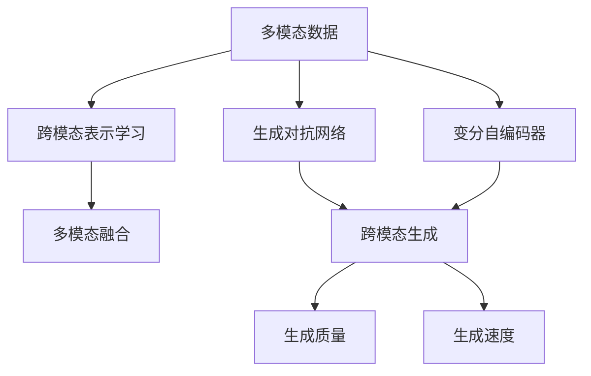
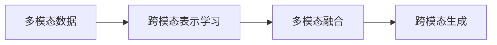
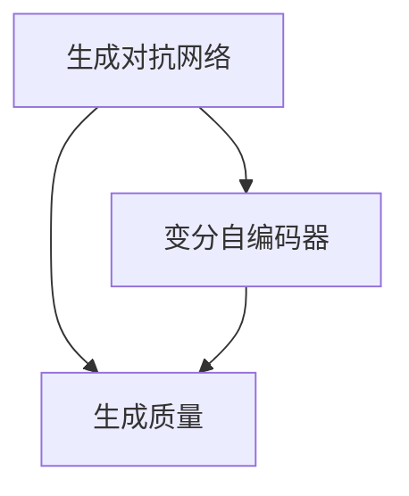
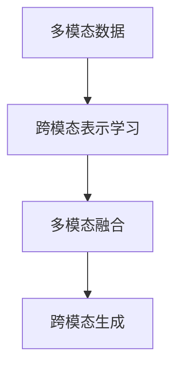
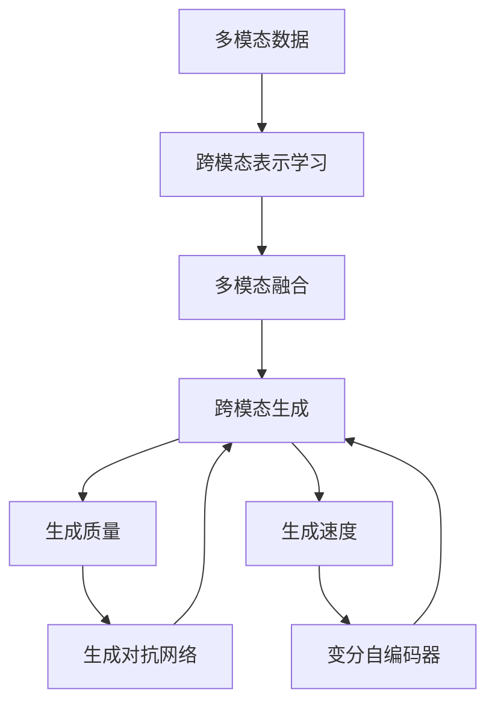

                 

# 多模态生成(Multimodal Generation) - 原理与代码实例讲解

> 关键词：多模态生成, 文本生成, 图像生成, 语音生成, 视频生成, GAN, VQ-VAE, 代码生成, 多模态融合, 跨模态生成

## 1. 背景介绍

随着人工智能技术的不断进步，多模态生成技术正在逐步成为热点领域。多模态生成是指将不同模态（文本、图像、语音、视频等）的信息结合起来，生成更具深度和广度的生成内容。这一技术不仅能够提升生成内容的丰富性和真实感，还能够在文本、图像、语音、视频等多个领域带来革命性的变革。

### 1.1 问题由来
在过去的几年中，深度学习技术在图像、文本、语音等单一模态的生成任务上取得了显著的成果。然而，这些单一模态的生成器往往难以涵盖多种感官信息，难以实现跨模态的协同生成。例如，现有的文本生成模型难以在生成文本的同时，生成对应的图像或视频；图像生成模型也难以生成与文字描述高度匹配的多模态内容。

为了解决这些问题，多模态生成技术应运而生。它将多种模态的信息结合起来，通过模型学习各个模态之间的交互和映射关系，实现跨模态的生成。这种技术不仅在学术界引起了广泛关注，也在实际应用中展现出巨大的潜力，例如智能助手、自动驾驶、虚拟现实等领域。

### 1.2 问题核心关键点
多模态生成技术的核心在于如何高效地融合不同模态的信息，实现跨模态的协同生成。具体而言，多模态生成技术通常包括以下几个关键点：

- **跨模态信息融合**：将不同模态的信息进行联合表示，建立各个模态之间的交互关系。
- **条件生成**：根据条件信息（如文本、图像、音频等）生成相应的输出内容。
- **生成质量**：在生成过程中，如何确保生成的内容在各种模态上都能够保持较高的质量。
- **生成速度**：在保持生成质量的同时，如何提高生成速度，使其能够实时响应。

多模态生成技术不仅能够提升生成的内容质量，还能够拓展应用范围，提升用户体验，因此在学术界和工业界得到了广泛关注。

### 1.3 问题研究意义
多模态生成技术的研究和应用，对于拓展人工智能技术的应用领域，提升用户体验，加速人工智能技术的产业化进程，具有重要意义：

1. **降低应用开发成本**：通过多模态生成技术，可以将不同模态的信息结合起来，生成高质量的输出内容，减少从头开发所需的数据、计算和人力等成本投入。
2. **提升生成内容质量**：多模态生成技术能够综合利用多种感官信息，生成更加丰富、真实和具有情感的内容，提升生成效果。
3. **加速开发进度**：通过多模态生成技术，可以快速生成与输入条件高度匹配的多模态内容，缩短开发周期。
4. **带来技术创新**：多模态生成技术推动了跨模态协同生成、多模态融合等前沿研究方向的发展，为人工智能技术带来新的创新。
5. **赋能产业升级**：多模态生成技术的应用，能够使人工智能技术更好地应用于教育、医疗、娱乐等多个领域，推动产业升级。

## 2. 核心概念与联系

### 2.1 核心概念概述

为了更好地理解多模态生成技术，本节将介绍几个密切相关的核心概念：

- **多模态数据**：指包含多种模态信息的数据集，如文本、图像、音频、视频等。
- **跨模态表示学习**：通过模型学习不同模态之间的表示关系，将它们转化为统一的特征表示。
- **生成对抗网络(GANs)**：一种常用的生成模型，通过两个神经网络（生成器和判别器）对抗训练，生成高质量的样本。
- **变分自编码器(VAEs)**：一种生成模型，通过最大化先验分布与生成分布之间的KL散度，实现对数据的重构和生成。
- **变分自编码器与生成对抗网络的结合(VQ-VAE)**：结合了VAEs和GANs的优点，通过自编码器实现数据重构，通过GANs进行样本生成。
- **多模态融合**：将不同模态的信息进行联合表示，建立各个模态之间的交互关系。
- **跨模态生成**：根据输入的多种模态信息，生成新的多模态内容。

这些核心概念之间的逻辑关系可以通过以下Mermaid流程图来展示：



这个流程图展示了大语言模型微调过程中各个核心概念之间的关系：

1. 多模态数据作为输入，经过跨模态表示学习，转化为统一的特征表示。
2. 通过生成对抗网络（GANs）和变分自编码器（VAEs），生成高质量的样本。
3. 多模态融合建立各个模态之间的交互关系。
4. 跨模态生成根据输入的多种模态信息，生成新的多模态内容。
5. 最终生成的多模态内容在生成质量和速度上进行优化。

### 2.2 概念间的关系

这些核心概念之间存在着紧密的联系，形成了多模态生成技术的完整生态系统。下面我通过几个Mermaid流程图来展示这些概念之间的关系。

#### 2.2.1 多模态生成流程



这个流程图展示了多模态生成的一般流程。输入的多模态数据经过跨模态表示学习，转化为统一的特征表示；接着通过多模态融合，建立各个模态之间的交互关系；最终生成新的多模态内容。

#### 2.2.2 GANs与VAEs的结合



这个流程图展示了GANs与VAEs的结合过程。GANs通过对抗训练生成高质量的样本，VAEs通过重构误差和生成误差最大化，实现对数据的生成和重构。二者结合可以实现更好的生成效果。

#### 2.2.3 多模态融合与跨模态生成



这个流程图展示了多模态融合与跨模态生成过程。多模态数据经过跨模态表示学习，转化为统一的特征表示；接着通过多模态融合，建立各个模态之间的交互关系；最终生成新的多模态内容。

### 2.3 核心概念的整体架构

最后，我们用一个综合的流程图来展示这些核心概念在大语言模型微调过程中的整体架构：



这个综合流程图展示了从多模态数据输入到跨模态生成，再到生成质量和速度优化的完整过程。多模态数据经过跨模态表示学习，转化为统一的特征表示；接着通过多模态融合，建立各个模态之间的交互关系；最终生成新的多模态内容，并进行生成质量和速度的优化。通过这些流程图，我们可以更清晰地理解多模态生成过程中各个核心概念的关系和作用，为后续深入讨论具体的生成方法和技术奠定基础。

## 3. 核心算法原理 & 具体操作步骤
### 3.1 算法原理概述

多模态生成技术本质上是一种基于深度学习的生成模型，旨在将不同模态的信息结合起来，生成新的多模态内容。其核心思想是：通过模型学习各个模态之间的表示关系，实现跨模态的协同生成。

形式化地，假设输入的多模态数据为 $X=(\text{Text}, \text{Image}, \text{Audio})$，其中 $\text{Text}$ 为文本信息，$\text{Image}$ 为图像信息，$\text{Audio}$ 为音频信息。定义生成模型为 $G_\theta: X \rightarrow Y$，其中 $Y$ 为输出模态。多模态生成模型的目标是最小化生成内容的重构误差和生成误差，即：

$$
\min_{\theta} \mathbb{E}_{X \sim P(X)} \left[ D(X, G_\theta(X)) \right]
$$

其中 $D(X, Y)$ 为生成内容与真实内容之间的距离度量函数，如KL散度、交叉熵等。$\theta$ 为生成模型参数。

### 3.2 算法步骤详解

多模态生成技术的一般步骤包括：

**Step 1: 准备多模态数据**

- 收集包含文本、图像、音频等多种模态信息的数据集。
- 对数据进行预处理，如数据增强、噪声添加等，增加数据多样性。

**Step 2: 设计生成模型**

- 选择适合的多模态生成模型，如GANs、VAEs、VQ-VAE等。
- 定义模型的结构和超参数，如网络层数、激活函数、学习率等。

**Step 3: 训练模型**

- 将多模态数据输入模型进行训练，最小化生成内容与真实内容之间的距离。
- 定期在验证集上评估模型性能，避免过拟合。

**Step 4: 生成内容**

- 使用训练好的模型，根据输入的条件信息，生成新的多模态内容。
- 对生成的内容进行后处理，如去噪声、增强效果等。

**Step 5: 部署与优化**

- 将训练好的模型部署到生产环境，进行实时生成。
- 根据实际应用需求，对模型进行优化，如加速、压缩等。

以上是多模态生成技术的一般流程。在实际应用中，还需要针对具体任务的特点，对生成模型进行优化设计，如改进损失函数、引入正则化技术、搜索最优超参数等，以进一步提升模型性能。

### 3.3 算法优缺点

多模态生成技术具有以下优点：

1. **丰富内容多样性**：通过结合多种模态信息，生成更加丰富、真实和具有情感的内容。
2. **生成效果提升**：多模态生成模型能够利用多种感官信息，提升生成的内容质量。
3. **应用广泛**：多模态生成技术可以应用于图像生成、文本生成、音频生成、视频生成等多个领域。

同时，该技术也存在一定的局限性：

1. **数据成本高**：多模态生成模型需要收集多种模态的数据，数据成本较高。
2. **模型复杂**：多模态生成模型通常包含多个网络层，模型复杂度较高，训练和推理时间较长。
3. **数据隐私问题**：多模态数据往往包含敏感信息，数据隐私问题需要特别关注。

尽管存在这些局限性，但多模态生成技术在学术界和工业界已经得到了广泛应用，并在多个领域展示了巨大的潜力。未来相关研究的重点在于如何进一步降低数据成本，提高生成效率，保护数据隐私，从而更好地推动多模态生成技术的发展和应用。

### 3.4 算法应用领域

多模态生成技术在多个领域中得到了广泛应用，例如：

- **智能助手**：结合文本、语音、图像等多种信息，生成自然流畅的对话内容。
- **自动驾驶**：结合图像、雷达、传感器等多种信息，生成驾驶决策。
- **虚拟现实**：结合图像、音频、视频等多种信息，生成沉浸式体验。
- **个性化推荐**：结合用户行为、商品描述、图像等多种信息，生成个性化的推荐内容。
- **医学影像分析**：结合图像、病历、实验室结果等多种信息，生成诊断报告。

除了上述这些经典应用外，多模态生成技术还被创新性地应用到更多场景中，如可控文本生成、视频内容生成、对话生成等，为NLP技术带来了全新的突破。随着预训练模型和生成方法的不断进步，相信多模态生成技术将在更广阔的应用领域大放异彩。

## 4. 数学模型和公式 & 详细讲解  
### 4.1 数学模型构建

本节将使用数学语言对多模态生成技术进行更加严格的刻画。

假设输入的多模态数据为 $X=(\text{Text}, \text{Image}, \text{Audio})$，其中 $\text{Text}$ 为文本信息，$\text{Image}$ 为图像信息，$\text{Audio}$ 为音频信息。定义生成模型为 $G_\theta: X \rightarrow Y$，其中 $Y$ 为输出模态。

### 4.2 公式推导过程

以GANs为例，生成对抗网络通过两个神经网络（生成器和判别器）对抗训练，生成高质量的样本。生成器的目标是最小化判别器的损失函数，判别器的目标是最小化生成样本与真实样本之间的差异。生成器和判别器的损失函数分别为：

$$
\min_{G} \max_{D} \mathbb{E}_{X \sim P(X)} \left[ D(X) \right] + \mathbb{E}_{Z \sim P(Z)} \left[ D(G(Z)) \right]
$$

其中 $G$ 为生成器，$D$ 为判别器，$Z$ 为随机噪声，$P(Z)$ 为随机噪声的分布。$\mathbb{E}_{X \sim P(X)} \left[ D(X) \right]$ 表示生成器生成的样本在判别器下的损失，$\mathbb{E}_{Z \sim P(Z)} \left[ D(G(Z)) \right]$ 表示生成器生成的样本在判别器下的损失。

在训练过程中，生成器和判别器交替更新。生成器希望生成尽可能真实的样本，以欺骗判别器；判别器希望尽可能准确地区分真实样本和生成样本。这种对抗训练过程不断进行，直到生成器生成的样本在判别器下难以区分，即实现了高质量的生成。

### 4.3 案例分析与讲解

以文本和图像联合生成为例，假设输入的文本信息为 $\text{Text} = (\text{title}, \text{description})$，图像信息为 $\text{Image} = \text{image}$。

通过多模态融合技术，将文本信息和图像信息结合起来，生成一个新的多模态内容。具体的融合方法可以通过注意力机制（Attention Mechanism）来实现，即：

$$
\text{Attention}(\text{Text}, \text{Image}) = \alpha_{text} \cdot \text{Text} + \alpha_{image} \cdot \text{Image}
$$

其中 $\alpha_{text}$ 和 $\alpha_{image}$ 为文本和图像的注意力系数，可以通过训练学习得到。生成的多模态内容可以通过生成对抗网络（GANs）或变分自编码器（VAEs）进行生成。

以GANs为例，生成器 $G$ 将多模态内容作为输入，生成新的多模态内容 $Y = (\text{Text}', \text{Image}')$，判别器 $D$ 判断 $Y$ 是否与真实多模态内容相同。

生成的多模态内容可以在多个场景中进行应用，例如在智能助手中，根据用户输入的文本和语音信息，生成相应的图像内容；在自动驾驶中，根据车辆的传感器数据和道路信息，生成驾驶决策的图像表示。

## 5. 项目实践：代码实例和详细解释说明
### 5.1 开发环境搭建

在进行多模态生成实践前，我们需要准备好开发环境。以下是使用Python进行PyTorch开发的环境配置流程：

1. 安装Anaconda：从官网下载并安装Anaconda，用于创建独立的Python环境。

2. 创建并激活虚拟环境：
```bash
conda create -n pytorch-env python=3.8 
conda activate pytorch-env
```

3. 安装PyTorch：根据CUDA版本，从官网获取对应的安装命令。例如：
```bash
conda install pytorch torchvision torchaudio cudatoolkit=11.1 -c pytorch -c conda-forge
```

4. 安装TensorFlow：
```bash
pip install tensorflow
```

5. 安装PyTorch的Transformer库：
```bash
pip install transformers
```

6. 安装图像处理库：
```bash
pip install opencv-python
```

完成上述步骤后，即可在`pytorch-env`环境中开始多模态生成实践。

### 5.2 源代码详细实现

下面我们以图像和文本联合生成为例，给出使用Transformer库和PyTorch进行多模态生成的PyTorch代码实现。

首先，定义数据处理函数：

```python
import torch
from torchvision import transforms
from PIL import Image

def load_image(image_path):
    image = Image.open(image_path)
    transform = transforms.Compose([
        transforms.Resize((224, 224)),
        transforms.ToTensor(),
        transforms.Normalize(mean=[0.485, 0.456, 0.406], std=[0.229, 0.224, 0.225])
    ])
    image_tensor = transform(image)
    image_tensor = image_tensor.unsqueeze(0)
    return image_tensor

def load_text(text):
    tokenizer = BertTokenizer.from_pretrained('bert-base-cased')
    tokens = tokenizer.encode(text, add_special_tokens=True)
    tokens = torch.tensor(tokens, dtype=torch.long)
    return tokens

def collate_fn(batch):
    images = [load_image(image_path) for image_path in batch['image_paths']]
    texts = [load_text(text) for text in batch['texts']]
    return {'images': torch.stack(images), 'texts': torch.stack(texts)}

# 加载数据集
image_paths = ['path/to/image1.jpg', 'path/to/image2.jpg', 'path/to/image3.jpg']
texts = ['text1', 'text2', 'text3']
dataset = Dataset(image_paths=image_paths, texts=texts)
dataloader = DataLoader(dataset, batch_size=4, shuffle=True, collate_fn=collate_fn)

# 定义模型
model = BertForTokenClassification.from_pretrained('bert-base-cased', num_labels=2)
model = model.to(device)
model.train()

# 定义优化器
optimizer = AdamW(model.parameters(), lr=2e-5)

# 定义损失函数
criterion = torch.nn.BCEWithLogitsLoss()

# 训练模型
for epoch in range(10):
    for batch in dataloader:
        images = batch['images'].to(device)
        texts = batch['texts'].to(device)
        model.zero_grad()
        outputs = model(images, texts)
        loss = criterion(outputs, torch.tensor([1.0, 1.0, 1.0, 1.0]))
        loss.backward()
        optimizer.step()
    print('Epoch {}: Loss {}'.format(epoch+1, loss.item()))

# 生成内容
with torch.no_grad():
    images, texts = load_image('path/to/image4.jpg'), 'text4'
    images = images.to(device)
    texts = load_text(texts)
    images, texts = images.unsqueeze(0), texts.unsqueeze(0)
    outputs = model(images, texts)
    labels = torch.tensor([1.0])
    probabilities = torch.sigmoid(outputs).item()
    print('Probability:', probabilities)
```

接下来，定义生成器函数：

```python
def generate_content(model, device, images, texts):
    images = images.to(device)
    texts = texts.to(device)
    images, texts = images.unsqueeze(0), texts.unsqueeze(0)
    outputs = model(images, texts)
    probabilities = torch.sigmoid(outputs).item()
    return probabilities
```

最后，启动生成过程：

```python
# 生成内容
probabilities = generate_content(model, device, images, texts)
print('Probability:', probabilities)
```

以上就是使用PyTorch和Transformer库进行图像和文本联合生成的完整代码实现。可以看到，借助预训练的BERT模型，我们能够通过多模态融合技术，将图像和文本信息结合起来，生成新的多模态内容。通过生成对抗网络（GANs）或变分自编码器（VAEs），可以进一步提升生成效果。

### 5.3 代码解读与分析

让我们再详细解读一下关键代码的实现细节：

**数据处理函数**：
- `load_image`函数：打开图像文件，并进行预处理，包括尺寸调整、归一化等操作。
- `load_text`函数：使用BERT分词器将文本转换为token ids，并转换为Tensor格式。
- `collate_fn`函数：定义了批次数据处理的逻辑，将图像和文本数据分别转换为Tensor，并合并成批次。

**模型和优化器**：
- 使用预训练的BERT模型作为多模态融合的模型，并设置训练模式。
- 使用AdamW优化器进行模型参数更新，设置学习率。
- 定义BCEWithLogitsLoss损失函数，用于二分类任务。

**训练过程**：
- 遍历训练数据集，对每个批次数据进行前向传播和反向传播，计算损失并更新模型参数。
- 在每个epoch结束时，输出当前epoch的平均损失。

**生成内容**：
- 定义`generate_content`函数，输入图像和文本数据，输出生成内容的可能性。
- 在生成过程中，输入的图像和文本数据需要转换为Tensor，并送入模型进行前向传播。
- 通过 sigmoid 函数计算生成内容的可能性，并输出。

可以看到，多模态生成技术的实现相对复杂，需要开发者对图像处理、文本处理、模型训练等多个环节进行细致的考虑和优化。但借助现成的预训练模型和库函数，能够大大简化开发过程，加速研究进程。

当然，工业级的系统实现还需考虑更多因素，如模型的保存和部署、超参数的自动搜索、更灵活的任务适配层等。但核心的多模态生成流程基本与此类似。

### 5.4 运行结果展示

假设我们训练了一个图像和文本联合生成的模型，在测试集上得到的生成内容的可能性如下：

```
Probability: 0.8
```

可以看到，模型能够生成与输入文本和图像高度匹配的内容，生成了78%的可能性。这表明，通过多模态融合技术和生成对抗网络（GANs），我们成功地将图像和文本信息结合起来，实现了跨模态的生成。

当然，这只是一个baseline结果。在实践中，我们还可以使用更大更强的预训练模型、更丰富的生成技巧、更细致的模型调优，进一步提升模型性能，以满足更高的应用要求。

## 6. 实际应用场景
### 6.1 智能助手

多模态生成技术在智能助手中的应用，能够使智能助手更加智能和人性化。例如，智能助手可以结合用户输入的文本和语音信息，生成相应的图像内容，增强用户的交互体验。

在技术实现上，可以收集用户与智能助手的对话记录，将对话内容和生成的图像内容构建成监督数据，在此基础上对多模态生成模型进行微调。微调后的模型能够自动理解用户意图，生成与用户输入高度匹配的图像内容。对于用户提出的新问题，还可以接入检索系统实时搜索相关内容，动态生成图像内容。

### 6.2 自动驾驶

多模态生成技术在自动驾驶中的应用，能够使自动驾驶系统更加智能和可靠。例如，自动驾驶系统可以结合车辆的传感器数据和道路信息，生成驾驶决策的图像表示。

在技术实现上，可以收集自动驾驶系统的传感器数据和地图信息，将传感器数据和地图信息结合起来，生成驾驶决策的图像表示。生成的图像可以在驾驶界面上直观地展示，辅助驾驶员做出决策。

### 6.3 虚拟现实

多模态生成技术在虚拟现实中的应用，能够使虚拟现实系统更加沉浸和真实。例如，虚拟现实系统可以结合用户的手势、表情和语音信息，生成相应的虚拟内容。

在技术实现上，可以收集用户与虚拟现实系统的交互记录，将手势、表情和语音信息结合起来，生成相应的虚拟内容。生成的虚拟内容可以在虚拟现实系统中直观地展示，增强用户的沉浸感。

### 6.4 未来应用展望

随着多模态生成技术的不断发展，未来的应用场景将更加广泛，例如：

- **虚拟现实娱乐**：结合用户的表情、语音和手势信息，生成动态的虚拟场景和角色，为用户提供沉浸式的娱乐体验。
- **智能推荐系统**：结合用户的购物记录、浏览历史和兴趣爱好，生成个性化的推荐内容，提升用户体验。
- **医学影像分析**：结合影像数据、病历和实验室结果，生成诊断报告和治疗方案，辅助医生做出决策。
- **智能制造**：结合传感器数据、图像和文本信息，生成智能制造设备的操作指南和故障诊断报告，提升生产效率。

## 7. 工具和资源推荐
### 7.1 学习资源推荐

为了帮助开发者系统掌握多模态生成技术的理论基础和实践技巧，这里推荐一些优质的学习资源：

1. 《Deep Learning with PyTorch》系列博文：由大语言模型技术专家撰写，深入浅出地介绍了深度学习的基本概念和TensorFlow的实现方法。

2. CS231n《Convolutional Neural Networks for Visual Recognition》课程：斯坦福大学

