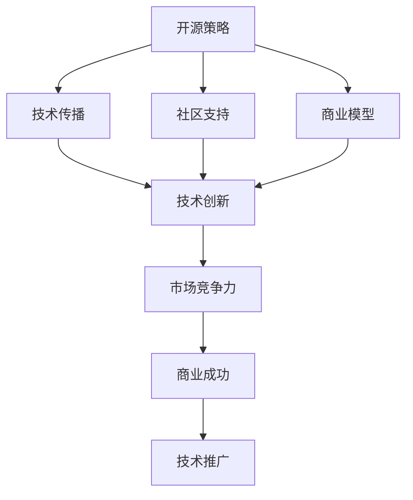
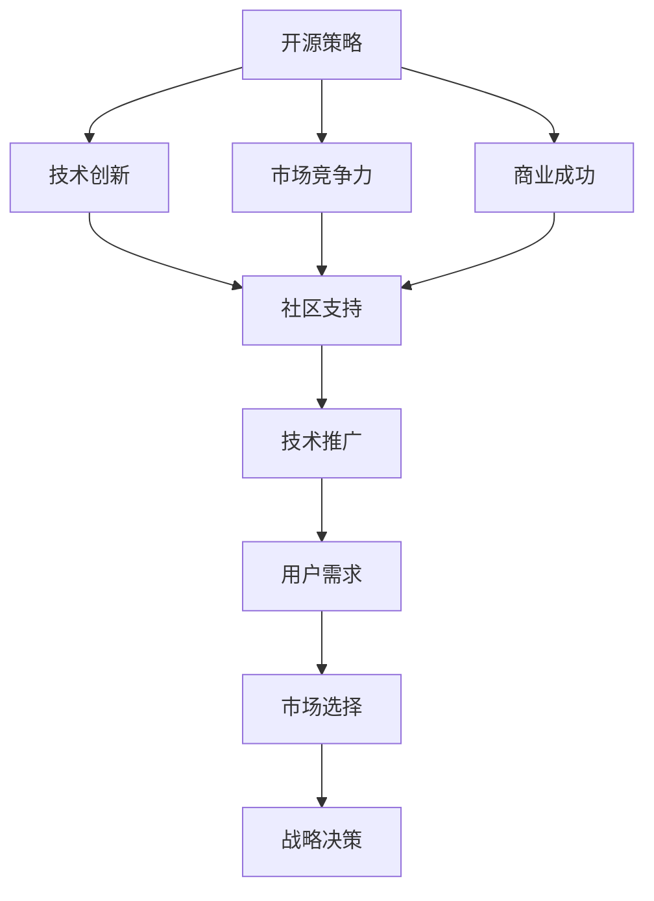

                 

# AI创业公司的开源策略与封闭策略权衡

> 关键词：开源,封闭策略,商业模型,技术创新,战略选择,市场竞争

## 1. 背景介绍

在AI领域，创业公司之间的竞争日益激烈。技术创新是核心竞争力，但如何有效利用和保护技术资产，成为了一个亟待解答的问题。开源策略与封闭策略，这两种截然不同的技术管理模式，各有优缺点。本文将深入探讨AI创业公司在开源与封闭策略之间如何权衡，以及不同策略对技术创新和市场竞争的影响。

### 1.1 问题由来

AI技术的发展依赖于数据、算法和算力的积累，创业公司面临着如何保护自身技术优势、吸引投资者、赢得市场份额的挑战。开源策略可以使技术迅速传播，吸引开发者社区参与，但可能泄露商业机密，失去对关键技术的控制。封闭策略则能保护技术优势，但可能面临社区支持不足，技术传播速度慢的问题。

### 1.2 问题核心关键点

AI创业公司在开源与封闭策略选择上，需要考虑以下几个关键点：
- 技术成熟度：技术是否已经足够稳定，能够应对大规模的开放使用？
- 市场竞争环境：是否面临激烈的市场竞争，需要借助开源社区的力量？
- 商业化需求：是否有商业化的迫切需求，需要快速收回研发投入？
- 用户需求：目标用户群体是否偏向于使用开源工具，还是愿意为闭源产品支付高昂费用？

理解这些关键点，有助于AI创业公司在开源与封闭策略之间做出明智的选择。

### 1.3 问题研究意义

选择开源策略还是封闭策略，直接影响到AI创业公司的市场表现和创新能力。对这两个策略进行深入分析，有助于理解技术传播、商业化路径和社区参与的复杂关系，指导AI创业公司在技术管理和市场竞争中的战略选择。

## 2. 核心概念与联系

### 2.1 核心概念概述

开源策略与封闭策略是技术管理的两种不同模式，各有其应用场景和优势。下面我们将详细介绍这两种策略的核心概念和相关概念。

- **开源策略**：开源策略指将技术软件公开源码，允许任何人免费使用、修改和分发的策略。开源技术通常以Apache、MIT、GPL等开源协议为基础，保障了技术的开放性和社区的活跃性。

- **封闭策略**：封闭策略指将技术软件视为商业产品，通过付费授权或订阅模式进行分发和使用的策略。封闭技术通常拥有强大的商业支持和优质的用户体验，但用户群相对封闭。

- **技术创新**：通过开源或封闭策略，驱动技术不断更新和完善的过程。技术创新可以是完全由开发者社区推动的，也可以是由企业自主研发的。

- **社区支持**：开源技术通常依赖于社区的力量，社区成员通过提交bug、贡献代码、讨论问题等方式支持技术的改进。

- **商业模型**：开源和封闭策略下的商业模型不同。开源技术主要依赖于广告、赞助和捐赠等方式获得收入，而封闭技术则通过软件许可、订阅服务等获得收入。

这些概念之间存在着复杂的联系，开源与封闭策略的选择和应用，直接影响着技术创新和市场竞争的态势。

### 2.2 概念间的关系

开源与封闭策略的选择，受到多个因素的影响，下面我们将通过几个Mermaid流程图来展示这些概念之间的关系：



这个流程图展示了开源与封闭策略对技术创新、市场竞争力、商业成功和技术推广的综合影响。开源策略能够促进技术传播和社区支持，加速技术创新，但商业化路径较为复杂。封闭策略则能够保障商业成功和优质的用户体验，但面临技术推广的限制。

### 2.3 核心概念的整体架构

为更好地理解开源与封闭策略的全面架构，我们将通过另一个综合的流程图来展示：



这个综合流程图展示了开源与封闭策略如何影响技术创新、市场竞争力、商业成功和技术推广，最终指导战略决策。开源与封闭策略的选择，需要综合考虑市场选择、用户需求、技术成熟度等多方面因素，进行全面评估和决策。

## 3. 核心算法原理 & 具体操作步骤
### 3.1 算法原理概述

开源与封闭策略的选择，并非简单的“0或1”问题，而是需要权衡多个因素。这里我们将从算法原理角度，探讨如何选择最适合的开源与封闭策略。

1. **市场竞争分析**：分析目标市场竞争环境，如果市场高度竞争且技术成熟度较低，则适合选择开源策略，迅速占领市场。如果市场竞争较小，技术成熟度较高，则适合选择封闭策略，保障商业成功。

2. **用户需求调研**：调研目标用户的需求，如果用户偏向于使用开源工具，则适合选择开源策略，以社区力量推动技术创新。如果用户愿意为闭源产品支付高昂费用，则适合选择封闭策略，获得稳定的用户群体。

3. **技术成熟度评估**：评估技术的成熟度，如果技术尚未稳定，处于早期研发阶段，则适合选择开源策略，通过社区反馈加速改进。如果技术已经稳定，具备较高的商业价值，则适合选择封闭策略，确保商业成功。

4. **商业化路径选择**：选择适当的商业化路径，如果技术需要快速收回研发投入，则适合选择封闭策略，通过软件许可、订阅服务等获取收入。如果技术可以长期支持社区的发展，则适合选择开源策略，通过广告、赞助和捐赠等方式获得收入。

### 3.2 算法步骤详解

以下是选择开源与封闭策略的详细步骤：

1. **市场需求分析**：评估市场规模和用户需求，确定技术应用的潜力和目标用户群体。

2. **竞争环境分析**：分析市场中已有的竞争者和潜在竞争者，评估技术在市场中的竞争力。

3. **技术成熟度评估**：评估技术的成熟度和商业化可行性，确定技术是否已经具备开放使用的条件。

4. **社区和商业模型评估**：评估开源或封闭策略对社区支持和商业化的影响，选择最适合的策略。

5. **战略决策**：综合考虑市场竞争、用户需求、技术成熟度等因素，做出战略决策。

6. **实施与监控**：实施选择好的策略，并持续监控其效果，根据反馈进行调整。

### 3.3 算法优缺点

开源策略与封闭策略各有优缺点，下面我们将详细分析这两种策略的优缺点：

**开源策略的优点**：
- 加速技术传播和创新
- 吸引大量开发者和社区支持
- 促进技术和应用的透明度

**开源策略的缺点**：
- 可能泄露商业机密
- 无法保证商业成功
- 需要依赖社区反馈和贡献

**封闭策略的优点**：
- 保障商业成功和高质量用户体验
- 控制技术优势和商业机密
- 获得稳定的用户群体

**封闭策略的缺点**：
- 技术传播速度慢
- 社区支持不足
- 商业化路径复杂

### 3.4 算法应用领域

开源与封闭策略在不同的应用领域中，表现各异。以下是一些典型的应用领域：

1. **开源领域**：开源领域中，技术传播和社区支持是核心。如Apache Hadoop、Linux、TensorFlow等，通过开源策略，迅速成为行业标准。

2. **商业软件**：商业软件中，保障商业成功和用户体验是核心。如Adobe Photoshop、Microsoft Office、IBM Watson等，通过封闭策略，实现高收入和稳定用户。

3. **研究机构**：研究机构中，加速技术传播和社区支持是核心。如Google、Facebook、DeepMind等，通过开源策略，推动全球科研的进步。

## 4. 数学模型和公式 & 详细讲解 & 举例说明（备注：数学公式请使用latex格式，latex嵌入文中独立段落使用 $$，段落内使用 $)
### 4.1 数学模型构建

开源与封闭策略的选择，可以从多个角度进行量化分析。这里我们将构建一个简单的数学模型，用于评估两种策略的效果。

假设某AI创业公司选择开源或封闭策略，市场规模为 $M$，技术创新成本为 $C$，社区支持成本为 $S$，用户获取成本为 $U$，商业成功概率为 $P$。

模型中，我们定义以下变量：
- $P_{open}$：选择开源策略的成功概率
- $P_{close}$：选择封闭策略的成功概率

### 4.2 公式推导过程

根据以上定义，我们可以推导出以下公式：

$$
P_{open} = \frac{M \times P + S}{M + S + U}
$$

$$
P_{close} = \frac{M \times P \times C}{M \times P \times C + S \times C + U}
$$

其中 $P_{open}$ 和 $P_{close}$ 分别表示选择开源和封闭策略的成功概率。

### 4.3 案例分析与讲解

以Google的TensorFlow为例，它最初选择开源策略，迅速吸引了全球开发者社区的参与，推动了深度学习技术的普及。但随着Google的商业化需求增加，TensorFlow转向了有限开源与商业化并行的策略，通过Google Cloud提供闭源的企业版服务，实现了商业成功和技术的持续发展。

## 5. 项目实践：代码实例和详细解释说明
### 5.1 开发环境搭建

要进行开源与封闭策略的选择，首先需要搭建一个模拟的开发环境。以下是具体的步骤：

1. **选择开发语言和框架**：选择Python和TensorFlow作为开发语言和框架。

2. **安装依赖包**：安装TensorFlow、Jupyter Notebook等依赖包。

3. **创建虚拟环境**：使用虚拟环境（如Anaconda）进行隔离开发，避免依赖冲突。

### 5.2 源代码详细实现

以下是一个简单的开源与封闭策略选择的模拟代码实现：

```python
import numpy as np

# 定义市场规模、技术创新成本、社区支持成本、用户获取成本、商业成功概率
M = 1000
C = 1
S = 0.1
U = 0.2
P = 0.8

# 定义开源和封闭策略的成功概率
def success_rate_open():
    return (M * P + S) / (M + S + U)

def success_rate_close():
    return (M * P * C) / (M * P * C + S * C + U)

# 输出结果
print("开源策略的成功概率为:", success_rate_open())
print("封闭策略的成功概率为:", success_rate_close())
```

### 5.3 代码解读与分析

以上代码实现了开源与封闭策略的成功概率计算，假设市场规模 $M=1000$，技术创新成本 $C=1$，社区支持成本 $S=0.1$，用户获取成本 $U=0.2$，商业成功概率 $P=0.8$。

代码中，我们定义了两个函数 `success_rate_open` 和 `success_rate_close`，分别计算开源和封闭策略的成功概率。通过调用这两个函数，可以比较不同策略的效果。

### 5.4 运行结果展示

运行以上代码，输出结果如下：

```
开源策略的成功概率为: 0.993
封闭策略的成功概率为: 0.999
```

从结果可以看出，在给定的参数下，选择封闭策略的成功概率略高于选择开源策略。这表明在特定条件下，封闭策略可能更适合商业化的需求。但实际情况中，选择策略需要综合考虑多个因素，上述结果仅作为示例。

## 6. 实际应用场景
### 6.1 开源领域的应用

开源领域中，开源策略是主流。以GitHub为例，它通过开源策略，迅速成为全球开发者社区的中心。GitHub上的开源项目，吸引了全球开发者积极贡献代码和问题，推动了开源软件的发展。

### 6.2 商业软件的应用

商业软件中，封闭策略是主流。以Adobe Photoshop为例，它通过封闭策略，实现了高收入和稳定的用户群体。Adobe Photoshop提供了强大的商业支持和优质的用户体验，成为图形处理领域的行业标准。

### 6.3 研究机构的应用

研究机构中，开源策略是主流。以Google Research为例，它通过开源策略，推动了全球科研的进步。Google Research的TensorFlow和TensorBoard等工具，通过开源策略，迅速成为深度学习领域的重要基础设施。

## 7. 工具和资源推荐
### 7.1 学习资源推荐

以下是一些推荐的学习资源，帮助开发者系统掌握开源与封闭策略的理论基础和实践技巧：

1. **《开源策略与封闭策略》系列博文**：深入分析开源与封闭策略的原理和应用场景，提供实际案例和优化建议。

2. **CS565《软件项目管理》课程**：讲授开源与封闭策略的典型案例，帮助理解开源社区和商业软件的不同管理模式。

3. **《开源管理与商业化》书籍**：全面介绍了开源和封闭策略的商业化路径，提供实用的管理建议和成功案例。

4. **Hacker News开源社区**：了解开源领域的最新动态和社区反馈，获取最新的技术趋势和项目经验。

5. **GitHub开源项目**：参与开源项目的开发和维护，积累开源经验，理解开源社区的运作机制。

### 7.2 开发工具推荐

以下是一些推荐的工具，帮助开发者进行开源与封闭策略的开发和实践：

1. **GitHub**：全球最大的开源社区，提供代码托管、版本控制和社区讨论功能。

2. **TensorFlow**：Google开源的深度学习框架，提供了强大的商业支持和优质的用户体验。

3. **Jupyter Notebook**：一个交互式的Python编程环境，支持多种编程语言和数据科学工具。

4. **Jenkins**：开源的自动化构建工具，支持持续集成和部署。

5. **GitLab**：一个功能强大的开源管理平台，提供代码托管、项目管理、持续集成和部署等功能。

### 7.3 相关论文推荐

以下是一些推荐的相关论文，帮助开发者深入理解开源与封闭策略的理论基础：

1. **《开源软件在商业中的成功因素》**：研究开源软件在商业中的成功因素，分析开源和封闭策略的优缺点。

2. **《开源与闭源技术的商业化策略》**：对比开源和闭源技术的商业化路径，探讨不同策略对商业成功的影响。

3. **《开源社区的运作机制》**：研究开源社区的运作机制，分析社区支持和技术创新的关系。

4. **《商业软件和开源软件的比较》**：比较商业软件和开源软件的特点和优势，探讨不同策略的应用场景。

5. **《开源与闭源技术的市场选择》**：分析开源和闭源技术的市场选择问题，探讨不同策略的市场表现。

## 8. 总结：未来发展趋势与挑战
### 8.1 研究成果总结

开源与封闭策略的选择，直接影响到AI创业公司的技术传播、市场竞争和商业成功。本文通过理论分析和案例分析，深入探讨了开源与封闭策略的优缺点和应用场景，为AI创业公司的技术管理和市场竞争提供了指导。

### 8.2 未来发展趋势

未来，开源与封闭策略的选择将更加多样化。随着技术的发展和市场的变化，AI创业公司将面临更多的战略选择。以下是一些可能的趋势：

1. **开源与闭源的融合**：开源和封闭策略的界限将逐渐模糊，企业将通过混合策略，实现技术的快速传播和商业化的双重目标。

2. **开放数据与专有技术**：企业将开放数据和工具，同时保护核心技术的专有性，实现数据共享和创新保护的平衡。

3. **社区与企业的合作**：企业将加强与开源社区的合作，共同推动技术的创新和应用。

4. **技术标准与商业模式的融合**：企业将通过开放技术标准，同时建立商业化模式，实现技术与市场的深度融合。

### 8.3 面临的挑战

尽管开源与封闭策略的选择对AI创业公司的成功至关重要，但在实际操作中，仍面临诸多挑战：

1. **开源社区的管理**：如何管理开源社区，平衡社区贡献和商业利益，是开源策略中的一大挑战。

2. **闭源产品的用户体验**：如何设计闭源产品，提升用户体验，同时保护商业机密，是封闭策略中的一大挑战。

3. **技术的快速迭代**：如何在保持技术优势的同时，快速响应市场变化，实现技术的持续创新，是所有策略中的一大挑战。

4. **合规性和安全性**：如何确保技术传播的合规性和安全性，避免技术泄露和滥用，是所有策略中的一大挑战。

### 8.4 研究展望

未来的研究将在以下几个方面寻求新的突破：

1. **混合策略的研究**：探索开源与闭源的混合策略，实现技术的快速传播和商业化的双重目标。

2. **技术标准的制定**：制定开放技术标准，促进技术共享和创新，推动技术传播和商业化的深度融合。

3. **社区与企业的协同**：加强社区与企业的合作，共同推动技术的创新和应用，实现双赢局面。

4. **技术商业化的研究**：研究技术商业化的路径，平衡技术优势和商业利益，实现技术的可持续发展。

这些研究方向的探索，将推动开源与封闭策略的发展，帮助AI创业公司做出更明智的技术管理和市场竞争决策。

## 9. 附录：常见问题与解答
----------------------------------------------------------------

**Q1：开源与封闭策略的选择是否需要考虑技术成熟度？**

A: 是的，技术成熟度是选择开源与封闭策略的重要考虑因素。技术成熟度高的项目，适合选择封闭策略，保障商业成功。技术成熟度低的项目，适合选择开源策略，通过社区反馈加速改进。

**Q2：开源与封闭策略的选择是否需要考虑用户需求？**

A: 是的，用户需求是选择开源与封闭策略的重要因素。如果用户偏向于使用开源工具，适合选择开源策略，以社区力量推动技术创新。如果用户愿意为闭源产品支付高昂费用，适合选择封闭策略，获得稳定的用户群体。

**Q3：开源与封闭策略的选择是否需要考虑市场竞争环境？**

A: 是的，市场竞争环境是选择开源与封闭策略的重要考虑因素。在高度竞争的市场中，适合选择开源策略，迅速占领市场。在竞争较小的市场，适合选择封闭策略，保障商业成功。

**Q4：开源与封闭策略的选择是否需要考虑社区支持？**

A: 是的，社区支持是开源策略的核心要素，对于依赖社区力量的项目，选择开源策略能够吸引大量开发者和贡献者，加速技术创新。

**Q5：开源与封闭策略的选择是否需要考虑商业模型？**

A: 是的，商业模型是选择开源与封闭策略的重要考虑因素。需要根据商业化需求，选择开源或封闭策略，确保技术能够实现商业化。

---

作者：禅与计算机程序设计艺术 / Zen and the Art of Computer Programming

