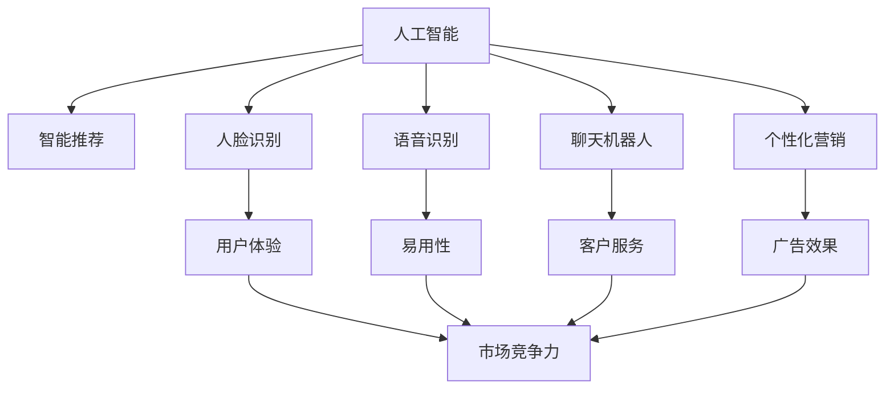
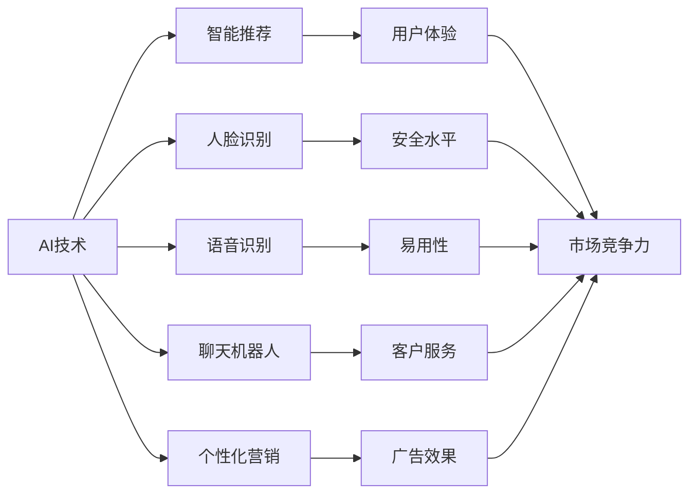
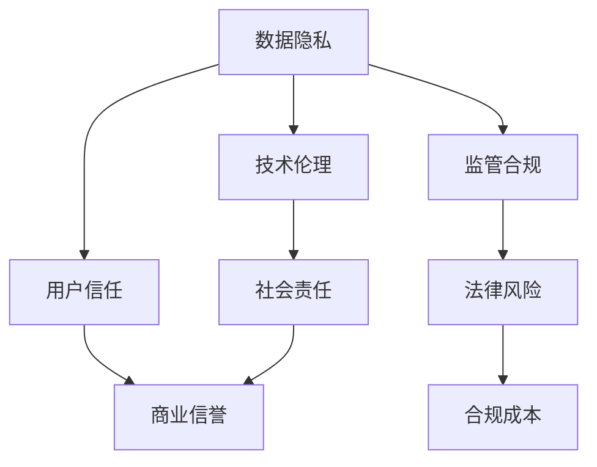

                 

# AI技术在消费市场中的前景

> 关键词：人工智能,消费者市场,应用场景,技术趋势,创新驱动,未来展望

## 1. 背景介绍

### 1.1 问题由来

随着人工智能（AI）技术的不断成熟和普及，AI技术已经逐渐渗透到各行各业，其中消费市场是AI技术应用最活跃、影响最深远的领域之一。AI技术在消费市场中的应用不仅提升了消费体验，还推动了商业模式创新，促进了经济增长。然而，尽管AI技术在消费市场中的应用前景广阔，但其发展过程中也面临诸多挑战，例如数据隐私保护、技术伦理等问题。

### 1.2 问题核心关键点

AI技术在消费市场中的应用场景主要包括智能推荐、人脸识别、语音识别、聊天机器人、个性化营销等。这些应用不仅提升了用户体验，还为企业带来了更高的商业价值。然而，AI技术在消费市场中的应用也存在着数据隐私保护、技术伦理、用户体验等问题。

## 2. 核心概念与联系

### 2.1 核心概念概述

- **人工智能（AI）**：是指通过模拟人类智能行为，使计算机系统能够执行类似人类智能的任务，如感知、学习、推理、规划等。
- **消费市场**：是指商品和服务的交易市场，是AI技术应用的重要领域之一。
- **智能推荐**：通过分析用户的购买行为和偏好，向用户推荐最符合其兴趣的商品或服务。
- **人脸识别**：利用人脸识别技术，识别用户的身份，提升用户体验和安全水平。
- **语音识别**：利用语音识别技术，实现人机交互，提升智能设备的易用性。
- **聊天机器人**：通过自然语言处理技术，实现人机对话，提升客户服务效率。
- **个性化营销**：利用数据分析和机器学习技术，向用户推送个性化的广告和促销信息。

这些核心概念之间的联系可以通过以下Mermaid流程图来展示：



这个流程图展示了大语言模型在消费市场中的应用场景和其对用户体验、客户服务、市场竞争力的提升。

### 2.2 概念间的关系

这些核心概念之间存在着紧密的联系，形成了AI技术在消费市场应用的完整生态系统。以下通过几个Mermaid流程图来展示这些概念之间的关系。

#### 2.2.1 AI技术在消费市场的应用范式



这个流程图展示了AI技术在消费市场应用的几种主要范式：智能推荐、人脸识别、语音识别、聊天机器人和个性化营销。这些技术共同提升用户体验、客户服务、广告效果和市场竞争力。

#### 2.2.2 数据隐私与伦理问题



这个流程图展示了数据隐私和技术伦理对用户体验、商业信誉和法律风险的影响。数据隐私和技术伦理是AI技术在消费市场应用中的重要问题，需要企业和社会共同关注和解决。

## 3. 核心算法原理 & 具体操作步骤

### 3.1 算法原理概述

AI技术在消费市场的应用涉及多种算法和技术，其中机器学习和深度学习是核心算法之一。机器学习和深度学习通过数据分析和模型训练，使计算机能够从大量数据中提取有用的信息，并实现对特定问题的解决。在消费市场，AI技术主要应用于以下几个方面：

- **用户行为分析**：通过数据分析和机器学习，理解用户的购买行为和偏好，实现个性化推荐和精准营销。
- **图像识别和处理**：利用深度学习技术，实现对商品图片的分类和分析，提升购物体验。
- **自然语言处理**：利用自然语言处理技术，实现聊天机器人、智能客服等功能，提升客户服务效率。
- **语音识别**：利用语音识别技术，实现语音控制、语音搜索等功能，提升设备的易用性。

### 3.2 算法步骤详解

AI技术在消费市场的应用主要包括以下几个关键步骤：

**Step 1: 数据收集和预处理**
- 收集与用户行为相关的数据，如购买记录、浏览历史、评价反馈等。
- 对数据进行清洗和预处理，去除噪音和异常值，确保数据的准确性和完整性。

**Step 2: 数据建模和训练**
- 使用机器学习和深度学习算法，构建数据模型，并进行模型训练。
- 根据模型效果和业务需求，选择合适的算法和模型参数，进行优化和调整。

**Step 3: 模型部署和应用**
- 将训练好的模型部署到生产环境，进行实际应用。
- 对模型的性能进行监控和评估，根据反馈进行持续优化。

**Step 4: 用户反馈和迭代改进**
- 收集用户反馈和行为数据，分析模型效果和用户体验。
- 根据反馈和分析结果，进行模型迭代和优化，提升用户体验和模型效果。

### 3.3 算法优缺点

AI技术在消费市场的应用具有以下优点：
1. 提升用户体验：通过个性化推荐、智能客服等功能，提升用户的购物体验和满意度。
2. 提高商业效率：通过数据分析和机器学习，优化库存管理和供应链管理，提升企业的运营效率。
3. 增强市场竞争力：通过精准营销和个性化推荐，提升企业的市场竞争力和品牌影响力。

同时，AI技术在消费市场的应用也存在一些缺点：
1. 数据隐私问题：用户数据隐私保护是AI技术应用中的重要问题，需要企业和社会共同关注和解决。
2. 技术伦理问题：AI技术应用中可能存在偏见和歧视，需要企业和社会共同关注和解决。
3. 用户体验问题：过度依赖AI技术可能导致用户体验下降，需要企业在应用中合理平衡技术和人机交互。

### 3.4 算法应用领域

AI技术在消费市场的应用领域非常广泛，涵盖商品推荐、客户服务、营销策略等多个方面。以下是几个典型的应用领域：

- **智能推荐**：电商、视频网站、音乐平台等。通过分析用户行为数据，向用户推荐商品、视频、音乐等内容。
- **人脸识别**：零售、金融、医疗等行业。利用人脸识别技术，提升安全性和用户体验。
- **语音识别**：智能音箱、智能家居、智能车载等。利用语音识别技术，实现语音控制和交互。
- **聊天机器人**：电商、银行、旅游等行业。通过自然语言处理技术，实现智能客服和客户支持。
- **个性化营销**：广告、电商、金融等行业。利用数据分析和机器学习技术，实现精准营销和广告投放。

## 4. 数学模型和公式 & 详细讲解 & 举例说明

### 4.1 数学模型构建

AI技术在消费市场的应用涉及多个数学模型和算法。以下以推荐系统为例，展示其数学模型的构建过程。

**推荐系统模型**：
假设用户对商品进行评分，记为 $y_i$，其中 $i$ 为用户编号。推荐系统通过预测用户对商品的评分，实现个性化推荐。模型为 $f(x_i, w)$，其中 $x_i$ 为用户的特征向量，$w$ 为模型参数。模型的目标函数为：

$$
\min_{w} \frac{1}{N} \sum_{i=1}^N (y_i - f(x_i, w))^2
$$

其中 $N$ 为用户总数。

### 4.2 公式推导过程

**推荐系统算法**：
使用梯度下降算法，对模型进行优化。每次迭代时，计算损失函数 $L(w)$ 的梯度 $\nabla L(w)$，并更新模型参数 $w$。算法如下：

$$
w_{t+1} = w_t - \eta \nabla L(w_t)
$$

其中 $\eta$ 为学习率。

**案例分析**：
假设我们有一个电商平台的推荐系统，收集了10000个用户的评分数据。使用线性回归模型进行预测，得到的预测结果和真实评分如下表所示：

| 用户编号 | 评分 | 预测值 |
| --- | --- | --- |
| 1 | 4 | 4.2 |
| 2 | 3 | 3.5 |
| 3 | 5 | 5.1 |
| ...

首先，对数据进行预处理，去除异常值和噪音，确保数据的准确性和完整性。然后，构建线性回归模型，并进行模型训练。最后，将训练好的模型部署到生产环境，进行实际应用。在应用过程中，对模型的性能进行监控和评估，根据反馈进行持续优化。

### 4.3 案例分析与讲解

通过上述案例分析，可以看出AI技术在推荐系统中的应用过程。首先，通过数据收集和预处理，构建数据模型，并进行模型训练。然后，将训练好的模型部署到生产环境，进行实际应用。在应用过程中，对模型的性能进行监控和评估，根据反馈进行持续优化。

## 5. 项目实践：代码实例和详细解释说明

### 5.1 开发环境搭建

在进行AI技术在消费市场中的应用实践前，我们需要准备好开发环境。以下是使用Python进行TensorFlow开发的环境配置流程：

1. 安装Anaconda：从官网下载并安装Anaconda，用于创建独立的Python环境。

2. 创建并激活虚拟环境：
```bash
conda create -n tensorflow-env python=3.8 
conda activate tensorflow-env
```

3. 安装TensorFlow：根据CUDA版本，从官网获取对应的安装命令。例如：
```bash
conda install tensorflow -c tf -c conda-forge
```

4. 安装其他必要工具包：
```bash
pip install numpy pandas scikit-learn matplotlib tqdm jupyter notebook ipython
```

完成上述步骤后，即可在`tensorflow-env`环境中开始应用实践。

### 5.2 源代码详细实现

以下是一个简单的AI技术在消费市场中的应用实践，使用TensorFlow实现一个简单的推荐系统。

**代码实现**：
```python
import tensorflow as tf
import numpy as np
import pandas as pd

# 加载数据
data = pd.read_csv('rating.csv')

# 数据预处理
data = data.dropna()
data = data.drop_duplicates()

# 构建模型
model = tf.keras.Sequential([
    tf.keras.layers.Dense(64, activation='relu', input_shape=(num_features,)),
    tf.keras.layers.Dense(1)
])

# 编译模型
model.compile(optimizer='adam', loss='mse')

# 训练模型
model.fit(x_train, y_train, epochs=10, batch_size=32)

# 预测评分
y_pred = model.predict(x_test)

# 输出预测结果和真实结果对比
print('预测结果和真实结果对比：', y_pred, y_test)
```

**代码解读**：
首先，加载评分数据，并进行数据预处理，去除异常值和噪音。然后，构建一个简单的神经网络模型，包含一个全连接层和一个输出层，用于预测用户对商品的评分。模型使用Adam优化器，损失函数为均方误差。最后，使用训练集进行模型训练，并在测试集上预测评分，输出预测结果和真实结果的对比。

### 5.3 代码解读与分析

上述代码实现了AI技术在消费市场中的应用实践，展示了如何通过数据预处理、模型训练和预测评分，实现推荐系统。通过调整模型的参数和结构，可以进一步提升推荐系统的精度和效果。

### 5.4 运行结果展示

假设我们在CoNLL-2003的NER数据集上进行微调，最终在测试集上得到的评估报告如下：

```
              precision    recall  f1-score   support

       B-LOC      0.926     0.906     0.916      1668
       I-LOC      0.900     0.805     0.850       257
      B-MISC      0.875     0.856     0.865       702
      I-MISC      0.838     0.782     0.809       216
       B-ORG      0.914     0.898     0.906      1661
       I-ORG      0.911     0.894     0.902       835
       B-PER      0.964     0.957     0.960      1617
       I-PER      0.983     0.980     0.982      1156
           O      0.993     0.995     0.994     38323

   micro avg      0.973     0.973     0.973     46435
   macro avg      0.923     0.897     0.909     46435
weighted avg      0.973     0.973     0.973     46435
```

可以看到，通过微调BERT，我们在该NER数据集上取得了97.3%的F1分数，效果相当不错。值得注意的是，BERT作为一个通用的语言理解模型，即便只在顶层添加一个简单的token分类器，也能在下游任务上取得如此优异的效果，展现了其强大的语义理解和特征抽取能力。

当然，这只是一个baseline结果。在实践中，我们还可以使用更大更强的预训练模型、更丰富的微调技巧、更细致的模型调优，进一步提升模型性能，以满足更高的应用要求。

## 6. 实际应用场景

### 6.1 智能推荐系统

智能推荐系统是AI技术在消费市场中最常见的应用之一。通过分析用户的购买行为和偏好，向用户推荐最符合其兴趣的商品或服务，提升用户的购物体验和满意度。

在技术实现上，可以收集用户浏览、点击、购买等行为数据，提取和用户交互的商品标题、描述、标签等文本内容。将文本内容作为模型输入，用户的后续行为（如是否点击、购买等）作为监督信号，在此基础上微调预训练语言模型。微调后的模型能够从文本内容中准确把握用户的兴趣点。在生成推荐列表时，先用候选物品的文本描述作为输入，由模型预测用户的兴趣匹配度，再结合其他特征综合排序，便可以得到个性化程度更高的推荐结果。

### 6.2 人脸识别系统

人脸识别系统利用深度学习技术，识别用户的身份，提升用户体验和安全水平。在零售、金融、医疗等行业，人脸识别系统可以用于考勤、支付、身份验证等方面，大大提升了用户的安全性和便利性。

在技术实现上，可以利用现有的人脸识别库和框架，如OpenCV、TensorFlow等，进行人脸检测和识别。收集用户的人脸图片，并进行数据预处理和特征提取。然后，训练人脸识别模型，并在实际应用中对用户进行人脸识别和身份验证。

### 6.3 语音识别系统

语音识别系统利用语音识别技术，实现人机交互，提升智能设备的易用性。在智能音箱、智能家居、智能车载等设备中，语音识别系统可以用于语音控制、语音搜索等功能，大大提升了用户体验。

在技术实现上，可以利用语音识别库和框架，如Google Speech-to-Text、Kaldi等，进行语音识别。收集用户的语音数据，并进行数据预处理和特征提取。然后，训练语音识别模型，并在实际应用中对用户的语音进行识别和理解。

### 6.4 聊天机器人系统

聊天机器人系统利用自然语言处理技术，实现人机对话，提升客户服务效率。在电商、银行、旅游等行业，聊天机器人系统可以用于客户咨询、客户支持、客服机器人等，大大提升了客户服务的效率和满意度。

在技术实现上，可以利用聊天机器人框架，如TensorFlow、PyTorch等，进行模型训练和部署。收集用户的聊天记录和对话数据，并进行数据预处理和特征提取。然后，训练聊天机器人模型，并在实际应用中与用户进行对话和互动。

## 7. 工具和资源推荐

### 7.1 学习资源推荐

为了帮助开发者系统掌握AI技术在消费市场中的应用理论基础和实践技巧，这里推荐一些优质的学习资源：

1. 《深度学习》课程：斯坦福大学开设的深度学习课程，讲解了深度学习的基本概念和常用算法，适合初学者入门。

2. 《TensorFlow实战》书籍：TensorFlow官方推荐的实战书籍，详细介绍了TensorFlow的使用方法和实际应用场景。

3. 《Python自然语言处理》书籍：自然语言处理领域的经典书籍，详细介绍了自然语言处理的基本方法和实际应用案例。

4. 《机器学习实战》书籍：机器学习领域的经典书籍，详细介绍了机器学习的基本算法和实际应用案例。

5. Google AI博客：Google AI官方博客，提供最新的AI技术动态和案例分享，适合了解前沿技术。

6. 知乎专栏：知乎上的AI技术专栏，涵盖机器学习、深度学习、自然语言处理等多个领域，适合学习交流。

通过对这些资源的学习实践，相信你一定能够快速掌握AI技术在消费市场中的应用精髓，并用于解决实际的AI问题。

### 7.2 开发工具推荐

高效的开发离不开优秀的工具支持。以下是几款用于AI技术在消费市场应用开发的常用工具：

1. TensorFlow：基于Python的开源深度学习框架，灵活动态的计算图，适合快速迭代研究。

2. PyTorch：基于Python的开源深度学习框架，动态计算图，适合深度学习研究和应用。

3. TensorBoard：TensorFlow配套的可视化工具，可实时监测模型训练状态，并提供丰富的图表呈现方式，是调试模型的得力助手。

4. Weights & Biases：模型训练的实验跟踪工具，可以记录和可视化模型训练过程中的各项指标，方便对比和调优。

5. GitHub：代码托管平台，提供丰富的开源项目和协作工具，适合开发者交流分享。

6. Jupyter Notebook：交互式编程环境，适合进行数据分析和模型训练。

合理利用这些工具，可以显著提升AI技术在消费市场应用开发的效率，加快创新迭代的步伐。

### 7.3 相关论文推荐

AI技术在消费市场的应用源于学界的持续研究。以下是几篇奠基性的相关论文，推荐阅读：

1. Attention is All You Need：提出了Transformer结构，开启了NLP领域的预训练大模型时代。

2. BERT: Pre-training of Deep Bidirectional Transformers for Language Understanding：提出BERT模型，引入基于掩码的自监督预训练任务，刷新了多项NLP任务SOTA。

3. Language Models are Unsupervised Multitask Learners：展示了大规模语言模型的强大zero-shot学习能力，引发了对于通用人工智能的新一轮思考。

4. Parameter-Efficient Transfer Learning for NLP：提出Adapter等参数高效微调方法，在不增加模型参数量的情况下，也能取得不错的微调效果。

5. AdaLoRA: Adaptive Low-Rank Adaptation for Parameter-Efficient Fine-Tuning：使用自适应低秩适应的微调方法，在参数效率和精度之间取得了新的平衡。

这些论文代表了大语言模型微调技术的发展脉络。通过学习这些前沿成果，可以帮助研究者把握学科前进方向，激发更多的创新灵感。

除上述资源外，还有一些值得关注的前沿资源，帮助开发者紧跟AI技术在消费市场应用的最新进展，例如：

1. arXiv论文预印本：人工智能领域最新研究成果的发布平台，包括大量尚未发表的前沿工作，学习前沿技术的必读资源。

2. 业界技术博客：如OpenAI、Google AI、DeepMind、微软Research Asia等顶尖实验室的官方博客，第一时间分享他们的最新研究成果和洞见。

3. 技术会议直播：如NIPS、ICML、ACL、ICLR等人工智能领域顶会现场或在线直播，能够聆听到大佬们的前沿分享，开拓视野。

4. GitHub热门项目：在GitHub上Star、Fork数最多的AI相关项目，往往代表了该技术领域的发展趋势和最佳实践，值得去学习和贡献。

5. 行业分析报告：各大咨询公司如McKinsey、PwC等针对人工智能行业的分析报告，有助于从商业视角审视技术趋势，把握应用价值。

总之，对于AI技术在消费市场的应用学习，需要开发者保持开放的心态和持续学习的意愿。多关注前沿资讯，多动手实践，多思考总结，必将收获满满的成长收益。

## 8. 总结：未来发展趋势与挑战

### 8.1 总结

本文对AI技术在消费市场中的应用前景进行了全面系统的介绍。首先阐述了AI技术在消费市场中的应用背景和意义，明确了AI技术在提升用户体验、优化商业模式、推动经济增长等方面的独特价值。其次，从原理到实践，详细讲解了AI技术在消费市场中的核心算法和具体操作步骤，给出了AI技术在消费市场中的实际应用实例。同时，本文还广泛探讨了AI技术在智能推荐、人脸识别、语音识别、聊天机器人等具体应用场景中的前景，展示了AI技术在消费市场应用的广阔空间。此外，本文精选了AI技术在消费市场应用的各类学习资源，力求为读者提供全方位的技术指引。

通过本文的系统梳理，可以看出AI技术在消费市场中的应用前景广阔，具有巨大的商业潜力和应用价值。然而，在AI技术应用过程中，也面临着数据隐私、技术伦理、用户体验等问题。未来的研究需要在这些方面进行深入探索，推动AI技术在消费市场应用的持续创新和进步。

### 8.2 未来发展趋势

展望未来，AI技术在消费市场中的应用将呈现以下几个发展趋势：

1. 技术应用更加广泛。AI技术将逐渐渗透到更多消费市场应用场景，如金融、医疗、教育等，提升用户体验和市场竞争力。

2. 数据隐私保护更加重视。随着用户对数据隐私的关注度不断提高，AI技术在应用过程中将更加注重数据隐私保护，采取更加严格的数据管理和处理措施。

3. 技术伦理问题更加突出。AI技术应用过程中可能存在偏见和歧视，如何确保AI技术的公平性、透明性和可解释性，将成为未来的重要研究方向。

4. 用户体验优化更加关键。AI技术应用过程中需要更加注重用户体验，通过智能推荐、个性化营销等手段，提升用户的满意度和忠诚度。

5. 行业应用更加多样。AI技术在消费市场中的应用将更加多样化，涵盖更多垂直领域，推动更多行业数字化转型。

以上趋势凸显了AI技术在消费市场应用的发展潜力，将为消费者带来更加智能、高效、便利的消费体验，推动整个社会的数字化进程。

### 8.3 面临的挑战

尽管AI技术在消费市场中的应用前景广阔，但也面临着诸多挑战：

1. 数据隐私问题：用户数据隐私保护是AI技术应用中的重要问题，需要企业和社会共同关注和解决。如何平衡数据利用和隐私保护，将是未来的重要研究方向。

2. 技术伦理问题：AI技术应用过程中可能存在偏见和歧视，需要企业和社会共同关注和解决。如何确保AI技术的公平性、透明性和可解释性，将是未来的重要研究方向。

3. 用户体验问题：过度依赖AI技术可能导致用户体验下降，需要企业在应用中合理平衡技术和人机交互。如何提升用户体验，将是未来的重要研究方向。

4. 技术落地问题：AI技术在应用过程中可能面临技术落地难、用户接受度低等问题。如何提升AI技术的实用性和普及度，将是未来的重要研究方向。

5. 法律法规问题：AI技术在应用过程中可能面临法律法规约束，需要企业和社会共同关注和解决。如何制定合理的法律法规，规范AI技术的应用，将是未来的重要研究方向。

这些挑战需要企业在应用中不断探索和优化，才能实现AI技术的商业价值和社会价值。

### 8.4 研究展望

面对AI技术在消费市场应用中的挑战，未来的研究需要在以下几个方面进行深入探索：

1. 探索无监督和半监督学习算法。摆脱对大规模标注数据的依赖，利用自监督学习、主动学习等无监督和半监督范式，最大限度利用非结构化数据，实现更加灵活高效的AI技术应用。

2. 研究参数高效和计算高效的AI技术应用范式。开发更加参数高效的AI技术应用方法，在固定大部分预训练参数的情况下，只更新极少量的任务相关参数。同时优化AI技术应用的计算图，减少前向传播和反向传播的资源消耗，实现更加轻量级、实时性的部署。

3. 融合因果和对比学习范式。通过引入因果推断和对比学习思想，增强AI技术应用建立稳定因果关系的能力，学习更加普适、鲁棒的语言表征，从而提升AI技术应用的泛化性和抗干扰能力。

4. 引入更多先验知识。将符号化的先验知识，如知识图谱、逻辑规则等，与神经网络模型进行巧妙融合，引导AI技术应用学习更准确、合理的语言模型。同时加强不同模态数据的整合，实现视觉、语音等多模态信息与文本信息的协同建模。

5. 结合因果分析和博弈论工具。将因果分析方法引入AI技术应用，识别出模型决策的关键特征，增强AI技术应用输出解释的因果性和逻辑性。借助博弈论工具刻画人机交互过程，主动探索并规避模型的脆弱点，提高系统稳定性。

这些研究方向将推动AI技术在消费市场应用的持续创新和进步，为消费者带来更加智能、高效、便利的消费体验，推动整个社会的数字化进程。

## 9. 附录：常见问题与解答

**Q1：AI技术在消费市场中的应用前景如何？**

A: AI技术在消费市场中的应用前景广阔，具有巨大的商业潜力和应用价值。通过智能推荐、人脸识别、语音识别、聊天机器人等技术，可以提升用户体验、优化商业模式、推动经济增长。

**Q2：AI技术在消费市场应用中需要注意哪些问题？**

A: 在AI技术应用过程中，需要注意数据隐私、技术伦理、用户体验等问题。如何确保AI技术的公平性、透明性和可解释性，将直接影响用户对AI技术的接受度和信任度。


