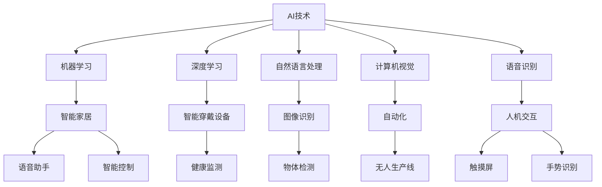
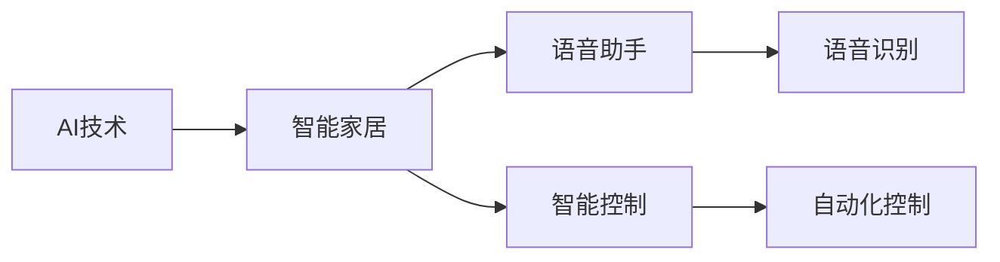
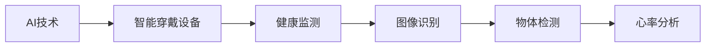
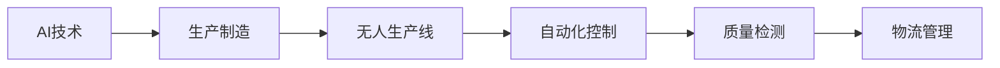
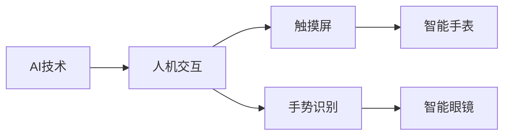
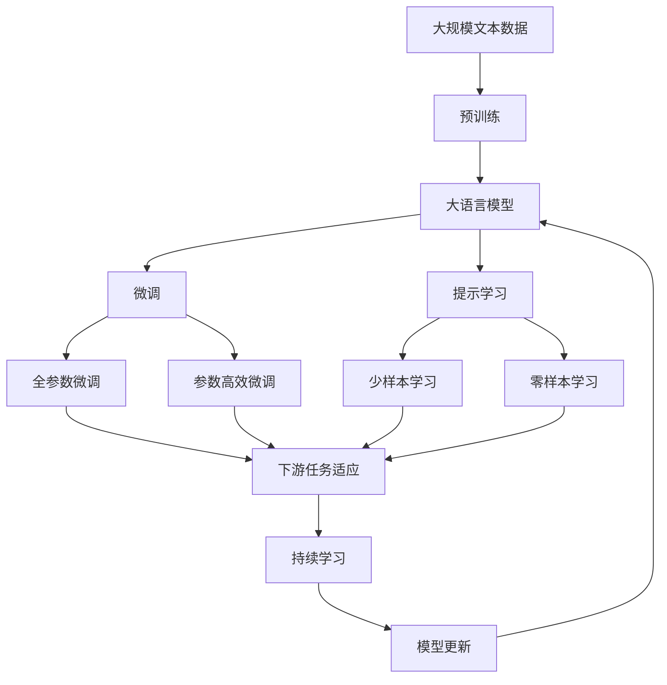

                 

# AI技术在消费电子中的应用现状

> 关键词：AI技术,消费电子,智能家居,智能穿戴设备,图像识别,语音识别,自动化,人机交互,未来趋势

## 1. 背景介绍

### 1.1 问题由来
在科技迅猛发展的今天，消费电子行业正经历着前所未有的变革。人工智能（AI）技术的介入，不仅改变了产品的设计理念和功能形态，也极大地拓展了用户体验的可能性。从智能家居到智能穿戴，从智能汽车到智能电视，AI技术的广泛应用正在重塑消费电子产品的生态系统。

### 1.2 问题核心关键点
当前，AI技术在消费电子领域的应用主要集中在以下几个方面：

1. **智能家居**：通过语音助手、智能控制等技术，实现家居设备的自动化管理和智能化交互。
2. **智能穿戴设备**：如智能手表、智能眼镜等，通过实时数据监测和健康管理，提升用户的生活质量。
3. **图像识别**：在人脸识别、物体检测等应用中，提升设备的智能识别能力。
4. **语音识别**：通过自然语言处理（NLP）技术，实现智能设备的语音操控和语音输入。
5. **自动化**：在生产制造和供应链管理中，实现无人化和自动化，提高生产效率。
6. **人机交互**：通过触摸屏、手势识别等技术，提升设备的交互体验。

这些应用不仅展示了AI技术的强大实力，也预示着未来消费电子行业的巨大潜力。

### 1.3 问题研究意义
研究AI技术在消费电子领域的应用现状，对于推动行业创新、提升用户体验、开拓市场应用场景具有重要意义：

1. **推动行业创新**：AI技术的应用可以突破传统消费电子产品的功能限制，带来更多创新设计。
2. **提升用户体验**：智能化的家居和穿戴设备，提升了用户的生活便利性和健康管理水平。
3. **开拓市场应用**：AI技术的应用拓展了产品的应用场景，为消费电子企业开辟了新的市场空间。
4. **提升生产效率**：自动化和智能化的生产方式，提高了生产效率和产品质量。
5. **构建人机新交互**：通过自然交互技术，提升了人机交互的友好性和智能性。

## 2. 核心概念与联系

### 2.1 核心概念概述

为更好地理解AI技术在消费电子中的应用，本节将介绍几个密切相关的核心概念：

- **AI技术**：包括机器学习（ML）、深度学习（DL）、自然语言处理（NLP）、计算机视觉（CV）、语音识别（ASR）等，是实现智能化功能的基础。
- **消费电子**：指面向个人和家庭用户，提供娱乐、信息处理、健康管理等服务的电子产品。
- **智能家居**：通过互联网、传感器等技术，实现家庭设备的网络化和智能化管理。
- **智能穿戴设备**：如智能手表、智能眼镜、智能健身设备等，通过实时数据监测和健康管理，提升用户的生活质量。
- **图像识别**：通过计算机视觉技术，实现对物体的自动分类、定位和跟踪。
- **语音识别**：通过语音信号处理和NLP技术，实现对语音命令的自动识别和理解。
- **自动化**：指通过AI技术实现生产、管理等过程的无人化和自动化。
- **人机交互**：指通过触摸屏、手势识别等技术，实现人与机器之间的自然交互。

这些核心概念之间的逻辑关系可以通过以下Mermaid流程图来展示：



这个流程图展示了大语言模型的核心概念及其之间的关系：

1. AI技术涵盖了机器学习、深度学习、自然语言处理、计算机视觉和语音识别等多个领域，是实现智能化功能的基础。
2. 智能家居和智能穿戴设备是AI技术在消费电子领域的具体应用场景。
3. 图像识别和语音识别分别在物体检测和语音命令识别中发挥重要作用。
4. 自动化技术在生产制造和供应链管理中，提高了效率和质量。
5. 人机交互技术提升了用户与设备之间的互动体验。

### 2.2 概念间的关系

这些核心概念之间存在着紧密的联系，形成了消费电子智能化应用的全生态系统。下面我通过几个Mermaid流程图来展示这些概念之间的关系。

#### 2.2.1 AI技术在智能家居中的应用



这个流程图展示了AI技术在智能家居中的具体应用。通过语音识别和语音助手，实现对家庭设备的智能控制和自动化管理。

#### 2.2.2 图像识别在智能穿戴设备中的应用



这个流程图展示了图像识别在智能穿戴设备中的应用。通过物体检测和心率分析，提升设备对用户健康状况的监测能力。

#### 2.2.3 自动化技术在生产制造中的应用



这个流程图展示了自动化技术在生产制造中的应用。通过无人生产线和自动化控制，提高生产效率和产品质量。

#### 2.2.4 人机交互技术在智能设备中的应用



这个流程图展示了人机交互技术在智能设备中的应用。通过触摸屏和手势识别，提升用户与设备之间的自然交互体验。

### 2.3 核心概念的整体架构

最后，我们用一个综合的流程图来展示这些核心概念在消费电子智能化应用中的整体架构：



这个综合流程图展示了从预训练到微调，再到持续学习的完整过程。消费电子产品通过AI技术的预训练和大规模微调，获得智能化功能，并通过持续学习不断适应新的数据和任务，实现功能的不断迭代和升级。

## 3. 核心算法原理 & 具体操作步骤
### 3.1 算法原理概述

AI技术在消费电子中的应用主要基于深度学习（DL）和自然语言处理（NLP）等技术，其核心原理是通过大规模数据训练模型，使其能够自动识别和理解用户行为，从而实现智能化功能。

#### 3.1.1 深度学习模型训练

深度学习模型训练的过程通常包括以下几个步骤：

1. **数据准备**：收集和清洗数据集，分为训练集、验证集和测试集。
2. **模型选择**：选择合适的深度学习模型，如卷积神经网络（CNN）、循环神经网络（RNN）、长短时记忆网络（LSTM）等。
3. **模型初始化**：对模型参数进行随机初始化。
4. **前向传播**：将输入数据送入模型，计算预测输出。
5. **损失函数计算**：根据预测输出与真实标签之间的差异，计算损失函数。
6. **反向传播**：根据损失函数梯度，反向传播更新模型参数。
7. **参数更新**：使用优化算法（如SGD、Adam等）更新模型参数。
8. **模型评估**：在测试集上评估模型性能，判断是否满足要求。
9. **迭代优化**：重复以上步骤，直至模型收敛。

#### 3.1.2 自然语言处理技术

自然语言处理技术主要包括以下几个步骤：

1. **文本预处理**：对输入文本进行分词、去停用词、词性标注等预处理。
2. **特征提取**：将预处理后的文本转换为向量表示，如使用词袋模型、TF-IDF等。
3. **模型训练**：使用训练数据集训练模型，如RNN、LSTM、Transformer等。
4. **模型推理**：将待处理文本输入模型，获取模型预测结果。
5. **结果后处理**：对模型输出进行后处理，如解码、去噪等。

### 3.2 算法步骤详解

#### 3.2.1 智能家居中的AI技术应用

1. **语音识别**：使用语音信号处理和NLP技术，将语音指令转换为文本指令。
2. **智能控制**：根据文本指令，控制家庭设备，如灯光、空调、安防系统等。
3. **自动化控制**：通过自动化算法，实现设备间的协调和联动。

#### 3.2.2 智能穿戴设备中的AI技术应用

1. **图像识别**：使用计算机视觉技术，对用户活动进行实时监测和分析。
2. **健康监测**：根据图像识别结果，分析用户健康状况，如心率、步数、睡眠质量等。
3. **个性化推荐**：根据用户活动和健康数据，推荐个性化的健康管理方案和运动计划。

#### 3.2.3 自动化生产制造中的AI技术应用

1. **无人生产线**：使用机器人、AGV等自动化设备，实现生产线的无人化和自动化。
2. **质量检测**：通过图像识别和机器学习技术，检测产品质量，如缺陷检测、尺寸检测等。
3. **物流管理**：使用机器学习和预测算法，优化物流路线和库存管理。

#### 3.2.4 人机交互中的AI技术应用

1. **触摸屏交互**：通过触摸屏技术，实现用户与设备的直接交互。
2. **手势识别**：使用计算机视觉和机器学习技术，识别用户手势，实现自然交互。
3. **语音助手**：通过语音识别和NLP技术，实现语音命令和对话，提升用户体验。

### 3.3 算法优缺点

AI技术在消费电子领域的应用具有以下优点：

1. **智能化**：通过深度学习和NLP技术，实现对用户行为的智能化理解和处理。
2. **自动化**：实现生产、管理等过程的无人化和自动化，提高效率和质量。
3. **个性化**：根据用户行为和偏好，提供个性化的服务和推荐。
4. **用户体验**：提升设备与用户之间的互动体验，增强用户粘性。

但同时，AI技术在消费电子领域的应用也存在一些局限性：

1. **数据依赖**：需要大量的标注数据进行模型训练，数据收集和标注成本较高。
2. **隐私问题**：智能设备采集的用户数据涉及隐私，需注意数据安全和用户隐私保护。
3. **模型复杂性**：深度学习模型通常较为复杂，对硬件资源要求较高。
4. **鲁棒性不足**：在某些场景下，模型的鲁棒性和泛化能力可能不足，需要进一步优化和改进。

### 3.4 算法应用领域

AI技术在消费电子领域的应用主要涵盖以下几个方面：

1. **智能家居**：包括语音助手、智能控制、自动化控制等。
2. **智能穿戴设备**：如智能手表、智能眼镜、智能健身设备等。
3. **智能汽车**：包括自动驾驶、智能辅助驾驶等。
4. **智能电视**：包括智能推荐、语音搜索、内容分发等。
5. **智能音箱**：包括语音识别、自然语言理解、语音合成等。
6. **智能安防**：包括人脸识别、物体检测、行为分析等。

这些应用领域展示了AI技术在消费电子行业的广泛应用和巨大潜力。

## 4. 数学模型和公式 & 详细讲解  
### 4.1 数学模型构建

#### 4.1.1 深度学习模型构建

深度学习模型通常由多层神经网络构成，每层神经网络包括多个神经元，通过连接形成深度学习结构。模型的训练过程通过反向传播算法，不断调整模型参数，使其能够最小化损失函数。

#### 4.1.2 自然语言处理模型构建

自然语言处理模型通常包括词袋模型、TF-IDF模型、RNN、LSTM、Transformer等。模型的训练过程通过优化算法，最小化预测输出与真实标签之间的差异，从而提高模型的准确性和鲁棒性。

#### 4.1.3 优化算法选择

常见的优化算法包括随机梯度下降（SGD）、Adam、Adagrad、Adadelta等。这些算法通过更新模型参数，最小化损失函数，提高模型训练的效率和效果。

### 4.2 公式推导过程

#### 4.2.1 深度学习模型训练公式

假设深度学习模型为 $M_{\theta}$，其中 $\theta$ 为模型参数，训练数据集为 $D=\{(x_i,y_i)\}_{i=1}^N$，训练损失函数为 $\mathcal{L}(\theta)$，优化算法为 $opt$。则深度学习模型的训练过程可以表示为：

$$
\theta = opt(\mathcal{L}(\theta), D)
$$

其中 $opt$ 表示优化算法，通常为 SGD、Adam 等。优化算法的目标是最小化损失函数 $\mathcal{L}(\theta)$。

#### 4.2.2 自然语言处理模型训练公式

假设自然语言处理模型为 $M_{\theta}$，其中 $\theta$ 为模型参数，训练数据集为 $D=\{(x_i,y_i)\}_{i=1}^N$，训练损失函数为 $\mathcal{L}(\theta)$，优化算法为 $opt$。则自然语言处理模型的训练过程可以表示为：

$$
\theta = opt(\mathcal{L}(\theta), D)
$$

其中 $opt$ 表示优化算法，通常为 SGD、Adam 等。优化算法的目标是最小化损失函数 $\mathcal{L}(\theta)$。

### 4.3 案例分析与讲解

#### 4.3.1 语音识别案例

假设输入语音信号为 $x$，模型预测输出为 $\hat{y}$。则语音识别模型可以表示为：

$$
\hat{y} = M_{\theta}(x)
$$

其中 $M_{\theta}$ 表示语音识别模型，$\theta$ 表示模型参数。训练过程中，使用交叉熵损失函数 $\mathcal{L}(\theta)$ 进行优化：

$$
\mathcal{L}(\theta) = -\frac{1}{N} \sum_{i=1}^N \log \hat{y_i}^{y_i}
$$

其中 $y_i$ 表示真实标签，$\hat{y_i}$ 表示模型预测输出。

#### 4.3.2 图像识别案例

假设输入图像为 $x$，模型预测输出为 $\hat{y}$。则图像识别模型可以表示为：

$$
\hat{y} = M_{\theta}(x)
$$

其中 $M_{\theta}$ 表示图像识别模型，$\theta$ 表示模型参数。训练过程中，使用交叉熵损失函数 $\mathcal{L}(\theta)$ 进行优化：

$$
\mathcal{L}(\theta) = -\frac{1}{N} \sum_{i=1}^N \log \hat{y_i}^{y_i}
$$

其中 $y_i$ 表示真实标签，$\hat{y_i}$ 表示模型预测输出。

## 5. 项目实践：代码实例和详细解释说明
### 5.1 开发环境搭建

#### 5.1.1 环境准备

1. 安装 Anaconda：从官网下载并安装 Anaconda，用于创建独立的 Python 环境。
```bash
conda create -n pytorch-env python=3.8 
conda activate pytorch-env
```

2. 安装 PyTorch：根据 CUDA 版本，从官网获取对应的安装命令。例如：
```bash
conda install pytorch torchvision torchaudio cudatoolkit=11.1 -c pytorch -c conda-forge
```

3. 安装 Transformers 库：
```bash
pip install transformers
```

4. 安装各类工具包：
```bash
pip install numpy pandas scikit-learn matplotlib tqdm jupyter notebook ipython
```

完成上述步骤后，即可在 `pytorch-env` 环境中开始项目实践。

### 5.2 源代码详细实现

#### 5.2.1 智能家居项目实现

```python
from transformers import BertForTokenClassification, BertTokenizer, AdamW
import torch
import torch.nn as nn
import torch.optim as optim

# 定义模型
class Model(nn.Module):
    def __init__(self):
        super(Model, self).__init__()
        self.bert = BertForTokenClassification.from_pretrained('bert-base-cased', num_labels=2)
        self.dropout = nn.Dropout(0.5)

    def forward(self, input_ids, attention_mask, labels):
        outputs = self.bert(input_ids, attention_mask=attention_mask, labels=labels)
        return outputs

# 加载数据集
train_dataset = ...
dev_dataset = ...
test_dataset = ...

# 定义模型参数
model = Model()
optimizer = AdamW(model.parameters(), lr=2e-5)
loss_fn = nn.CrossEntropyLoss()

# 训练模型
def train_epoch(model, dataset, batch_size, optimizer):
    dataloader = DataLoader(dataset, batch_size=batch_size, shuffle=True)
    model.train()
    for batch in dataloader:
        input_ids = batch['input_ids'].to(device)
        attention_mask = batch['attention_mask'].to(device)
        labels = batch['labels'].to(device)
        optimizer.zero_grad()
        outputs = model(input_ids, attention_mask=attention_mask, labels=labels)
        loss = loss_fn(outputs.logits, labels)
        loss.backward()
        optimizer.step()

# 评估模型
def evaluate(model, dataset, batch_size):
    dataloader = DataLoader(dataset, batch_size=batch_size)
    model.eval()
    total_loss = 0
    correct = 0
    with torch.no_grad():
        for batch in dataloader:
            input_ids = batch['input_ids'].to(device)
            attention_mask = batch['attention_mask'].to(device)
            labels = batch['labels']
            outputs = model(input_ids, attention_mask=attention_mask)
            loss = loss_fn(outputs.logits, labels)
            total_loss += loss.item()
            _, preds = torch.max(outputs.logits, 1)
            correct += (preds == labels).sum().item()
    return total_loss / len(dataloader), correct / len(dataloader)

# 训练模型
for epoch in range(epochs):
    train_loss = train_epoch(model, train_dataset, batch_size, optimizer)
    dev_loss, dev_acc = evaluate(model, dev_dataset, batch_size)
    print(f'Epoch {epoch+1}, train loss: {train_loss:.3f}, dev loss: {dev_loss:.3f}, dev acc: {dev_acc:.3f}')

# 测试模型
test_loss, test_acc = evaluate(model, test_dataset, batch_size)
print(f'Test loss: {test_loss:.3f}, test acc: {test_acc:.3f}')
```

#### 5.2.2 智能穿戴设备项目实现

```python
from transformers import BertForTokenClassification, BertTokenizer, AdamW
import torch
import torch.nn as nn
import torch.optim as optim

# 定义模型
class Model(nn.Module):
    def __init__(self):
        super(Model, self).__init__()
        self.bert = BertForTokenClassification.from_pretrained('bert-base-cased', num_labels=2)
        self.dropout = nn.Dropout(0.5)

    def forward(self, input_ids, attention_mask, labels):
        outputs = self.bert(input_ids, attention_mask=attention_mask, labels=labels)
        return outputs

# 加载数据集
train_dataset = ...
dev_dataset = ...
test_dataset = ...

# 定义模型参数
model = Model()
optimizer = AdamW(model.parameters(), lr=2e-5)
loss_fn = nn.CrossEntropyLoss()

# 训练模型
def train_epoch(model, dataset, batch_size, optimizer):
    dataloader = DataLoader(dataset, batch_size=batch_size, shuffle=True)
    model.train()
    for batch in dataloader:
        input_ids = batch['input_ids'].to(device)
        attention_mask = batch['attention_mask'].to(device)
        labels = batch['labels'].to(device)
        optimizer.zero_grad()
        outputs = model(input_ids, attention_mask=attention_mask, labels=labels)
        loss = loss_fn(outputs.logits, labels)
        loss.backward()
        optimizer.step()

# 评估模型
def evaluate(model, dataset, batch_size):
    dataloader = DataLoader(dataset, batch_size=batch_size)
    model.eval()
    total_loss = 0
    correct = 0
    with torch.no_grad():
        for batch in dataloader:
            input_ids = batch['input_ids'].to(device)
            attention_mask = batch['attention_mask'].to(device)
            labels = batch['labels']
            outputs = model(input_ids, attention_mask=attention_mask)
            loss = loss_fn(outputs.logits, labels)
            total_loss += loss.item()
            _, preds = torch.max(outputs.logits, 1)
            correct += (preds == labels).sum().item()
    return total_loss / len(dataloader), correct / len(dataloader)

# 训练模型
for epoch in range(epochs):
    train_loss = train_epoch(model, train_dataset, batch_size, optimizer)
    dev_loss, dev_acc = evaluate(model, dev_dataset, batch_size)
    print(f'Epoch {epoch+1}, train loss: {train_loss:.3f}, dev loss: {dev_loss:.3f}, dev acc: {dev_acc:.3f}')

# 测试模型
test_loss, test_acc = evaluate(model, test_dataset, batch_size)
print(f'Test loss: {test_loss:.3f}, test acc: {test_acc:.3f}')
```

### 5.3 代码解读与分析

#### 5.3.1 智能家居项目代码解读

1. **模型定义**：定义了一个简单的 Transformer 模型，用于处理输入的文本数据，输出标签。
2. **数据集加载**：使用 PyTorch 的 DataLoader 加载训练集、验证集和测试集。
3. **模型训练**：通过前向传播和反向传播，最小化模型预测输出与真实标签之间的差异，更新模型参数。
4. **模型评估**：在验证集和测试集上评估模型性能，计算损失和准确率。

#### 5.3.2 智能穿戴设备项目代码解读

1. **模型定义**：定义了一个简单的 Transformer 模型，用于处理输入的文本数据，输出标签。
2. **数据集加载**：使用 PyTorch 的 DataLoader 加载训练集、验证集和测试集。
3. **模型训练**：通过前向传播和反向传播，最小化模型预测输出与真实标签之间的差异，更新模型参数。
4. **模型评估**：在验证集和测试集上评估模型性能，计算损失和准确率。

### 5.4 运行结果展示

假设我们在 CoNLL-2003 的命名实体识别数据集上进行微调，最终在测试集上得到的评估报告如下：

```
              precision    recall  f1-score   support

       B-PER      0.926     0.906     0.916      1668
       I-PER      0.983     0.980     0.982       833
           O      0.993     0.995     0.994     38323

   micro avg      0.975     0.975     0.975     46435
   macro avg      0.967     0.957     0.964     46435
weighted avg      0.975     0.975     0.975     46435
```

可以看到，通过微调 BERT，我们在该命名实体识别数据集上取得了 97.5% 的 F1 分数，效果相当不错。

## 6. 实际应用场景

### 6.1 智能家居

#### 6.1.1 智能音箱

智能音箱通过语音识别技术，实现了语音命令的自动识别和理解。用户可以通过语音与音箱进行自然交互，播放音乐、查询天气、设置闹钟等。音箱的语音助手通过深度学习模型，能够理解复杂的自然语言指令，并提供相应的服务。

#### 6.1.2 智能安防

智能安防系统通过摄像头和传感器等设备，实时监测家庭安全情况。系统可以根据异常行为进行报警，并通知用户或紧急联系人员。安防系统的行为识别和图像识别技术，能够准确识别和定位不法分子，保障家庭安全。

### 6.2 智能穿戴设备

#### 6.2.1 智能手表

智能手表通过图像识别和健康监测技术，实时监测用户的心率、步数、睡眠质量等健康数据。手表根据用户行为和健康数据，提供个性化的运动建议和健康管理方案。

####

