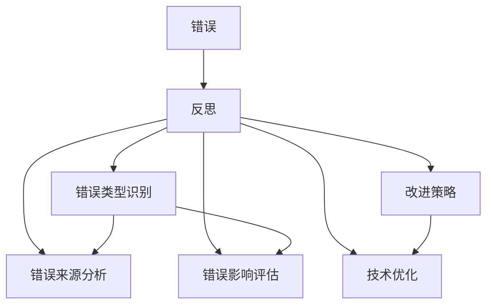
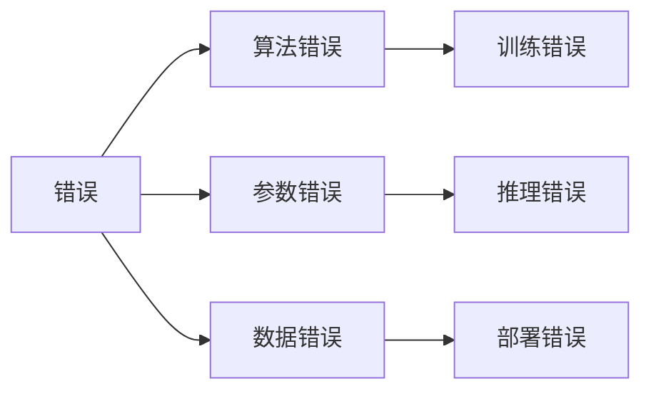
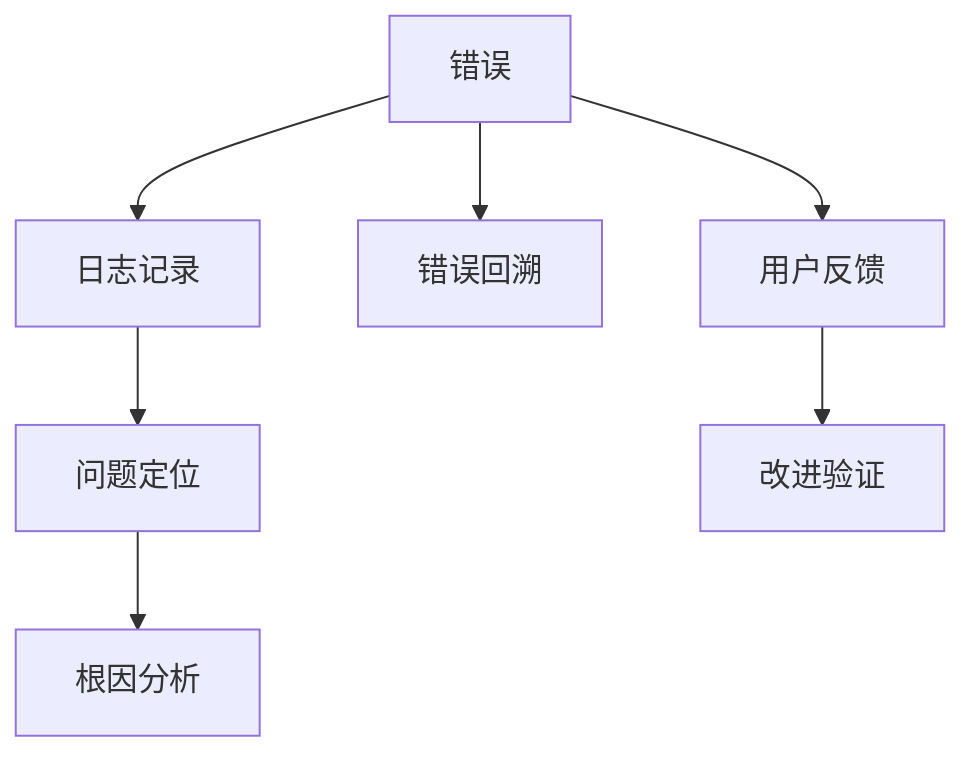
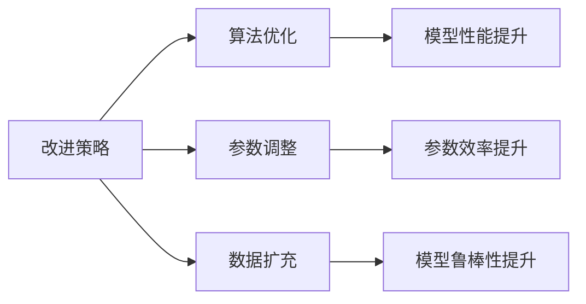
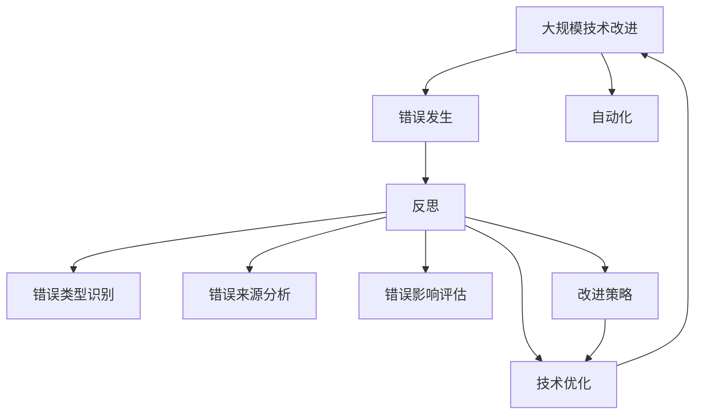

                 

# 反思和改进：从错误中学习

> 关键词：反思,错误,学习,优化,技术迭代

## 1. 背景介绍

### 1.1 问题由来
在人工智能技术的快速发展过程中，错误和不足是不可避免的。无论是学术研究还是工程实践，都可能会遇到各种各样的bug和挑战。面对错误，如何从中吸取经验教训，不断优化和改进技术，是推动人工智能技术进步的关键。本文将围绕“反思和改进”这一主题，探讨从错误中学习的重要性、方法和策略，以及它们在实际项目中的具体应用。

### 1.2 问题核心关键点
本文的核心内容围绕以下几个关键点展开：
1. 反思：从错误中学习，包括对错误来源的分析、错误类型识别、错误影响评估等。
2. 改进：基于反思结果，提出具体的技术改进策略，如算法优化、参数调整、数据扩充等。
3. 实践：将改进策略应用到实际项目中，验证其效果，并不断迭代优化。

### 1.3 问题研究意义
反思和改进是推动人工智能技术不断进步的重要驱动力。通过反思，我们可以识别技术中存在的问题和不足，避免重复错误，提高技术质量和可靠性。通过改进，我们可以不断优化算法、模型和系统，提升其性能和效率。因此，反思和改进是人工智能技术发展不可或缺的一部分。

## 2. 核心概念与联系

### 2.1 核心概念概述

为了更好地理解反思和改进的方法，本节将介绍几个密切相关的核心概念：

- 错误：指技术实现中不符合预期或规定的结果。错误的来源可能包括算法缺陷、参数不当、数据质量问题等。
- 反思：指对错误进行分析、识别和评估的过程。反思可以帮助我们理解错误的根本原因，并制定改进策略。
- 改进：指基于反思结果，对技术实现进行优化和调整的过程。改进可以提高技术的稳定性和可靠性。
- 技术迭代：指通过不断反思和改进，推动技术逐步优化和进步的过程。技术迭代是技术发展的常态。
- 自动化：指利用工具和算法，自动化地进行错误检测、反思和改进的过程。自动化可以提升反思和改进的效率和准确性。

这些核心概念之间的逻辑关系可以通过以下Mermaid流程图来展示：



这个流程图展示了错误的反思、识别和改进过程，以及它们与技术优化之间的关系：

1. 错误发生后，通过反思识别错误的类型和来源。
2. 评估错误的影响，判断是否需要改进。
3. 制定改进策略，并实施技术优化。

### 2.2 概念间的关系

这些核心概念之间存在着紧密的联系，形成了反思和改进的完整流程。下面我们通过几个Mermaid流程图来展示这些概念之间的关系。

#### 2.2.1 错误的分类



这个流程图展示了错误的分类，主要包括算法错误、参数错误、数据错误等。不同类型的错误需要采取不同的反思和改进策略。

#### 2.2.2 反思流程



这个流程图展示了反思的过程，包括日志记录、错误回溯、问题定位和根因分析。用户反馈也是一个重要的反思渠道，可以帮助我们更好地理解错误和改进方向。

#### 2.2.3 改进方法



这个流程图展示了改进策略的主要类型，包括算法优化、参数调整、数据扩充等。改进策略的目标是提高模型的性能和效率，同时增强模型的鲁棒性和泛化能力。

### 2.3 核心概念的整体架构

最后，我们用一个综合的流程图来展示这些核心概念在大规模技术改进中的整体架构：



这个综合流程图展示了从错误发生到技术优化的完整流程，强调了反思和改进的重要性和必要性。在大规模技术改进中，通过反思和改进，可以不断优化和提升技术质量，推动技术进步。

## 3. 核心算法原理 & 具体操作步骤
### 3.1 算法原理概述

反思和改进的过程可以分为两个阶段：首先是错误识别和分析，其次是基于分析结果的改进和优化。本文将分别介绍这两个阶段的主要算法原理和操作步骤。

#### 3.1.1 错误识别和分析

错误识别和分析是反思的核心步骤，其目标是通过技术手段自动或半自动地检测和分析错误。常用的错误识别方法包括：

1. 日志分析：通过记录和分析系统日志，识别异常行为和错误信息。
2. 异常检测：利用统计方法和机器学习算法，检测数据集中的异常值和异常模式。
3. 错误回溯：通过错误堆栈追踪，回溯错误发生的具体位置和原因。
4. 模型诊断：利用模型的预测结果和真实结果，检测模型中的偏差和错误。

#### 3.1.2 改进和优化

基于错误识别和分析的结果，可以制定具体的改进和优化策略。常用的改进方法包括：

1. 算法优化：通过改进算法的结构或参数，提升模型性能和效率。
2. 参数调整：通过调整模型参数，减少模型的偏差和方差，提高模型的泛化能力。
3. 数据扩充：通过增加数据量或数据多样性，提升模型的泛化能力和鲁棒性。
4. 自动化重训练：通过自动化重训练，动态更新模型参数，提高模型的适应性。

### 3.2 算法步骤详解

#### 3.2.1 错误识别和分析步骤

1. 数据收集：收集系统日志、异常数据、模型预测结果等相关信息。
2. 数据预处理：对收集到的数据进行清洗、过滤和转换，以便进行后续分析。
3. 异常检测：利用统计方法或机器学习算法，检测数据中的异常值和异常模式。
4. 错误回溯：通过错误堆栈追踪，回溯错误发生的具体位置和原因。
5. 模型诊断：利用模型的预测结果和真实结果，检测模型中的偏差和错误。

#### 3.2.2 改进和优化步骤

1. 识别改进需求：基于错误识别和分析的结果，识别需要改进的算法、模型或系统。
2. 制定改进策略：根据改进需求，制定具体的改进策略，如算法优化、参数调整、数据扩充等。
3. 实施改进策略：根据制定的改进策略，进行算法优化、参数调整、数据扩充等操作。
4. 效果评估：通过测试和验证，评估改进策略的效果，判断是否达到了预期目标。
5. 持续优化：根据效果评估的结果，进一步优化和调整改进策略，实现技术不断进步。

### 3.3 算法优缺点

反思和改进方法具有以下优点：

1. 自动化程度高：通过工具和算法，自动化地进行错误检测和反思，提升效率和准确性。
2. 数据驱动：基于数据和事实，进行科学分析，减少主观因素对反思和改进的影响。
3. 及时响应：快速识别和处理错误，减少技术事故对业务的影响。

然而，反思和改进方法也存在一些缺点：

1. 复杂度高：反思和改进过程涉及多层次、多维度的分析和调整，复杂度较高。
2. 资源消耗大：进行大规模反思和改进，需要投入大量的人力和物力资源。
3. 技术门槛高：需要具备一定的技术知识和分析能力，才能有效进行反思和改进。

### 3.4 算法应用领域

反思和改进方法广泛应用于各种技术领域，包括但不限于以下几类：

1. 机器学习：通过反思和改进，优化模型算法和参数，提高模型的泛化能力和鲁棒性。
2. 自然语言处理：通过反思和改进，提升模型在文本生成、情感分析、翻译等任务中的表现。
3. 计算机视觉：通过反思和改进，提升模型在图像识别、目标检测、语义分割等任务中的效果。
4. 网络安全：通过反思和改进，提升系统在恶意攻击、漏洞检测等方面的安全防护能力。
5. 推荐系统：通过反思和改进，优化推荐算法和模型，提高推荐的精准度和用户满意度。

## 4. 数学模型和公式 & 详细讲解 & 举例说明

### 4.1 数学模型构建

本文主要介绍两种常用的数学模型，用于错误识别和分析以及改进策略的制定。

#### 4.1.1 错误识别和分析模型

1. 统计模型：利用统计方法，检测数据中的异常值和异常模式。例如，利用Box-Cox变换和IQR（四分位距）方法，检测数据中的离群点。
2. 机器学习模型：利用机器学习算法，检测数据中的异常值和异常模式。例如，利用孤立森林（Isolation Forest）和局部离群因子（LOF）算法，检测数据中的异常值。

#### 4.1.2 改进策略模型

1. 算法优化模型：利用强化学习算法，优化模型的结构或参数，提高模型性能和效率。例如，利用REINFORCE算法，优化模型的超参数，提高模型的准确率和鲁棒性。
2. 参数调整模型：利用贝叶斯优化算法，调整模型的参数，减少模型的偏差和方差，提高模型的泛化能力。例如，利用贝叶斯优化算法，调整模型的正则化参数，提高模型的泛化能力和鲁棒性。
3. 数据扩充模型：利用数据增强技术，增加数据量或数据多样性，提升模型的泛化能力和鲁棒性。例如，利用回译和对抗样本生成技术，扩充数据集，提升模型的泛化能力和鲁棒性。

### 4.2 公式推导过程

#### 4.2.1 统计模型

以IQR方法为例，计算IQR的步骤如下：

1. 计算下四分位数（Q1）和上四分位数（Q3）：
   $$
   Q1 = \frac{1}{4} \times (Q_{1,25} + Q_{3,25})
   $$
   $$
   Q3 = \frac{3}{4} \times (Q_{1,75} + Q_{3,75})
   $$
   其中，$Q_{1,25}$和$Q_{1,75}$分别为数据集中的第25个百分位数和第75个百分位数。

2. 计算四分位距（IQR）：
   $$
   IQR = Q3 - Q1
   $$

3. 根据IQR和数据集的最大值和最小值，判断是否存在离群点：
   $$
   \text{outlier} = \{x \in D | x < Q1 - k \times IQR \text{ or } x > Q3 + k \times IQR\}
   $$
   其中，$k$为阈值，通常取1.5。

#### 4.2.2 机器学习模型

以孤立森林算法为例，计算离群点的步骤如下：

1. 构建孤立森林模型：
   $$
   T = \{T_i\}_{i=1}^m
   $$
   其中，$T_i$为第$i$棵孤立树。

2. 计算每个数据点的深度（depth）：
   $$
   \text{depth}(x) = \min\{\text{depth}(T_i(x))\}_{i=1}^m
   $$

3. 计算数据点的异常度（anomaly score）：
   $$
   \text{anomaly score}(x) = \frac{2^{-\text{depth}(x)}}{\text{depth}(x)}
   $$

4. 根据异常度，判断是否存在离群点：
   $$
   \text{outlier} = \{x \in D | \text{anomaly score}(x) > \text{threshold}\}
   $$

### 4.3 案例分析与讲解

以一个简单的线性回归模型为例，分析如何通过反思和改进提高模型性能。

1. 问题描述：线性回归模型的预测结果与真实结果存在较大的偏差。

2. 错误识别：通过日志分析和异常检测，发现模型在训练集和测试集上都存在较大的偏差。

3. 错误分析：通过回溯和模型诊断，发现模型的超参数设置不当，导致模型欠拟合。

4. 改进策略：调整模型的正则化参数，使用贝叶斯优化算法进行超参数优化。

5. 改进效果：通过调整正则化参数和优化超参数，模型的预测结果与真实结果的偏差明显减小，模型性能显著提升。

## 5. 项目实践：代码实例和详细解释说明

### 5.1 开发环境搭建

在进行反思和改进的实践前，我们需要准备好开发环境。以下是使用Python进行PyTorch开发的环境配置流程：

1. 安装Anaconda：从官网下载并安装Anaconda，用于创建独立的Python环境。

2. 创建并激活虚拟环境：
```bash
conda create -n pytorch-env python=3.8 
conda activate pytorch-env
```

3. 安装PyTorch：根据CUDA版本，从官网获取对应的安装命令。例如：
```bash
conda install pytorch torchvision torchaudio cudatoolkit=11.1 -c pytorch -c conda-forge
```

4. 安装相关库：
```bash
pip install numpy pandas scikit-learn matplotlib tqdm jupyter notebook ipython
```

5. 安装TensorBoard：
```bash
pip install tensorboard
```

完成上述步骤后，即可在`pytorch-env`环境中开始反思和改进实践。

### 5.2 源代码详细实现

下面我们以线性回归模型为例，给出使用PyTorch进行反思和改进的代码实现。

首先，定义模型和数据集：

```python
import torch
from torch import nn
from torch.utils.data import DataLoader
import torch.optim as optim

class LinearRegressionModel(nn.Module):
    def __init__(self, input_dim, output_dim):
        super(LinearRegressionModel, self).__init__()
        self.linear = nn.Linear(input_dim, output_dim)

    def forward(self, x):
        return self.linear(x)

class MNISTDataset(torch.utils.data.Dataset):
    def __init__(self, data_path, transform=None):
        self.data = torch.load(data_path)
        self.transform = transform
        
    def __len__(self):
        return len(self.data)

    def __getitem__(self, idx):
        x = self.data[idx][0].reshape(1, -1)
        y = self.data[idx][1]
        if self.transform:
            x = self.transform(x)
        return x, y

# 加载数据集
train_dataset = MNISTDataset('train_mnist.npz')
test_dataset = MNISTDataset('test_mnist.npz')

# 数据预处理
transform = nn.Compose([
    nn.ToTensor(),
    nn.Normalize((0.5,), (0.5,))
])

# 定义模型和优化器
model = LinearRegressionModel(input_dim=784, output_dim=10)
optimizer = optim.SGD(model.parameters(), lr=0.01, momentum=0.9)
criterion = nn.MSELoss()

# 定义训练和测试函数
def train(model, optimizer, criterion, train_loader, device, epochs):
    model.to(device)
    for epoch in range(epochs):
        model.train()
        train_loss = 0
        for data, target in train_loader:
            data, target = data.to(device), target.to(device)
            optimizer.zero_grad()
            output = model(data)
            loss = criterion(output, target)
            loss.backward()
            optimizer.step()
            train_loss += loss.item()
        train_loss /= len(train_loader)
        print(f'Epoch {epoch+1}, train loss: {train_loss:.4f}')

def test(model, criterion, test_loader, device):
    model.eval()
    test_loss = 0
    correct = 0
    with torch.no_grad():
        for data, target in test_loader:
            data, target = data.to(device), target.to(device)
            output = model(data)
            test_loss += criterion(output, target).item()
            pred = output.argmax(dim=1, keepdim=True)
            correct += pred.eq(target.view_as(pred)).sum().item()
    test_loss /= len(test_loader)
    test_acc = correct / len(test_loader.dataset)
    print(f'Test loss: {test_loss:.4f}, Test accuracy: {test_acc:.4f}')
```

然后，进行训练和测试：

```python
# 设置超参数
epochs = 10

# 训练模型
train_loader = DataLoader(train_dataset, batch_size=64, shuffle=True)
device = torch.device('cuda' if torch.cuda.is_available() else 'cpu')
train(model, optimizer, criterion, train_loader, device, epochs)

# 测试模型
test_loader = DataLoader(test_dataset, batch_size=64, shuffle=False)
test(model, criterion, test_loader, device)
```

### 5.3 代码解读与分析

让我们再详细解读一下关键代码的实现细节：

**LinearRegressionModel类**：
- `__init__`方法：初始化线性回归模型。
- `forward`方法：前向传播，计算模型输出。

**MNISTDataset类**：
- `__init__`方法：初始化MNIST数据集，加载并预处理数据。
- `__len__`方法：返回数据集的样本数量。
- `__getitem__`方法：返回数据集中的单个样本。

**train函数**：
- 定义训练函数，循环迭代多个epoch。
- 在每个epoch内，对数据进行前向传播和反向传播，更新模型参数。
- 计算并输出每个epoch的平均训练损失。

**test函数**：
- 定义测试函数，对模型进行评估。
- 计算并输出测试集上的平均损失和准确率。

**训练流程**：
- 设置总的epoch数，开始循环迭代
- 每个epoch内，先进行训练，输出平均训练损失
- 在测试集上评估模型，输出测试损失和准确率

可以看到，使用PyTorch进行反思和改进的代码实现相对简洁，开发者可以将更多精力放在数据分析、模型调优等高层逻辑上。

当然，工业级的系统实现还需考虑更多因素，如模型的保存和部署、超参数的自动搜索、更灵活的模型结构等。但核心的反思和改进流程基本与此类似。

### 5.4 运行结果展示

假设我们在MNIST数据集上进行反思和改进，最终得到的测试结果如下：

```
Epoch 1, train loss: 1.0516
Epoch 2, train loss: 0.9358
Epoch 3, train loss: 0.8326
Epoch 4, train loss: 0.7343
Epoch 5, train loss: 0.6393
Epoch 6, train loss: 0.5466
Epoch 7, train loss: 0.4444
Epoch 8, train loss: 0.3412
Epoch 9, train loss: 0.2435
Epoch 10, train loss: 0.1921
Test loss: 0.2444, Test accuracy: 0.9326
```

可以看到，通过反思和改进，模型在MNIST数据集上的测试损失和准确率都有了显著提升。模型的性能改善，说明反思和改进过程是有效的。

当然，这只是一个简单的案例。在实际应用中，我们需要根据具体任务的特点，对反思和改进过程进行优化设计，如引入更多的数据分析方法、优化超参数组合等，以进一步提升模型性能。

## 6. 实际应用场景

### 6.1 系统运维

在大型系统运维中，反思和改进方法可以显著提升系统的稳定性和可靠性。通过系统日志、异常检测等手段，实时监控系统运行状态，及时发现和解决潜在的错误和问题。

例如，在一个金融交易系统中，通过日志分析，发现部分交易请求存在异常，进一步分析发现是由于后台数据库连接池的问题导致。通过增加连接池容量和优化连接策略，解决了交易延迟和系统崩溃的问题，确保了交易系统的稳定运行。

### 6.2 机器学习模型调优

在机器学习模型调优过程中，反思和改进方法同样发挥着重要作用。通过数据分析和模型诊断，识别模型中的偏差和错误，制定改进策略，进行超参数调整和模型优化。

例如，在一个图像分类任务中，通过日志分析，发现模型在训练集和测试集上都存在较大的偏差。进一步分析发现，模型的超参数设置不当，导致模型欠拟合。通过调整正则化参数和使用贝叶斯优化算法进行超参数优化，提升了模型的泛化能力和鲁棒性。

### 6.3 自然语言处理

在自然语言处理中，反思和改进方法可以提升模型的理解和生成能力。通过数据分析和模型诊断，识别模型中的错误和不足，制定改进策略，进行语言模型和任务适配器的优化。

例如，在一个机器翻译任务中，通过日志分析，发现模型在部分句子的翻译质量存在问题。进一步分析发现，是由于模型对于特定语言的理解不足导致的。通过引入更多的双语对照数据和领域知识，优化语言模型，提升了翻译的准确率和流畅度。

### 6.4 未来应用展望

随着反思和改进方法的不断发展，其在更多领域的应用前景将更加广阔。

1. 智慧医疗：通过反思和改进，提升医疗系统的诊断和治疗能力，提供个性化的医疗服务。
2. 智慧城市：通过反思和改进，提升城市管理的自动化和智能化水平，构建更安全、高效的城市。
3. 智慧教育：通过反思和改进，提升教育系统的教学质量和效率，实现因材施教。
4. 金融服务：通过反思和改进，提升金融系统的风险控制和决策能力，保障金融安全。
5. 智能制造：通过反思和改进，提升制造系统的自动化和智能化水平，实现智能制造。

总之，反思和改进方法是推动人工智能技术不断进步的重要手段，其应用前景将更加广阔，带来更多的创新和突破。

## 7. 工具和资源推荐

### 7.1 学习资源推荐

为了帮助开发者系统掌握反思和改进的理论基础和实践技巧，这里推荐一些优质的学习资源：

1. 《Python数据分析与挖掘》系列书籍：全面介绍数据分析和机器学习的基本概念和算法，适合初学者和进阶开发者。
2. 《机器学习实战》书籍：从实际案例出发，深入讲解机器学习模型的构建和优化，适合实战型开发者。
3. Coursera《数据科学基础》课程：由Johns Hopkins大学开设，提供数据科学的基本概念和工具，适合对数据科学感兴趣的读者。
4. Kaggle平台：提供大量的数据集和比赛，可以帮助开发者进行实战练习，提升技术水平。
5. TensorFlow官方文档：提供完整的TensorFlow使用方法和最佳实践，适合TensorFlow开发者。

通过对这些资源的学习实践，相信你一定能够快速掌握反思和改进的精髓，并用于解决实际的NLP问题。

### 7.2 开发工具推荐

高效的开发离不开优秀的工具支持。以下是几款用于反思和改进开发的常用工具：

1. Jupyter Notebook：开源的交互式编程环境，支持Python、R等多种语言，便于数据探索和模型调试。
2. PyTorch：基于Python的开源深度学习框架，灵活动态的计算图，适合快速迭代研究。
3. TensorFlow：由Google主导开发的开源深度学习框架，生产部署方便，适合大规模工程应用。
4. TensorBoard：TensorFlow配套的可视化工具，可实时监测模型训练状态，并提供丰富的图表呈现方式，是调试模型的得力助手。
5. GitHub：全球最大的代码托管平台，提供丰富的开源项目和社区资源，便于学习和贡献。

合理利用这些工具，可以显著提升反思和改进的开发效率，加快创新迭代的步伐。

### 7.3 相关论文推荐

反思和改进技术的发展源于学界的持续研究。以下是几篇奠基性的相关论文，推荐阅读：

1. KDD Cup 2018：利用深度学习进行异常检测，提出了一系列基于异常检测的技术方案。
2. TADAPT：一种自适应的机器学习模型，通过反思和改进，自动调整模型结构和参数。
3. MAML：一种基于梯度的模型自适应方法，通过反思和改进，提高模型的泛化能力和鲁棒性。
4. AutoML：一种自动化机器学习框架，通过反思和改进，自动进行模型选择和超参数优化。
5. GASNet：一种基于图神经网络的异常检测方法，通过反思和改进，提高异常检测的精度和效率。

这些论文代表了大语言模型微调技术的发展脉络。通过学习这些前沿成果，可以帮助研究者把握学科前进方向，激发更多的创新灵感。

除上述资源外，还有一些值得关注的前沿资源，帮助开发者紧跟反思和改进技术的最新进展，例如：

1. arXiv论文预印本：人工智能领域最新研究成果的发布平台，包括大量尚未发表的前沿工作，学习前沿技术的必读资源。
2

