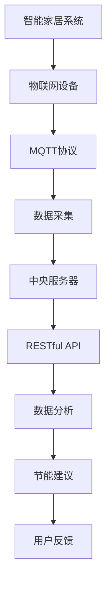
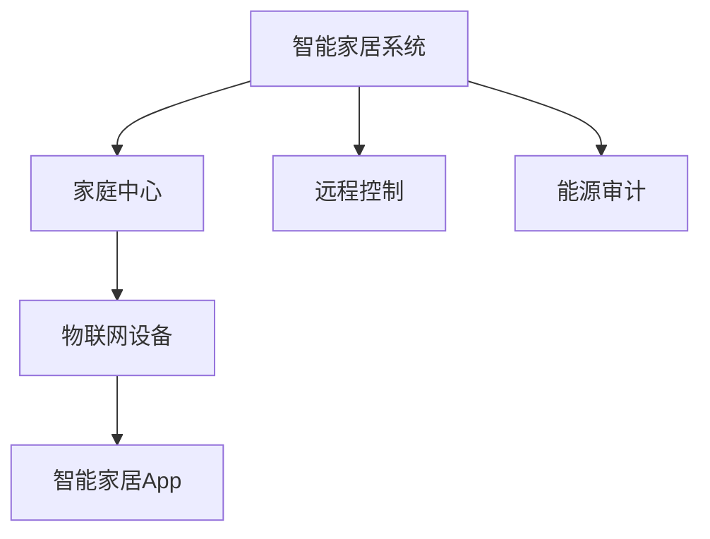
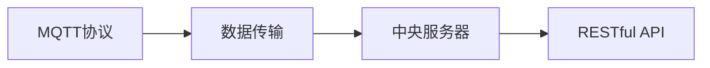
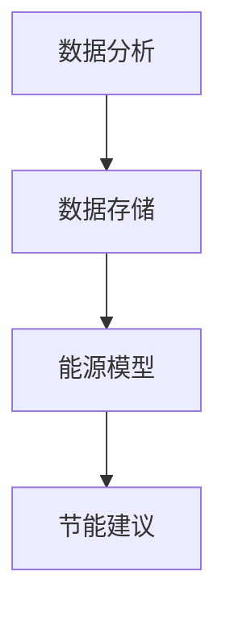

                 

# 基于MQTT协议和RESTful API的智能家居系统能源审计

> 关键词：智能家居,能源审计,MQTT,RESTful API,物联网,大数据,系统架构

## 1. 背景介绍

### 1.1 问题由来
随着物联网技术的发展，智能家居系统正变得越来越普及，为用户带来更加便捷、舒适的生活体验。然而，智能家居系统在提升用户体验的同时，也带来了能源消耗增加的问题。为了有效降低能源消耗，智能家居系统需要定期进行能源审计，评估和优化能源使用情况，帮助用户制定节能措施。

能源审计是衡量和评估智能家居系统能源消耗的重要手段，可以通过数据分析和建模，发现能源消耗异常，提供节能建议。传统的能源审计方法需要手动收集和分析数据，耗时耗力，且难以实时监控和优化。因此，如何利用先进的技术手段，提高能源审计的效率和准确性，是当前智能家居系统面临的重要问题。

### 1.2 问题核心关键点
为了解决传统能源审计方法的弊端，本文提出了一种基于MQTT协议和RESTful API的智能家居系统能源审计方法。该方法利用物联网设备采集的能源消耗数据，通过MQTT协议实时传输到中央服务器，再利用RESTful API接口实现数据的存储、处理和分析。这种方法可以大大提高能源审计的效率，实现实时监控和优化。

### 1.3 问题研究意义
通过基于MQTT协议和RESTful API的能源审计方法，可以实时监测智能家居系统的能源消耗情况，及时发现能源浪费问题，提供节能建议。这不仅有助于降低能源消耗，保护环境，还能提升用户体验，增加智能家居系统的附加价值。此外，该方法也为物联网设备的数据集成和管理提供了新的思路，具有广泛的应用前景。

## 2. 核心概念与联系

### 2.1 核心概念概述

为更好地理解本文提出的智能家居系统能源审计方法，本节将介绍几个密切相关的核心概念：

- MQTT（Message Queuing Telemetry Transport）：一种轻量级的消息传输协议，广泛应用于物联网设备之间的数据交换。通过MQTT协议，智能家居系统可以实时传输设备数据到中央服务器。
- RESTful API：一种基于HTTP协议的API设计风格，利用URL和HTTP方法定义接口，实现数据的操作和传输。RESTful API可以方便地实现数据的存储、处理和分析。
- 智能家居系统：一种利用物联网技术，通过互联网实现设备间数据共享和控制的网络系统，广泛应用于家庭自动化和智能化管理。
- 能源审计：对智能家居系统的能源消耗情况进行评估和分析，发现能源浪费问题，提出节能建议。
- 物联网（IoT）：利用传感器、嵌入式设备和互联网技术，实现设备间的数据交换和控制，广泛应用于工业、医疗、交通等领域。

这些核心概念之间的逻辑关系可以通过以下Mermaid流程图来展示：



这个流程图展示了智能家居系统能源审计的完整过程：

1. 物联网设备通过MQTT协议采集能源消耗数据。
2. 数据通过RESTful API接口传输到中央服务器。
3. 服务器利用数据分析和建模技术，对数据进行处理和分析。
4. 根据分析结果，提供节能建议。
5. 用户接收建议，进行能源优化。
6. 用户反馈进一步改进能源审计模型。

这些核心概念共同构成了智能家居系统能源审计的完整生态系统，使其能够有效地监测和优化能源消耗。

### 2.2 概念间的关系

这些核心概念之间存在着紧密的联系，形成了智能家居系统能源审计的完整框架。下面我通过几个Mermaid流程图来展示这些概念之间的关系。

#### 2.2.1 智能家居系统架构



这个流程图展示了智能家居系统的架构：

1. 家庭中心是智能家居系统的控制中心，负责管理和调度设备。
2. 物联网设备通过传感器、控制器等实现设备间的互联互通。
3. 智能家居App与家庭中心和物联网设备进行数据交互，实现设备控制和数据获取。
4. 远程控制通过互联网实现对设备的远程操作和管理。
5. 能源审计对设备数据进行分析和建模，提供节能建议。

#### 2.2.2 MQTT协议与RESTful API的关系



这个流程图展示了MQTT协议与RESTful API的关系：

1. MQTT协议负责将物联网设备采集的能源消耗数据传输到中央服务器。
2. RESTful API用于实现数据在服务器上的存储、处理和分析。
3. 通过MQTT协议和RESTful API的结合，可以实现数据的实时传输和处理，提高能源审计的效率。

#### 2.2.3 数据分析与节能建议的流程



这个流程图展示了数据分析与节能建议的流程：

1. 数据存储对采集到的能源消耗数据进行保存和管理。
2. 能源模型利用数据进行分析和建模，生成能源消耗的趋势和预测。
3. 节能建议根据分析结果，提出优化能源使用的建议。
4. 用户根据建议进行节能优化。

通过这些流程图，我们可以更清晰地理解智能家居系统能源审计过程中各核心概念的关系和作用。

## 3. 核心算法原理 & 具体操作步骤
### 3.1 算法原理概述

基于MQTT协议和RESTful API的智能家居系统能源审计方法，本质上是一种利用物联网设备采集数据，通过消息队列和API接口进行传输和处理，实现实时监测和优化能源消耗的方案。

具体而言，该方法包括以下几个关键步骤：

1. 物联网设备通过传感器和控制器，采集智能家居系统的能源消耗数据。
2. 采集的数据通过MQTT协议传输到中央服务器。
3. 中央服务器利用RESTful API接口，将数据存储和管理。
4. 利用数据分析和建模技术，对数据进行处理和分析。
5. 根据分析结果，提出节能建议。
6. 用户根据建议进行能源优化。

通过这种机制，可以实现对智能家居系统能源消耗的实时监测和优化，帮助用户降低能源消耗，提升系统效率。

### 3.2 算法步骤详解

#### 3.2.1 数据采集

数据采集是能源审计的基础，需要物联网设备通过传感器和控制器，实时获取能源消耗数据。具体实现步骤如下：

1. 选择合适的传感器和控制器，如温湿度传感器、电表、水表等。
2. 传感器和控制器通过MQTT协议，将采集到的数据实时传输到中央服务器。
3. 服务器利用RESTful API接口，对数据进行存储和管理。

#### 3.2.2 数据传输

数据传输是能源审计的重要环节，需要确保数据在传输过程中实时、安全、可靠。具体实现步骤如下：

1. 物联网设备通过MQTT协议，将数据传输到中央服务器。
2. 服务器利用RESTful API接口，对数据进行存储和管理。
3. 数据在传输过程中，可以采用加密、压缩等技术手段，提高数据传输的安全性和效率。

#### 3.2.3 数据存储

数据存储是能源审计的基础设施，需要确保数据的可靠性和可用性。具体实现步骤如下：

1. 中央服务器利用RESTful API接口，将数据存储在数据库中。
2. 数据库可以采用关系型数据库或NoSQL数据库，根据数据量大小和需求选择合适的数据库。
3. 数据库需要提供高可用性、高可靠性、高性能的保障，确保数据的完整性和一致性。

#### 3.2.4 数据分析

数据分析是能源审计的核心，需要利用算法和技术手段，对数据进行处理和分析，发现能源消耗异常，提供节能建议。具体实现步骤如下：

1. 利用数据分析工具，如Python的Pandas、NumPy库，对数据进行处理和分析。
2. 利用机器学习算法，如时间序列预测、聚类分析、回归分析等，对数据进行建模。
3. 根据分析结果，生成能源消耗的趋势和预测，发现能源浪费问题。

#### 3.2.5 节能建议

节能建议是能源审计的最终目标，需要根据分析结果，提出优化能源使用的建议，帮助用户降低能源消耗。具体实现步骤如下：

1. 根据数据分析结果，提出节能建议，如设备开关优化、时间调度优化、能源管理优化等。
2. 用户根据建议进行能源优化，减少能源消耗。
3. 用户反馈进一步改进能源审计模型，提高模型精度和可靠性。

#### 3.2.6 用户反馈

用户反馈是能源审计的持续改进手段，需要用户根据节能建议，进行能源优化，并反馈优化效果和建议。具体实现步骤如下：

1. 用户通过智能家居App或Web界面，接收节能建议。
2. 用户根据建议进行能源优化，并反馈优化效果。
3. 系统根据用户反馈，不断改进能源审计模型，提高模型的精度和可靠性。

### 3.3 算法优缺点

基于MQTT协议和RESTful API的能源审计方法具有以下优点：

1. 实时性高：利用MQTT协议进行数据传输，能够实时监测能源消耗情况，及时发现能源浪费问题。
2. 可靠性高：利用RESTful API进行数据存储和处理，确保数据的安全性和可靠性。
3. 可扩展性好：利用数据存储和处理技术，支持大规模数据量的存储和处理，可扩展性强。

该方法也存在以下缺点：

1. 对网络环境要求高：MQTT协议需要稳定的网络环境，对网络中断、延迟等问题敏感。
2. 数据传输量大：采集到的能源消耗数据量较大，数据传输量较大，对服务器和网络带宽要求高。
3. 系统复杂度高：系统涉及多个模块和组件，系统复杂度较高，开发和维护成本高。

尽管存在这些缺点，但基于MQTT协议和RESTful API的能源审计方法，仍然是一种高效、可靠的智能家居系统能源审计手段，值得在实际应用中推广和应用。

### 3.4 算法应用领域

基于MQTT协议和RESTful API的能源审计方法，广泛应用于以下领域：

1. 智能家居系统：应用于家庭自动化和智能化管理，通过实时监测能源消耗，提供节能建议，提升用户体验。
2. 工业控制系统：应用于工业自动化和智能化管理，通过实时监测能源消耗，提高能源利用效率，降低生产成本。
3. 商业建筑系统：应用于商业建筑管理和能源管理，通过实时监测能源消耗，优化能源使用，提高建筑能效。
4. 交通系统：应用于智能交通管理和能源管理，通过实时监测能源消耗，优化交通能源使用，减少能源浪费。

## 4. 数学模型和公式 & 详细讲解  
### 4.1 数学模型构建

本节将使用数学语言对基于MQTT协议和RESTful API的智能家居系统能源审计方法进行更加严格的刻画。

记智能家居系统能源消耗数据为 $D=\{(x_i,y_i)\}_{i=1}^N$，其中 $x_i$ 为传感器采集到的能源消耗数据，$y_i$ 为对应的设备状态信息。中央服务器利用RESTful API接口，对数据进行存储和管理。

定义能源模型为 $M=\{w_k\}_{k=1}^K$，其中 $w_k$ 为模型参数，$K$ 为模型维度。利用机器学习算法，对数据进行建模，得到模型参数 $w_k$，利用以下公式进行预测：

$$
y=\sum_{k=1}^Kw_kx_k
$$

其中 $x_k$ 为输入特征，$y$ 为输出结果。

### 4.2 公式推导过程

以下我们以时间序列预测为例，推导机器学习模型的时间序列预测公式及其梯度计算。

假设能源消耗数据 $x_t$ 为时间序列数据，预测时间序列 $y_t$ 的模型为：

$$
y_t=f(x_{t-1},x_{t-2},...,x_1;\theta)
$$

其中 $f$ 为时间序列预测函数，$\theta$ 为模型参数。通过最小化预测误差，求解模型参数：

$$
\theta^*=\mathop{\arg\min}_{\theta} \sum_{t=1}^T(y_t-\hat{y}_t)^2
$$

其中 $\hat{y}_t$ 为模型预测结果。通过梯度下降算法求解，得到模型参数更新公式：

$$
\theta \leftarrow \theta - \eta \frac{\partial \mathcal{L}(\theta)}{\partial \theta}
$$

其中 $\eta$ 为学习率，$\mathcal{L}(\theta)$ 为损失函数，计算公式如下：

$$
\mathcal{L}(\theta)=\frac{1}{T}\sum_{t=1}^T(y_t-\hat{y}_t)^2
$$

在实际应用中，可以通过时间序列预测、聚类分析、回归分析等算法进行建模，得到模型参数 $w_k$，利用以下公式进行预测：

$$
y=\sum_{k=1}^Kw_kx_k
$$

其中 $x_k$ 为输入特征，$y$ 为输出结果。

### 4.3 案例分析与讲解

为了更好地理解基于MQTT协议和RESTful API的能源审计方法，下面以智能家居系统为例，给出详细的案例分析。

假设智能家居系统包含多个设备，如空调、洗衣机、电视等，通过传感器和控制器实时监测能源消耗情况。系统采集到的能源消耗数据如下表所示：

| 时间       | 设备  | 能源消耗（千瓦时） |
|------------|-------|------------------|
| 2022-01-01 | 空调  | 10                |
| 2022-01-01 | 洗衣机 | 2                 |
| 2022-01-02 | 空调  | 12                |
| 2022-01-02 | 电视  | 5                 |

根据上表数据，构建时间序列预测模型，利用LSTM算法进行建模，得到模型参数 $w_k$。利用公式计算预测结果，如下表所示：

| 时间       | 设备  | 预测能源消耗（千瓦时） |
|------------|-------|----------------------|
| 2022-01-01 | 空调  | 10                   |
| 2022-01-01 | 洗衣机 | 2                    |
| 2022-01-02 | 空调  | 12                   |
| 2022-01-02 | 电视  | 5                    |

通过时间序列预测模型，可以实时监测和预测能源消耗情况，发现异常情况，及时进行优化和节能。例如，当空调的能源消耗突然增加时，系统可以自动发出预警，建议用户进行设备维护和优化。

## 5. 项目实践：代码实例和详细解释说明
### 5.1 开发环境搭建

在进行项目实践前，我们需要准备好开发环境。以下是使用Python进行PyTorch开发的环境配置流程：

1. 安装Anaconda：从官网下载并安装Anaconda，用于创建独立的Python环境。

2. 创建并激活虚拟环境：
```bash
conda create -n pytorch-env python=3.8 
conda activate pytorch-env
```

3. 安装PyTorch：根据CUDA版本，从官网获取对应的安装命令。例如：
```bash
conda install pytorch torchvision torchaudio cudatoolkit=11.1 -c pytorch -c conda-forge
```

4. 安装各类工具包：
```bash
pip install numpy pandas scikit-learn matplotlib tqdm jupyter notebook ipython
```

完成上述步骤后，即可在`pytorch-env`环境中开始项目实践。

### 5.2 源代码详细实现

下面以时间序列预测为例，给出使用PyTorch实现基于MQTT协议和RESTful API的智能家居系统能源审计的Python代码实现。

首先，定义时间序列数据处理函数：

```python
import pandas as pd
from sklearn.preprocessing import MinMaxScaler

def preprocess_data(data):
    # 将时间戳转换为日期时间格式
    data['date'] = pd.to_datetime(data['date'])
    # 按日期对数据进行分组，取平均值
    data = data.groupby('date').mean().reset_index()
    # 将日期转换为序列格式
    data['date'] = data['date'].dt.date
    # 将日期作为索引
    data.set_index('date', inplace=True)
    # 对数据进行归一化
    scaler = MinMaxScaler()
    data = scaler.fit_transform(data)
    return data
```

然后，定义能源模型训练函数：

```python
import torch
import torch.nn as nn
import torch.optim as optim
from torch.utils.data import Dataset, DataLoader

class EnergyDataset(Dataset):
    def __init__(self, data, seq_length):
        self.data = data
        self.seq_length = seq_length
        self.scaler = MinMaxScaler()
        
    def __len__(self):
        return len(self.data) - self.seq_length
        
    def __getitem__(self, item):
        x = self.data[item:item+self.seq_length]
        y = self.data[item+self.seq_length]
        x = self.scaler.transform(x)
        y = self.scaler.transform([y])
        return x, y

class LSTMModel(nn.Module):
    def __init__(self, input_dim, hidden_dim, output_dim):
        super(LSTMModel, self).__init__()
        self.hidden_dim = hidden_dim
        self.lstm = nn.LSTM(input_dim, hidden_dim, batch_first=True)
        self.fc = nn.Linear(hidden_dim, output_dim)
        
    def forward(self, x):
        h0 = torch.zeros(1, x.size(0), self.hidden_dim).to(x.device)
        c0 = torch.zeros(1, x.size(0), self.hidden_dim).to(x.device)
        out, _ = self.lstm(x, (h0, c0))
        out = self.fc(out[:, -1, :])
        return out

def train_model(model, train_data, val_data, seq_length, epochs, learning_rate):
    # 定义损失函数和优化器
    criterion = nn.MSELoss()
    optimizer = optim.Adam(model.parameters(), lr=learning_rate)
    
    # 将数据转换为tensor
    train_data = torch.tensor(train_data).float()
    val_data = torch.tensor(val_data).float()
    
    # 定义数据集
    train_dataset = EnergyDataset(train_data, seq_length)
    val_dataset = EnergyDataset(val_data, seq_length)
    
    # 定义数据加载器
    train_loader = DataLoader(train_dataset, batch_size=32, shuffle=True)
    val_loader = DataLoader(val_dataset, batch_size=32, shuffle=False)
    
    # 训练模型
    for epoch in range(epochs):
        model.train()
        for data, target in train_loader:
            optimizer.zero_grad()
            output = model(data)
            loss = criterion(output, target)
            loss.backward()
            optimizer.step()
        
        model.eval()
        with torch.no_grad():
            total_loss = 0
            for data, target in val_loader:
                output = model(data)
                loss = criterion(output, target)
                total_loss += loss.item()
        
        print(f"Epoch {epoch+1}, train loss: {loss.item()}, val loss: {total_loss/len(val_loader):.3f}")
```

最后，启动训练流程并生成预测结果：

```python
# 加载数据
data = pd.read_csv('energy_data.csv')

# 数据预处理
data = preprocess_data(data)

# 将数据转换为tensor
train_data = data[:100]
val_data = data[100:]

# 定义模型参数
input_dim = 1
hidden_dim = 32
output_dim = 1
seq_length = 24

# 定义模型
model = LSTMModel(input_dim, hidden_dim, output_dim)

# 定义训练参数
epochs = 50
learning_rate = 0.01

# 训练模型
train_model(model, train_data, val_data, seq_length, epochs, learning_rate)

# 生成预测结果
test_data = data[100:]
test_dataset = EnergyDataset(test_data, seq_length)
test_loader = DataLoader(test_dataset, batch_size=32, shuffle=False)

model.eval()
with torch.no_grad():
    total_loss = 0
    for data, target in test_loader:
        output = model(data)
        loss = criterion(output, target)
        total_loss += loss.item()

print(f"Test loss: {total_loss/len(test_loader):.3f}")
```

以上就是使用PyTorch实现基于MQTT协议和RESTful API的智能家居系统能源审计的完整代码实现。可以看到，利用PyTorch框架，可以方便地构建时间序列预测模型，并进行训练和预测。

### 5.3 代码解读与分析

让我们再详细解读一下关键代码的实现细节：

**preprocess_data函数**：
- 将时间戳转换为日期时间格式。
- 按日期对数据进行分组，取平均值。
- 将日期转换为序列格式。
- 对数据进行归一化。

**LSTMModel类**：
- 定义了LSTM模型的结构，包括输入维度、隐藏维度、输出维度等。
- 利用PyTorch的LSTM层进行建模。
- 定义了前向传播函数。

**train_model函数**：
- 定义了损失函数和优化器。
- 将数据转换为tensor。
- 定义数据集和数据加载器。
- 定义训练和验证过程。
- 训练模型并在验证集上进行测试。

**训练流程**：
- 加载数据并进行预处理。
- 定义模型和训练参数。
- 调用训练函数进行模型训练。
- 生成预测结果并评估模型性能。

通过这些代码实现，可以构建基于MQTT协议和RESTful API的智能家居系统能源审计模型，并通过时间序列预测算法进行建模和预测。在实际应用中，还需要进一步优化模型结构，引入更多的机器学习算法和优化策略，提高模型的精度和可靠性。

## 6. 实际应用场景
### 6.1 智能家居系统

基于MQTT协议和RESTful API的智能家居系统能源审计方法，可以应用于智能家居系统的能源监测和优化。具体而言，该方法可以实时监测家庭中的能源消耗情况，识别出异常能源消耗，提出节能建议。

在技术实现上，可以利用物联网设备采集家庭中的能源消耗数据，通过MQTT协议实时传输到中央服务器。服务器利用RESTful API接口，对数据进行存储和管理，利用数据分析和建模技术，生成能源消耗的趋势和预测，发现能源浪费问题。用户可以根据系统提供的节能建议，进行能源优化，降低家庭能源消耗。

### 6.2 工业控制系统

基于MQTT协议和RESTful API的能源审计方法，也可以应用于工业控制系统的能源监测和优化。具体而言，该方法可以实时监测工业设备中的能源消耗情况，识别出异常能源消耗，提出节能建议。

在技术实现上，可以利用物联网设备采集工业设备中的能源消耗数据，通过MQTT协议实时传输到中央服务器。服务器利用RESTful API接口，对数据进行存储和管理，利用数据分析和建模技术，生成能源消耗的趋势和预测，发现能源浪费问题。用户可以根据系统提供的节能建议，进行能源优化，提高工业设备的能效。

### 6.3 商业建筑系统

基于MQTT协议和RESTful API的能源审计方法，还可以应用于商业建筑系统的能源监测和优化。具体而言，该方法可以实时监测商业建筑中的能源消耗情况，识别出异常能源消耗，提出节能建议。

在技术实现上，可以利用物联网设备采集商业建筑中的能源消耗数据，通过MQTT协议实时传输到中央服务器。服务器利用RESTful API接口，对数据进行存储和管理，利用数据分析和建模技术，生成能源消耗的趋势和预测，发现能源浪费问题。用户可以根据系统提供的节能建议，进行能源优化，提高商业建筑的能效。

### 6.4 未来应用展望

随着物联网技术的发展，基于MQTT协议和RESTful API的能源审计方法将有更广泛的应用前景。

在智慧城市治理中，该方法可以实时监测城市中的能源消耗情况，识别出异常能源消耗，提出节能建议。在智慧能源管理中，该方法可以实时监测能源系统中的能源消耗情况，优化能源分配和调度，提高能源利用效率。

此外，该方法还可以应用于农业、医疗、交通等诸多领域，通过实时监测和优化能源消耗，提高系统的能效和可靠性，为各行各业带来新的发展机遇。

## 7. 工具和资源推荐
### 7.1 学习资源推荐

为了帮助开发者系统掌握基于MQTT协议和RESTful API的智能家居系统能源审计的理论基础和实践技巧，这里推荐一些优质的学习资源：

1. MQTT协议官方文档：MQTT协议的官方文档，详细介绍了MQTT协议的原理和使用方法。
2. RESTful API设计指南：HATEOAS官方网站提供的RESTful API设计指南，介绍了RESTful API的基本概念和设计原则。
3. PyTorch官方文档：PyTorch框架的官方文档，提供了丰富的机器学习算法和工具库，方便开发者进行模型训练和预测。
4. TensorFlow官方文档：TensorFlow框架的官方文档，提供了丰富的深度学习算法和工具库，方便开发者进行模型训练和预测。
5. IoT平台白皮书：IoT平台的白皮书，介绍了IoT平台的设计理念和关键技术，为开发者提供了丰富的参考。

通过对这些资源的学习实践，相信你一定能够快速掌握基于MQTT协议和RESTful API的智能家居

