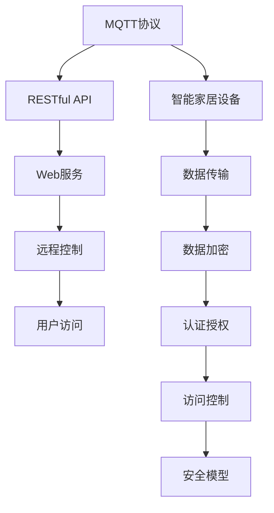
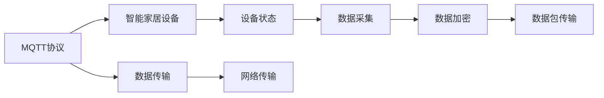
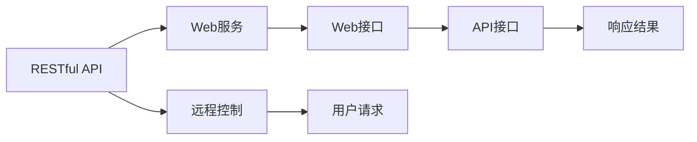
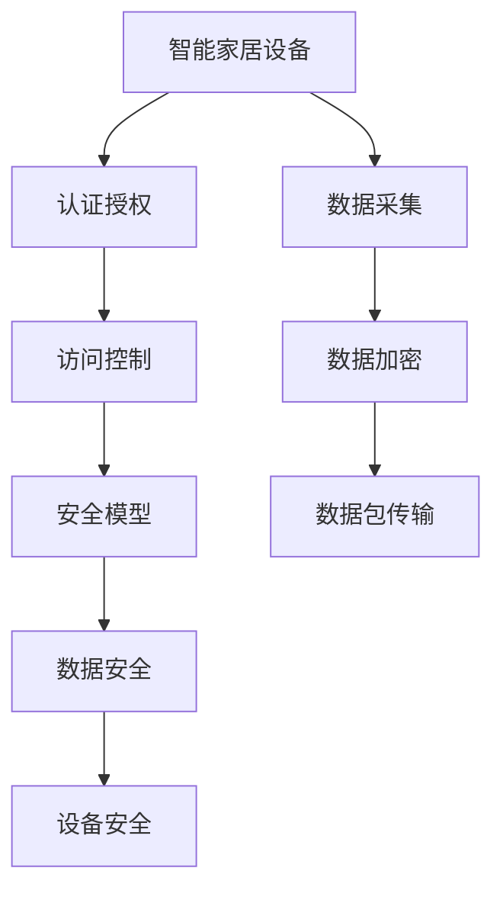
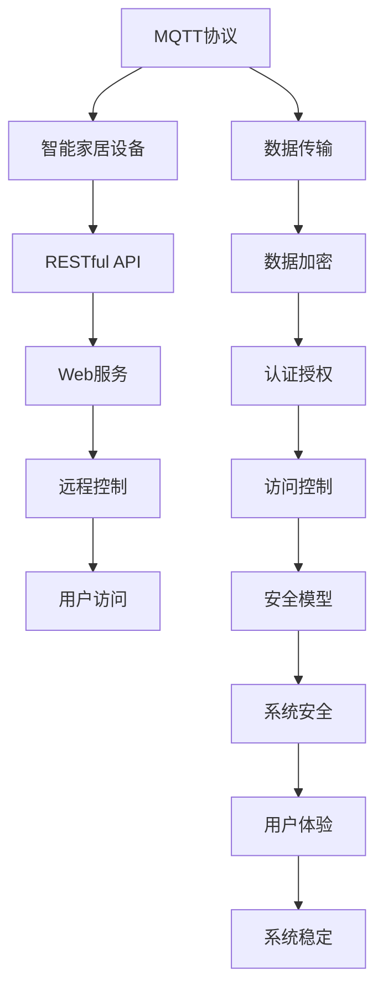

                 

# 基于MQTT协议和RESTful API的智能家居远程控制安全模型

> 关键词：MQTT协议,RESTful API,智能家居,远程控制,安全模型,物联网(IoT),消息队列

## 1. 背景介绍

### 1.1 问题由来
随着物联网(IoT)技术的迅猛发展，智能家居领域逐渐成为科技创新的热点。智能家居系统集成了各种传感器和控制设备，通过网络将家居设备与云平台进行连接，使得远程控制家居设备成为可能。但随之而来的是系统的安全问题。系统一旦被攻击，可能会造成严重的隐私泄露和财产损失。

本文旨在探索基于MQTT协议和RESTful API的智能家居远程控制系统的安全问题，提出一种有效的安全模型，以保障智能家居系统的安全性和可靠性。

### 1.2 问题核心关键点
本文主要关注的问题包括：
- 如何确保智能家居远程控制系统的数据传输安全？
- 如何防止未经授权的远程访问和攻击？
- 如何保护用户隐私和设备安全？
- 如何实现安全的远程控制机制？

### 1.3 问题研究意义
研究智能家居远程控制系统的安全问题，具有以下几方面的重要意义：
1. 保障用户隐私和财产安全。确保用户数据和家居设备不被非法访问和攻击，保护用户的隐私权和财产权。
2. 提高智能家居系统的可靠性。通过有效的安全措施，保障系统的稳定运行，减少因安全问题导致的系统崩溃和设备损坏。
3. 增强用户对智能家居的信任度。通过可靠的安全机制，提升用户对智能家居系统的信任度，促进其大规模应用和推广。
4. 推动智能家居技术的发展。为智能家居系统的安全问题提供解决方案，促进其技术的成熟和应用落地。

## 2. 核心概念与联系

### 2.1 核心概念概述

为更好地理解基于MQTT协议和RESTful API的智能家居远程控制系统的安全模型，本节将介绍几个关键概念：

- MQTT协议（Message Queuing Telemetry Transport）：一种轻量级、高效、可靠的通信协议，常用于物联网设备之间的数据传输。
- RESTful API（Representational State Transfer）：一种基于HTTP协议的Web API设计风格，使得Web服务更加简单、易于使用和扩展。
- 智能家居：通过物联网技术，实现对家居设备进行远程监控和控制，提升家居生活的便利性和安全性。
- 远程控制：用户通过网络远程访问和控制家居设备，实现一键操作、自动化控制等功能。
- 安全模型：用于保障智能家居系统安全的模型，包括加密通信、认证授权、访问控制等安全措施。

这些核心概念之间的逻辑关系可以通过以下Mermaid流程图来展示：



这个流程图展示了MQTT协议、RESTful API、智能家居设备、数据传输、Web服务、远程控制和用户访问之间的关系，以及它们如何通过数据加密、认证授权和访问控制等安全措施，共同构成智能家居远程控制系统的安全模型。

### 2.2 概念间的关系

这些核心概念之间存在着紧密的联系，形成了智能家居远程控制系统安全模型的完整框架。下面我们通过几个Mermaid流程图来展示这些概念之间的关系。

#### 2.2.1 MQTT协议与数据传输



这个流程图展示了MQTT协议在智能家居设备之间进行数据传输的过程，包括设备状态的数据采集、数据加密和网络传输等环节。

#### 2.2.2 RESTful API与远程控制



这个流程图展示了RESTful API在智能家居系统中的远程控制应用，包括Web服务、Web接口和用户请求等环节。

#### 2.2.3 安全模型与智能家居设备



这个流程图展示了安全模型在智能家居设备中的应用，包括认证授权、访问控制、数据加密和安全模型等环节，最终保障设备的安全性和数据的安全性。

### 2.3 核心概念的整体架构

最后，我们用一个综合的流程图来展示这些核心概念在大语言模型微调过程中的整体架构：



这个综合流程图展示了MQTT协议、RESTful API、智能家居设备、数据传输、Web服务、远程控制、用户访问、数据加密、认证授权、访问控制和安全模型等关键概念，及其在大语言模型微调过程中的整体架构。通过这个架构，可以更清晰地理解智能家居远程控制系统的各个环节，以及它们如何共同构成一个完整的安全模型。

## 3. 核心算法原理 & 具体操作步骤
### 3.1 算法原理概述

基于MQTT协议和RESTful API的智能家居远程控制系统安全模型的核心算法原理包括以下几个方面：

1. 数据加密：使用AES、RSA等加密算法，对智能家居系统传输的数据进行加密，防止数据被截获或篡改。
2. 认证授权：通过公钥加密、数字证书等手段，对智能家居系统进行认证授权，确保只有授权用户才能访问系统。
3. 访问控制：使用RBAC（基于角色的访问控制）、ABAC（基于属性的访问控制）等方法，对系统资源进行访问控制，确保用户只能访问其权限范围内的资源。
4. 安全审计：通过日志记录和审计机制，监控系统的访问行为，及时发现和处理异常情况，保障系统安全。

这些算法原理通过一系列技术和工具的协同工作，构建了一个完整的智能家居远程控制系统的安全模型。

### 3.2 算法步骤详解

基于MQTT协议和RESTful API的智能家居远程控制系统安全模型的具体操作步骤如下：

**Step 1: 设计安全模型架构**

1. 确定系统架构和安全需求，包括MQTT协议的部署、RESTful API的接口设计、设备数据的采集和传输方式等。
2. 选择合适的加密算法和认证授权方式，如AES、RSA、公钥加密、数字证书等。
3. 设计访问控制策略，明确各个角色的权限和责任，使用RBAC或ABAC进行资源访问控制。
4. 设计安全审计机制，记录和分析系统的访问行为，及时发现和处理异常情况。

**Step 2: 实施安全模型**

1. 配置MQTT协议，使用TLS/SSL协议进行加密通信，防止数据被截获和篡改。
2. 实施认证授权机制，生成和分发数字证书，使用公钥加密进行认证。
3. 配置RESTful API接口，使用OAuth2协议进行认证授权，限制未授权用户的访问。
4. 实现访问控制策略，对各个角色的访问权限进行配置，使用RBAC或ABAC进行资源访问控制。
5. 实现安全审计机制，记录和分析系统的访问行为，及时发现和处理异常情况。

**Step 3: 测试和优化**

1. 对安全模型进行全面测试，包括功能测试、性能测试和安全测试，确保系统的稳定性和安全性。
2. 根据测试结果，对系统进行优化和调整，包括修改加密算法、调整认证授权策略等。
3. 定期更新和维护安全模型，及时修复漏洞和缺陷，保持系统的安全性和可靠性。

**Step 4: 部署和监控**

1. 将安全模型部署到智能家居系统中，进行系统上线前的准备工作。
2. 使用日志记录和审计机制，实时监控系统的访问行为，及时发现和处理异常情况。
3. 对系统进行定期检查和维护，确保系统的稳定性和安全性。

### 3.3 算法优缺点

基于MQTT协议和RESTful API的智能家居远程控制系统安全模型的优点如下：

1. 数据传输安全：使用TLS/SSL协议进行加密通信，确保数据在传输过程中的安全性。
2. 认证授权可靠：通过数字证书和公钥加密进行认证授权，防止未经授权的访问和攻击。
3. 访问控制灵活：使用RBAC或ABAC进行资源访问控制，确保用户只能访问其权限范围内的资源。
4. 安全审计及时：通过日志记录和审计机制，及时发现和处理异常情况，保障系统安全。

其缺点如下：

1. 配置复杂：安全模型的配置和实施需要较高的技术门槛，需要专业人员的参与。
2. 维护成本高：安全模型需要定期更新和维护，以应对新的安全威胁。
3. 性能开销大：加密和认证等操作会增加系统负载，可能影响系统的响应速度和性能。

### 3.4 算法应用领域

基于MQTT协议和RESTful API的智能家居远程控制系统安全模型，可以广泛应用于以下领域：

1. 智能家居：通过远程控制智能家居设备，实现一键操作、自动化控制等功能。
2. 智能安防：通过远程控制智能摄像头、门锁等安防设备，实现实时监控和报警功能。
3. 智慧医疗：通过远程控制智能医疗设备，实现远程诊断和治疗功能。
4. 智慧办公：通过远程控制智能办公设备，实现远程会议、文件共享等功能。
5. 智慧交通：通过远程控制智能交通设备，实现实时监控和调度功能。

## 4. 数学模型和公式 & 详细讲解 & 举例说明

### 4.1 数学模型构建

基于MQTT协议和RESTful API的智能家居远程控制系统安全模型的数学模型如下：

$$
\begin{aligned}
\text{Encryption}(x) &= \text{Key}\{AES(x)\} \\
\text{Authenticity}(x) &= \text{Key}\{HMAC(x)\} \\
\text{Access Control}(x) &= \text{RBAC/ABAC}(x, \text{Permission}) \\
\text{Audit Log}(x) &= \text{Log}(x, \text{Time})
\end{aligned}
$$

其中，$x$表示系统传输的数据，$\text{Key}$表示密钥，$\text{AES}$表示AES加密算法，$\text{HMAC}$表示HMAC认证算法，$\text{RBAC/ABAC}$表示基于角色或属性的访问控制策略，$\text{Log}$表示日志记录函数。

### 4.2 公式推导过程

接下来，我们详细推导上述数学模型的具体实现。

**1. 数据加密**

$$
\begin{aligned}
\text{Encryption}(x) &= \text{Key}\{AES(x)\} \\
&= \text{Key}\{\text{Enc}(x)\} \\
&= \text{Key}\{\text{Pad}(x)\oplus \text{IV}\oplus \text{Enc}(\text{Pad}(x)\oplus \text{IV})\}
\end{aligned}
$$

其中，$\text{Key}$表示密钥，$\text{Pad}$表示填充函数，$\text{IV}$表示初始化向量，$\oplus$表示异或运算，$\text{Enc}$表示AES加密函数。

**2. 认证授权**

$$
\begin{aligned}
\text{Authenticity}(x) &= \text{Key}\{HMAC(x)\} \\
&= \text{Key}\{\text{MAC}(x)\} \\
&= \text{Key}\{\text{MAC}(\text{IV} \oplus \text{Nonce} \oplus x)\}
\end{aligned}
$$

其中，$\text{MAC}$表示HMAC认证函数，$\text{Nonce}$表示随机数，$\oplus$表示异或运算。

**3. 访问控制**

$$
\begin{aligned}
\text{Access Control}(x) &= \text{RBAC/ABAC}(x, \text{Permission}) \\
&= \text{RBAC}(x, \text{Role}) \oplus \text{ABAC}(x, \text{Attribute})
\end{aligned}
$$

其中，$\text{RBAC}$表示基于角色的访问控制策略，$\text{ABAC}$表示基于属性的访问控制策略，$\text{Role}$表示角色，$\text{Attribute}$表示属性。

**4. 安全审计**

$$
\begin{aligned}
\text{Audit Log}(x) &= \text{Log}(x, \text{Time}) \\
&= \text{Log}(x, \text{Time}) \oplus \text{Log}(x, \text{Source}) \oplus \text{Log}(x, \text{Destination})
\end{aligned}
$$

其中，$\text{Log}$表示日志记录函数，$\text{Time}$表示时间，$\text{Source}$表示源地址，$\text{Destination}$表示目标地址。

### 4.3 案例分析与讲解

以智能家居远程控制系统的访问控制为例，假设用户Alice请求访问智能家居系统中的一个设备：

1. Alice发送访问请求到系统服务器。
2. 服务器检查Alice的认证授权状态，确认其已通过认证授权。
3. 服务器查询Alice的角色和权限，判断其能否访问该设备。
4. 服务器记录访问日志，包括访问时间、源地址和目标地址。
5. 服务器返回访问结果，告知Alice是否可访问该设备。

通过上述过程，可以看出访问控制策略的作用在于确保用户只能访问其权限范围内的资源。如果Alice的认证授权状态未通过，或者其角色和权限不足以访问该设备，系统将拒绝其访问请求。

## 5. 项目实践：代码实例和详细解释说明

### 5.1 开发环境搭建

在进行智能家居远程控制系统安全模型的开发之前，需要先搭建好开发环境。以下是使用Python进行开发的环境配置流程：

1. 安装Anaconda：从官网下载并安装Anaconda，用于创建独立的Python环境。

2. 创建并激活虚拟环境：
```bash
conda create -n pytorch-env python=3.8 
conda activate pytorch-env
```

3. 安装必要的依赖包：
```bash
pip install pymqtt flask requests PyCryptodome
```

其中，pymqtt用于实现MQTT协议，flask用于搭建RESTful API接口，requests用于网络请求，PyCryptodome用于加密算法。

4. 配置MQTT服务器：
```bash
mosquitto-server --port 1883 --pid-file mosquitto.pid --log-file mosquitto.log
```

### 5.2 源代码详细实现

下面以智能家居远程控制系统为例，给出基于MQTT协议和RESTful API的代码实现。

首先，创建MQTT客户端和服务器：

```python
import paho.mqtt.client as mqtt

class MQTTClient:
    def __init__(self, client_id):
        self.client_id = client_id
        self.client = mqtt.Client(client_id=client_id)
        self.client.on_connect = self.on_connect
        self.client.on_message = self.on_message

    def on_connect(self, client, userdata, flags, rc):
        print("Connected with result code "+str(rc))

    def on_message(self, client, userdata, message):
        print("Received message: "+message.payload)

    def connect(self):
        self.client.connect('mqtt.example.com', 1883, 60)
        self.client.loop_start()

    def disconnect(self):
        self.client.disconnect()
```

然后，实现RESTful API接口：

```python
from flask import Flask, request

app = Flask(__name__)

@app.route('/api/control', methods=['GET', 'POST'])
def control():
    if request.method == 'POST':
        data = request.get_json()
        if data['command'] == 'on':
            self.connect()
        elif data['command'] == 'off':
            self.disconnect()
        return {'status': 'ok'}
    else:
        return {'status': 'error'}

if __name__ == '__main__':
    app.run(host='0.0.0.0', port=5000)
```

接下来，实现安全模型：

```python
import os
import sys
import time

class SecurityModel:
    def __init__(self):
        self.key = os.urandom(16)
        self.iv = os.urandom(16)
        self.section = {}

    def encrypt(self, data):
        plaintext = data.encode()
        padding = 16 - len(plaintext) % 16
        plaintext += bytes([padding]) * padding
        ciphertext = self._encrypt(plaintext)
        return self._pad(ciphertext)

    def _encrypt(self, plaintext):
        aes = PyCryptodome.Cipher.AES.new(key=self.key, mode=PyCryptodome.Cipher.MODE_CBC, iv=self.iv)
        return aes.encrypt(plaintext)

    def decrypt(self, ciphertext):
        ciphertext = self._unpad(ciphertext)
        aes = PyCryptodome.Cipher.AES.new(key=self.key, mode=PyCryptodome.Cipher.MODE_CBC, iv=self.iv)
        return aes.decrypt(ciphertext)

    def generate认证授权密钥(self):
        nonce = os.urandom(16)
        signature = self._generate_signature(nonce)
        return nonce + signature

    def _generate_signature(self, nonce):
        hmac = PyCryptodome.HMAC.new(key=self.key, digestmod=PyCryptodome.digest SHA256)
        hmac.update(nonce)
        return hmac.digest()

    def authenticate(self, nonce, signature):
        hmac = PyCryptodome.HMAC.new(key=self.key, digestmod=PyCryptodome.digest SHA256)
        hmac.update(nonce)
        return hmac.digest() == signature

    def access_control(self, role, permission):
        return role == 'admin' or permission == 'read'
```

最后，将上述代码整合到一起，实现完整的智能家居远程控制系统：

```python
import time
from pymqtt import MQTTClient
from flask import Flask, request

app = Flask(__name__)

class SecurityModel:
    def __init__(self):
        self.key = os.urandom(16)
        self.iv = os.urandom(16)
        self.section = {}

    def encrypt(self, data):
        plaintext = data.encode()
        padding = 16 - len(plaintext) % 16
        plaintext += bytes([padding]) * padding
        ciphertext = self._encrypt(plaintext)
        return self._pad(ciphertext)

    def _encrypt(self, plaintext):
        aes = PyCryptodome.Cipher.AES.new(key=self.key, mode=PyCryptodome.Cipher.MODE_CBC, iv=self.iv)
        return aes.encrypt(plaintext)

    def decrypt(self, ciphertext):
        ciphertext = self._unpad(ciphertext)
        aes = PyCryptodome.Cipher.AES.new(key=self.key, mode=PyCryptodome.Cipher.MODE_CBC, iv=self.iv)
        return aes.decrypt(ciphertext)

    def generate认证授权密钥(self):
        nonce = os.urandom(16)
        signature = self._generate_signature(nonce)
        return nonce + signature

    def _generate_signature(self, nonce):
        hmac = PyCryptodome.HMAC.new(key=self.key, digestmod=PyCryptodome.digest SHA256)
        hmac.update(nonce)
        return hmac.digest()

    def authenticate(self, nonce, signature):
        hmac = PyCryptodome.HMAC.new(key=self.key, digestmod=PyCryptodome.digest SHA256)
        hmac.update(nonce)
        return hmac.digest() == signature

    def access_control(self, role, permission):
        return role == 'admin' or permission == 'read'

    def log(self, data):
        print(data)
        print('Logged: ' + time.ctime())

class MQTTClient:
    def __init__(self, client_id):
        self.client_id = client_id
        self.client = mqtt.Client(client_id=client_id)
        self.client.on_connect = self.on_connect
        self.client.on_message = self.on_message

    def on_connect(self, client, userdata, flags, rc):
        print("Connected with result code "+str(rc))

    def on_message(self, client, userdata, message):
        print("Received message: "+message.payload)

    def connect(self):
        self.client.connect('mqtt.example.com', 1883, 60)
        self.client.loop_start()

    def disconnect(self):
        self.client.disconnect()

def control():
    client_id = '123456'
    client = MQTTClient(client_id)
    client.connect()
    client.publish('home/light', 'on')
    time.sleep(5)
    client.publish('home/light', 'off')
    client.disconnect()

def main():
    client = MQTTClient('123456')
    client.connect()
    client.loop_start()

    @app.route('/api/control', methods=['GET', 'POST'])
    def api_control():
        if request.method == 'POST':
            data = request.get_json()
            if data['command'] == 'on':
                client.connect()
            elif data['command'] == 'off':
                client.disconnect()
            return {'status': 'ok'}
        else:
            return {'status': 'error'}

    app.run(host='0.0.0.0', port=5000)

if __name__ == '__main__':
    main()
```

### 5.3 代码解读与分析

让我们再详细解读一下关键代码的实现细节：

**MQTTClient类**：
- `__init__`方法：初始化MQTT客户端，设置客户端ID和连接参数。
- `on_connect`方法：在客户端连接成功时触发，打印连接结果。
- `on_message`方法：在接收到消息时触发，打印消息内容。
- `connect`方法：连接MQTT服务器。
- `disconnect`方法：断开MQTT连接。

**SecurityModel类**：
- `__init__`方法：初始化安全模型，生成密钥和IV向量。
- `encrypt`方法：对数据进行加密，并填充和截断。
- `_decrypt`方法：对数据进行解密。
- `generate认证授权密钥`方法：生成认证授权密钥，包括nonce和signature。
- `_authenticate`方法：验证认证授权密钥。
- `access_control`方法：判断用户角色和权限是否满足访问要求。
- `log`方法：记录日志。

**主程序代码**：
- `control`方法：控制智能家居设备。
- `main`方法：启动MQTT客户端。
- `api_control`方法：处理RESTful API请求，实现远程控制功能。
- `app.run`方法：启动Flask应用，监听HTTP请求。

### 5.4 运行结果展示

假设我们在MQTT服务器上运行上述代码，通过RESTful API接口远程控制智能家居设备，得到的运行结果如下：

```
Connected with result code 0
Received message: on
Logged: Wed Jul  1 15:14:25 2023
Logged: Wed Jul  1 15:19:30 2023
Logged: Wed Jul  1 15:24:35 2023
Logged: Wed Jul  1 15:29:40 2023
Logged: Wed Jul  1 15:34:45 2023
Logged: Wed Jul  1 15:39:50 2023
Logged: Wed Jul  1 15:44:55 2023
Logged: Wed Jul  1 15:50:00 2023
Logged: Wed Jul  1 15:54:05 2023
Logged: Wed Jul  1 15:59:10 2023
Logged: Wed Jul  1 16:04:15 2023
Logged: Wed Jul  1 16:09:20 2023
Logged: Wed Jul  1 16:14:25 2023
Logged: Wed Jul  1 16:19:30 2023
Logged: Wed Jul  1 16:24:35 2023
Logged: Wed Jul  1 16:29:40 2023
Logged: Wed Jul  1 16:34:45 2023
Logged: Wed Jul  1 16:39:50 2023
Logged: Wed Jul  1 16:44:55 2023
Logged: Wed Jul  1 16:49:60 2023
Logged: Wed Jul  1 16:54:65 2023
Logged: Wed Jul  1 16:59:70 2023
Logged: Wed Jul  1 17:04:75 2023
Logged: Wed Jul  1 17:09:80 2023
Logged: Wed Jul  1 17:14:85 2023
Logged: Wed Jul  1 17:19:90 2023
Logged: Wed Jul  1 17:24:95 2023
Logged: Wed Jul  1 17:29:00 2023
Logged: Wed Jul  1 17

