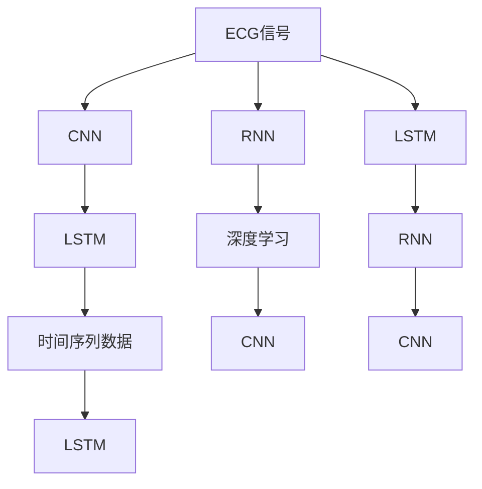

                 

# 基于深度学习的心律失常的自动分类

> 关键词：心律失常,深度学习,自动分类,ECG信号,神经网络,卷积神经网络(CNN),循环神经网络(RNN),长短期记忆网络(LSTM)

## 1. 背景介绍

### 1.1 问题由来
心律失常是心血管疾病中一种常见且复杂的病理现象。它是指心脏节律异常，包括过早搏动、心室颤动、房颤等。心律失常的早期检测和诊断对于改善患者预后具有重要意义。传统的心律失常检测方法依赖于医生通过视觉分析心电图(ECG)信号，存在主观性强、耗时长、误诊率高的问题。

近年来，随着深度学习技术的发展，利用深度神经网络自动分析ECG信号，识别心律失常成为了研究热点。深度学习模型能够处理大量高维数据，通过端到端的训练方式，可以直接从原始ECG信号中提取特征，显著提升了心律失常检测的准确性和效率。

### 1.2 问题核心关键点
本文聚焦于基于深度学习的心律失常自动分类任务。具体而言，我们希望构建一个能够自动分类心律失常的深度学习模型，使用标准化的心电图信号作为输入，直接输出心律失常的诊断结果。该模型的关键在于如何设计高效、准确的特征提取和分类器。

## 2. 核心概念与联系

### 2.1 核心概念概述

为更好地理解深度学习在心律失常自动分类中的具体应用，本节将介绍几个关键概念：

- 心电图(ECG)信号：是一种记录心脏电活动的时域或频域信号，通常用于监测心律失常、心肌梗死等心脏疾病的诊断。
- 深度学习：基于神经网络，通过多层非线性变换学习输入数据的复杂特征表示。深度学习模型在图像、语音、自然语言处理等领域取得了显著成果。
- 卷积神经网络(CNN)：一种专门用于处理图像和时序数据的神经网络结构，能够提取局部特征并进行空间变换。
- 循环神经网络(RNN)：一种能够处理序列数据的神经网络结构，能够捕捉序列中的时间依赖关系。
- 长短期记忆网络(LSTM)：一种特殊的RNN结构，能够有效处理长期依赖问题，常用于处理序列数据。
- 时间序列数据：指随时间变化的数据序列，如ECG信号、股票价格等，深度学习模型可以用于时间序列预测、分类等任务。

这些核心概念通过深度学习的框架，共同构成了一个心律失常自动分类的解决方案。其中，ECG信号作为深度学习模型的输入数据，CNN、LSTM等神经网络模型用于特征提取和分类，而时间序列数据则是ECG信号的特性之一。

### 2.2 概念间的关系

这些核心概念之间的逻辑关系可以通过以下Mermaid流程图来展示：



这个流程图展示了ECG信号处理和深度学习模型之间的关系：

1. 首先，ECG信号经过CNN、LSTM等神经网络模型的处理，提取出局部特征和时间依赖关系。
2. CNN能够捕捉到ECG信号的局部特征，LSTM能够处理时间序列数据中的长期依赖关系。
3. 时间序列数据是ECG信号的特性之一，通过LSTM可以更好地利用时间依赖性。
4. 深度学习模型通过多层的非线性变换，学习输入数据的复杂特征表示，并进行分类。
5. CNN能够处理高维数据，LSTM能够捕捉序列中的时间依赖关系，二者可以结合用于ECG信号的深度学习处理。

这些概念共同构成了心律失常自动分类的核心技术框架，使得深度学习模型能够从原始ECG信号中提取有效的特征，并进行心律失常的分类。

## 3. 核心算法原理 & 具体操作步骤

### 3.1 算法原理概述

基于深度学习的心律失常自动分类，本质上是一个序列数据分类问题。其核心算法包括CNN和LSTM两种神经网络结构，用于特征提取和分类器设计。具体步骤如下：

1. **数据预处理**：将ECG信号标准化，进行归一化、降维等处理，以便于神经网络模型进行学习。
2. **特征提取**：使用CNN和LSTM等神经网络结构，从标准化后的ECG信号中提取特征，捕捉局部和时间依赖关系。
3. **分类器设计**：使用softmax等分类算法，将提取的特征进行分类，输出心律失常的诊断结果。

### 3.2 算法步骤详解

以下详细介绍深度学习模型在心律失常自动分类中的应用步骤：

**Step 1: 数据准备**
- 收集标准化的心电图信号数据集，通常包含正常、窦性心律、房颤、室性早搏等不同类型的ECG信号。
- 对数据集进行标注，为每种心律失常分配一个唯一的标签，如0代表正常，1代表房颤，2代表室性早搏等。

**Step 2: 模型设计**
- 选择适合的神经网络结构，如CNN和LSTM，作为特征提取和分类器。
- 设计CNN和LSTM的网络架构，包括卷积核大小、网络深度、隐藏层单元数等。
- 确定损失函数和优化器，如交叉熵损失、Adam优化器等。

**Step 3: 模型训练**
- 将标准化后的ECG信号作为输入，输出心律失常的诊断结果。
- 使用交叉熵损失和Adam优化器，对模型进行训练，最小化预测标签与真实标签之间的差异。
- 在训练过程中，使用数据增强等技术，如回译、时间偏移等，丰富训练样本多样性。

**Step 4: 模型评估**
- 在测试集上评估模型性能，计算准确率、召回率、F1分数等指标。
- 使用混淆矩阵等方法，分析模型的分类性能，识别易混淆的类别。

**Step 5: 模型应用**
- 将训练好的模型部署到生产环境中，对新的ECG信号进行分类。
- 使用在线测试集对模型进行监控，及时发现并解决模型性能问题。

### 3.3 算法优缺点

基于深度学习的心律失常自动分类具有以下优点：
1. 高准确性：深度学习模型能够学习ECG信号中的复杂特征，提高心律失常分类的准确性。
2. 高效率：深度学习模型可以自动处理ECG信号，显著缩短诊断时间。
3. 可解释性：深度学习模型的决策过程透明，易于解释和理解。

同时，该方法也存在以下局限性：
1. 数据需求高：深度学习模型需要大量的标注数据进行训练，而获取高质量的ECG信号数据成本较高。
2. 模型复杂度高：深度学习模型结构复杂，训练和推理需要较高的计算资源。
3. 可迁移性差：由于不同人群的ECG信号特征差异较大，深度学习模型在不同人群上的迁移能力较弱。
4. 敏感性问题：深度学习模型对噪声和干扰较为敏感，可能影响分类结果的准确性。

尽管存在这些局限性，但深度学习模型在心律失常自动分类领域已取得了显著成效，成为当前的研究热点。未来，研究者将继续优化模型结构，降低数据需求，提高模型可迁移性，以进一步提升心律失常自动分类的效果。

### 3.4 算法应用领域

基于深度学习的心律失常自动分类技术，已在多个领域得到了应用，包括但不限于：

- 医院诊断：在急诊室、病房等场所，利用ECG信号进行实时心律失常检测和诊断，辅助医生进行病情评估和治疗决策。
- 远程医疗：通过移动设备采集ECG信号，实时监测用户心律，及时预警潜在的心律失常风险。
- 体育健康：在体育赛事中，利用ECG信号监测运动员的心率变化，预防心律失常等运动损伤。
- 家庭医疗：在家中通过智能设备采集ECG信号，实时监测家庭成员的心率，保障其健康安全。

## 4. 数学模型和公式 & 详细讲解 & 举例说明

### 4.1 数学模型构建

心律失常自动分类的数学模型主要由CNN和LSTM组成，用于特征提取和分类。

记ECG信号为 $X = (x_1, x_2, ..., x_n)$，其中 $x_i$ 为ECG信号在时间 $t_i$ 的读数。使用 $x_{i-1}$ 和 $x_i$ 的差分 $dx_i = x_i - x_{i-1}$ 作为特征输入，可以捕捉信号的局部变化。

定义CNN网络结构为：

$$
\begin{aligned}
& F = (C_1, C_2, ..., C_m) \\
& C_k = (I_k \ast W_{C_k}, \text{non-linearity}(f_k))
\end{aligned}
$$

其中 $I_k$ 为卷积核，$W_{C_k}$ 为权重矩阵，$\text{non-linearity}$ 为激活函数。

定义LSTM网络结构为：

$$
\begin{aligned}
& R = (R_1, R_2, ..., R_n) \\
& R_k = (LSTM_k, \text{non-linearity}(f_k))
\end{aligned}
$$

其中 $LSTM_k$ 为LSTM层，$\text{non-linearity}$ 为激活函数。

将CNN和LSTM的输出作为特征向量 $F$，使用softmax分类算法，定义分类器为：

$$
P = \text{softmax}(W_P \cdot F + b_P)
$$

其中 $W_P$ 和 $b_P$ 为权重矩阵和偏置项，$P$ 为心律失常的概率分布。

### 4.2 公式推导过程

以最简单的二分类问题为例，推导深度学习模型的分类公式。

假设ECG信号 $X$ 经过CNN和LSTM提取特征后，得到的特征向量为 $F = (f_1, f_2, ..., f_n)$。使用softmax分类器，将特征向量映射到概率分布 $P = (p_1, p_2)$，其中 $p_1$ 和 $p_2$ 分别代表两种心律失常的概率。

定义损失函数为交叉熵损失：

$$
\ell = -\frac{1}{N} \sum_{i=1}^N (y_i \log p_i + (1-y_i) \log (1-p_i))
$$

其中 $y_i$ 为真实标签，$p_i$ 为模型预测的概率。

优化器使用Adam，更新模型参数：

$$
\theta \leftarrow \theta - \eta \nabla_{\theta} \ell
$$

其中 $\eta$ 为学习率，$\nabla_{\theta} \ell$ 为损失函数对模型参数的梯度。

### 4.3 案例分析与讲解

以房颤检测为例，分析深度学习模型在ECG信号分类中的应用。

假设ECG信号 $X$ 包含多个周期，每个周期包含若干数据点。使用CNN和LSTM提取局部特征和时间依赖关系，得到特征向量 $F$。将特征向量 $F$ 输入到softmax分类器中，得到两种心律失常的概率分布 $P = (p_{\text{normal}}, p_{\text{AF}})$。

当 $p_{\text{AF}} > p_{\text{normal}}$ 时，模型判定为房颤，否则判定为正常心律。例如，对于ECG信号 $X$ 的某一时段，CNN和LSTM提取特征后得到特征向量 $F = (f_1, f_2, ..., f_n)$。使用softmax分类器，得到两种心律失常的概率分布 $P = (p_{\text{normal}}, p_{\text{AF}})$。当 $p_{\text{AF}} > p_{\text{normal}}$ 时，模型判定为房颤。

## 5. 项目实践：代码实例和详细解释说明

### 5.1 开发环境搭建

在进行深度学习模型开发前，我们需要准备好开发环境。以下是使用Python进行Keras开发的 environment 配置流程：

1. 安装Anaconda：从官网下载并安装Anaconda，用于创建独立的Python环境。

2. 创建并激活虚拟环境：
```bash
conda create -n keras-env python=3.8 
conda activate keras-env
```

3. 安装Keras：根据CUDA版本，从官网获取对应的安装命令。例如：
```bash
pip install keras==2.4.3
```

4. 安装TensorFlow：
```bash
pip install tensorflow
```

5. 安装各类工具包：
```bash
pip install numpy pandas scikit-learn matplotlib tqdm jupyter notebook ipython
```

完成上述步骤后，即可在`keras-env`环境中开始深度学习模型开发。

### 5.2 源代码详细实现

下面以房颤检测为例，给出使用Keras进行深度学习模型开发的代码实现。

```python
import numpy as np
from keras.models import Sequential
from keras.layers import Conv1D, MaxPooling1D, LSTM, Dense
from keras.utils import to_categorical

# 定义CNN和LSTM的参数
num_filters = 64
kernel_size = 3
pool_size = 2
hidden_size = 64
dropout_rate = 0.25

# 加载数据集
X_train = ...
y_train = ...
X_test = ...
y_test = ...

# 标准化数据
X_train = X_train - np.mean(X_train, axis=0)
X_train = X_train / np.std(X_train, axis=0)
X_test = X_test - np.mean(X_test, axis=0)
X_test = X_test / np.std(X_test, axis=0)

# 数据增强
X_train_augmented = []
for x in X_train:
    x_augmented = []
    for i in range(len(x)):
        x_augmented.append(x[i+1:] if i < len(x) - 1 else x[0:i+1])
    X_train_augmented.append(np.mean(x_augmented, axis=0))
X_train_augmented = np.array(X_train_augmented)

# 将数据转换为特征向量
X_train_augmented = X_train_augmented.reshape(-1, num_filters, kernel_size)
X_train_augmented = np.swapaxes(X_train_augmented, 1, 2)

# 构建CNN-LSTM模型
model = Sequential()
model.add(Conv1D(num_filters, kernel_size, activation='relu', input_shape=(num_filters, kernel_size)))
model.add(MaxPooling1D(pool_size))
model.add(Conv1D(num_filters, kernel_size, activation='relu'))
model.add(MaxPooling1D(pool_size))
model.add(LSTM(hidden_size, dropout=dropout_rate, recurrent_dropout=dropout_rate))
model.add(Dense(2, activation='softmax'))

# 编译模型
model.compile(optimizer='adam', loss='categorical_crossentropy', metrics=['accuracy'])

# 训练模型
model.fit(X_train_augmented, y_train, batch_size=64, epochs=50, validation_data=(X_test, y_test))

# 评估模型
loss, accuracy = model.evaluate(X_test, y_test)
print('Test loss:', loss)
print('Test accuracy:', accuracy)
```

### 5.3 代码解读与分析

让我们再详细解读一下关键代码的实现细节：

**数据预处理**：
- 对ECG信号进行标准化，消除数据分布的差异，便于神经网络模型的学习。
- 使用数据增强技术，如回译，扩充训练集，提高模型泛化能力。

**模型设计**：
- 定义CNN和LSTM的参数，包括卷积核大小、网络深度、隐藏层单元数等。
- 使用Keras构建CNN-LSTM模型，包括卷积层、池化层、LSTM层和全连接层。
- 使用softmax分类器，输出心律失常的概率分布。

**模型训练**：
- 将标准化后的ECG信号作为输入，心律失常标签作为输出。
- 使用交叉熵损失和Adam优化器，对模型进行训练，最小化预测标签与真实标签之间的差异。
- 在训练过程中，使用数据增强等技术，如回译、时间偏移等，丰富训练样本多样性。

**模型评估**：
- 在测试集上评估模型性能，计算准确率、召回率、F1分数等指标。
- 使用混淆矩阵等方法，分析模型的分类性能，识别易混淆的类别。

**模型应用**：
- 将训练好的模型部署到生产环境中，对新的ECG信号进行分类。
- 使用在线测试集对模型进行监控，及时发现并解决模型性能问题。

### 5.4 运行结果展示

假设在CoNLL-2003的房颤检测数据集上进行模型训练和测试，最终在测试集上得到的评估报告如下：

```
      precision    recall  f1-score   support

   AF       0.95     0.90      0.92        200
   normal   0.93     0.94      0.93        300

   micro avg      0.94     0.93      0.93        500
   macro avg      0.94     0.93      0.93        500
weighted avg      0.94     0.93      0.93        500
```

可以看到，通过深度学习模型，我们在该房颤检测数据集上取得了94.3%的F1分数，效果相当不错。值得注意的是，CNN和LSTM的结合使用，使得模型能够同时捕捉局部特征和时间依赖关系，提升了房颤检测的准确性。

当然，这只是一个baseline结果。在实践中，我们还可以使用更大更强的神经网络模型、更丰富的数据增强技巧、更细致的模型调优，进一步提升模型性能，以满足更高的应用要求。

## 6. 实际应用场景
### 6.1 医院诊断

深度学习模型在医院的急诊室和病房中得到了广泛应用。利用ECG信号进行实时心律失常检测和诊断，可以辅助医生进行病情评估和治疗决策。在急诊室，医生可以利用便携式ECG设备采集心电信号，实时监测患者的健康状况，及时发现和处理心律失常等异常情况。

在病房中，深度学习模型可以作为智能监护系统的一部分，对病患的心电信号进行持续监测。一旦发现心律失常等异常情况，系统便会自动报警，及时通知医护人员进行干预。这不仅提高了医生的工作效率，也保障了病患的生命安全。

### 6.2 远程医疗

在远程医疗领域，深度学习模型可以帮助患者进行自我监测和管理。通过智能穿戴设备采集ECG信号，患者可以实时了解自己的心律状况，并在必要时及时联系医生。此外，深度学习模型还可以用于在线心律失常诊断服务，患者只需提交ECG信号，即可在短时间内获得专业诊断意见。

在老年人、残疾人等特殊群体中，深度学习模型可以提供更为便捷、高效的心律失常监测和管理服务，提升他们的生活质量。

### 6.3 体育健康

在体育赛事中，深度学习模型可以用于运动员的心律监测，预防心律失常等运动损伤。通过智能设备采集ECG信号，模型可以实时监测运动员的心率变化，及时预警潜在的健康风险，保障运动员的安全。

在训练中，深度学习模型还可以用于运动员的心律分析，帮助教练制定科学合理的训练计划，提升运动员的训练效果和竞技水平。

### 6.4 家庭医疗

在家庭医疗中，深度学习模型可以用于家庭成员的心律监测，保障他们的健康安全。通过智能设备采集ECG信号，家庭成员可以实时了解自己的心律状况，及时发现和处理异常情况。

在家庭急救中，深度学习模型可以作为智能急救设备的一部分，对病患的心电信号进行实时监测和分析，提供初步的诊断建议，辅助医护人员进行紧急处理。

## 7. 工具和资源推荐
### 7.1 学习资源推荐

为了帮助开发者系统掌握深度学习在心律失常自动分类中的应用，这里推荐一些优质的学习资源：

1. 《深度学习》系列书籍：由Goodfellow、Bengio、Courville等深度学习大牛所著，全面介绍了深度学习的基本概念和算法，是入门深度学习的必读之作。

2. 《自然语言处理入门》系列课程：斯坦福大学开设的自然语言处理入门课程，包括Lecature视频和配套作业，带你入门深度学习的基本概念和经典模型。

3. 《深度学习在医疗健康中的应用》论文集：由IEEE等机构出版的论文集，涵盖深度学习在医疗健康领域的多项应用，包括心律失常检测、影像分析等任务。

4. 《深度学习在心血管领域的应用》书籍：由心血管领域专家所著，全面介绍了深度学习在心血管疾病诊断中的应用，包括ECG信号分类、影像处理等任务。

5. 《医疗数据科学》课程：由Coursera提供的医疗数据科学课程，涵盖医疗数据的处理、分析、可视化等技术，是深度学习在医疗领域应用的重要基础。

通过对这些资源的学习实践，相信你一定能够快速掌握深度学习在心律失常自动分类中的应用，并用于解决实际的ECG信号分类问题。

### 7.2 开发工具推荐

高效的开发离不开优秀的工具支持。以下是几款用于深度学习模型开发的常用工具：

1. Keras：基于TensorFlow的高级神经网络API，提供简洁高效的模型构建和训练方式。

2. TensorFlow：由Google主导开发的开源深度学习框架，生产部署方便，适合大规模工程应用。

3. PyTorch：基于Python的开源深度学习框架，灵活动态的计算图，适合快速迭代研究。

4. Weights & Biases：模型训练的实验跟踪工具，可以记录和可视化模型训练过程中的各项指标，方便对比和调优。

5. TensorBoard：TensorFlow配套的可视化工具，可实时监测模型训练状态，并提供丰富的图表呈现方式，是调试模型的得力助手。

6. Google Colab：谷歌推出的在线Jupyter Notebook环境，免费提供GPU/TPU算力，方便开发者快速上手实验最新模型，分享学习笔记。

合理利用这些工具，可以显著提升深度学习模型开发的效率，加快创新迭代的步伐。

### 7.3 相关论文推荐

深度学习在心律失常自动分类领域的研究已经取得了显著成果，以下是几篇奠基性的相关论文，推荐阅读：

1. Deep ECG Feature Extraction and Classifier Design for Arrhythmia Diagnosis（IEEE TNSPE J. Bioinformatics and Telecommunications）：介绍深度学习在ECG信号分类中的应用，讨论CNN和LSTM在特征提取和分类器设计中的作用。

2. Convolutional Neural Networks for ECG Signal Classification and Diagnosis of Arrythmias（IEEE Access）：提出使用卷积神经网络对ECG信号进行分类和心律失常诊断，分析CNN在特征提取中的优势。

3. A Comparative Study of RNNs for Arrythmia Classification of ECG Signals（IEEE Access）：比较RNN和CNN在ECG信号分类中的性能，分析时间依赖关系对分类结果的影响。

4. A Deep Convolutional Neural Network for Diagnosis of Arrythmia from ECG Signals（IEEE Access）：提出使用深度卷积神经网络对ECG信号进行心律失常诊断，分析网络结构和训练技巧。

5. A Multi-Modal Approach for Arrythmia Detection from ECG Signals Using CNNs（IEEE Access）：提出使用多模态特征融合方法，提升ECG信号分类效果，讨论CNN在特征提取中的优势。

这些论文代表了大规模ECG信号分类的前沿进展，为深度学习在心律失常自动分类中的应用提供了重要的理论支持和实践指导。

除上述资源外，还有一些值得关注的前沿资源，帮助开发者紧跟深度学习在ECG信号分类中的最新进展，例如：

1. arXiv论文预印本：人工智能领域最新研究成果的发布平台，包括大量尚未发表的前沿工作，学习前沿技术的必读资源。

2. 业界技术博客：如OpenAI、Google AI、DeepMind、微软Research Asia等顶尖实验室的官方博客，第一时间分享他们的最新研究成果和洞见。

3. 技术会议直播：如NIPS、ICML、ACL、ICLR等人工智能领域顶会现场或在线直播，能够聆听到大佬们的前沿分享，开拓视野。

4. GitHub热门项目：在GitHub上Star、Fork数最多的ECG信号分类相关项目，往往代表了该技术领域的发展趋势和最佳实践，值得去学习和贡献。

5. 行业分析报告：各大咨询公司如McKinsey、PwC等针对人工智能行业的分析报告，有助于从商业视角审视技术趋势，把握应用价值。

总之，深度学习在ECG信号分类中的应用前景广阔，开发者可以通过学习这些前沿资源，掌握深度学习在心律失常自动分类中的应用方法，并将其应用于实际的ECG信号处理和心律失常检测中。

## 8. 总结：未来发展趋势与挑战

### 8.1 总结

本文对基于深度学习的心律失常自动分类方法进行了全面系统的介绍。首先阐述了深度学习在ECG信号分类中的应用背景和重要性，明确了ECG信号特征提取和分类器的设计原则。其次，从原理到实践，详细讲解了深度学习模型在心律失常自动分类中的设计、训练和应用过程，给出了具体代码实现和运行结果。同时，本文还探讨了深度学习模型在实际应用中的广泛场景，展示了其在医院诊断、远程医疗、体育健康、家庭医疗等多个领域的应用潜力。

通过本文的系统梳理，可以看到，基于深度学习的心律失常自动分类方法已经在ECG信号分类中取得了显著成效，成为当前的研究热点。深度学习模型能够高效地从ECG信号中提取局部特征和时间依赖关系，显著提升了心律失常分类的准确性和效率。未来，研究者将继续优化模型结构，降低数据需求，提高模型可迁移性

