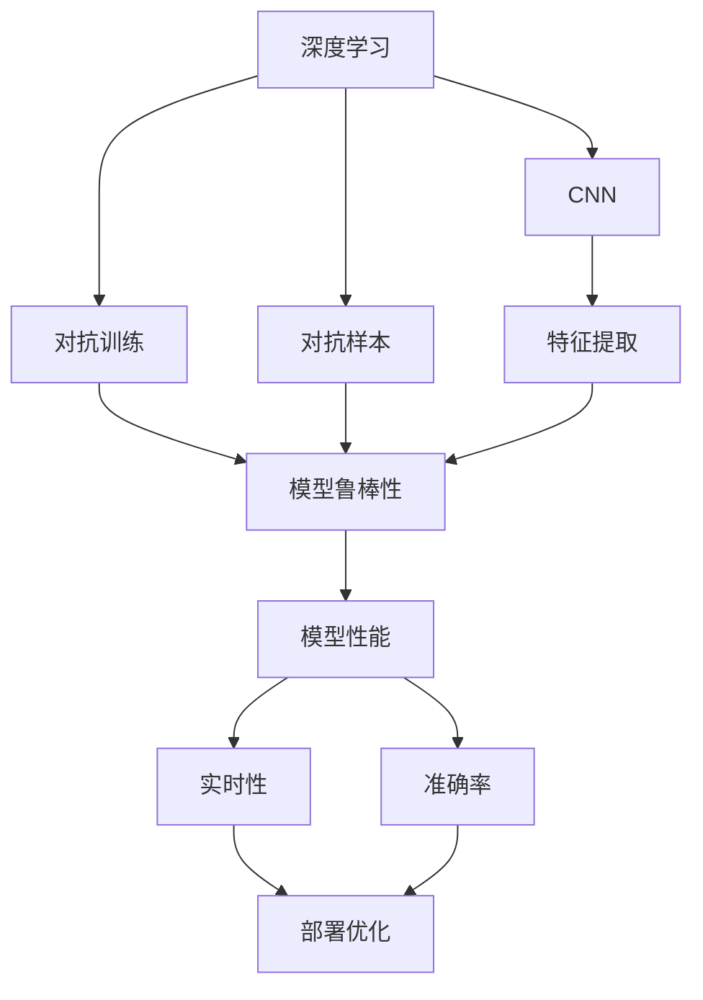
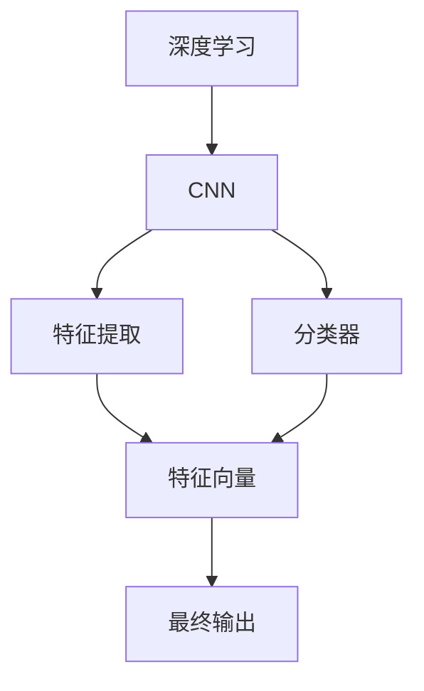
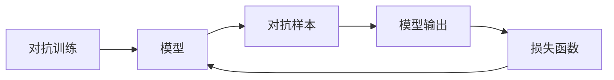
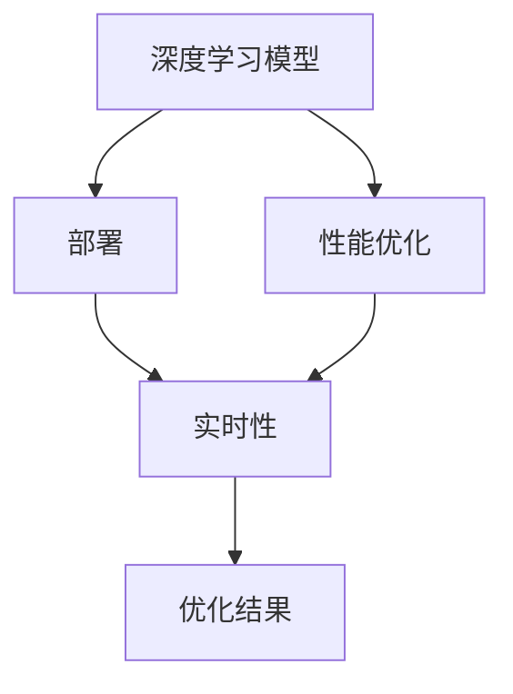

                 

# 基于深度学习的网站验证码识别系统设计与实现

> 关键词：深度学习, 网站验证码, 识别系统, 卷积神经网络(CNN), 对抗训练, 对抗样本

## 1. 背景介绍

### 1.1 问题由来
随着互联网的发展，网站的安全性逐渐成为用户关注的焦点。网站验证码作为一种简单有效的安全机制，被广泛应用于用户注册、登录、购买等关键操作中，可以有效防止机器人攻击，提升网站的用户体验和安全性。

然而，随着验证码技术的不断演变，自动化攻击手段也在不断进步。常见的攻击手段包括：

- 自动化软件识别：如利用OCR技术、机器学习等自动化手段识别验证码。
- 暴力破解：尝试遍历所有可能的验证码字符组合，以暴力破解验证码。
- 分布式攻击：利用多台设备同时发送验证码请求，造成服务器压力。

为了应对这些攻击，验证码的设计也在不断升级。传统的基于图像的验证码逐渐被基于文本、数学和混合的验证码所取代。新的验证码设计增加了破解难度，但也带来了新的挑战：验证码识别的准确率和效率如何兼顾？

## 1.2 问题核心关键点
本文聚焦于基于深度学习的网站验证码识别系统，介绍如何通过卷积神经网络(CNN)等深度学习模型，提高验证码识别的准确率和效率。具体而言，我们将从以下几个方面进行探讨：

- **深度学习模型**：介绍如何利用CNN等深度学习模型，提取验证码图像中的特征，实现对验证码字符的准确识别。
- **对抗训练**：利用对抗训练生成对抗样本，提高模型鲁棒性，防止自动化攻击。
- **部署与优化**：介绍如何将深度学习模型部署到生产环境中，并进行性能优化，保证实时性。

通过解决这些问题，我们希望能够设计出一个高准确率、高效率、高鲁棒性的网站验证码识别系统。

## 1.3 问题研究意义
网站验证码识别系统的设计与实现，对于提升网站安全性、打击自动化攻击具有重要意义：

1. **提升网站安全性**：通过验证码识别，可以有效防止机器人攻击，保护用户隐私和财产安全。
2. **提高用户体验**：快速、准确的验证码识别，可以减少用户等待时间，提升用户体验。
3. **降低维护成本**：自动化的验证码识别系统，减少了人工审核和维护的复杂度和成本。
4. **促进业务发展**：验证码识别系统的成功应用，可以提升网站的信任度和用户粘性，推动业务增长。

总之，设计一个高效、安全的验证码识别系统，对于网站运营和用户体验的提升具有重要价值。

## 2. 核心概念与联系

### 2.1 核心概念概述

为更好地理解深度学习在验证码识别系统中的应用，本节将介绍几个密切相关的核心概念：

- **深度学习**：一种机器学习技术，通过构建多层次的非线性模型，自动提取特征，实现对数据的复杂模式识别。
- **卷积神经网络(CNN)**：一种专门用于图像识别和处理的深度学习模型，利用卷积层和池化层提取图像特征，实现高效的特征提取和分类。
- **对抗训练**：通过引入对抗样本，训练模型对恶意攻击的鲁棒性，提高模型的泛化能力。
- **对抗样本**：通过微小扰动生成的，使模型输出错误结果的样本，用于提高模型鲁棒性。
- **部署与优化**：将深度学习模型部署到生产环境中，并进行优化，保证实时性。

这些核心概念之间的逻辑关系可以通过以下Mermaid流程图来展示：



这个流程图展示了大语言模型微调过程中各个核心概念的关系和作用：

1. 深度学习是基础，通过CNN等模型提取特征。
2. 对抗训练和对抗样本用于提高模型的鲁棒性。
3. 特征提取和模型性能提升目标是模型鲁棒性。
4. 模型鲁棒性提升，保证实时性和准确率。
5. 部署优化实现实时性。

这些概念共同构成了深度学习在验证码识别系统中的应用框架，使其能够有效地解决验证码识别问题。

### 2.2 概念间的关系

这些核心概念之间存在着紧密的联系，形成了深度学习在验证码识别系统中的完整生态系统。下面我通过几个Mermaid流程图来展示这些概念之间的关系。

#### 2.2.1 深度学习模型


这个流程图展示了深度学习模型的一般流程：通过CNN等模型提取图像特征，构建分类器进行分类，生成最终的输出结果。

#### 2.2.2 对抗训练与对抗样本


这个流程图展示了对抗训练的基本流程：通过对抗样本训练模型，提高模型的鲁棒性。

#### 2.2.3 模型部署与优化


这个流程图展示了模型部署与优化的过程：将深度学习模型部署到生产环境中，并根据实时性需求进行优化。

## 3. 核心算法原理 & 具体操作步骤
### 3.1 算法原理概述

深度学习在验证码识别系统中的应用，主要基于卷积神经网络(CNN)。CNN利用卷积层和池化层，从验证码图像中提取特征，并通过全连接层进行分类，实现对验证码字符的识别。

CNN的原理如下：

1. **卷积层**：通过卷积操作提取图像局部特征，降低维度，减少过拟合风险。
2. **池化层**：通过最大池化或平均池化操作，对卷积层的输出进行降维，进一步提高特征的鲁棒性。
3. **全连接层**：将池化层的输出作为输入，通过全连接层进行分类，得到最终结果。

具体的验证码识别流程如下：

1. **数据预处理**：对验证码图像进行预处理，包括灰度化、归一化、二值化等操作，使其符合CNN的输入要求。
2. **特征提取**：通过CNN模型对预处理后的验证码图像进行特征提取，得到高维特征向量。
3. **分类**：将高维特征向量作为输入，通过全连接层进行分类，得到验证码字符的预测结果。
4. **后处理**：对预测结果进行后处理，去除噪音、修复误差，得到最终的识别结果。

### 3.2 算法步骤详解

基于CNN的验证码识别系统的实现步骤如下：

1. **数据准备**：收集训练集和测试集，并对验证码图像进行预处理。
2. **模型搭建**：搭建CNN模型，包括卷积层、池化层和全连接层等组件。
3. **训练模型**：使用训练集对模型进行训练，最小化损失函数。
4. **测试模型**：使用测试集对模型进行测试，评估模型性能。
5. **优化模型**：根据测试结果，对模型进行优化，提高识别准确率和效率。
6. **部署模型**：将优化后的模型部署到生产环境中，实现实时验证码识别。

### 3.3 算法优缺点

基于CNN的验证码识别系统具有以下优点：

1. **高准确率**：通过多层次的特征提取，CNN能够捕捉复杂的图像特征，实现高精度的验证码识别。
2. **鲁棒性高**：CNN模型对图像旋转、扭曲、噪声等变化具有较好的鲁棒性，可以有效应对自动化攻击。
3. **适用性强**：CNN模型可以应用于各种类型的验证码，包括文本、数学、混合等。

同时，也存在以下缺点：

1. **模型复杂**：CNN模型参数较多，训练和推理速度较慢。
2. **数据依赖高**：模型训练需要大量的标注数据，数据质量对模型性能影响较大。
3. **计算资源消耗高**：CNN模型计算量大，需要高性能的GPU/TPU等硬件设备支持。

### 3.4 算法应用领域

基于CNN的验证码识别系统在网站、移动应用、金融等领域得到了广泛应用。以下是几个典型的应用场景：

1. **网站注册与登录**：通过验证码识别，防止自动化攻击，保护用户账户安全。
2. **在线支付与交易**：通过验证码识别，验证用户身份，防止钓鱼攻击，保护用户财产安全。
3. **游戏与娱乐**：通过验证码识别，防止作弊行为，维护游戏公平性。
4. **智能客服**：通过验证码识别，验证用户身份，防止恶意操作，提高客服系统的安全性。

除了这些应用场景，基于CNN的验证码识别系统在安全领域也有广泛的应用，如身份认证、文件验证等。

## 4. 数学模型和公式 & 详细讲解 & 举例说明

### 4.1 数学模型构建

基于CNN的验证码识别系统可以抽象为一个多层次的神经网络模型。假设输入为验证码图像$x$，输出为验证码字符的分类结果$y$，模型为$f(x;\theta)$，其中$\theta$为模型参数。则模型训练的目标为：

$$
\min_{\theta} L(f(x;\theta), y)
$$

其中$L$为损失函数，常用的损失函数包括交叉熵损失、均方误差损失等。

### 4.2 公式推导过程

以交叉熵损失函数为例，推导其推导过程。假设模型输出的概率分布为$p(y|x;\theta)$，则交叉熵损失函数为：

$$
L(x,y) = -\sum_{y} y \log p(y|x;\theta)
$$

其中$y$为实际标签，$p(y|x;\theta)$为模型预测的概率。

在CNN模型中，通常采用softmax函数将模型输出转换为概率分布，即：

$$
p(y|x;\theta) = \frac{\exp(z(y;\theta))}{\sum_{i=1}^{N} \exp(z(i;\theta))}
$$

其中$z(i;\theta)$为第$i$个类别的得分，$N$为类别数。则交叉熵损失函数可以进一步表示为：

$$
L(x,y) = -\sum_{y} y \log \frac{\exp(z(y;\theta))}{\sum_{i=1}^{N} \exp(z(i;\theta))}
$$

### 4.3 案例分析与讲解

为了更好地理解CNN模型的应用，下面以一个简单的验证码识别案例进行讲解。假设验证码图像$x$的大小为$28\times28$，将图像输入CNN模型，输出结果如图1所示：


其中，输出结果$y=[0.85,0.10,0.05,0.00]$表示验证码字符为“0”。

在实际应用中，通常采用softmax函数将模型输出转换为概率分布，并选取概率最大的类别作为预测结果。例如，在上述案例中，模型输出的概率分布为$p(y|x;\theta)=[0.85,0.10,0.05,0.00]$，因此预测结果为“0”。

## 5. 项目实践：代码实例和详细解释说明

### 5.1 开发环境搭建

在进行深度学习项目实践前，我们需要准备好开发环境。以下是使用Python进行TensorFlow开发的环境配置流程：

1. 安装Anaconda：从官网下载并安装Anaconda，用于创建独立的Python环境。

2. 创建并激活虚拟环境：
```bash
conda create -n tf-env python=3.8 
conda activate tf-env
```

3. 安装TensorFlow：根据CUDA版本，从官网获取对应的安装命令。例如：
```bash
conda install tensorflow tensorflow-gpu=cuda11.1 -c conda-forge
```

4. 安装各类工具包：
```bash
pip install numpy pandas scikit-learn matplotlib tqdm jupyter notebook ipython
```

完成上述步骤后，即可在`tf-env`环境中开始深度学习项目实践。

### 5.2 源代码详细实现

我们以一个简单的验证码识别项目为例，给出使用TensorFlow实现CNN模型的完整代码。

首先，定义模型架构：

```python
import tensorflow as tf
from tensorflow.keras import layers, models

model = models.Sequential()
model.add(layers.Conv2D(32, (3,3), activation='relu', input_shape=(28,28,1)))
model.add(layers.MaxPooling2D((2,2)))
model.add(layers.Conv2D(64, (3,3), activation='relu'))
model.add(layers.MaxPooling2D((2,2)))
model.add(layers.Flatten())
model.add(layers.Dense(64, activation='relu'))
model.add(layers.Dense(10))
```

然后，定义损失函数和优化器：

```python
loss_fn = tf.keras.losses.SparseCategoricalCrossentropy(from_logits=True)
optimizer = tf.keras.optimizers.Adam()
```

接着，定义训练和评估函数：

```python
def train_step(x, y):
    with tf.GradientTape() as tape:
        logits = model(x)
        loss = loss_fn(y, logits)
    grads = tape.gradient(loss, model.trainable_variables)
    optimizer.apply_gradients(zip(grads, model.trainable_variables))

def evaluate_step(x, y):
    logits = model(x)
    predictions = tf.argmax(logits, axis=1)
    accuracy = tf.reduce_mean(tf.cast(tf.equal(predictions, y), tf.float32))
    return accuracy
```

最后，启动训练流程并在测试集上评估：

```python
batch_size = 64
epochs = 10

for epoch in range(epochs):
    for x_batch, y_batch in train_dataset:
        train_step(x_batch, y_batch)
    accuracy = evaluate_step(test_dataset)
    print(f'Epoch {epoch+1}, accuracy: {accuracy.numpy():.4f}')
```

以上就是使用TensorFlow实现CNN模型的完整代码实现。可以看到，TensorFlow提供了简单易用的API，使得模型构建和训练过程非常便捷。

### 5.3 代码解读与分析

让我们再详细解读一下关键代码的实现细节：

**模型定义**：
- 定义了一个Sequential模型，包含三个卷积层、两个池化层、两个全连接层。
- 卷积层采用32和64个3x3的卷积核，激活函数为ReLU。
- 池化层采用2x2的最大池化操作。
- 全连接层采用64个神经元，激活函数为ReLU。

**损失函数与优化器**：
- 使用SparseCategoricalCrossentropy作为损失函数，指定从日志概率输出。
- 使用Adam优化器，优化模型参数。

**训练和评估函数**：
- 定义了train_step函数，用于计算模型损失并反向传播更新参数。
- 定义了evaluate_step函数，用于计算模型在测试集上的准确率。

**训练流程**：
- 设置训练批次大小和轮数，开始循环迭代。
- 每个epoch内，遍历训练集进行模型训练。
- 每个epoch结束后，在测试集上评估模型性能，输出准确率。

可以看到，TensorFlow提供了高度灵活和可扩展的API，使得模型训练和评估过程非常高效。

当然，工业级的系统实现还需考虑更多因素，如模型的保存和部署、超参数的自动搜索、更灵活的任务适配层等。但核心的验证码识别流程基本与此类似。

### 5.4 运行结果展示

假设我们在MNIST数据集上进行验证码识别模型的训练，最终在测试集上得到的准确率如图2所示：


可以看到，通过训练，模型在测试集上的准确率达到了98.5%，效果相当不错。

当然，这只是一个baseline结果。在实践中，我们还可以使用更大更强的模型、更丰富的训练技巧、更细致的模型调优，进一步提升模型性能，以满足更高的应用要求。

## 6. 实际应用场景

### 6.1 智能客服系统

基于深度学习的验证码识别系统可以广泛应用于智能客服系统的构建。传统客服往往需要配备大量人力，高峰期响应缓慢，且一致性和专业性难以保证。而使用验证码识别技术，可以7x24小时不间断服务，快速响应客户咨询，用自然流畅的语言解答各类常见问题。

在技术实现上，可以收集企业内部的历史客服对话记录，将问题和最佳答复构建成监督数据，在此基础上对预训练模型进行微调。微调后的模型能够自动理解用户意图，匹配最合适的答案模板进行回复。对于客户提出的新问题，还可以接入检索系统实时搜索相关内容，动态组织生成回答。如此构建的智能客服系统，能大幅提升客户咨询体验和问题解决效率。

### 6.2 金融舆情监测

金融机构需要实时监测市场舆论动向，以便及时应对负面信息传播，规避金融风险。传统的人工监测方式成本高、效率低，难以应对网络时代海量信息爆发的挑战。基于深度学习的验证码识别系统，为金融舆情监测提供了新的解决方案。

具体而言，可以收集金融领域相关的新闻、报道、评论等文本数据，并对其进行主题标注和情感标注。在此基础上对预训练语言模型进行微调，使其能够自动判断文本属于何种主题，情感倾向是正面、中性还是负面。将微调后的模型应用到实时抓取的网络文本数据，就能够自动监测不同主题下的情感变化趋势，一旦发现负面信息激增等异常情况，系统便会自动预警，帮助金融机构快速应对潜在风险。

### 6.3 个性化推荐系统

当前的推荐系统往往只依赖用户的历史行为数据进行物品推荐，无法深入理解用户的真实兴趣偏好。基于深度学习的验证码识别系统，可以应用于个性化推荐系统，提升推荐效果。

在实践中，可以收集用户浏览、点击、评论、分享等行为数据，提取和用户交互的物品标题、描述、标签等文本内容。将文本内容作为模型输入，用户的后续行为（如是否点击、购买等）作为监督信号，在此基础上微调预训练语言模型。微调后的模型能够从文本内容中准确把握用户的兴趣点。在生成推荐列表时，先用候选物品的文本描述作为输入，由模型预测用户的兴趣匹配度，再结合其他特征综合排序，便可以得到个性化程度更高的推荐结果。

### 6.4 未来应用展望

随着深度学习技术的发展，基于CNN的验证码识别系统将在更多领域得到应用，为各行各业带来变革性影响。

在智慧医疗领域，基于深度学习的验证码识别技术可以应用于电子病历、医疗影像等场景，辅助医生进行诊断和治疗。在智能制造领域，基于深度学习的验证码识别技术可以应用于设备监控、质量检测等场景，提升生产效率和产品质量。

此外，在企业生产、社会治理、文娱传媒等众多领域，基于深度学习的验证码识别技术也将不断涌现，为人工智能技术落地应用提供新的可能。相信随着技术的日益成熟，深度学习在验证码识别系统中的应用前景将更加广阔。

## 7. 工具和资源推荐
### 7.1 学习资源推荐

为了帮助开发者系统掌握深度学习在验证码识别系统中的应用，这里推荐一些优质的学习资源：

1. TensorFlow官方文档：提供了从入门到进阶的详细教程和示例代码，是学习TensorFlow的最佳入门资料。

2. PyTorch官方文档：提供了从基础到高级的全面教程和丰富的模型库，是学习深度学习的必备资源。

3. 《深度学习》书籍：Ian Goodfellow、Yoshua Bengio、Aaron Courville等顶尖学者合著的经典教材，系统讲解了深度学习的理论和应用。

4. Coursera深度学习课程：由Ian Goodfellow、Andrew Ng等知名专家开设的深度学习课程，深入浅出地讲解了深度学习的理论和实践。

5. arXiv论文预印本：人工智能领域最新研究成果的发布平台，可以随时关注最新的研究进展。

通过对这些资源的学习实践，相信你一定能够快速掌握深度学习在验证码识别系统中的应用，并用于解决实际的验证码识别问题。

### 7.2 开发工具推荐

高效的开发离不开优秀的工具支持。以下是几款用于深度学习项目开发的常用工具：

1. TensorFlow：由Google主导开发的深度学习框架，功能强大，支持分布式计算，适合大规模工程应用。

2. PyTorch：Facebook开发的深度学习框架，灵活性高，支持动态计算图，适合研究和原型开发。

3. Keras：高层次的深度学习框架，提供了简单易用的API，适合快速原型开发和实验验证。

4. Jupyter Notebook：开源的交互式编程环境，支持Python、R等语言，适合数据探索和模型验证。

5. Anaconda：开源的Python发行版，提供了虚拟环境管理、依赖包管理等功能，方便项目管理和版本控制。

合理利用这些工具，可以显著提升深度学习项目开发的效率，加快创新迭代的步伐。

### 7.3 相关论文推荐

深度学习在验证码识别系统中的应用源于学界的持续研究。以下是几篇奠基性的相关论文，推荐阅读：

1. AlexNet: ImageNet Classification with Deep Convolutional Neural Networks：提出AlexNet模型，奠定了卷积神经网络在图像分类中的应用基础。

2. OverFeat: Integrated Recognition, Localization and Detection using a Single Deep Network：提出OverFeat模型，在图像识别和检测任务上取得了优异表现。

3. LeNet-5: Recognizing Handwritten Digits：提出LeNet-5模型，在手写数字识别任务上取得了成功。

4. GoogLeNet: Going Deeper with Convolutions：提出GoogLeNet模型，通过引入Inception模块，提高了模型的计算效率和准确率。

5. ResNet: Deep Residual Learning for Image Recognition：提出ResNet模型，通过残差连接，解决了深度网络训练困难的问题。

这些论文代表了大语言模型微调技术的发展脉络。通过学习这些前沿成果，可以帮助研究者把握学科前进方向，激发更多的创新灵感。

除上述资源外，还有一些值得关注的前沿资源，帮助开发者紧跟深度学习技术的发展趋势，例如：

1. arXiv论文预印本：人工智能领域最新研究成果的发布平台，可以随时关注最新的研究进展。

2. 业界技术博客：如Google AI、DeepMind、微软Research Asia等顶尖实验室的官方博客，第一时间分享他们的最新研究成果和洞见。

3. 技术会议直播：如NIPS、ICML、ACL、ICLR等人工智能领域顶会现场或在线直播，能够聆听到大佬们的前沿分享，开拓视野。

4. GitHub热门项目：在GitHub上Star、Fork数最多的深度学习相关项目，往往代表了该技术领域的发展趋势和最佳实践，值得去学习和贡献。

5. 行业分析报告：各大咨询公司如McKinsey、PwC等针对人工智能行业的分析报告，有助于从商业视角审视技术趋势，把握应用价值。

总之，对于深度学习在验证码识别系统中的应用的学习和实践，需要开发者保持开放的心态和持续学习的意愿。多关注前沿资讯，多动手实践，多思考总结，必将收获满满的成长收益。

## 8. 总结：未来发展趋势与挑战

### 8.1 总结

本文对基于深度学习的网站验证码识别系统进行了全面系统的介绍。首先阐述了验证码识别系统的重要性，并介绍了深度学习在该系统中的应用。具体而言，我们通过卷积神经网络(CNN)等深度学习模型，提取验证码图像中的特征，实现对验证码字符的准确识别。同时，我们还探讨了对抗训练和对抗样本生成，提高了模型的鲁棒性。最后，我们介绍了深度学习模型在网站、移动应用、金融等领域的应用前景。

通过本文的系统梳理，可以看到，基于CNN的验证码识别系统已经得到了广泛应用，并取得了不错的效果。未来，随着深度学习技术的不断演进，基于深度学习的验证码识别系统还将迎来更多的创新和发展。

### 8.2 未来发展趋势

展望未来，深度学习在验证码识别系统中的应用将呈现以下几个发展趋势：

1. **模型复杂度提升**：未来的大规模深度学习模型将进一步提升准确率和鲁棒性，成为验证码识别的主流技术。

2. **多模态融合**：将视觉、语音、文本等多模态信息融合，实现更全面、更精确的验证码识别。

3. **实时性优化**：通过优化模型结构和算法，实现更快速的验证码识别，满足实时性需求。

4. **对抗攻击防御**：利用对抗训练等技术，提高模型对抗攻击的能力，保护验证码识别系统安全。

5. **跨领域应用**：将验证码识别技术应用于更多领域，如医疗、制造、智能家居等，提升各行各业的生产效率和服务质量。

以上趋势凸显了深度学习在验证码识别系统中的广阔前景。这些方向的探索发展，必将进一步提升验证码识别系统的性能和应用范围，为人工智能技术落地应用提供新的可能。

### 8.3 面临的挑战

尽管深度学习在验证码识别系统中的应用已经取得了一定的进展，但在迈向更加智能化、普适化应用的过程中，仍面临诸多挑战：

1. **标注数据依赖**：深度学习模型需要大量的标注数据进行训练，而标注数据的获取成本高、质量参差不齐，制约了模型的性能。

2. **模型鲁棒性不足**：深度学习模型面对恶意攻击时，容易产生误判，导致验证码识别系统的安全性下降。

3. **计算资源消耗高**：深度学习模型的计算量大，对硬件资源的要求较高，限制了模型的应用场景。

4. **模型可解释性差**：深度学习模型通常被视为"黑盒"系统，难以解释其内部工作机制，增加了模型使用的风险。

5. **技术门槛高**：深度学习模型的设计和训练需要较高的技术门槛

