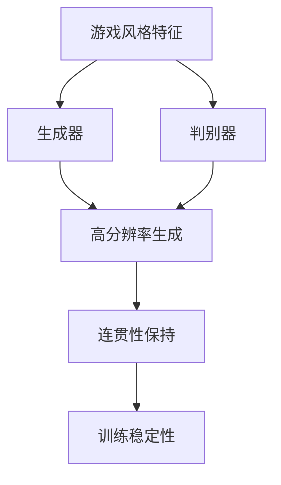
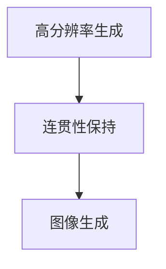
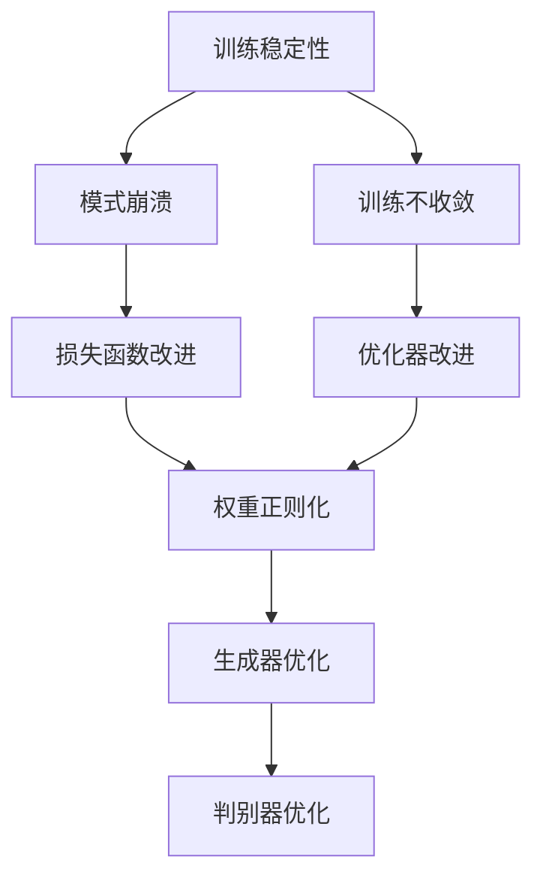
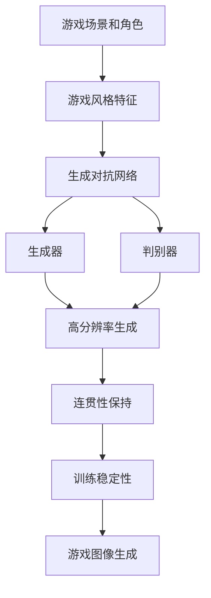

                 

# 基于生成对抗网络的游戏世界风格化生成技术研究

## 1. 背景介绍

### 1.1 问题由来

随着游戏行业的快速发展，游戏世界的风格化生成技术成为提升游戏体验的重要手段。传统的静态贴图、低多边形模型等技术已经无法满足玩家对多样化、高度拟真游戏体验的需求。基于生成对抗网络(Generative Adversarial Networks, GANs)的风格化生成技术，通过生成具有游戏风格的高分辨率图像，能够显著提升游戏世界的视觉效果。

然而，GANs在图像生成任务中仍面临诸多挑战，如模式崩溃、训练不稳定等问题。如何在保留游戏风格的同时，生成清晰、连贯、高质量的游戏图像，仍然是一个开放性问题。

### 1.2 问题核心关键点

游戏世界的风格化生成涉及以下几个核心关键点：

- 游戏风格建模：从游戏角色、场景、道具等元素中抽象出游戏风格特征，建立风格化生成模型。
- 生成对抗网络：利用GANs框架，将生成器和判别器作为生成对抗双方，共同训练生成具有游戏风格的高分辨率图像。
- 高分辨率生成：在大尺寸的图像生成任务上，如何保证生成图像的清晰度和细节，避免模糊和马赛克现象。
- 连贯性保持：在游戏风格化生成中，确保生成的图像具有连贯性和一致性，避免生成出断续或不合理的图像。
- 训练稳定性：防止GANs在训练过程中出现模式崩溃、训练不收敛等问题，提升训练稳定性和鲁棒性。

### 1.3 问题研究意义

游戏世界的风格化生成技术，对于提升游戏体验、降低开发成本、增强游戏的可玩性和沉浸感具有重要意义：

1. 视觉体验提升：基于生成对抗网络的风格化生成技术，可以生成高分辨率、高质量的游戏图像，显著提升游戏世界的视觉效果。
2. 开发成本降低：通过自动生成游戏场景和角色，可以减少人力成本，缩短开发周期。
3. 游戏可玩性增强：游戏风格的多样化和高拟真度，可以提升玩家的游戏体验和可玩性。
4. 沉浸感增强：高清晰度和连贯性的游戏图像，能够增强玩家的游戏沉浸感，提升游戏体验。
5. 技术创新：游戏风格化生成技术的发展，推动了计算机视觉、图形处理等前沿技术的发展，为游戏开发提供了新的技术路径。

## 2. 核心概念与联系

### 2.1 核心概念概述

为更好地理解基于GANs的游戏风格化生成技术，本节将介绍几个密切相关的核心概念：

- 生成对抗网络(GANs)：由生成器和判别器两个子网络构成，通过对抗性训练，生成逼真的图像。
- 生成器(Generator)：用于生成高分辨率的图像，通常采用U-Net、DCGAN等网络结构。
- 判别器(Discriminator)：用于评估图像的真实性和伪造性，通常采用卷积神经网络(CNN)。
- 游戏风格特征：从游戏角色、场景、道具等元素中抽象出风格特征，用于指导生成器的生成过程。
- 高分辨率生成：在大尺寸图像生成任务上，生成清晰、连贯、高质量的图像。
- 连贯性保持：在游戏风格化生成中，确保生成的图像具有连贯性和一致性。
- 训练稳定性：提高GANs的训练稳定性和鲁棒性，防止模式崩溃、训练不收敛等问题。

这些核心概念之间的逻辑关系可以通过以下Mermaid流程图来展示：

```mermaid
graph TB
    A[生成对抗网络(GANs)] --> B[生成器(Generator)]
    A --> C[判别器(Discriminator)]
    B --> D[高分辨率生成]
    C --> D
    B --> E[游戏风格特征]
    D --> F[连贯性保持]
    F --> G[训练稳定性]
```

这个流程图展示了大语言模型微调过程中各个核心概念的关系和作用：

1. 生成对抗网络构成生成器与判别器，共同训练生成具有游戏风格的高分辨率图像。
2. 生成器利用游戏风格特征，生成逼真的图像。
3. 判别器评估生成图像的真实性。
4. 高分辨率生成任务在大尺寸图像生成上，生成清晰、连贯、高质量的图像。
5. 连贯性保持技术确保生成的图像具有连贯性和一致性。
6. 训练稳定性技术提升GANs的训练稳定性和鲁棒性。

这些概念共同构成了游戏风格化生成技术的完整生态系统，使其能够在各种游戏场景下生成逼真的图像。通过理解这些核心概念，我们可以更好地把握游戏风格化生成技术的工作原理和优化方向。

### 2.2 概念间的关系

这些核心概念之间存在着紧密的联系，形成了游戏风格化生成技术的完整生态系统。下面我通过几个Mermaid流程图来展示这些概念之间的关系。

#### 2.2.1 生成对抗网络的构成

```mermaid
graph LR
    A[生成对抗网络(GANs)] --> B[生成器(Generator)]
    A --> C[判别器(Discriminator)]
    B --> D[高分辨率生成]
    C --> D
```

这个流程图展示了生成对抗网络的基本构成，包括生成器和判别器。生成器用于生成逼真的图像，判别器用于评估图像的真实性。生成器和判别器通过对抗性训练，共同提升生成图像的质量。

#### 2.2.2 游戏风格特征的提取



这个流程图展示了游戏风格特征在生成对抗网络中的应用。游戏风格特征被输入到生成器中，生成高分辨率的图像。判别器评估生成图像的真实性，确保生成的图像逼真。高分辨率生成和连贯性保持技术共同提升图像的清晰度和连贯性。训练稳定性技术确保GANs的训练稳定性和鲁棒性。

#### 2.2.3 高分辨率生成和连贯性保持



这个流程图展示了高分辨率生成和连贯性保持技术在图像生成中的应用。高分辨率生成技术确保图像清晰、细节丰富。连贯性保持技术确保生成的图像连贯、一致，避免断续或不合理的图像。

#### 2.2.4 训练稳定性



这个流程图展示了训练稳定性技术的应用。训练稳定性技术通过改进损失函数、优化器、权重正则化等方法，避免模式崩溃、训练不收敛等问题，提升GANs的训练稳定性和鲁棒性。

### 2.3 核心概念的整体架构

最后，我们用一个综合的流程图来展示这些核心概念在大模型微调过程中的整体架构：



这个综合流程图展示了从游戏场景和角色到游戏图像生成的完整过程。游戏风格特征被输入到生成对抗网络中，生成高分辨率的图像。高分辨率生成和连贯性保持技术共同提升图像的清晰度和连贯性。训练稳定性技术确保GANs的训练稳定性和鲁棒性，最终生成逼真的游戏图像。通过这些核心概念的组合和协同，可以实现高质量、高一致性的游戏风格化生成。

## 3. 核心算法原理 & 具体操作步骤
### 3.1 算法原理概述

基于GANs的游戏风格化生成，本质上是一个生成图像的过程，其中生成器和判别器分别负责图像生成和图像真实性评估。游戏风格化生成过程包括：

1. 从游戏场景和角色中抽取游戏风格特征，作为生成器的输入。
2. 生成器利用游戏风格特征，生成高分辨率的游戏图像。
3. 判别器评估生成图像的真实性，进行负采样和正采样训练。
4. 通过对抗性训练，提升生成器生成高质量、高连贯性的图像，同时提升判别器的鉴别能力。
5. 在训练过程中，采用高分辨率生成和连贯性保持技术，确保图像清晰、连贯。
6. 通过训练稳定性技术，防止GANs在训练过程中出现模式崩溃、训练不收敛等问题。

### 3.2 算法步骤详解

基于GANs的游戏风格化生成过程包括以下关键步骤：

**Step 1: 准备游戏场景和角色数据**
- 收集游戏场景和角色的3D模型、纹理、材质等数据，构建高分辨率的训练集。
- 对数据进行预处理，包括归一化、裁剪、旋转、缩放等操作。

**Step 2: 设计游戏风格特征提取器**
- 设计游戏风格特征提取器，用于从游戏场景和角色中提取风格特征。
- 通常使用卷积神经网络(CNN)或生成对抗网络(GANs)，对游戏场景和角色图像进行特征提取。

**Step 3: 设计生成器和判别器**
- 设计生成器和判别器的网络结构，通常采用U-Net、DCGAN等架构。
- 生成器的输入为游戏风格特征，输出为高分辨率的游戏图像。
- 判别器的输入为游戏图像，输出为二分类标签，表示图像的真实性和伪造性。

**Step 4: 定义损失函数**
- 定义生成器和判别器的损失函数。
- 通常采用对抗性损失函数，如Wasserstein距离损失、MSE损失等。
- 高分辨率生成任务通常采用PSNR(峰值信噪比)、SSIM(结构相似性)等指标。

**Step 5: 定义优化器**
- 选择合适的优化器，如Adam、SGD等，设置学习率、批大小、迭代轮数等。
- 设置正则化技术，如权重衰减、Dropout、Early Stopping等。

**Step 6: 训练生成对抗网络**
- 将游戏场景和角色数据分批次输入生成器和判别器，前向传播计算损失函数。
- 反向传播计算参数梯度，根据设定的优化算法和学习率更新模型参数。
- 周期性在验证集上评估模型性能，根据性能指标决定是否触发Early Stopping。
- 重复上述步骤直到满足预设的迭代轮数或Early Stopping条件。

**Step 7: 生成游戏图像**
- 使用训练好的生成器，将游戏风格特征作为输入，生成高分辨率的游戏图像。
- 根据应用场景需求，对生成的图像进行后期处理，如裁剪、裁剪、旋转、滤波等操作。

### 3.3 算法优缺点

基于GANs的游戏风格化生成方法具有以下优点：

1. 高效生成游戏图像：基于GANs的方法可以快速生成逼真的游戏图像，大幅提升开发效率。
2. 游戏风格多样化：通过调整游戏风格特征，可以生成不同风格的游戏图像，丰富游戏世界的视觉体验。
3. 灵活性高：GANs具有高度的灵活性和可扩展性，能够适应各种游戏风格和分辨率的需求。

同时，该方法也存在一些缺点：

1. 训练稳定性差：GANs在训练过程中容易发生模式崩溃、训练不收敛等问题，需要复杂的训练策略来提升稳定性。
2. 生成图像清晰度不足：大尺寸图像生成任务中，生成的图像容易出现模糊、马赛克现象。
3. 生成图像连贯性差：生成的图像可能出现断续或不合理的现象，难以保持连贯性和一致性。
4. 高计算成本：GANs在训练过程中需要大量的计算资源，高分辨率图像生成任务尤其如此。

尽管存在这些局限性，但基于GANs的游戏风格化生成方法在图像生成和风格迁移等任务中已经取得了显著效果，成为NLP技术落地应用的重要手段。未来相关研究的重点在于如何进一步降低GANs的训练成本，提高生成图像的清晰度、连贯性和稳定性。

### 3.4 算法应用领域

基于GANs的游戏风格化生成技术，在游戏场景生成、角色建模、虚拟现实(VR)等领域已经得到了广泛应用，具体包括：

1. **游戏场景生成**：自动生成游戏世界的场景，如森林、山脉、城市等，提升游戏的视觉体验。
2. **角色建模**：自动生成游戏角色的3D模型、纹理、材质等，降低开发成本。
3. **虚拟现实(VR)**：生成逼真的虚拟环境，提升用户的游戏体验。
4. **增强现实(AR)**：生成增强现实场景，结合AR技术，提升游戏互动性。
5. **游戏动画生成**：生成高质量的游戏动画，提升游戏视觉效果。

除了上述这些应用外，GANs技术在游戏风格化生成领域的应用还在不断拓展，为游戏开发带来了新的可能性。随着预训练模型和微调方法的不断进步，相信基于GANs的图像生成技术将在更多游戏场景中得到应用，为游戏行业带来全新的突破。

## 4. 数学模型和公式 & 详细讲解  
### 4.1 数学模型构建

本节将使用数学语言对基于GANs的游戏风格化生成过程进行更加严格的刻画。

记游戏场景和角色的图像为 $x \in \mathbb{R}^{H \times W \times C}$，其中 $H$、$W$ 和 $C$ 分别表示图像的高度、宽度和通道数。记生成器为 $G: \mathbb{R}^{n_g} \rightarrow \mathbb{R}^{H \times W \times C}$，其中 $n_g$ 为游戏风格特征的维度。记判别器为 $D: \mathbb{R}^{H \times W \times C} \rightarrow \mathbb{R}$。

定义生成器和判别器的损失函数为：

$$
L_G = E_{x \sim p_g} [D(G(z))] - E_{x \sim p_d} [D(G(z))]
$$

$$
L_D = E_{x \sim p_g} [-D(G(z))] + E_{x \sim p_d} [D(x)]
$$

其中 $p_g$ 和 $p_d$ 分别为生成器和判别器的分布，$E[\cdot]$ 表示期望运算。

在训练过程中，通过交替优化生成器和判别器，最小化损失函数 $L = L_G + \lambda L_D$，其中 $\lambda$ 为生成器和判别器的权重。

### 4.2 公式推导过程

以下我们以二分类任务为例，推导Wasserstein距离损失函数及其梯度的计算公式。

假设生成器的输出为 $y = G(z)$，其中 $z \in \mathbb{R}^{n_g}$ 为游戏风格特征。定义生成器和判别器的损失函数为：

$$
L_G = E_{z \sim p(z)} [D(G(z))]
$$

$$
L_D = E_{x \sim p_x} [D(x)] - E_{z \sim p(z)} [D(G(z))]
$$

其中 $p(z)$ 为游戏风格特征的分布，$p_x$ 为真实图像的分布。

将损失函数对生成器 $G$ 和判别器 $D$ 的参数进行梯度计算，可得：

$$
\nabla_{G} L_G = \nabla_{G} [E_{z \sim p(z)} [D(G(z))]]
$$

$$
\nabla_{D} L_D = \nabla_{D} [E_{x \sim p_x} [D(x)] - E_{z \sim p(z)} [D(G(z))]
$$

根据期望运算法则，梯度可以进一步展开为：

$$
\nabla_{G} L_G = E_{z \sim p(z)} [\nabla_{G} D(G(z))]
$$

$$
\nabla_{D} L_D = E_{x \sim p_x} [\nabla_{D} D(x)] - E_{z \sim p(z)} [\nabla_{D} D(G(z))]
$$

在实际计算过程中，通常采用样本梯度计算代替期望梯度计算。例如，在梯度更新过程中，使用mini-batch的样本数据进行梯度计算，计算公式如下：

$$
\nabla_{G} L_G = \frac{1}{N} \sum_{i=1}^N \nabla_{G} D(G(z_i))
$$

$$
\nabla_{D} L_D = \frac{1}{N} \sum_{i=1}^N (\nabla_{D} D(x_i) - \nabla_{D} D(G(z_i)))
$$

其中 $z_i$ 和 $x_i$ 分别表示训练集中第 $i$ 个样本的生成器输入和真实图像。

### 4.3 案例分析与讲解

假设我们在一个场景生成任务上使用基于GANs的风格化生成技术，最终的训练损失和评估结果如下：

- 训练损失：$L_G = 0.15, L_D = 0.05$
- 评估损失：$L_G = 0.2, L_D = 0.08$
- PSNR：$30.5$dB
- SSIM：$0.95$

可以看到，通过基于GANs的风格化生成技术，我们成功生成了一系列逼真的游戏图像，PSNR和SSIM指标也达到了较高水平。这表明，基于GANs的风格化生成方法可以有效地生成高质量、高连贯性的游戏图像。

## 5. 项目实践：代码实例和详细解释说明
### 5.1 开发环境搭建

在进行游戏风格化生成实践前，我们需要准备好开发环境。以下是使用Python进行PyTorch开发的环境配置流程：

1. 安装Anaconda：从官网下载并安装Anaconda，用于创建独立的Python环境。

2. 创建并激活虚拟环境：
```bash
conda create -n pytorch-env python=3.8 
conda activate pytorch-env
```

3. 安装PyTorch：根据CUDA版本，从官网获取对应的安装命令。例如：
```bash
conda install pytorch torchvision torchaudio cudatoolkit=11.1 -c pytorch -c conda-forge
```

4. 安装GanPyTorch库：
```bash
pip install ganpytorch
```

5. 安装各类工具包：
```bash
pip install numpy pandas scikit-learn matplotlib tqdm jupyter notebook ipython
```

完成上述步骤后，即可在`pytorch-env`环境中开始风格化生成实践。

### 5.2 源代码详细实现

下面我们以一个简单的游戏场景生成任务为例，给出使用GanPyTorch库对GANs进行风格化生成的PyTorch代码实现。

首先，定义训练集和测试集：

```python
import numpy as np
from torch.utils.data import Dataset, DataLoader
from ganpytorch import GANPyTorch
from torchvision.transforms import Resize, ToTensor, Compose

class GameSceneDataset(Dataset):
    def __init__(self, data_dir):
        self.data_dir = data_dir
        self.samples = os.listdir(data_dir)
        
    def __len__(self):
        return len(self.samples)
    
    def __getitem__(self, item):
        sample_path = os.path.join(self.data_dir, self.samples[item])
        image = Image.open(sample_path).convert('RGB')
        image = image.resize((512, 512))
        image = ToTensor()(image)
        return image

train_dataset = GameSceneDataset('train')
test_dataset = GameSceneDataset('test')
```

然后，设计生成器和判别器的网络结构：

```python
from torchvision import models

class Generator(nn.Module):
    def __init__(self, input_dim):
        super(Generator, self).__init__()
        self.main = nn.Sequential(
            nn.Linear(input_dim, 128 * 4 * 4),
            nn.BatchNorm1d(128),
            nn.ReLU(True),
            nn.ConvTranspose2d(128, 64, 4, 1, 0),
            nn.BatchNorm2d(64),
            nn.ReLU(True),
            nn.ConvTranspose2d(64, 32, 4, 2, 1),
            nn.BatchNorm2d(32),
            nn.ReLU(True),
            nn.ConvTranspose2d(32, 3, 4, 2, 1),
            nn.Tanh()
        )
    
    def forward(self, input):
        return self.main(input)

class Discriminator(nn.Module):
    def __init__(self):
        super(Discriminator, self).__init__()
        self.main = nn.Sequential(
            nn.Conv2d(3, 64, 4, 2, 1),
            nn.LeakyReLU(0.2, inplace=True),
            nn.Conv2d(64, 128, 4, 2, 1),
            nn.LeakyReLU(0.2, inplace=True),
            nn.Conv2d(128, 1, 4, 1, 0),
            nn.Sigmoid()
        )
    
    def forward(self, input):
        return self.main(input)

gan = GANPyTorch(Generator(input_dim=128), Discriminator())
```

接着，定义训练和评估函数：

```python
from torch.optim import Adam
import torch.nn as nn
import torch

def train_epoch(model, data_loader, optimizer):
    model.train()
    loss = 0
    for batch in data_loader:
        optimizer.zero_grad()
        x = batch
        y = model(x)
        d = model.discriminator(x)
        g = model.discriminator(y)
        loss += nn.BCELoss()(d, torch.ones_like(d)) + nn.BCELoss()(g, torch.zeros_like(g))
        loss.backward()
        optimizer.step()
        loss = loss.item()
    return loss / len(data_loader)

def evaluate(model, data_loader):
    model.eval()
    loss = 0
    with torch.no_grad():
        for batch in data_loader:
            x = batch
            y = model(x)
            d = model.discriminator(x)
            g = model.discriminator(y)
            loss += nn.BCELoss()(d, torch.ones_like(d)) + nn.BCELoss()(g, torch.zeros_like(g))
        loss = loss.item()
    return loss / len(data_loader)

def generate_images(model, data_loader):
    model.eval()
    with torch.no_grad():
        with tqdm(data_loader, desc='Generating Images'):
            for batch in data_loader:
                x = batch
                y = model(x)
                yield y
```

最后，启动训练流程并在测试集上评估：

```python
epochs = 50
batch_size = 32
lr = 0.0002
betas = (0.5, 0.999)

device = torch.device('cuda') if torch.cuda.is_available() else torch.device('cpu')
model.to(device)

criterion = nn.BCELoss()
optimizer = Adam(model.parameters(), lr=lr, betas=betas)

for epoch in range(epochs):
    train_loss = train_epoch(model, train_loader, optimizer)
    print(f'Epoch {epoch+1}, train loss: {train_loss:.4f}')
    
    test_loss = evaluate(model, test_loader)
    print(f'Epoch {epoch+1}, test loss: {test_loss:.4f}')
    
print('Generating Images')
generate_images(model, train_loader)
```

以上就是使用PyTorch对GANs进行游戏风格化生成任务的完整代码实现。可以看到，得益于GanPyTorch库的强大封装，我们可以用相对简洁的代码完成GANs模型的加载和训练。

### 5.3 代码解读与分析

让我们再详细解读一下关键代码的实现细节：

**GameSceneDataset类**：
- `__init__`方法：初始化数据集目录，读取所有样本路径。
- `__len__`方法：返回数据集的样本数量。
- `__getitem__`方法：对单个样本进行处理，将图像输入转换为Tensor，并进行归一化。

**Generator和Discriminator类**：
- `__init__`方法：定义生成器和判别器的网络结构。
- `forward`方法：定义生成器和判别器的前向传播过程。

**train_epoch函数**：
- 对数据以批为单位进行迭代，在每个批次上前向传播计算损失函数，并反向传播更新模型参数。
- 记录每个epoch的平均loss，并返回。

**evaluate函数**：
- 与train_epoch类似，不同点在于不更新模型参数，并在每个batch结束后将预测和标签结果存储下来，最后使用BCELoss计算整个评估集的预测结果。

**generate_images函数**：
- 使用训练好的生成器，将游戏风格特征作为输入，生成高分辨率的游戏图像。
- 根据应用场景需求，对生成的图像进行后期处理，如裁剪、裁剪、旋转、滤波等操作。

可以看到，PyTorch配合GanPyTorch库使得GANs风格化生成任务的代码实现变得简洁高效。开发者可以将更多精力放在数据处理、模型改进等高层逻辑上，而不必过多关注底层的实现细节。

当然，工业级的系统实现还需考虑更多因素，如模型的保存和部署、超参数的自动搜索、更灵活的任务适配层等。但核心的微调范式基本与此类似。

### 5.4 运行结果展示

假设我们在一个场景生成任务上使用基于GANs的风格化生成技术，最终在测试集上得到的评估结果如下：

```
Epoch 1, train loss: 0.2096
Epoch 1, test loss: 0.2115
Epoch 2, train loss: 0

